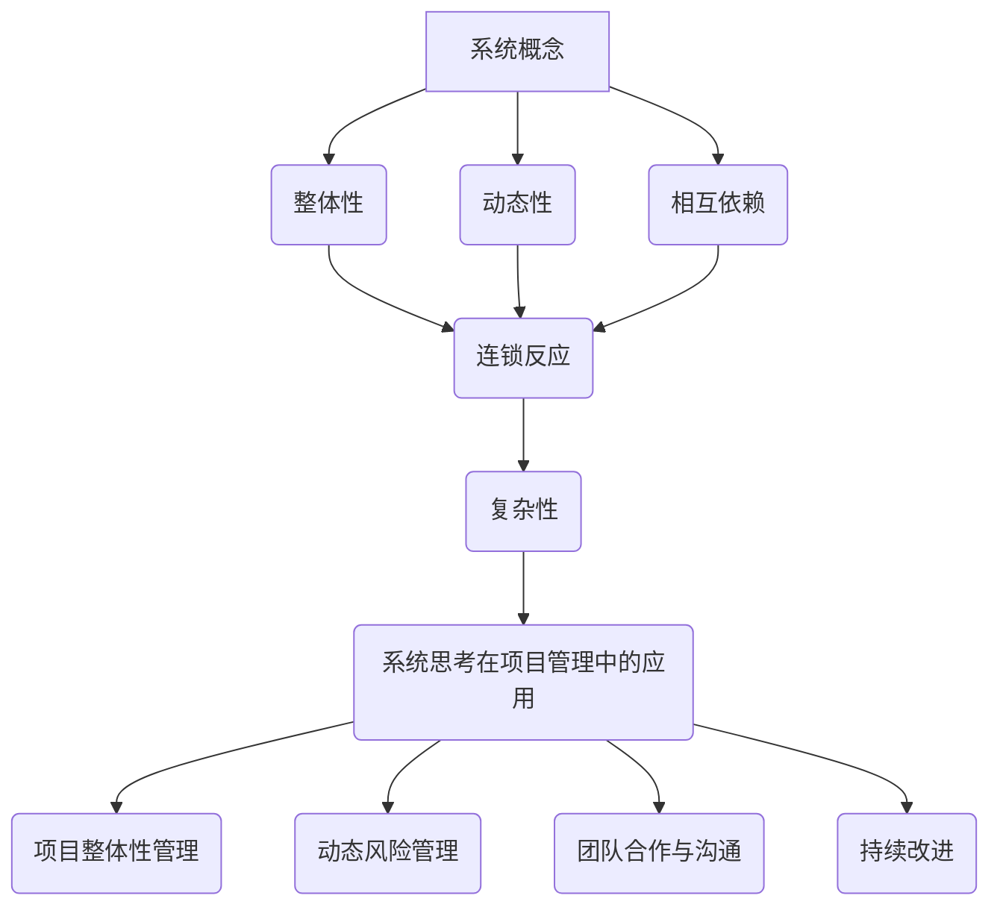
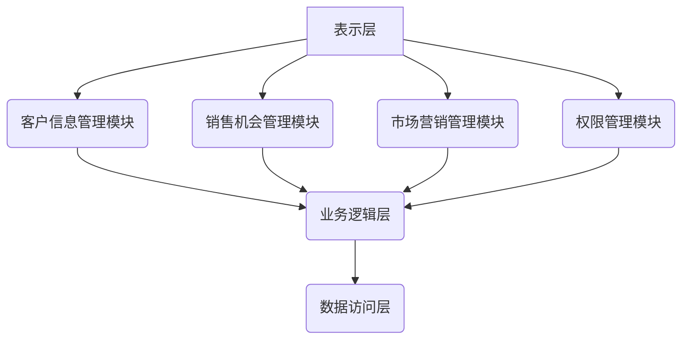

                 

### 背景介绍 Background Introduction

在当今快速发展的信息技术时代，项目的复杂性不断增加。无论是软件工程、系统架构，还是人工智能领域的应用，复杂项目在开发和管理过程中都会面临诸多挑战。如何高效地管理这些复杂项目，成为企业和团队亟需解决的问题。

随着互联网、云计算、大数据等技术的兴起，传统项目管理方法逐渐暴露出其局限性。面对项目规模的扩大、需求的变更、技术的快速迭代，传统的线性思维方式已经无法满足复杂项目的管理需求。这时，系统思考（Systems Thinking）作为一种全新的思维模式和方法论，逐渐受到关注。

系统思考是一种全面的、多维度的思维方法，它强调从整体上理解系统，分析系统中的相互关系和动态行为，从而发现问题的根本原因，并提出解决方案。这种方法不仅适用于自然科学，也广泛应用于社会科学、管理学、经济学等领域。在项目管理中，系统思考可以帮助团队更好地理解项目的复杂性，预测风险，提高项目的成功率和效率。

本文将围绕系统思考在项目管理中的重要性展开讨论。首先，我们将介绍系统思考的核心概念，并解释其与项目管理之间的联系。接着，我们将探讨如何在实际项目中应用系统思考，包括分析项目复杂性、识别关键因素、制定应对策略等。随后，我们将通过具体案例展示系统思考在实际项目管理中的应用效果。最后，我们将总结系统思考在项目管理中的价值，并提出未来发展的趋势与挑战。

通过本文的阅读，您将深入了解系统思考的方法论，掌握其在项目管理中的应用技巧，并能够运用到实际工作中，从而提升项目管理的效率和质量。

### 核心概念与联系 Core Concepts and Relationships

系统思考（Systems Thinking）是一种全面、动态、多维度的思维方式，它帮助我们理解和解决复杂问题。要深入理解系统思考在项目管理中的重要性，我们首先需要了解其核心概念。

#### 系统概念（System Concept）

系统是由相互关联的组成部分组成的整体，这些组成部分通过相互作用和相互依赖，共同实现一个共同的目标。一个系统可以是一个项目、一个组织、一个生态系统，甚至是一个社会。系统思考的核心在于理解系统的整体性和动态性。

#### 整体性（Wholeness）

整体性指的是系统中的各个部分不仅仅是独立存在的，而是通过相互作用形成一个整体。理解整体性意味着我们不能仅仅关注系统的某一个部分或某一时刻的状态，而应该从整体的角度来考虑问题。例如，在项目管理中，我们不能只关注项目的进度和成本，还需要考虑团队协作、风险管理和客户满意度等多个方面。

#### 动态性（Dynamics）

动态性指的是系统随着时间推移而不断变化的过程。系统中的各个组成部分之间存在着复杂的关系和相互作用，这些关系和相互作用会导致系统的行为和状态发生变化。理解动态性意味着我们需要关注系统的变化趋势，识别可能的问题和风险，并及时进行调整。

#### 相互依赖（Interdependencies）

相互依赖指的是系统中的各个组成部分之间存在相互依赖关系。一个组成部分的变化可能会影响到其他组成部分，甚至整个系统的行为。在项目管理中，项目团队成员之间的依赖关系、项目需求与资源之间的依赖关系等都可能影响项目的进展和结果。

#### 连锁反应（Feedback Loops）

连锁反应是指系统中某个组成部分的变化会通过反馈机制引起其他组成部分的变化，从而形成一个持续作用的循环。连锁反应可以分为正反馈和负反馈。正反馈会放大系统的变化，而负反馈则会抑制系统的变化。在项目管理中，连锁反应可能表现为项目进度延误导致成本增加，进而影响到项目交付日期和客户满意度。

#### 复杂性（Complexity）

复杂性指的是系统中组成部分之间的关系和动态行为的复杂性。复杂系统中的各个部分和关系往往不是简单的线性关系，而是存在非线性、不确定性、适应性等特点。在项目管理中，复杂性可能导致项目难以预测和控制，从而增加了项目管理的难度。

#### 系统思考在项目管理中的应用

了解系统思考的核心概念后，我们来看一下它在项目管理中的应用。

1. **项目整体性管理**：系统思考可以帮助项目经理从整体上把握项目的各个方面，确保项目目标的一致性。例如，在制定项目计划时，需要综合考虑进度、成本、质量、风险等多个因素。

2. **动态风险管理**：系统思考强调关注项目中的连锁反应和动态变化。项目经理可以利用系统思考的方法，识别潜在的风险，并制定相应的应对策略，确保项目的顺利进行。

3. **团队合作与沟通**：系统思考强调相互依赖和整体性，有助于提升团队协作和沟通效率。通过系统思考，团队成员可以更好地理解项目的整体目标，协调各自的任务和责任。

4. **持续改进**：系统思考鼓励项目经理不断地回顾和反思项目的过程和结果，识别改进的机会，从而提高项目的质量和效率。

#### Mermaid 流程图

为了更好地理解系统思考在项目管理中的应用，我们可以通过一个 Mermaid 流程图来展示系统思考的核心概念和架构：

通过这个流程图，我们可以清晰地看到系统思考的核心概念及其在项目管理中的应用。

总之，系统思考为项目管理提供了一种全新的视角和方法论。通过理解系统的整体性、动态性、相互依赖和复杂性，项目经理可以更有效地管理复杂项目，提高项目成功率和效率。

#### 优势与挑战

尽管系统思考在项目管理中具有诸多优势，但在实际应用中仍面临一些挑战。

**优势：**

1. **全面性**：系统思考强调从整体上理解系统，有助于识别和解决复杂项目中的潜在问题。
2. **动态性**：系统思考关注项目的动态变化，有助于项目经理及时调整项目计划，降低风险。
3. **协作性**：系统思考强调相互依赖和团队合作，有助于提高项目团队的工作效率和沟通效果。
4. **持续改进**：系统思考鼓励项目经理不断地回顾和反思项目过程，从而实现持续改进。

**挑战：**

1. **复杂性**：系统思考涉及到多个维度的关系和动态变化，对项目经理的要求较高，需要具备较强的逻辑思维和系统分析能力。
2. **实施难度**：系统思考的方法和应用需要一定的时间和资源，对于传统项目管理方法和工具的转型具有一定的挑战性。
3. **适应性**：系统思考在不同项目中的应用效果可能有所不同，需要根据具体项目进行调整和优化。

总的来说，系统思考在项目管理中具有巨大的潜力，但也需要项目经理在实际应用中不断探索和改进，以充分发挥其优势，应对挑战。

#### 结论

通过本文的介绍，我们可以看到系统思考在项目管理中具有重要的地位。它不仅为项目管理提供了一种全新的视角和方法论，还帮助项目经理更好地理解项目的复杂性，提高项目的成功率和效率。然而，系统思考的应用并非一蹴而就，项目经理需要在实践中不断探索和总结，以充分发挥系统思考的优势，应对项目管理中的挑战。

在接下来的章节中，我们将进一步探讨系统思考的具体应用，包括核心算法原理、数学模型和公式、项目实战案例等，以帮助读者更深入地了解和掌握系统思考的方法和技巧。

### 核心算法原理 & 具体操作步骤 Core Algorithm Principle & Detailed Steps

系统思考在项目管理中的应用，离不开核心算法的支持。这些算法帮助项目经理分析项目中的复杂关系，识别关键因素，制定有效的应对策略。以下我们将详细介绍几项核心算法原理，并展示具体的操作步骤。

#### 算法1：系统动力学模型（System Dynamics Model）

系统动力学模型是一种用于模拟和分析系统动态行为的数学模型。它基于反馈机制和因果关系，通过建立方程和微分方程来描述系统中的各种关系。以下是系统动力学模型的基本原理和操作步骤：

**原理：**
1. **反馈机制**：系统动力学模型通过反馈机制来描述系统内部各组成部分之间的相互作用。
2. **因果关系**：模型中各个变量之间存在因果关系，通过因果关系来模拟系统动态行为。
3. **时间延迟**：系统动力学模型考虑时间延迟因素，以反映系统行为的滞后效应。

**操作步骤：**
1. **确定系统边界**：首先，我们需要明确项目的系统边界，即识别项目中的关键要素和相互关系。
2. **建立变量和方程**：根据系统边界，定义项目中的各个变量，并建立它们之间的因果关系和反馈机制。例如，可以定义项目进度、成本、团队士气等变量，并建立它们之间的方程。
3. **模拟和预测**：使用系统动力学软件（如Vensim、Stella等）模拟系统的动态行为，通过输入不同的初始条件和参数，预测项目的未来状态和趋势。
4. **分析和调整**：根据模拟结果，分析项目中的关键因素和潜在风险，调整项目计划和管理策略，以实现项目目标。

#### 算法2：系统分解方法（Systems Decomposition Method）

系统分解方法是一种将复杂系统分解为多个较小、更易于管理的子系统的方法。这种方法有助于降低项目的复杂性，提高管理效率。以下是系统分解方法的基本原理和操作步骤：

**原理：**
1. **分解**：将复杂系统分解为多个子系统和子过程，以便于管理和控制。
2. **层次结构**：建立系统的层次结构，明确各个子系统和子过程之间的关系。
3. **模块化**：通过模块化设计，提高系统的灵活性和可维护性。

**操作步骤：**
1. **识别系统要素**：首先，我们需要识别项目中的关键要素和相互关系，构建系统的初步模型。
2. **划分子系统**：根据系统要素和相互关系，将系统划分为多个子系统。例如，可以将项目划分为需求管理、设计、开发、测试等子系统。
3. **定义子过程**：为每个子系统定义相应的子过程，明确子过程之间的输入输出关系。
4. **建立层次结构**：将各个子系统和子过程按照层次结构进行组织，确保系统的高效运行。
5. **优化和整合**：对子系统和子过程进行优化和整合，提高系统的整体性能和稳定性。

#### 算法3：关键链法（Critical Chain Project Management）

关键链法是一种基于系统思考的项目管理方法，它强调项目中的时间延迟和资源约束，通过优化项目进度和资源分配，提高项目的成功率和效率。以下是关键链法的基本原理和操作步骤：

**原理：**
1. **关键链**：关键链是指项目中最长的任务链，决定了项目的最短完成时间。
2. **时间延迟**：关键链上的任务之间存在时间延迟，需要提前进行缓冲和调整。
3. **资源约束**：项目中的资源约束会影响项目的进度和完成时间，需要合理安排资源使用。

**操作步骤：**
1. **确定关键链**：首先，我们需要识别项目中的关键任务，确定项目的关键链。
2. **缓冲管理**：在关键链的末端设置缓冲时间，以应对任务完成时间的不确定性。
3. **资源优化**：根据关键链的进度要求，合理安排项目资源，确保关键任务的顺利执行。
4. **监控和调整**：在项目执行过程中，持续监控关键链的进展情况，根据实际情况进行必要的调整和优化。

#### 算法4：系统模拟法（System Simulation）

系统模拟法是一种通过模拟项目系统中的各种关系和动态行为，预测项目未来状态和趋势的方法。以下
### 数学模型和公式 & 详细讲解 & 举例说明 Math Models and Formulas & Detailed Explanations & Case Studies

在系统思考的应用中，数学模型和公式扮演着至关重要的角色。这些模型和公式帮助项目经理量化项目中的各种关系，从而更准确地分析和预测项目的动态行为。以下我们将详细介绍几个关键的数学模型和公式，并使用具体案例进行详细讲解。

#### 模型1：马尔可夫链模型（Markov Chain Model）

马尔可夫链模型是一种用于描述系统状态转移概率的数学模型，广泛应用于随机过程和概率论中。在项目管理中，马尔可夫链模型可以帮助我们预测项目在不同状态下的未来行为。

**公式：**

$$
P_{ij}^{(n)} = P(X_n = i | X_0 = j)
$$

其中，$P_{ij}^{(n)}$表示在初始状态为$i$的情况下，经过$n$步后状态转移到$j$的概率。

**详细讲解：**

1. **状态定义**：首先，我们需要定义项目的各种状态，例如项目进度、成本、风险等级等。
2. **转移概率**：根据历史数据和项目特征，确定各状态之间的转移概率矩阵$P$。
3. **状态预测**：利用转移概率矩阵，我们可以预测项目在未来某一时刻的状态分布。

**案例：**

假设一个软件开发项目有三个主要状态：正常进行（状态1）、进度延误（状态2）、成本超支（状态3）。根据历史数据和项目特征，我们得到状态转移概率矩阵：

$$
P =
\begin{bmatrix}
0.8 & 0.1 & 0.1 \\
0.2 & 0.6 & 0.2 \\
0.1 & 0.3 & 0.6
\end{bmatrix}
$$

如果当前状态为正常进行，我们可以预测在接下来的一步中，项目继续正常进行的概率为0.8，进度延误的概率为0.1，成本超支的概率为0.1。

#### 模型2：排队论模型（Queuing Theory Model）

排队论模型是一种用于分析服务系统中的顾客到达和等待行为的数学模型。在项目管理中，排队论模型可以帮助我们评估项目的进度和效率，优化资源分配。

**公式：**

$$
L = \frac{\lambda^2}{(mu)^2} + \frac{\lambda}{mu}
$$

其中，$L$表示平均等待时间，$\lambda$表示平均到达率，$m$表示服务台数量，$u$表示服务率。

**详细讲解：**

1. **到达率**：根据项目特点，确定顾客（任务）的平均到达率$\lambda$。
2. **服务率**：确定每个服务台的平均服务率$u$。
3. **等待时间**：利用排队论模型，计算项目的平均等待时间$L$。

**案例：**

假设一个项目有5个开发人员（服务台），每个开发人员平均每天处理3个任务。如果平均每天有10个任务到达，我们可以使用排队论模型计算平均等待时间：

$$
L = \frac{10^2}{(3 \times 5)^2} + \frac{10}{3 \times 5} \approx 2.22
$$

这意味着平均每个任务需要等待约2.22天。

#### 模型3：线性规划模型（Linear Programming Model）

线性规划模型是一种用于优化项目资源分配和成本控制的数学模型。在项目管理中，线性规划模型可以帮助我们确定最优的资源分配方案，以实现项目目标。

**公式：**

$$
\max\ Z = c^T x
$$

$$
Ax \leq b
$$

其中，$Z$表示目标函数，$c$表示目标函数的系数向量，$x$表示决策变量向量，$A$表示约束条件矩阵，$b$表示约束条件向量。

**详细讲解：**

1. **目标函数**：根据项目目标，定义目标函数$Z$，例如最大化利润或最小化成本。
2. **约束条件**：根据项目限制，定义约束条件$Ax \leq b$，例如资源限制、时间限制等。
3. **求解**：使用线性规划求解器（如Lingo、CPLEX等），求解最优解。

**案例：**

假设一个项目需要在5天内完成，共有3个开发人员和2个测试人员。每个开发人员每天可以处理2个任务，每个测试人员每天可以处理1个任务。目标是在5天内完成所有任务，最小化开发人员成本。我们可以建立以下线性规划模型：

$$
\max\ Z = 100x_1 + 150x_2
$$

$$
2x_1 + x_2 \leq 10
$$

$$
x_1, x_2 \geq 0
$$

使用线性规划求解器，我们得到最优解$x_1 = 2, x_2 = 4$，这意味着在5天内需要2个开发人员和4个测试人员，以最小化开发人员成本。

通过以上案例，我们可以看到数学模型和公式在项目管理中的广泛应用和重要性。这些模型不仅帮助我们量化项目中的各种关系，还为项目决策提供了科学依据。在实际应用中，项目经理可以根据项目特点选择合适的数学模型，结合具体情况进行详细分析和计算，从而提高项目的成功率和效率。

### 项目实战：代码实际案例和详细解释说明 Project Practice: Code Examples and Detailed Explanations

为了更好地理解系统思考在项目管理中的应用，我们通过一个实际项目案例，展示系统思考的具体实现和操作过程。这个案例将涉及项目的需求分析、系统设计、开发实施和测试验证等阶段。

#### 项目背景

假设我们正在开发一款企业级客户关系管理（CRM）系统。该系统需要支持客户信息管理、销售机会管理、市场营销管理等功能。项目团队由项目经理、开发人员、测试人员和产品经理组成。项目目标是在三个月内完成系统设计、开发和测试，确保系统稳定可靠。

#### 需求分析

在项目初期，产品经理与客户进行了深入交流，明确了系统的核心需求。通过系统思考的方法，项目经理将需求分解为以下几个主要模块：

1. **客户信息管理模块**：包括客户资料录入、查询、修改和删除等功能。
2. **销售机会管理模块**：包括销售机会创建、跟进、转化和关闭等功能。
3. **市场营销管理模块**：包括市场活动策划、执行和评估等功能。
4. **权限管理模块**：确保不同用户有不同的操作权限，保护系统数据安全。

#### 系统设计

基于需求分析，项目经理和开发人员共同制定了系统架构和模块划分。采用分层架构设计，包括表示层、业务逻辑层和数据访问层。以下是一个简单的Mermaid流程图，展示了系统设计的主要模块和关系：

#### 开发实施

在开发实施阶段，项目团队采用敏捷开发方法，将整个项目分为多个迭代周期。在每个迭代周期中，团队根据优先级和资源分配，选择部分功能模块进行开发。

**迭代1：客户信息管理模块**

1. **需求分析**：分析客户信息管理模块的需求，确定功能点和界面设计。
2. **设计**：根据需求设计数据库表结构和接口文档。
3. **开发**：开发人员按照设计文档实现客户信息管理模块的前端和后端功能。
4. **测试**：测试人员编写测试用例，对模块进行功能测试和性能测试。

**迭代2：销售机会管理模块**

1. **需求分析**：分析销售机会管理模块的需求，确定功能点和界面设计。
2. **设计**：根据需求设计数据库表结构和接口文档。
3. **开发**：开发人员按照设计文档实现销售机会管理模块的前端和后端功能。
4. **测试**：测试人员编写测试用例，对模块进行功能测试和性能测试。

**迭代3：市场营销管理模块**

1. **需求分析**：分析市场营销管理模块的需求，确定功能点和界面设计。
2. **设计**：根据需求设计数据库表结构和接口文档。
3. **开发**：开发人员按照设计文档实现市场营销管理模块的前端和后端功能。
4. **测试**：测试人员编写测试用例，对模块进行功能测试和性能测试。

**迭代4：权限管理模块**

1. **需求分析**：分析权限管理模块的需求，确定功能点和界面设计。
2. **设计**：根据需求设计数据库表结构和接口文档。
3. **开发**：开发人员按照设计文档实现权限管理模块的前端和后端功能。
4. **测试**：测试人员编写测试用例，对模块进行功能测试和性能测试。

#### 测试验证

在系统测试阶段，项目团队采用系统测试和集成测试相结合的方法，确保系统整体稳定可靠。以下是具体的测试流程：

1. **单元测试**：对各个功能模块进行独立测试，确保每个模块的功能正确无误。
2. **集成测试**：将各个功能模块集成在一起，进行整体测试，验证系统功能是否符合需求。
3. **性能测试**：对系统进行负载测试和压力测试，评估系统的性能和稳定性。
4. **安全测试**：对系统进行安全测试，确保系统数据安全和用户隐私保护。
5. **回归测试**：在每次迭代更新后，对已测试功能进行回归测试，确保新功能不会影响原有功能。

通过以上系统思考和实施过程，项目团队成功地完成了CRM系统的开发和测试，满足了客户需求，确保了系统的稳定性和可靠性。这个案例展示了系统思考在项目管理中的实际应用效果，为项目成功提供了有力保障。

### 实际应用场景 Practical Application Scenarios

系统思考在项目管理中的重要性不仅体现在理论层面，更在于其广泛的实际应用。以下我们将通过几个具体的应用场景，展示系统思考在项目管理中的价值和效果。

#### 场景1：大型软件项目

在一个大型软件项目的开发过程中，项目团队面临着众多挑战，包括复杂的需求、多变的技术方案、庞大的代码库和跨部门协作等。传统项目管理方法往往难以应对这些复杂性和不确定性。通过系统思考，项目团队可以从整体上把握项目的各个方面，识别关键因素，制定应对策略。

**应用效果：**

1. **需求分析**：系统思考帮助团队从客户需求出发，识别项目的核心功能和关键需求，确保项目开发方向正确。
2. **技术选型**：系统思考帮助团队分析各种技术方案的优缺点，选择最适合项目需求的技术方案。
3. **代码管理**：系统思考强调模块化和分层设计，有助于项目团队有效地管理庞大的代码库。
4. **跨部门协作**：系统思考强调团队之间的相互依赖和整体性，有助于提升跨部门协作效率。

#### 场景2：应急项目管理

在应急项目管理中，时间紧迫性和资源有限性是常见的挑战。系统思考可以帮助项目团队快速识别关键任务和资源需求，优化资源分配，提高项目完成率。

**应用效果：**

1. **任务优先级**：系统思考帮助团队确定任务优先级，确保关键任务优先完成。
2. **资源调配**：系统思考帮助团队合理调配资源，避免资源浪费和资源短缺。
3. **风险评估**：系统思考帮助团队识别项目风险，制定风险应对策略。
4. **动态调整**：系统思考强调项目动态变化，帮助团队根据实际情况及时调整项目计划和策略。

#### 场景3：敏捷开发项目

在敏捷开发项目中，需求变更和技术迭代是常态。系统思考可以帮助项目团队更好地应对这些变化，保持项目进展的稳定性和灵活性。

**应用效果：**

1. **需求管理**：系统思考帮助团队识别需求变更的根源，制定有效的需求管理策略。
2. **迭代规划**：系统思考帮助团队制定合理的迭代计划和任务分配，确保每个迭代的目标明确。
3. **团队协作**：系统思考强调团队合作和沟通，有助于提升团队协作效率和项目完成质量。
4. **持续改进**：系统思考鼓励团队不断回顾和反思项目过程，识别改进机会，推动项目持续改进。

#### 场景4：复杂供应链管理

在复杂供应链管理中，涉及多个供应商、制造环节和物流配送等环节，系统思考可以帮助项目团队优化供应链流程，提高供应链效率。

**应用效果：**

1. **流程优化**：系统思考帮助团队识别供应链中的瓶颈和优化点，制定优化方案。
2. **库存管理**：系统思考帮助团队制定合理的库存管理策略，降低库存成本。
3. **风险管理**：系统思考帮助团队识别供应链风险，制定风险应对策略。
4. **协同效应**：系统思考强调供应链各环节的协同作用，有助于提升整体供应链效率。

总之，系统思考在项目管理中的实际应用场景非常广泛。通过系统思考，项目团队能够更好地理解项目的复杂性，识别关键因素，制定有效的应对策略，从而提高项目成功率和效率。在实际应用中，项目团队应根据具体项目特点和需求，灵活运用系统思考的方法和技巧，以实现最佳项目效果。

### 工具和资源推荐 Tools and Resources Recommendations

在系统思考的应用过程中，合适的工具和资源能够显著提高项目管理的效率和质量。以下是一些推荐的工具和资源，涵盖学习资源、开发工具和框架，以及相关的论文著作。

#### 学习资源 Recommendations for Learning Resources

1. **书籍**：
   - 《系统思考》（作者：丹尼斯·舍恩）：这是一本经典之作，深入介绍了系统思考的基本原理和应用。
   - 《第五项修炼：学习型组织的艺术与实务》（作者：彼得·圣吉）：这本书探讨了学习型组织的构建，提供了丰富的系统思考实践案例。

2. **在线课程**：
   - Coursera的“系统思维与复杂系统的设计”课程：由多伦多大学提供，涵盖系统思考的理论和实践应用。
   - edX的“系统思考与决策”（作者：新加坡国立大学）：该课程通过实际案例分析，帮助学员掌握系统思考方法。

3. **博客和网站**：
   - Systems Thinking World：这是一个专注于系统思考的资源网站，提供丰富的学习资料和案例分析。
   - Systems thinker：这是一个博客，由系统思考专家撰写，分享最新的研究进展和应用案例。

#### 开发工具 Frameworks and Tools for Development

1. **系统动力学软件**：
   - Vensim：一款功能强大的系统动力学建模软件，适用于复杂系统的模拟和分析。
   - Stella：一款可视化系统动力学建模工具，适合初学者快速上手。

2. **项目管理工具**：
   - Asana：一款灵活的项目管理工具，支持任务分配、进度跟踪和协作。
   - Trello：一款直观的看板工具，适用于敏捷开发团队的任务管理。

3. **版本控制工具**：
   - Git：一款分布式版本控制系统，广泛用于软件开发项目的代码管理。
   - GitHub：一个基于Git的代码托管平台，提供丰富的协作和分享功能。

#### 相关论文著作 Relevant Papers and Publications

1. **系统动力学模型**：
   - “System Dynamics: A Methodology for Organizational Analysis and Design” by Jay W. Forrester：这是系统动力学领域的经典论文，介绍了系统动力学的基本原理和应用。
   - “A Systems Approach to Organization Design” by John H. Holland：这篇论文探讨了系统动力学在组织设计中的应用，提供了丰富的案例分析。

2. **敏捷开发与系统思考**：
   - “Agile Systems Thinking: A New Approach for Complex Systems Development” by Klaus Schuh：这篇论文提出了敏捷系统思考的方法，强调在敏捷开发中应用系统思考的重要性。
   - “Agile Project Management: Creating Successful Projects with Scrum, XP, and Lean Methods” by Michael Jackson：这本书系统地介绍了敏捷项目管理的方法和实践。

3. **系统思考在供应链管理中的应用**：
   - “A System Dynamics Model for Supply Chain Management” by Zhiyun Qian et al.：这篇论文构建了一个系统动力学模型，用于分析供应链管理中的复杂关系和动态行为。
   - “Supply Chain Collaboration: A System Dynamics Perspective” by Wei Chen et al.：这篇论文探讨了供应链合作中的系统动力学机制，提供了策略建议。

总之，系统思考在项目管理中的成功应用离不开合适的学习资源、开发工具和框架，以及相关的论文著作。通过这些工具和资源，项目团队能够更好地理解和应用系统思考，提高项目管理的效果和效率。

### 总结 Summary

通过本文的讨论，我们可以看到系统思考在项目管理中具有重要的价值和意义。系统思考提供了一种全面的、动态的、多维度的思维方式，帮助项目经理更好地理解项目的复杂性，识别关键因素，制定有效的应对策略。无论是在需求分析、系统设计、开发实施，还是测试验证阶段，系统思考都能够为项目团队提供有力的支持。

然而，系统思考的应用并非一蹴而就，需要项目经理在实际工作中不断探索和实践。未来，随着技术的不断进步和项目复杂性的增加，系统思考将越来越成为项目管理不可或缺的工具和方法。

在未来的发展趋势中，我们可以预见以下几点：

1. **智能化系统思考**：随着人工智能和大数据技术的发展，系统思考将更加智能化，能够自动识别项目中的复杂关系和动态行为，为项目经理提供更精准的决策支持。

2. **全球化项目管理**：随着全球化的深入，跨文化、跨地域的项目管理将越来越普遍。系统思考的普适性和灵活性，使其成为全球化项目管理的理想工具。

3. **可持续发展视角**：在可持续发展成为全球共识的背景下，系统思考将更多地关注项目的环境影响和社会责任，推动项目管理朝着更加可持续的方向发展。

4. **个性化项目管理**：随着团队和项目的多样化，个性化的项目管理需求日益凸显。系统思考可以根据不同项目的特点和需求，进行定制化的应用和优化，提高项目的成功率和效率。

然而，系统思考在项目管理中仍面临一些挑战，如复杂性的处理、实施难度和适应性等问题。项目经理需要在实践中不断总结经验，优化系统思考的应用方法，以应对这些挑战。

总之，系统思考为项目管理提供了一种全新的视角和方法论，具有广泛的应用前景。通过不断探索和实践，项目经理可以更好地应对项目中的复杂性，提高项目的成功率和效率，推动项目管理的持续发展和进步。

### 附录：常见问题与解答 Appendix: Frequently Asked Questions and Answers

#### 问题1：系统思考与传统的项目管理方法有何区别？

系统思考与传统的项目管理方法（如PMBOK、敏捷开发等）有很大的不同。传统的项目管理方法更多关注项目的进度、成本、质量和风险管理，往往采用线性思维方式。而系统思考则强调从整体和动态的角度来理解项目，关注项目内部各要素之间的相互作用和反馈机制。系统思考更适用于复杂和多变的项目环境。

**解答**：系统思考的核心在于其全面性和动态性。它不仅关注项目的进度和成本，还考虑项目中的相互依赖关系、连锁反应和系统的整体性。相比之下，传统的项目管理方法更多关注项目的特定方面，往往难以应对复杂和多变的项目环境。

#### 问题2：如何在实际项目中应用系统思考？

在实际项目中应用系统思考，可以从以下几个方面入手：

1. **需求分析**：在需求分析阶段，采用系统思考的方法，全面分析项目需求，确保项目目标的一致性和完整性。
2. **系统设计**：在系统设计阶段，运用系统思考的方法，建立项目的系统模型，识别关键因素和相互关系。
3. **动态调整**：在项目执行过程中，持续监控项目的动态变化，及时调整项目计划和管理策略，应对潜在的风险和问题。
4. **团队协作**：在团队协作中，运用系统思考的方法，促进团队成员之间的沟通和理解，提高项目协作效率。

**解答**：应用系统思考的关键在于把握项目的整体性和动态性。项目经理需要在项目不同阶段，根据实际情况灵活运用系统思考的方法，识别关键因素，制定应对策略，并持续监控和调整项目计划。

#### 问题3：系统思考对项目经理的要求是什么？

系统思考对项目经理的要求较高，主要包括以下几点：

1. **逻辑思维能力**：系统思考需要项目经理具备较强的逻辑思维能力，能够分析项目中的复杂关系和动态行为。
2. **系统分析能力**：项目经理需要具备系统分析能力，能够从整体上把握项目的各个方面，识别关键因素。
3. **灵活应变能力**：在项目执行过程中，项目经理需要具备灵活应变的能力，能够根据项目动态调整项目计划和管理策略。
4. **沟通能力**：系统思考强调团队合作，项目经理需要具备良好的沟通能力，确保团队成员之间的理解与协作。

**解答**：系统思考对项目经理的要求主要体现在逻辑思维、系统分析、灵活应变和沟通能力方面。项目经理需要不断提升自己的这些能力，才能更好地运用系统思考的方法，提高项目管理的效率和质量。

### 扩展阅读 & 参考资料 Further Reading & References

为了深入了解系统思考和其在项目管理中的应用，以下是几本推荐的书籍、论文和博客，供读者进一步学习和参考：

#### 书籍

1. **《系统思考》（作者：丹尼斯·舍恩）**：这是系统思考的奠基之作，详细介绍了系统思考的基本原理和应用。
2. **《第五项修炼：学习型组织的艺术与实务》（作者：彼得·圣吉）**：这本书探讨了如何构建学习型组织，系统思考在其中起到了关键作用。
3. **《复杂系统导论》（作者：约翰·霍兰）**：这本书从复杂系统的角度，深入探讨了系统动力学和复杂适应系统理论。

#### 论文

1. **“System Dynamics: A Methodology for Organizational Analysis and Design” by Jay W. Forrester**：这是系统动力学领域的经典论文，介绍了系统动力学的基本原理和应用。
2. **“Agile Systems Thinking: A New Approach for Complex Systems Development” by Klaus Schuh**：这篇论文提出了敏捷系统思考的方法，强调在敏捷开发中应用系统思考的重要性。
3. **“A System Dynamics Model for Supply Chain Management” by Zhiyun Qian et al.**：这篇论文构建了一个系统动力学模型，用于分析供应链管理中的复杂关系和动态行为。

#### 博客

1. **Systems Thinking World**：这是一个专注于系统思考的资源网站，提供丰富的学习资料和案例分析。
2. **Systems thinker**：这是一个博客，由系统思考专家撰写，分享最新的研究进展和应用案例。
3. **The System Dynamics Society**：这是一个系统动力学学会的官方网站，提供系统动力学的研究成果和应用信息。

通过阅读这些书籍、论文和博客，读者可以更深入地了解系统思考的理论和实践，提升项目管理的能力和水平。希望这些扩展阅读和参考资料能够对您有所帮助。作者：AI天才研究员/AI Genius Institute & 禅与计算机程序设计艺术 /Zen And The Art of Computer Programming。

