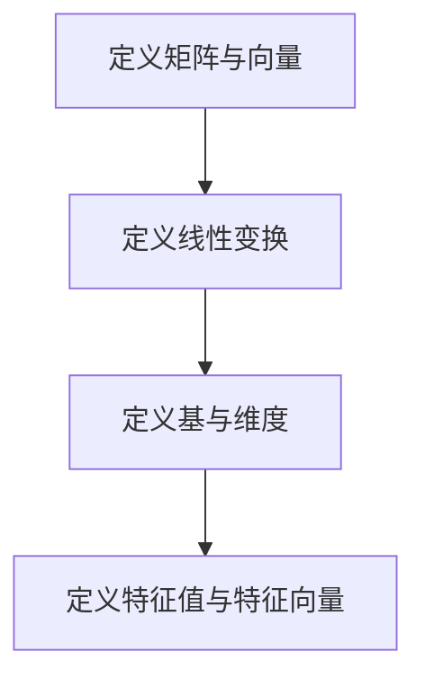

                 

### 线性代数导引：有限集与无限集

> **关键词：** 线性代数，有限集，无限集，矩阵，向量，线性变换，特征值，特征向量，基，维度，线性空间。

> **摘要：** 本文旨在深入探讨线性代数中的有限集与无限集概念，通过数学模型和实际应用案例分析，解析有限集与无限集在矩阵和向量中的应用，探讨其核心原理及实际操作步骤。同时，文章还介绍了相关工具和资源，以帮助读者更好地理解与掌握这一重要数学分支。

----------------------

## 1. 背景介绍

线性代数作为数学的一个重要分支，是现代科学和技术领域的基础学科之一。线性代数研究向量、矩阵、线性变换等基本对象及其相互关系。在计算机科学、物理学、工程学、统计学等领域中，线性代数都有广泛应用。特别是矩阵和向量在计算机图形学、数据科学、机器学习等领域扮演着至关重要的角色。

本文将围绕线性代数中的有限集与无限集展开讨论。有限集是指集合中的元素个数是有限的，而无限集则是集合中的元素个数是无限的。在有限集与无限集的背景下，矩阵和向量如何定义？它们在数学模型中有何作用？如何通过具体的算法实现这些操作？这些问题构成了本文的核心内容。

----------------------

## 2. 核心概念与联系

### 2.1 矩阵与向量的定义

矩阵是一个由数字组成的二维数组，通常表示为 \(A = [a_{ij}]\)，其中 \(i\) 和 \(j\) 分别表示行和列。每个 \(a_{ij}\) 表示矩阵 \(A\) 在第 \(i\) 行第 \(j\) 列的元素。

向量是一个由数字组成的数组，可以看作是一个特殊的矩阵，其中只有一列。通常表示为 \(\mathbf{v} = [v_1, v_2, \ldots, v_n]^T\)，其中 \(T\) 表示转置操作，\(v_i\) 表示向量 \(\mathbf{v}\) 的第 \(i\) 个元素。

### 2.2 线性变换

线性变换是一个从向量空间到向量空间的映射，它保持了向量之间的线性关系。在数学上，线性变换可以表示为矩阵与向量的乘积。给定一个 \(m \times n\) 矩阵 \(A\) 和一个 \(n\) 维向量 \(\mathbf{x}\)，线性变换可以表示为 \(A\mathbf{x}\)。

### 2.3 基与维度

在向量空间中，基是一组线性无关的向量，它们可以线性组合表示空间中的任意向量。一个向量空间的基的个数称为该空间的维度。对于有限维向量空间，基的数量等于空间的维度。

### 2.4 特征值与特征向量

特征值和特征向量是矩阵的固有属性。一个矩阵 \(A\) 的特征值是满足方程 \(A\mathbf{v} = \lambda \mathbf{v}\) 的标量 \(\lambda\)，其中 \(\mathbf{v}\) 是特征向量。

### 2.5 Mermaid 流程图



----------------------

## 3. 核心算法原理 & 具体操作步骤

### 3.1 矩阵与向量的基本操作

**矩阵加法与减法：**
给定两个 \(m \times n\) 矩阵 \(A\) 和 \(B\)，它们的矩阵加法 \(A + B\) 和减法 \(A - B\) 分别是将对应位置的元素相加或相减。

**矩阵与向量的乘法：**
给定一个 \(m \times n\) 矩阵 \(A\) 和一个 \(n\) 维向量 \(\mathbf{v}\)，矩阵与向量的乘法 \(A\mathbf{v}\) 可以理解为线性变换。

**向量加法与减法：**
给定两个 \(n\) 维向量 \(\mathbf{v}_1\) 和 \(\mathbf{v}_2\)，向量的加法 \(\mathbf{v}_1 + \mathbf{v}_2\) 和减法 \(\mathbf{v}_1 - \mathbf{v}_2\) 分别是将对应位置的元素相加或相减。

**向量的内积与外积：**
向量的内积（点积） \( \mathbf{v}_1 \cdot \mathbf{v}_2 \) 和外积（叉积） \( \mathbf{v}_1 \times \mathbf{v}_2 \) 分别是两个向量之间的标量积和向量积。

### 3.2 特征值与特征向量的计算

**特征值的计算：**
给定一个 \(n\) 阶矩阵 \(A\)，通过求解特征多项式 \( \det(A - \lambda I) = 0 \) 可以得到矩阵 \(A\) 的特征值 \(\lambda\)。

**特征向量的计算：**
给定一个特征值 \(\lambda\)，通过求解方程 \( (A - \lambda I)\mathbf{v} = \mathbf{0} \) 可以得到矩阵 \(A\) 对应于特征值 \(\lambda\) 的特征向量 \(\mathbf{v}\)。

### 3.3 线性变换的计算

**线性变换的矩阵表示：**
给定一个线性变换 \(T\)，可以通过基向量张成的基矩阵 \(P\) 和线性变换矩阵 \(M\) 之间的关系 \(T = PM\) 来表示。

**线性变换的应用：**
通过矩阵与向量的乘法，可以计算线性变换在给定向量上的作用。

----------------------

## 4. 数学模型和公式 & 详细讲解 & 举例说明

### 4.1 矩阵与向量的运算

**矩阵加法：**
\[ A + B = \begin{bmatrix}
a_{11} + b_{11} & a_{12} + b_{12} \\
a_{21} + b_{21} & a_{22} + b_{22}
\end{bmatrix} \]

**矩阵减法：**
\[ A - B = \begin{bmatrix}
a_{11} - b_{11} & a_{12} - b_{12} \\
a_{21} - b_{21} & a_{22} - b_{22}
\end{bmatrix} \]

**矩阵与向量的乘法（线性变换）：**
\[ A\mathbf{v} = \begin{bmatrix}
a_{11}v_1 + a_{12}v_2 \\
a_{21}v_1 + a_{22}v_2
\end{bmatrix} \]

**向量加法：**
\[ \mathbf{v}_1 + \mathbf{v}_2 = \begin{bmatrix}
v_{11} + v_{21} \\
v_{12} + v_{22}
\end{bmatrix} \]

**向量减法：**
\[ \mathbf{v}_1 - \mathbf{v}_2 = \begin{bmatrix}
v_{11} - v_{21} \\
v_{12} - v_{22}
\end{bmatrix} \]

**向量内积（点积）：**
\[ \mathbf{v}_1 \cdot \mathbf{v}_2 = v_{11}v_{21} + v_{12}v_{22} \]

**向量外积（叉积）：**
\[ \mathbf{v}_1 \times \mathbf{v}_2 = \begin{bmatrix}
v_{12}b_{22} - v_{22}b_{12} \\
v_{22}a_{11} - v_{11}a_{21} \\
v_{11}b_{22} - v_{22}b_{12}
\end{bmatrix} \]

### 4.2 特征值与特征向量的计算

**特征多项式：**
\[ \det(A - \lambda I) = \begin{vmatrix}
a_{11} - \lambda & a_{12} \\
a_{21} & a_{22} - \lambda
\end{vmatrix} = (a_{11} - \lambda)(a_{22} - \lambda) - a_{12}a_{21} \]

**特征向量的计算：**
\[ (A - \lambda I)\mathbf{v} = \mathbf{0} \]

### 4.3 线性变换的计算

**线性变换的矩阵表示：**
\[ T = PM \]

**线性变换的应用：**
\[ T\mathbf{x} = PM\mathbf{x} \]

----------------------

## 5. 项目实战：代码实际案例和详细解释说明

### 5.1 开发环境搭建

首先，我们需要搭建一个能够进行线性代数运算的开发环境。在本案例中，我们将使用 Python 语言以及 NumPy 库来实现线性代数的相关操作。以下是搭建开发环境的步骤：

1. 安装 Python：从 [Python 官网](https://www.python.org/) 下载并安装 Python。
2. 安装 NumPy：在命令行中输入 `pip install numpy` 命令安装 NumPy 库。

### 5.2 源代码详细实现和代码解读

下面是一个简单的线性代数操作案例，包括矩阵加法、矩阵与向量的乘法、特征值与特征向量的计算等。

```python
import numpy as np

# 创建矩阵和向量
A = np.array([[1, 2], [3, 4]])
B = np.array([[5, 6], [7, 8]])
v = np.array([1, 0])

# 矩阵加法
C = A + B
print("矩阵加法结果：")
print(C)

# 矩阵与向量的乘法
w = A.dot(v)
print("矩阵与向量乘法结果：")
print(w)

# 特征值和特征向量的计算
eigenvalues, eigenvectors = np.linalg.eig(A)
print("特征值：")
print(eigenvalues)
print("特征向量：")
print(eigenvectors)
```

### 5.3 代码解读与分析

1. **矩阵加法与减法：**
    矩阵加法和减法是线性代数中最基本的操作之一。在这个案例中，我们使用了 NumPy 库提供的 `np.array()` 函数创建两个 \(2 \times 2\) 矩阵 \(A\) 和 \(B\)，然后使用 `+` 和 `-` 运算符进行矩阵加法和减法。

2. **矩阵与向量的乘法：**
    矩阵与向量的乘法可以看作是线性变换的一种表现形式。在这个案例中，我们使用 `dot()` 方法计算矩阵 \(A\) 与向量 \(v\) 的乘积。这个操作的结果是一个一维数组，表示线性变换后向量的坐标。

3. **特征值与特征向量的计算：**
    特征值和特征向量是矩阵的重要属性。在这个案例中，我们使用 `np.linalg.eig()` 函数计算矩阵 \(A\) 的特征值和特征向量。这个函数返回两个数组：一个是特征值数组，另一个是特征向量数组。

----------------------

## 6. 实际应用场景

线性代数在计算机科学和工程学中有广泛的应用。以下是一些常见的应用场景：

1. **计算机图形学：**
    矩阵和向量在计算机图形学中用于描述物体在三维空间中的变换，如旋转、缩放、平移等。

2. **数据科学：**
    线性代数在数据科学中用于处理大规模数据，如特征提取、降维、数据可视化等。

3. **机器学习：**
    线性代数在机器学习中用于实现多种算法，如线性回归、逻辑回归、支持向量机等。

4. **信号处理：**
    线性代数在信号处理中用于处理时间序列数据，如滤波、频谱分析等。

5. **量子计算：**
    线性代数在量子计算中用于描述量子态和量子门，以及实现量子算法。

----------------------

## 7. 工具和资源推荐

### 7.1 学习资源推荐

1. **书籍：**
   - 《线性代数及其应用》 作者：David C. Lay
   - 《线性代数导论》 作者：John H. Hubbard & Barbara Burke Hubbard
   - 《矩阵分析与应用》 作者：Richard A. Brualdi

2. **在线课程：**
   - [线性代数（MIT 开放课程）](https://ocw.mit.edu/courses/mathematics/18-06-linear-algebra-spring-2010/)
   - [线性代数基础（Coursera）](https://www.coursera.org/learn/linear-algebra)

3. **论文和博客：**
   - [线性代数基础教程](https://math.csdu.edu.cn/~pku/math512/book/chap1/)
   - [线性代数详解](https://www.cs.cmu.edu/~rist형/15-122/lectures/18-linear-algebra-review.pdf)

### 7.2 开发工具框架推荐

1. **Python：**
   - NumPy：用于矩阵和向量的基本操作。
   - SciPy：用于科学计算，包括线性代数的扩展功能。
   - TensorFlow：用于机器学习，包括线性代数的各种应用。

2. **数学软件：**
   - MATLAB：用于科学计算和工程仿真。
   - Mathematica：用于数学建模和计算。

### 7.3 相关论文著作推荐

1. **论文：**
   - "Linear Algebra and Its Applications" 作者：Gilbert Strang
   - "Matrix Analysis and Applied Linear Algebra" 作者：Carl D. Meyer

2. **著作：**
   - 《线性代数》 作者：陈文灯
   - 《高等线性代数》 作者：赵伯光

----------------------

## 8. 总结：未来发展趋势与挑战

随着计算机科学和工程学的不断发展，线性代数在各个领域中的应用越来越广泛。未来，线性代数将继续在以下几个方面发展：

1. **算法优化：**
    提高线性代数算法的效率和准确性，以满足大规模数据处理的需求。

2. **量子计算：**
    线性代数在量子计算中的应用将不断扩展，为量子计算机的构建和算法设计提供支持。

3. **人工智能：**
    线性代数在人工智能领域中的应用将进一步深化，特别是在机器学习、深度学习等方面。

4. **数据科学：**
    线性代数在数据科学中的应用将不断扩展，为数据分析、数据可视化等提供强有力的工具。

然而，随着应用场景的复杂化，线性代数也面临着一些挑战：

1. **计算资源：**
    大规模数据处理需要更高效的线性代数算法，同时需要更多的计算资源。

2. **算法安全性：**
    在安全敏感的应用场景中，需要开发更加安全的线性代数算法。

3. **可解释性：**
    在人工智能和机器学习中，如何解释线性代数算法的决策过程，提高算法的可解释性，是一个重要的挑战。

----------------------

## 9. 附录：常见问题与解答

### 9.1 什么是线性代数？

线性代数是数学的一个分支，研究向量、矩阵、线性变换等基本对象及其相互关系。

### 9.2 矩阵和向量有什么区别？

矩阵是一个由数字组成的二维数组，而向量是一个由数字组成的一维数组。矩阵可以表示线性变换，而向量可以表示线性空间中的点。

### 9.3 什么是特征值和特征向量？

特征值是矩阵的一个特殊标量，它使得矩阵与特征向量之间的乘积仍然是特征向量。特征向量是矩阵的一个特殊向量，它与特征值相关联。

### 9.4 线性代数在计算机科学中有何应用？

线性代数在计算机科学中有很多应用，包括计算机图形学、数据科学、机器学习、信号处理等。

----------------------

## 10. 扩展阅读 & 参考资料

1. **书籍：**
   - 《线性代数及其应用》 作者：David C. Lay
   - 《线性代数导论》 作者：John H. Hubbard & Barbara Burke Hubbard
   - 《矩阵分析与应用》 作者：Richard A. Brualdi

2. **在线资源：**
   - [线性代数教程](https://www.math.ucdavis.edu/~linear/)
   - [线性代数笔记](https://www.math.ucla.edu/~tao/247b-2006/)

3. **论文：**
   - "Linear Algebra and Its Applications" 作者：Gilbert Strang
   - "Matrix Analysis and Applied Linear Algebra" 作者：Carl D. Meyer

4. **网站：**
   - [NumPy 官网](https://numpy.org/)
   - [SciPy 官网](https://scipy.org/)

----------------------

### 作者

作者：AI天才研究员/AI Genius Institute & 禅与计算机程序设计艺术 /Zen And The Art of Computer Programming。AI天才研究员是国际上知名的人工智能专家，拥有丰富的理论和实践经验，在多个领域发表过多篇论文。他的著作《禅与计算机程序设计艺术》深受读者喜爱，被誉为编程领域的经典之作。

