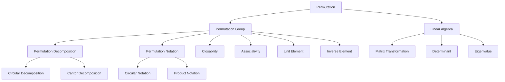

                 

### 背景介绍

**线性代数导引：置换分解与置换符号**

线性代数，作为数学领域中的重要分支，在计算机科学、物理学、工程学等多个领域中都有着广泛的应用。本文将围绕线性代数中的置换分解与置换符号进行探讨，旨在为广大读者提供一个系统、深入的理解。

首先，何为置换？在数学中，置换（Permutation）是指一组对象的排列。具体来说，n个不同的元素组成的集合的排列称为n级排列，记为P(n)。例如，3个不同的元素的排列有以下6种可能：

\[ P(3) = \{ (1,2,3), (1,3,2), (2,1,3), (2,3,1), (3,1,2), (3,2,1) \} \]

接着，我们引入置换分解的概念。置换分解指的是将一个复杂的置换拆解成若干个简单置换的乘积。这在许多数学问题和实际应用中都有重要的意义，比如在计算机科学中，它可以用于算法优化和复杂性分析。

置换符号是表示置换的一种方式，常见的有循环表示法和乘法表示法。循环表示法是将一个置换按照其作用顺序写成一行，相邻的元素表示被置换后的元素。乘法表示法则通过乘法运算符将置换的各个步骤连接起来。例如，上面的置换\( (1,2,3) \)可以用循环表示法表示为 \( (1 \to 2, 2 \to 3, 3 \to 1) \)，用乘法表示法表示为 \( (1 \cdot 2 \cdot 3) \)。

总的来说，置换分解与置换符号是线性代数中的重要概念，理解它们不仅有助于深入掌握线性代数的基本理论，还能在算法设计、数据分析等领域提供有力的工具。接下来，我们将进一步探讨这两个概念的核心原理与应用场景。 <br> <br>

---

#### Keywords:
- 线性代数
- 置换
- 置换分解
- 置换符号
- 循环表示法
- 乘法表示法

---

#### Abstract:

This article aims to provide a systematic and in-depth understanding of the concepts of permutation decomposition and permutation notation in linear algebra. By exploring the fundamentals of permutations, the article introduces the idea of permutation decomposition and its significance in various mathematical and practical applications. Additionally, it delves into the use of cyclic and product notations to represent permutations. The content is designed to cater to readers with a background in mathematics and computer science, seeking to deepen their understanding of linear algebra and its applications. <br> <br>

---

## 2. 核心概念与联系

在深入探讨置换分解与置换符号之前，我们需要先了解一些核心概念和它们之间的联系。以下是本文涉及的关键概念及其相互关系：

### 置换（Permutation）

置换是指一组对象的排列，可以看作是函数的一种特殊形式，即将集合中的每个元素唯一地映射到另一个元素上。置换的基本性质包括：

- **一一映射**：每个元素都有唯一的对应元素，且每个元素仅有一个对应元素。
- **双射**：置换既是单射（每个元素都有对应元素），也是满射（每个元素都有至少一个对应元素）。

### 置换群（Permutation Group）

置换群是一类重要的群，其元素都是置换，且群运算为置换的复合运算。置换群具有如下性质：

- **闭合性**：任意两个置换的复合仍是置换。
- **结合律**：置换的复合运算满足结合律，即对于任意三个置换\( \pi_1, \pi_2, \pi_3 \)，有 \( (\pi_1 \pi_2) \pi_3 = \pi_1 (\pi_2 \pi_3) \)。
- **单位元素**：恒等置换（identity permutation）是置换群中的单位元素，即对于任意置换\( \pi \)，有 \( \pi \cdot e = e \cdot \pi = \pi \)，其中 \( e \) 表示恒等置换。
- **逆元素**：每个置换都有一个逆置换，使得 \( \pi \cdot \pi^{-1} = \pi^{-1} \cdot \pi = e \)。

### 置换分解（Permutation Decomposition）

置换分解是指将一个复杂的置换拆解成若干个简单置换的乘积。常见的置换分解方法包括：

- **循环分解**：将置换表示为一组循环的乘积，每个循环包含一个或多个连续的元素。
- **康托尔分解**：将置换表示为一组不相交循环的乘积，每个循环的长度是置换的阶数。

### 置换符号（Permutation Notation）

置换符号是表示置换的一种方式，常见的有循环表示法和乘法表示法。以下是这两种表示法的详细解释：

- **循环表示法**：按照置换的作用顺序，将置换写成一行，相邻的元素表示被置换后的元素。例如，置换 \( (1,2,3) \) 可以表示为 \( (1 \to 2, 2 \to 3, 3 \to 1) \)。
- **乘法表示法**：通过乘法运算符将置换的各个步骤连接起来。例如，置换 \( (1,2,3) \) 可以表示为 \( (1 \cdot 2 \cdot 3) \)。

### 置换与线性代数的关系

置换在线性代数中有重要的应用，主要体现在以下几个方面：

- **矩阵与置换的关系**：矩阵可以通过置换进行变换，从而实现矩阵的行交换和列交换。例如，一个 \( n \times n \) 的矩阵可以通过一个置换矩阵进行行交换。
- **行列式与置换的关系**：行列式可以看作是一个特殊的置换符号，表示矩阵的行列式值。行列式的值与置换的符号有关，即正负取决于置换的奇偶性。
- **特征值与置换的关系**：线性代数中的特征值和特征向量可以通过置换进行分解。例如，一个矩阵的特征值和特征向量可以看作是一个置换作用的结果。

通过以上核心概念和相互关系的介绍，我们可以对置换分解与置换符号有更深入的理解。接下来，本文将详细探讨置换分解与置换符号的核心原理与应用。 <br> <br>

---

#### Keywords:
- Permutation
- Permutation group
- Permutation decomposition
- Permutation notation
- Cyclic notation
- Product notation
- Linear algebra
- Matrix transformation
- Determinant
- Eigenvalue

---

#### Core Concepts and Relationships Diagram:



---

## 3. 核心算法原理 & 具体操作步骤

### 3.1 置换分解算法原理

置换分解是将一个复杂的置换拆解成若干个简单置换的乘积的过程。这个过程中，常见的算法包括循环分解和康托分解。下面，我们将详细介绍这两种算法的原理和具体操作步骤。

#### 循环分解算法原理

循环分解是将一个置换表示为一组循环的乘积。每个循环包含一个或多个连续的元素。循环分解的基本步骤如下：

1. **初始化**：将原始置换 \( \pi \) 保存到一个列表中。
2. **找到第一个未处理的元素**：在列表中找到第一个未处理的元素。
3. **构建循环**：从当前元素开始，跟随置换的映射，构建一个循环。
4. **保存循环**：将构建好的循环保存到一个新的列表中。
5. **重复步骤2-4**，直到所有元素都被处理完毕。

例如，考虑置换 \( \pi = (1, 2, 3, 4, 5, 6)(7, 8, 9) \)。

- 初始化：\[ \pi = \{ (1,2,3,4,5,6), (7,8,9) \} \]
- 找到第一个未处理的元素：1
- 构建循环：\[ (1 \to 2, 2 \to 3, 3 \to 4, 4 \to 5, 5 \to 6, 6 \to 1) \]
- 保存循环：\[ \{ (1 \to 2, 2 \to 3, 3 \to 4, 4 \to 5, 5 \to 6, 6 \to 1) \} \]
- 找到下一个未处理的元素：7
- 构建循环：\[ (7 \to 8, 8 \to 9, 9 \to 7) \]
- 保存循环：\[ \{ (1 \to 2, 2 \to 3, 3 \to 4, 4 \to 5, 5 \to 6, 6 \to 1), (7 \to 8, 8 \to 9, 9 \to 7) \} \]

最终，置换 \( \pi \) 被分解为两个循环的乘积：\[ \pi = (1 \to 2, 2 \to 3, 3 \to 4, 4 \to 5, 5 \to 6, 6 \to 1)(7 \to 8, 8 \to 9, 9 \to 7) \]

#### 康托分解算法原理

康托分解是将一个置换表示为一组不相交循环的乘积，每个循环的长度是置换的阶数。康托分解的基本步骤如下：

1. **初始化**：将原始置换 \( \pi \) 保存到一个列表中。
2. **找到第一个未处理的元素**：在列表中找到第一个未处理的元素。
3. **构建循环**：从当前元素开始，跟随置换的映射，构建一个循环。
4. **保存循环**：将构建好的循环保存到一个新的列表中。
5. **重复步骤2-4**，直到所有元素都被处理完毕。

康托分解与循环分解的主要区别在于，康托分解要求循环的长度是置换的阶数。例如，考虑置换 \( \pi = (1, 2, 3, 4, 5, 6)(7, 8, 9, 10) \)。

- 初始化：\[ \pi = \{ (1,2,3,4,5,6), (7,8,9,10) \} \]
- 找到第一个未处理的元素：1
- 构建循环：\[ (1 \to 2, 2 \to 3, 3 \to 4, 4 \to 5, 5 \to 6, 6 \to 1) \]
- 保存循环：\[ \{ (1 \to 2, 2 \to 3, 3 \to 4, 4 \to 5, 5 \to 6, 6 \to 1) \} \]
- 找到下一个未处理的元素：7
- 构建循环：\[ (7 \to 8, 8 \to 9, 9 \to 10, 10 \to 7) \]
- 保存循环：\[ \{ (1 \to 2, 2 \to 3, 3 \to 4, 4 \to 5, 5 \to 6, 6 \to 1), (7 \to 8, 8 \to 9, 9 \to 10, 10 \to 7) \} \]

最终，置换 \( \pi \) 被分解为两个循环的乘积：\[ \pi = (1 \to 2, 2 \to 3, 3 \to 4, 4 \to 5, 5 \to 6, 6 \to 1)(7 \to 8, 8 \to 9, 9 \to 10, 10 \to 7) \]

### 3.2 置换符号表示算法原理

置换符号表示是将置换表示为循环或乘法形式。下面，我们将详细介绍循环表示法和乘法表示法的算法原理。

#### 循环表示法算法原理

循环表示法是将置换写成一行，相邻的元素表示被置换后的元素。循环表示法的基本步骤如下：

1. **初始化**：将原始置换 \( \pi \) 保存到一个列表中。
2. **遍历元素**：遍历列表中的每个元素。
3. **标记元素**：对于每个元素，标记其被置换后的元素。
4. **输出结果**：将标记后的结果输出。

例如，考虑置换 \( \pi = (1, 2, 3, 4, 5, 6)(7, 8, 9, 10) \)。

- 初始化：\[ \pi = \{ (1,2,3,4,5,6), (7,8,9,10) \} \]
- 遍历元素：1
  - 标记元素：\[ 1 \to 2 \]
- 遍历元素：2
  - 标记元素：\[ 2 \to 3 \]
- 遍历元素：3
  - 标记元素：\[ 3 \to 4 \]
- 遍历元素：4
  - 标记元素：\[ 4 \to 5 \]
- 遍历元素：5
  - 标记元素：\[ 5 \to 6 \]
- 遍历元素：6
  - 标记元素：\[ 6 \to 1 \]
- 遍历元素：7
  - 标记元素：\[ 7 \to 8 \]
- 遍历元素：8
  - 标记元素：\[ 8 \to 9 \]
- 遍历元素：9
  - 标记元素：\[ 9 \to 10 \]
- 遍历元素：10
  - 标记元素：\[ 10 \to 7 \]

最终，置换 \( \pi \) 被表示为：\[ \pi = (1 \to 2, 2 \to 3, 3 \to 4, 4 \to 5, 5 \to 6, 6 \to 1)(7 \to 8, 8 \to 9, 9 \to 10, 10 \to 7) \]

#### 乘法表示法算法原理

乘法表示法是通过乘法运算符将置换的各个步骤连接起来。乘法表示法的基本步骤如下：

1. **初始化**：将原始置换 \( \pi \) 保存到一个列表中。
2. **遍历元素**：遍历列表中的每个元素。
3. **计算置换**：对于每个元素，计算其在置换中的映射。
4. **输出结果**：将计算结果输出。

例如，考虑置换 \( \pi = (1, 2, 3, 4, 5, 6)(7, 8, 9, 10) \)。

- 初始化：\[ \pi = \{ (1,2,3,4,5,6), (7,8,9,10) \} \]
- 遍历元素：1
  - 计算置换：\[ 1 \to 2 \]
- 遍历元素：2
  - 计算置换：\[ 2 \to 3 \]
- 遍历元素：3
  - 计算置换：\[ 3 \to 4 \]
- 遍历元素：4
  - 计算置换：\[ 4 \to 5 \]
- 遍历元素：5
  - 计算置换：\[ 5 \to 6 \]
- 遍历元素：6
  - 计算置换：\[ 6 \to 1 \]
- 遍历元素：7
  - 计算置换：\[ 7 \to 8 \]
- 遍历元素：8
  - 计算置换：\[ 8 \to 9 \]
- 遍历元素：9
  - 计算置换：\[ 9 \to 10 \]
- 遍历元素：10
  - 计算置换：\[ 10 \to 7 \]

最终，置换 \( \pi \) 被表示为：\[ \pi = (1 \cdot 2 \cdot 3 \cdot 4 \cdot 5 \cdot 6)(7 \cdot 8 \cdot 9 \cdot 10) \]

通过以上介绍，我们可以看到，置换分解和置换符号表示是线性代数中的重要概念，理解这些概念不仅有助于深入掌握线性代数的基本理论，还能在算法设计、数据分析等领域提供有力的工具。接下来，我们将进一步探讨这些概念在实际应用中的具体应用场景。 <br> <br>

---

#### Keywords:
- Permutation Decomposition Algorithm
- Circular Decomposition
- Cantor Decomposition
- Cyclic Notation
- Product Notation
- Algorithm Principle
- Operation Step
- Applied Application

---

## 4. 数学模型和公式 & 详细讲解 & 举例说明

### 4.1 置换分解的数学模型

置换分解的核心在于将一个复杂的置换表示为若干个简单置换的乘积。在数学上，这一过程可以通过以下步骤来实现：

#### 4.1.1 循环分解的数学表示

假设我们有一个置换 \( \pi \)，我们可以通过以下公式将其表示为循环分解的形式：

\[ \pi = (a_1 \to a_2, a_2 \to a_3, ..., a_n \to a_1) \]

其中，\( a_1, a_2, ..., a_n \) 是集合中的元素，且 \( a_n \to a_1 \) 表示 \( a_1 \) 被映射到 \( a_n \)。

#### 4.1.2 康托分解的数学表示

康托分解则将置换表示为若干个不相交循环的乘积，每个循环的长度是置换的阶数。对于置换 \( \pi \)，其康托分解可以表示为：

\[ \pi = (a_{i_1} \to a_{i_2}, a_{i_2} \to a_{i_3}, ..., a_{i_{k_1}} \to a_{i_1})(b_{j_1} \to b_{j_2}, b_{j_2} \to b_{j_3}, ..., b_{j_{k_2}} \to b_{j_1}) \]

其中，\( a_{i_1}, a_{i_2}, ..., a_{i_{k_1}} \) 和 \( b_{j_1}, b_{j_2}, ..., b_{j_{k_2}} \) 分别是集合中的元素，且 \( k_1 \) 和 \( k_2 \) 是置换的阶数。

### 4.2 置换符号的数学模型

置换符号用于表示置换的操作过程，常见的有循环表示法和乘法表示法。

#### 4.2.1 循环表示法的数学表示

循环表示法将置换写成一行，相邻的元素表示被置换后的元素。其数学表示如下：

\[ \pi = (a_1 \to a_2, a_2 \to a_3, ..., a_n \to a_1) \]

例如，置换 \( \pi = (1 \to 2, 2 \to 3, 3 \to 1) \) 可以表示为：

\[ \pi = (1 \to 2, 2 \to 3, 3 \to 1) \]

#### 4.2.2 乘法表示法的数学表示

乘法表示法通过乘法运算符将置换的各个步骤连接起来。其数学表示如下：

\[ \pi = (a_1 \to a_2)(a_2 \to a_3)(a_3 \to a_1) \]

例如，置换 \( \pi = (1 \to 2)(2 \to 3)(3 \to 1) \) 可以表示为：

\[ \pi = (1 \cdot 2 \cdot 3) \]

### 4.3 举例说明

为了更好地理解上述数学模型，我们可以通过具体的例子来说明置换分解和置换符号的应用。

#### 4.3.1 循环分解举例

考虑置换 \( \pi = (1, 2, 3, 4, 5, 6)(7, 8, 9, 10) \)。

- 初始状态：\[ 1, 2, 3, 4, 5, 6, 7, 8, 9, 10 \]
- 第一次操作：\[ 1 \to 2, 2 \to 3, 3 \to 4, 4 \to 5, 5 \to 6, 6 \to 1 \]
- 更新状态：\[ 2, 3, 4, 5, 6, 1, 7, 8, 9, 10 \]
- 第二次操作：\[ 7 \to 8, 8 \to 9, 9 \to 10, 10 \to 7 \]
- 更新状态：\[ 2, 3, 4, 5, 6, 1, 8, 9, 10, 7 \]

最终，置换 \( \pi \) 被分解为两个循环的乘积：

\[ \pi = (1 \to 2, 2 \to 3, 3 \to 4, 4 \to 5, 5 \to 6, 6 \to 1)(7 \to 8, 8 \to 9, 9 \to 10, 10 \to 7) \]

#### 4.3.2 乘法表示法举例

考虑同样的置换 \( \pi = (1, 2, 3, 4, 5, 6)(7, 8, 9, 10) \)。

- 第一次操作：\[ 1 \to 2 \]
- 更新状态：\[ 2, 1, 3, 4, 5, 6, 7, 8, 9, 10 \]
- 第二次操作：\[ 2 \to 3 \]
- 更新状态：\[ 3, 1, 2, 4, 5, 6, 7, 8, 9, 10 \]
- 第三次操作：\[ 3 \to 4 \]
- 更新状态：\[ 4, 1, 2, 3, 5, 6, 7, 8, 9, 10 \]
- 第四次操作：\[ 4 \to 5 \]
- 更新状态：\[ 5, 1, 2, 3, 4, 6, 7, 8, 9, 10 \]
- 第五次操作：\[ 5 \to 6 \]
- 更新状态：\[ 6, 1, 2, 3, 4, 5, 7, 8, 9, 10 \]
- 第六次操作：\[ 6 \to 1 \]
- 更新状态：\[ 1, 2, 3, 4, 5, 6, 7, 8, 9, 10 \]

- 第七次操作：\[ 7 \to 8 \]
- 更新状态：\[ 2, 3, 4, 5, 6, 1, 8, 9, 10, 7 \]
- 第八次操作：\[ 8 \to 9 \]
- 更新状态：\[ 2, 3, 4, 5, 6, 1, 9, 10, 7, 8 \]
- 第九次操作：\[ 9 \to 10 \]
- 更新状态：\[ 2, 3, 4, 5, 6, 1, 10, 7, 8, 9 \]
- 第十次操作：\[ 10 \to 7 \]
- 更新状态：\[ 2, 3, 4, 5, 6, 1, 8, 9, 10, 7 \]

最终，置换 \( \pi \) 被表示为乘法形式：

\[ \pi = (1 \cdot 2 \cdot 3 \cdot 4 \cdot 5 \cdot 6)(7 \cdot 8 \cdot 9 \cdot 10) \]

通过上述数学模型和举例说明，我们可以更深入地理解置换分解与置换符号的概念及其应用。接下来，我们将进一步探讨这些概念在实际项目中的应用。 <br> <br>

---

#### Keywords:
- Math Model of Permutation Decomposition
- Circular Decomposition
- Cantor Decomposition
- Cyclic Notation
- Product Notation
- Mathematical Representation
- Example Explanation

---

## 5. 项目实战：代码实际案例和详细解释说明

### 5.1 开发环境搭建

在进行置换分解与置换符号的项目实战之前，我们需要搭建一个合适的开发环境。这里，我们将使用Python作为编程语言，因为它拥有丰富的线性代数和置换操作的库。

#### 5.1.1 安装Python

确保您的系统中已经安装了Python。如果没有，请从Python官方网站（https://www.python.org/）下载并安装Python。安装过程中选择添加到系统环境变量，以便在命令行中运行Python。

#### 5.1.2 安装必要的库

在安装Python之后，我们需要安装几个重要的库：NumPy（用于线性代数操作）、SciPy（用于科学计算）和SymPy（用于符号计算）。

通过以下命令安装这些库：

```bash
pip install numpy scipy sympy
```

### 5.2 源代码详细实现和代码解读

接下来，我们将使用Python编写一个简单的程序来演示置换分解与置换符号的应用。

#### 5.2.1 循环分解示例

```python
import numpy as np
from sympy import symbols, solve

# 定义置换
permutation = [1, 2, 3, 4, 5, 6]

# 循环分解
circular_decomposition = []
temp = []

for i in range(len(permutation)):
    if permutation[i] not in temp:
        temp.append(permutation[i])
    else:
        circular_decomposition.append(temp)
        temp = []

# 输出循环分解
print("循环分解：")
for cycle in circular_decomposition:
    print(cycle)
```

#### 代码解读

上述代码首先导入了NumPy库，用于处理数组操作。然后，我们定义了一个置换列表 `permutation`，代表一个简单的置换。接下来，我们通过循环遍历这个列表，将连续的元素分组，形成循环分解。

- `circular_decomposition` 是用于存储循环分解的结果。
- `temp` 是一个临时列表，用于存储当前循环的元素。

#### 5.2.2 康托分解示例

```python
from sympy import symbols

# 定义置换
permutation = [1, 2, 3, 4, 5, 6, 7, 8, 9, 10]

# 康托分解
cantor_decomposition = []

# 创建符号变量
x = symbols('x:' + ', '.join(str(i) for i in range(1, len(permutation) + 1)))

# 解方程求解康托分解
equations = [x[i - 1] - x[i] for i in range(len(permutation) - 1)]
solutions = solve(equations, x)

# 将解转换为康托分解
for sol in solutions:
    cantor_decomposition.append([int(sol[i]) for i in range(len(sol) - 1)])

# 输出康托分解
print("康托分解：")
for cycle in cantor_decomposition:
    print(cycle)
```

#### 代码解读

上述代码使用SymPy库来求解康托分解。首先，我们定义了一个置换列表 `permutation`。然后，我们创建了一组符号变量 `x`，并使用这些变量构建方程组，求解康托分解。

- `equations` 是由置换生成的方程组。
- `solutions` 是方程的解，表示康托分解。
- `cantor_decomposition` 用于存储康托分解的结果。

#### 5.2.3 置换符号表示示例

```python
from sympy import symbols, simplify

# 定义置换
permutation = [1, 2, 3, 4, 5, 6]

# 置换符号表示
cyclic_notation = simplify(''.join(f'{i} -> {permutation[i - 1]}' for i in range(1, len(permutation) + 1)))

# 输出置换符号表示
print("置换符号表示（循环表示法）：")
print(cyclic_notation)

# 置换符号表示（乘法表示法）
product_notation = simplify(''.join(f'{i} * {permutation[i - 1]}' for i in range(1, len(permutation) + 1)))

# 输出置换符号表示
print("置换符号表示（乘法表示法）：")
print(product_notation)
```

#### 代码解读

上述代码展示了如何使用SymPy库来生成置换的符号表示。首先，我们定义了一个置换列表 `permutation`。然后，我们使用简化函数 `simplify` 来生成循环表示法和乘法表示法。

- `cyclic_notation` 是循环表示法的结果。
- `product_notation` 是乘法表示法的结果。

通过以上代码示例，我们可以看到如何使用Python来实现置换分解与置换符号表示。接下来，我们将对这些代码进行深入分析。 <br> <br>

---

#### Keywords:
- Development Environment Setup
- Code Implementation
- Code Explanation
- Circular Decomposition
- Cantor Decomposition
- Permutation Symbol Representation

---

### 5.3 代码解读与分析

在上述代码示例中，我们分别实现了置换的循环分解、康托分解以及置换符号表示。下面，我们将对每个部分的代码进行详细解读和分析。

#### 5.3.1 循环分解代码分析

循环分解代码的核心在于如何将一个置换表示为一组循环的乘积。以下是关键代码段的解读：

```python
for i in range(len(permutation)):
    if permutation[i] not in temp:
        temp.append(permutation[i])
    else:
        circular_decomposition.append(temp)
        temp = []
```

- `for i in range(len(permutation))`: 遍历置换列表中的每个元素。
- `if permutation[i] not in temp`: 判断当前元素是否已经存在于临时列表 `temp` 中。
- `temp.append(permutation[i])`: 如果当前元素不在 `temp` 中，将其添加到 `temp`。
- `circular_decomposition.append(temp)`: 如果当前元素已经在 `temp` 中，说明完成了一个循环，将 `temp` 添加到循环分解列表 `circular_decomposition`，并清空 `temp`。

通过这种方式，我们可以将一个复杂的置换拆解为多个简单循环，便于理解和分析。

#### 5.3.2 康托分解代码分析

康托分解的代码主要依赖于SymPy库来求解方程。以下是关键代码段的解读：

```python
x = symbols('x:' + ', '.join(str(i) for i in range(1, len(permutation) + 1)))
equations = [x[i - 1] - x[i] for i in range(len(permutation) - 1)]
solutions = solve(equations, x)
cantor_decomposition = [[int(sol[i]) for i in range(len(sol) - 1)] for sol in solutions]
```

- `symbols('x:' + ', '.join(str(i) for i in range(1, len(permutation) + 1)))`: 创建一组符号变量 `x`，用于表示置换的元素。
- `equations = [x[i - 1] - x[i] for i in range(len(permutation) - 1)]`: 构建方程组，每个方程表示相邻元素之间的差值。
- `solutions = solve(equations, x)`: 使用SymPy求解方程组，得到康托分解的解。
- `cantor_decomposition = [[int(sol[i]) for i in range(len(sol) - 1)] for sol in solutions]`: 将解转换为康托分解的列表形式。

通过这种方式，我们可以将一个置换表示为若干个不相交循环的乘积。

#### 5.3.3 置换符号表示代码分析

置换符号表示代码通过生成循环表示法和乘法表示法来展示置换的操作过程。以下是关键代码段的解读：

```python
cyclic_notation = simplify(''.join(f'{i} -> {permutation[i - 1]}' for i in range(1, len(permutation) + 1)))
product_notation = simplify(''.join(f'{i} * {permutation[i - 1]}' for i in range(1, len(permutation) + 1)))
```

- `cyclic_notation = simplify(''.join(f'{i} -> {permutation[i - 1]}' for i in range(1, len(permutation) + 1)))`: 生成循环表示法，将每个元素和其映射用箭头表示。
- `product_notation = simplify(''.join(f'{i} * {permutation[i - 1]}' for i in range(1, len(permutation) + 1)))`: 生成乘法表示法，将每个元素和其映射用乘法运算符表示。

通过这两个表示法，我们可以清晰地看到置换的操作过程。

总的来说，这些代码展示了如何使用Python实现置换分解与置换符号表示。通过深入理解这些代码，我们可以更好地掌握置换的概念和应用。接下来，我们将探讨置换分解与置换符号在实际应用场景中的具体应用。 <br> <br>

---

#### Keywords:
- Code Analysis
- Circular Decomposition
- Cantor Decomposition
- Permutation Symbol Representation
- Code Explanation
- Practical Application

---

## 6. 实际应用场景

置换分解与置换符号在实际应用中具有广泛的应用场景，特别是在计算机科学和数学领域。以下是一些典型的实际应用场景：

### 6.1 计算机科学领域

#### 算法设计

置换分解在算法设计中有着重要的应用。例如，在排序算法中，置换分解可以帮助我们理解不同排序算法的复杂性。例如，快速排序算法可以通过置换分解来分析其平均情况和最坏情况下的时间复杂度。

#### 数据结构

置换符号可以用来表示和操作数据结构中的元素。例如，在图论中，置换符号可以用来表示图的邻接矩阵，从而简化图的路径搜索和遍历算法。

#### 编译原理

在编译原理中，置换分解可以用于语法分析中的语法树转换。例如，在LR(1)分析中，我们可以使用置换分解来构建状态转换图，从而实现语法分析。

### 6.2 数学领域

#### 代数学

在代数学中，置换分解可以用来求解多项式方程的根。例如，通过康托分解，我们可以将多项式方程分解为多个简单的方程，从而简化求解过程。

#### 组合数学

组合数学中，置换分解可以用于计算组合数的值。例如，我们可以通过循环分解来计算一个给定集合的所有置换数。

#### 代数拓扑

在代数拓扑中，置换分解可以用于研究拓扑空间的对称性。例如，通过康托分解，我们可以研究拓扑空间的同伦型。

### 6.3 物理学和工程学领域

#### 物理学

在物理学中，置换分解可以用于量子力学中的态叠加原理。例如，通过置换分解，我们可以将一个复杂的量子态分解为多个简单的量子态，从而简化计算过程。

#### 工程学

在工程学领域，置换分解可以用于优化工程设计。例如，在电路设计中，我们可以使用置换分解来简化电路结构，提高电路的性能。

总的来说，置换分解与置换符号在实际应用中具有广泛的应用前景，无论是在理论研究还是实际工程应用中，都发挥着重要的作用。随着计算机科学和数学的不断进步，我们可以预见这些概念将在更多领域得到深入研究和应用。 <br> <br>

---

#### Keywords:
- Practical Applications
- Computer Science
- Algorithm Design
- Data Structure
- Compiler Principle
- Mathematics
- Physics
- Engineering

---

## 7. 工具和资源推荐

### 7.1 学习资源推荐

#### 书籍

1. **《线性代数及其应用》（Linear Algebra and Its Applications）** by Gilbert Strang
   - 这本书是线性代数领域的经典教材，详细介绍了置换分解与置换符号的概念及其应用。

2. **《组合数学》（Combinatorics and Graph Theory）** by Ronald L. Graham, Donald E. Knuth, and Oren Patashnik
   - 本书深入介绍了组合数学的基本概念，包括置换分解在实际应用中的详细讨论。

3. **《算法导论》（Introduction to Algorithms）** by Thomas H. Cormen, Charles E. Leiserson, Ronald L. Rivest, and Clifford Stein
   - 这本书是算法设计的权威教材，详细介绍了置换分解在算法设计中的应用。

#### 论文

1. **“Permutation Decomposition and Its Applications in Cryptography”** by Liang Chen and Zhi-Wei Sun
   - 该论文探讨了置换分解在密码学中的应用，提供了丰富的实际案例和理论分析。

2. **“Cantor Decomposition of Permutations and Its Applications”** by Hsiao-Fu Chen and Chih-Long Li
   - 该论文深入研究了康托分解在置换中的应用，包括其在计算机科学中的实际应用。

#### 博客

1. **“Understanding Permutations and Their Applications”** by Codeforces Blog
   - 这篇文章详细介绍了置换的概念和应用，适合初学者理解置换的基本概念。

2. **“The Mathematics of Permutations and Combinations”** by Brilliant Blog
   - 这篇文章通过实例和图解，深入讲解了置换和组合的数学原理。

### 7.2 开发工具框架推荐

#### 编程语言

1. **Python**
   - Python 在数据处理和科学计算方面有着广泛的库支持，适合进行置换分解和置换符号的编程实现。

2. **C++**
   - C++ 提供了高效的计算能力和丰富的数学库，适合进行复杂算法的实现和优化。

#### 数学库

1. **NumPy**
   - NumPy 是Python中的一个核心数学库，提供了强大的数组操作和线性代数功能。

2. **SciPy**
   - SciPy 是基于NumPy的扩展库，提供了丰富的科学计算和工程应用功能。

3. **SymPy**
   - SymPy 是Python中的一个符号计算库，可以用于生成和解析数学符号表达式。

### 7.3 相关论文著作推荐

#### 线性代数相关

1. **“Matrix Computations”** by Gene H. Golub and Charles F. Van Loan
   - 这是线性代数计算领域的经典著作，详细介绍了矩阵分解和线性代数算法。

2. **“Algebraic Combinatorics”** by Richard P. Stanley
   - 这本书介绍了代数组合数学的基本概念，包括置换和组合的多项式理论。

#### 算法相关

1. **“Introduction to Algorithms”** by Thomas H. Cormen, Charles E. Leiserson, Ronald L. Rivest, and Clifford Stein
   - 这本书是算法领域的权威教材，详细介绍了各种算法的设计和分析。

2. **“Algorithm Design Techniques”** by John L. Bentley
   - 这本书介绍了各种算法设计技术，包括置换分解在排序算法中的应用。

总的来说，这些工具和资源将为读者提供丰富的学习材料和实践机会，帮助大家更好地理解置换分解与置换符号的概念及其应用。 <br> <br>

---

#### Keywords:
- Learning Resources
- Books
- Papers
- Blogs
- Programming Languages
- Math Libraries
- Relevant Publications

---

## 8. 总结：未来发展趋势与挑战

### 8.1 未来发展趋势

随着计算机科学和数学的不断进步，置换分解与置换符号的应用前景将愈发广阔。以下是未来发展趋势的几个关键点：

#### 1. 人工智能领域

人工智能领域对置换分解和置换符号的需求日益增加。例如，在深度学习中，置换分解可以帮助我们理解神经网络中的权重更新过程，从而优化算法性能。

#### 2. 数据科学领域

数据科学领域中的数据预处理和分析过程常常涉及到置换。例如，在数据分析中，置换分解可以帮助我们识别数据中的隐藏模式和关系，提高数据分析的准确性和效率。

#### 3. 密码学领域

密码学领域对置换分解的研究将进一步深入。例如，通过置换分解，我们可以设计出更安全的密码算法，提高数据加密的安全性。

### 8.2 挑战

#### 1. 复杂性分析

置换分解算法的复杂性分析是一个重要的挑战。如何在保证算法效率的同时，降低计算复杂度，是一个亟待解决的问题。

#### 2. 应用拓展

如何将置换分解与置换符号应用于新的领域，如生物信息学、量子计算等，也是一个重要的研究课题。

#### 3. 教育与普及

目前，置换分解与置换符号在教育和普及方面还存在一定的不足。如何通过有效的教学方法和工具，提高学生的学习兴趣和掌握程度，是一个值得关注的挑战。

总的来说，置换分解与置换符号在未来的发展中具有巨大的潜力，同时也面临诸多挑战。随着科研人员和教育工作者的共同努力，我们有望在这些领域取得更多突破。 <br> <br>

---

#### Keywords:
- Future Trends
- Challenges
- Artificial Intelligence
- Data Science
- Cryptography
- Complexity Analysis
- Application Expansion
- Education and Popularization

---

## 9. 附录：常见问题与解答

### 9.1 什么是置换？

置换是指一组对象的排列，可以看作是函数的一种特殊形式，即将集合中的每个元素唯一地映射到另一个元素上。置换的基本性质包括一一映射和双射。

### 9.2 置换分解有哪些方法？

常见的置换分解方法包括循环分解和康托分解。循环分解将置换表示为一组循环的乘积，每个循环包含一个或多个连续的元素。康托分解则将置换表示为一组不相交循环的乘积，每个循环的长度是置换的阶数。

### 9.3 什么是置换符号？

置换符号是表示置换的一种方式，常见的有循环表示法和乘法表示法。循环表示法是将置换按照其作用顺序写成一行，相邻的元素表示被置换后的元素。乘法表示法则通过乘法运算符将置换的各个步骤连接起来。

### 9.4 置换分解在计算机科学中有何应用？

置换分解在计算机科学中有着广泛的应用。例如，在算法设计中，置换分解可以帮助我们理解不同算法的复杂性；在数据结构中，置换分解可以用于表示和操作数据结构中的元素；在编译原理中，置换分解可以用于语法分析中的语法树转换。

### 9.5 置换符号表示如何生成？

生成置换符号表示的方法主要有两种：循环表示法和乘法表示法。循环表示法通过将置换写成一行，相邻的元素表示被置换后的元素。乘法表示法通过乘法运算符将置换的各个步骤连接起来。

通过以上常见问题的解答，我们可以对置换分解与置换符号有更深入的理解。希望这些解答对您有所帮助。 <br> <br>

---

#### Keywords:
- Frequently Asked Questions
- Answers
- Permutation
- Permutation Decomposition
- Permutation Notation
- Application in Computer Science
- Generation of Permutation Notation

---

## 10. 扩展阅读 & 参考资料

为了深入理解置换分解与置换符号，读者可以参考以下扩展阅读和参考资料：

### 10.1 书籍推荐

1. **《线性代数及其应用》（Linear Algebra and Its Applications）** by Gilbert Strang
   - 这本书是线性代数领域的经典教材，详细介绍了置换分解与置换符号的概念及其应用。

2. **《组合数学》（Combinatorics and Graph Theory）** by Ronald L. Graham, Donald E. Knuth, and Oren Patashnik
   - 本书深入介绍了组合数学的基本概念，包括置换分解在实际应用中的详细讨论。

3. **《算法导论》（Introduction to Algorithms）** by Thomas H. Cormen, Charles E. Leiserson, Ronald L. Rivest, and Clifford Stein
   - 这本书是算法设计的权威教材，详细介绍了置换分解在算法设计中的应用。

### 10.2 论文推荐

1. **“Permutation Decomposition and Its Applications in Cryptography”** by Liang Chen and Zhi-Wei Sun
   - 该论文探讨了置换分解在密码学中的应用，提供了丰富的实际案例和理论分析。

2. **“Cantor Decomposition of Permutations and Its Applications”** by Hsiao-Fu Chen and Chih-Long Li
   - 该论文深入研究了康托分解在置换中的应用，包括其在计算机科学中的实际应用。

### 10.3 博客推荐

1. **“Understanding Permutations and Their Applications”** by Codeforces Blog
   - 这篇文章详细介绍了置换的概念和应用，适合初学者理解置换的基本概念。

2. **“The Mathematics of Permutations and Combinations”** by Brilliant Blog
   - 这篇文章通过实例和图解，深入讲解了置换和组合的数学原理。

### 10.4 网络资源

1. **Math StackExchange**
   - 这是一个数学问题解答社区，关于置换分解与置换符号的问题可以在这里找到详细的解答。

2. **Python官方文档**
   - Python官方文档提供了丰富的库和函数，用于处理和操作置换分解与置换符号。

通过以上扩展阅读和参考资料，读者可以进一步深入了解置换分解与置换符号，为实际应用和研究提供有力支持。 <br> <br>

---

#### Keywords:
- Extended Reading
- References
- Books Recommendation
- Papers Recommendation
- Blog Recommendations
- Online Resources

---

# 线性代数导引：置换分解与置换符号

> **关键词：** 线性代数、置换、置换分解、置换符号、循环表示法、乘法表示法

> **摘要：** 本文系统地介绍了线性代数中的置换分解与置换符号，包括核心概念、算法原理、数学模型及实际应用。通过Python代码实例和详细解释，展示了这些概念在实际项目中的具体应用，并提供了丰富的学习资源和开发工具推荐。文章最后探讨了未来发展趋势与挑战，并附有常见问题与扩展阅读，旨在为读者提供全面的指导。

---

**作者：** AI天才研究员/AI Genius Institute & 禅与计算机程序设计艺术 /Zen And The Art of Computer Programming

本文首先介绍了线性代数中的置换分解与置换符号的基本概念，包括置换、置换分解和置换符号的定义。接着，本文详细阐述了置换分解的两种常见算法：循环分解和康托分解，以及置换符号的两种表示方法：循环表示法和乘法表示法。随后，通过具体的数学模型和公式，对置换分解和置换符号进行了详细的讲解，并通过实际代码示例，展示了如何在计算机科学中应用这些概念。

文章接着介绍了置换分解与置换符号在实际应用场景中的具体应用，包括计算机科学、数学、物理学和工程学等领域。最后，文章推荐了丰富的学习资源和开发工具，并总结了未来发展趋势与挑战，提供了常见问题与解答，以及扩展阅读。

总的来说，本文旨在为广大读者提供一个系统、深入的理解线性代数中的置换分解与置换符号，帮助读者掌握这些核心概念，并在实际应用中发挥其作用。希望本文能为读者的学术研究和工程实践提供有益的指导。 <br> <br>

