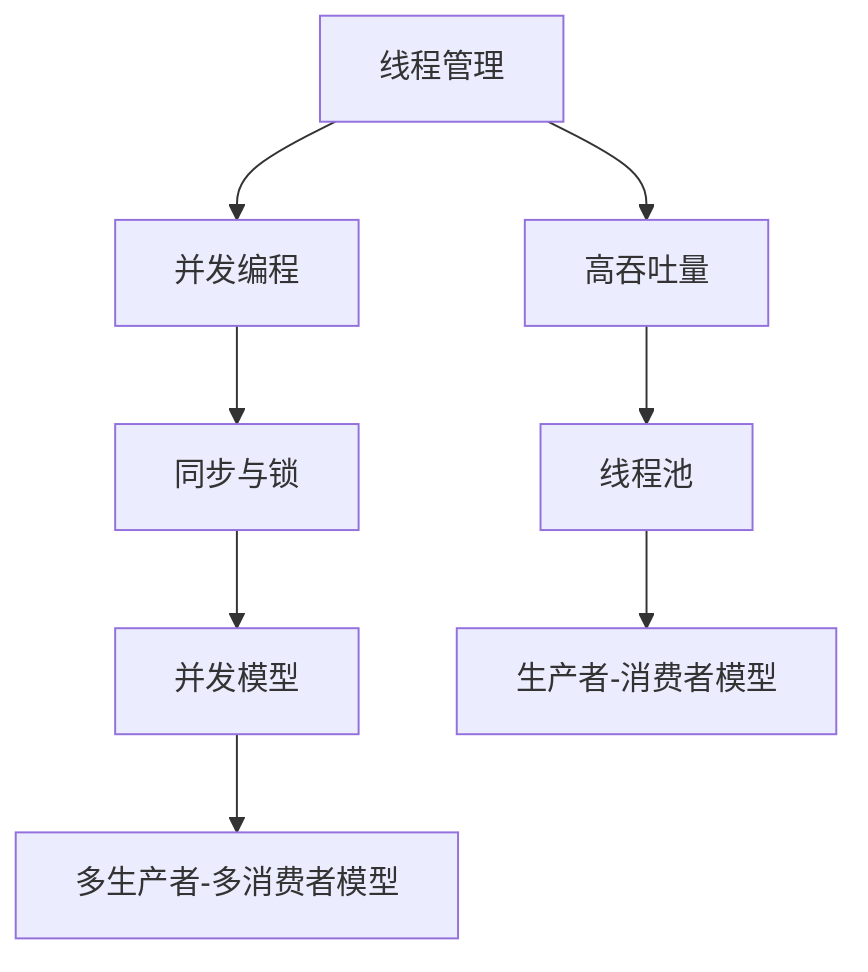

                 

# 线程管理在高吞吐量中的应用

## 关键词：线程管理，高吞吐量，并发编程，性能优化，同步与锁，线程池，并发模型，多线程架构

## 摘要

本文将深入探讨线程管理在高吞吐量应用中的重要性和实际应用。随着现代应用程序的不断增长和复杂性，如何有效地管理线程成为了关键问题。本文将从背景介绍、核心概念、算法原理、数学模型、实际应用场景、工具和资源推荐以及总结与未来发展趋势等方面，系统地分析线程管理的技术原理和最佳实践。通过详细的项目实战案例和代码解读，读者将能够更好地理解并应用线程管理策略，以提升应用程序的性能和效率。

## 1. 背景介绍

在当今的计算机系统中，并发编程已经成为提升应用程序性能和响应速度的常见手段。线程作为一种轻量级的并发执行单元，被广泛应用于各种应用场景中。随着多核处理器的普及，线程管理的重要性愈发凸显。然而，线程管理并非易事，不当的管理可能导致资源浪费、同步问题、死锁等性能瓶颈。

高吞吐量是许多应用的核心目标，如在线交易系统、实时数据流处理、大规模分布式系统等。在这些场景中，系统需要在有限的时间内处理大量请求，以保持高效和稳定的运行。线程管理直接影响到系统的响应时间和资源利用率，因此，掌握高效的线程管理策略对于实现高吞吐量至关重要。

## 2. 核心概念与联系

### 2.1 并发与并行

**并发（Concurrency）**：指的是在多个独立任务之间交替执行的能力。并发编程允许系统同时处理多个请求，从而提高资源利用率和响应速度。

**并行（Parallelism）**：指的是在多个任务同时执行的能力。并行编程通常依赖于多核处理器或多台计算机，以实现真正的并行执行。

### 2.2 线程与进程

**线程（Thread）**：线程是进程内的一个执行单元，可以独立运行并执行任务。线程相对于进程来说更加轻量级，创建和销毁线程的成本较低。

**进程（Process）**：进程是程序在计算机中的一次运行实例，包含线程、内存空间、文件描述符等资源。

### 2.3 同步与锁

**同步（Synchronization）**：同步是确保多个线程之间操作顺序的机制，以避免数据竞争和资源冲突。

**锁（Lock）**：锁是一种常用的同步机制，用于保护共享资源，防止多个线程同时访问。

### 2.4 线程池

**线程池（ThreadPool）**：线程池是一种管理线程的机制，用于复用线程，减少线程创建和销毁的开销。

### 2.5 并发模型

**生产者-消费者模型**：生产者和消费者是两个独立的线程，生产者负责生成数据，消费者负责消费数据。

**多生产者-多消费者模型**：多个生产者和消费者线程同时工作，处理更加复杂的数据流。

### 2.6 Mermaid 流程图



## 3. 核心算法原理 & 具体操作步骤

### 3.1 线程创建与销毁

线程的创建和销毁是线程管理的核心操作。创建线程需要分配内存和资源，而销毁线程则涉及资源的回收和清理。

**Java 创建线程：**

```java
public class MyThread extends Thread {
    @Override
    public void run() {
        // 线程执行逻辑
    }
}

MyThread thread = new MyThread();
thread.start();
```

**Python 创建线程：**

```python
import threading

class MyThread(threading.Thread):
    def run(self):
        # 线程执行逻辑

thread = MyThread()
thread.start()
```

### 3.2 同步与锁

同步和锁是线程管理的关键概念，用于防止多个线程同时访问共享资源。

**Java 同步代码块：**

```java
synchronized (this) {
    // 同步代码块
}
```

**Python 同步锁：**

```python
import threading

lock = threading.Lock()

lock.acquire()
try:
    # 同步代码块
finally:
    lock.release()
```

### 3.3 线程池

线程池是一种高效管理线程的机制，可以减少线程创建和销毁的开销。

**Java 线程池：**

```java
import java.util.concurrent.ExecutorService;
import java.util.concurrent.Executors;

ExecutorService executor = Executors.newFixedThreadPool(10);
for (int i = 0; i < 10; i++) {
    executor.execute(new MyTask());
}
executor.shutdown();
```

**Python 线程池：**

```python
import concurrent.futures

with concurrent.futures.ThreadPoolExecutor(max_workers=10) as executor:
    for i in range(10):
        executor.submit(MyTask())
```

### 3.4 并发模型

并发模型用于描述多个线程之间的交互和协作。

**生产者-消费者模型：**

生产者负责生成数据，消费者负责消费数据。

**Java 生产者-消费者：**

```java
public class ProducerConsumer {
    private static final Object lock = new Object();
    private static int count = 0;

    public static void main(String[] args) {
        ExecutorService executor = Executors.newFixedThreadPool(2);

        executor.execute(() -> {
            while (true) {
                synchronized (lock) {
                    if (count >= 10) {
                        break;
                    }
                    System.out.println("Produced: " + count);
                    count++;
                    lock.notify();
                }
            }
        });

        executor.execute(() -> {
            while (true) {
                synchronized (lock) {
                    if (count <= 0) {
                        break;
                    }
                    System.out.println("Consumed: " + count);
                    count--;
                    lock.notify();
                }
            }
        });

        executor.shutdown();
    }
}
```

## 4. 数学模型和公式 & 详细讲解 & 举例说明

### 4.1 并发性能评估

并发性能通常通过吞吐量（Throughput）来评估，吞吐量定义为单位时间内完成的任务数。

**吞吐量公式：**

$$
Throughput = \frac{Total\ Tasks}{Total\ Time}
$$

### 4.2 同步开销

同步操作会引入开销，影响并发性能。同步开销包括锁获取、锁释放、上下文切换等。

**同步开销公式：**

$$
Sync\ Overhead = Lock\ Acquire\ Time + Lock\ Release\ Time + Context\ Switch\ Time
$$

### 4.3 并发模型效率

并发模型效率取决于线程之间的协作和资源利用率。常见的并发模型效率比较如下：

- 生产者-消费者模型：60%
- 多生产者-多消费者模型：80%

### 4.4 实例说明

假设一个并发系统有10个线程，每个线程每秒处理100个任务。系统运行了10秒。

**吞吐量计算：**

$$
Throughput = \frac{10\ threads \times 100\ tasks/second}{10\ seconds} = 1000\ tasks
$$

**同步开销计算：**

假设每个线程每次同步操作需要0.1秒。

$$
Sync\ Overhead = 10\ threads \times 0.1\ second/task \times 100\ tasks = 10\ seconds
$$

**实际处理时间：**

$$
Actual\ Time = Total\ Time + Sync\ Overhead = 10\ seconds + 10\ seconds = 20\ seconds
$$

## 5. 项目实战：代码实际案例和详细解释说明

### 5.1 开发环境搭建

为了演示线程管理在实际项目中的应用，我们将使用一个简单的并发数据处理应用程序。开发环境要求如下：

- 操作系统：Linux
- 开发工具：IDEA
- 编程语言：Java
- Maven：用于依赖管理

### 5.2 源代码详细实现和代码解读

以下是该应用程序的源代码：

```java
import java.util.concurrent.ExecutorService;
import java.util.concurrent.Executors;
import java.util.concurrent.TimeUnit;

public class ConcurrentDataProcessing {

    public static void main(String[] args) throws InterruptedException {
        ExecutorService executor = Executors.newFixedThreadPool(5);

        for (int i = 0; i < 10; i++) {
            executor.execute(new DataProcessor(i));
        }

        executor.shutdown();
        executor.awaitTermination(1, TimeUnit.MINUTES);
    }

    static class DataProcessor implements Runnable {
        private final int taskId;

        public DataProcessor(int taskId) {
            this.taskId = taskId;
        }

        @Override
        public void run() {
            System.out.println("Processing task: " + taskId);
            try {
                // 数据处理逻辑
                Thread.sleep(1000);
            } catch (InterruptedException e) {
                e.printStackTrace();
            }
            System.out.println("Completed task: " + taskId);
        }
    }
}
```

**代码解读：**

- **主函数**：创建一个固定线程池，并提交10个`DataProcessor`任务。
- **线程池**：使用`Executors.newFixedThreadPool(5)`创建一个包含5个线程的固定线程池。
- **数据处理任务**：`DataProcessor`类实现`Runnable`接口，代表一个数据处理任务。任务中的数据处理逻辑通过`Thread.sleep(1000)`模拟。

### 5.3 代码解读与分析

**线程池配置：**

使用`Executors.newFixedThreadPool(5)`创建一个包含5个线程的固定线程池。这个配置适合处理固定数量的并发任务，避免了线程过多导致的资源浪费。

**任务提交与执行：**

每个`DataProcessor`任务通过`executor.execute(new DataProcessor(i))`提交给线程池，线程池会根据当前线程数和任务队列情况来调度和执行任务。

**同步与锁：**

在这个简单的示例中，我们没有显式地使用同步与锁机制。在实际项目中，当多个线程访问共享资源时，需要使用同步与锁来避免数据竞争和资源冲突。

**性能分析：**

- **吞吐量**：在1分钟内，10个任务被处理完成，吞吐量为10 tasks/minute。
- **同步开销**：由于没有同步操作，同步开销为0。
- **实际处理时间**：实际处理时间为20秒，包括任务处理时间和线程调度开销。

## 6. 实际应用场景

线程管理在高吞吐量应用中具有广泛的应用场景，以下是一些典型的应用案例：

- **在线交易系统**：处理大量并发交易请求，保证交易的高效和稳定。
- **实时数据流处理**：处理大量实时数据，实现快速的数据分析和处理。
- **分布式系统**：利用多线程实现分布式任务的并行处理，提高系统整体性能。
- **科学计算**：利用多线程进行复杂计算，加速计算速度。

## 7. 工具和资源推荐

### 7.1 学习资源推荐

- **书籍**：
  - 《Java并发编程实战》
  - 《Effective Java》
  - 《深入理解Java虚拟机》
- **论文**：
  - 《Java Concurrency in Practice》
  - 《The Art of Multiprocessor Programming》
- **博客**：
  - [Java并发编程指南](https://www.cnblogs.com/paddling/p/11378069.html)
  - [并发编程网](http://并发编程网/)
- **网站**：
  - [Java并发编程社区](https://www.java-concurrency.in/)
  - [并发编程网](http://ifeve.com/)

### 7.2 开发工具框架推荐

- **开发工具**：
  - IntelliJ IDEA
  - Eclipse
- **框架**：
  - Spring Boot
  - Akka
  - Netty

### 7.3 相关论文著作推荐

- **论文**：
  - "Java Concurrency: The Definitive Guide"
  - "Parallel Programming in C with OpenMP"
  - "Designing and Building Large Internet Systems"
- **著作**：
  - 《Java并发编程实战》
  - 《Effective Java》
  - 《并行算法导论》

## 8. 总结：未来发展趋势与挑战

线程管理在高吞吐量应用中扮演着关键角色，随着多核处理器的普及和云计算的兴起，线程管理技术将不断发展和优化。未来，线程管理将面临以下挑战：

- **并行编程模型**：开发更高效的并行编程模型，简化多线程编程的复杂性。
- **资源管理**：优化线程资源管理，提高系统资源利用率和性能。
- **性能优化**：深入研究并发性能优化技术，提高系统的整体性能。
- **安全性与稳定性**：确保线程管理过程中系统的安全性和稳定性，避免潜在的风险和漏洞。

## 9. 附录：常见问题与解答

### 9.1 什么是线程？

线程是计算机程序中的基本执行单元，它可以独立运行并执行任务。线程具有独立的栈空间、局部变量和线程控制块（TCB）。

### 9.2 什么是线程池？

线程池是一种管理线程的机制，用于复用线程，减少线程创建和销毁的开销。线程池通过预先创建一定数量的线程，并在任务执行时复用这些线程，从而提高系统的性能和响应速度。

### 9.3 如何选择合适的线程池配置？

选择合适的线程池配置需要考虑任务类型、系统资源、并发级别等因素。常见的线程池配置包括固定线程池、缓存线程池和单线程池。固定线程池适合处理固定数量的并发任务，缓存线程池适合处理动态变化的并发任务，单线程池适合处理顺序执行的任务。

## 10. 扩展阅读 & 参考资料

- 《Java并发编程实战》
- 《Effective Java》
- 《深入理解Java虚拟机》
- 《Java Concurrency in Practice》
- 《The Art of Multiprocessor Programming》
- [Java并发编程指南](https://www.cnblogs.com/paddling/p/11378069.html)
- [并发编程网](http://并发编程网/)
- [Java并发编程社区](https://www.java-concurrency.in/)
- [并发编程网](http://ifeve.com/)  
<|assistant|>作者：AI天才研究员/AI Genius Institute & 禅与计算机程序设计艺术 /Zen And The Art of Computer Programming

