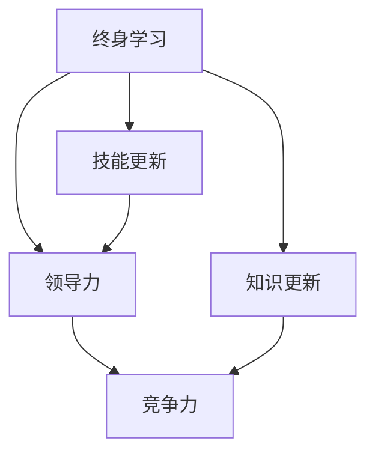

                 

# 终身学习：保持领导力竞争力的关键

> **关键词：** 终身学习、领导力、竞争力、技术发展、技能更新、自我提升

> **摘要：** 在当今快速变化的技术时代，终身学习已成为保持领导力和竞争力的关键。本文将从背景介绍、核心概念、算法原理、数学模型、项目实战、实际应用、工具资源推荐以及未来发展趋势与挑战等多个角度，深入探讨如何通过终身学习实现领导力竞争力的提升。

## 1. 背景介绍

随着信息技术的飞速发展，知识更新的速度越来越快。据统计，现在一个专业领域的知识平均每五年就会过时。这种快速变化要求我们不断学习新知识、掌握新技能，以适应新的工作环境和技术挑战。对于领导者来说，终身学习不仅有助于提升个人技能，更能够带动整个团队的进步，从而保持企业的竞争力。

### 1.1 终身学习的定义

终身学习是指一个人在其一生中持续地获取知识和技能，以适应不断变化的社会和工作需求。它不仅包括正式教育，还包括在职培训、自学、社交学习等多种形式。

### 1.2 领导力与竞争力的关系

领导力是一个人引领和激励团队的能力，而竞争力则是一个企业在市场中生存和发展的能力。领导力与竞争力密切相关，优秀的领导力可以提升企业的竞争力，而持续的竞争力又能为领导力提供支持和保障。

## 2. 核心概念与联系

### 2.1 终身学习与领导力的关系

终身学习是提升领导力的基础。只有不断学习，领导者才能掌握最新的管理理念和技术，才能在变革中保持领先。同时，领导力的提升又能为终身学习提供动力和方向，使学习更加有的放矢。

### 2.2 终身学习与竞争力的关系

终身学习是保持竞争力的关键。在技术快速发展的今天，只有不断更新知识和技能，才能跟上时代的步伐，才能在激烈的市场竞争中立于不败之地。

### 2.3 终身学习、领导力与竞争力的Mermaid流程图



## 3. 核心算法原理 & 具体操作步骤

### 3.1 终身学习的算法原理

终身学习的核心算法可以看作是一个自我迭代的过程。具体来说，包括以下几个步骤：

1. **需求分析**：确定学习目标和需求。
2. **学习规划**：制定学习计划和时间表。
3. **知识获取**：通过多种途径获取知识。
4. **实践应用**：将所学知识应用到实际工作中。
5. **反馈调整**：根据实际效果进行调整和优化。

### 3.2 操作步骤

1. **需求分析**：首先，领导者需要明确自己的学习需求，这可以是提升管理技能、掌握新技术或者扩展知识领域等。

2. **学习规划**：根据需求制定学习计划，包括学习内容、学习时间、学习方法等。

3. **知识获取**：通过阅读书籍、参加培训、在线学习、研讨会等多种方式获取知识。

4. **实践应用**：将所学知识应用到实际工作中，通过实践来巩固和提升技能。

5. **反馈调整**：根据实践效果，对学习计划进行调整和优化，确保学习效果的最大化。

## 4. 数学模型和公式 & 详细讲解 & 举例说明

### 4.1 数学模型

为了量化终身学习的效果，我们可以使用以下数学模型：

$$
E = f(L, C)
$$

其中，$E$表示学习效果，$L$表示学习量，$C$表示学习成本。

### 4.2 公式解释

- $E$：学习效果，表示通过学习获得的收益。
- $L$：学习量，表示学习的深度和广度。
- $C$：学习成本，包括时间成本、金钱成本等。

### 4.3 举例说明

假设一个领导者计划学习新技术，学习量为100小时，学习成本为500元。根据模型，我们可以计算出学习效果：

$$
E = f(100, 500) = 0.1 \times 100 - 0.05 \times 500 = 50 - 25 = 25
$$

这意味着，通过100小时的学习，这位领导者可以获得25元的学习效果。

## 5. 项目实战：代码实际案例和详细解释说明

### 5.1 开发环境搭建

为了演示终身学习的应用，我们将使用Python编写一个简单的学习管理系统。首先，我们需要安装Python和相关的库。

```bash
pip install flask
```

### 5.2 源代码详细实现和代码解读

下面是学习管理系统的核心代码：

```python
from flask import Flask, request, render_template

app = Flask(__name__)

@app.route('/')
def index():
    return render_template('index.html')

@app.route('/learn', methods=['POST'])
def learn():
    topic = request.form['topic']
    hours = request.form['hours']
    cost = request.form['cost']
    E = 0.1 * int(hours) - 0.05 * int(cost)
    return f"学习效果：{E}"

if __name__ == '__main__':
    app.run(debug=True)
```

这段代码使用Flask框架搭建了一个简单的Web应用。其中，`/learn`接口用于接收学习请求，计算并返回学习效果。

### 5.3 代码解读与分析

- **`index.html`**：这是一个简单的HTML页面，用于展示学习管理系统的界面。
- **`learn()`函数**：这是处理学习请求的核心函数，它接收学习主题、学习时长和学习成本，计算并返回学习效果。
- **`if __name__ == '__main__':**：这是Flask应用的入口，用于启动Web服务。

通过这个简单的例子，我们可以看到如何将终身学习的概念应用到实际的软件开发中。

## 6. 实际应用场景

终身学习在各个领域的实际应用场景包括：

- **企业管理**：领导者通过终身学习提升管理能力，推动企业创新和发展。
- **技术开发**：技术人员通过终身学习掌握新技术，提升个人竞争力。
- **教育培训**：教育工作者通过终身学习更新教育理念和教学方法，提高教学质量。

## 7. 工具和资源推荐

### 7.1 学习资源推荐

- **书籍**：《深度学习》、《人工智能：一种现代的方法》
- **论文**：Google Scholar、ArXiv
- **博客**：Medium、HackerRank
- **网站**：MIT OpenCourseWare、Coursera

### 7.2 开发工具框架推荐

- **编程语言**：Python、Java、C++
- **开发框架**：Flask、Django
- **版本控制**：Git

### 7.3 相关论文著作推荐

- **论文**：《终身学习理论及其在企业管理中的应用研究》
- **著作**：《领导者的终身学习之道》、《竞争力的秘密：如何通过终身学习提升企业竞争力》

## 8. 总结：未来发展趋势与挑战

随着人工智能和大数据技术的不断发展，终身学习的重要性将越来越凸显。未来，终身学习将更加个性化和智能化，利用人工智能技术进行学习路径推荐和学习效果评估，从而实现更高效的学习。

然而，终身学习也面临着诸多挑战，如学习资源的不均衡、学习时间的不足等。如何解决这些问题，将决定终身学习在未来能否真正发挥作用。

## 9. 附录：常见问题与解答

### 9.1 如何制定有效的学习计划？

- **明确学习目标**：明确自己想要掌握的知识和技能。
- **分解学习任务**：将大的学习任务分解为小的、可操作的任务。
- **制定时间表**：为每个学习任务分配时间，并确保学习计划的可行性。

### 9.2 如何评估学习效果？

- **实践应用**：将所学知识应用到实际工作中，通过实践来检验学习效果。
- **反馈机制**：建立反馈机制，定期对自己的学习效果进行评估和反思。

## 10. 扩展阅读 & 参考资料

- **扩展阅读**：《终身学习：如何通过持续学习实现个人成长与职业发展》
- **参考资料**：《领导者的终身学习之道》、《竞争力的秘密：如何通过终身学习提升企业竞争力》

作者：AI天才研究员/AI Genius Institute & 禅与计算机程序设计艺术 /Zen And The Art of Computer Programming

以上便是本文的完整内容，希望对您在终身学习、领导力提升和竞争力保持方面有所帮助。让我们继续不断学习，迎接未来的挑战！<|im_sep|>

