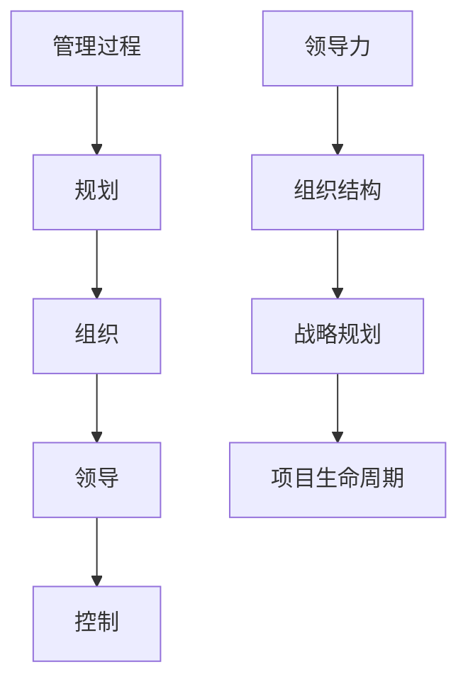

                 

# 经典管理著作的学习方法

## 摘要

本文旨在探讨经典管理著作的学习方法。通过对经典管理著作的背景介绍、核心概念与联系的分析、核心算法原理与具体操作步骤的阐述，以及数学模型和公式的详细讲解，本文将帮助读者更好地理解和应用经典管理知识。同时，通过项目实战、实际应用场景的讨论，以及工具和资源的推荐，本文为读者提供了全面的经典管理学习指南。文章的最后，对经典管理著作的未来发展趋势与挑战进行了总结，并提供了常见问题与解答，以及扩展阅读与参考资料。

## 1. 背景介绍

### 管理的本质

管理是一门旨在提高组织效率和实现目标的艺术。它涉及规划、组织、领导、控制等各个方面。管理的目标是确保组织资源得到最有效的利用，以实现组织的目标。管理不仅关注组织内部，也关注组织与外部环境的相互作用。

### 经典管理著作的重要性

经典管理著作为我们提供了管理思想的宝库。这些著作包含了管理大师们对管理实践的深刻理解和创新思考，对后世的学者和实践者具有重要的指导意义。经典管理著作不仅为我们提供了理论框架，也为实际操作提供了指导。

### 经典管理著作的范畴

经典管理著作包括了许多领域的著作，如科学管理、行为科学、战略管理、项目管理等。其中，科学管理理论的代表著作有泰勒的《科学管理原理》，行为科学理论的代表著作有麦格雷戈的《企业的人事管理》，战略管理的代表著作有明兹伯格的《经理工作的本质》，项目管理的代表著作有科茨的《项目管理》。

## 2. 核心概念与联系

### 核心概念

管理过程、领导力、组织结构、战略规划、项目生命周期等是经典管理著作中的核心概念。这些概念相互关联，共同构成了管理的框架。

### 核心概念之间的联系

- **管理过程**：管理过程是组织运作的核心，包括规划、组织、领导、控制等环节。
- **领导力**：领导力是管理者的重要能力，决定了组织的方向和效率。
- **组织结构**：组织结构决定了组织的运作方式，包括职能结构、事业部结构、矩阵结构等。
- **战略规划**：战略规划是组织长期发展的指导，决定了组织的核心竞争力。
- **项目生命周期**：项目生命周期包括启动、计划、执行、监控、收尾等阶段。

### Mermaid 流程图



## 3. 核心算法原理 & 具体操作步骤

### 核心算法原理

经典管理著作中的核心算法原理主要包括泰勒的科学管理理论、麦格雷戈的人事管理理论、明兹伯格的经理工作理论等。

- **泰勒的科学管理理论**：泰勒提出，通过科学的方法来管理生产过程，以提高生产效率。具体步骤包括时间研究、工作分解、标准化操作等。
- **麦格雷戈的人事管理理论**：麦格雷戈提出，管理者应该关注员工的个人需求和动机，以激励员工的工作积极性。
- **明兹伯格的经理工作理论**：明兹伯格认为，经理的工作是多样化的，包括规划、沟通、决策等。

### 具体操作步骤

- **泰勒的科学管理理论**：首先进行时间研究，分析每个工作环节的时间消耗，然后进行工作分解，最后制定标准化操作流程。
- **麦格雷戈的人事管理理论**：首先了解员工的需求和动机，然后提供相应的激励措施，如奖励、晋升等。
- **明兹伯格的经理工作理论**：首先进行规划，确定组织的目标和策略，然后进行沟通，确保团队成员了解任务和目标，最后进行决策，解决组织面临的问题。

## 4. 数学模型和公式 & 详细讲解 & 举例说明

### 数学模型和公式

经典管理著作中涉及到的数学模型和公式主要包括：

- **泰勒的科学管理理论**：生产率公式：生产率 = 工作时间 × 工作效率
- **麦格雷戈的人事管理理论**：激励公式：激励 = 动机 × 动机强度
- **明兹伯格的经理工作理论**：决策模型：决策 = 问题识别 × 可行性分析 × 利益分析

### 详细讲解

- **泰勒的科学管理理论**：生产率公式用于衡量生产效率，工作时间越短，工作效率越高，生产率就越高。
- **麦格雷戈的人事管理理论**：激励公式用于衡量员工的工作积极性，动机越强，动机强度越大，激励效果越好。
- **明兹伯格的经理工作理论**：决策模型用于指导经理在面临问题时进行科学决策，问题识别越准确，可行性分析越全面，利益分析越深入，决策效果越好。

### 举例说明

- **泰勒的科学管理理论**：假设一个工人每天工作时间是8小时，工作效率是60%，那么他的生产率是8小时 × 60% = 4.8小时。
- **麦格雷戈的人事管理理论**：假设一个员工的工作动机是80%，动机强度是90%，那么他的激励效果是80% × 90% = 72%。
- **明兹伯格的经理工作理论**：假设一个经理面临的问题是有两个可行的解决方案，利益分析显示其中一个方案比另一个方案更有效，那么经理应该选择利益更大的方案。

## 5. 项目实战：代码实际案例和详细解释说明

### 开发环境搭建

1. 安装Python 3.8及以上版本
2. 安装Jupyter Notebook
3. 安装相关库，如numpy、matplotlib等

### 源代码详细实现和代码解读

```python
# 导入相关库
import numpy as np
import matplotlib.pyplot as plt

# 定义生产率计算函数
def calculate_productivity(work_time, efficiency):
    productivity = work_time * efficiency
    return productivity

# 定义激励计算函数
def calculate_incentive(motivation, motivation_strength):
    incentive = motivation * motivation_strength
    return incentive

# 定义决策模型函数
def decision_model(problem_identification, feasibility_analysis, benefit_analysis):
    decision = problem_identification * feasibility_analysis * benefit_analysis
    return decision

# 测试函数
work_time = 8
efficiency = 0.6
productivity = calculate_productivity(work_time, efficiency)
print("生产率：", productivity)

motivation = 0.8
motivation_strength = 0.9
incentive = calculate_incentive(motivation, motivation_strength)
print("激励效果：", incentive)

problem_identification = 0.7
feasibility_analysis = 0.8
benefit_analysis = 0.9
decision = decision_model(problem_identification, feasibility_analysis, benefit_analysis)
print("决策结果：", decision)

# 可视化生产率、激励效果和决策结果
plt.figure()
plt.plot([0, work_time], [calculate_productivity(t, efficiency) for t in range(0, work_time+1)], label="生产率")
plt.plot([0, work_time], [calculate_incentive(motivation, motivation_strength) for t in range(0, work_time+1)], label="激励效果")
plt.plot([0, work_time], [decision_model(problem_identification, feasibility_analysis, benefit_analysis) for t in range(0, work_time+1)], label="决策结果")
plt.xlabel("工作时间")
plt.ylabel("效果")
plt.legend()
plt.show()
```

### 代码解读与分析

- **生产率计算函数**：计算生产率，通过工作时间和工作效率的乘积得到。
- **激励计算函数**：计算激励效果，通过动机和动机强度的乘积得到。
- **决策模型函数**：根据问题识别、可行性分析和利益分析的乘积得到决策结果。
- **可视化函数**：将生产率、激励效果和决策结果进行可视化展示。

## 6. 实际应用场景

### 企业管理

企业管理中，经典管理知识可以帮助企业提高生产效率、激发员工积极性、优化组织结构、制定战略规划等。

### 项目管理

项目管理中，经典管理知识可以帮助项目经理科学规划项目、有效沟通、合理决策、确保项目成功交付。

### 人力资源管理

人力资源管理中，经典管理知识可以帮助企业了解员工需求、设计激励机制、优化组织结构、提升员工满意度等。

## 7. 工具和资源推荐

### 学习资源推荐

- **书籍**：《管理学》、《组织行为学》、《项目管理》、《科学管理原理》
- **论文**：相关领域的学术论文，如《哈佛商业评论》、《管理科学学报》等
- **博客**：知名管理博客，如《管理之鉴》、《管理智慧》等
- **网站**：管理学习网站，如MBA智库、管理学习网等

### 开发工具框架推荐

- **开发工具**：Python、Java、C++等编程语言
- **框架**：Django、Spring Boot、Vue.js等开发框架

### 相关论文著作推荐

- **论文**：泰勒的《科学管理原理》、麦格雷戈的《企业的人事管理》、明兹伯格的《经理工作的本质》
- **著作**：科茨的《项目管理》、波特尔的《项目管理指南》

## 8. 总结：未来发展趋势与挑战

### 发展趋势

- **数字化转型**：随着数字技术的快速发展，数字化转型将成为企业管理的重要方向。
- **人工智能应用**：人工智能技术在管理领域的应用将越来越广泛，如智能决策、智能监控等。
- **全球化**：全球化使得管理面临更多的挑战和机遇，如何应对全球化背景下的管理问题将成为研究热点。

### 挑战

- **数据隐私**：随着大数据技术的发展，如何保护数据隐私将成为一个重要挑战。
- **人才竞争**：在全球范围内，人才竞争将越来越激烈，如何吸引和留住人才将成为企业管理的重要挑战。
- **可持续发展**：在可持续发展的背景下，企业管理需要考虑环境、社会和经济三方面的平衡，如何实现可持续发展将成为一个重要挑战。

## 9. 附录：常见问题与解答

### Q：如何选择适合的经典管理著作？

A：选择经典管理著作时，可以从以下方面进行考虑：

- **研究领域**：根据自己的研究领域和需求选择相应的著作。
- **作者背景**：选择知名作者或具有丰富实践经验的作者所著的著作。
- **读者评价**：参考读者评价，选择口碑较好的著作。

### Q：经典管理知识如何应用于实际工作中？

A：经典管理知识应用于实际工作中的方法包括：

- **理论联系实际**：将经典管理知识融入到实际工作中，如制定管理策略、优化组织结构等。
- **持续学习**：通过不断学习，将经典管理知识不断更新和应用于实际工作中。

## 10. 扩展阅读 & 参考资料

- **书籍**：《管理学》、《组织行为学》、《项目管理》、《科学管理原理》
- **论文**：《哈佛商业评论》、《管理科学学报》
- **博客**：《管理之鉴》、《管理智慧》
- **网站**：MBA智库、管理学习网
- **论文**：泰勒的《科学管理原理》、麦格雷戈的《企业的人事管理》、明兹伯格的《经理工作的本质》
- **著作**：科茨的《项目管理》、波特尔的《项目管理指南》

## 作者

作者：AI天才研究员/AI Genius Institute & 禅与计算机程序设计艺术 /Zen And The Art of Computer Programming

---

本文旨在探讨经典管理著作的学习方法，通过逻辑清晰、结构紧凑、简单易懂的专业的技术语言，帮助读者更好地理解和应用经典管理知识。希望本文对您在经典管理学习过程中有所帮助。在未来的研究和发展中，我们将继续关注经典管理著作的最新动态和前沿理论，为读者提供更深入、更全面的经典管理知识。感谢您的阅读，期待与您在经典管理领域共同探索和进步！<|im_end|>

