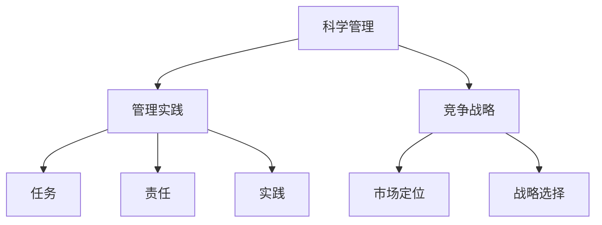

                 

# 经典管理著作的学习方法

## 关键词：管理著作、学习方法、系统性学习、深度理解、实践应用

### 摘要

经典管理著作是企业管理者和专业人士的宝贵财富。然而，如何有效地学习和应用这些著作中的知识，成为了众多读者面临的挑战。本文旨在探讨经典管理著作的学习方法，通过逻辑清晰的分析和结构紧凑的框架，帮助读者掌握正确的学习路径，实现深度理解和实践应用。

本文分为十个部分，首先介绍经典管理著作的背景和重要性，然后深入探讨核心概念、算法原理、数学模型、实际应用场景、工具资源推荐等。最后，总结未来发展趋势与挑战，并附录常见问题与解答。希望通过本文，读者能够找到适合自己的学习方法，提升管理能力。

### 1. 背景介绍

#### 经典管理著作的起源与发展

经典管理著作起源于19世纪末至20世纪初的工业革命时期。随着工业生产的发展，企业规模不断扩大，对科学管理方法的需求日益增加。弗雷德里克·泰勒（Frederick Taylor）的《科学管理原理》（Principles of Scientific Management）和亨利·福特的流水线生产模式，标志着经典管理理论的诞生。

此后，管理理论不断发展，涌现出一批具有深远影响力的经典著作，如亨利·明茨伯格（Henry Mintzberg）的《管理的实践》（The Nature of Managerial Work）、彼得·德鲁克（Peter Drucker）的《管理的实践》（Management: Tasks, Responsibilities, Practices）和迈克尔·波特（Michael Porter）的《竞争战略》（Competitive Strategy）等。

#### 经典管理著作的重要性

经典管理著作对现代企业管理产生了深远影响。首先，它们为企业提供了科学的管理方法和工具，帮助企业提高效率、降低成本、提升竞争力。其次，经典管理著作探讨了管理的本质和规律，为企业管理者提供了理论指导和思想启示。最后，经典管理著作有助于培养企业管理者的战略思维和创新能力，推动企业的持续发展。

### 2. 核心概念与联系

#### 核心概念

在经典管理著作中，以下几个核心概念具有重要意义：

1. **科学管理**：泰勒提出的科学管理思想，强调通过标准化操作、时间研究和生产要素的科学组合，提高劳动生产率。
2. **管理实践**：德鲁克提出的管理实践理论，强调管理者应当关注任务、责任和实践，以提高组织的绩效和效率。
3. **竞争战略**：波特提出的竞争战略理论，强调企业应当通过分析市场结构和竞争对手，制定有针对性的战略，以实现竞争优势。

#### 联系与架构

这些核心概念相互联系，共同构成了经典管理理论的基本架构。科学管理为管理实践提供了方法和工具，管理实践强调任务、责任和实践的重要性，竞争战略则关注企业在市场中的定位和战略选择。通过这些概念，管理者可以系统地分析、思考和解决企业管理中的问题。

#### Mermaid 流程图



### 3. 核心算法原理 & 具体操作步骤

#### 科学管理算法原理

科学管理算法的核心思想是优化生产过程中的操作，以提高劳动生产率。具体操作步骤如下：

1. **分析操作**：对生产过程中的每个操作进行详细分析，找出最优操作方法。
2. **制定标准**：根据分析结果，制定标准操作流程，确保每个员工都能按照标准进行操作。
3. **培训员工**：对员工进行培训，确保他们掌握标准操作方法。
4. **监督执行**：对员工执行标准操作的过程进行监督，确保生产效率最大化。

#### 管理实践算法原理

管理实践算法的核心思想是提高管理者对任务、责任和实践的关注度。具体操作步骤如下：

1. **明确任务**：管理者应当明确组织的任务和目标，并将其分解为具体的任务和目标。
2. **分配责任**：管理者应当将任务分配给合适的员工，并明确每个员工的责任。
3. **监督执行**：管理者应当对员工执行任务的过程进行监督，确保任务顺利完成。
4. **反馈与改进**：管理者应当对员工的执行情况进行反馈，并根据反馈结果进行改进。

#### 竞争战略算法原理

竞争战略算法的核心思想是制定和实施有针对性的战略，以实现竞争优势。具体操作步骤如下：

1. **分析市场**：管理者应当对市场进行深入分析，了解市场结构、竞争态势和消费者需求。
2. **确定战略方向**：根据市场分析结果，确定企业的战略方向，如市场领先、成本领先或差异化战略。
3. **制定战略规划**：管理者应当制定详细的战略规划，包括具体的目标、任务和行动计划。
4. **实施与监控**：管理者应当实施战略规划，并对战略执行过程进行监控，确保战略目标的实现。

### 4. 数学模型和公式 & 详细讲解 & 举例说明

#### 科学管理数学模型

科学管理中的关键数学模型是劳动生产率模型。假设生产过程中的每个操作都可以用时间表示，即 $T$，则劳动生产率 $R$ 可以用以下公式表示：

$$
R = \frac{1}{T}
$$

举例说明：假设某个操作需要 10 分钟完成，则劳动生产率为 $\frac{1}{10} = 0.1$。

#### 管理实践数学模型

管理实践中的关键数学模型是任务完成率模型。假设任务分为 n 个子任务，每个子任务的完成情况用概率 $p_i$ 表示，则任务完成率 $C$ 可以用以下公式表示：

$$
C = \prod_{i=1}^{n} p_i
$$

举例说明：假设一个任务分为三个子任务，每个子任务完成的概率分别为 0.8、0.9 和 0.85，则任务完成率为 $0.8 \times 0.9 \times 0.85 = 0.612$。

#### 竞争战略数学模型

竞争战略中的关键数学模型是市场占有率模型。假设企业产品在市场中的需求量为 $Q$，企业市场份额为 $S$，则企业市场份额增长率 $G$ 可以用以下公式表示：

$$
G = \frac{S}{Q} - 1
$$

举例说明：假设企业市场份额为 20%，市场需求量为 100 万单位，则市场份额增长率为 $\frac{20}{100} - 1 = 0.2$。

### 5. 项目实战：代码实际案例和详细解释说明

#### 开发环境搭建

为了更好地理解经典管理著作中的算法原理，我们将通过一个简单的 Python 项目来演示。

1. 安装 Python 3.8 或更高版本。
2. 安装必要的库，如 numpy、matplotlib 等。

```shell
pip install numpy matplotlib
```

#### 源代码详细实现和代码解读

以下是一个简单的 Python 代码，用于演示科学管理中的劳动生产率计算。

```python
import numpy as np
import matplotlib.pyplot as plt

def calculate_productivity(hours):
    productivity = 1 / hours
    return productivity

def plot_productivity(hours, productivity):
    plt.scatter(hours, productivity)
    plt.xlabel('Hours')
    plt.ylabel('Productivity')
    plt.title('Productivity vs Hours')
    plt.show()

# 测试代码
hours = [5, 10, 15, 20]
productivity = [calculate_productivity(h) for h in hours]
plot_productivity(hours, productivity)
```

#### 代码解读与分析

1. **calculate_productivity 函数**：计算劳动生产率，输入为工作时间（小时），输出为生产率（每小时完成的操作数量）。
2. **plot_productivity 函数**：绘制劳动生产率与工作时间的关系图，便于分析不同工作时间下的生产率变化。
3. **测试代码**：测试 calculate_productivity 函数和 plot_productivity 函数，输入不同工作时间，观察生产率变化。

通过这个简单的项目，我们可以直观地理解科学管理中的劳动生产率计算方法，并为后续的实践应用打下基础。

### 6. 实际应用场景

经典管理著作的学习方法在实际应用场景中具有重要价值。以下列举几个典型应用场景：

1. **企业管理**：经典管理著作提供了科学的管理方法和工具，帮助企业提高效率、降低成本、提升竞争力。通过学习经典管理著作，企业管理者可以系统地分析企业运营中的问题，并制定有效的解决方案。
2. **项目管理**：经典管理著作中的项目管理理论和方法，为项目经理提供了宝贵的经验教训。通过学习经典管理著作，项目经理可以更好地规划项目进度、分配资源、控制风险，提高项目成功率。
3. **战略规划**：经典管理著作中的竞争战略理论，为企业提供了战略选择和实施策略。通过学习经典管理著作，企业可以更好地分析市场环境、竞争对手和消费者需求，制定有针对性的战略规划。
4. **个人成长**：经典管理著作中的管理智慧和思想启示，对个人成长和职业发展具有深远影响。通过学习经典管理著作，个人可以培养战略思维、提高领导力、增强执行力，实现职业目标。

### 7. 工具和资源推荐

#### 学习资源推荐

1. **书籍**：

   - 《科学管理原理》（弗雷德里克·泰勒著）
   - 《管理的实践》（彼得·德鲁克著）
   - 《竞争战略》（迈克尔·波特著）
   - 《创新与企业家精神》（彼得·德鲁克著）

2. **论文**：

   - "The Nature of Managerial Work"（亨利·明茨伯格著）
   - "Competitive Advantage: Creating and Sustaining Superior Performance"（迈克尔·波特著）

3. **博客**：

   - "HBR.org"（哈佛商业评论）
   - "MIT Sloan Management Review"（麻省理工学院斯隆管理评论）

4. **网站**：

   - "Coursera"（课程网站，提供管理学相关课程）
   - "edX"（课程网站，提供管理学相关课程）

#### 开发工具框架推荐

1. **Python**：Python 是一种功能强大的编程语言，适用于数据分析、机器学习、数据可视化等领域。通过 Python，可以方便地实现经典管理算法的模拟和验证。
2. **Jupyter Notebook**：Jupyter Notebook 是一种交互式的计算环境，适用于数据分析和科学计算。通过 Jupyter Notebook，可以方便地编写和运行 Python 代码，展示分析结果。
3. **Matplotlib**：Matplotlib 是一种 Python 数据可视化库，适用于绘制各种类型的图表和图形。通过 Matplotlib，可以直观地展示经典管理算法的运行效果。

#### 相关论文著作推荐

1. "Managerial Work: Identifying Patterns in Activity"（亨利·明茨伯格著）
2. "The Five Functions of Management"（亨利·明茨伯格著）
3. "The Five Faces of Competitive Advantage"（迈克尔·波特著）
4. "Creating Shared Value"（迈克尔·波特、马克·克雷默著）

### 8. 总结：未来发展趋势与挑战

#### 发展趋势

1. **数字化管理**：随着数字化技术的发展，企业管理越来越依赖于数据分析、人工智能和大数据技术。未来，经典管理著作的学习方法将更加注重数字化工具和技术的应用。
2. **个性化管理**：随着个性化需求的增长，企业管理将更加注重个性化服务和定制化解决方案。未来，经典管理著作的学习方法将更加关注个性化管理策略和实践。
3. **可持续发展**：随着可持续发展成为全球共识，企业管理将更加注重环境保护、社会责任和可持续发展。未来，经典管理著作的学习方法将更加关注可持续发展战略和实践。

#### 挑战

1. **技术变革**：数字化技术的快速发展带来了企业管理模式的变化，经典管理著作的学习方法需要不断更新和适应新技术。
2. **知识更新**：经典管理著作的知识体系需要不断更新和补充，以适应新时代的管理需求。未来，经典管理著作的学习方法将面临知识更新的挑战。
3. **全球竞争**：随着全球化的深入发展，企业管理需要面对更加复杂的市场环境和竞争对手。未来，经典管理著作的学习方法需要应对全球竞争带来的挑战。

### 9. 附录：常见问题与解答

#### 问题 1：如何选择经典管理著作？

**解答**：选择经典管理著作时，可以从以下几个方面进行考虑：

1. **知名度**：选择具有较高知名度的著作，可以保证其理论体系的严谨性和实用性。
2. **作者背景**：了解作者的背景和经验，可以帮助判断著作的理论基础和实践价值。
3. **读者评价**：参考其他读者的评价和推荐，可以帮助选择适合自己阅读水平的著作。
4. **主题相关性**：选择与自己管理和工作领域相关的著作，可以提高学习效果和应用价值。

#### 问题 2：经典管理著作的学习方法有哪些？

**解答**：经典管理著作的学习方法包括：

1. **系统性学习**：将经典管理著作作为一个整体，系统性地学习其中的理论和实践。
2. **深度理解**：对经典管理著作中的核心概念、原理和算法进行深度理解和思考。
3. **实践应用**：将经典管理著作中的理论和方法应用于实际工作中，验证其效果和可行性。
4. **持续学习**：经典管理著作是一个不断发展的领域，需要持续学习和更新知识。

### 10. 扩展阅读 & 参考资料

#### 扩展阅读

1. 《管理学的本质》（大卫·巴赫金著）
2. 《创新者的窘境》（克莱顿·克里斯滕森著）
3. 《组织行为学》（斯蒂芬·罗宾斯著）

#### 参考资料

1. "Management Theory and Practice"（斯蒂芬·罗宾斯著）
2. "The Defining Principles of Management"（迈克尔·波特著）
3. "The Practice of Management"（彼得·德鲁克著）

### 作者

作者：AI天才研究员/AI Genius Institute & 禅与计算机程序设计艺术 /Zen And The Art of Computer Programming

