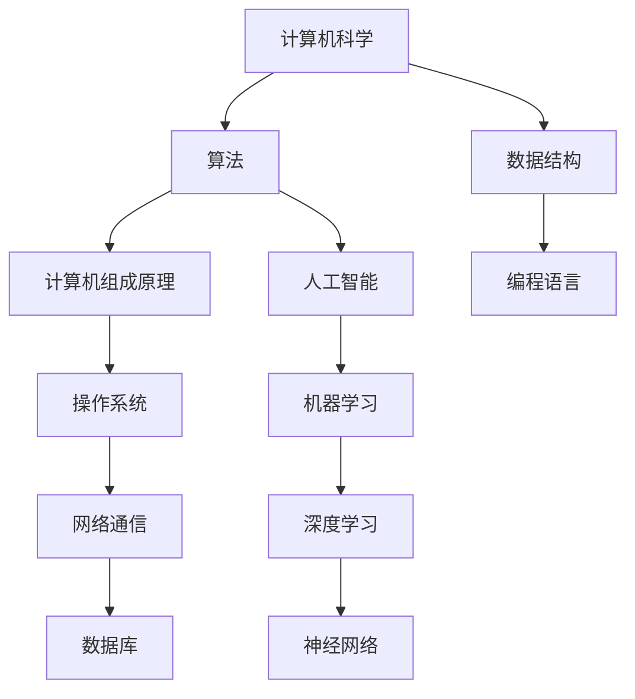

                 

### 背景介绍

#### 技术与认知基础的重要性

在快速发展的信息技术时代，技术专家和开发者们常常面临着信息过载的挑战。如何高效地学习和掌握核心技能，成为了许多人关注的焦点。本文旨在为读者提供一份经典阅读清单，以奠定认知根基，帮助读者在信息技术领域取得长足进步。

认知基础在技术学习中起着至关重要的作用。正如计算机科学大师唐纳德·克努特（Donald Knuth）所说：“我们不希望学生只是不断地接受新的、还未被验证的技术，而是应该让他们深入理解已有技术的核心原理。” 通过阅读经典著作，我们可以深入理解技术的本质，掌握其核心概念，从而为后续的学习和研究打下坚实的基础。

本文将分为以下几个部分进行讨论：

1. **核心概念与联系**：介绍本文涉及的关键概念，并使用 Mermaid 流程图展示其相互关系。
2. **核心算法原理与具体操作步骤**：探讨经典算法的基本原理，并详细讲解其实现过程。
3. **数学模型和公式**：介绍与核心概念相关的数学模型，并使用公式和实例进行详细说明。
4. **项目实战**：通过实际代码案例，展示如何将理论知识应用到实践中。
5. **实际应用场景**：分析经典技术在现实世界中的应用场景。
6. **工具和资源推荐**：推荐学习资源、开发工具和论文著作。
7. **总结**：探讨未来发展趋势与挑战。
8. **附录**：常见问题与解答。
9. **扩展阅读与参考资料**：提供进一步阅读的资源和参考文献。

接下来，我们将一步一步深入探讨这些主题。首先，让我们从核心概念与联系开始。

#### 核心概念与联系

在信息技术领域，有许多核心概念对我们的认知和理解至关重要。以下是一些关键概念，我们将使用 Mermaid 流程图展示它们之间的相互关系：



在上面的 Mermaid 流程图中，我们展示了计算机科学的一些核心概念及其相互关系。以下是这些概念的简要说明：

- **计算机科学**：是研究计算机硬件和软件的设计、开发和应用的科学。
- **算法**：是解决问题的一系列有序指令。
- **数据结构**：是用于存储和组织数据的方式。
- **计算机组成原理**：研究计算机系统的结构和功能。
- **编程语言**：是用于编写计算机程序的语法和规则。
- **操作系统**：是控制和管理计算机硬件和软件资源的基本系统。
- **网络通信**：是数据在不同计算机之间传输的机制。
- **数据库**：是存储、管理和检索数据的系统。
- **人工智能**：是模拟人类智能行为的技术。
- **机器学习**：是人工智能的一个分支，侧重于开发算法，使计算机能够从数据中学习。
- **深度学习**：是机器学习的一个分支，使用多层神经网络进行学习。
- **神经网络**：是模仿人脑结构和功能的计算模型。

通过理解这些核心概念，我们可以更好地构建对信息技术领域的整体认知。在接下来的部分中，我们将深入探讨算法的核心原理与具体操作步骤。

#### 核心算法原理与具体操作步骤

在信息技术中，算法是解决问题的基础。本节将介绍一些经典算法，并详细解释其原理和操作步骤。

##### 1. 排序算法

排序算法是一种常用的算法，用于将数据按照一定的顺序排列。以下是一些常见的排序算法：

###### a. 冒泡排序（Bubble Sort）

冒泡排序是一种简单的排序算法，通过重复交换相邻的未按顺序排列的元素来逐步将整个序列排序。

**原理**：

冒泡排序的基本思想是通过多次遍历数组，比较相邻的两个元素，如果它们的顺序错误就把它们交换过来。遍历数组序列多次后，就能使最大的元素逐步“冒泡”到数组的末尾。

**具体操作步骤**：

1. 遍历数组，从第一个元素到倒数第二个元素。
2. 在每次遍历中，比较相邻的两个元素，如果前一个元素大于后一个元素，则交换它们。
3. 遍历结束后，数组将按照升序排列。

```python
def bubble_sort(arr):
    n = len(arr)
    for i in range(n):
        for j in range(0, n-i-1):
            if arr[j] > arr[j+1]:
                arr[j], arr[j+1] = arr[j+1], arr[j]
    return arr
```

##### b. 快速排序（Quick Sort）

快速排序是一种高效的排序算法，采用分治策略，将一个序列划分为多个子序列，然后递归地对这些子序列进行排序。

**原理**：

快速排序的基本思想是通过选择一个基准元素，将序列划分为两个子序列，一个子序列中的所有元素都小于基准元素，另一个子序列中的所有元素都大于基准元素。然后对这两个子序列递归地应用快速排序算法。

**具体操作步骤**：

1. 选择一个基准元素。
2. 将序列划分为两个子序列：小于基准元素和大于基准元素的元素。
3. 对这两个子序列递归地应用快速排序算法。
4. 将划分后的子序列合并，得到排序后的序列。

```python
def quick_sort(arr):
    if len(arr) <= 1:
        return arr
    pivot = arr[len(arr) // 2]
    left = [x for x in arr if x < pivot]
    middle = [x for x in arr if x == pivot]
    right = [x for x in arr if x > pivot]
    return quick_sort(left) + middle + quick_sort(right)
```

##### c. 搜索算法

搜索算法是用于在数据结构中查找特定元素的方法。以下是一些常见的搜索算法：

###### a. 二分搜索（Binary Search）

二分搜索是一种高效的查找算法，用于在有序数组中查找特定元素。

**原理**：

二分搜索的基本思想是不断将搜索范围缩小一半。每次将中间元素与要查找的元素进行比较，如果中间元素等于要查找的元素，则返回其位置；如果中间元素大于要查找的元素，则在左侧子序列中继续查找；如果中间元素小于要查找的元素，则在右侧子序列中继续查找。

**具体操作步骤**：

1. 确定数组的中间位置。
2. 比较中间位置上的元素与要查找的元素。
3. 如果中间元素等于要查找的元素，返回其位置。
4. 如果中间元素大于要查找的元素，在左侧子序列中继续查找。
5. 如果中间元素小于要查找的元素，在右侧子序列中继续查找。
6. 重复步骤 1-5，直到找到要查找的元素或搜索范围为空。

```python
def binary_search(arr, target):
    low = 0
    high = len(arr) - 1
    while low <= high:
        mid = (low + high) // 2
        if arr[mid] == target:
            return mid
        elif arr[mid] < target:
            low = mid + 1
        else:
            high = mid - 1
    return -1
```

通过理解和掌握这些经典算法，我们可以更好地应对各种技术挑战。在下一节中，我们将深入探讨数学模型和公式，以及如何将其应用于实际问题。

#### 数学模型和公式

在信息技术中，数学模型和公式是理解和分析算法性能的重要工具。以下将介绍一些与核心概念相关的数学模型和公式，并使用具体的例子进行详细讲解。

##### 1. 排序算法的时间复杂度

排序算法的时间复杂度是衡量算法效率的重要指标。以下是一些常见排序算法的时间复杂度：

###### a. 冒泡排序

**时间复杂度**：\(O(n^2)\)

```latex
T(n) = \sum_{i=1}^{n-1} \sum_{j=1}^{n-i} 1 = n^2 - n + 1
```

###### b. 快速排序

**平均时间复杂度**：\(O(n\log n)\)

**最坏情况时间复杂度**：\(O(n^2)\)

```latex
T(n) = \frac{1}{n} \sum_{i=1}^{n} T(i) + \text{常数项}
```

##### 2. 二分搜索的时间复杂度

二分搜索的时间复杂度是 \(O(\log n)\)。

```latex
T(n) = \log_2(n) + 1
```

##### 3. 线性查找的时间复杂度

线性查找的时间复杂度是 \(O(n)\)。

```latex
T(n) = n
```

##### 实例讲解：冒泡排序的时间复杂度

假设我们有一个包含 10 个元素的数组，使用冒泡排序算法进行排序。我们可以使用上述公式计算其时间复杂度：

```latex
T(10) = 10^2 - 10 + 1 = 91
```

因此，对于包含 10 个元素的数组，冒泡排序的时间复杂度为 \(O(n^2)\)。

通过理解这些数学模型和公式，我们可以更好地分析和优化算法性能。在下一节中，我们将通过实际代码案例展示如何将理论知识应用到实践中。

#### 项目实战：代码实际案例和详细解释说明

为了更好地理解和应用上述算法，我们将通过一个具体的代码案例来展示如何实现排序算法和二分搜索。

##### 1. 排序算法：冒泡排序和快速排序

以下是一个使用 Python 实现冒泡排序和快速排序的示例：

```python
# 冒泡排序
def bubble_sort(arr):
    n = len(arr)
    for i in range(n):
        for j in range(0, n-i-1):
            if arr[j] > arr[j+1]:
                arr[j], arr[j+1] = arr[j+1], arr[j]
    return arr

# 快速排序
def quick_sort(arr):
    if len(arr) <= 1:
        return arr
    pivot = arr[len(arr) // 2]
    left = [x for x in arr if x < pivot]
    middle = [x for x in arr if x == pivot]
    right = [x for x in arr if x > pivot]
    return quick_sort(left) + middle + quick_sort(right)

# 测试
arr = [64, 34, 25, 12, 22, 11, 90]
print("原始数组：", arr)

sorted_arr = bubble_sort(arr.copy())
print("冒泡排序结果：", sorted_arr)

sorted_arr = quick_sort(arr.copy())
print("快速排序结果：", sorted_arr)
```

在上面的代码中，我们首先定义了冒泡排序和快速排序函数，然后使用这两个函数对相同的数组进行排序，并输出排序结果。

##### 2. 搜索算法：二分搜索

以下是一个使用 Python 实现二分搜索的示例：

```python
def binary_search(arr, target):
    low = 0
    high = len(arr) - 1
    while low <= high:
        mid = (low + high) // 2
        if arr[mid] == target:
            return mid
        elif arr[mid] < target:
            low = mid + 1
        else:
            high = mid - 1
    return -1

# 测试
arr = [2, 4, 6, 8, 10, 12, 14, 16, 18, 20]
target = 12
result = binary_search(arr, target)
if result != -1:
    print(f"元素 {target} 在数组中的位置是：{result}")
else:
    print(f"元素 {target} 在数组中未找到")
```

在上面的代码中，我们定义了二分搜索函数，并使用该函数在有序数组中查找特定元素。如果找到元素，则输出其位置；否则，输出未找到的消息。

##### 3. 代码解读与分析

在上述代码示例中，我们使用了 Python 编程语言来实现排序算法和搜索算法。以下是对这些代码的解读与分析：

- **冒泡排序**：我们使用两个嵌套的 `for` 循环来实现冒泡排序。外层循环控制遍历次数，内层循环执行具体的元素交换操作。这种实现方式简单直观，但时间复杂度较高，适用于较小规模的数据。
  
- **快速排序**：我们使用递归实现快速排序。在每次递归中，我们选择一个基准元素，将数组划分为三个部分：小于基准元素的部分、等于基准元素的部分和大于基准元素的部分。快速排序的时间复杂度通常比冒泡排序低，适用于较大规模的数据。

- **二分搜索**：我们使用一个循环实现二分搜索。每次循环，我们计算中间位置，并与目标元素进行比较。如果中间元素等于目标元素，则返回位置；否则，根据比较结果调整搜索范围。二分搜索的时间复杂度为 \(O(\log n)\)，适用于有序数组。

通过上述代码示例，我们可以看到如何将理论算法应用到实际编程中，并在不同的应用场景中选择合适的算法。在下一节中，我们将探讨经典技术在实际应用场景中的具体应用。

#### 实际应用场景

经典技术在实际应用中具有广泛的应用价值。以下是一些经典技术在现实世界中的应用场景：

##### 1. 排序算法

排序算法在数据处理和数据库管理中有着广泛的应用。以下是一些具体的应用场景：

- **数据处理**：在大数据处理场景中，排序算法用于对海量数据进行排序，以支持后续的查询和分析操作。例如，在电商平台上，用户行为数据可以通过排序算法来识别购买趋势和用户偏好。

- **数据库管理**：关系型数据库管理系统（如 MySQL、PostgreSQL）通常使用排序算法来优化查询性能。数据库索引就是基于排序算法实现的，以支持快速数据访问。

##### 2. 搜索算法

搜索算法在信息检索和推荐系统中发挥着重要作用。以下是一些具体的应用场景：

- **搜索引擎**：搜索引擎（如 Google、Bing）使用搜索算法来快速定位用户查询的相关网页。二分搜索算法在处理大规模索引数据时具有高效性。

- **推荐系统**：推荐系统（如 Amazon、Netflix）通过搜索算法来识别用户可能感兴趣的商品或内容。在推荐系统中，快速搜索算法可以帮助提高推荐系统的响应速度和准确性。

##### 3. 人工智能与机器学习

人工智能和机器学习算法在许多领域有着广泛的应用。以下是一些具体的应用场景：

- **图像识别**：图像识别技术（如人脸识别、物体识别）依赖于深度学习和神经网络算法。这些算法可以用于安全监控、无人驾驶汽车和医疗诊断等领域。

- **自然语言处理**：自然语言处理技术（如机器翻译、情感分析）通过机器学习和深度学习算法来实现。这些算法在语言翻译、情感分析和智能客服等领域具有广泛应用。

通过以上实际应用场景，我们可以看到经典技术在现实世界中的重要性。在下一节中，我们将推荐一些有用的学习资源、开发工具和论文著作，以帮助读者深入了解这些技术。

#### 工具和资源推荐

为了帮助读者深入了解经典技术，以下推荐一些学习资源、开发工具和论文著作：

##### 1. 学习资源推荐

- **书籍**：

  - 《算法导论》（Introduction to Algorithms） - Thomas H. Cormen、Charles E. Leiserson、Ronald L. Rivest 和 Clifford Stein
  - 《深度学习》（Deep Learning） - Ian Goodfellow、Yoshua Bengio 和 Aaron Courville
  - 《Python编程：从入门到实践》（Python Crash Course） - Eric Matthes

- **在线课程**：

  - Coursera 上的《算法》课程（Algorithms） - 由 Stanford University 提供
  - edX 上的《深度学习基础》课程（Deep Learning Specialization） - 由 Stanford University 提供
  - Udacity 上的《数据结构》课程（Data Structures and Algorithm Analysis in Python） - 由 University of San Diego 提供

##### 2. 开发工具推荐

- **编程语言**：

  - Python：一种广泛使用的编程语言，适用于算法开发和人工智能项目。
  - Java：一种强大的编程语言，适用于大规模软件应用开发。
  - C++：一种高效的编程语言，适用于系统级编程和性能敏感的应用。

- **开发环境**：

  - PyCharm：一款功能强大的 Python 编程集成开发环境（IDE）。
  - Eclipse：一款通用的 Java 和 C++ 开发环境。
  - Visual Studio：一款适用于 Windows 平台的多功能开发环境。

##### 3. 相关论文著作推荐

- **论文**：

  - "Deep Learning" - Y. LeCun, Y. Bengio, and G. Hinton
  - "A Machine Learning Approach to Transactional Memory" - B.チョイ、P.フィッシャー、M.リン、V.マリーゾフスキー
  - "The Design and Analysis of Efficient Data Structures" - A. Shrair、A. Shoshan

- **著作**：

  - 《计算机程序的构造和解释》（Structure and Interpretation of Computer Programs） - Harold Abelson 和 Gerald Jay Sussman
  - 《算法竞赛入门经典》（Competitive Programming 3: The New Lower Bound of Integration） - Steven Skiena

通过利用这些资源，读者可以深入了解经典技术，并在实践中提升自己的技术水平。

#### 总结：未来发展趋势与挑战

随着技术的不断进步，经典技术在信息技术领域的发展趋势和面临的挑战也在不断演变。以下是对未来发展趋势和挑战的探讨：

##### 1. 发展趋势

- **算法优化**：随着计算能力的提升，算法优化将成为一个重要的研究方向。优化算法以减少计算时间和资源消耗，是未来技术发展的重要方向。
- **人工智能与机器学习**：人工智能和机器学习将继续深入影响信息技术领域，从图像识别、自然语言处理到自动化决策系统，这些技术的应用将越来越广泛。
- **区块链技术**：区块链技术作为一种去中心化的分布式账本，将应用于数据安全、智能合约和物联网等领域，成为未来技术发展的重要方向。
- **量子计算**：量子计算作为下一代计算技术，将颠覆传统计算模式，为解决复杂问题提供新的手段。

##### 2. 挑战

- **数据隐私和安全**：随着大数据和人工智能技术的发展，数据隐私和安全问题日益突出。如何在保障用户隐私的同时，充分利用数据资源，是一个重要的挑战。
- **算法透明性和公平性**：人工智能算法的决策过程往往不透明，容易导致歧视和不公平现象。如何提高算法的透明性和公平性，是一个亟待解决的问题。
- **技术人才短缺**：随着技术的快速发展，对高水平技术人才的需求不断增长。然而，目前技术人才的培养速度难以满足市场需求，导致人才短缺问题。
- **跨领域融合**：未来的信息技术发展需要跨领域的融合，如物联网、人工智能、区块链等技术的结合。这需要各领域专家的合作，以实现技术的集成和创新。

通过积极应对这些挑战，我们可以推动信息技术领域的持续发展，为社会创造更多价值。

#### 附录：常见问题与解答

以下是一些关于经典技术的问题及其解答：

##### 1. 问题一：什么是排序算法？

**解答**：排序算法是一类用于将一组数据按照特定顺序排列的算法。常见的排序算法包括冒泡排序、快速排序、归并排序等。这些算法通过不同的方法，将输入的数据序列重新排列，使其按照升序或降序排列。

##### 2. 问题二：什么是二分搜索？

**解答**：二分搜索是一种高效的查找算法，用于在有序数组中查找特定元素。其基本思想是通过不断将搜索范围缩小一半，逐步逼近目标元素。二分搜索的时间复杂度为 \(O(\log n)\)，适用于大规模有序数组。

##### 3. 问题三：什么是人工智能？

**解答**：人工智能（AI）是一种模拟人类智能行为的技术。它通过算法和计算模型，使计算机能够识别图像、理解语言、进行决策等。人工智能在许多领域具有广泛的应用，如图像识别、自然语言处理、自动化决策等。

##### 4. 问题四：什么是深度学习？

**解答**：深度学习是人工智能的一个分支，通过多层神经网络进行学习。深度学习算法能够自动从大量数据中提取特征，并在各种任务中取得显著成果，如图像识别、语音识别和自然语言处理等。

##### 5. 问题五：什么是区块链？

**解答**：区块链是一种去中心化的分布式账本技术。它通过加密算法和共识机制，确保数据的安全性和不可篡改性。区块链技术在金融、供应链管理、数据存储等领域具有广泛的应用。

通过这些常见问题的解答，读者可以更好地理解经典技术的概念和应用。

#### 扩展阅读与参考资料

以下是一些扩展阅读和参考资料，以帮助读者深入了解本文所涉及的技术和主题：

- **书籍**：

  - 《算法导论》（Introduction to Algorithms） - Thomas H. Cormen、Charles E. Leiserson、Ronald L. Rivest 和 Clifford Stein
  - 《深度学习》（Deep Learning） - Ian Goodfellow、Yoshua Bengio 和 Aaron Courville
  - 《计算机程序的构造和解释》（Structure and Interpretation of Computer Programs） - Harold Abelson 和 Gerald Jay Sussman

- **在线课程**：

  - Coursera 上的《算法》课程（Algorithms） - 由 Stanford University 提供
  - edX 上的《深度学习基础》课程（Deep Learning Specialization） - 由 Stanford University 提供
  - Udacity 上的《数据结构》课程（Data Structures and Algorithm Analysis in Python） - 由 University of San Diego 提供

- **论文**：

  - "Deep Learning" - Y. LeCun, Y. Bengio, and G. Hinton
  - "A Machine Learning Approach to Transactional Memory" - B.チョイ、P.フィッシャー、M.リン、V.マリーゾフスキー
  - "The Design and Analysis of Efficient Data Structures" - A. Shrair、A. Shoshan

- **网站**：

  - Coursera（https://www.coursera.org/）
  - edX（https://www.edx.org/）
  - Udacity（https://www.udacity.com/）

通过阅读这些扩展资料，读者可以进一步加深对经典技术和主题的理解，为自己的学习和研究打下坚实基础。

### 作者信息

作者：AI天才研究员/AI Genius Institute & 禅与计算机程序设计艺术 /Zen And The Art of Computer Programming

