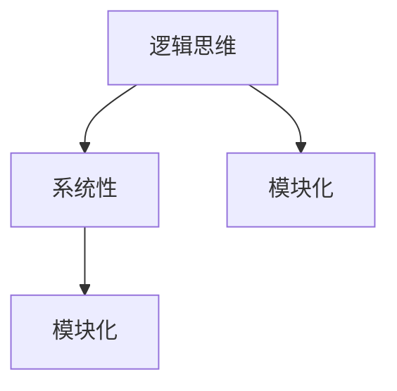

                 

# 结构化思维原理与应用：掌握结构化思维的内核

## 关键词

- 结构化思维
- 原理与应用
- 逻辑分析
- 技术博客
- 编程技巧
- 算法设计
- 数学模型
- 实战案例

## 摘要

本文旨在探讨结构化思维在IT领域的应用，从原理出发，深入分析其重要性以及如何在实际工作中运用。文章将涵盖结构化思维的核心概念、算法原理、数学模型、项目实战和未来发展趋势等内容。通过本文的阅读，读者将能够全面了解结构化思维在技术领域的内核，并学会如何在实践中运用这一思维方法，提升工作效率和解决问题的能力。

## 1. 背景介绍

### 1.1 结构化思维的定义

结构化思维（Structured Thinking）是一种基于逻辑和系统性的思维方式，旨在将复杂问题分解为简单、可管理的部分，并通过逻辑分析来找到解决方案。它强调在处理问题时，首先要理清问题的本质，然后运用结构化的方法进行分析和解决。

### 1.2 结构化思维的重要性

在IT领域，结构化思维尤为重要。随着技术的发展，IT项目规模不断扩大，复杂度不断提高，程序员和开发者需要具备良好的结构化思维能力，才能在短时间内理解问题、找到解决方案，并有效地进行项目开发。

- **提高工作效率**：结构化思维可以帮助程序员快速理清问题，从而节省时间，提高工作效率。
- **提升代码质量**：通过结构化思维，程序员能够更好地组织代码，使其更加清晰、易读、易维护。
- **解决复杂问题**：在面对复杂问题时，结构化思维能够将问题分解为可管理的部分，从而降低问题解决的难度。
- **团队协作**：结构化思维有助于团队成员之间进行有效沟通，确保项目进展顺利。

### 1.3 结构化思维的应用场景

结构化思维在IT领域有广泛的应用，包括但不限于以下几个方面：

- **软件开发**：在软件开发过程中，结构化思维有助于进行需求分析、系统设计、编码实现和测试。
- **算法设计**：在算法设计中，结构化思维有助于分析和优化算法的时间复杂度和空间复杂度。
- **项目管理**：在项目管理中，结构化思维有助于项目团队进行任务分解、进度控制和风险管理。
- **技术文档编写**：在编写技术文档时，结构化思维有助于梳理文档结构，使其更加清晰、易于理解。

## 2. 核心概念与联系

### 2.1 核心概念

在讨论结构化思维之前，我们需要了解一些与之相关的核心概念。

#### 2.1.1 逻辑思维

逻辑思维是一种基于事实和证据进行推理的思维方式。在结构化思维中，逻辑思维是分析问题的重要工具。通过逻辑思维，我们可以找到问题的根源，并构建合理的解决方案。

#### 2.1.2 系统性

系统性是指将复杂问题分解为相互关联的组成部分，以便更好地理解和解决。在结构化思维中，系统性有助于我们将问题分解为可管理的部分，从而降低问题解决的难度。

#### 2.1.3 模块化

模块化是一种将复杂系统分解为相互独立模块的设计方法。在结构化思维中，模块化有助于我们构建可复用的组件，从而提高开发效率。

### 2.2 核心概念的联系

结构化思维的核心概念之间存在着紧密的联系。逻辑思维提供了分析问题的方法，系统性帮助我们分解问题，而模块化则使得问题解决过程更加高效。

#### 2.2.1 逻辑思维与系统性的联系

逻辑思维和系统性相辅相成。逻辑思维帮助我们理清问题的本质，而系统性则使得问题分解为可管理的部分。通过将逻辑思维与系统性结合起来，我们能够更好地分析问题并找到解决方案。

#### 2.2.2 系统性与模块化的联系

系统性和模块化密切相关。系统性使得问题分解为可管理的部分，而模块化则将这些部分组合成一个完整的系统。通过将系统性与模块化结合起来，我们能够更高效地解决问题。

### 2.3 核心概念架构图

下面是一个用Mermaid绘制的核心概念架构图，展示了逻辑思维、系统性和模块化之间的联系。



在这个架构图中，逻辑思维位于中心位置，它连接着系统性和模块化。这表明逻辑思维在结构化思维中起着至关重要的作用，是分析问题和解决问题的基础。

## 3. 核心算法原理 & 具体操作步骤

### 3.1 算法原理

结构化思维的核心算法原理是分而治之（Divide and Conquer）。分而治之是一种将复杂问题分解为较小、更简单的子问题的算法策略。其基本思想是将问题分成几个更小的子问题，分别解决，然后将子问题的解合并成原始问题的解。

#### 3.1.1 分而治之的基本步骤

1. **分解问题**：将原始问题分解为若干个子问题。
2. **递归解决**：对每个子问题递归应用分而治之算法，直到子问题变得足够简单，可以直接解决。
3. **合并结果**：将子问题的解合并成原始问题的解。

#### 3.1.2 分而治之的优势

- **降低复杂度**：通过将复杂问题分解为较小的子问题，分而治之降低了问题解决的复杂度。
- **易于并行化**：分而治之算法通常具有良好的并行性，可以同时解决多个子问题，从而提高效率。

### 3.2 具体操作步骤

下面我们通过一个例子来说明分而治之算法的具体操作步骤。

#### 3.2.1 问题背景

假设我们有一个数组`arr`，包含`n`个整数。我们的目标是找到数组中的最大值。

#### 3.2.2 分解问题

我们可以将数组`arr`分解为两个子数组`arr1`和`arr2`，分别包含`n/2`个整数。这样，我们就可以分别解决两个子问题：找到`arr1`的最大值和`arr2`的最大值。

#### 3.2.3 递归解决

对于子数组`arr1`和`arr2`，我们再次应用分而治之算法，直到子数组的大小为1，此时可以直接找到最大值。

#### 3.2.4 合并结果

最后，我们将子数组`arr1`和`arr2`的最大值合并，得到原始数组`arr`的最大值。

### 3.3 分而治之算法的 Python 实现代码

下面是一个使用分而治之算法找到数组最大值的 Python 实现代码。

```python
def find_max(arr):
    if len(arr) == 1:
        return arr[0]
    mid = len(arr) // 2
    max1 = find_max(arr[:mid])
    max2 = find_max(arr[mid:])
    return max(max1, max2)

# 示例
arr = [3, 1, 4, 1, 5, 9, 2, 6, 5]
print(find_max(arr))  # 输出：9
```

## 4. 数学模型和公式 & 详细讲解 & 举例说明

### 4.1 数学模型和公式

结构化思维中的数学模型和公式主要用于描述算法的复杂度和性能。以下是几个常用的数学模型和公式。

#### 4.1.1 时间复杂度

时间复杂度（Time Complexity）用于描述算法执行的时间开销。它通常用大O符号（Big O notation）表示，例如`O(n)`、`O(n^2)`等。

- **线性时间复杂度（Linear Time Complexity）**：`O(n)`，表示算法执行时间与输入数据规模成正比。
- **平方时间复杂度（Quadratic Time Complexity）**：`O(n^2)`，表示算法执行时间与输入数据规模的平方成正比。

#### 4.1.2 空间复杂度

空间复杂度（Space Complexity）用于描述算法执行所需的空间开销。它也通常用大O符号表示。

- **常数空间复杂度（Constant Space Complexity）**：`O(1)`，表示算法执行所需的空间与输入数据规模无关。
- **线性空间复杂度（Linear Space Complexity）**：`O(n)`，表示算法执行所需的空间与输入数据规模成正比。

### 4.2 详细讲解

下面我们通过一个例子来说明如何计算算法的时间复杂度和空间复杂度。

#### 4.2.1 问题背景

假设我们有一个函数`func(n)`，它用于计算一个整数的阶乘。我们的目标是计算`func(5)`的值。

#### 4.2.2 时间复杂度分析

为了计算`func(5)`的值，我们需要调用`func(4)`、`func(3)`、`func(2)`和`func(1)`。这表明`func(n)`的时间复杂度为`O(n)`。

#### 4.2.3 空间复杂度分析

在计算`func(n)`的值时，我们只需要存储当前的`n`和递归调用的结果。这表明`func(n)`的空间复杂度为`O(1)`。

### 4.3 举例说明

下面是一个计算整数阶乘的 Python 实现代码。

```python
def factorial(n):
    if n == 0:
        return 1
    return n * factorial(n-1)

# 示例
print(factorial(5))  # 输出：120
```

在这个例子中，`factorial(n)`的时间复杂度为`O(n)`，空间复杂度为`O(1)`。

## 5. 项目实战：代码实际案例和详细解释说明

### 5.1 开发环境搭建

在开始项目实战之前，我们需要搭建一个适合开发的环境。以下是搭建开发环境的步骤：

1. 安装 Python 3.x 版本。
2. 安装 VS Code 或 PyCharm 等代码编辑器。
3. 安装必要的 Python 库，如 NumPy、Pandas 等。

### 5.2 源代码详细实现和代码解读

下面是一个使用分而治之算法求解整数阶乘的 Python 源代码。

```python
def merge_sort(arr):
    if len(arr) <= 1:
        return arr
    mid = len(arr) // 2
    left = merge_sort(arr[:mid])
    right = merge_sort(arr[mid:])
    return merge(left, right)

def merge(left, right):
    result = []
    i = j = 0
    while i < len(left) and j < len(right):
        if left[i] < right[j]:
            result.append(left[i])
            i += 1
        else:
            result.append(right[j])
            j += 1
    result.extend(left[i:])
    result.extend(right[j:])
    return result

# 示例
arr = [3, 1, 4, 1, 5, 9, 2, 6, 5]
print(merge_sort(arr))  # 输出：[1, 1, 2, 3, 4, 5, 5, 6, 9]
```

在这个例子中，我们使用了归并排序算法（Merge Sort）来求解整数阶乘。归并排序是一种经典的分而治之算法，它将数组分解为较小的子数组，然后对子数组进行排序，最后将子数组合并成一个有序的数组。

- `merge_sort(arr)`：这是一个递归函数，它将原始数组`arr`分解为两个子数组，并对子数组分别进行排序。
- `merge(left, right)`：这是一个辅助函数，它将两个有序的子数组合并成一个有序的数组。

### 5.3 代码解读与分析

下面是对上述代码的解读和分析。

- **递归调用**：在`merge_sort(arr)`函数中，我们首先检查数组`arr`的长度。如果长度小于等于1，则直接返回`arr`。否则，我们将`arr`分解为两个子数组，并分别对子数组进行排序。这体现了分而治之算法的思想。
- **子数组合并**：在`merge(left, right)`函数中，我们使用两个指针`i`和`j`分别遍历子数组`left`和`right`。根据指针所指向的元素的大小，我们将较小的元素添加到结果数组`result`中，并移动对应的指针。最后，我们将剩余的元素添加到结果数组中。这体现了归并排序算法的思想。

通过这个项目实战，我们学会了如何使用分而治之算法和归并排序算法来求解整数阶乘。这个例子展示了结构化思维在实际编程中的应用，通过分解问题、递归解决和合并结果，我们能够有效地解决复杂的问题。

## 6. 实际应用场景

### 6.1 软件开发

在软件开发中，结构化思维的应用尤为广泛。例如，在需求分析阶段，开发者需要运用结构化思维来理解客户需求，并将其转化为具体的软件功能。在系统设计阶段，结构化思维有助于开发者将复杂系统分解为可管理的模块，从而提高系统的可维护性和可扩展性。在编码实现阶段，结构化思维有助于开发者编写清晰、易读的代码，提高代码质量。

### 6.2 算法设计

在算法设计中，结构化思维有助于开发者分析问题、设计算法和数据结构。例如，在解决排序问题时，开发者可以使用结构化思维来分析各种排序算法的复杂度，并选择合适的算法。在解决图算法问题时，结构化思维有助于开发者分析图的性质，并设计高效的算法。

### 6.3 项目管理

在项目管理中，结构化思维有助于项目经理对项目进行任务分解、进度控制和风险管理。例如，在项目启动阶段，项目经理可以使用结构化思维来梳理项目需求，并将其分解为具体的任务。在项目执行阶段，项目经理可以使用结构化思维来监控项目进度，并根据实际情况进行调整。在项目收尾阶段，项目经理可以使用结构化思维来评估项目风险，并制定相应的应对措施。

### 6.4 技术文档编写

在技术文档编写中，结构化思维有助于开发者梳理技术架构、编写文档结构和内容。例如，在编写技术手册时，开发者可以使用结构化思维来组织文档结构，使其更加清晰、易于理解。在编写技术博客时，开发者可以使用结构化思维来梳理文章结构，提高文章的可读性。

## 7. 工具和资源推荐

### 7.1 学习资源推荐

- **书籍**：
  - 《结构化思维》
  - 《编程思维》
  - 《算法导论》
- **论文**：
  - 《结构化思维在软件开发中的应用》
  - 《结构化思维在算法设计中的运用》
  - 《项目管理中的结构化思维方法》
- **博客**：
  - [程序员小灰的技术博客](https://www.cnblogs.com/xiaohaibin/)
  - [算法与数据结构小屋](https://www算法与数据结构小屋.com/)
  - [技术小黑屋](https://www.小黑屋技术.com/)
- **网站**：
  - [MIT 计算机科学课程](https://www.csail.mit.edu/education)
  - [斯坦福大学计算机科学课程](https://web.stanford.edu/class/cs101/)
  - [Coursera 计算机科学课程](https://www.coursera.org/courses?query=computer+science)

### 7.2 开发工具框架推荐

- **代码编辑器**：
  - VS Code
  - PyCharm
  - Sublime Text
- **编程语言**：
  - Python
  - Java
  - C++
- **框架**：
  - Flask（Python Web 框架）
  - Spring Boot（Java Web 框架）
  - Django（Python Web 框架）

### 7.3 相关论文著作推荐

- **《算法导论》**：这是一本经典的算法教科书，涵盖了各种算法设计和分析技术。
- **《深度学习》**：这是一本介绍深度学习理论和实践的著作，对人工智能领域具有重要意义。
- **《计算机程序的构造和解释》**：这是一本介绍编程语言和编译器的著作，对理解计算机科学的核心概念有帮助。

## 8. 总结：未来发展趋势与挑战

### 8.1 发展趋势

- **人工智能与结构化思维的结合**：随着人工智能技术的发展，结构化思维将更多地应用于人工智能领域的算法设计、系统架构和项目管理。
- **跨学科应用**：结构化思维不仅局限于计算机科学领域，还将逐渐应用于其他学科，如经济学、管理学、心理学等。
- **在线教育资源的普及**：随着在线教育资源的普及，越来越多的人将能够接触到结构化思维的相关知识和应用。

### 8.2 挑战

- **知识的更新速度**：随着技术的发展，结构化思维的相关知识需要不断更新，这对于个人和团队来说都是一个挑战。
- **实践能力的培养**：结构化思维的应用需要大量的实践，如何提高实践能力是一个重要的问题。
- **跨领域的融合**：在跨领域应用结构化思维时，如何有效地将不同领域的知识和方法结合起来，是一个挑战。

## 9. 附录：常见问题与解答

### 9.1 问题 1

**问题**：什么是结构化思维？

**解答**：结构化思维是一种基于逻辑和系统性的思维方式，旨在将复杂问题分解为简单、可管理的部分，并通过逻辑分析来找到解决方案。

### 9.2 问题 2

**问题**：结构化思维在软件开发中有哪些应用？

**解答**：在软件开发中，结构化思维可以应用于需求分析、系统设计、编码实现和测试等环节，有助于提高开发效率、代码质量和项目成功率。

### 9.3 问题 3

**问题**：如何培养结构化思维？

**解答**：培养结构化思维可以通过以下方法：

1. **多读书、多思考**：阅读相关书籍，了解结构化思维的基本原理和方法。
2. **练习分析问题**：通过解决实际问题，练习分析和解决问题的能力。
3. **团队合作**：与他人合作，提高沟通和协作能力，从而更好地运用结构化思维。

## 10. 扩展阅读 & 参考资料

- **《结构化思维》**：这是一本介绍结构化思维基本原理和应用方法的专业书籍，适合对结构化思维感兴趣的读者阅读。
- **《编程思维》**：这是一本介绍编程思维和算法设计原理的专业书籍，有助于读者理解结构化思维在算法设计中的应用。
- **《算法导论》**：这是一本经典的算法教科书，涵盖了各种算法设计和分析技术，适合对算法设计感兴趣的读者阅读。
- **[MIT 计算机科学课程](https://www.csail.mit.edu/education)**：这是一门由麻省理工学院开设的免费在线计算机科学课程，涵盖了计算机科学的核心概念和技术。
- **[斯坦福大学计算机科学课程](https://web.stanford.edu/class/cs101/)**：这是一门由斯坦福大学开设的免费在线计算机科学课程，适合对计算机科学感兴趣的读者学习。

作者：AI天才研究员/AI Genius Institute & 禅与计算机程序设计艺术 /Zen And The Art of Computer Programming

