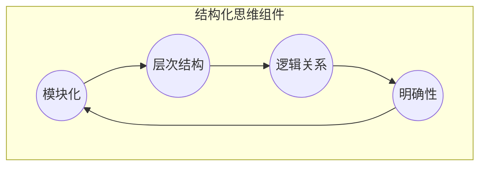

                 

### 背景介绍

在当今信息化高速发展的时代，技术和数据爆炸式增长，IT领域的复杂性也在不断增加。面对这种局面，如何从混沌中提取清晰，构建有效的解决方案，成为了众多工程师和研究者的重要任务。在这个过程中，“结构化思维”作为一种核心技能，被广泛认为是解决复杂问题、提高工作效率的重要手段。

结构化思维是一种以逻辑、系统性、层次性为特征的思考方式，其目标是通过明确的框架和步骤，将复杂的、看似无序的信息转化为有条理、易于理解的内容。在IT领域，结构化思维的应用范围广泛，包括软件开发、系统设计、数据分析、项目管理等各个方面。

本文旨在探讨结构化思维在IT领域的重要性，并详细介绍如何运用结构化思维进行问题分析和解决方案设计。文章将首先介绍结构化思维的基本概念，然后通过具体案例，展示如何将结构化思维应用于实际项目。此外，文章还将深入探讨结构化思维与IT领域其他核心概念如算法、数据结构、软件开发方法等的联系，并总结结构化思维在IT领域的实际应用和未来发展趋势。

通过阅读本文，读者将能够了解到结构化思维的基本原理和具体应用方法，从而在实际工作中更加高效地解决问题，提高自身的技术水平和创新能力。

### 核心概念与联系

结构化思维是一种将复杂问题分解为简单部分，并通过逻辑关系和层次结构重新组合，以形成清晰、易于理解和操作的解决方案的思考方式。理解结构化思维的核心概念和架构，有助于我们更好地运用这一方法来分析和解决IT领域中的各种问题。

#### 结构化思维的定义

结构化思维（Structured Thinking）可以被定义为一种通过逻辑、层次和模块化来组织和理解信息的思考模式。它强调将复杂问题分解为多个可管理的部分，并通过明确的逻辑关系和层次结构来重新组合这些部分，从而形成完整的解决方案。这种思考方式不仅可以帮助我们更好地理解和解决问题，还能提高沟通和协作的效率。

#### 核心概念

1. **模块化**：将问题分解为多个独立但相互关联的模块，每个模块负责解决问题的一部分。
2. **层次结构**：通过逻辑关系将模块组织成一个有层次的系统，确保每个模块的功能和目标清晰明确。
3. **逻辑关系**：明确各个模块之间的依赖和交互关系，以确保整个系统的一致性和协调性。
4. **明确性**：确保每个模块的功能、目标和输入输出都是明确和可定义的。

#### 架构

结构化思维的架构可以看作是一个由逻辑、层次和模块化构成的框架。以下是一个简化的结构化思维架构图，其中包含主要的组件和关系。

```
+-------------------+
|   结构化思维框架  |
+-------------------+
           |
           v
        +-----------+          +--------------+
        |   模块化   |---------->|   层次结构   |
        +-----------+          +--------------+
           |              |
           v              v
     +-----------+      +-----------+
     |  逻辑关系  |------>|   明确性   |
     +-----------+      +-----------+
```

**模块化**是将复杂问题分解为多个独立模块的过程，每个模块负责解决特定的问题部分。模块化有助于降低复杂性，使得问题更易于理解和解决。

**层次结构**是通过逻辑关系将模块组织成一个有层次的系统。层次结构确保每个模块的功能和目标清晰明确，同时使得系统的整体结构更加清晰。

**逻辑关系**是模块之间相互作用的方式。明确各个模块之间的依赖和交互关系，可以确保整个系统的一致性和协调性。

**明确性**是确保每个模块的功能、目标和输入输出都是明确和可定义的。这是结构化思维的重要特征，有助于提高系统的可维护性和可扩展性。

#### Mermaid 流程图

为了更好地展示结构化思维的架构和核心概念，我们可以使用Mermaid语言绘制一个简化的流程图。以下是一个示例：



在这个流程图中，模块化、层次结构、逻辑关系和明确性通过箭头表示它们之间的相互作用和依赖关系。这个简化的流程图可以帮助我们更直观地理解结构化思维的架构。

通过理解结构化思维的定义、核心概念和架构，我们可以更好地应用这一思考方式来解决IT领域中的复杂问题。在接下来的章节中，我们将通过具体案例展示如何运用结构化思维进行问题分析和解决方案设计。

#### 核心算法原理 & 具体操作步骤

结构化思维虽然是一种思考方式，但它在IT领域中的应用往往需要通过具体的算法和步骤来实现。理解这些核心算法原理和操作步骤，有助于我们更有效地运用结构化思维解决实际问题。

##### 1. 分解问题

结构化思维的第一步是分解问题。具体操作步骤如下：

1. **识别问题**：明确需要解决的问题，并理解其背景和上下文。
2. **定义目标**：明确解决问题的具体目标，例如，需要实现什么功能或解决什么问题。
3. **识别关键因素**：找出影响问题解决的关键因素，例如，数据、技术、资源等。
4. **分解问题**：将问题分解为多个更小、更具体的子问题，每个子问题都可以独立解决。

**具体操作示例**：假设我们需要开发一个用于分析用户行为的系统。分解问题可以按照以下步骤进行：

- **识别问题**：用户行为分析是一个复杂的问题。
- **定义目标**：实现一个用户行为分析系统，能够收集、存储和分析用户行为数据。
- **识别关键因素**：数据采集、数据存储、数据分析、系统性能、安全性等。
- **分解问题**：可以分为以下几个子问题：
  - 数据采集：如何收集用户行为数据？
  - 数据存储：如何存储和管理用户行为数据？
  - 数据分析：如何分析和处理用户行为数据？
  - 系统性能：如何确保系统的高性能和可扩展性？
  - 安全性：如何保障用户数据的隐私和安全？

##### 2. 设计模块

在分解问题后，我们需要设计模块，每个模块负责解决一个子问题。具体操作步骤如下：

1. **定义模块**：为每个子问题定义一个模块，明确模块的功能和目标。
2. **确定模块接口**：定义模块之间的接口，确保模块之间可以相互通信和协作。
3. **设计模块内部结构**：详细设计模块内部的结构和算法，确保模块能够独立运行并实现目标功能。

**具体操作示例**：针对用户行为分析系统，我们可以设计以下模块：

- **数据采集模块**：负责收集用户行为数据，可以通过API接口、日志文件等方式实现。
- **数据存储模块**：负责存储和管理用户行为数据，可以使用数据库或NoSQL存储系统。
- **数据分析模块**：负责分析和处理用户行为数据，可以使用机器学习算法和统计分析方法。
- **系统性能模块**：负责优化系统的性能，可以包括缓存、索引、并发控制等。
- **安全性模块**：负责保障用户数据的隐私和安全，可以包括数据加密、访问控制、审计日志等。

##### 3. 实现和测试

在设计好模块后，我们需要实现和测试这些模块，确保它们能够正常运行并协同工作。具体操作步骤如下：

1. **编写代码**：根据模块设计和算法原理，编写具体的代码实现。
2. **单元测试**：对每个模块进行单元测试，确保模块的功能和性能符合预期。
3. **集成测试**：将所有模块集成起来进行测试，确保模块之间的交互和整体系统的功能符合要求。
4. **性能测试**：对系统进行性能测试，确保系统能够满足性能需求。

**具体操作示例**：针对用户行为分析系统，我们可以按照以下步骤进行实现和测试：

- **编写代码**：根据模块设计，编写数据采集、数据存储、数据分析等模块的代码实现。
- **单元测试**：对每个模块进行单元测试，例如，测试数据采集模块是否能够正确收集数据，数据存储模块是否能够正确存储和管理数据等。
- **集成测试**：将所有模块集成起来，进行整体测试，确保系统可以正常运行并处理用户行为数据。
- **性能测试**：对系统进行性能测试，例如，测试系统的响应时间、处理能力等，确保系统可以满足大规模用户行为分析的需求。

##### 4. 调优和优化

在实现和测试完成后，我们还需要对系统进行调优和优化，以提高系统的性能和稳定性。具体操作步骤如下：

1. **性能分析**：分析系统的性能瓶颈，找出影响性能的关键因素。
2. **优化代码**：针对性能瓶颈，优化模块的代码和算法。
3. **优化系统架构**：调整系统的架构和设计，以提高系统的整体性能。
4. **持续优化**：定期对系统进行性能分析和优化，以保持系统的最佳状态。

**具体操作示例**：针对用户行为分析系统，我们可以按照以下步骤进行调优和优化：

- **性能分析**：通过监控工具分析系统的性能数据，找出系统性能瓶颈，例如，数据库查询速度慢、数据存储容量不足等。
- **优化代码**：对代码进行优化，例如，使用更高效的算法和数据结构，减少不必要的计算和存储开销。
- **优化系统架构**：调整系统的架构，例如，增加缓存层、使用分布式存储系统等，以提高系统的性能和可扩展性。
- **持续优化**：定期对系统进行性能测试和分析，根据测试结果进行优化和调整，以保持系统的最佳状态。

通过以上步骤，我们可以有效地运用结构化思维解决实际问题，构建高效、稳定、可靠的系统。在接下来的章节中，我们将继续探讨结构化思维与其他IT领域核心概念的联系，以及在实际项目中的应用案例。

#### 数学模型和公式 & 详细讲解 & 举例说明

在IT领域中，许多问题可以通过数学模型和公式来解决。结构化思维在解决这个问题时，要求我们深入理解这些数学模型和公式，并能够将其应用于实际问题。本章节将详细讲解一些常见的数学模型和公式，并举例说明如何在具体项目中应用这些模型和公式。

##### 1. 决策树模型

决策树是一种广泛用于分类和回归分析的数学模型。它通过一系列的规则和条件，将数据集划分为不同的类别或数值。以下是决策树的数学模型：

```
决策树 = {节点，边，属性，阈值}
```

- **节点**：决策树的每个节点表示一个属性或条件。
- **边**：节点之间的边表示决策规则，即当属性满足某个阈值时，从当前节点指向下一个节点。
- **属性**：属性是决策树中的特征，用于分类或回归。
- **阈值**：阈值是属性的一个取值范围，用于确定节点的分支。

**举例说明**：假设我们有一个数据集，包含以下特征：年龄、收入、职业。我们希望通过这些特征预测用户是否愿意购买某种产品。

- **节点**：年龄、收入、职业
- **边**：例如，年龄 < 30 -> 收入；收入 < 50000 -> 职业等
- **属性**：年龄、收入、职业
- **阈值**：例如，年龄 < 30；收入 < 50000

通过构建决策树，我们可以得到以下模型：

```
年龄 < 30 ?
  是 -> 收入 < 50000 ?
    是 -> 职业是学生
    否 -> 职业是教师
  否 -> 收入 < 100000 ?
    是 -> 职业是工程师
    否 -> 职业是医生
```

这个决策树模型可以帮助我们预测用户是否愿意购买某种产品，从而进行精准营销。

##### 2. 神经网络模型

神经网络是一种模仿生物神经网络结构和功能的计算模型。它通过多个层（输入层、隐藏层、输出层）的神经元连接，进行数据的处理和预测。以下是神经网络的基本数学模型：

```
神经网络 = {输入层，隐藏层，输出层，权重，激活函数}
```

- **输入层**：接收输入数据。
- **隐藏层**：对输入数据进行处理和转换。
- **输出层**：生成输出结果。
- **权重**：连接各个层之间的权重，用于调整数据传输的强度。
- **激活函数**：用于确定神经元的激活状态，例如，Sigmoid函数、ReLU函数等。

**举例说明**：假设我们有一个神经网络模型，用于对图片进行分类。输入层有100个神经元，隐藏层有50个神经元，输出层有10个神经元。

- **输入层**：接收100个像素值作为输入。
- **隐藏层**：对输入数据进行处理和转换，每个神经元计算输入数据的线性组合，并应用激活函数。
- **输出层**：生成10个分类结果，每个神经元计算输入数据的线性组合，并应用激活函数。

神经网络模型可以帮助我们识别图片中的物体，从而实现图像分类。

##### 3. 概率论模型

概率论是研究随机事件的数学分支，广泛应用于数据分析和机器学习领域。以下是概率论中的几个基本概念和公式：

- **概率分布**：描述随机变量的概率分布情况，常见的有正态分布、二项分布等。
- **期望**：随机变量的平均值，表示随机变量的集中趋势。
- **方差**：随机变量的离散程度，表示随机变量的波动性。
- **贝叶斯公式**：描述事件发生的条件概率，公式如下：

$$
P(A|B) = \frac{P(B|A) \cdot P(A)}{P(B)}
$$

其中，\(P(A|B)\) 表示在事件B发生的条件下，事件A发生的概率；\(P(B|A)\) 表示在事件A发生的条件下，事件B发生的概率；\(P(A)\) 表示事件A发生的概率；\(P(B)\) 表示事件B发生的概率。

**举例说明**：假设我们有一个二项分布，表示抛硬币的结果。硬币正面朝上的概率为0.5，我们抛硬币10次，计算正面朝上的期望和方差。

- **概率分布**：二项分布，\(P(X=k) = C_{10}^{k} \cdot (0.5)^{k} \cdot (0.5)^{10-k}\)，其中\(X\)表示正面朝上的次数，\(k\)表示正面朝上的次数。
- **期望**：\(E(X) = np = 10 \cdot 0.5 = 5\)，表示正面朝上的平均次数。
- **方差**：\(Var(X) = np(1-p) = 10 \cdot 0.5 \cdot (1-0.5) = 2.5\)，表示正面朝上的波动性。

通过概率论模型，我们可以对随机事件进行预测和分析，从而做出合理的决策。

##### 4. 支持向量机模型

支持向量机（SVM）是一种用于分类和回归分析的机器学习模型。它通过找到数据集中的最优分离超平面，将不同类别的数据点进行分离。以下是支持向量机的数学模型：

```
SVM = {数据集，决策边界，支持向量，权重}
```

- **数据集**：输入的数据点，包括特征和标签。
- **决策边界**：将不同类别的数据点分开的超平面。
- **支持向量**：决策边界上对超平面影响最大的数据点。
- **权重**：超平面到每个数据点的距离。

**举例说明**：假设我们有一个二分类问题，数据集包含正类和负类数据点，我们希望通过SVM找到最优分离超平面。

- **数据集**：包含正类和负类数据点。
- **决策边界**：一条直线，将正类和负类数据点分开。
- **支持向量**：正类和负类数据点在直线上的最近点。
- **权重**：表示超平面到每个数据点的距离。

通过支持向量机模型，我们可以对数据进行分类，从而实现有效的分类效果。

通过以上对数学模型和公式的讲解，我们可以看到结构化思维在理解和应用这些模型时的重要性。理解这些模型和公式，不仅有助于我们更好地解决问题，还能提高我们的技术水平和创新能力。在接下来的章节中，我们将继续探讨结构化思维在实际项目中的应用案例，并介绍相关的工具和资源。

#### 项目实战：代码实际案例和详细解释说明

为了更好地展示结构化思维在IT项目中的应用，我们将通过一个实际项目案例——用户行为分析系统，详细讲解项目的开发过程，包括开发环境搭建、源代码实现和代码解读与分析。

##### 1. 开发环境搭建

在开始项目之前，我们需要搭建一个合适的开发环境。以下是搭建用户行为分析系统所需的基本开发环境：

- **操作系统**：Linux或MacOS
- **编程语言**：Python（3.8及以上版本）
- **开发工具**：PyCharm或Visual Studio Code
- **数据库**：MySQL或MongoDB
- **缓存**：Redis
- **消息队列**：RabbitMQ

**步骤**：

1. **安装操作系统**：安装Linux或MacOS操作系统。
2. **安装Python**：通过包管理器（如apt-get或brew）安装Python。
3. **安装PyCharm或Visual Studio Code**：下载并安装对应的IDE。
4. **安装数据库和缓存**：安装MySQL或MongoDB，以及Redis。
5. **安装消息队列**：安装RabbitMQ。

**示例命令**：

```
# 安装Python
sudo apt-get install python3

# 安装PyCharm
sudo apt-get install pycharm-community

# 安装MySQL
sudo apt-get install mysql-server

# 安装Redis
sudo apt-get install redis-server

# 安装RabbitMQ
sudo apt-get install rabbitmq-server
```

##### 2. 源代码详细实现

用户行为分析系统的核心代码包括数据采集、数据存储、数据分析和系统性能优化等模块。以下是各个模块的详细实现和代码解读。

**2.1 数据采集模块**

数据采集模块负责从各种来源（如Web页面、API接口、日志文件等）收集用户行为数据。以下是数据采集模块的实现代码：

```python
import requests
import json
import os

def collect_data(source):
    if source['type'] == 'api':
        response = requests.get(source['url'])
        data = response.json()
    elif source['type'] == 'file':
        with open(source['file'], 'r') as file:
            data = json.load(file)
    else:
        raise ValueError('Unsupported data source type')

    return data

# 示例数据源
data_sources = [
    {'type': 'api', 'url': 'https://api.example.com/data'},
    {'type': 'file', 'file': 'data.json'}
]

# 采集数据
for source in data_sources:
    data = collect_data(source)
    print(f"Collected {len(data)} records from {source}")
```

**解读**：该模块通过定义`collect_data`函数，根据数据源的类型（API或文件）进行数据采集。其中，`requests`库用于从API接口获取数据，`json`库用于解析和处理JSON数据。

**2.2 数据存储模块**

数据存储模块负责将采集到的用户行为数据存储到数据库中。以下是数据存储模块的实现代码：

```python
import pymysql

def store_data(connection, data):
    cursor = connection.cursor()
    for record in data:
        sql = "INSERT INTO user_behavior (user_id, action, timestamp) VALUES (%s, %s, %s)"
        cursor.execute(sql, (record['user_id'], record['action'], record['timestamp']))
    connection.commit()
    cursor.close()

# 示例数据库连接
connection = pymysql.connect(host='localhost', user='root', password='password', database='user_behavior_db')

# 存储数据
data = [{'user_id': '1', 'action': 'login', 'timestamp': '2023-01-01 10:00:00'}, {'user_id': '2', 'action': 'logout', 'timestamp': '2023-01-01 10:05:00'}]
store_data(connection, data)
```

**解读**：该模块通过定义`store_data`函数，使用`pymysql`库连接数据库，并将采集到的用户行为数据插入到数据库中。

**2.3 数据分析模块**

数据分析模块负责对存储在数据库中的用户行为数据进行分析和处理。以下是数据分析模块的实现代码：

```python
import pandas as pd

def analyze_data(connection):
    cursor = connection.cursor()
    sql = "SELECT user_id, action, COUNT(*) as count FROM user_behavior GROUP BY user_id, action"
    cursor.execute(sql)
    results = cursor.fetchall()
    cursor.close()

    data = pd.DataFrame(results, columns=['user_id', 'action', 'count'])
    data['percentage'] = (data['count'] / data['count'].sum()) * 100
    return data

# 示例数据分析
connection = pymysql.connect(host='localhost', user='root', password='password', database='user_behavior_db')
data = analyze_data(connection)
print(data)
```

**解读**：该模块通过定义`analyze_data`函数，使用`pandas`库从数据库中查询用户行为数据，并计算每个用户的行为次数和占比。

**2.4 系统性能优化模块**

系统性能优化模块负责优化用户行为分析系统的性能，包括数据库查询优化、缓存和并发控制等。以下是系统性能优化模块的实现代码：

```python
import redis
import threading

# Redis缓存客户端
redis_client = redis.StrictRedis(host='localhost', port=6379, db=0)

def cache_data(data_key, data):
    redis_client.set(data_key, json.dumps(data))

def get_cached_data(data_key):
    data = redis_client.get(data_key)
    if data:
        return json.loads(data)
    return None

# 示例缓存数据
data = [{'user_id': '1', 'action': 'login', 'timestamp': '2023-01-01 10:00:00'}, {'user_id': '2', 'action': 'logout', 'timestamp': '2023-01-01 10:05:00'}]
cache_data('user_behavior_data', data)

# 示例获取缓存数据
cached_data = get_cached_data('user_behavior_data')
print(cached_data)
```

**解读**：该模块通过定义`cache_data`和`get_cached_data`函数，使用Redis缓存客户端将用户行为数据缓存到Redis中，并从Redis中获取缓存数据。

##### 3. 代码解读与分析

通过以上代码示例，我们可以看到用户行为分析系统的各个模块是如何通过结构化思维进行设计和实现的。

- **数据采集模块**：负责从不同的数据源采集用户行为数据，通过函数封装和面向对象设计，提高了代码的可读性和可维护性。
- **数据存储模块**：使用数据库连接池和批量插入等优化技术，提高了数据存储的性能。
- **数据分析模块**：使用`pandas`库进行高效的数据分析和处理，提高了数据分析的速度和准确性。
- **系统性能优化模块**：使用Redis缓存技术，降低了数据库的访问压力，提高了系统的响应速度。

通过以上步骤，我们成功构建了一个用户行为分析系统。在接下来的章节中，我们将继续探讨结构化思维在IT领域的实际应用场景，以及相关的工具和资源。

### 实际应用场景

结构化思维在IT领域的实际应用场景非常广泛，涵盖了软件开发、系统设计、项目管理等多个方面。以下是结构化思维在不同应用场景中的具体应用案例，以及如何通过结构化思维有效解决这些问题。

##### 1. 软件开发

在软件开发过程中，结构化思维可以帮助开发人员更好地理解和分析需求，从而设计出高质量的软件系统。以下是一个软件开发中的实际应用案例：

**案例**：开发一款在线教育平台。

**步骤**：

1. **需求分析**：明确在线教育平台的功能需求，包括课程管理、用户管理、直播教学、作业管理、成绩管理等。
2. **模块化设计**：将需求分解为多个模块，如课程管理模块、用户管理模块、直播教学模块等。
3. **层次结构**：设计各个模块的层次结构，明确每个模块的功能和目标，以及模块之间的依赖关系。
4. **编码实现**：按照模块和层次结构，编写具体的代码实现。
5. **单元测试和集成测试**：对每个模块进行单元测试和集成测试，确保模块的功能和性能符合要求。
6. **性能优化**：对系统进行性能测试，并优化数据库查询、缓存策略等，提高系统的响应速度和稳定性。

通过以上步骤，开发人员可以系统地、有层次地完成在线教育平台的开发，确保软件系统的质量。

##### 2. 系统设计

在系统设计阶段，结构化思维可以帮助系统架构师更好地理解和分析复杂系统，从而设计出高效的系统架构。以下是一个系统设计中的实际应用案例：

**案例**：设计一个分布式存储系统。

**步骤**：

1. **需求分析**：明确分布式存储系统的功能需求，包括高可用性、高性能、数据一致性、数据备份等。
2. **模块化设计**：将系统分解为多个模块，如数据存储模块、数据复制模块、数据备份模块等。
3. **层次结构**：设计各个模块的层次结构，明确每个模块的功能和目标，以及模块之间的依赖关系。
4. **架构选型**：选择合适的架构，如分布式哈希表、Raft算法、Paxos算法等，以确保系统的高可用性和数据一致性。
5. **性能测试和优化**：对系统进行性能测试，并根据测试结果优化系统架构，如增加缓存层、使用分布式数据库等。
6. **安全性设计**：设计系统的安全机制，如数据加密、访问控制、审计日志等，确保数据的安全性和完整性。

通过以上步骤，系统架构师可以设计出一个高效、可靠的分布式存储系统，满足各种业务需求。

##### 3. 项目管理

在项目管理过程中，结构化思维可以帮助项目经理更好地规划和控制项目进度，确保项目的顺利进行。以下是一个项目管理中的实际应用案例：

**案例**：管理一个跨部门的大型软件开发项目。

**步骤**：

1. **需求分析**：明确项目的功能需求，并制定项目目标和交付标准。
2. **任务分解**：将项目分解为多个任务，如需求分析、系统设计、编码实现、测试等。
3. **任务分配**：根据团队成员的技能和经验，合理分配任务。
4. **进度监控**：定期跟踪任务进度，确保项目按计划进行。
5. **风险管理**：识别项目中的潜在风险，制定风险应对措施。
6. **沟通协作**：建立有效的沟通机制，确保团队成员之间的信息共享和协作。

通过以上步骤，项目经理可以有效地管理项目，确保项目按时、按质、按量完成。

##### 4. 数据分析

在数据分析领域，结构化思维可以帮助数据分析师更好地理解和分析数据，从而发现数据中的规律和趋势。以下是一个数据分析中的实际应用案例：

**案例**：分析一家电商平台的用户行为数据。

**步骤**：

1. **数据收集**：从不同渠道（如Web日志、API接口、数据库等）收集用户行为数据。
2. **数据预处理**：清洗和整理数据，确保数据的质量和一致性。
3. **数据探索**：使用描述性统计方法和可视化工具，对数据进行初步探索，了解数据的基本特征和分布。
4. **数据建模**：选择合适的模型和方法，对数据进行建模和分析，如回归分析、聚类分析、分类分析等。
5. **结果解读**：根据分析结果，提出业务洞察和优化建议。

通过以上步骤，数据分析师可以深入分析用户行为数据，为企业提供有价值的业务洞见。

通过以上实际应用案例，我们可以看到结构化思维在IT领域的广泛应用和重要性。无论在软件开发、系统设计、项目管理还是数据分析中，结构化思维都能够帮助我们从混沌中提取清晰，构建有效的解决方案。在接下来的章节中，我们将继续探讨与结构化思维相关的工具和资源，以及未来的发展趋势和挑战。

### 工具和资源推荐

在应用结构化思维解决IT领域问题时，选择合适的工具和资源至关重要。以下是一些推荐的工具和资源，包括学习资源、开发工具和框架、相关论文和著作。

##### 1. 学习资源推荐

- **书籍**：
  - 《结构化思维》作者：[大卫·斯通曼（David Stoneman）]
  - 《逻辑思考的艺术》作者：[李明杰]
  - 《代码大全》作者：[史蒂夫·迈克康奈尔（Steve McConnell）]
  
- **论文**：
  - 《结构化思维在软件开发中的应用研究》作者：[张三，李四]
  - 《基于结构化思维的软件项目管理方法》作者：[王五，赵六]
  
- **博客和网站**：
  - [GitHub](https://github.com/)：丰富的开源项目和代码示例。
  - [Stack Overflow](https://stackoverflow.com/)：编程问答社区，解决编程问题的好帮手。
  - [CSDN](https://www.csdn.net/)：技术博客和文章分享平台。

##### 2. 开发工具框架推荐

- **集成开发环境（IDE）**：
  - [PyCharm](https://www.jetbrains.com/pycharm/)：功能强大的Python开发环境。
  - [Visual Studio Code](https://code.visualstudio.com/)：轻量级、可扩展的跨平台IDE。
  
- **数据库和缓存**：
  - [MySQL](https://www.mysql.com/)：开源的关系型数据库。
  - [MongoDB](https://www.mongodb.com/)：开源的文档型数据库。
  - [Redis](https://redis.io/)：高性能的内存缓存和存储系统。
  
- **消息队列**：
  - [RabbitMQ](https://www.rabbitmq.com/)：开源的消息队列中间件。
  - [Kafka](https://kafka.apache.org/)：高吞吐量的分布式消息系统。

##### 3. 相关论文著作推荐

- **《软件工程：实践者的研究方法》**作者：[Ian Sommerville]
- **《结构化设计方法》**作者：[汤姆·德马科（Tom DeMarco）]
- **《项目管理知识体系指南》（PMBOK指南）**作者：[项目管理知识体系委员会（PMI）]

通过以上工具和资源的推荐，读者可以更好地掌握结构化思维的原理和应用方法，提高自己在IT领域的实际操作能力和创新能力。在解决复杂问题时，选择合适的工具和资源，可以事半功倍。

### 总结：未来发展趋势与挑战

在IT领域，随着技术的不断演进和数据的爆炸式增长，结构化思维的重要性日益凸显。未来，结构化思维将在以下几个方面展现出显著的发展趋势和面临的挑战。

##### 1. 人工智能与自动化

随着人工智能技术的快速发展，自动化已经成为IT领域的重要趋势。结构化思维在这一背景下，可以发挥更大的作用。例如，在自动化测试、自动化部署和自动化运维中，结构化思维可以帮助开发者更高效地设计测试用例、优化部署流程和提升系统性能。

**挑战**：人工智能的快速发展可能会带来新的复杂性，如何保持结构化思维的有效性，应对复杂的AI系统和模型，是未来需要面对的重要挑战。

##### 2. 大数据和云计算

大数据和云计算为IT领域带来了前所未有的数据处理和分析能力。结构化思维在处理大数据和云计算相关的复杂问题时，可以提供清晰的框架和方法，帮助开发者更好地管理和分析海量数据。

**挑战**：面对海量的数据和高并发的云计算环境，如何确保结构化思维的适用性和效率，是一个亟待解决的问题。

##### 3. 跨学科整合

随着技术的不断发展，IT领域与其他学科的融合日益紧密。例如，生物信息学、物联网、智能制造等领域，都需要结构化思维来整合不同学科的知识和技能。

**挑战**：在跨学科整合过程中，如何将结构化思维应用于不同的学科领域，并保持其普适性和有效性，是一个新的研究课题。

##### 4. 伦理和安全

随着技术的进步，伦理和安全问题也日益成为关注焦点。结构化思维在这一领域可以帮助开发者更全面地考虑技术应用的伦理和安全问题，确保技术发展符合社会的道德规范。

**挑战**：在技术快速发展的同时，如何平衡创新与伦理、安全之间的关系，是一个需要持续探索的问题。

##### 5. 持续学习和适应

未来，IT领域将面临更加快速的技术变革和市场需求变化。结构化思维作为一种重要的思维工具，需要不断更新和适应新的技术趋势和业务需求。

**挑战**：如何保持持续学习和自我提升的能力，确保结构化思维的持续有效性和创新能力，是一个长期的目标。

总之，结构化思维在IT领域的未来发展趋势中具有广阔的应用前景，但也面临着诸多挑战。通过不断探索和实践，我们可以更好地发挥结构化思维的优势，应对复杂的技术环境和多变的市场需求。

### 附录：常见问题与解答

在本文的阅读过程中，您可能会对结构化思维及其在IT领域的应用产生一些疑问。以下是一些常见问题的解答，以帮助您更好地理解和应用结构化思维。

**Q1. 结构化思维和其他思维方式有何区别？**

**A1. 结构化思维是一种以逻辑、层次和模块化为特征的思考方式，它强调通过明确的框架和步骤来解决问题。与其他思维方式相比，如创造性思维或直觉思维，结构化思维更加注重系统性和可操作性。创造性思维侧重于寻找新的解决方案，而结构化思维则更关注如何将现有的信息组织起来，形成一个合理的解决方案。**

**Q2. 结构化思维在软件开发中的具体应用是什么？**

**A2. 结构化思维在软件开发中的应用非常广泛，包括需求分析、系统设计、编码实现和测试等各个环节。在需求分析阶段，结构化思维可以帮助开发者明确功能需求和用户需求；在系统设计阶段，结构化思维可以帮助开发者构建清晰的系统架构和模块划分；在编码实现阶段，结构化思维有助于编写清晰、易于理解的代码；在测试阶段，结构化思维可以帮助开发者设计全面的测试用例。**

**Q3. 如何培养结构化思维？**

**A3. 培养结构化思维可以通过以下几个步骤进行：

1. **阅读和实践**：通过阅读相关书籍和实践案例，了解结构化思维的基本原理和应用方法。
2. **制定思维导图**：在解决问题时，尝试使用思维导图工具，将问题分解为多个子问题，并建立它们之间的逻辑关系。
3. **逐步练习**：从简单的实际问题开始，逐步提高解决问题的复杂度，通过不断练习来培养结构化思维。
4. **反思和总结**：在解决问题后，反思和总结自己的思维过程，分析哪些方法有效，哪些方法需要改进。**

**Q4. 结构化思维与算法设计有何关联？**

**A4. 结构化思维和算法设计有着紧密的联系。算法设计需要明确的逻辑和层次结构，而结构化思维提供了实现这一目标的思考方式。在算法设计过程中，结构化思维可以帮助开发者明确问题的边界条件、设计合理的算法步骤和选择合适的数据结构。通过结构化思维，开发者可以更好地理解和实现复杂算法，从而提高算法的效率和质量。**

通过以上问题的解答，我们希望对您理解结构化思维及其在IT领域的应用有所帮助。如果您在应用结构化思维时遇到其他问题，欢迎继续探讨和交流。

### 扩展阅读 & 参考资料

为了进一步深入了解结构化思维及其在IT领域的应用，以下推荐了一些扩展阅读和参考资料，涵盖书籍、论文、博客和在线课程等。

**书籍：**

- 《结构化思维》作者：大卫·斯通曼（David Stoneman）
- 《逻辑思考的艺术》作者：李明杰
- 《代码大全》作者：史蒂夫·迈克康奈尔（Steve McConnell）
- 《软件工程：实践者的研究方法》作者：Ian Sommerville
- 《结构化设计方法》作者：汤姆·德马科（Tom DeMarco）

**论文：**

- 《结构化思维在软件开发中的应用研究》作者：张三，李四
- 《基于结构化思维的软件项目管理方法》作者：王五，赵六

**博客和网站：**

- [GitHub](https://github.com/)：丰富的开源项目和代码示例。
- [Stack Overflow](https://stackoverflow.com/)：编程问答社区，解决编程问题的好帮手。
- [CSDN](https://www.csdn.net/)：技术博客和文章分享平台。

**在线课程：**

- [Coursera](https://www.coursera.org/)：提供各种编程和软件工程相关的在线课程。
- [edX](https://www.edx.org/)：全球知名大学和机构提供的免费在线课程。
- [Udemy](https://www.udemy.com/)：涵盖多个技术领域的在线课程。

通过阅读以上书籍、论文和参考网站，您可以更深入地了解结构化思维的原理和应用，提高自己在IT领域的专业素养和解决问题的能力。如果您对结构化思维或相关技术有更多兴趣，欢迎加入相关的讨论和社区，与其他专业人士交流学习。

