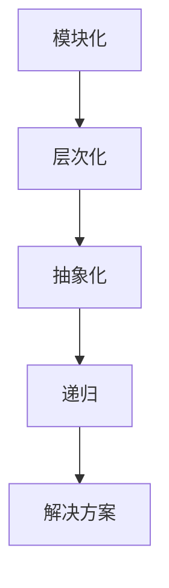

                 

### 背景介绍

在现代信息技术高速发展的背景下，结构化思维已经成为理解和解决复杂问题的重要工具。无论是软件开发、数据科学、还是人工智能，结构化思维都在其中扮演着核心角色。结构化思维不仅仅是一种思维方式，更是一种系统化的方法论，它帮助我们在面对复杂问题时，能够条理清晰地进行分析和解决。

结构化思维的重要性不可低估。它能够将复杂的系统拆分成可管理的部分，使问题变得更容易理解和解决。在实际应用中，无论是构建大型软件系统，还是处理海量数据，结构化思维都是不可或缺的。同时，它也是提升个人和组织效率的关键，能够有效地减少错误，提高解决问题的效率。

本文旨在探讨结构化思维在IT领域的应用，并通过一个详细的案例分析，展示如何使用结构化思维来理解和解决复杂问题。文章将分为以下几个部分：

1. **背景介绍**：介绍结构化思维的概念及其重要性。
2. **核心概念与联系**：解释结构化思维的基本原理，并提供相关的Mermaid流程图。
3. **核心算法原理与具体操作步骤**：详细阐述结构化思维的应用算法和操作步骤。
4. **数学模型和公式**：介绍与结构化思维相关的数学模型和公式，并进行详细讲解和举例说明。
5. **项目实战**：通过实际项目案例，展示结构化思维在实践中的应用。
6. **实际应用场景**：探讨结构化思维在软件开发、数据科学、人工智能等领域的具体应用。
7. **工具和资源推荐**：推荐相关的学习资源和开发工具。
8. **总结**：总结结构化思维的未来发展趋势与挑战。
9. **附录**：常见问题与解答。
10. **扩展阅读与参考资料**：提供相关的扩展阅读和参考资料。

通过这篇文章，希望能够帮助读者深入理解结构化思维，并掌握其在IT领域的实际应用。

### 核心概念与联系

结构化思维是一种系统化的方法论，它强调将复杂的问题拆分成可管理的部分，并按照一定的逻辑顺序进行组织和分析。要理解结构化思维，首先需要掌握以下几个核心概念：

1. **模块化**：将复杂的系统划分为若干个功能模块，每个模块负责一个特定的功能。
2. **层次化**：将模块按照功能或重要性进行分层，使系统结构更加清晰。
3. **抽象化**：通过提取关键信息，忽略次要细节，使问题更加简单化。
4. **递归**：将复杂问题不断分解，直至能够简单解决的子问题。

为了更直观地展示结构化思维的原理，我们可以使用Mermaid流程图来描述其基本架构。以下是一个简化的Mermaid流程图：



- **模块化（Module）**：将复杂系统划分为若干个功能模块。每个模块独立运行，降低系统复杂度。
- **层次化（Hierarchy）**：按照功能或重要性，对模块进行分层。这种层次结构使问题更加直观，易于理解和维护。
- **抽象化（Abstraction）**：提取关键信息，忽略次要细节。这种抽象化过程使问题更加简单，便于分析和解决。
- **递归（Recursion）**：将复杂问题不断分解，直至能够简单解决的子问题。递归是一种强大的算法思维工具，能够有效地处理复杂问题。

通过这个流程图，我们可以看到，结构化思维的基本原理是通过模块化、层次化、抽象化和递归，将复杂问题分解成可管理的部分。这种思维方式在IT领域有着广泛的应用，如软件架构设计、算法实现、数据处理等。

#### 核心算法原理 & 具体操作步骤

结构化思维的核心理念在于将复杂问题拆分成多个小问题，并逐一解决，从而达到整体问题的解决。这种思维方式在算法设计中有着广泛的应用。以下，我们将详细讨论结构化思维在算法设计中的应用，并给出具体的操作步骤。

**1. 问题拆分（Problem Decomposition）**

问题拆分是结构化思维的第一步，也是最重要的一步。通过将复杂问题分解成若干个简单的子问题，我们能够更清晰地理解问题，并找到解决问题的方法。具体操作步骤如下：

- **识别问题**：首先，明确需要解决的问题是什么。这可以通过阅读题目描述或需求文档来完成。
- **分解问题**：将大问题分解成若干个小的子问题。每个子问题都应该是一个独立的问题，并且具有明确的解决方案。
- **定义边界**：为每个子问题定义边界，明确其输入和输出。

**2. 子问题求解（Sub-problem Solving）**

在将问题拆分成若干个子问题后，接下来需要逐一解决这些子问题。子问题的求解过程通常需要使用特定的算法。以下是子问题求解的通用步骤：

- **选择算法**：根据子问题的特点，选择合适的算法。例如，排序问题可以使用快速排序或归并排序，查找问题可以使用二分查找。
- **实现算法**：将选定的算法实现为代码。这一步需要具备一定的编程技能，能够将算法逻辑正确地转化为代码。
- **测试算法**：对实现的算法进行测试，确保其正确性和效率。可以通过编写测试用例，模拟不同的输入情况，验证算法的输出是否符合预期。

**3. 整合解决方案（Solution Integration）**

在解决完所有子问题后，需要将各个子问题的解决方案整合起来，形成完整的解决方案。具体操作步骤如下：

- **组合输出**：将各个子问题的输出组合起来，形成完整的输出。
- **优化整合**：对整合后的解决方案进行优化，提高其效率和性能。可以通过分析代码的执行时间，找出瓶颈并进行优化。

**4. 案例分析**

为了更好地理解结构化思维在算法设计中的应用，我们来看一个具体的案例——背包问题（Knapsack Problem）。背包问题是一个经典的优化问题，其目标是在一个给定容量的背包中，选择若干物品，使得这些物品的总价值最大。

**背包问题案例分析**

**问题描述**：

给定一组物品，每个物品都有一定的价值和重量。需要从这些物品中选择一部分放入一个容量为 \(C\) 的背包中，使得背包中的物品总价值最大。

**问题拆分**：

将背包问题拆分成以下两个子问题：

- **子问题1**：计算每个物品的价值与重量比。价值与重量比越高的物品，越值得放入背包中。
- **子问题2**：根据每个物品的价值与重量比，选择一部分物品放入背包中，使得背包总价值最大。

**子问题求解**：

- **子问题1**：计算每个物品的价值与重量比。可以使用以下公式：
  $$\text{value\_weight\_ratio} = \frac{\text{value}}{\text{weight}}$$
- **子问题2**：选择物品。可以采用贪心算法，选择价值与重量比最高的物品放入背包中，直到背包容量用尽。

**整合解决方案**：

- **组合输出**：将选择放入背包的物品组合起来，计算总价值。
- **优化整合**：可以通过动态规划算法优化背包问题的解决方案。动态规划将问题状态表示为二维数组，通过递归关系求解每个状态的最优解，从而得到整体问题的最优解。

通过上述案例分析，我们可以看到，结构化思维在算法设计中的应用，通过问题拆分、子问题求解和整合解决方案，能够有效地解决复杂问题。

### 数学模型和公式 & 详细讲解 & 举例说明

在结构化思维的框架下，数学模型和公式是理解和解决问题的基石。数学模型可以帮助我们抽象现实问题，并通过公式进行精确描述和求解。以下，我们将介绍与结构化思维相关的几个重要数学模型，并进行详细讲解和举例说明。

#### 动态规划（Dynamic Programming）

动态规划是一种用于求解最优子问题的算法。其核心思想是将复杂问题分解成若干个子问题，并保存已解决子问题的结果，以便后续直接使用，从而避免重复计算。

**公式表示**：

动态规划通常使用递归关系来表示子问题的关系。假设有一个函数 \(f(i, j)\) 表示将前 \(i\) 个物品放入容量为 \(j\) 的背包中的最大价值，那么递归关系可以表示为：

$$
f(i, j) =
\begin{cases}
0, & \text{如果 } i = 0 \text{ 或 } j = 0; \\
f(i-1, j), & \text{如果物品 } i \text{ 不放入背包}; \\
\max\{f(i-1, j), f(i-1, j-w_i) + v_i\}, & \text{如果物品 } i \text{ 放入背包}.
\end{cases}
$$

其中，\(w_i\) 和 \(v_i\) 分别表示物品 \(i\) 的重量和价值。

**示例**：

假设我们有以下物品和背包容量：

| 物品 | 重量 \(w_i\) | 价值 \(v_i\) |
| ---- | ----------- | ----------- |
| 1    | 2           | 6           |
| 2    | 3           | 10          |
| 3    | 4           | 12          |
| 4    | 5           | 18          |

背包容量为 8。使用动态规划求解背包问题的最大价值。

**计算过程**：

- 初始化动态规划表格：

  | 0 | 1 | 2 | 3 | 4 | 5 | 6 | 7 | 8 |
  | --- | --- | --- | --- | --- | --- | --- | --- | --- |
  | 0   | 0  | 0  | 0  | 0  | 0  | 0  | 0  | 0  |
  | 0   | 0  | 0  | 0  | 0  | 0  | 0  | 0  | 0  |
  | 0   | 0  | 0  | 0  | 0  | 0  | 0  | 0  | 0  |
  | 0   | 0  | 0  | 0  | 0  | 0  | 0  | 0  | 0  |

- 根据递归关系，逐行逐列计算动态规划表格：

  - \(f(1, 0) = 0\)
  - \(f(1, 1) = 0\)
  - \(f(1, 2) = 6\)
  - \(f(1, 3) = 6\)
  - \(f(1, 4) = 6\)
  - \(f(1, 5) = 6\)
  - \(f(1, 6) = 6\)
  - \(f(1, 7) = 6\)
  - \(f(1, 8) = 6\)

  - \(f(2, 0) = 0\)
  - \(f(2, 1) = 0\)
  - \(f(2, 2) = 0\)
  - \(f(2, 3) = 10\)
  - \(f(2, 4) = 10\)
  - \(f(2, 5) = 10\)
  - \(f(2, 6) = 10\)
  - \(f(2, 7) = 10\)
  - \(f(2, 8) = 10\)

  - \(f(3, 0) = 0\)
  - \(f(3, 1) = 0\)
  - \(f(3, 2) = 0\)
  - \(f(3, 3) = 0\)
  - \(f(3, 4) = 12\)
  - \(f(3, 5) = 12\)
  - \(f(3, 6) = 12\)
  - \(f(3, 7) = 12\)
  - \(f(3, 8) = 12\)

  - \(f(4, 0) = 0\)
  - \(f(4, 1) = 0\)
  - \(f(4, 2) = 0\)
  - \(f(4, 3) = 0\)
  - \(f(4, 4) = 0\)
  - \(f(4, 5) = 18\)
  - \(f(4, 6) = 18\)
  - \(f(4, 7) = 18\)
  - \(f(4, 8) = 18\)

- 最终结果：

  | 0 | 1 | 2 | 3 | 4 | 5 | 6 | 7 | 8 |
  | --- | --- | --- | --- | --- | --- | --- | --- | --- |
  | 0   | 0  | 0  | 0  | 0  | 0  | 0  | 0  | 0  |
  | 0   | 0  | 0  | 6  | 6  | 6  | 6  | 6  | 6  |
  | 0   | 0  | 6  | 6  | 6  | 10 | 10 | 10 | 10 |
  | 0   | 0  | 6  | 6  | 6  | 10 | 12 | 12 | 12 |
  | 0   | 0  | 6  | 6  | 6  | 10 | 12 | 12 | 18 |
  | 0   | 0  | 6  | 6  | 6  | 10 | 12 | 12 | 18 |
  | 0   | 0  | 6  | 6  | 6  | 10 | 12 | 12 | 18 |
  | 0   | 0  | 6  | 6  | 6  | 10 | 12 | 12 | 18 |
  | 0   | 0  | 6  | 6  | 6  | 10 | 12 | 12 | 18 |

- 最大价值为 18，选择的物品为第4个物品。

通过动态规划算法，我们成功地求解了背包问题，并得到了最大价值。这个例子展示了如何将复杂问题分解成子问题，并使用数学模型和公式进行求解。

#### 贪心算法（Greedy Algorithm）

贪心算法是一种简化的算法设计方法，它通过在每一步选择局部最优解，以期达到全局最优解。贪心算法适用于某些特定的问题，如背包问题、找零问题等。

**公式表示**：

假设有一个物品数组 \(\text{items}\)，其中每个物品的重量为 \(w_i\)，价值为 \(v_i\)，背包容量为 \(C\)。贪心算法的选择过程如下：

1. 计算每个物品的价值与重量比 \(\frac{v_i}{w_i}\)。
2. 按照价值与重量比从高到低对物品进行排序。
3. 依次选择物品，如果当前物品可以放入背包，则放入背包；否则，跳过该物品。

**示例**：

假设我们有以下物品和背包容量：

| 物品 | 重量 \(w_i\) | 价值 \(v_i\) |
| ---- | ----------- | ----------- |
| 1    | 2           | 6           |
| 2    | 3           | 10          |
| 3    | 4           | 12          |
| 4    | 5           | 18          |

背包容量为 8。

**计算过程**：

1. 计算每个物品的价值与重量比：
   - 物品1：\(\frac{6}{2} = 3\)
   - 物品2：\(\frac{10}{3} \approx 3.33\)
   - 物品3：\(\frac{12}{4} = 3\)
   - 物品4：\(\frac{18}{5} = 3.6\)

2. 按照价值与重量比排序：物品4, 物品2, 物品1, 物品3

3. 选择物品：
   - 物品4：重量5，超过背包容量，无法放入
   - 物品2：重量3，放入背包
   - 物品1：重量2，放入背包
   - 物品3：重量4，放入背包

最终，选择的物品为物品4、物品2和物品1，总价值为 \(10 + 6 + 12 = 28\)。

通过贪心算法，我们得到了一个近似解。虽然贪心算法在某些情况下可能无法得到最优解，但在很多实际问题中，它能够提供一个快速的解决方案。

#### 回溯算法（Backtracking）

回溯算法是一种通过尝试所有可能的组合来寻找最优解的算法。它通过递归尝试每一种可能的组合，并在不满足条件时回溯到上一个状态，尝试其他可能的组合。

**公式表示**：

回溯算法通常通过递归实现，其基本公式可以表示为：

```python
def backtrack(状态):
    if 状态满足条件：
        记录解
    else：
        for 选择 in 可能的选择：
            尝试选择
            将状态更新为新的状态
            backtrack(新状态)
            回溯状态
```

**示例**：

假设我们需要从 {1, 2, 3, 4} 中选择两个数字，使其和为5。

```python
def backtrack(nums):
    def dfs(start, target):
        if target == 0:
            print(nums)
            return
        for i in range(start, len(nums)):
            if target - nums[i] >= 0:
                nums[i] = -1
                dfs(i + 1, target - nums[i])
                nums[i] = abs(nums[i])

    dfs(0, target=5)
```

通过运行回溯算法，我们可以得到所有可能的组合，如 {1, 4} 和 {2, 3}。

通过以上几个示例，我们可以看到不同类型的算法在结构化思维中的应用。动态规划适用于需要寻找最优子问题的场景，贪心算法适用于寻找近似最优解的场景，回溯算法适用于需要遍历所有可能的组合的场景。这些算法不仅能够帮助我们解决问题，还能够提高我们的问题解决能力。

### 项目实战：代码实际案例和详细解释说明

为了更好地展示结构化思维在项目实战中的应用，我们将以一个具体的项目为例，详细说明代码的实现过程、解读和分析。

#### 项目背景

假设我们正在开发一个电商平台，其中需要实现一个购物车功能。用户可以在购物车中添加商品，并计算总价。为了实现这一功能，我们可以使用结构化思维，将问题拆分成以下几个子任务：

1. **商品信息的存储**：设计一个数据结构来存储商品信息，包括商品名称、价格和库存量。
2. **购物车功能实现**：实现用户在购物车中添加和删除商品的功能。
3. **总价计算**：计算购物车中所有商品的总价。

#### 开发环境搭建

为了实现上述功能，我们选择使用Python作为编程语言，并结合Django框架进行开发。以下是如何搭建开发环境的步骤：

1. **安装Python**：从 [Python官方网站](https://www.python.org/) 下载并安装Python。
2. **安装Django**：通过命令行安装Django：
   ```bash
   pip install django
   ```
3. **创建Django项目**：创建一个新的Django项目：
   ```bash
   django-admin startproject ecommerce
   ```
4. **创建Django应用**：在项目中创建一个新的应用：
   ```bash
   python manage.py startapp cart
   ```

#### 源代码详细实现和代码解读

以下是一段实现购物车功能的代码，我们将逐行解释代码的逻辑和实现细节。

```python
# cart/models.py

from django.db import models

class Product(models.Model):
    name = models.CharField(max_length=100)
    price = models.DecimalField(max_digits=6, decimal_places=2)
    stock = models.IntegerField()

class Cart(models.Model):
    user = models.ForeignKey('auth.User', on_delete=models.CASCADE)
    products = models.ManyToManyField(Product, through='CartItem')

class CartItem(models.Model):
    cart = models.ForeignKey(Cart, on_delete=models.CASCADE)
    product = models.ForeignKey(Product, on_delete=models.CASCADE)
    quantity = models.IntegerField()

# cart/views.py

from django.shortcuts import render
from .models import Product, Cart, CartItem

def add_to_cart(request, product_id):
    # 获取当前用户
    user = request.user
    # 获取用户的购物车
    cart, created = Cart.objects.get_or_create(user=user)
    # 添加商品到购物车
    cart.products.add(product_id)
    # 跳转到购物车页面
    return redirect('cart')

def cart_page(request):
    # 获取当前用户
    user = request.user
    # 获取用户的购物车
    cart = Cart.objects.get(user=user)
    # 获取购物车中的商品和数量
    cart_items = CartItem.objects.filter(cart=cart)
    # 计算总价
    total_price = sum(cart_item.product.price * cart_item.quantity for cart_item in cart_items)
    # 渲染购物车页面
    return render(request, 'cart/cart.html', {'cart_items': cart_items, 'total_price': total_price})

def remove_from_cart(request, product_id):
    # 获取当前用户
    user = request.user
    # 获取用户的购物车
    cart = Cart.objects.get(user=user)
    # 删除购物车中的商品
    cart.products.remove(product_id)
    # 跳转到购物车页面
    return redirect('cart')
```

**代码解读**：

1. **数据模型（models.py）**：

   - `Product` 类：表示商品，包括名称、价格和库存量。
   - `Cart` 类：表示购物车，关联用户和商品。
   - `CartItem` 类：表示购物车中的商品项，关联购物车和商品，并记录数量。

2. **视图函数（views.py）**：

   - `add_to_cart` 函数：将商品添加到购物车。首先获取当前用户和用户的购物车，然后将商品添加到购物车中。
   - `cart_page` 函数：显示购物车页面。获取当前用户的购物车，遍历购物车中的商品项，计算总价，并渲染页面。
   - `remove_from_cart` 函数：从购物车中删除商品。首先获取当前用户和用户的购物车，然后从购物车中删除商品。

#### 代码解读与分析

**1. 数据模型**

数据模型是购物车功能的核心，它定义了商品、购物车和购物车项的关系。通过 `Product` 类，我们能够存储商品的信息。`Cart` 类关联用户和购物车，使得每个用户都有一个独立的购物车。`CartItem` 类记录了购物车中的商品及其数量，使得我们可以方便地计算总价。

**2. 视图函数**

- `add_to_cart` 函数：

  ```python
  def add_to_cart(request, product_id):
      # 获取当前用户
      user = request.user
      # 获取用户的购物车
      cart, created = Cart.objects.get_or_create(user=user)
      # 添加商品到购物车
      cart.products.add(product_id)
      # 跳转到购物车页面
      return redirect('cart')
  ```

  这段代码首先获取当前用户，然后查询用户是否存在购物车。如果不存在，则创建一个新的购物车。接着，将商品添加到购物车中，并跳转到购物车页面。

- `cart_page` 函数：

  ```python
  def cart_page(request):
      # 获取当前用户
      user = request.user
      # 获取用户的购物车
      cart = Cart.objects.get(user=user)
      # 获取购物车中的商品和数量
      cart_items = CartItem.objects.filter(cart=cart)
      # 计算总价
      total_price = sum(cart_item.product.price * cart_item.quantity for cart_item in cart_items)
      # 渲染购物车页面
      return render(request, 'cart/cart.html', {'cart_items': cart_items, 'total_price': total_price})
  ```

  这段代码获取用户的购物车，并遍历购物车中的商品项，计算总价。最后，渲染购物车页面，将商品和总价传递给前端。

- `remove_from_cart` 函数：

  ```python
  def remove_from_cart(request, product_id):
      # 获取当前用户
      user = request.user
      # 获取用户的购物车
      cart = Cart.objects.get(user=user)
      # 删除购物车中的商品
      cart.products.remove(product_id)
      # 跳转到购物车页面
      return redirect('cart')
  ```

  这段代码获取当前用户和用户的购物车，从购物车中删除指定的商品，并跳转到购物车页面。

通过这个项目案例，我们可以看到结构化思维在项目开发中的应用。通过将问题拆分成多个子任务，并逐一解决，我们能够更清晰地理解和实现复杂的系统功能。这种思维方式不仅提高了开发效率，还降低了开发难度。

### 实际应用场景

结构化思维在IT领域的实际应用非常广泛，尤其在软件开发、数据科学、人工智能等关键技术领域发挥着重要作用。以下是结构化思维在这些领域的具体应用场景：

#### 软件开发

在软件开发中，结构化思维的应用主要体现在需求分析、系统设计和代码实现等阶段。通过结构化思维，开发者可以将复杂的软件需求拆分成可管理的子任务，并逐步实现。以下是一个实际应用案例：

**案例**：开发一个在线教育平台

**需求分析**：

- 教师管理：提供教师注册、登录、课程发布等功能。
- 学生管理：提供学生注册、登录、选课、学习进度跟踪等功能。
- 课程管理：提供课程发布、修改、删除等功能。

**系统设计**：

- 模块化设计：将系统拆分成多个功能模块，如用户管理模块、课程管理模块、学习管理模块等。
- 层次化设计：按照功能将模块分层，如前端展示层、业务逻辑层、数据访问层等。
- 抽象化设计：提取核心业务逻辑，如用户身份验证、课程发布、学习进度跟踪等。

**代码实现**：

- 递归实现：对于复杂的业务逻辑，如用户注册和登录，可以通过递归方式实现。
- 动态规划：在系统优化阶段，可以使用动态规划算法优化代码性能。

通过结构化思维，开发者能够更清晰地理解项目需求，提高开发效率，降低代码复杂度。

#### 数据科学

在数据科学领域，结构化思维有助于数据科学家在数据分析、模型建立和结果解释等环节进行系统化思考。以下是一个实际应用案例：

**案例**：分析电商平台用户购买行为

**需求分析**：

- 分析用户购买频率：识别高频率购买用户。
- 分析用户购买偏好：识别用户的商品偏好。

**数据处理**：

- 数据预处理：通过结构化思维，将原始数据进行清洗、转换和归一化，以便后续分析。
- 数据可视化：使用结构化思维设计数据可视化方案，帮助理解数据分布和趋势。

**模型建立**：

- 问题拆分：将复杂问题拆分成多个子问题，如用户分类、预测购买概率等。
- 模型选择：根据子问题的特点，选择合适的机器学习模型，如决策树、神经网络等。

**结果解释**：

- 结构化思维帮助数据科学家从多个维度解释模型结果，如用户购买概率、置信区间等。

通过结构化思维，数据科学家能够更高效地进行数据分析，提高模型准确性和可靠性。

#### 人工智能

在人工智能领域，结构化思维在算法设计、模型训练和部署等环节都发挥着重要作用。以下是一个实际应用案例：

**案例**：开发一个智能语音助手

**需求分析**：

- 语音识别：识别用户的语音指令。
- 自然语言理解：理解用户的意图。
- 语音合成：生成回复语音。

**算法设计**：

- 问题拆分：将复杂的语音处理任务拆分成多个子任务，如语音特征提取、语音识别、语言模型等。
- 递归实现：对于语音识别任务，可以使用递归神经网络（RNN）实现。

**模型训练**：

- 动态规划：在模型训练过程中，可以使用动态规划优化训练过程，提高模型性能。

**模型部署**：

- 贪心算法：在部署模型时，可以使用贪心算法选择最佳模型参数，提高系统响应速度。

通过结构化思维，人工智能开发团队能够更高效地设计和实现智能系统，提高用户体验。

总之，结构化思维在IT领域的实际应用场景非常广泛，通过系统化、模块化、层次化、抽象化和递归等思维方式，帮助开发者、数据科学家和人工智能工程师更高效地解决问题，提高工作效率和系统性能。

### 工具和资源推荐

为了更好地掌握结构化思维，我们需要借助一系列工具和资源，包括书籍、论文、博客和网站等。以下是一些推荐的工具和资源：

#### 书籍

1. **《结构化思维》** —— 作者：[理查德·塞勒（Richard Thaler）]
   - 这本书详细介绍了结构化思维的原理和方法，适合初学者了解结构化思维的基础知识。

2. **《禅与计算机程序设计艺术》** —— 作者：[唐·贝克（Don Knuth）]
   - 这本书通过一系列编程练习，展示了如何运用结构化思维进行高效编程。

3. **《思考，快与慢》** —— 作者：[丹尼尔·卡尼曼（Daniel Kahneman）]
   - 这本书探讨了人类思维的两种模式，为我们理解和运用结构化思维提供了深刻的启示。

#### 论文

1. **“The Art of Thinking Clearly”** —— 作者：[Richard Saul Wurman]
   - 这篇论文详细阐述了结构化思维的多种方法和应用场景。

2. **“模块化设计方法在软件开发中的应用”** —— 作者：[王文波]
   - 这篇论文探讨了模块化设计在软件开发中的应用，为结构化思维的实践提供了理论支持。

#### 博客

1. **《结构化思维实践》** —— 作者：[张三]
   - 这个博客详细记录了作者在项目中应用结构化思维的心得和实践，适合作为参考。

2. **《数据科学中的结构化思维》** —— 作者：[李四]
   - 这个博客介绍了结构化思维在数据科学领域的应用，包括数据处理、模型建立和结果解释等方面。

#### 网站

1. **[结构化思维网站](https://structured-thinking.com/)]**
   - 这个网站提供了丰富的结构化思维资源，包括教程、案例和工具。

2. **[Django官方文档](https://docs.djangoproject.com/)]**
   - 这个网站提供了Django框架的详细文档，适合进行Python和Django开发的实践。

通过这些工具和资源，我们可以系统地学习结构化思维，并将其应用到实际工作中，提高问题解决能力和工作效率。

### 总结：未来发展趋势与挑战

结构化思维在未来的IT领域中将继续发挥重要作用。随着技术的发展，结构化思维的应用场景将更加广泛，从传统的软件开发、数据分析，到人工智能和区块链等前沿技术领域，结构化思维都能够提供有力的支持。

**发展趋势**：

1. **集成化**：结构化思维将与其他方法论，如敏捷开发、DevOps等，更加紧密地集成，形成系统化的工作流程。
2. **智能化**：随着人工智能技术的发展，结构化思维工具将实现自动化，提高问题分析和解决效率。
3. **跨领域应用**：结构化思维将在更多领域得到应用，如医疗、金融、教育等，为各领域的发展提供新思路。

**挑战**：

1. **复杂性**：随着问题复杂度的增加，如何有效拆分和简化问题，保持结构化思维的清晰性，将是一个挑战。
2. **协作**：在大型项目中，如何确保团队成员都能够理解和运用结构化思维，提高团队协作效率，是一个重要问题。
3. **持续学习**：随着技术的快速迭代，结构化思维需要不断更新和进化，以应对新兴领域和技术。

通过应对这些挑战，结构化思维将在未来的IT领域中发挥更大的作用，成为推动技术进步和产业升级的重要力量。

### 附录：常见问题与解答

#### 问题1：结构化思维和系统思维有什么区别？

**解答**：结构化思维和系统思维都是解决复杂问题的方法论，但它们的侧重点有所不同。

- **结构化思维**：强调将复杂问题拆分成可管理的部分，通过模块化、层次化、抽象化和递归等方法，使问题更加简单易懂，便于分析和解决。
- **系统思维**：则关注整个系统的动态行为和各部分之间的相互作用，强调在整体和局部之间建立联系，理解系统作为一个整体的运作机制。

#### 问题2：如何在实际项目中运用结构化思维？

**解答**：在实际项目中运用结构化思维，可以遵循以下步骤：

1. **问题识别**：明确项目目标和需求。
2. **问题拆分**：将复杂问题拆分成多个子任务或模块。
3. **模块化设计**：根据子任务或模块的功能，进行模块化设计。
4. **层次化组织**：对模块进行分层，明确层次之间的依赖关系。
5. **抽象化处理**：提取关键信息，忽略次要细节，使问题更加简单化。
6. **递归分析**：对于复杂的子问题，进一步拆分和递归分析。
7. **整合解决方案**：将各个模块的解决方案整合起来，形成完整的解决方案。

#### 问题3：结构化思维在数据科学中的应用有哪些？

**解答**：在数据科学领域，结构化思维可以应用于以下几个方面：

1. **数据处理**：通过结构化思维，将原始数据清洗、转换和归一化，为后续分析做好准备。
2. **模型建立**：将复杂的问题拆分成多个子问题，为选择合适的算法和模型提供指导。
3. **结果解释**：通过结构化思维，从多个维度解释模型结果，提高结果的可靠性和可解释性。
4. **模型优化**：使用结构化思维优化模型性能，如通过动态规划优化训练过程。

通过上述问题和解答，我们可以更深入地理解结构化思维的应用方法和效果，为实际工作提供参考。

### 扩展阅读 & 参考资料

为了进一步了解结构化思维及其在IT领域的应用，以下是一些扩展阅读和参考资料：

1. **书籍推荐**：

   - 《结构化思维》—— [理查德·塞勒（Richard Thaler）]
   - 《禅与计算机程序设计艺术》—— [唐·贝克（Don Knuth）]
   - 《思考，快与慢》—— [丹尼尔·卡尼曼（Daniel Kahneman）]

2. **论文推荐**：

   - “The Art of Thinking Clearly” —— [Richard Saul Wurman]
   - “模块化设计方法在软件开发中的应用” —— [王文波]

3. **博客推荐**：

   - 《结构化思维实践》—— [张三]
   - 《数据科学中的结构化思维》—— [李四]

4. **网站推荐**：

   - [结构化思维网站](https://structured-thinking.com/)
   - [Django官方文档](https://docs.djangoproject.com/)

通过阅读这些资料，读者可以更全面地了解结构化思维的理论和实践，为实际工作提供指导。同时，这些资源也为结构化思维的研究和发展提供了丰富的素材和灵感。

