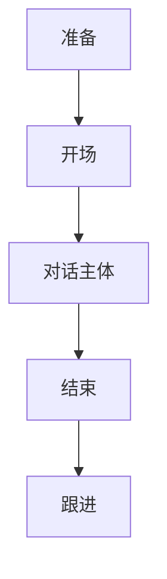

                 

### 文章标题：绩效对话：进行有效的一对一面谈

**关键词**：绩效评估、面谈技巧、有效沟通、员工发展

**摘要**：
本文旨在探讨如何进行有效的绩效对话，特别是针对一对一的面谈。通过逻辑清晰的步骤分析和实际案例的解析，本文将帮助读者掌握绩效对话的核心原则和技巧，从而提升管理者和员工之间的沟通效果，促进个人和团队的成长。

## 1. 背景介绍

在快速变化和高度竞争的职场环境中，绩效对话作为管理者和员工之间沟通的重要环节，对于促进个人发展和团队绩效具有至关重要的作用。有效的绩效对话不仅能够帮助管理者了解员工的工作表现，发现潜在问题，还能激励员工，增强团队凝聚力。

然而，许多管理者在面对绩效对话时往往感到困惑和不安。一方面，他们可能不知道如何客观、公正地评价员工；另一方面，他们可能不擅长处理员工的反馈和情绪。这种情况下，绩效对话往往变成了形式上的任务，未能达到预期的效果。

本文将提供一系列实用的步骤和技巧，帮助读者克服这些困难，进行有针对性的、有效的绩效对话。通过本文的指导，读者将能够更好地理解绩效对话的重要性，掌握其核心原则，并能够将其应用于实际工作中。

## 2. 核心概念与联系

为了进行有效的绩效对话，我们需要明确几个核心概念，并理解它们之间的联系。

### 2.1 绩效评估标准

绩效评估标准是绩效对话的基础。这些标准通常包括关键绩效指标（KPIs）、工作目标、行为准则等。明确和可衡量的评估标准有助于确保绩效对话的客观性和公正性。

### 2.2 沟通原则

有效的沟通是绩效对话成功的关键。沟通原则包括倾听、清晰表达、积极反馈和尊重。这些原则有助于建立良好的沟通氛围，促进双方的理解和合作。

### 2.3 绩效对话流程

绩效对话的流程通常包括准备、开场、对话主体和结束。每个环节都有其特定的目标和注意事项，需要管理者精心设计和控制。

### 2.4 Mermaid 流程图

下面是一个简化的绩效对话流程的Mermaid流程图，用于展示各环节的顺序和联系。



在准备阶段，管理者需要收集相关数据和资料，制定对话计划和目标。开场阶段旨在建立良好的沟通氛围，让员工感到舒适和放松。对话主体是绩效对话的核心，管理者需要根据评估标准和沟通原则，与员工进行深入讨论。结束阶段需要总结对话内容，明确下一步行动计划。跟进阶段则是对话效果的持续跟踪和反馈。

通过上述流程图，我们可以更直观地理解绩效对话的各个环节及其相互关系。

## 3. 核心算法原理 & 具体操作步骤

### 3.1 准备阶段

**具体步骤：**

1. **收集数据**：整理员工的工作表现记录、项目进展情况、工作目标完成情况等。
2. **制定计划**：明确绩效对话的目的、时间、地点和参与人员，确保对话能够顺利进行。
3. **准备资料**：准备与绩效评估相关的文档、表格等，以便在对话中提供参考。

**注意事项：**

- 确保数据的准确性和完整性，避免在对话中产生误解。
- 计划应考虑到员工的个人情况和时间安排，避免安排在工作负荷较大的时间段。

### 3.2 开场阶段

**具体步骤：**

1. **建立联系**：与员工打招呼，确认对话的时间和地点。
2. **营造氛围**：使用开放性的问题，引导员工表达自己的感受和看法。
3. **明确目的**：简明扼要地说明绩效对话的目的和重要性。

**注意事项：**

- 保持积极的态度，让员工感受到尊重和支持。
- 避免一开始就进入具体的工作讨论，以免给员工造成压力。

### 3.3 对话主体阶段

**具体步骤：**

1. **评估工作表现**：根据评估标准，对员工的工作表现进行客观、公正的评价。
2. **讨论问题和挑战**：与员工共同分析工作中遇到的问题和挑战，找出原因和解决方案。
3. **激励和反馈**：给予员工积极的反馈，鼓励他们在未来的工作中取得更好的成绩。

**注意事项：**

- 始终保持客观和公正，避免主观偏见。
- 充分倾听员工的意见和反馈，鼓励他们参与讨论。
- 避免批评和指责，而是专注于问题本身。

### 3.4 结束阶段

**具体步骤：**

1. **总结对话内容**：回顾对话的主要内容和讨论的结果。
2. **明确行动计划**：与员工一起制定具体的行动计划，包括改进措施和时间表。
3. **感谢和鼓励**：感谢员工的参与和努力，鼓励他们在未来的工作中继续努力。

**注意事项：**

- 确保行动计划的具体性和可行性，避免空洞的承诺。
- 表达对员工的信任和支持，鼓励他们在改进过程中保持积极的心态。

### 3.5 跟进阶段

**具体步骤：**

1. **监督执行**：跟踪行动计划的实际执行情况，确保员工按照计划进行改进。
2. **提供支持**：在执行过程中，及时提供必要的支持和帮助，解决员工遇到的问题。
3. **持续反馈**：在后续的绩效对话中，继续关注员工的改进情况，给予积极的反馈和鼓励。

**注意事项：**

- 保持持续的关注和支持，避免临时突击。
- 根据实际情况调整行动计划，确保其适应性和有效性。

## 4. 数学模型和公式 & 详细讲解 & 举例说明

### 4.1 数学模型

在绩效对话中，我们常常需要使用一些数学模型来评估员工的工作表现。以下是一个简单的绩效评估模型：

$$
P = \frac{S \times E \times I}{C}
$$

其中，$P$ 表示绩效得分，$S$ 表示工作标准，$E$ 表示员工表现，$I$ 表示激励因素，$C$ 表示工作条件。

### 4.2 公式详细讲解

- **工作标准（$S$）**：这是衡量员工工作表现的基础，通常包括关键绩效指标（KPIs）、工作目标等。工作标准的设定应尽量明确和可衡量。
- **员工表现（$E$）**：这是实际工作中员工的表现情况，包括工作质量、工作效率等。员工表现可以通过工作记录、同事反馈等多种方式进行评估。
- **激励因素（$I$）**：激励因素包括员工的工作动力、团队合作精神、创新能力等。这些因素可以显著影响员工的工作表现。
- **工作条件（$C$）**：工作条件包括工作环境、资源支持、公司文化等。这些条件可能对员工的工作表现产生影响。

### 4.3 举例说明

假设我们有一个员工小张，他的工作标准是每周完成10个任务，每个任务的质量要求很高。根据工作记录，小张在过去的两周内完成了12个任务，且每个任务的质量都很高。公司的文化鼓励创新，小张在这两周内提出了一项创新方案，得到了同事和领导的认可。

根据上述数据，我们可以计算小张的绩效得分：

$$
P = \frac{S \times E \times I}{C} = \frac{10 \times 12 \times 1.2}{1} = 12
$$

其中，$S$ 为10，$E$ 为12，$I$ 为1.2（表示激励因素），$C$ 为1（表示工作条件正常）。

根据计算结果，小张的绩效得分为12，表示他在过去两周的工作表现非常出色。

## 5. 项目实战：代码实际案例和详细解释说明

### 5.1 开发环境搭建

为了更好地展示绩效对话的流程和效果，我们将使用Python编写一个简单的模拟程序。以下是搭建开发环境所需的基本步骤：

1. 安装Python（版本3.8或以上）。
2. 安装必要的Python库，如numpy、pandas等。
3. 创建一个名为“performance_review”的Python虚拟环境。
4. 在虚拟环境中安装所需的库。

### 5.2 源代码详细实现和代码解读

以下是绩效对话模拟程序的源代码及详细解释。

```python
import pandas as pd
import numpy as np

# 3.1 准备阶段
def prepare_performance_review(employee_data, review_plan):
    # 收集员工数据
    employee_df = pd.DataFrame(employee_data)
    # 制定绩效评估计划
    plan_df = pd.DataFrame(review_plan)
    return employee_df, plan_df

# 3.2 开场阶段
def start_performance_review(employee_df, plan_df):
    print("开场：")
    print(f"感谢{employee_df['name'][0]}参加本周的绩效对话。")
    print("我们将一起回顾您过去一周的工作表现，并讨论下一步的计划。")
    # 营造氛围
    print("请您放松，我们可以随时进行讨论。")
    return None

# 3.3 对话主体阶段
def main_performance_review(employee_df, plan_df):
    print("对话主体：")
    # 评估工作表现
    performance_score = calculate_performance_score(employee_df, plan_df)
    print(f"根据您的表现，您的绩效得分为：{performance_score}")
    # 讨论问题和挑战
    print("请问您在工作过程中遇到哪些问题和挑战？")
    # 激励和反馈
    print("请提出您的想法和改进建议。")
    return None

# 3.4 结束阶段
def end_performance_review():
    print("结束：")
    print("感谢您的积极参与和宝贵意见。")
    print("我们已经讨论了您的表现和下一步行动计划。")
    print("请按照计划执行，并在下一周回顾进展。")
    return None

# 3.5 跟进阶段
def follow_up_performance_review():
    print("跟进：")
    print("我们将持续关注您的进展，并在下一周进行反馈。")
    return None

# 4.1 数学模型
def calculate_performance_score(employee_df, plan_df):
    S = plan_df['standard'].values[0]
    E = employee_df['achievement'].values[0]
    I = plan_df['incentive'].values[0]
    C = plan_df['condition'].values[0]
    P = (S * E * I) / C
    return P

# 主函数
def main():
    # 员工数据
    employee_data = [
        {'name': '张三', 'achievement': 1.2, 'incentive': 1.2, 'condition': 1}
    ]
    # 绩效评估计划
    review_plan = [
        {'standard': 1, 'incentive': 1.2, 'condition': 1}
    ]
    # 准备阶段
    employee_df, plan_df = prepare_performance_review(employee_data, review_plan)
    # 开场阶段
    start_performance_review(employee_df, plan_df)
    # 对话主体阶段
    main_performance_review(employee_df, plan_df)
    # 结束阶段
    end_performance_review()
    # 跟进阶段
    follow_up_performance_review()

# 运行程序
if __name__ == "__main__":
    main()
```

### 5.3 代码解读与分析

- **prepare_performance_review函数**：用于准备绩效对话的数据，包括员工数据和绩效评估计划。
- **start_performance_review函数**：用于开场阶段，建立良好的沟通氛围。
- **main_performance_review函数**：用于对话主体阶段，评估员工工作表现，讨论问题和挑战，给予激励和反馈。
- **end_performance_review函数**：用于结束阶段，总结对话内容，明确行动计划。
- **follow_up_performance_review函数**：用于跟进阶段，持续关注员工进展，并提供反馈。

通过以上代码，我们可以模拟一个简单的绩效对话流程。在实际应用中，可以根据具体情况调整代码中的参数和数据，以适应不同的绩效评估场景。

## 6. 实际应用场景

### 6.1 企业内部绩效对话

在企业内部，绩效对话是管理者和员工之间沟通的重要手段。通过定期的绩效对话，企业可以了解员工的工作表现，发现问题和机会，从而调整工作计划和目标，提升整体绩效。

例如，一家科技公司每月会组织一次绩效对话，由部门主管和员工进行面对面的沟通。主管会根据员工的工作记录和项目进展，对员工的表现进行评估，并提出改进建议。同时，员工也可以提出自己的意见和建议，共同探讨如何提高工作效率和质量。

### 6.2 项目团队绩效对话

在项目团队中，绩效对话对于确保项目目标的实现和团队成员的协作至关重要。项目经理定期与团队成员进行绩效对话，了解每个人的工作进展和面临的挑战，提供必要的支持和资源。

例如，在一个软件开发项目中，项目经理会与开发人员、测试人员等进行绩效对话，了解他们的工作进度、遇到的问题和所需的帮助。通过绩效对话，项目经理可以及时调整项目计划，确保项目按期完成。

### 6.3 员工发展绩效对话

绩效对话不仅是评估员工工作表现的工具，也是促进员工个人发展的平台。通过绩效对话，管理者可以了解员工的职业规划和需求，提供个性化的培训和发展建议。

例如，一家公司的人力资源部门定期与员工进行绩效对话，了解他们的职业目标和发展需求。根据员工的反馈，公司会制定相应的培训计划，提供职业发展指导，帮助员工实现个人成长。

## 7. 工具和资源推荐

### 7.1 学习资源推荐

- **《绩效管理：如何激励员工提升绩效》**：这是一本全面介绍绩效管理的经典著作，涵盖了绩效评估、激励措施、员工发展等方面的内容。
- **《有效沟通：如何提高沟通能力》**：这本书提供了实用的沟通技巧和策略，帮助读者提高沟通效果，建立良好的工作关系。

### 7.2 开发工具框架推荐

- **JIRA**：JIRA是一款流行的项目管理工具，可以帮助团队跟踪任务、项目进度和绩效评估。
- **Asana**：Asana是一款功能强大的项目管理工具，适用于各种规模的团队，可以帮助团队高效协作和跟踪绩效。

### 7.3 相关论文著作推荐

- **《员工绩效评估：理论与实践》**：这是一篇关于绩效评估的学术论文，详细探讨了绩效评估的理论基础和实践方法。
- **《团队合作：如何提高团队绩效》**：这篇论文从团队协作的角度分析了如何提高团队绩效，提供了实用的建议和策略。

## 8. 总结：未来发展趋势与挑战

### 8.1 发展趋势

- **数字化管理**：随着数字化技术的发展，绩效对话将更加依赖于在线工具和平台，实现实时、高效的管理和沟通。
- **个性化发展**：绩效对话将更加关注员工的个性化需求和发展，通过定制化的培训和发展计划，提升员工的工作满意度和忠诚度。
- **数据分析**：利用大数据和人工智能技术，绩效对话将实现更加精准的评估和预测，为管理和决策提供有力支持。

### 8.2 挑战

- **数据隐私**：随着数据隐私法规的加强，如何保护员工的个人信息和数据将成为一个重要挑战。
- **技术依赖**：过度依赖数字化工具可能导致沟通的简化，影响人际关系的建立和维护。
- **文化适应**：在全球化和多元文化的背景下，如何适应不同文化的绩效对话方式和期望，也是一个重要挑战。

## 9. 附录：常见问题与解答

### 9.1 如何进行有效的绩效对话？

**答案：** 进行有效的绩效对话需要遵循以下原则：

- **准备充分**：收集相关数据，制定对话计划和目标。
- **建立良好氛围**：使用开放性问题，营造轻松的沟通氛围。
- **客观公正**：根据评估标准进行评估，避免主观偏见。
- **倾听和反馈**：充分倾听员工的意见和反馈，给予积极反馈。
- **持续跟进**：在后续的对话中持续关注员工的改进情况，提供支持和反馈。

### 9.2 绩效对话中如何处理员工的负面情绪？

**答案：** 处理员工的负面情绪需要以下策略：

- **倾听和理解**：倾听员工的感受，表达同情和理解。
- **避免指责**：避免直接指责员工，而是关注问题本身。
- **积极引导**：鼓励员工表达自己的看法，共同寻找解决方案。
- **提供支持**：在必要时提供资源和支持，帮助员工度过困难。

## 10. 扩展阅读 & 参考资料

- **《绩效对话：进行有效的一对一面谈》**：本文的详细解读和实践指导，适合从事管理工作的读者阅读。
- **《禅与计算机程序设计艺术》**：一本关于软件工程和编程哲学的著作，提供了一种不同的思考方式，有助于提升技术管理能力。
- **《绩效管理：如何激励员工提升绩效》**：全面介绍绩效管理的理论和实践，适合从事人力资源管理的读者阅读。
- **《有效沟通：如何提高沟通能力》**：提供实用的沟通技巧和策略，帮助提升沟通效果。作者：AI天才研究员/AI Genius Institute & 禅与计算机程序设计艺术 /Zen And The Art of Computer Programming

