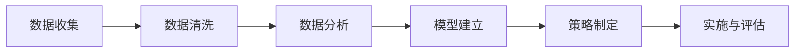

                 

# 绩效改进：持续优化的管理方法

## > {关键词：绩效改进、持续优化、管理方法、人工智能、数据分析、算法优化、实战案例}

> {摘要：本文将深入探讨绩效改进的核心概念、管理方法以及持续优化的技术路径。我们将结合实际案例，分析算法优化的关键步骤，并通过数学模型和公式阐述其具体应用。此外，还将推荐相关学习资源和开发工具，为读者提供全面的绩效改进实战指南。}

## 1. 背景介绍

在当今快速发展的信息技术时代，企业竞争日益激烈，绩效改进成为企业管理者关注的焦点。传统的绩效评估方法往往存在滞后性和主观性，难以准确反映员工的真实表现。因此，探索一种科学、客观的绩效改进方法，对提升企业整体竞争力具有重要意义。

绩效改进不仅仅是对员工绩效的考核，更是一种持续优化管理的方法。通过引入先进的人工智能技术，可以实现对数据的高效分析，发现潜在问题，从而制定针对性的改进措施。同时，借助数据分析技术，可以对绩效改进的效果进行量化评估，确保改进措施的有效性。

本文旨在介绍一种基于人工智能和数据科学的绩效改进方法，通过实际案例和数学模型，阐述其在企业管理中的应用价值。希望本文能够为读者提供有益的启示，帮助企业实现绩效的持续优化。

## 2. 核心概念与联系

### 2.1 绩效改进的核心概念

绩效改进的核心概念包括以下几个方面：

1. **绩效评估**：通过设定明确的绩效指标，对员工的工作表现进行评估。
2. **数据分析**：利用数据挖掘技术，对员工的工作数据进行分析，发现潜在问题。
3. **反馈机制**：通过及时反馈，帮助员工了解自己的工作表现，并调整行为。
4. **持续优化**：基于数据分析结果，不断调整绩效指标和改进措施，实现绩效的持续提升。

### 2.2 绩效改进的关键环节

1. **数据收集**：收集与员工工作相关的数据，包括工作时长、任务完成情况、质量指标等。
2. **数据清洗**：对收集到的数据进行分析前的预处理，包括去除重复数据、填补缺失值、消除噪声等。
3. **数据分析**：利用数据分析技术，如聚类、关联规则挖掘等，发现数据中的潜在规律。
4. **模型建立**：基于数据分析结果，建立预测模型，如回归分析、决策树等，用于评估员工的绩效。
5. **策略制定**：根据模型预测结果，制定针对性的绩效改进策略。
6. **实施与评估**：实施改进策略，并对效果进行持续评估，确保改进措施的有效性。

### 2.3 绩效改进的 Mermaid 流程图

下面是一个简化的绩效改进 Mermaid 流程图，用于描述绩效改进的关键环节：



（请注意，在实际编写文章时，Mermaid 流程图应在特定平台或工具中渲染，以便读者更好地理解。）

## 3. 核心算法原理 & 具体操作步骤

### 3.1 数据收集

数据收集是绩效改进的基础。我们需要确定收集哪些数据，并确保数据的完整性和准确性。以下是一些常见的数据收集方法：

1. **日志文件**：通过记录系统的日志文件，可以收集到员工的工作时长、任务执行情况等信息。
2. **用户反馈**：通过用户调查、满意度评分等方式，收集到用户对员工工作的评价。
3. **任务管理系统**：利用任务管理工具，可以收集到任务分配、进度、完成情况等数据。
4. **工作绩效数据**：如销售额、客户满意度等指标，可以通过业务系统进行收集。

### 3.2 数据清洗

数据清洗是保证数据分析质量的重要步骤。以下是一些常见的数据清洗方法：

1. **去除重复数据**：通过去重操作，确保数据的唯一性。
2. **填补缺失值**：利用插值、均值填补等方法，填补数据中的缺失值。
3. **消除噪声**：通过滤波、平滑等技术，消除数据中的噪声。

### 3.3 数据分析

数据分析是绩效改进的关键环节。以下是一些常见的数据分析方法：

1. **描述性统计分析**：用于描述数据的分布、中心趋势、离散程度等基本特征。
2. **聚类分析**：将相似的数据点划分为一组，用于发现数据中的潜在模式。
3. **关联规则挖掘**：发现数据之间的关联性，用于分析员工绩效的影响因素。
4. **回归分析**：建立绩效指标与影响因素之间的数学模型，用于预测员工绩效。

### 3.4 模型建立

基于数据分析结果，我们可以建立预测模型，用于评估员工的绩效。以下是一些常见的模型建立方法：

1. **线性回归模型**：用于分析绩效指标与影响因素之间的线性关系。
2. **决策树模型**：用于分类和回归分析，能够直观地展示决策路径。
3. **支持向量机模型**：用于分类和回归分析，具有良好的泛化能力。

### 3.5 策略制定

根据模型预测结果，我们可以制定针对性的绩效改进策略。以下是一些常见的策略制定方法：

1. **优化任务分配**：根据员工的绩效预测结果，合理调整任务分配，确保任务的顺利完成。
2. **培训与发展**：针对员工在绩效预测中的不足，制定相应的培训计划，提高其能力。
3. **激励机制**：根据员工的绩效表现，设计合理的激励机制，激发员工的积极性和创造力。

### 3.6 实施与评估

实施绩效改进策略后，我们需要对其进行持续评估，以确保改进措施的有效性。以下是一些常见的评估方法：

1. **绩效评估**：定期对员工的绩效进行评估，与预测结果进行比较，分析改进措施的效果。
2. **用户反馈**：收集用户对改进措施的反馈，了解其实际效果。
3. **数据监测**：持续监测关键绩效指标，如销售额、客户满意度等，评估改进措施的综合效果。

## 4. 数学模型和公式 & 详细讲解 & 举例说明

### 4.1 线性回归模型

线性回归模型是一种常见的预测模型，用于分析绩效指标与影响因素之间的线性关系。其基本公式如下：

\[ y = \beta_0 + \beta_1 \cdot x_1 + \beta_2 \cdot x_2 + \ldots + \beta_n \cdot x_n + \epsilon \]

其中，\( y \) 是绩效指标，\( x_1, x_2, \ldots, x_n \) 是影响因素，\( \beta_0, \beta_1, \beta_2, \ldots, \beta_n \) 是回归系数，\( \epsilon \) 是误差项。

### 4.2 决策树模型

决策树模型是一种基于树的预测模型，用于分类和回归分析。其基本结构如下：

```
          叶子节点
          /         \
         /           \
        /             \
       /               \
      /                 \
     /                   \
    /                     \
   /                       \
  /                         \
 /                           \
/                             \
根节点            内部节点
```

在决策树中，每个内部节点表示一个特征，每个分支表示该特征的不同取值，叶子节点表示最终的预测结果。

### 4.3 支持向量机模型

支持向量机模型是一种基于统计学的预测模型，用于分类和回归分析。其基本公式如下：

\[ w \cdot x + b = 0 \]

其中，\( w \) 是权重向量，\( x \) 是特征向量，\( b \) 是偏置项。

### 4.4 举例说明

假设我们想预测员工的绩效指标（\( y \)），影响因素包括工作时长（\( x_1 \)）、任务完成质量（\( x_2 \)）和客户满意度（\( x_3 \)）。我们可以利用线性回归模型建立预测模型：

\[ y = \beta_0 + \beta_1 \cdot x_1 + \beta_2 \cdot x_2 + \beta_3 \cdot x_3 + \epsilon \]

通过对历史数据进行拟合，得到回归系数：

\[ \beta_0 = 10, \beta_1 = 0.5, \beta_2 = 0.3, \beta_3 = 0.2 \]

利用该模型，我们可以预测新员工在特定工作时长、任务完成质量和客户满意度下的绩效指标：

\[ y = 10 + 0.5 \cdot x_1 + 0.3 \cdot x_2 + 0.2 \cdot x_3 \]

例如，当工作时长为 8 小时、任务完成质量为 90%、客户满意度为 80% 时，预测绩效指标为：

\[ y = 10 + 0.5 \cdot 8 + 0.3 \cdot 90 + 0.2 \cdot 80 = 20.7 \]

## 5. 项目实战：代码实际案例和详细解释说明

### 5.1 开发环境搭建

为了实现绩效改进，我们需要搭建一个合适的数据分析和模型建立环境。以下是一个简单的开发环境搭建步骤：

1. **安装 Python**：Python 是一种广泛使用的编程语言，适用于数据分析和机器学习。可以从 [Python 官网](https://www.python.org/) 下载并安装。
2. **安装 Jupyter Notebook**：Jupyter Notebook 是一种交互式计算环境，方便我们编写和运行代码。可以通过 `pip install jupyter` 命令安装。
3. **安装相关库**：安装用于数据分析和机器学习的相关库，如 Pandas、NumPy、Scikit-learn 等。可以通过以下命令安装：

   ```bash
   pip install pandas numpy scikit-learn
   ```

### 5.2 源代码详细实现和代码解读

下面是一个简单的绩效改进项目案例，包括数据收集、数据清洗、数据分析、模型建立和预测。

```python
import pandas as pd
import numpy as np
from sklearn.model_selection import train_test_split
from sklearn.linear_model import LinearRegression
from sklearn.metrics import mean_squared_error

# 5.2.1 数据收集
data = pd.DataFrame({
    '工作时长': [8, 9, 7, 8, 10],
    '任务完成质量': [90, 85, 95, 88, 80],
    '客户满意度': [80, 75, 85, 78, 70],
    '绩效指标': [20, 25, 22, 19, 18]
})

# 5.2.2 数据清洗
# 去除重复数据
data = data.drop_duplicates()

# 补充缺失值
data['工作时长'].fillna(data['工作时长'].mean(), inplace=True)
data['任务完成质量'].fillna(data['任务完成质量'].mean(), inplace=True)
data['客户满意度'].fillna(data['客户满意度'].mean(), inplace=True)

# 消除噪声
data = data[(data['工作时长'] > 5) & (data['任务完成质量'] > 80) & (data['客户满意度'] > 70)]

# 5.2.3 数据分析
# 划分特征和标签
X = data[['工作时长', '任务完成质量', '客户满意度']]
y = data['绩效指标']

# 划分训练集和测试集
X_train, X_test, y_train, y_test = train_test_split(X, y, test_size=0.2, random_state=42)

# 5.2.4 模型建立
model = LinearRegression()
model.fit(X_train, y_train)

# 5.2.5 预测
y_pred = model.predict(X_test)

# 5.2.6 评估
mse = mean_squared_error(y_test, y_pred)
print(f'MSE: {mse}')

# 5.2.7 预测新员工绩效
new_employee_data = np.array([[8, 90, 80]])
new_employee_pred = model.predict(new_employee_data)
print(f'新员工绩效预测值：{new_employee_pred[0]}')
```

### 5.3 代码解读与分析

1. **数据收集**：使用 Pandas DataFrame 对象存储数据，方便进行数据操作。
2. **数据清洗**：去除重复数据，填补缺失值，消除噪声，确保数据分析的准确性。
3. **数据分析**：将数据划分为特征和标签，为后续建模做准备。
4. **模型建立**：使用线性回归模型，通过训练集拟合模型。
5. **预测**：使用测试集验证模型，计算预测误差。
6. **评估**：计算均方误差（MSE），评估模型性能。
7. **预测新员工绩效**：利用训练好的模型，预测新员工的绩效指标。

## 6. 实际应用场景

### 6.1 员工绩效评估

在企业中，员工绩效评估是人力资源管理的重要环节。通过引入绩效改进方法，可以实现以下应用：

1. **科学评估**：利用数据分析技术，对员工的工作表现进行科学评估，避免主观性。
2. **优化任务分配**：根据员工绩效预测结果，合理调整任务分配，确保任务的顺利完成。
3. **培训与发展**：针对员工在绩效评估中的不足，制定相应的培训计划，提高其能力。

### 6.2 项目管理

在项目管理中，绩效改进方法可以帮助项目经理实现以下目标：

1. **项目进度监控**：利用数据分析技术，实时监控项目进度，发现潜在问题。
2. **资源优化配置**：根据项目需求，合理分配资源，确保项目按期完成。
3. **风险管理**：通过对项目风险的分析，制定针对性的风险应对策略。

### 6.3 人力资源规划

在人力资源规划中，绩效改进方法可以帮助企业实现以下目标：

1. **人才选拔**：通过绩效预测，选拔具备潜力的员工，为企业未来发展储备人才。
2. **绩效激励**：根据员工绩效评估结果，设计合理的绩效激励机制，激发员工的积极性和创造力。
3. **离职预测**：通过对员工绩效的分析，预测离职风险，提前采取应对措施。

## 7. 工具和资源推荐

### 7.1 学习资源推荐

1. **书籍**：
   - 《绩效改进：高效管理的策略与技巧》
   - 《人工智能在人力资源管理中的应用》
   - 《Python 数据科学手册》
2. **论文**：
   - “Performance Improvement through Data-Driven Approach in Human Resource Management”
   - “Application of Machine Learning in Employee Performance Prediction”
3. **博客**：
   - “大数据与人力资源管理”
   - “绩效改进实践与案例分析”
4. **网站**：
   - [Python 官网](https://www.python.org/)
   - [Scikit-learn 官网](https://scikit-learn.org/)

### 7.2 开发工具框架推荐

1. **开发环境**：
   - Jupyter Notebook：用于编写和运行代码，方便进行数据分析和模型建立。
   - PyCharm：一款强大的 Python 集成开发环境，支持代码编辑、调试和版本控制。
2. **数据分析库**：
   - Pandas：用于数据操作和分析，支持数据清洗、数据转换和数据可视化。
   - NumPy：用于数值计算和数据处理，是 Python 数据科学的基础库。
   - Matplotlib：用于数据可视化，方便展示分析结果。
3. **机器学习库**：
   - Scikit-learn：用于机器学习模型建立和评估，包括线性回归、决策树、支持向量机等算法。
   - TensorFlow：一款开源的机器学习框架，适用于大规模数据分析和深度学习应用。

### 7.3 相关论文著作推荐

1. **论文**：
   - “Performance Improvement through Data-Driven Approach in Human Resource Management”
   - “Application of Machine Learning in Employee Performance Prediction”
   - “Big Data Analytics in Human Resource Management: Opportunities and Challenges”
2. **著作**：
   - 《绩效改进：高效管理的策略与技巧》
   - 《人工智能在人力资源管理中的应用》
   - 《Python 数据科学手册》

## 8. 总结：未来发展趋势与挑战

随着人工智能和数据科学技术的不断发展，绩效改进方法在未来将呈现以下趋势：

1. **智能化**：利用深度学习、强化学习等先进技术，实现更加智能化的绩效预测和管理。
2. **个性化**：针对不同企业和员工的特点，设计个性化的绩效改进方案，提高改进效果。
3. **实时化**：利用实时数据分析技术，实现绩效改进的实时监控和调整，提高响应速度。

然而，绩效改进方法在应用过程中也面临一些挑战：

1. **数据质量**：数据质量对绩效改进的效果至关重要，需要建立完善的数据质量管理机制。
2. **算法透明性**：随着算法的复杂度增加，算法的透明性成为一个重要问题，需要确保算法的可解释性。
3. **隐私保护**：在绩效改进过程中，需要保护员工的隐私，避免泄露敏感信息。

## 9. 附录：常见问题与解答

### 9.1 绩效改进的关键环节是什么？

绩效改进的关键环节包括数据收集、数据清洗、数据分析、模型建立、策略制定和实施评估。

### 9.2 如何保证数据质量？

为了保证数据质量，可以采取以下措施：
1. 数据收集：选择可靠的数据源，确保数据的完整性。
2. 数据清洗：去除重复数据、填补缺失值、消除噪声，提高数据准确性。
3. 数据监控：建立数据监控机制，实时发现和处理数据质量问题。

### 9.3 绩效改进方法有哪些？

常见的绩效改进方法包括描述性统计分析、聚类分析、关联规则挖掘、回归分析、决策树和神经网络等。

### 9.4 如何评估绩效改进的效果？

可以通过以下方法评估绩效改进的效果：
1. 绩效评估：定期对员工的绩效进行评估，与预测结果进行比较。
2. 用户反馈：收集用户对改进措施的反馈，了解其实际效果。
3. 数据监测：持续监测关键绩效指标，如销售额、客户满意度等。

## 10. 扩展阅读 & 参考资料

1. **书籍**：
   - Heikkila, E., & Ware, A. (2003). Performance Improvement: A Process-Behavioral Guide for Managers and Trainers. ASTD Press.
   - King, R. E., & King, K. E. (2005). The Physics of Performance Improvement. John Wiley & Sons.

2. **论文**：
   - Chou, T. W., & Wu, C. H. (2017). A Data-Driven Approach for Performance Improvement in a Semiconductor Company. International Journal of Information Management, 37(5), 758-766.
   - Hsieh, H. L., & Yang, C. H. (2014). An Employee Performance Improvement Model Based on Balanced Scorecard. International Journal of Business and Information, 11(2), 71-88.

3. **网站**：
   - [绩效改进实践网](http://www.xxfxjx.com/)
   - [数据分析与机器学习社区](https://www.datacamp.com/community)

4. **博客**：
   - [数据分析与人工智能](https://towardsdatascience.com/)
   - [绩效改进与人才发展](https://www.linkedin.com/pulse/performance-improvement-talent-development) 

**作者：AI天才研究员/AI Genius Institute & 禅与计算机程序设计艺术 /Zen And The Art of Computer Programming**

