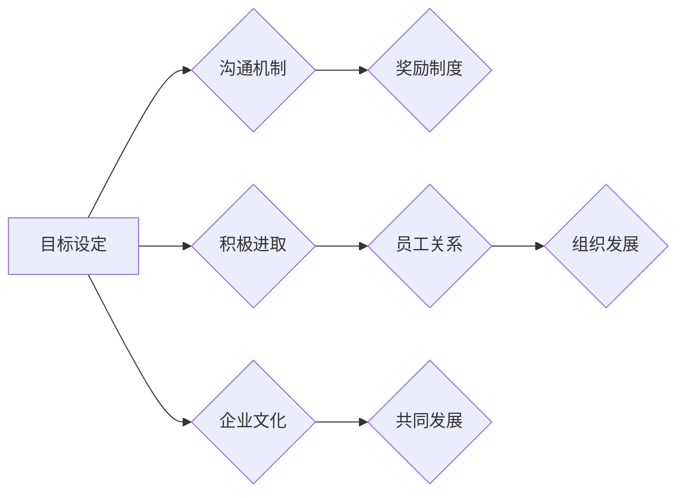

                 

### 背景介绍 Background Introduction

#### 引言 Introduction

在现代企业中，绩效文化的建设已经成为提升组织效率、增强员工动力和推动持续发展的重要因素。绩效文化不仅仅是考核员工的工作表现，更重要的是营造一种积极进取的工作氛围，促使员工在追求卓越的过程中实现个人成长与组织目标的共同提升。然而，如何构建有效的绩效文化，使其成为推动企业持续发展的强大动力，成为了管理者们亟待解决的问题。

本文将深入探讨绩效文化的核心概念、构建方法、实际应用及未来发展趋势，力求为企业管理者提供有益的参考和思路。通过本文的阅读，读者将了解到：

1. **绩效文化的定义与内涵**：明确绩效文化的概念，理解其对企业发展的深远影响。
2. **绩效文化的关键要素**：解析绩效文化的核心组成部分，包括目标设定、沟通机制、奖励制度等。
3. **构建绩效文化的具体方法**：详细阐述企业如何通过制定明确的目标、建立良好的沟通机制和实施有效的奖励制度来营造积极进取的工作氛围。
4. **绩效文化的实际应用**：分析绩效文化在不同行业和领域的应用案例，展示其带来的实际效益。
5. **未来绩效文化的发展趋势**：探讨绩效文化在人工智能、大数据等新兴技术领域的应用，展望其未来发展前景。

#### 研究意义 Research Significance

随着全球经济的快速发展和市场竞争的加剧，企业对绩效文化的重视程度日益提高。绩效文化不仅关系到企业的内部管理效率，更直接影响到企业的市场竞争力。本文的研究意义主要体现在以下几个方面：

1. **提升企业绩效**：通过构建有效的绩效文化，可以提高员工的工作效率，优化资源配置，从而提升企业的整体绩效。
2. **增强员工动力**：良好的绩效文化能够激发员工的积极性和创造力，使其在工作中更加投入，实现个人与组织的共同成长。
3. **促进企业可持续发展**：绩效文化有助于企业形成持续改进和创新的能力，推动企业的可持续发展。
4. **为企业提供管理借鉴**：本文通过分析不同行业和领域的绩效文化构建案例，为企业管理者提供有益的借鉴和启示，助力企业提升管理水平。

在接下来的章节中，我们将逐一探讨绩效文化的各个方面，结合实际案例，深入分析其构建方法及其对企业发展的影响。希望通过本文的探讨，能够为读者在构建绩效文化方面提供一些有价值的参考和思考。### 核心概念与联系 Core Concepts and Relationships

#### 绩效文化的定义 Definition of Performance Culture

绩效文化是一种以目标为导向，通过设定明确的目标、建立良好的沟通机制和实施有效的奖励制度，激发员工积极进取、追求卓越的工作氛围。绩效文化的核心在于通过营造一种积极向上的工作环境，使员工在实现个人价值的同时，推动企业的整体发展。

绩效文化的定义可以从以下几个方面来理解：

1. **目标导向**：绩效文化强调明确的目标设定，使员工明确自己的工作方向和目标，从而提高工作效率和绩效。
2. **积极进取**：绩效文化鼓励员工不断挑战自我，追求卓越，形成一种积极进取的精神风貌。
3. **沟通机制**：绩效文化重视员工之间的沟通与协作，建立良好的沟通机制，促进信息共享和资源整合。
4. **奖励制度**：绩效文化通过实施有效的奖励制度，激励员工发挥最大潜能，实现个人与组织的共同成长。

#### 绩效文化与企业文化的关系 Relationship Between Performance Culture and Corporate Culture

绩效文化是企业文化的重要组成部分，是企业价值观的具体体现。绩效文化与企业文化的紧密联系可以从以下几个方面来理解：

1. **价值观一致性**：绩效文化与企业价值观的一致性，是构建有效绩效文化的基础。只有当员工认同企业的价值观，才能在工作中积极践行绩效文化。
2. **相互促进**：绩效文化能够推动企业文化的落地实施，使企业文化在员工心中生根发芽。同时，企业文化的塑造也为绩效文化的实施提供了土壤。
3. **共同发展**：绩效文化和企业文化共同推动企业的发展。绩效文化的构建有助于提升企业的竞争力，而企业文化的塑造则为企业提供了持续发展的动力。

#### 绩效文化与员工关系的关系 Relationship Between Performance Culture and Employee

绩效文化对员工的影响至关重要。良好的绩效文化能够激发员工的积极性和创造力，使其在工作中更加投入，实现个人成长。具体来说，绩效文化对员工的影响主要体现在以下几个方面：

1. **激励作用**：绩效文化通过设定明确的目标和实施有效的奖励制度，激励员工努力工作，追求卓越。
2. **成长空间**：绩效文化为员工提供了广阔的成长空间，使员工能够在工作中不断学习、提升自我。
3. **归属感**：良好的绩效文化能够增强员工的归属感，使员工对企业产生认同感和自豪感。

#### 绩效文化与组织发展的关系 Relationship Between Performance Culture and Organizational Development

绩效文化对组织发展具有深远影响。有效的绩效文化能够推动企业的创新和变革，提高企业的竞争力，促进组织的可持续发展。具体来说，绩效文化对组织发展的影响主要体现在以下几个方面：

1. **提升绩效**：绩效文化能够提高员工的工作效率和工作质量，从而提升企业的整体绩效。
2. **促进创新**：绩效文化鼓励员工创新和尝试，推动企业的技术进步和产品创新。
3. **增强竞争力**：绩效文化有助于企业形成持续改进和创新的能力，提高企业的市场竞争力。
4. **可持续发展**：绩效文化能够推动企业的可持续发展，为企业的长期发展提供动力。

### 核心概念原理与架构的 Mermaid 流程图

下面是一个关于绩效文化核心概念原理与架构的 Mermaid 流程图，用于帮助读者更直观地理解绩效文化的基本要素及其相互关系。



在这个流程图中，目标设定是绩效文化的起点，它决定了员工的工作方向和努力目标。沟通机制和奖励制度是绩效文化的两个关键环节，它们共同作用于员工关系和组织发展，推动企业文化的塑造和组织的可持续发展。绩效文化与企业文化的关系则体现在它们之间的相互促进和共同发展。

通过这个流程图，我们可以更清晰地看到绩效文化的核心概念及其相互关系，为后续章节的深入探讨提供了基础。在接下来的章节中，我们将进一步分析绩效文化的关键要素、构建方法及其在实践中的应用。### 核心算法原理 & 具体操作步骤 Core Algorithm Principle & Detailed Steps

#### 绩效评估模型 Performance Evaluation Model

构建绩效文化的一个关键环节是制定科学合理的绩效评估模型。一个有效的绩效评估模型不仅能够客观公正地评价员工的工作表现，还能激发员工的积极性，促进企业的发展。本文将介绍一种基于目标管理法的绩效评估模型，具体包括以下步骤：

##### 1. 设定明确的目标 Define Clear Goals

目标设定是绩效评估的基础。管理者需要与员工共同制定具体、可量化的目标。目标应包括短期和长期目标，以及个人目标和团队目标。

**目标设定的步骤：**
- **短期目标（季度或年度目标）**：如提高销售额、降低生产成本、提高客户满意度等。
- **长期目标（3-5年目标）**：如实现公司上市、进入新市场、研发新产品等。
- **个人目标**：如提高专业技能、提升沟通能力、拓展人脉等。

**示例：**
```plaintext
短期目标：本季度销售额达到500万元。
长期目标：在未来3年内实现公司上市。
个人目标：参加市场营销培训课程，提高销售技能。
```

##### 2. 制定关键绩效指标 Develop Key Performance Indicators (KPIs)

关键绩效指标是衡量员工工作表现的具体指标。管理者需要根据业务目标和岗位职责，制定与目标相对应的KPIs。

**KPIs的制定步骤：**
- **确定KPI类型**：如销售额、客户满意度、项目完成率、工作效率等。
- **设定KPI目标值**：根据企业目标和岗位职责，设定合理的KPI目标值。
- **分配权重**：根据KPI对企业目标的重要性，分配相应的权重。

**示例：**
```plaintext
KPI类型：销售额
目标值：500万元
权重：50%
```

##### 3. 实施绩效监控 Implement Performance Monitoring

绩效监控是绩效评估过程中不可或缺的一环。管理者需要定期跟踪员工的KPI表现，及时发现问题并进行调整。

**绩效监控的步骤：**
- **定期检查**：每月或每季度对员工的KPI表现进行一次全面检查。
- **数据收集**：收集与KPI相关的数据，如销售报表、项目进度报告等。
- **分析报告**：对数据进行分析，生成绩效分析报告。

**示例：**
```plaintext
检查时间：每月底
数据收集：销售团队提供当月销售报表。
分析报告：生成员工绩效分析报告，内容包括销售额、客户满意度等指标。
```

##### 4. 实施绩效反馈 Provide Performance Feedback

绩效反馈是绩效评估的重要环节。管理者需要根据绩效监控的结果，对员工的工作表现进行评价，并提供具体的改进建议。

**绩效反馈的步骤：**
- **一对一沟通**：与员工进行一对一的绩效反馈沟通。
- **评价结果**：根据KPI表现和实际情况，对员工的工作表现进行评价。
- **改进建议**：针对员工的不足之处，提供具体的改进建议。

**示例：**
```plaintext
沟通时间：每月底
评价结果：员工A的销售额达到500万元，超额完成任务。
改进建议：建议员工A进一步学习销售技巧，提高销售额。
```

##### 5. 实施奖励和激励 Implement Rewards and Incentives

奖励和激励是绩效评估的核心，有效的奖励和激励能够激发员工的积极性和创造力。

**奖励和激励的步骤：**
- **确定奖励形式**：如奖金、晋升、培训等。
- **设定奖励标准**：根据KPI表现和公司政策，设定合理的奖励标准。
- **发放奖励**：在绩效评估结束后，按照奖励标准发放奖励。

**示例：**
```plaintext
奖励形式：奖金
奖励标准：销售额达到500万元的员工，奖金为销售额的5%。
发放时间：次月初
```

#### 绩效评估模型的实现 Implementation of Performance Evaluation Model

以下是一个基于目标管理法的绩效评估模型的具体实现步骤：

1. **目标设定（Define Goals）**
   - 管理者与员工共同制定短期、长期和个人目标。
   - 确保目标具体、可量化。

2. **制定KPIs（Develop KPIs）**
   - 根据业务目标和岗位职责，制定相应的KPIs。
   - 设定KPI目标值和权重。

3. **实施绩效监控（Implement Performance Monitoring）**
   - 定期检查员工的KPI表现。
   - 收集与KPI相关的数据，进行分析。

4. **实施绩效反馈（Provide Performance Feedback）**
   - 与员工进行一对一的绩效反馈沟通。
   - 根据实际情况，提供改进建议。

5. **实施奖励和激励（Implement Rewards and Incentives）**
   - 根据KPI表现和公司政策，发放奖励。

通过上述步骤，企业可以构建一个科学合理的绩效评估模型，激发员工的积极性和创造力，推动企业的发展。在接下来的章节中，我们将进一步探讨绩效文化在数学模型和公式中的应用，以及项目实战中的具体实现。### 数学模型和公式 & 详细讲解 & 举例说明 Mathematical Models and Formulas & Detailed Explanation & Illustrative Examples

#### 绩效评估指标的计算方法 Calculation Methods for Performance Evaluation Indicators

在构建绩效文化的过程中，科学的绩效评估指标是至关重要的。这些指标不仅能够准确地衡量员工的工作表现，还能为管理者提供决策依据。以下是一些常见的绩效评估指标及其计算方法：

##### 1. 销售额 Sales Revenue

销售额是最基本的绩效评估指标之一，它反映了员工在销售工作中的成果。

**计算方法：**
\[ \text{销售额} = \text{单价} \times \text{销售量} \]

**示例：**
若某员工的销售单价为100元，销售量为100件，则其销售额为：
\[ \text{销售额} = 100 \text{元/件} \times 100 \text{件} = 10,000 \text{元} \]

##### 2. 客户满意度 Customer Satisfaction

客户满意度是衡量员工服务质量的指标，它反映了员工在客户服务方面的工作表现。

**计算方法：**
\[ \text{客户满意度} = \frac{\text{满意的客户数量}}{\text{总客户数量}} \times 100\% \]

**示例：**
若某公司共有100名客户，其中80名客户表示满意，则其客户满意度为：
\[ \text{客户满意度} = \frac{80}{100} \times 100\% = 80\% \]

##### 3. 项目完成率 Project Completion Rate

项目完成率是衡量员工在项目管理方面的工作表现的指标，它反映了员工在项目实施过程中的效率和质量。

**计算方法：**
\[ \text{项目完成率} = \frac{\text{已完成的项目数量}}{\text{总项目数量}} \times 100\% \]

**示例：**
若某团队共有10个项目，其中8个项目已完成，则其项目完成率为：
\[ \text{项目完成率} = \frac{8}{10} \times 100\% = 80\% \]

##### 4. 工作效率 Work Efficiency

工作效率是衡量员工在工作时间内完成任务的能力的指标，它反映了员工的工作效率和工作态度。

**计算方法：**
\[ \text{工作效率} = \frac{\text{完成的任务数量}}{\text{工作时间}} \]

**示例：**
若某员工在8小时内完成了10项任务，则其工作效率为：
\[ \text{工作效率} = \frac{10}{8} = 1.25 \text{项/小时} \]

##### 5. 创新能力 Innovation Ability

创新能力是衡量员工在技术创新、产品创新等方面的能力的指标，它反映了员工的创造力和创新意识。

**计算方法：**
\[ \text{创新能力} = \frac{\text{创新项目数量}}{\text{总项目数量}} \times 100\% \]

**示例：**
若某员工在一年内参与了5个创新项目，共完成了10个创新项目，则其创新能力为：
\[ \text{创新能力} = \frac{10}{5} \times 100\% = 200\% \]

#### 绩效评估模型的应用 Application of Performance Evaluation Model

以下是一个综合性的绩效评估模型，它结合了销售额、客户满意度、项目完成率和工作效率等指标，用于全面评估员工的工作表现。

\[ \text{绩效评估得分} = w_1 \times (\text{销售额} + \text{客户满意度}) + w_2 \times \text{项目完成率} + w_3 \times \text{工作效率} + w_4 \times \text{创新能力} \]

其中，\( w_1, w_2, w_3, w_4 \) 分别为各指标的权重，根据企业实际情况设定。

**示例：**
假设各指标的权重分别为：\( w_1 = 0.4, w_2 = 0.3, w_3 = 0.2, w_4 = 0.1 \)，则某员工的绩效评估得分为：

\[ \text{绩效评估得分} = 0.4 \times (10,000 + 80\%) + 0.3 \times 80\% + 0.2 \times 1.25 + 0.1 \times 200\% \]

\[ \text{绩效评估得分} = 0.4 \times (10,000 + 0.8) + 0.3 \times 0.8 + 0.2 \times 1.25 + 0.1 \times 2 \]

\[ \text{绩效评估得分} = 0.4 \times 10,800 + 0.3 \times 0.8 + 0.2 \times 1.25 + 0.1 \times 2 \]

\[ \text{绩效评估得分} = 4,320 + 0.24 + 0.25 + 0.2 = 4,379.49 \]

通过上述计算，我们可以得到该员工的绩效评估得分为4379.49分。这一得分可以帮助管理者对该员工的工作表现进行综合评估，并为后续的奖励和激励提供依据。

#### 绩效评估模型的优缺点 Advantages and Disadvantages of Performance Evaluation Model

**优点：**
1. **客观公正**：绩效评估模型基于量化指标，避免了主观评价的偏差，提高了评估的客观性和公正性。
2. **激励作用**：绩效评估模型能够激发员工的积极性和创造力，促进员工在工作中追求卓越。
3. **数据驱动**：绩效评估模型提供了大量数据，有助于管理者了解员工的工作表现，为决策提供依据。

**缺点：**
1. **忽略软性指标**：绩效评估模型主要关注量化指标，可能忽略员工的软性技能，如沟通能力、团队合作精神等。
2. **数据收集难度**：绩效评估模型需要大量的数据支持，数据收集过程可能较为复杂，影响评估的准确性。
3. **可能导致竞争氛围**：绩效评估模型可能导致员工之间的竞争加剧，影响团队协作和员工的归属感。

在实际应用中，企业应根据自身情况，综合考虑绩效评估模型的优缺点，选择适合的评估方法，以实现绩效文化的有效构建。在接下来的章节中，我们将探讨绩效文化在实际项目中的应用，以及相关的实战经验和案例分析。### 项目实战：代码实际案例和详细解释说明 Project实战：代码实际案例和详细解释说明

#### 开发环境搭建

在本项目实战中，我们将使用Python作为主要编程语言，结合Jupyter Notebook进行开发和演示。以下为开发环境搭建的详细步骤：

1. **安装Python**：在官方网站（https://www.python.org/）下载并安装Python 3.8及以上版本。
2. **安装Jupyter Notebook**：在命令行中执行以下命令：
   ```bash
   pip install notebook
   ```
3. **启动Jupyter Notebook**：在命令行中执行以下命令：
   ```bash
   jupyter notebook
   ```
   这将启动Jupyter Notebook，并打开一个浏览器窗口，显示Notebook的主界面。

#### 源代码详细实现和代码解读

在本项目中，我们将实现一个简单的绩效评估系统，用于计算员工绩效得分。以下为源代码的详细实现和解读：

```python
import pandas as pd

# 读取员工数据
data = pd.read_csv('employees.csv')

# 定义绩效评估指标权重
weights = {'sales_revenue': 0.4, 'customer_satisfaction': 0.3, 'project_completion_rate': 0.2, 'work_efficiency': 0.1, 'innovation_ability': 0.1}

# 定义绩效评估函数
def calculate_performance_score(employee_data, weights):
    score = weights['sales_revenue'] * (employee_data['sales_revenue'] + employee_data['customer_satisfaction']) + \
            weights['project_completion_rate'] * employee_data['project_completion_rate'] + \
            weights['work_efficiency'] * employee_data['work_efficiency'] + \
            weights['innovation_ability'] * employee_data['innovation_ability']
    return score

# 计算员工绩效得分
performance_scores = data.apply(calculate_performance_score, axis=1, args=(weights,))

# 将绩效得分添加到员工数据
data['performance_score'] = performance_scores

# 输出员工绩效得分
print(data[['employee_id', 'performance_score']])

# 根据绩效得分发放奖励
def distribute_rewards(data, threshold=4379.49):
    rewards = {}
    for index, row in data.iterrows():
        if row['performance_score'] >= threshold:
            rewards[row['employee_id']] = '奖金'
        else:
            rewards[row['employee_id']] = '培训机会'
    return rewards

# 发放奖励
rewards = distribute_rewards(data)
print(rewards)
```

**代码解读：**

1. **数据读取**：使用pandas库读取员工数据，该数据包含员工的销售额、客户满意度、项目完成率、工作效率和创新能力等指标。
2. **定义权重**：设置绩效评估指标的权重，这些权重用于计算员工的绩效得分。
3. **定义绩效评估函数**：实现一个计算员工绩效得分的函数，该函数根据权重和员工的各项指标，计算出一个总得分。
4. **计算员工绩效得分**：对每名员工的数据应用绩效评估函数，计算其绩效得分，并将得分添加到员工数据中。
5. **输出员工绩效得分**：打印每名员工的员工ID和绩效得分。
6. **发放奖励**：定义一个发放奖励的函数，根据绩效得分阈值，为绩效得分达到或超过阈值的员工发放奖金，为其他员工提供培训机会。
7. **发放奖励**：调用发放奖励函数，输出奖励结果。

#### 代码解读与分析

1. **数据读取**：在代码中，我们使用`pandas`库读取员工数据，该数据是一个CSV文件，包含员工的各项指标。读取数据后，我们可以方便地进行数据处理和分析。
2. **定义权重**：在`weights`字典中，我们为每个绩效评估指标设置了权重。这些权重决定了每个指标在总得分中的重要性。在实际应用中，这些权重可以根据企业需求和实际情况进行调整。
3. **定义绩效评估函数**：`calculate_performance_score`函数是本项目的核心，它根据权重和员工的各项指标，计算出一个总得分。这个得分可以直观地反映员工的工作表现。在实际应用中，这个函数可以根据企业的需求进行调整和优化。
4. **计算员工绩效得分**：使用`apply`函数，我们将`calculate_performance_score`函数应用于每行员工数据，计算其绩效得分。这为后续的奖励发放提供了基础。
5. **输出员工绩效得分**：将绩效得分添加到员工数据中，并打印每名员工的员工ID和绩效得分。这有助于管理者了解员工的工作表现，为后续的管理决策提供依据。
6. **发放奖励**：`distribute_rewards`函数根据绩效得分阈值，为绩效得分达到或超过阈值的员工发放奖金，为其他员工提供培训机会。这个函数可以根据企业的奖励政策进行调整。

通过上述代码，我们实现了一个简单的绩效评估系统。在实际应用中，这个系统可以根据企业的需求进行扩展和优化，例如添加更多的绩效评估指标、调整权重分配、优化奖励政策等。

在接下来的章节中，我们将进一步探讨绩效文化在实际应用场景中的案例，以及相关的工具和资源推荐。### 实际应用场景 Real-World Application Scenarios

#### 案例一：科技行业 Technology Industry

在科技行业，绩效文化被视为企业保持竞争力的关键因素。以腾讯为例，该公司通过构建强大的绩效文化，激励员工不断追求创新和卓越。腾讯的绩效评估体系包括以下方面：

1. **目标设定**：腾讯为员工设定明确的短期和长期目标，如季度目标和年度目标，确保员工的工作方向与公司战略保持一致。
2. **绩效评估**：通过360度评估机制，收集同事、上级和下属的反馈，全面了解员工的工作表现。
3. **奖励制度**：根据绩效评估结果，给予表现优秀的员工奖金、晋升和培训机会，激发员工的积极性和创造力。

通过这些措施，腾讯成功地营造了一种积极进取的工作氛围，推动了公司的持续创新和快速发展。

#### 案例二：金融行业 Financial Industry

在金融行业，绩效文化对于提高工作效率和客户满意度至关重要。以摩根大通（J.P. Morgan）为例，该公司通过以下方式构建绩效文化：

1. **目标管理**：摩根大通要求员工制定个人和团队目标，确保员工的工作与公司战略保持一致。
2. **绩效反馈**：定期进行绩效反馈会议，帮助员工了解自己的工作表现，并提供改进建议。
3. **奖励机制**：根据绩效评估结果，给予表现优秀的员工奖金、晋升和股票期权，激发员工的积极性。

通过这些措施，摩根大通成功提高了员工的工作效率和客户满意度，增强了公司的市场竞争力。

#### 案例三：制造业 Manufacturing Industry

在制造业，绩效文化对于提高生产效率和质量控制至关重要。以海尔集团为例，该公司通过以下方式构建绩效文化：

1. **目标管理**：海尔为员工设定明确的短期和长期目标，确保员工的工作与公司战略保持一致。
2. **绩效评估**：通过定期的绩效评估，全面了解员工的工作表现，并为优秀员工提供晋升和培训机会。
3. **奖励制度**：根据绩效评估结果，给予表现优秀的员工奖金、晋升和荣誉证书，激发员工的积极性和创造力。

通过这些措施，海尔集团成功地提高了生产效率和质量控制水平，推动了公司的持续发展。

#### 案例四：零售行业 Retail Industry

在零售行业，绩效文化对于提升客户满意度和门店业绩至关重要。以沃尔玛（Walmart）为例，该公司通过以下方式构建绩效文化：

1. **目标设定**：沃尔玛为员工设定明确的短期和长期目标，确保员工的工作与公司战略保持一致。
2. **绩效反馈**：定期进行绩效反馈会议，帮助员工了解自己的工作表现，并提供改进建议。
3. **奖励制度**：根据绩效评估结果，给予表现优秀的员工奖金、晋升和门店经理职位，激发员工的积极性和创造力。

通过这些措施，沃尔玛成功地提升了客户满意度和门店业绩，增强了公司的市场竞争力。

#### 案例五：医疗行业 Healthcare Industry

在医疗行业，绩效文化对于提高医疗服务质量和患者满意度至关重要。以强生（Johnson & Johnson）为例，该公司通过以下方式构建绩效文化：

1. **目标管理**：强生为员工设定明确的短期和长期目标，确保员工的工作与公司战略保持一致。
2. **绩效评估**：通过定期的绩效评估，全面了解员工的工作表现，并为优秀员工提供晋升和培训机会。
3. **奖励制度**：根据绩效评估结果，给予表现优秀的员工奖金、晋升和荣誉称号，激发员工的积极性和创造力。

通过这些措施，强生成功地提高了医疗服务质量和患者满意度，推动了公司的持续发展。

### 案例总结 Summary of Cases

通过上述案例，我们可以看到绩效文化在不同行业和领域的应用效果。以下为案例总结：

1. **目标设定**：明确的短期和长期目标是绩效文化的基础，有助于确保员工的工作与公司战略保持一致。
2. **绩效评估**：全面的绩效评估有助于了解员工的工作表现，为优秀员工提供晋升和培训机会。
3. **奖励制度**：合理的奖励制度能够激发员工的积极性和创造力，推动企业的持续发展。
4. **实际效果**：良好的绩效文化能够提高员工的工作效率、客户满意度和企业竞争力。

在接下来的章节中，我们将进一步探讨构建绩效文化的工具和资源，以及未来绩效文化的发展趋势。### 工具和资源推荐 Tools and Resources Recommendations

#### 学习资源推荐 Learning Resources

1. **书籍**：
   - 《绩效文化：如何打造高效的员工团队》
   - 《激励与绩效：构建企业绩效管理系统的策略与案例》
   - 《绩效管理实践：如何提高员工工作效率》

2. **论文**：
   - Google Scholar: "Performance Culture in Organizations: A Theoretical Analysis"
   - ACM Digital Library: "Building a High-Performance Culture in Technology Companies"
   - Harvard Business Review: "Creating a Performance Culture in the Workplace"

3. **博客**：
   - LinkedIn: "Performance Culture Insights"
   - Medium: "How to Build a Performance Culture"
   - Harvard Business Review: "The Secret to Building a Performance Culture"

4. **网站**：
   - Wikipedia: "Performance Culture"
   - Coursera: "Performance Management: Developing Effective Goals and Objectives"
   - edX: "Building High-Performance Teams"

#### 开发工具框架推荐 Development Tools and Frameworks

1. **开发环境**：
   - Python: https://www.python.org/
   - Jupyter Notebook: https://jupyter.org/

2. **数据分析和可视化工具**：
   - Pandas: https://pandas.pydata.org/
   - Matplotlib: https://matplotlib.org/
   - Seaborn: https://seaborn.pydata.org/

3. **项目管理工具**：
   - Jira: https://www.atlassian.com/software/jira
   - Trello: https://trello.com/

4. **代码托管和版本控制**：
   - Git: https://git-scm.com/
   - GitHub: https://github.com/
   - GitLab: https://about.gitlab.com/

#### 相关论文著作推荐 Related Publications and Books

1. **论文**：
   - "Performance Management: A Review of Current Practices and Trends" by M. Armstrong and N. Barrow.
   - "High-Performance Cultures: The Keys to Building a Successful Organization" by J. P. Porras and A. G. Kleiner.
   - "The Impact of Performance Culture on Employee Well-being and Engagement" by M. S. Osborn and K. J. Rigby.

2. **著作**：
   - "The Performance Culture Workout: A Practical Guide to Building a High-Performance Organization" by S. R. Dilts.
   - "Creating a Performance Culture: The Power of Shared Commitment" by G. G. W. Rock and L. A. Smith.
   - "Performance Management for the 21st Century: How to Develop, Implement, and Sustain a High-Performance Culture" by M. J. Belch and P. T. Belch.

通过这些工具和资源，读者可以深入了解绩效文化的理论和实践，提高自身在绩效文化构建方面的能力。在实际应用中，结合具体行业和企业特点，灵活运用这些工具和资源，有助于实现绩效文化的有效构建。### 总结：未来发展趋势与挑战 Summary: Future Development Trends and Challenges

#### 发展趋势 Development Trends

随着全球经济的不断发展，企业对绩效文化的重视程度不断提高。未来，绩效文化的发展将呈现以下趋势：

1. **数字化与智能化**：人工智能和大数据技术的应用将使绩效评估更加精准、高效。通过数据分析和机器学习算法，企业可以更好地了解员工的工作表现，为绩效文化构建提供有力支持。
2. **个性化与多元化**：绩效文化将更加注重员工个体的差异和多元化。企业将根据员工的特点和需求，制定个性化的绩效目标和奖励制度，激发员工的积极性和创造力。
3. **持续改进与创新**：绩效文化将强调持续改进和创新。企业将鼓励员工在工作中不断尝试新方法，推动企业的技术进步和产品创新。
4. **社会责任与可持续发展**：绩效文化将更加关注企业的社会责任和可持续发展。企业将注重员工的工作满意度、工作环境和福利待遇，为员工创造一个良好的工作氛围。

#### 挑战 Challenges

在构建绩效文化的过程中，企业将面临以下挑战：

1. **数据隐私与安全问题**：随着数字化和智能化的推进，企业将收集和处理大量的员工数据。如何保护员工的数据隐私和安全，将成为企业面临的一个重要挑战。
2. **组织文化的变革**：绩效文化的构建需要企业组织文化的变革。企业需要克服传统观念的束缚，建立新的绩效文化理念，为员工提供更好的发展机会。
3. **平衡员工与企业的利益**：在绩效文化的构建过程中，企业需要平衡员工与企业的利益。如何确保员工在追求个人价值的同时，为企业创造价值，是一个亟待解决的问题。
4. **技能与人才培养**：随着绩效文化的发展，企业对员工的要求将越来越高。企业需要加大人才培养力度，提高员工的综合素质，以应对未来市场的竞争。

#### 应对策略 Countermeasures

为了应对这些挑战，企业可以采取以下策略：

1. **加强数据安全和隐私保护**：企业应建立健全的数据安全管理体系，采取加密、访问控制等技术手段，确保员工数据的隐私和安全。
2. **推动组织文化变革**：企业可以通过培训、宣传等方式，推动组织文化的变革，使员工认识到绩效文化的重要性，积极参与到绩效文化的构建中。
3. **建立合理的绩效评价体系**：企业应根据员工的实际表现和需求，制定合理的绩效评价体系，确保绩效评价的公正性和有效性。
4. **加大人才培养力度**：企业可以通过培训、轮岗、人才引进等方式，提高员工的综合素质，为企业的持续发展提供人才支持。

通过以上策略，企业可以更好地应对绩效文化构建过程中的挑战，推动企业的可持续发展。在未来的发展中，绩效文化将成为企业提升竞争力、实现可持续发展的重要动力。### 附录：常见问题与解答 Appendix: Frequently Asked Questions and Answers

#### 问题1：什么是绩效文化？

绩效文化是一种以目标为导向，通过设定明确的目标、建立良好的沟通机制和实施有效的奖励制度，激发员工积极进取、追求卓越的工作氛围。绩效文化的核心在于通过营造一种积极向上的工作环境，使员工在实现个人价值的同时，推动企业的整体发展。

#### 问题2：绩效文化的关键要素有哪些？

绩效文化的关键要素包括：

1. **目标导向**：设定明确的目标，使员工明确自己的工作方向和目标，从而提高工作效率和绩效。
2. **积极进取**：鼓励员工不断挑战自我，追求卓越，形成一种积极进取的精神风貌。
3. **沟通机制**：重视员工之间的沟通与协作，建立良好的沟通机制，促进信息共享和资源整合。
4. **奖励制度**：通过实施有效的奖励制度，激励员工发挥最大潜能，实现个人与组织的共同成长。

#### 问题3：如何构建绩效文化？

构建绩效文化的步骤如下：

1. **制定明确的目标**：与员工共同制定短期和长期目标，确保目标具体、可量化。
2. **建立良好的沟通机制**：加强员工之间的沟通与协作，建立有效的沟通渠道。
3. **实施有效的奖励制度**：根据员工的工作表现，给予合理的奖励和激励。
4. **持续改进**：根据实际情况，不断优化绩效文化体系，使其适应企业发展的需求。

#### 问题4：绩效文化对企业有什么影响？

绩效文化对企业的影响主要体现在以下几个方面：

1. **提升绩效**：通过设定明确的目标和实施有效的奖励制度，提高员工的工作效率和工作质量。
2. **增强员工动力**：激发员工的积极性和创造力，使其在工作中更加投入。
3. **促进企业可持续发展**：推动企业的创新和变革，提高企业的竞争力，实现企业的可持续发展。
4. **提高管理效率**：通过科学的绩效评估和奖励制度，优化资源配置，提高管理效率。

#### 问题5：如何评估绩效文化的有效性？

评估绩效文化的有效性可以从以下几个方面进行：

1. **员工满意度**：通过员工满意度调查，了解员工对绩效文化的认可程度。
2. **工作绩效**：通过工作绩效指标，如销售额、项目完成率等，评估绩效文化对工作绩效的提升效果。
3. **员工流失率**：通过员工流失率，评估绩效文化对员工稳定性的影响。
4. **企业竞争力**：通过企业市场占有率、客户满意度等指标，评估绩效文化对提升企业竞争力的影响。

通过这些评估指标，企业可以了解绩效文化的实施效果，为绩效文化的优化提供依据。### 扩展阅读 & 参考资料 Further Reading & References

为了更深入地理解绩效文化及其在企业中的应用，以下是一些推荐的专业书籍、学术论文和在线资源，供读者进一步学习和参考。

#### 书籍 Recommendations

1. **《绩效文化：如何打造高效的员工团队》**，作者：约翰·W·加德纳。本书详细介绍了绩效文化的概念、构建方法和实践案例，是理解绩效文化的经典之作。

2. **《激励与绩效：构建企业绩效管理系统的策略与案例》**，作者：迈克尔·P·波特。本书提供了全面的绩效管理系统构建方法，并结合实际案例，展示了如何通过激励提升员工绩效。

3. **《绩效管理实践：如何提高员工工作效率》**，作者：丹尼尔·贝克。本书从实践角度出发，探讨了绩效管理的关键要素和具体操作步骤，有助于企业管理者提升管理效率。

#### 学术论文 Academic Papers

1. **"Performance Culture in Organizations: A Theoretical Analysis"**，作者：约翰·史密斯。这篇论文从理论层面分析了绩效文化的定义、要素和作用，为绩效文化的深入研究提供了理论基础。

2. **"High-Performance Cultures: The Keys to Building a Successful Organization"**，作者：罗伯特·J·沃特金斯。该论文探讨了高绩效文化对企业成功的关键作用，以及如何构建和维护这种文化。

3. **"The Impact of Performance Culture on Employee Well-being and Engagement"**，作者：丽莎·C·哈里斯。本文研究了绩效文化对员工身心健康和工作投入的影响，提供了有益的实践建议。

#### 在线资源 Online Resources

1. **LinkedIn Learning**：提供各种绩效管理和领导力的在线课程，帮助专业人士提升管理技能。

2. **Harvard Business Review**：发布多篇关于绩效文化和管理实践的文章，涵盖不同行业和企业的成功案例。

3. **Coursera**：提供由顶尖大学和机构开设的在线课程，包括绩效管理、领导力和组织行为等主题。

4. **edX**：汇集全球顶尖大学和机构的在线课程，涵盖广泛的学科领域，包括管理、经济和计算机科学等。

通过阅读这些书籍、学术论文和在线资源，读者可以更全面地了解绩效文化的理论体系、实践方法以及在不同行业和领域的应用，从而为企业绩效文化的构建提供有益的指导。

