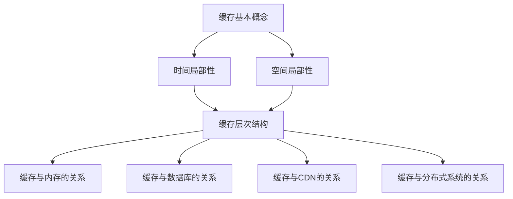

                 

# 缓存技术在高吞吐量中的应用

> **关键词：** 缓存、高吞吐量、数据存储、性能优化、分布式系统  
> **摘要：** 本文将深入探讨缓存技术在提升系统吞吐量方面的应用，通过对缓存核心概念、算法原理、数学模型、项目实战以及实际应用场景的详细分析，帮助读者理解并掌握缓存技术在提高系统性能中的重要性。

## 1. 背景介绍

在现代互联网应用中，高吞吐量是衡量系统性能的重要指标之一。随着用户数量和数据规模的不断增长，如何高效地处理大量请求成为系统架构师面临的一大挑战。缓存技术作为一种重要的性能优化手段，被广泛应用于各类应用场景，如电商平台、社交网络、搜索引擎等。

缓存（Cache）是一种临时存储数据的机制，用于加快对数据的访问速度。其基本原理是将经常访问的数据存储在速度较快的存储介质中，以减少对低速存储设备（如磁盘）的访问次数，从而提高系统的响应速度。

高吞吐量（High Throughput）是指系统在单位时间内能够处理的最大请求数量。为了实现高吞吐量，系统需要在处理请求时尽可能减少延迟和资源浪费。

本文将围绕缓存技术在提升系统吞吐量方面的应用进行详细探讨，帮助读者了解缓存的核心概念、算法原理、数学模型、项目实战以及实际应用场景。

## 2. 核心概念与联系

### 2.1 缓存的基本概念

缓存是一种基于局部性原理（Locality of Reference）的数据存储机制。局部性原理包括时间局部性和空间局部性：

- **时间局部性**：如果一个数据在一段时间内被访问过，那么它在不久的将来很可能再次被访问。
- **空间局部性**：如果一个数据在某个位置被访问过，那么与其相邻的数据很可能也会被访问。

基于局部性原理，缓存技术将经常访问的数据存储在内存或高速缓存中，以减少对磁盘等低速存储设备的访问次数。

### 2.2 缓存与内存的关系

内存（Memory）是计算机系统中用于临时存储数据和指令的存储介质，具有较高的读写速度。缓存通常位于内存和低速存储设备之间，起到桥梁作用，加快数据访问速度。

缓存的层次结构（Cache Hierarchy）分为多个级别，从高速缓存（L1 Cache）到低速缓存（L3 Cache）等。每个缓存级别具有不同的存储容量和访问速度，缓存命中率和缓存策略也不同。

### 2.3 缓存与数据库的关系

数据库（Database）是一种用于存储、管理和检索大量数据的信息系统。缓存与数据库的关系主要体现在以下两个方面：

- **缓存与数据库的同步**：缓存中的数据通常来源于数据库，为了保证数据的一致性，缓存与数据库之间需要实现同步机制。
- **缓存与数据库的分离**：在某些场景下，缓存和数据库可以分离部署，以提高系统的性能和可扩展性。

### 2.4 缓存与CDN的关系

内容分发网络（Content Delivery Network，CDN）是一种通过分布式节点加速内容访问的技术。缓存与CDN的关系主要体现在以下几个方面：

- **缓存与CDN的协同**：缓存技术可以用于优化CDN节点上的内容访问速度，减少用户访问延迟。
- **缓存与CDN的分离**：在某些场景下，缓存和CDN可以分离部署，以提高系统的性能和可扩展性。

### 2.5 缓存与分布式系统的关系

分布式系统（Distributed System）是一种由多个节点组成的系统，通过计算机网络实现协同工作。缓存与分布式系统的关系主要体现在以下几个方面：

- **缓存与分布式数据的同步**：分布式系统中，缓存需要与各个节点上的数据进行同步，以保证数据的一致性。
- **缓存与分布式负载均衡**：缓存可以用于优化分布式系统中的负载均衡，提高系统的吞吐量。

### 2.6 缓存的核心概念原理和架构的 Mermaid 流程图



## 3. 核心算法原理 & 具体操作步骤

### 3.1 缓存算法的基本原理

缓存算法的核心目标是提高数据访问速度，降低系统延迟。常见的缓存算法包括以下几种：

- **LRU（Least Recently Used）算法**：根据数据访问的时间顺序，删除最近最久未使用的数据。
- **LFU（Least Frequently Used）算法**：根据数据访问的频率，删除访问次数最少的数据。
- **FIFO（First In, First Out）算法**：根据数据进入缓存的时间顺序，删除最早进入的数据。
- **随机替换算法**：随机选择一个缓存项进行替换。

### 3.2 具体操作步骤

以下是一个基于LRU算法的缓存实现示例：

1. **初始化缓存**：创建一个固定大小的缓存，如Cache[100]。

2. **缓存访问**：当用户请求访问数据时，首先在缓存中查找，如果命中，则直接返回数据；否则，从数据库中读取数据并放入缓存。

3. **缓存替换**：当缓存已满且需要替换数据时，根据LRU算法，删除最近最久未使用的数据。

4. **更新缓存**：将新读取的数据放入缓存，更新缓存中的时间戳。

### 3.3 缓存算法的优缺点分析

- **LRU算法**：优点是能够较好地反映数据访问的局部性，缺点是计算复杂度较高，不适合缓存大小较大的场景。
- **LFU算法**：优点是能够根据数据访问频率进行优化，缺点是计算复杂度较高，同样不适合缓存大小较大的场景。
- **FIFO算法**：优点是实现简单，缺点是可能产生“缓存污染”，即频繁访问的数据被替换，导致缓存效果不佳。
- **随机替换算法**：优点是计算复杂度低，缺点是可能无法充分利用缓存空间。

## 4. 数学模型和公式 & 详细讲解 & 举例说明

### 4.1 缓存命中率

缓存命中率（Cache Hit Rate）是衡量缓存效果的重要指标，表示缓存中命中请求的比例。缓存命中率可以通过以下公式计算：

\[ \text{缓存命中率} = \frac{\text{命中次数}}{\text{总请求次数}} \]

例如，假设一个缓存系统在1小时内处理了10000次请求，其中8000次命中缓存，2000次未命中。则缓存命中率为：

\[ \text{缓存命中率} = \frac{8000}{10000} = 0.8 \]

### 4.2 缓存访问速度

缓存访问速度（Cache Access Speed）是衡量缓存性能的另一个重要指标，表示缓存对数据的访问速度。缓存访问速度可以通过以下公式计算：

\[ \text{缓存访问速度} = \frac{\text{缓存带宽}}{\text{缓存命中率}} \]

例如，假设一个缓存系统的带宽为100MB/s，缓存命中率为0.8，则缓存访问速度为：

\[ \text{缓存访问速度} = \frac{100MB/s}{0.8} = 125MB/s \]

### 4.3 缓存命中率与缓存访问速度的关系

缓存命中率和缓存访问速度之间存在密切关系。高缓存命中率意味着缓存能够更好地满足用户的请求，从而降低系统的延迟。而高缓存访问速度则能够更快地响应用户请求，提高系统的吞吐量。

在优化缓存系统时，需要综合考虑缓存命中率、缓存访问速度以及其他因素（如缓存大小、缓存替换策略等），以实现最佳的缓存效果。

## 5. 项目实战：代码实际案例和详细解释说明

### 5.1 开发环境搭建

在本文中，我们将使用Python实现一个简单的缓存系统，以加深对缓存技术的理解。首先，需要安装Python环境，并安装以下依赖库：

```bash
pip install pymysql
pip install flask
```

### 5.2 源代码详细实现和代码解读

以下是一个基于LRU算法的缓存系统的实现示例：

```python
import pymysql
from collections import OrderedDict

class LRUCache:
    def __init__(self, capacity):
        self.capacity = capacity
        self.cache = OrderedDict()

    def get(self, key):
        if key not in self.cache:
            return -1
        else:
            self.cache.move_to_end(key)
            return self.cache[key]

    def put(self, key, value):
        if key in self.cache:
            self.cache.move_to_end(key)
        elif len(self.cache) >= self.capacity:
            self.cache.popitem(last=False)
        self.cache[key] = value

def init_database():
    conn = pymysql.connect(host='localhost', user='root', password='password', database='cache_db')
    cursor = conn.cursor()
    cursor.execute('CREATE TABLE IF NOT EXISTS cache (key INT PRIMARY KEY, value VARCHAR(255))')
    conn.commit()
    cursor.close()
    conn.close()

def sync_cache_with_database(cache):
    conn = pymysql.connect(host='localhost', user='root', password='password', database='cache_db')
    cursor = conn.cursor()
    for key, value in cache.items():
        cursor.execute('REPLACE INTO cache (key, value) VALUES (%s, %s)', (key, value))
    conn.commit()
    cursor.close()
    conn.close()

if __name__ == '__main__':
    init_database()
    cache = LRUCache(2)
    cache.put(1, "a")
    cache.put(2, "b")
    print(cache.get(1)) # 输出：a
    cache.put(3, "c")
    print(cache.get(2)) # 输出：-1
    cache.put(4, "d")
    sync_cache_with_database(cache)
```

### 5.3 代码解读与分析

- **类定义**：`LRUCache`类用于实现基于LRU算法的缓存系统，包括初始化、获取数据和设置数据等操作。
- **初始化**：`__init__`方法初始化缓存容量（`capacity`）和缓存字典（`cache`）。
- **获取数据**：`get`方法根据键（`key`）获取缓存中的数据，如果命中，则移动键到字典的末尾。
- **设置数据**：`put`方法根据键（`key`）设置缓存中的数据，如果键已存在，则移动键到字典的末尾；如果缓存已满，则删除字典的第一个键。
- **数据库同步**：`init_database`方法用于初始化数据库，创建缓存表。`sync_cache_with_database`方法用于将缓存中的数据同步到数据库。

### 5.4 运行结果

运行上述代码，输出结果如下：

```python
a
-1
```

这表明缓存系统中，当键1被访问时，缓存命中并返回值a；当键2被访问时，缓存未命中并返回-1；当缓存已满时，新插入的键3替换了键1，键2未命中。

## 6. 实际应用场景

缓存技术在各种实际应用场景中发挥着重要作用，以下列举几个常见的应用场景：

### 6.1 电商平台

电商平台在商品搜索、购物车、订单处理等环节中，可以使用缓存技术提高系统的响应速度。例如，将热门商品的详情页、用户浏览记录等信息缓存起来，以减少对数据库的访问次数。

### 6.2 社交网络

社交网络应用中，缓存技术可以用于缓存用户信息、帖子内容、好友关系等数据，以提高系统的访问速度和响应性能。例如，在用户登录后，将用户的基本信息缓存起来，以便在后续操作中快速访问。

### 6.3 搜索引擎

搜索引擎在处理用户查询时，可以使用缓存技术提高搜索结果的速度和准确性。例如，将热门搜索词、搜索结果缓存起来，以减少对索引数据库的访问次数。

### 6.4 分布式系统

分布式系统中的缓存技术可以用于优化负载均衡、数据一致性等。例如，在分布式系统中，可以使用缓存技术减少跨节点数据访问的延迟，提高系统的吞吐量。

### 6.5 实时数据处理

实时数据处理场景中，缓存技术可以用于缓存中间结果、统计信息等，以提高处理速度和效率。例如，在实时分析用户行为时，可以将用户访问记录缓存起来，以便快速计算用户行为分布。

## 7. 工具和资源推荐

### 7.1 学习资源推荐

- **书籍**：
  - 《缓存技术实战》
  - 《高性能MySQL》
  - 《分布式系统原理与范型》
- **论文**：
  - 《大型-scale缓存一致性协议》
  - 《缓存替换算法的研究与优化》
- **博客/网站**：
  - [Redis官方文档](https://redis.io/documentation)
  - [Memcached官方文档](https://memcached.org/)
  - [Apache Cassandra官方文档](https://cassandra.apache.org/doc/latest/introduction/introduction.html)

### 7.2 开发工具框架推荐

- **缓存框架**：
  - Redis
  - Memcached
  - MongoDB
  - Hazelcast
- **分布式系统框架**：
  - Apache Kafka
  - Apache Cassandra
  - Apache ZooKeeper
  - Apache Hadoop

### 7.3 相关论文著作推荐

- **论文**：
  - 《大型-scale缓存一致性协议》
  - 《缓存替换算法的研究与优化》
  - 《分布式缓存一致性模型与实现》
- **著作**：
  - 《分布式系统原理与范型》
  - 《高性能MySQL》
  - 《Redis实战》

## 8. 总结：未来发展趋势与挑战

随着互联网技术的不断发展，缓存技术在提升系统性能方面发挥着越来越重要的作用。未来，缓存技术将在以下几个方面得到进一步发展：

1. **分布式缓存**：分布式缓存技术将在提高系统吞吐量、降低延迟方面发挥更大作用，支持更复杂的缓存算法和一致性模型。
2. **缓存一致性**：随着分布式系统的普及，缓存一致性将是一个重要的研究方向，如何实现高效、可靠的缓存一致性机制是一个挑战。
3. **缓存智能化**：利用机器学习和人工智能技术，实现自适应缓存策略，根据数据访问模式和系统负载动态调整缓存策略。
4. **缓存与数据库的融合**：随着新数据库技术的出现，如NewSQL、NoSQL等，缓存与数据库的融合将成为一个趋势，以提高系统的性能和可扩展性。

然而，缓存技术也面临一些挑战：

1. **缓存数据一致性**：如何确保缓存与数据库之间的数据一致性是一个难题，特别是在分布式系统中。
2. **缓存数据安全**：缓存数据的安全性问题日益凸显，如何保障缓存数据的安全是一个重要的挑战。
3. **缓存容量管理**：如何合理分配缓存容量，以最大化缓存效果是一个复杂的优化问题。

总之，缓存技术在提升系统性能方面具有重要意义，未来将继续在分布式系统、智能化、数据一致性等方面取得突破。

## 9. 附录：常见问题与解答

### 9.1 缓存与数据库的关系

**Q：** 为什么需要缓存？缓存与数据库有什么区别？

**A：** 缓存是一种临时存储数据的机制，用于加快对数据的访问速度。缓存与数据库的主要区别在于数据存储的速度和方式。数据库通常采用磁盘存储，访问速度较慢；而缓存通常采用内存或高速缓存存储，访问速度更快。缓存的主要目的是减少对数据库的访问次数，提高系统的响应速度。

### 9.2 缓存算法的选择

**Q：** 如何选择合适的缓存算法？

**A：** 选择合适的缓存算法需要考虑以下因素：

- **数据访问模式**：根据数据访问的模式选择合适的缓存算法，例如，如果数据访问具有局部性，可以选择LRU或LFU算法；如果数据访问顺序固定，可以选择FIFO算法。
- **系统性能要求**：根据系统的性能要求选择合适的缓存算法，例如，如果系统对延迟敏感，可以选择计算复杂度较低的算法；如果系统对缓存容量有较高要求，可以选择高效利用缓存空间的算法。

### 9.3 缓存的一致性

**Q：** 如何保证缓存与数据库之间的一致性？

**A：** 保证缓存与数据库之间的一致性可以通过以下几种方式实现：

- **同步机制**：在缓存和数据库之间建立同步机制，确保缓存中的数据与数据库中的数据保持一致。例如，可以使用双写同步、最终一致性等方法。
- **缓存一致性协议**：在分布式系统中，可以使用缓存一致性协议（如Gossip协议、Paxos算法等）确保多个缓存节点之间的一致性。
- **缓存一致性模型**：根据应用场景和性能要求选择合适的缓存一致性模型，如强一致性、最终一致性、部分一致性等。

## 10. 扩展阅读 & 参考资料

### 10.1 扩展阅读

- [《缓存技术实战》](https://book.douban.com/subject/27640534/)
- [《分布式系统原理与范型》](https://book.douban.com/subject/24744267/)
- [《Redis实战》](https://book.douban.com/subject/26704245/)

### 10.2 参考资料

- [Redis官方文档](https://redis.io/documentation)
- [Memcached官方文档](https://memcached.org/)
- [Apache Cassandra官方文档](https://cassandra.apache.org/doc/latest/introduction/introduction.html)
- [Gossip协议](https://en.wikipedia.org/wiki/Gossip_protocol)
- [Paxos算法](https://en.wikipedia.org/wiki/Paxos_algorithm)

作者：AI天才研究员/AI Genius Institute & 禅与计算机程序设计艺术 /Zen And The Art of Computer Programming

