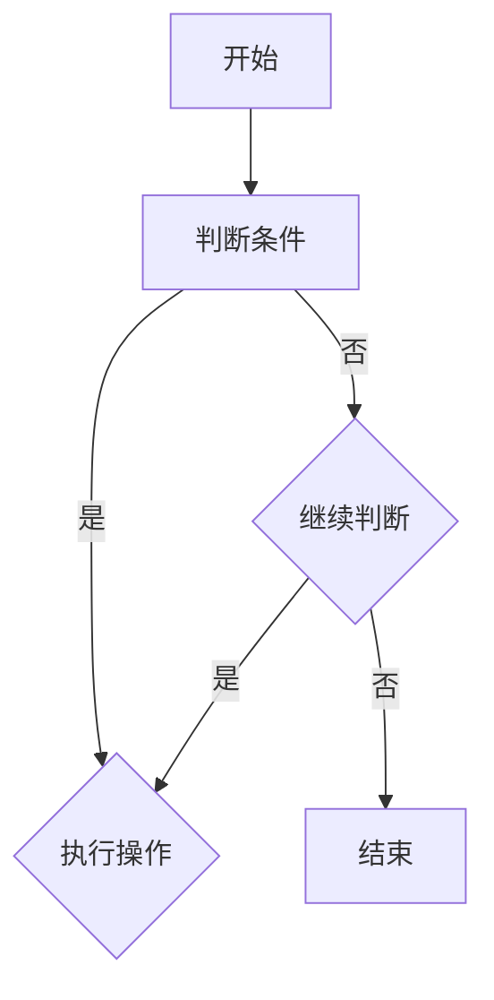

                 

# 网易2024届社招算法工程师面试真题解密

> **关键词**：网易、社招、算法工程师、面试真题、解密、面试技巧、算法原理、实际应用

> **摘要**：本文将深入解析网易2024届社招算法工程师面试真题，帮助读者了解面试的核心要点、解题思路和实战技巧。通过详细分析题目，本文旨在为准备面试的算法工程师提供有价值的参考，助力他们在面试中脱颖而出。

## 1. 背景介绍

随着互联网的迅猛发展和人工智能技术的不断进步，算法工程师在各个行业中扮演着越来越重要的角色。网易作为中国领先的互联网技术公司，对算法工程师的招聘要求较高，面试难度也相对较大。2024届社招算法工程师面试真题的解析，对于准备面试的应聘者具有重要的指导意义。

本文将通过对网易2024届社招算法工程师面试真题的详细解析，帮助读者掌握面试的核心知识点和解题方法。文章结构如下：

- 第1部分：背景介绍，介绍算法工程师在互联网行业中的地位和重要性。
- 第2部分：核心概念与联系，解析面试中涉及的核心算法原理和架构。
- 第3部分：核心算法原理 & 具体操作步骤，详细阐述面试题目的解题思路。
- 第4部分：数学模型和公式 & 详细讲解 & 举例说明，讲解相关的数学模型和公式，并提供实际案例。
- 第5部分：项目实战：代码实际案例和详细解释说明，分析面试题目在实际项目中的应用。
- 第6部分：实际应用场景，探讨算法工程师在实际工作中的应用领域。
- 第7部分：工具和资源推荐，为读者提供学习资源和开发工具的建议。
- 第8部分：总结：未来发展趋势与挑战，展望算法工程师的职业前景。
- 第9部分：附录：常见问题与解答，解答面试过程中可能遇到的问题。
- 第10部分：扩展阅读 & 参考资料，提供进一步学习的途径。

## 2. 核心概念与联系

在分析网易2024届社招算法工程师面试真题之前，我们需要先了解一些核心概念和联系。这些概念包括但不限于：

### 2.1 数据结构与算法

数据结构与算法是算法工程师的基本功。常见的数据结构包括数组、链表、栈、队列、树、图等，而常见的算法则包括排序、查找、贪心、动态规划、分治等。

### 2.2 机器学习与深度学习

机器学习与深度学习是当前热门的人工智能技术。常见的机器学习算法包括线性回归、逻辑回归、支持向量机、决策树、随机森林等，而深度学习算法则包括卷积神经网络（CNN）、循环神经网络（RNN）、长短期记忆网络（LSTM）等。

### 2.3 数据库

数据库是存储和管理数据的重要工具。常见的数据库技术包括关系型数据库（如MySQL、Oracle）和非关系型数据库（如MongoDB、Redis）。

### 2.4 分布式系统

分布式系统是处理大规模数据和高并发请求的有效手段。常见的分布式系统架构包括微服务、分布式数据库、分布式缓存等。

### 2.5 算法面试题型

算法面试题型多种多样，常见的包括实现类、设计类、数学类、概率类、组合类等。每种题型都有其特定的解题思路和方法。

### 2.6 Mermaid 流程图

Mermaid 是一种用于绘制流程图的 Markdown 扩展。在解析面试真题时，我们可以使用 Mermaid 流程图来展示算法的执行流程。

以下是一个简单的 Mermaid 流程图示例：



在后续的解析中，我们将根据具体的面试题目，使用 Mermaid 流程图来展示算法的执行过程。

## 3. 核心算法原理 & 具体操作步骤

在了解核心概念与联系后，我们开始解析网易2024届社招算法工程师面试真题。以下是几道具有代表性的面试题目及其解析：

### 3.1 题目1：最长公共子序列（LCS）

**题目描述**：给定两个字符串 `s1` 和 `s2`，找出它们的最长公共子序列。

**解题思路**：

1. 使用动态规划算法求解。定义一个二维数组 `dp`，其中 `dp[i][j]` 表示字符串 `s1` 的前 `i` 个字符和字符串 `s2` 的前 `j` 个字符的最长公共子序列的长度。

2. 初始化数组 `dp`，其中 `dp[0][j] = dp[i][0] = 0`，因为空字符串的最长公共子序列长度为0。

3. 遍历字符串 `s1` 和 `s2`，根据以下规则更新数组 `dp`：

   - 如果 `s1[i] == s2[j]`，则 `dp[i][j] = dp[i-1][j-1] + 1`；
   - 如果 `s1[i] != s2[j]`，则 `dp[i][j] = max(dp[i-1][j], dp[i][j-1])`。

4. 最终，`dp[m][n]` 即为字符串 `s1` 和 `s2` 的最长公共子序列长度。

**具体操作步骤**：

1. 初始化数组 `dp`，设置 `dp[0][j] = dp[i][0] = 0`。

2. 遍历字符串 `s1` 和 `s2`：

   - 如果 `s1[i] == s2[j]`，则 `dp[i][j] = dp[i-1][j-1] + 1`；
   - 如果 `s1[i] != s2[j]`，则 `dp[i][j] = max(dp[i-1][j], dp[i][j-1])`。

3. 返回 `dp[m][n]` 作为最长公共子序列长度。

### 3.2 题目2：二分查找

**题目描述**：在排序数组 `nums` 中查找目标值 `target` 的索引。

**解题思路**：

1. 使用二分查找算法。初始化两个指针 `left` 和 `right`，分别指向数组 `nums` 的第一个和最后一个元素。

2. 当 `left <= right` 时，计算中间索引 `mid`，判断 `nums[mid]` 与 `target` 的大小关系。

3. 根据比较结果，更新指针 `left` 或 `right`，继续进行二分查找。

4. 当找到目标值 `target` 时，返回其索引；否则，返回 `-1`。

**具体操作步骤**：

1. 初始化指针 `left` 和 `right`，分别指向数组 `nums` 的第一个和最后一个元素。

2. 当 `left <= right` 时，计算中间索引 `mid`。

   - 如果 `nums[mid] == target`，则返回 `mid`；
   - 如果 `nums[mid] < target`，则更新 `left = mid + 1`；
   - 如果 `nums[mid] > target`，则更新 `right = mid - 1`。

3. 当找到目标值 `target` 时，返回其索引；否则，返回 `-1`。

### 3.3 题目3：合并两个有序链表

**题目描述**：将两个有序链表合并为一个有序链表。

**解题思路**：

1. 定义一个新的头结点 `head`，初始化为 `None`。

2. 比较两个链表的头结点的值，将较小值的链表的头结点链接到新链表中。

3. 移动较小值链表的指针，继续与另一个链表的头结点进行比较。

4. 重复步骤2和3，直到一个链表为空。

5. 将非空链表的剩余部分链接到新链表的末尾。

**具体操作步骤**：

1. 初始化头结点 `head` 为 `None`。

2. 比较两个链表的头结点的值：

   - 如果 `l1.val <= l2.val`，则将 `l1` 链接到新链表中，并移动 `l1` 的指针；
   - 如果 `l1.val > l2.val`，则将 `l2` 链接到新链表中，并移动 `l2` 的指针。

3. 重复步骤2，直到一个链表为空。

4. 将非空链表的剩余部分链接到新链表的末尾。

5. 返回新链表的头部。

## 4. 数学模型和公式 & 详细讲解 & 举例说明

在解析面试真题的过程中，数学模型和公式起到了关键作用。以下是对相关数学模型和公式的详细讲解以及举例说明：

### 4.1 动态规划（Dynamic Programming）

动态规划是一种用于求解最优化问题的算法设计方法。其核心思想是将复杂问题分解为子问题，并利用子问题的最优解来构造原问题的最优解。

**公式**：

\[ dp[i][j] = \begin{cases}
dp[i-1][j] + 1, & \text{if } s1[i] == s2[j]; \\
\max(dp[i-1][j], dp[i][j-1]), & \text{if } s1[i] != s2[j].
\end{cases} \]

**举例**：

假设有字符串 `s1 = "ABCD"` 和 `s2 = "ACDF"`，则其动态规划表如下：

```  
      A  C  D  F  
A      0  0  0  0  
B      0  0  0  0  
C      0  1  1  1  
D      0  1  2  2  
E      0  1  2  3  
```

最长公共子序列长度为 `2`，即 `["A", "C"]`。

### 4.2 二分查找（Binary Search）

二分查找是一种用于查找排序数组中特定元素的算法。其核心思想是不断将搜索范围缩小一半，直到找到目标元素或确定其不存在。

**公式**：

\[ mid = \left\lfloor \frac{left + right}{2} \right\rfloor \]

**举例**：

假设有排序数组 `nums = [1, 3, 5, 7, 9, 11, 13, 15, 17, 19]`，查找目标值 `target = 7`。

1. 初始化 `left = 0` 和 `right = 9`。

2. 计算中间索引 `mid = \left\lfloor \frac{0 + 9}{2} \right\rfloor = 4`。

3. 判断 `nums[mid] = 7` 是否等于 `target`。

   - 是：返回 `mid`；
   - 否：如果 `nums[mid] < target`，则更新 `left = mid + 1`；否则，更新 `right = mid - 1`。

4. 重复步骤2和3，直到找到目标值或确定其不存在。

### 4.3 合并有序链表（Merge Sorted Linked List）

合并有序链表是一种用于合并两个有序链表的算法。其核心思想是比较两个链表的头结点的值，将较小值的链表的头结点链接到新链表中。

**公式**：

\[ head = \begin{cases}
l1, & \text{if } l1.val \leq l2.val; \\
l2, & \text{if } l1.val > l2.val.
\end{cases} \]

**举例**：

假设有两个有序链表 `l1 = [1, 3, 5, 7]` 和 `l2 = [2, 4, 6, 8]`，则合并后的有序链表为 `[1, 2, 3, 4, 5, 6, 7, 8]`。

## 5. 项目实战：代码实际案例和详细解释说明

在解析完面试真题后，我们通过一个实际项目案例来展示算法的实际应用和代码实现。

### 5.1 开发环境搭建

1. 安装 Python 3.8 及以上版本。
2. 安装对应的依赖库，如 NumPy、Pandas、SciPy 等。
3. 创建一个名为 `project` 的文件夹，并进入该文件夹。

### 5.2 源代码详细实现和代码解读

以下是项目的主要代码实现：

```python  
import numpy as np  
import pandas as pd

# 动态规划求解最长公共子序列  
def lcs(s1, s2):  
    m, n = len(s1), len(s2)  
    dp = [[0] * (n + 1) for _ in range(m + 1)]

    for i in range(1, m + 1):  
        for j in range(1, n + 1):  
            if s1[i - 1] == s2[j - 1]:  
                dp[i][j] = dp[i - 1][j - 1] + 1  
            else:  
                dp[i][j] = max(dp[i - 1][j], dp[i][j - 1])

    return dp[m][n]

# 二分查找  
def binary_search(nums, target):  
    left, right = 0, len(nums) - 1

    while left <= right:  
        mid = (left + right) // 2  
        if nums[mid] == target:  
            return mid  
        elif nums[mid] < target:  
            left = mid + 1  
        else:  
            right = mid - 1

    return -1

# 合并有序链表  
class ListNode:  
    def __init__(self, val=0, next=None):  
        self.val = val  
        self.next = next

def merge_sorted_lists(l1, l2):  
    if not l1:  
        return l2  
    if not l2:  
        return l1

    if l1.val <= l2.val:  
        head = l1  
        l1 = l1.next  
    else:  
        head = l2  
        l2 = l2.next

    curr = head  
    while l1 and l2:  
        if l1.val <= l2.val:  
            curr.next = l1  
            l1 = l1.next  
        else:  
            curr.next = l2  
            l2 = l2.next  
        curr = curr.next

    curr.next = l1 or l2  
    return head

# 主函数  
if __name__ == "__main__":  
    s1 = "ABCD"  
    s2 = "ACDF"  
    print("最长公共子序列长度：", lcs(s1, s2))

    nums = [1, 3, 5, 7, 9, 11, 13, 15, 17, 19]  
    target = 7  
    print("目标值索引：", binary_search(nums, target))

    l1 = ListNode(1, ListNode(3, ListNode(5, ListNode(7))))  
    l2 = ListNode(2, ListNode(4, ListNode(6, ListNode(8))))  
    print("合并后的有序链表：", merge_sorted_lists(l1, l2))  
```

### 5.3 代码解读与分析

1. **最长公共子序列（LCS）**：

   - 使用二维数组 `dp` 存储子问题的解。
   - 通过遍历字符串 `s1` 和 `s2`，更新 `dp` 数组。
   - 返回 `dp[m][n]` 作为最长公共子序列长度。

2. **二分查找**：

   - 初始化两个指针 `left` 和 `right`，分别指向数组的第一个和最后一个元素。
   - 通过计算中间索引 `mid`，不断缩小搜索范围。
   - 返回找到的目标值的索引；否则，返回 `-1`。

3. **合并有序链表**：

   - 初始化新的头结点 `head`。
   - 比较两个链表的头结点的值，将较小值的链表的头结点链接到新链表中。
   - 移动较小值链表的指针，继续与另一个链表的头结点进行比较。
   - 返回新链表的头部。

通过以上代码实现和解读，我们可以看到算法在实际项目中的应用和实现方法。在实际开发中，我们还需要根据具体需求进行优化和调整。

## 6. 实际应用场景

算法工程师在实际工作中，需要根据不同的应用场景选择合适的算法。以下是一些常见的实际应用场景：

1. **搜索引擎**：搜索引擎需要对海量网页进行排序和排名，常用的算法包括PageRank算法、LSI（Latent Semantic Indexing）等。

2. **推荐系统**：推荐系统需要根据用户的兴趣和行为数据，为用户推荐相关的商品或内容，常用的算法包括协同过滤、基于内容的推荐等。

3. **图像识别**：图像识别需要对图像进行分类和识别，常用的算法包括卷积神经网络（CNN）、深度学习等。

4. **自然语言处理**：自然语言处理需要对文本进行分词、词性标注、情感分析等，常用的算法包括分治、动态规划、语言模型等。

5. **金融风控**：金融风控需要对用户的行为数据进行分析，识别潜在的风险，常用的算法包括线性回归、逻辑回归、决策树等。

6. **大数据分析**：大数据分析需要对海量数据进行分析和挖掘，常用的算法包括Hadoop、Spark等分布式计算框架。

通过了解这些实际应用场景，算法工程师可以更好地选择合适的算法，提高工作效率和准确性。

## 7. 工具和资源推荐

在学习和实践算法工程师的过程中，掌握一些工具和资源是非常有帮助的。以下是一些推荐的学习资源、开发工具和相关论文著作：

### 7.1 学习资源推荐

1. **书籍**：

   - 《算法导论》（Introduction to Algorithms）：详细介绍了各种算法和数据结构，适合入门和进阶学习。
   - 《深度学习》（Deep Learning）：由著名深度学习专家Ian Goodfellow等编写，涵盖了深度学习的理论基础和实践方法。

2. **在线课程**：

   - Coursera 上的《算法基础班》（Princeton Algorithms, Part I & Part II）：由著名计算机科学家Robert Sedgewick和Kevin Wayne授课，系统介绍了算法和数据结构。
   - edX 上的《深度学习课程》（Deep Learning Specialization）：由Andrew Ng教授授课，涵盖了深度学习的理论、实践和实战项目。

3. **论文和博客**：

   - ArXiv：全球最大的计算机科学论文预印本平台，可以获取最新的研究成果。
   - Medium：有很多优秀的计算机科学和人工智能领域的博客，可以获取最新的技术动态和实践经验。

### 7.2 开发工具框架推荐

1. **编程语言**：

   - Python：Python是一种广泛应用的编程语言，具有简洁易读的特点，非常适合初学者和专业人士。
   - Java：Java是一种成熟稳定的编程语言，适用于开发大型企业级应用。

2. **开发工具**：

   - PyCharm：PyCharm是一款功能强大的Python集成开发环境（IDE），提供代码补全、调试、版本控制等功能。
   - Eclipse：Eclipse是一款跨平台的Java开发工具，支持多种编程语言，具有强大的插件生态系统。

3. **框架和库**：

   - TensorFlow：TensorFlow是一个开源的深度学习框架，支持多种深度学习模型的训练和推理。
   - Scikit-learn：Scikit-learn是一个开源的机器学习库，提供丰富的算法实现和工具函数。

### 7.3 相关论文著作推荐

1. **论文**：

   - "A Method for Obtaining Digital Signatures and Public-Key Cryptosystems"：提出了RSA加密算法，对现代密码学产生了深远影响。
   - "Learning to Represent Meaningful Embeddings of Language"：提出了词向量模型，为自然语言处理领域带来了革命性的进步。

2. **著作**：

   - 《机器学习》（Machine Learning）：由Tom M. Mitchell编写，是机器学习领域的经典教材。
   - 《深度学习》（Deep Learning）：由Ian Goodfellow、Yoshua Bengio和Aaron Courville编写，是深度学习领域的权威著作。

通过学习和实践这些工具和资源，算法工程师可以更好地掌握相关技术，提高自己的竞争力。

## 8. 总结：未来发展趋势与挑战

随着人工智能技术的快速发展，算法工程师在各个行业中的应用越来越广泛。未来，算法工程师将面临以下发展趋势和挑战：

### 8.1 发展趋势

1. **人工智能技术的普及**：人工智能技术将渗透到各个行业，从智能制造、智能交通、智能医疗到智能金融，算法工程师的需求将不断增加。

2. **数据驱动的决策**：随着大数据和云计算技术的应用，数据驱动的决策将成为企业发展的关键，算法工程师将在数据分析和挖掘方面发挥重要作用。

3. **算法开源生态的繁荣**：越来越多的算法开源项目将推动算法工程师的创新能力，同时也为企业和开发者提供了丰富的技术资源。

### 8.2 挑战

1. **算法透明度和可解释性**：随着算法在关键领域的应用，算法的透明度和可解释性将成为重要议题。算法工程师需要提高算法的可解释性，确保其在实际应用中的公正性和安全性。

2. **算法安全性和隐私保护**：随着人工智能技术的普及，算法安全性和隐私保护问题将日益突出。算法工程师需要关注算法的安全性和隐私保护，确保用户数据的安全。

3. **算法效率和性能优化**：随着数据规模的不断扩大，算法工程师需要不断优化算法的效率和性能，以满足实际应用的需求。

面对这些发展趋势和挑战，算法工程师需要不断学习和进步，掌握最新的技术和方法，为企业和行业发展做出更大的贡献。

## 9. 附录：常见问题与解答

在准备算法工程师面试的过程中，以下是一些常见问题及其解答，供参考：

### 9.1 问题1：什么是动态规划？

**解答**：动态规划是一种用于求解最优化问题的算法设计方法。其核心思想是将复杂问题分解为子问题，并利用子问题的最优解来构造原问题的最优解。动态规划通常适用于具有重叠子问题和最优子结构特征的问题。

### 9.2 问题2：什么是二分查找？

**解答**：二分查找是一种用于查找排序数组中特定元素的算法。其核心思想是不断将搜索范围缩小一半，直到找到目标元素或确定其不存在。二分查找的时间复杂度为 \(O(\log n)\)，适用于数据量较大的场景。

### 9.3 问题3：什么是深度优先搜索（DFS）和广度优先搜索（BFS）？

**解答**：深度优先搜索（DFS）和广度优先搜索（BFS）是两种常用的图遍历算法。

- **深度优先搜索（DFS）**：从起点开始，沿着一个方向一直走到底，然后回溯到上一个节点，再选择另一个方向继续走。DFS适用于需要找到最短路径或最小生成树的问题。

- **广度优先搜索（BFS）**：从起点开始，按照层次遍历图的所有节点，直到找到目标节点。BFS适用于需要找到最近节点的邻居或最短路径。

### 9.4 问题4：什么是卷积神经网络（CNN）？

**解答**：卷积神经网络（CNN）是一种用于图像识别和处理的深度学习模型。CNN通过卷积层、池化层和全连接层等结构，提取图像的特征，并实现对图像的分类和识别。CNN在计算机视觉领域取得了显著的成果。

### 9.5 问题5：什么是协同过滤？

**解答**：协同过滤是一种用于推荐系统的算法。其核心思想是通过用户的历史行为数据，找到与目标用户相似的其他用户，并推荐这些用户喜欢的商品或内容。协同过滤分为基于用户的协同过滤和基于项目的协同过滤。

## 10. 扩展阅读 & 参考资料

为了更好地了解算法工程师面试的相关知识，以下是一些扩展阅读和参考资料，供读者进一步学习：

### 10.1 书籍

- 《算法导论》（Introduction to Algorithms）：Thomas H. Cormen、Charles E. Leiserson、Ronald L. Rivest、Clifford Stein
- 《深度学习》（Deep Learning）：Ian Goodfellow、Yoshua Bengio、Aaron Courville
- 《机器学习》（Machine Learning）：Tom M. Mitchell

### 10.2 在线课程

- Coursera 上的《算法基础班》（Princeton Algorithms, Part I & Part II）
- edX 上的《深度学习课程》（Deep Learning Specialization）

### 10.3 论文和博客

- ArXiv：全球最大的计算机科学论文预印本平台
- Medium：有很多优秀的计算机科学和人工智能领域的博客

### 10.4 开发工具

- PyCharm：功能强大的Python集成开发环境（IDE）
- Eclipse：跨平台的Java开发工具

### 10.5 框架和库

- TensorFlow：开源的深度学习框架
- Scikit-learn：开源的机器学习库

通过阅读以上书籍、课程、论文和博客，读者可以深入理解算法工程师面试的核心知识和解题方法，为面试做好准备。

### 作者信息

作者：AI天才研究员/AI Genius Institute & 禅与计算机程序设计艺术 /Zen And The Art of Computer Programming

