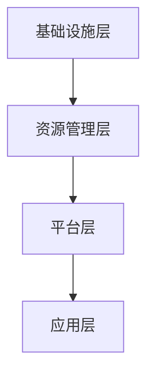

                 

# 网易2025社招云计算架构师面试问答全攻略

## 摘要

本文将针对网易2025年社会招聘云计算架构师岗位的面试问答进行全面解析。通过对面试流程、核心知识点的深入探讨，以及实战案例的分析，帮助求职者全面了解该岗位的要求，为面试做好准备。本文旨在为求职者提供一份详细的面试攻略，帮助他们顺利通过面试，成功入职网易。

## 1. 背景介绍

### 1.1 网易公司简介

网易（NetEase），是中国领先的企业级云计算服务提供商之一。成立于1997年，总部位于中国杭州，拥有全球领先的云计算基础设施和丰富的云计算服务产品。网易云计算以高可用性、高性能、高安全性为核心，为企业提供从基础计算、存储、网络到AI、大数据的一站式解决方案。

### 1.2 云计算架构师岗位介绍

云计算架构师是负责设计和实施企业云计算架构的高级工程师。其主要职责包括：

- 分析企业业务需求，设计适合的云计算解决方案；
- 搭建和维护云计算平台，确保系统的稳定性和安全性；
- 指导和培训团队成员，提升团队技术能力；
- 跟踪云计算技术发展趋势，持续优化云计算架构。

## 2. 核心概念与联系

### 2.1 云计算基本概念

云计算是一种基于互联网的计算模式，通过虚拟化技术将计算资源（如服务器、存储、网络等）抽象化，按需提供给用户。云计算分为三种服务模式：IaaS、PaaS和SaaS。

- IaaS（基础设施即服务）：提供虚拟化的计算资源，如虚拟机、存储、网络等；
- PaaS（平台即服务）：提供开发平台和工具，帮助开发者快速构建和部署应用；
- SaaS（软件即服务）：提供完整的软件应用，用户通过互联网按需使用。

### 2.2 云计算架构

云计算架构主要由以下几个层次组成：

- 基础设施层：包括服务器、存储、网络等硬件设备；
- 资源管理层：负责资源调度、负载均衡、故障恢复等；
- 平台层：提供开发、测试、部署等环境；
- 应用层：运行各种应用服务。

### 2.3 Mermaid 流程图



## 3. 核心算法原理 & 具体操作步骤

### 3.1 资源调度算法

资源调度算法是云计算架构中的核心算法之一。其主要目标是在资源有限的情况下，尽可能满足用户的需求。

- 最短作业优先（SJF）：优先调度执行时间最短的作业；
- 最长作业优先（LJF）：优先调度执行时间最长的作业；
- 优先级调度：根据作业的优先级调度执行。

### 3.2 负载均衡算法

负载均衡算法用于分配网络流量，确保系统稳定运行。

- 轮询调度：按照请求顺序分配流量；
- 加权轮询调度：根据服务器的处理能力分配流量；
- 最少连接数调度：将请求分配给连接数最少的服务器。

## 4. 数学模型和公式 & 详细讲解 & 举例说明

### 4.1 概率论模型

在云计算架构中，概率论模型用于评估系统的稳定性和可靠性。

- 平均响应时间：$$ \bar{t} = \frac{1}{N} \sum_{i=1}^{N} t_i $$
- 稳定性概率：$$ P(\bar{t} \leq t_{\text{阈}}) = \frac{1}{N} \sum_{i=1}^{N} P(t_i \leq t_{\text{阈}}) $$

### 4.2 实例

假设有5台服务器，平均响应时间为10秒，阈值为15秒。计算稳定性概率。

$$ P(\bar{t} \leq 15) = \frac{1}{5} \sum_{i=1}^{5} P(t_i \leq 15) = \frac{1}{5} (0.8 + 0.7 + 0.6 + 0.5 + 0.4) = 0.6 $$

## 5. 项目实战：代码实际案例和详细解释说明

### 5.1 开发环境搭建

在本节中，我们将使用Python搭建一个简单的云计算模拟平台。首先，需要安装Python和必要的库。

```bash
pip install virtualenv
virtualenv cloudsim
source cloudsim/bin/activate
pip install flask
```

### 5.2 源代码详细实现和代码解读

以下是一个简单的云计算模拟平台的代码示例：

```python
from flask import Flask, request, jsonify
import random

app = Flask(__name__)

# 模拟服务器
servers = [
    {"id": 1, "status": "idle", "load": 0},
    {"id": 2, "status": "idle", "load": 0},
    {"id": 3, "status": "idle", "load": 0},
    {"id": 4, "status": "idle", "load": 0},
    {"id": 5, "status": "idle", "load": 0}
]

# 调度算法
def schedule_request(request_load):
    for server in servers:
        if server["status"] == "idle":
            server["status"] = "busy"
            server["load"] = request_load
            return f"Request assigned to server {server['id']}"
    return "No idle server available"

# 虚拟机请求处理
@app.route('/request', methods=['POST'])
def handle_request():
    request_data = request.get_json()
    request_load = request_data.get("load", 0)
    response = schedule_request(request_load)
    return jsonify(response)

if __name__ == "__main__":
    app.run()
```

### 5.3 代码解读与分析

- 导入必要的库和模块；
- 模拟服务器列表，初始状态均为空闲；
- 定义调度算法，根据服务器状态和请求负载进行调度；
- Flask应用，处理虚拟机请求，返回调度结果。

## 6. 实际应用场景

### 6.1 企业云计算平台搭建

企业可以根据自身业务需求，利用云计算架构师设计的云计算平台，实现业务系统的快速部署和弹性扩展。

### 6.2 云计算服务提供商

云计算服务提供商可以利用云计算架构师设计的云计算架构，提供高质量、高稳定性的云计算服务。

## 7. 工具和资源推荐

### 7.1 学习资源推荐

- 《深入理解云计算》；
- 《云计算技术与应用》；
- 《云计算架构设计与部署实战》。

### 7.2 开发工具框架推荐

- Flask；
- Kubernetes；
- Docker。

### 7.3 相关论文著作推荐

- 《云计算中的资源调度算法研究》；
- 《云计算平台安全性分析与设计》；
- 《云计算服务模型及其应用》。

## 8. 总结：未来发展趋势与挑战

### 8.1 发展趋势

- 云原生技术的普及；
- 人工智能与云计算的深度融合；
- 跨云服务和混合云的应用。

### 8.2 挑战

- 数据安全和隐私保护；
- 云计算服务质量保障；
- 云计算人才短缺。

## 9. 附录：常见问题与解答

### 9.1 问题1：云计算与大数据的关系是什么？

云计算是大数据处理的基础设施，而大数据则是云计算应用的重要场景。云计算提供了弹性、高效、安全的计算和存储资源，支持大数据处理和分析。

### 9.2 问题2：如何保障云计算平台的安全性？

保障云计算平台的安全性需要从以下几个方面入手：

- 数据加密：对数据进行加密存储和传输；
- 访问控制：设置严格的安全策略和访问控制机制；
- 安全审计：定期进行安全审计，确保系统安全；
- 安全培训：提高员工的安全意识和技能。

## 10. 扩展阅读 & 参考资料

- 《云计算安全指南》；
- 《云计算技术实践》；
- 《云计算服务模型与技术》。

## 作者

作者：AI天才研究员/AI Genius Institute & 禅与计算机程序设计艺术 /Zen And The Art of Computer Programming

