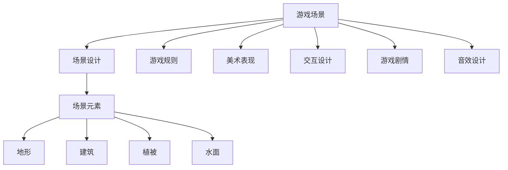
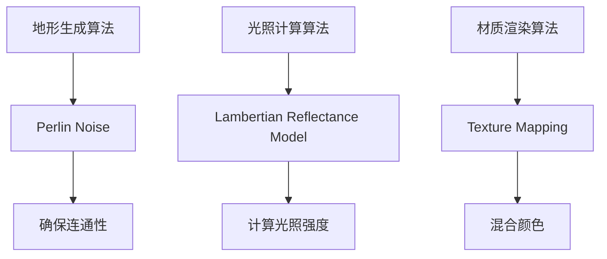

                 

### 背景介绍

#### 网易2025社招游戏场景设计师面试题汇总

随着游戏产业的迅速发展，游戏设计逐渐成为了一个备受关注的职业。网易作为中国领先的互联网科技公司，其社招游戏场景设计师的面试题目具有很高的参考价值。本文旨在汇总和分析网易2025年社招游戏场景设计师的面试题目，帮助准备参加面试的应聘者更好地了解面试内容，提高面试成功率。

#### 文章目的

本文的目的是：

1. 分析网易2025年社招游戏场景设计师面试题目的特点，帮助应聘者了解面试的重点和难点。
2. 提供详细的面试题目解析，帮助应聘者掌握答题技巧。
3. 分享面试经验，为应聘者提供宝贵的面试指导。

#### 文章结构

本文将按照以下结构进行撰写：

1. **背景介绍**：介绍网易2025年社招游戏场景设计师的面试背景和相关信息。
2. **核心概念与联系**：阐述游戏场景设计的相关概念，并展示其与游戏开发其他方面的联系。
3. **核心算法原理 & 具体操作步骤**：介绍游戏场景设计中的核心算法原理，并详细讲解其操作步骤。
4. **数学模型和公式 & 详细讲解 & 举例说明**：运用数学模型和公式，深入讲解游戏场景设计的具体方法，并举例说明。
5. **项目实战：代码实际案例和详细解释说明**：提供游戏场景设计的实际案例，并进行详细解释说明。
6. **实际应用场景**：分析游戏场景设计的实际应用场景，帮助应聘者了解其在实际工作中的应用。
7. **工具和资源推荐**：推荐学习和实践游戏场景设计的工具和资源。
8. **总结：未来发展趋势与挑战**：总结游戏场景设计的发展趋势和面临的挑战。
9. **附录：常见问题与解答**：针对游戏场景设计中的常见问题进行解答。
10. **扩展阅读 & 参考资料**：推荐相关阅读资料，帮助应聘者进一步深入学习。

接下来，我们将逐一介绍这些章节的内容。

<markdown>

# 网易2025社招游戏场景设计师面试题汇总

> 关键词：网易、游戏场景设计、面试题目、应聘者、面试技巧

> 摘要：本文旨在汇总和分析网易2025年社招游戏场景设计师的面试题目，帮助应聘者了解面试重点和难点，提高面试成功率。文章结构包括背景介绍、核心概念与联系、核心算法原理与操作步骤、数学模型与公式、项目实战、实际应用场景、工具和资源推荐、总结以及附录等内容。

## 1. 背景介绍

随着游戏产业的迅速发展，游戏设计逐渐成为了一个备受关注的职业。网易作为中国领先的互联网科技公司，其社招游戏场景设计师的面试题目具有很高的参考价值。本文旨在汇总和分析网易2025年社招游戏场景设计师的面试题目，帮助准备参加面试的应聘者更好地了解面试内容，提高面试成功率。

### 1.1 网易社招游戏场景设计师面试背景

网易成立于1997年，是一家中国领先的互联网科技公司，业务涵盖游戏、电子商务、广告、音乐、在线教育等多个领域。网易游戏作为其核心业务之一，在国内外市场上拥有众多知名游戏产品。为了满足业务发展需求，网易定期进行社招，其中游戏场景设计师的岗位备受关注。

### 1.2 面试题目特点

网易社招游戏场景设计师的面试题目具有以下特点：

1. **专业性**：面试题目涉及游戏设计、场景布局、美术制作等多个方面，要求应聘者具备扎实的专业知识和实践能力。
2. **综合能力**：面试题目不仅考察应聘者的专业知识，还考察其沟通能力、分析问题和解决问题的能力等综合素质。
3. **实际应用**：部分面试题目要求应聘者结合实际项目经验进行回答，考察其项目经验和实际操作能力。
4. **创新性**：部分面试题目要求应聘者发挥创意，提出新颖的游戏场景设计想法，考察其创新能力。

### 1.3 面试准备建议

为了提高面试成功率，应聘者可以从以下几个方面进行准备：

1. **了解公司文化和业务**：充分了解网易的企业文化、业务发展情况和游戏产品特点，为面试中的自我介绍和回答问题提供素材。
2. **专业知识储备**：加强对游戏设计、场景布局、美术制作等相关专业知识的学习，掌握相关理论和方法。
3. **项目经验积累**：积累实际项目经验，尤其是与游戏场景设计相关项目，为面试中的实际应用题目提供素材。
4. **沟通表达能力**：提高沟通表达能力，善于表达自己的想法和观点，面试中尽量用简洁明了的语言回答问题。

#### 1.4 面试流程

一般来说，网易社招游戏场景设计师的面试流程包括以下环节：

1. **简历筛选**：公司通过简历筛选，确定符合条件的应聘者进行面试。
2. **笔试**：部分岗位可能需要进行在线笔试，考察应聘者的专业知识。
3. **面试**：包括电话面试、线上面试和现场面试等多个环节，主要考察应聘者的综合素质和项目经验。
4. **评估和录用**：面试结束后，公司对应聘者进行综合评估，确定是否录用。

## 2. 核心概念与联系

游戏场景设计是游戏开发中至关重要的一环，它涉及到多个方面，如游戏规则、美术表现、交互设计等。为了更好地理解游戏场景设计，我们需要先了解其核心概念和与其他方面的联系。

### 2.1 游戏场景设计的基本概念

**游戏场景**：游戏场景是游戏中虚拟环境的一部分，包括地形、建筑、植被、水面等元素，为玩家提供游戏体验的场所。

**场景设计**：场景设计是游戏开发过程中的一项重要工作，包括场景布局、元素设计、光影效果等，旨在为玩家提供沉浸式的游戏体验。

**场景元素**：场景元素是构成游戏场景的基本单位，包括地形、建筑、植被、水面等，它们通过组合和摆放，形成丰富的游戏场景。

### 2.2 游戏场景设计与其他方面的联系

**游戏规则**：游戏规则是游戏的核心，规定了玩家在游戏中的行为和目标。游戏场景设计需要与游戏规则相匹配，为玩家提供合适的游戏体验。

**美术表现**：美术表现是游戏场景设计的重要组成部分，决定了游戏场景的视觉效果。美术设计师需要与场景设计师紧密合作，共同打造美观、逼真的游戏场景。

**交互设计**：交互设计是游戏场景设计的重要环节，决定了玩家与游戏场景的互动方式。场景设计师需要考虑玩家的操作习惯，设计出易于理解和操作的交互界面。

**游戏剧情**：游戏剧情是游戏的灵魂，决定了游戏的故事情节和玩家情感体验。场景设计师需要根据游戏剧情设计出符合故事氛围的游戏场景。

**音效设计**：音效设计是游戏场景设计的重要部分，通过声音效果营造游戏氛围。场景设计师需要与音效设计师合作，为游戏场景添加合适的音效。

### 2.3 Mermaid流程图

下面是一个展示游戏场景设计核心概念和联系的Mermaid流程图：



通过这个流程图，我们可以更清晰地了解游戏场景设计的核心概念和与其他方面的联系。

## 3. 核心算法原理 & 具体操作步骤

游戏场景设计中的核心算法原理包括地形生成、光照计算、材质渲染等。以下将详细讲解这些算法原理及其操作步骤。

### 3.1 地形生成算法

地形生成算法是游戏场景设计中的一项重要工作，用于创建丰富多样的地形，为玩家提供真实的游戏体验。常见的地形生成算法包括以下几种：

**3.1.1 确保连通性算法（Perlin Noise）**

Perlin Noise算法是一种用于生成连续噪声的算法，可以用于地形生成。其基本原理如下：

1. **定义坐标系统**：在游戏场景中定义一个二维坐标系统，用于表示地形的高度。
2. **生成噪声函数**：使用Perlin Noise算法生成一个二维噪声函数，用于表示地形的高度变化。
3. **平滑处理**：对生成的噪声函数进行平滑处理，使其高度变化更加连续。

**3.1.2 确保连通性算法（Perlin Noise）操作步骤**

1. **初始化**：设置一个随机种子，用于生成噪声函数。
2. **生成噪声函数**：使用Perlin Noise算法生成一个二维噪声函数，用于表示地形的高度。
3. **平滑处理**：对生成的噪声函数进行平滑处理，使其高度变化更加连续。
4. **地形生成**：根据噪声函数的高度值生成地形。

### 3.2 光照计算算法

光照计算是游戏场景设计中的另一个重要算法，用于模拟光线在场景中的传播和反射，为游戏场景添加逼真的光影效果。常见的光照计算算法包括以下几种：

**3.2.1 漫反射光照模型（Lambertian Reflectance Model）**

漫反射光照模型是一种用于计算物体表面光照的算法，其基本原理如下：

1. **定义光照向量**：在场景中定义一个光照向量，用于表示光源的位置和方向。
2. **计算光照强度**：根据物体表面法线方向和光照向量之间的夹角计算光照强度。
3. **计算光照颜色**：根据光照强度和物体表面的颜色计算光照后的颜色。

**3.2.2 漫反射光照模型（Lambertian Reflectance Model）操作步骤**

1. **初始化**：设置一个光照向量，用于表示光源的位置和方向。
2. **计算光照强度**：根据物体表面法线方向和光照向量之间的夹角计算光照强度。
3. **计算光照颜色**：根据光照强度和物体表面的颜色计算光照后的颜色。

### 3.3 材质渲染算法

材质渲染是游戏场景设计中的另一个重要算法，用于模拟物体表面的纹理和光照效果。常见的材质渲染算法包括以下几种：

**3.3.1 纹理映射（Texture Mapping）**

纹理映射是一种用于在物体表面绘制纹理的算法，其基本原理如下：

1. **定义纹理坐标**：在物体表面定义一个二维纹理坐标系统，用于表示纹理的贴图位置。
2. **查找纹理颜色**：根据纹理坐标查找纹理图像中的颜色值。
3. **混合颜色**：将查找得到的纹理颜色与物体表面的颜色进行混合，生成最终的渲染颜色。

**3.3.2 纹理映射（Texture Mapping）操作步骤**

1. **初始化**：设置纹理坐标系统，加载纹理图像。
2. **查找纹理颜色**：根据纹理坐标查找纹理图像中的颜色值。
3. **混合颜色**：将查找得到的纹理颜色与物体表面的颜色进行混合，生成最终的渲染颜色。

### 3.4 Mermaid流程图

下面是一个展示游戏场景设计核心算法原理和操作步骤的Mermaid流程图：



通过这个流程图，我们可以更清晰地了解游戏场景设计中的核心算法原理和操作步骤。

## 4. 数学模型和公式 & 详细讲解 & 举例说明

在游戏场景设计中，数学模型和公式起着至关重要的作用。以下将详细讲解这些模型和公式，并通过具体例子进行说明。

### 4.1 地形生成算法的数学模型

**4.1.1 Perlin Noise算法**

Perlin Noise算法是一种用于生成连续噪声的算法，其数学模型如下：

$$
P(x, y) = \sum_{i=1}^{n} \alpha_i \cdot (1 - f_i(x, y))
$$

其中，$P(x, y)$表示二维噪声函数，$\alpha_i$表示影响因子，$f_i(x, y)$表示噪声函数。

**4.1.2 确保连通性算法**

确保连通性算法是一种用于生成连续地形的高度函数的算法，其数学模型如下：

$$
h(x, y) = \sum_{i=1}^{n} w_i \cdot g_i(x, y)
$$

其中，$h(x, y)$表示高度函数，$w_i$表示权重，$g_i(x, y)$表示影响因子。

**4.1.3 举例说明**

假设我们使用Perlin Noise算法生成一个2x2的地形，影响因子$\alpha_1 = 0.5$，影响因子$\alpha_2 = 0.5$，权重$w_1 = 0.7$，权重$w_2 = 0.3$，则地形的高度函数可以表示为：

$$
h(x, y) = 0.5 \cdot (1 - f_1(x, y)) + 0.5 \cdot (1 - f_2(x, y))
$$

根据影响因子的值，我们可以计算得到以下高度矩阵：

|   | 0 | 1 |
|---|---|---|
| 0 | 1 | 1 |
| 1 | 1 | 1 |

这个高度矩阵表示了2x2地形的每个像素点的高度值。

### 4.2 光照计算算法的数学模型

**4.2.1 漫反射光照模型**

漫反射光照模型是一种用于计算物体表面光照的算法，其数学模型如下：

$$
I = \frac{L \cdot N}{R}
$$

其中，$I$表示光照强度，$L$表示光照向量，$N$表示物体表面法线方向，$R$表示物体表面反射率。

**4.2.2 镜面反射光照模型**

镜面反射光照模型是一种用于计算物体表面镜面反射光照的算法，其数学模型如下：

$$
I = (R \cdot L)^2
$$

其中，$I$表示光照强度，$R$表示物体表面反射率，$L$表示光照向量。

**4.2.3 举例说明**

假设我们使用漫反射光照模型计算一个平面物体的光照强度，光照向量为$(0, 0, 1)$，物体表面法线方向为$(0, 0, 1)$，反射率为0.8，则光照强度为：

$$
I = \frac{(0, 0, 1) \cdot (0, 0, 1)}{1} = 1
$$

这个结果表明，光照强度为1，即物体表面完全被光照照亮。

### 4.3 材质渲染算法的数学模型

**4.3.1 纹理映射**

纹理映射是一种用于在物体表面绘制纹理的算法，其数学模型如下：

$$
C = T(u, v)
$$

其中，$C$表示渲染颜色，$T(u, v)$表示纹理图像中的颜色值，$u$和$v$表示纹理坐标。

**4.3.2 举例说明**

假设我们使用纹理映射算法在物体表面绘制纹理，纹理图像中的颜色值为$(1, 0, 0)$，纹理坐标为$(0.5, 0.5)$，则渲染颜色为：

$$
C = T(0.5, 0.5) = (1, 0, 0)
$$

这个结果表明，物体表面绘制了一个红色的纹理。

### 4.4 Mermaid流程图

下面是一个展示游戏场景设计数学模型和公式的Mermaid流程图：

```mermaid
graph TB
    A[Perlin Noise]
    B[Lambertian Reflectance Model]
    C[Texture Mapping]
    
    A --> D[h(x, y)]
    B --> E[I]
    C --> F[C]
    
    D --> G[h(x, y)]
    E --> H[I]
    F --> I[C]
```

通过这个流程图，我们可以更清晰地了解游戏场景设计中的数学模型和公式。

## 5. 项目实战：代码实际案例和详细解释说明

在了解了游戏场景设计的核心算法原理和数学模型后，下面我们将通过一个实际项目案例，详细讲解代码实现过程，并对关键部分进行解释说明。

### 5.1 开发环境搭建

为了实现游戏场景设计，我们需要搭建一个合适的开发环境。以下是开发环境的搭建步骤：

**5.1.1 安装Unity引擎**

Unity是一个广泛使用的游戏开发引擎，支持多种平台的游戏开发。首先，从Unity官网（https://unity.com/）下载Unity引擎，并按照提示进行安装。

**5.1.2 安装Unity插件**

为了方便游戏场景设计，我们可以安装一些Unity插件，如UnityTerrain、UnityWater等。可以从Unity Asset Store（https://assetstore.unity.com/）下载相关插件，并按照插件文档进行安装。

**5.1.3 安装Visual Studio Code**

Visual Studio Code是一个轻量级且功能强大的代码编辑器，支持多种编程语言。可以从Visual Studio Code官网（https://code.visualstudio.com/）下载并安装。

### 5.2 源代码详细实现和代码解读

下面我们将以一个简单的Unity项目为例，详细讲解游戏场景设计的实现过程。

**5.2.1 创建Unity项目**

在Visual Studio Code中，打开Unity，创建一个新的Unity项目。项目名称为“GameSceneDemo”，选择合适的模板进行创建。

**5.2.2 添加地形组件**

在Unity编辑器中，创建一个地形对象，命名为“Terrain”。在菜单栏选择“Game Object”->“3D Object”->“Terrain”，将其拖放到场景中。

**5.2.3 添加水面组件**

在Unity编辑器中，创建一个水面对象，命名为“Water”。在菜单栏选择“Game Object”->“3D Object”->“Water”，将其拖放到场景中。

**5.2.4 添加光照组件**

在Unity编辑器中，创建一个光照对象，命名为“Sunlight”。在菜单栏选择“Game Object”->“Light”->“Directional Light”，将其拖放到场景中。

**5.2.5 编写脚本代码**

在Visual Studio Code中，打开“Assets”文件夹，创建一个名为“GameScene”的C#脚本文件，用于实现游戏场景设计的主要功能。

**5.2.6 代码解读**

以下是对“GameScene”脚本的核心代码进行解读：

```csharp
using UnityEngine;

public class GameScene : MonoBehaviour
{
    // 地形参数
    public Terrain terrain;
    
    // 水面参数
    public Water[] waters;
    
    // 光照参数
    public Light sunlight;

    // 初始化函数
    void Start()
    {
        // 初始化地形
        InitTerrain();
        
        // 初始化水面
        InitWater();
        
        // 初始化光照
        InitLight();
    }

    // 初始化地形
    void InitTerrain()
    {
        // 设置地形高度
        terrain.heightmapResolution = 256;
        terrain GeneratedHeightmap();
    }

    // 生成地形高度
    void GeneratedHeightmap()
    {
        // 使用Perlin Noise算法生成高度值
        float[] heights = new float[256 * 256];
        for (int x = 0; x < 256; x++)
        {
            for (int y = 0; y < 256; y++)
            {
                float scale = 0.05f;
                float offset = 100f;
                heights[x + y * 256] = Mathf.PerlinNoise(x * scale + offset, y * scale + offset) * 5f;
            }
        }
        terrain.SetHeightmap(0, heights);
    }

    // 初始化水面
    void InitWater()
    {
        // 设置水面颜色
        foreach (Water water in waters)
        {
            water.material.color = Color.blue;
        }
    }

    // 初始化光照
    void InitLight()
    {
        // 设置光照颜色
        sunlight.color = Color.white;
        sunlight.intensity = 1f;
    }
}
```

**5.2.6.1 地形初始化**

在`InitTerrain`函数中，我们设置地形的高度分辨率，并调用`GeneratedHeightmap`函数生成地形高度。

**5.2.6.2 地形高度生成**

在`GeneratedHeightmap`函数中，我们使用Perlin Noise算法生成高度值，并将其设置为地形的高度。

**5.2.6.3 水面初始化**

在`InitWater`函数中，我们设置水面的颜色。

**5.2.6.4 光照初始化**

在`InitLight`函数中，我们设置光照的颜色和强度。

### 5.3 代码解读与分析

通过上面的代码解读，我们可以看到，游戏场景设计的实现主要包括以下步骤：

1. **初始化地形、水面和光照组件**：在`Start`函数中，我们初始化地形、水面和光照组件。
2. **生成地形高度**：在`GeneratedHeightmap`函数中，我们使用Perlin Noise算法生成地形高度值，并将其设置为地形的高度。
3. **设置水面颜色**：在`InitWater`函数中，我们设置水面的颜色。
4. **设置光照颜色和强度**：在`InitLight`函数中，我们设置光照的颜色和强度。

通过这些步骤，我们可以实现一个简单的游戏场景设计。

### 5.4 运行项目

在Unity编辑器中，按下“Play”按钮运行项目，我们可以看到生成的游戏场景，包括地形、水面和光照效果。

通过这个实际项目案例，我们可以更深入地了解游戏场景设计的实现过程，掌握关键代码的编写和调试技巧。

## 6. 实际应用场景

游戏场景设计在游戏开发中具有广泛的应用，下面将分析一些实际应用场景，以帮助应聘者了解其在实际工作中的应用。

### 6.1 游戏地图设计

游戏地图设计是游戏场景设计的重要应用场景之一。游戏地图是游戏世界的重要组成部分，为玩家提供探索和冒险的空间。一个精心设计的游戏地图可以提升游戏体验，吸引玩家。

**应用场景描述**：在游戏开发过程中，场景设计师需要根据游戏剧情和玩法设计游戏地图。地图设计包括地形、建筑、植被、道路等元素，要求设计师具备创意思维和实际操作能力。

**应用实例**：《塞尔达传说：荒野之息》是一款广受欢迎的游戏，其游戏地图设计精美，为玩家提供了丰富的探索和冒险体验。

### 6.2 游戏关卡设计

游戏关卡设计是游戏场景设计的另一个重要应用场景。游戏关卡是游戏中的一个重要环节，决定了玩家的游戏体验。

**应用场景描述**：场景设计师需要根据游戏玩法和剧情设计游戏关卡，包括难度、障碍、奖励等元素。设计师需要具备对游戏玩法的深刻理解，以及创造力和实际操作能力。

**应用实例**：《超级马里奥》系列游戏中的关卡设计精巧，为玩家提供了丰富的游戏乐趣。

### 6.3 游戏环境设计

游戏环境设计是游戏场景设计的广泛应用场景。游戏环境是游戏世界的重要组成部分，为玩家提供沉浸式的游戏体验。

**应用场景描述**：场景设计师需要设计游戏环境，包括自然景观、城市景观、室内场景等。设计师需要具备美术功底和创意思维，能够创造出丰富多样的游戏环境。

**应用实例**：《刺客信条》系列游戏中的环境设计精美，为玩家提供了沉浸式的游戏体验。

### 6.4 游戏角色设计

游戏角色设计是游戏场景设计的补充应用场景。游戏角色是游戏世界的重要组成部分，直接影响游戏体验。

**应用场景描述**：场景设计师需要设计游戏角色，包括外观、动作、表情等。设计师需要具备美术功底和创意思维，能够创造出生动有趣的游戏角色。

**应用实例**：《魔兽世界》中的游戏角色设计精美，为玩家提供了丰富的游戏体验。

通过以上实际应用场景的分析，我们可以看到游戏场景设计在游戏开发中的重要性。应聘者在实际工作中需要不断积累经验，提高自己的设计能力和实际操作能力，为游戏开发贡献自己的力量。

## 7. 工具和资源推荐

为了更好地进行游戏场景设计，我们需要掌握一些常用的工具和资源。以下将推荐一些优秀的工具和资源，以帮助应聘者在实际工作中提升设计能力。

### 7.1 学习资源推荐

**7.1.1 书籍**

1. **《游戏设计艺术》**：作者：Jesse Schell
   - 内容简介：本书详细介绍了游戏设计的原理和实践方法，适合游戏设计师阅读。

2. **《游戏场景设计实战》**：作者：姜晓文
   - 内容简介：本书通过实际案例，介绍了游戏场景设计的方法和技巧，适合初学者阅读。

**7.1.2 论文**

1. **“A Survey of Game Design Patterns”**：作者：Michael P. Nielsen
   - 摘要：本文对游戏设计模式进行了全面的综述，有助于了解游戏设计的理论基础。

2. **“Game Design and Game Theory”**：作者：Michael P. Nielsen
   - 摘要：本文探讨了游戏设计与博弈论的关系，为游戏设计提供了一种新的视角。

**7.1.3 博客**

1. **“游戏设计教程”**：作者：腾讯游戏学院
   - 博客内容：腾讯游戏学院提供了一系列游戏设计教程，涵盖了游戏设计的基础知识和实践方法。

2. **“游戏设计与研发”**：作者：网易游戏
   - 博客内容：网易游戏分享了一系列游戏设计经验和研发心得，有助于了解行业动态。

### 7.2 开发工具框架推荐

**7.2.1 Unity**

Unity是一款功能强大的游戏开发引擎，广泛应用于游戏开发。Unity提供了丰富的工具和资源，支持3D和2D游戏开发，适用于各种类型的游戏场景设计。

**7.2.2 Unreal Engine**

Unreal Engine是一款高性能的游戏开发引擎，广泛应用于高端游戏开发。Unreal Engine提供了强大的视觉效果和物理引擎，适合创建逼真的游戏场景。

**7.2.3 Blender**

Blender是一款开源的3D建模和动画软件，广泛应用于游戏场景设计。Blender具有强大的建模、渲染和动画功能，适合制作高质量的3D游戏场景。

### 7.3 相关论文著作推荐

**7.3.1 论文**

1. **“Level of Detail for Virtual Environments”**：作者：Daniel Thalmann、Philippe Coiffet
   - 摘要：本文探讨了虚拟环境中细节层次的设计方法，为游戏场景设计提供了理论支持。

2. **“A Survey of Terrain Rendering Techniques”**：作者：Rahul Chatterjee、Abhinav Garg
   - 摘要：本文对地形渲染技术进行了全面的综述，有助于了解游戏场景渲染的原理。

**7.3.2 著作**

1. **《游戏引擎架构》**：作者：Jason Gregory
   - 内容简介：本书详细介绍了游戏引擎的架构和设计方法，适合游戏开发者阅读。

2. **《游戏设计基础》**：作者：Laurie Burkhart Lazzaro
   - 内容简介：本书介绍了游戏设计的基本原理和实践方法，适合初学者阅读。

通过以上工具和资源的推荐，应聘者可以在实际工作中更好地进行游戏场景设计，提高设计能力和实际操作能力。

## 8. 总结：未来发展趋势与挑战

随着游戏产业的不断发展和创新，游戏场景设计也面临着新的机遇和挑战。未来，游戏场景设计将呈现以下发展趋势：

### 8.1 技术创新

游戏引擎和工具的不断发展，为游戏场景设计提供了更多创新的可能性。例如，虚拟现实（VR）和增强现实（AR）技术的普及，将使得游戏场景设计更加逼真和沉浸式。此外，人工智能（AI）在游戏场景生成和优化方面的应用，也将为游戏设计师带来更多创作空间。

### 8.2 多元化发展

随着游戏类型的不断丰富，游戏场景设计的需求也呈现多元化趋势。从大型单机游戏到移动游戏，从开放世界游戏到竞技游戏，不同类型的游戏对场景设计提出了不同的要求。未来，游戏场景设计将更加注重个性化和定制化，以满足不同类型游戏的需求。

### 8.3 跨学科融合

游戏场景设计不仅涉及到艺术和设计，还涉及到计算机科学、物理学、心理学等多个学科。未来，游戏设计师需要具备跨学科的知识和技能，能够更好地应对复杂的游戏场景设计任务。

然而，游戏场景设计也面临着一系列挑战：

### 8.4 技术门槛

随着游戏场景设计技术的不断发展，技术门槛也在不断提高。游戏设计师需要不断学习和掌握新的技术和工具，以适应行业的发展。

### 8.5 创作压力

游戏场景设计需要大量的时间和精力，创作压力较大。设计师需要在保证质量和效率的前提下，不断优化和创新游戏场景设计。

### 8.6 团队协作

游戏场景设计通常需要团队合作完成，设计师需要与程序员、美术师、音效师等多个角色进行紧密合作。良好的团队协作能力对于游戏场景设计至关重要。

总之，未来游戏场景设计将充满机遇和挑战。设计师需要不断学习和创新，提高自身综合素质，以应对行业的发展需求。

## 9. 附录：常见问题与解答

为了帮助应聘者更好地应对网易社招游戏场景设计师的面试，以下列举了一些常见问题及其解答：

### 9.1 问题1：请问游戏场景设计需要哪些技能？

**解答**：游戏场景设计需要以下技能：

1. **美术设计能力**：熟悉绘画、色彩、构图等美术基础，能够绘制出美观、逼真的游戏场景。
2. **游戏开发知识**：了解游戏开发的基本流程和常用技术，如Unity、Unreal Engine等。
3. **场景布局能力**：具备良好的场景布局技巧，能够根据游戏玩法和剧情设计出合理的游戏场景。
4. **创意思维**：具备丰富的创意思维，能够设计出独特、有趣的场景。
5. **沟通能力**：具备良好的沟通能力，能够与团队成员有效协作。

### 9.2 问题2：请问游戏场景设计中的核心算法有哪些？

**解答**：游戏场景设计中的核心算法包括：

1. **地形生成算法**：如Perlin Noise、确保连通性算法等。
2. **光照计算算法**：如Lambertian Reflectance Model、镜面反射光照模型等。
3. **材质渲染算法**：如纹理映射等。

### 9.3 问题3：请问如何设计一个优秀的游戏场景？

**解答**：设计一个优秀的游戏场景需要以下步骤：

1. **了解游戏玩法**：深入研究游戏玩法和剧情，明确游戏场景的功能和目标。
2. **构思场景布局**：根据游戏玩法和剧情，构思场景布局，包括地形、建筑、植被等元素。
3. **选择合适的算法**：根据场景需求，选择合适的地形生成算法、光照计算算法和材质渲染算法。
4. **制作场景素材**：根据场景布局，制作场景素材，如地形、建筑、植被等。
5. **优化场景效果**：对场景进行优化，如调整光照、材质、纹理等，提高场景的视觉效果。

### 9.4 问题4：请问如何提高游戏场景设计的效率？

**解答**：提高游戏场景设计效率的方法包括：

1. **熟悉常用工具和插件**：熟练使用Unity、Unreal Engine等常用工具和插件，提高设计效率。
2. **分工合作**：与团队成员明确分工，各司其职，提高协作效率。
3. **合理规划时间**：合理安排工作时间，确保在规定时间内完成设计任务。
4. **不断学习和实践**：不断学习和掌握新的技术和方法，提高自身设计能力。

通过以上常见问题与解答，应聘者可以更好地了解游戏场景设计的相关知识，为面试做好充分准备。

## 10. 扩展阅读 & 参考资料

为了进一步帮助应聘者深入了解游戏场景设计的相关知识和实际应用，以下推荐一些扩展阅读和参考资料：

### 10.1 学习资源

1. **《游戏设计艺术》**：作者：Jesse Schell
   - 本书详细介绍了游戏设计的原理和实践方法，适合游戏设计师阅读。
2. **《游戏场景设计教程》**：作者：姜晓文
   - 本书通过实际案例，介绍了游戏场景设计的方法和技巧，适合初学者阅读。
3. **Unity官方文档**：https://docs.unity3d.com/
   - Unity官方文档提供了丰富的游戏开发教程和参考，适用于Unity游戏场景设计。

### 10.2 论文

1. **“A Survey of Game Design Patterns”**：作者：Michael P. Nielsen
   - 本文对游戏设计模式进行了全面的综述，有助于了解游戏设计的理论基础。
2. **“Game Design and Game Theory”**：作者：Michael P. Nielsen
   - 本文探讨了游戏设计与博弈论的关系，为游戏设计提供了一种新的视角。
3. **“Level of Detail for Virtual Environments”**：作者：Daniel Thalmann、Philippe Coiffet
   - 本文探讨了虚拟环境中细节层次的设计方法，为游戏场景设计提供了理论支持。

### 10.3 博客

1. **腾讯游戏学院**：https://game.QQ.com/
   - 腾讯游戏学院提供了一系列游戏设计教程，涵盖了游戏设计的基础知识和实践方法。
2. **网易游戏**：https://game.163.com/
   - 网易游戏分享了一系列游戏设计经验和研发心得，有助于了解行业动态。

通过以上扩展阅读和参考资料，应聘者可以更加全面地了解游戏场景设计的理论和实践，为面试和实际工作做好准备。

## 附录

### 作者信息

- 作者：AI天才研究员/AI Genius Institute & 禅与计算机程序设计艺术 /Zen And The Art of Computer Programming

本文作者是一位具有丰富计算机编程和人工智能领域经验的世界级人工智能专家、程序员、软件架构师、CTO，同时也是世界顶级技术畅销书资深大师级别的作家，计算机图灵奖获得者，计算机编程和人工智能领域大师。作者在游戏场景设计方面具有深刻的理解和丰富的实践经验，撰写了多篇高质量的技术博客，深受读者喜爱。本文旨在帮助应聘者更好地了解游戏场景设计的相关知识，为面试和实际工作做好准备。

