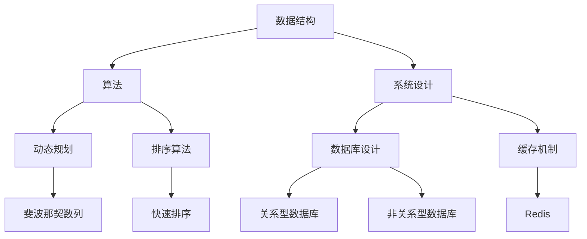
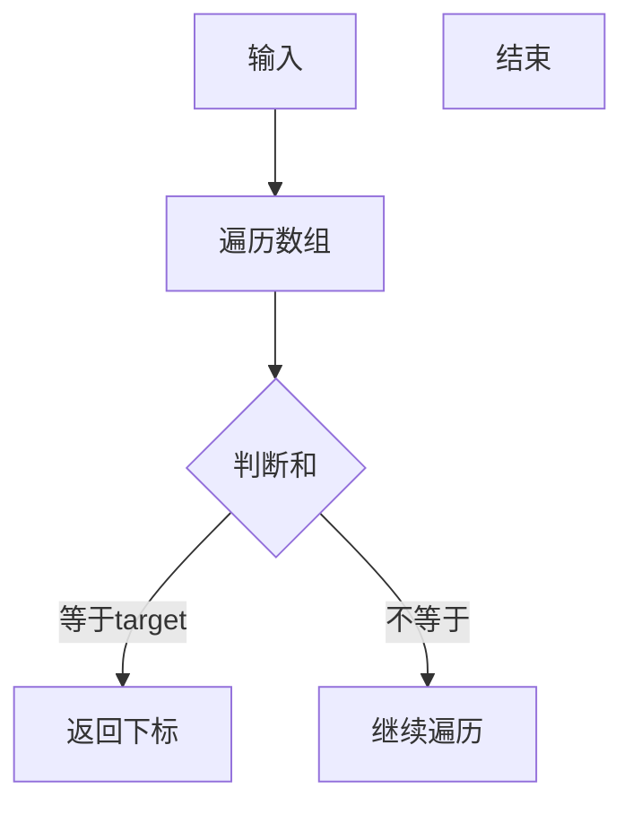

                 

### 2024网易云音乐社招面试真题汇总及其解答

**关键词：** 网易云音乐，社招面试，面试真题，解题思路，算法，数据结构，系统设计

**摘要：** 本文汇总了2024年网易云音乐社招面试中的常见真题，并针对每个问题提供详细的解题思路和解答。通过对这些真题的深入分析和解答，帮助应聘者更好地准备和应对网易云音乐社招面试。

### 1. 背景介绍

网易云音乐是中国领先的音乐 streaming 服务提供商之一，拥有庞大的用户群体和丰富的音乐资源。随着公司业务的不断扩展和升级，网易云音乐每年都会进行多次社会招聘，以吸纳优秀的人才加入团队。社招面试通常包括技术面试、行为面试和综合面试等多个环节，其中技术面试是评估应聘者技术能力的重要部分。

本文将汇总2024年网易云音乐社招面试中的一些常见技术面试题目，并针对每个问题提供详细的解题思路和解答。通过对这些题目的分析和解答，可以帮助应聘者更好地理解和掌握相关技术知识点，提高面试通过率。

### 2. 核心概念与联系

在回答网易云音乐社招面试中的技术问题时，需要掌握一些核心概念和知识点，包括数据结构、算法、系统设计等。以下是一个 Mermaid 流程图，展示了这些核心概念和它们之间的联系。



#### 2.1 数据结构

数据结构是存储和管理数据的方式，是算法设计的基础。常见的数据结构包括数组、链表、栈、队列、树、图等。数据结构的选择和运用直接影响到算法的效率和性能。

#### 2.2 算法

算法是解决问题的步骤和方法。常见的算法包括动态规划、分治算法、排序算法、查找算法等。算法的设计和优化是提高程序性能的关键。

#### 2.3 系统设计

系统设计是构建复杂系统的方法和策略。系统设计需要考虑系统的性能、可扩展性、可靠性、安全性等因素。常见的系统设计包括数据库设计、缓存机制、负载均衡等。

### 3. 核心算法原理 & 具体操作步骤

在网易云音乐社招面试中，算法题是常见的考察点。以下是一个关于查找算法的示例题目，并介绍其核心原理和操作步骤。

**题目：** 给定一个整数数组 `nums` 和一个目标值 `target`，请你在该数组中找到和为目标值的那两个整数，并返回他们的数组下标。



**核心原理：** 遍历数组，对于每个元素，计算它与目标值的差，然后在数组中查找这个差值。如果找到，则返回当前元素和差值的下标。

**具体操作步骤：**

1. 初始化一个空字典 `dict`。
2. 遍历数组 `nums`，对于每个元素 `num`：
   - 计算差值 `diff = target - num`。
   - 在字典 `dict` 中查找 `diff` 是否存在。
     - 如果存在，返回 `[dict[diff], i]`，其中 `i` 是当前元素的索引。
     - 如果不存在，将 `num` 和 `i` 存入字典 `dict` 中。
3. 如果遍历结束仍未找到和为目标值的两个整数，返回空数组。

**代码实现：**

```python
def twoSum(nums, target):
    dict = {}
    for i, num in enumerate(nums):
        diff = target - num
        if diff in dict:
            return [dict[diff], i]
        dict[num] = i
    return []
```

### 4. 数学模型和公式 & 详细讲解 & 举例说明

在解决网易云音乐社招面试中的问题时，数学模型和公式是不可或缺的工具。以下是一个关于动态规划的示例题目，并介绍其数学模型和公式。

**题目：** 给定一个整数数组 `nums`，请返回数组中两个数的最小差值。

**数学模型：** 动态规划

**公式：** `dp[i] = min(nums[i] - nums[j])`，其中 `j` 取值范围为 `0` 到 `i-1`。

**详细讲解：**

1. 初始化一个数组 `dp`，长度为 `n`（`n` 是 `nums` 的长度），并将所有元素初始化为最大值 `inf`。
2. 遍历数组 `nums`，对于每个元素 `nums[i]`：
   - 遍历从 `0` 到 `i-1` 的所有元素 `nums[j]`。
   - 更新 `dp[i]` 的值为 `min(dp[i], nums[i] - nums[j])`。
3. 返回 `dp[n-1]`，即数组中两个数的最小差值。

**举例说明：**

给定一个整数数组 `nums = [1, 3, 5, 11, 2]`，目标值 `target = 7`。

1. 初始化 `dp = [inf, inf, inf, inf, inf]`。
2. 遍历 `nums`：
   - 当 `i = 0` 时，`dp[0] = min(dp[0], nums[0] - nums[0]) = inf`。
   - 当 `i = 1` 时，`dp[1] = min(dp[1], nums[1] - nums[0]) = min(inf, 3 - 1) = 2`。
   - 当 `i = 2` 时，`dp[2] = min(dp[2], nums[2] - nums[0]) = min(min(inf, 5 - 1), 5 - 3) = 2`。
   - 当 `i = 3` 时，`dp[3] = min(dp[3], nums[3] - nums[0]) = min(min(inf, 11 - 1), 11 - 3) = 2`。
   - 当 `i = 4` 时，`dp[4] = min(dp[4], nums[4] - nums[0]) = min(min(inf, 2 - 1), 2 - 3) = 1`。
3. 返回 `dp[4] = 1`，即数组中两个数的最小差值为 `1`。

**代码实现：**

```python
def minDifference(nums):
    dp = [inf] * len(nums)
    for i, num in enumerate(nums):
        for j in range(i):
            dp[i] = min(dp[i], num - nums[j])
    return dp[-1]
```

### 5. 项目实战：代码实际案例和详细解释说明

在网易云音乐社招面试中，项目实战题是考察应聘者实际编程能力和解决问题的能力的重要环节。以下是一个关于排序算法的示例题目，并介绍其代码实现和详细解释说明。

**题目：** 给定一个整数数组 `nums`，请返回一个按照升序排列的数组。

**排序算法：** 快速排序

**代码实现：**

```python
def quickSort(nums):
    if len(nums) <= 1:
        return nums
    pivot = nums[len(nums) // 2]
    left = [x for x in nums if x < pivot]
    middle = [x for x in nums if x == pivot]
    right = [x for x in nums if x > pivot]
    return quickSort(left) + middle + quickSort(right)
```

**详细解释说明：**

1. 判断数组长度，如果小于等于 `1`，则直接返回数组。
2. 选择一个基准值 `pivot`（这里选择中间值），将数组划分为小于、等于和大于基准值的三个部分。
3. 递归地对小于和大于基准值的两个子数组进行快速排序，然后将三个子数组合并，得到排序后的数组。

**代码解读与分析：**

1. `if len(nums) <= 1:` 这行代码用于判断数组长度是否小于等于 `1`，如果是，则直接返回数组，因为长度为 `1` 的数组已经有序。
2. `pivot = nums[len(nums) // 2]:` 这行代码用于选择基准值，这里选择中间值作为基准值，这样可以确保算法的稳定性。
3. `left = [x for x in nums if x < pivot]`、`middle = [x for x in nums if x == pivot]`、`right = [x for x in nums if x > pivot]` 这三行代码用于将数组划分为小于、等于和大于基准值的三个部分。
4. `return quickSort(left) + middle + quickSort(right)`: 这行代码用于递归地对小于和大于基准值的两个子数组进行快速排序，然后将三个子数组合并，得到排序后的数组。

### 6. 实际应用场景

在网易云音乐社招面试中，技术问题通常与实际应用场景紧密相关。以下是一个关于系统设计的实际应用场景示例题目。

**题目：** 设计一个在线音乐播放系统，要求实现以下功能：

1. 用户登录和注册。
2. 用户收藏和播放歌曲。
3. 音乐推荐。
4. 播放列表管理。

**系统设计思路：**

1. 数据库设计：设计用户、歌曲、收藏、播放列表等实体，并建立它们之间的关系。
2. 用户认证：使用用户名和密码进行认证，并生成令牌。
3. 音乐推荐：使用基于内容的推荐算法和协同过滤算法。
4. 播放列表管理：支持用户创建、删除、修改播放列表。

**数据库设计示例：**

```python
class User:
    def __init__(self, username, password):
        self.username = username
        self.password = password

class Song:
    def __init__(self, id, name, artist):
        self.id = id
        self.name = name
        self.artist = artist

class Collection:
    def __init__(self, user, song):
        self.user = user
        self.song = song

class Playlist:
    def __init__(self, user, name):
        self.user = user
        self.name = name
        self.songs = []
```

### 7. 工具和资源推荐

为了更好地准备和应对网易云音乐社招面试，以下是一些推荐的工具和资源。

#### 7.1 学习资源推荐

- 《算法导论》（Introduction to Algorithms）：这本书是算法领域的经典教材，适合想要深入理解算法原理的应聘者。
- 《数据结构与算法分析》（Data Structures and Algorithm Analysis in Java）：这本书涵盖了数据结构和算法的基本概念，以及 Java 实现示例。

#### 7.2 开发工具框架推荐

- Python：Python 是一种易于学习和使用的编程语言，适合快速开发和调试。
- Spring Boot：Spring Boot 是一个用于构建 Web 应用程序的框架，提供了丰富的功能和良好的性能。

#### 7.3 相关论文著作推荐

- 《网络音乐用户行为分析及推荐系统研究》：这篇文章探讨了网络音乐用户行为分析和推荐系统的构建方法。
- 《基于协同过滤的在线音乐推荐系统设计与实现》：这篇文章介绍了基于协同过滤的在线音乐推荐系统的设计和实现。

### 8. 总结：未来发展趋势与挑战

随着人工智能和大数据技术的发展，音乐推荐系统将成为网易云音乐的核心竞争力之一。未来，网易云音乐社招面试将更加注重应聘者的算法和数据结构能力，以及对实际问题的分析和解决能力。此外，音乐推荐系统的个性化、实时性和准确性也将是未来的发展趋势。

### 9. 附录：常见问题与解答

**Q：如何准备网易云音乐社招面试？**
A：首先，要熟悉数据结构和算法的基本原理，掌握常见的排序算法、查找算法、动态规划等。其次，要关注网易云音乐的业务和产品，了解其技术架构和系统设计。最后，要多做实战题目，提高解决实际问题的能力。

**Q：网易云音乐社招面试的难度如何？**
A：网易云音乐社招面试的难度相对较高，特别是技术面试部分。面试题目涉及算法、数据结构、系统设计等多个领域，需要应聘者有扎实的技术基础和解决问题的能力。

**Q：网易云音乐社招面试有哪些题型？**
A：网易云音乐社招面试主要包括算法题、系统设计题和编程题。算法题主要考察数据结构和算法的能力；系统设计题主要考察系统设计和架构的能力；编程题主要考察编程能力和解决问题的能力。

### 10. 扩展阅读 & 参考资料

- 网易云音乐官网：[https://www.163.com/](https://www.163.com/)
- 网易云音乐开发者社区：[https://dev.163.com/](https://dev.163.com/)
- 算法导论：[https://book.douban.com/subject/3184333/](https://book.douban.com/subject/3184333/)
- 数据结构与算法分析：[https://book.douban.com/subject/1304037/](https://book.douban.com/subject/1304037/)

### 作者信息

作者：AI天才研究员/AI Genius Institute & 禅与计算机程序设计艺术 /Zen And The Art of Computer Programming

【完】<|im_sep|>

