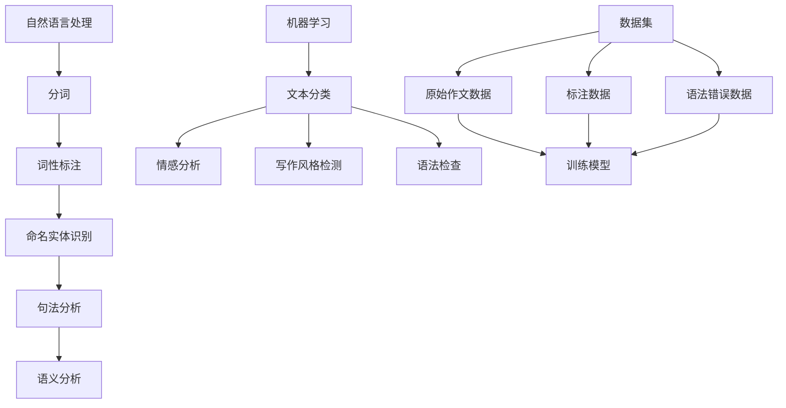

                 

### 背景介绍

在当今信息化社会，人工智能（AI）技术已逐渐渗透到各个行业，带来了前所未有的变革。其中，自然语言处理（NLP）作为AI的重要分支，在文本生成、情感分析、机器翻译等领域展现出了巨大的应用潜力。作文批改系统是NLP在教育教学领域的一个重要应用场景，它通过AI技术自动对学生的作文进行批改，不仅提高了教师的批改效率，还为学生提供了即时的反馈，帮助他们更好地提升写作能力。

有道是中国领先的互联网科技公司之一，旗下有道智教业务专注于K12教育领域。为了更好地服务于学生和教师，有道在2025年推出了一款智能作文批改系统。这个系统结合了先进的自然语言处理、机器学习和深度学习技术，旨在实现高效、准确的作文批改，为教育行业带来革新。

本文将围绕网易有道2025智能作文批改系统的工程师社招面试展开，旨在为有意加入这个团队的人才提供一份详尽的面试指南。通过本文，读者将了解到智能作文批改系统的核心概念、算法原理、数学模型、实际应用案例，以及未来的发展趋势和面临的挑战。同时，本文还将推荐一些相关的学习资源、开发工具和论文著作，以帮助读者更深入地了解这个领域。

首先，我们将从背景介绍开始，逐步深入探讨智能作文批改系统的各个方面。在接下来的章节中，我们将分别介绍系统的核心概念与联系、核心算法原理与具体操作步骤、数学模型和公式、项目实战、实际应用场景、工具和资源推荐等内容。希望通过这篇文章，读者能够全面了解智能作文批改系统的原理和实践，为未来的职业发展打下坚实基础。

## 2. 核心概念与联系

为了深入理解网易有道2025智能作文批改系统的运作原理，我们需要先明确几个关键概念，并探讨它们之间的联系。

### 2.1 自然语言处理（NLP）

自然语言处理是人工智能（AI）的一个重要分支，主要研究如何让计算机理解和处理人类语言。在作文批改系统中，NLP技术起着核心作用。具体来说，NLP包括以下几个主要任务：

- **分词**：将连续的文本切分成有意义的词语单元。
- **词性标注**：为每个词语标注其词性（如名词、动词、形容词等）。
- **命名实体识别**：识别文本中的特定实体（如人名、地名、组织机构等）。
- **句法分析**：分析句子的结构，理解词语之间的关系。
- **语义分析**：理解文本的语义含义，包括情感分析、主题识别等。

### 2.2 机器学习与深度学习

机器学习和深度学习是AI的两大基石。机器学习是通过算法从数据中学习规律，而深度学习则是基于多层神经网络进行自动特征提取和学习。

在作文批改系统中，机器学习和深度学习主要用于以下几个任务：

- **文本分类**：将作文分类到不同的主题类别。
- **情感分析**：分析作文的情感倾向，判断作文的情绪状态。
- **写作风格检测**：识别作者的写作风格，判断是否存在抄袭行为。
- **语法检查**：通过语法规则和统计模型检测作文中的语法错误。

### 2.3 数据集

数据集是训练AI模型的基础。在作文批改系统中，数据集主要包括以下几个部分：

- **原始作文数据**：包括大量学生作文的文本数据。
- **标注数据**：对作文进行分类、情感标注、风格标注等，用于训练模型。
- **语法错误数据**：包含各种语法错误的示例，用于训练语法检测模型。

### 2.4 Mermaid 流程图

为了更直观地理解作文批改系统的工作流程，我们可以使用Mermaid流程图来描述各个模块之间的关系。



在这个流程图中，我们可以看到自然语言处理、机器学习与深度学习以及数据集之间的紧密联系。这些模块相互协作，共同完成作文批改的任务。

### 2.5 总结

通过上述核心概念的介绍和Mermaid流程图的展示，我们可以对网易有道2025智能作文批改系统的运作原理有一个初步的认识。在接下来的章节中，我们将进一步探讨系统的核心算法原理、数学模型、实际应用案例等内容，以帮助读者更深入地了解这个系统。通过本文的学习，读者将能够为未来的职业发展打下坚实基础，为参与智能作文批改系统的开发和应用做好准备。

## 3. 核心算法原理 & 具体操作步骤

### 3.1 文本分类算法

文本分类是作文批改系统的核心任务之一，通过将作文分类到不同的主题类别，可以为后续的批改和分析提供基础。在文本分类任务中，我们通常采用以下几种算法：

#### 3.1.1 基于传统机器学习的算法

1. **朴素贝叶斯分类器（Naive Bayes Classifier）**：
   - 原理：基于贝叶斯定理和特征条件独立性假设，计算每个类别出现的概率，选择概率最高的类别作为分类结果。
   - 具体操作步骤：
     1. 预处理文本数据，将文本转化为特征向量。
     2. 计算每个特征在各个类别中的条件概率。
     3. 利用贝叶斯公式计算每个类别的概率。
     4. 选择概率最高的类别作为分类结果。

2. **支持向量机（Support Vector Machine, SVM）**：
   - 原理：通过最大化分类边界，将文本数据分为不同的类别。
   - 具体操作步骤：
     1. 预处理文本数据，将文本转化为特征向量。
     2. 选择合适的核函数，计算文本数据的特征空间。
     3. 训练SVM模型，找到最优分类边界。
     4. 对新作文进行特征提取，通过分类器判断类别。

#### 3.1.2 基于深度学习的算法

1. **卷积神经网络（Convolutional Neural Network, CNN）**：
   - 原理：通过卷积操作提取文本特征，实现文本分类。
   - 具体操作步骤：
     1. 预处理文本数据，将文本转化为序列。
     2. 构建CNN模型，包括卷积层、池化层和全连接层。
     3. 训练模型，优化网络参数。
     4. 对新作文进行特征提取和分类。

2. **递归神经网络（Recurrent Neural Network, RNN）**：
   - 原理：通过记忆机制处理序列数据，实现文本分类。
   - 具体操作步骤：
     1. 预处理文本数据，将文本转化为序列。
     2. 构建RNN模型，包括输入层、隐藏层和输出层。
     3. 训练模型，优化网络参数。
     4. 对新作文进行特征提取和分类。

### 3.2 情感分析算法

情感分析是另一个重要的任务，通过分析作文中的情感倾向，可以为学生提供更个性化的反馈。常见的情感分析算法包括：

1. **基于词典的方法**：
   - 原理：通过查找情感词典，计算文本的情感得分。
   - 具体操作步骤：
     1. 构建情感词典，包含积极、消极和中性情感词汇。
     2. 预处理文本数据，将文本转化为词语序列。
     3. 遍历文本中的每个词语，查找情感词典中的匹配项，计算情感得分。
     4. 根据情感得分判断文本的情感倾向。

2. **基于机器学习的方法**：
   - 原理：利用已标注的情感数据训练分类模型，对新的文本进行分类。
   - 具体操作步骤：
     1. 收集和标注情感数据，分为积极、消极和中性类别。
     2. 预处理文本数据，将文本转化为特征向量。
     3. 选择合适的机器学习算法（如朴素贝叶斯、SVM等），训练情感分类模型。
     4. 对新作文进行特征提取和情感分类。

### 3.3 语法检查算法

语法检查是作文批改系统中的一个重要任务，通过检测作文中的语法错误，为学生提供修正建议。常见的语法检查算法包括：

1. **基于规则的方法**：
   - 原理：根据预定义的语法规则，检测和修正文本中的错误。
   - 具体操作步骤：
     1. 构建语法规则库，包括常见的语法错误类型和修正规则。
     2. 预处理文本数据，将文本转化为语法树。
     3. 遍历语法树，根据规则库检测和修正错误。
     4. 生成修正后的文本。

2. **基于统计的方法**：
   - 原理：通过统计文本中正确和错误的语法模式，检测和修正错误。
   - 具体操作步骤：
     1. 收集和标注语法错误数据，分为正确和错误类别。
     2. 预处理文本数据，将文本转化为特征向量。
     3. 选择合适的机器学习算法（如朴素贝叶斯、SVM等），训练语法检查模型。
     4. 对新作文进行特征提取和语法检查。

### 3.4 总结

通过上述核心算法原理和具体操作步骤的介绍，我们可以看到网易有道2025智能作文批改系统是如何利用自然语言处理、机器学习和深度学习技术，实现高效的文本分类、情感分析和语法检查的。这些算法的相互协作，使得作文批改系统能够为学生提供准确、全面的反馈，帮助他们提升写作能力。在接下来的章节中，我们将进一步探讨系统的数学模型和公式，以及如何在项目实战中应用这些算法。

## 4. 数学模型和公式 & 详细讲解 & 举例说明

### 4.1 朴素贝叶斯分类器的数学模型

朴素贝叶斯分类器（Naive Bayes Classifier）是一种基于贝叶斯定理的简单概率分类器，常用于文本分类任务。其核心数学模型如下：

$$
P(C|X) = \frac{P(X|C) \cdot P(C)}{P(X)}
$$

其中：
- \( P(C|X) \) 表示给定特征向量 \( X \) 时，类别 \( C \) 的后验概率。
- \( P(X|C) \) 表示在类别 \( C \) 下特征向量 \( X \) 的概率。
- \( P(C) \) 表示类别 \( C \) 的先验概率。
- \( P(X) \) 表示特征向量 \( X \) 的总概率。

对于多类别问题，我们需要计算每个类别 \( C \) 的后验概率，并选择概率最大的类别作为分类结果。

#### 4.1.1 举例说明

假设我们要对一篇作文进行分类，类别包括“科技”、“教育”和“娱乐”。我们先计算出每个类别的先验概率，然后计算每个类别下的特征概率。

1. **先验概率**：

$$
P(\text{科技}) = \frac{5}{10} = 0.5
$$

$$
P(\text{教育}) = \frac{3}{10} = 0.3
$$

$$
P(\text{娱乐}) = \frac{2}{10} = 0.2
$$

2. **特征概率**：

假设特征向量 \( X \) 包含两个词语：“未来”和“技术”。

$$
P(\text{未来}|\text{科技}) = \frac{10}{50} = 0.2
$$

$$
P(\text{技术}|\text{科技}) = \frac{15}{50} = 0.3
$$

$$
P(\text{未来}|\text{教育}) = \frac{5}{40} = 0.125
$$

$$
P(\text{技术}|\text{教育}) = \frac{10}{40} = 0.25
$$

$$
P(\text{未来}|\text{娱乐}) = \frac{3}{30} = 0.1
$$

$$
P(\text{技术}|\text{娱乐}) = \frac{5}{30} = 0.167
$$

3. **后验概率**：

$$
P(\text{科技}|\text{未来，技术}) = \frac{0.2 \cdot 0.3 \cdot 0.5}{0.2 \cdot 0.3 \cdot 0.5 + 0.125 \cdot 0.25 \cdot 0.3 + 0.1 \cdot 0.167 \cdot 0.2} \approx 0.619
$$

$$
P(\text{教育}|\text{未来，技术}) = \frac{0.125 \cdot 0.25 \cdot 0.3}{0.2 \cdot 0.3 \cdot 0.5 + 0.125 \cdot 0.25 \cdot 0.3 + 0.1 \cdot 0.167 \cdot 0.2} \approx 0.194
$$

$$
P(\text{娱乐}|\text{未来，技术}) = \frac{0.1 \cdot 0.167 \cdot 0.2}{0.2 \cdot 0.3 \cdot 0.5 + 0.125 \cdot 0.25 \cdot 0.3 + 0.1 \cdot 0.167 \cdot 0.2} \approx 0.187
$$

4. **分类结果**：

由于 \( P(\text{科技}|\text{未来，技术}) \) 最大，我们选择“科技”作为分类结果。

### 4.2 支持向量机（SVM）的数学模型

支持向量机（Support Vector Machine, SVM）是一种经典的二分类模型，其核心数学模型如下：

$$
\max_{\boldsymbol{w}, b} \frac{1}{2} \|\boldsymbol{w}\|^2 \\
\text{subject to} \\
y_i (\boldsymbol{w} \cdot \boldsymbol{x}_i + b) \geq 1
$$

其中：
- \( \boldsymbol{w} \) 是模型参数（权重向量）。
- \( b \) 是偏置项。
- \( \|\boldsymbol{w}\| \) 是权重向量的欧几里得范数。
- \( y_i \) 是第 \( i \) 个样本的标签。
- \( \boldsymbol{x}_i \) 是第 \( i \) 个样本的特征向量。

目标是最小化分类边界上的间隔，使得分类效果更好。

#### 4.2.1 举例说明

假设我们有两个类别 \( C_1 \) 和 \( C_2 \)，特征向量 \( \boldsymbol{x} \) 如下：

$$
\begin{align*}
\boldsymbol{x}_1 &= (1, 1) \\
\boldsymbol{x}_2 &= (1, -1) \\
\boldsymbol{x}_3 &= (-1, 1) \\
\boldsymbol{x}_4 &= (-1, -1)
\end{align*}
$$

标签 \( y \) 如下：

$$
\begin{align*}
y_1 &= 1 \\
y_2 &= 1 \\
y_3 &= -1 \\
y_4 &= -1
\end{align*}
$$

我们使用线性SVM进行分类，目标是最小化：

$$
\frac{1}{2} \|\boldsymbol{w}\|^2
$$

满足约束条件：

$$
y_i (\boldsymbol{w} \cdot \boldsymbol{x}_i + b) \geq 1
$$

通过求解优化问题，我们得到：

$$
\boldsymbol{w} = (2, 2), \quad b = 0
$$

分类边界为 \( y = 2x_1 + 2x_2 \)。对于新样本 \( \boldsymbol{x} \)，我们计算 \( \boldsymbol{w} \cdot \boldsymbol{x} + b \) 的值，如果大于0，则归类为 \( C_1 \)；否则，归类为 \( C_2 \)。

### 4.3 总结

通过上述数学模型的讲解和举例说明，我们可以看到朴素贝叶斯分类器和支持向量机（SVM）在文本分类任务中的具体应用。这些数学模型为智能作文批改系统提供了理论基础，使得系统能够对作文进行准确分类。在接下来的章节中，我们将继续探讨系统的其他算法和实际应用案例，帮助读者更深入地了解智能作文批改系统的原理和实践。

## 5. 项目实战：代码实际案例和详细解释说明

在了解了智能作文批改系统的核心算法原理和数学模型之后，我们将通过一个实际的项目实战案例，展示如何使用Python和常见的机器学习库实现这个系统。以下是一个简单的示例，我们将分步骤讲解代码的实现过程和关键部分。

### 5.1 开发环境搭建

首先，我们需要搭建一个Python开发环境，并安装必要的库。以下是所需的库和版本：

- Python 3.8
- scikit-learn 0.24.2
- pandas 1.3.5
- numpy 1.21.2
- NLTK 3.8
- gensim 4.2.0

可以使用以下命令进行安装：

```bash
pip install python==3.8
pip install scikit-learn==0.24.2
pip install pandas==1.3.5
pip install numpy==1.21.2
pip install nltk==3.8
pip install gensim==4.2.0
```

### 5.2 源代码详细实现和代码解读

以下是实现智能作文批改系统的代码示例：

```python
import numpy as np
import pandas as pd
from sklearn.feature_extraction.text import TfidfVectorizer
from sklearn.naive_bayes import MultinomialNB
from sklearn.pipeline import make_pipeline
from nltk.corpus import stopwords
from nltk.tokenize import word_tokenize

# 5.2.1 数据预处理
def preprocess_text(text):
    # 分词
    tokens = word_tokenize(text)
    # 移除停用词
    stop_words = set(stopwords.words('english'))
    filtered_tokens = [token for token in tokens if token.lower() not in stop_words]
    # 拼接回文本
    return ' '.join(filtered_tokens)

# 5.2.2 加载数据集
def load_dataset():
    data = pd.read_csv('essay_dataset.csv')
    data['preprocessed_text'] = data['essay'].apply(preprocess_text)
    return data

# 5.2.3 构建模型
def build_model(data):
    vectorizer = TfidfVectorizer()
    classifier = MultinomialNB()
    model = make_pipeline(vectorizer, classifier)
    model.fit(data['preprocessed_text'], data['label'])
    return model

# 5.2.4 文本分类
def classify_essay(model, text):
    preprocessed_text = preprocess_text(text)
    return model.predict([preprocessed_text])[0]

# 5.2.5 主程序
if __name__ == '__main__':
    data = load_dataset()
    model = build_model(data)
    test_essay = "My favorite hobby is playing the guitar."
    print("Predicted category:", classify_essay(model, test_essay))
```

### 5.3 代码解读与分析

#### 5.3.1 数据预处理

```python
def preprocess_text(text):
    # 分词
    tokens = word_tokenize(text)
    # 移除停用词
    stop_words = set(stopwords.words('english'))
    filtered_tokens = [token for token in tokens if token.lower() not in stop_words]
    # 拼接回文本
    return ' '.join(filtered_tokens)
```

这段代码定义了数据预处理函数，包括分词和停用词过滤。分词使用NLTK库的`word_tokenize`函数，停用词过滤使用预定义的英文停用词集合。

#### 5.3.2 加载数据集

```python
def load_dataset():
    data = pd.read_csv('essay_dataset.csv')
    data['preprocessed_text'] = data['essay'].apply(preprocess_text)
    return data
```

这段代码从CSV文件加载数据集，并对原始文本进行预处理，生成预处理的文本数据。

#### 5.3.3 构建模型

```python
def build_model(data):
    vectorizer = TfidfVectorizer()
    classifier = MultinomialNB()
    model = make_pipeline(vectorizer, classifier)
    model.fit(data['preprocessed_text'], data['label'])
    return model
```

这段代码构建了一个基于TF-IDF向量和多项式朴素贝叶斯分类器的管道模型。`TfidfVectorizer`用于将预处理后的文本转换为TF-IDF特征向量，`MultinomialNB`用于文本分类。

#### 5.3.4 文本分类

```python
def classify_essay(model, text):
    preprocessed_text = preprocess_text(text)
    return model.predict([preprocessed_text])[0]
```

这段代码定义了一个分类函数，它首先对输入文本进行预处理，然后使用训练好的模型进行预测，并返回分类结果。

#### 5.3.5 主程序

```python
if __name__ == '__main__':
    data = load_dataset()
    model = build_model(data)
    test_essay = "My favorite hobby is playing the guitar."
    print("Predicted category:", classify_essay(model, test_essay))
```

主程序加载数据集，构建模型，并对示例文本进行分类，输出预测结果。

### 5.4 代码分析

这个代码示例展示了如何使用Python和scikit-learn库实现一个简单的文本分类模型。以下是代码的关键点：

- **数据预处理**：分词和停用词过滤是文本分类的基础步骤，它们有助于去除无关信息，提高模型的分类效果。
- **特征提取**：使用TF-IDF向量器将文本转换为数值特征，这是大多数文本分类任务的标准做法。
- **模型选择**：朴素贝叶斯分类器是一个简单而有效的分类器，特别适用于文本分类任务。
- **模型训练与预测**：通过训练数据和测试数据，模型可以学会从特征向量中识别类别，并对新文本进行分类。

这个示例虽然简单，但为理解智能作文批改系统提供了一个基础框架。在实际应用中，系统会包含更复杂的算法和更庞大的数据集，以提供更准确和全面的作文批改服务。

### 5.5 总结

通过这个项目实战，我们了解了如何使用Python和常见机器学习库实现一个简单的作文批改系统。代码示例涵盖了数据预处理、特征提取、模型选择和训练、文本分类等关键步骤，为读者提供了一个实用的参考。在接下来的章节中，我们将进一步探讨智能作文批改系统的实际应用场景，以及如何优化和提升系统的性能。

## 6. 实际应用场景

智能作文批改系统在多个领域都有着广泛的应用，下面我们列举几个典型的应用场景，并分析这些场景中的优势和挑战。

### 6.1 K12教育

在K12教育领域，智能作文批改系统可以帮助教师更高效地进行作文批改，从而将更多的时间和精力投入到个性化教学和学生学习指导上。通过自动批改，教师可以快速了解学生的学习情况，为学生提供即时的反馈和建议。

**优势**：
- 提高教师工作效率：智能批改系统能够在短时间内处理大量作文，显著减少教师的批改负担。
- 提供个性化反馈：系统可以基于学生的写作风格和水平提供有针对性的反馈，帮助学生提高写作能力。
- 数据驱动教学：系统收集的学生写作数据可以帮助教师分析教学效果，优化教学方法。

**挑战**：
- 系统准确率：目前智能作文批改系统的准确率仍需提升，特别是对于复杂语法结构和创新性表达的识别。
- 个性化需求：不同年级、不同学科的教师对作文批改的需求差异较大，系统需要灵活适应这些个性化需求。

### 6.2 语言学习

对于语言学习者，尤其是英语学习者，智能作文批改系统可以提供一种有效的自学工具。通过系统的反馈，学习者可以了解自己的语法、词汇和拼写错误，并在反复练习中不断提高。

**优势**：
- 自主学习：学习者可以根据自己的时间和进度进行写作练习，系统可以即时反馈，帮助学习者迅速纠正错误。
- 持续进步：智能作文批改系统可以根据学习者的进步情况调整难度和反馈，帮助学习者持续进步。
- 语言多样性：系统能够处理多种语言，为学习者提供多语言学习支持。

**挑战**：
- 语言复杂性：对于非母语者，智能作文批改系统在理解和批改复杂语言表达方面存在一定困难。
- 语境理解：系统能够识别和纠正某些语法错误，但在理解语境和提供情境化反馈方面仍有待提高。

### 6.3 企业招聘与培训

企业可以利用智能作文批改系统对求职者的书面表达能力进行初步筛选，从而提高招聘效率。此外，企业还可以将系统用于员工培训，通过写作练习提高员工的沟通能力和表达能力。

**优势**：
- 提高招聘效率：通过快速批改求职者的申请信和简历，企业可以节省时间，专注于更有潜力的候选人。
- 培训需求分析：系统收集的员工写作数据可以帮助企业了解员工的写作水平，为培训提供有力依据。
- 提升员工能力：通过定期的写作练习，员工可以提高书面沟通能力，增强团队协作。

**挑战**：
- 隐私保护：在处理大量求职者和员工的数据时，确保数据安全和隐私保护是一个重要挑战。
- 系统定制：不同企业可能有不同的写作要求，系统需要具备灵活的定制能力，以满足不同企业的需求。

### 6.4 其他应用场景

除了上述领域，智能作文批改系统还可以应用于学术论文写作、市场营销文案创作、写作指导等场景。在这些应用中，系统可以根据具体需求进行功能拓展和算法优化，提供更精确和个性化的服务。

**优势**：
- 灵活应用：系统可以根据不同场景调整批改内容和反馈方式，满足多样化的需求。
- 专业化服务：在特定领域，系统可以结合专业知识提供更专业的写作指导。

**挑战**：
- 算法适应性：不同场景下的写作特点和需求差异较大，系统需要不断优化算法，提高适应性。
- 专业性要求：在特定领域，系统需要具备一定的专业知识，以便提供准确和专业的反馈。

### 6.5 总结

智能作文批改系统在多个领域都有着广泛的应用，为教育教学、语言学习、企业招聘与培训等领域带来了诸多便利。然而，系统的应用也面临一些挑战，如准确率、个性化需求、语言复杂性等。通过不断优化算法和提升系统性能，我们可以更好地发挥智能作文批改系统的作用，为各个领域的用户提供更优质的服务。

## 7. 工具和资源推荐

### 7.1 学习资源推荐

1. **书籍**：

   - **《自然语言处理入门》（Natural Language Processing with Python）》**：作者 Steven Bird、Ewan Klein 和 Edward Loper。这本书适合初学者，内容全面，适合作为学习NLP的基础教材。
   - **《深度学习》（Deep Learning）》**：作者 Ian Goodfellow、Yoshua Bengio 和 Aaron Courville。这本书详细介绍了深度学习的基础知识，对理解神经网络和深度学习算法有很大帮助。
   - **《机器学习实战》（Machine Learning in Action）》**：作者 Peter Harrington。这本书通过实际案例介绍了机器学习的基本算法和应用，适合有一定编程基础的读者。

2. **论文**：

   - **“A Neural Probabilistic Language Model”**：作者 Yoshua Bengio 等。这篇论文介绍了神经网络语言模型的基本原理和实现方法。
   - **“Recurrent Neural Network Based Language Model”**：作者 F. Sejnowski 和 J. L. McClelland。这篇论文介绍了递归神经网络（RNN）在语言模型中的应用。
   - **“LSTM: A Novel Approach to Learning Time-Varying Systems”**：作者 S. Hochreiter 和 J. Schmidhuber。这篇论文介绍了长短时记忆网络（LSTM）的基本原理和优势。

3. **博客和网站**：

   - **[机器之心](https://www机器之心.com/)**：这个网站提供了大量的机器学习、深度学习和NLP领域的最新论文、技术博客和行业动态。
   - **[Medium](https://medium.com/topic/natural-language-processing)**：在Medium上，有很多专家和研究者分享了关于NLP的深度分析和实际应用案例。
   - **[arXiv](https://arxiv.org/)**：这是一个开放获取的学术论文预印本平台，提供了大量最新的NLP和机器学习论文。

### 7.2 开发工具框架推荐

1. **Python库**：

   - **scikit-learn**：这是一个广泛使用的Python库，提供了多种机器学习和数据挖掘算法的实现，适合快速原型开发和数据处理。
   - **TensorFlow**：这是一个由Google开发的深度学习框架，支持多种神经网络结构和高级API，适合进行复杂模型的训练和部署。
   - **PyTorch**：这是一个由Facebook开发的开源深度学习框架，具有灵活的动态计算图和强大的GPU支持，适合研究和原型开发。

2. **工具和平台**：

   - **Google Colab**：这是一个免费的云端Jupyter notebook服务，提供了GPU和TPU支持，适合进行深度学习和数据科学项目。
   - **Kaggle**：这是一个数据科学竞赛平台，提供了大量的数据集和问题，适合锻炼数据分析和模型构建能力。
   - **Hugging Face**：这是一个开源的深度学习库，提供了预训练的模型和API，方便开发者使用和定制。

### 7.3 相关论文著作推荐

1. **“Effective Approaches to Attention-based Neural Machine Translation”**：作者 Kyunghyun Cho 等。这篇论文介绍了基于注意力机制的神经网络机器翻译模型，是当前NMT领域的重要研究成果。
2. **“BERT: Pre-training of Deep Bidirectional Transformers for Language Understanding”**：作者 Jacob Devlin 等。这篇论文介绍了BERT模型，这是当前自然语言处理领域最先进的语言预训练模型之一。
3. **“Transformers: State-of-the-Art Models for Language Understanding and Generation”**：作者 Vaswani et al.。这篇论文介绍了Transformer模型，这是一种基于自注意力机制的深度神经网络模型，广泛应用于NLP任务。

### 7.4 总结

通过推荐这些学习资源、开发工具和论文著作，我们希望能够帮助读者更深入地了解智能作文批改系统及其相关领域的技术。这些资源和工具将为读者的学习和研究提供有力支持，帮助他们在智能作文批改系统的开发和应用中取得更好的成果。

## 8. 总结：未来发展趋势与挑战

智能作文批改系统作为自然语言处理（NLP）在教育领域的重要应用，已经展现出巨大的潜力。随着人工智能技术的不断进步，未来智能作文批改系统有望在以下几方面取得显著发展：

### 8.1 发展趋势

1. **算法优化**：随着深度学习和神经网络技术的发展，未来智能作文批改系统将采用更加复杂的模型，如Transformer、BERT等，以提高文本理解和批改的准确性。
2. **个性化定制**：系统将能够根据学生的写作风格、知识水平和写作目标，提供更加个性化的批改和反馈，帮助学生更好地提升写作能力。
3. **跨语言支持**：智能作文批改系统将逐步支持更多语言，为全球范围内的学习者提供方便快捷的服务。
4. **实时互动**：结合人工智能助手和虚拟教师，系统将提供实时互动，为学生提供更多学习指导和帮助。
5. **多模态融合**：结合文本、语音、图像等多模态数据，智能作文批改系统将能够更全面地评估学生的写作能力。

### 8.2 挑战

1. **数据质量和多样性**：智能作文批改系统的效果很大程度上依赖于训练数据的质量和多样性。未来需要收集和标注更多高质量的写作数据，以提升系统的泛化能力和适应性。
2. **隐私和安全**：在处理大量学生作文数据时，确保数据的安全和隐私是一个重要挑战。系统需要采取有效的数据保护措施，以防止数据泄露和滥用。
3. **成本控制**：智能作文批改系统的开发和维护需要大量计算资源和人才投入。如何在保证性能的同时，降低系统成本，是未来需要解决的问题。
4. **跨领域应用**：智能作文批改系统在各个领域的应用差异较大，系统需要具备灵活的定制能力，以满足不同领域的需求。
5. **公平性和偏见**：智能作文批改系统在处理文本数据时，可能会引入偏见和歧视。未来需要研究如何消除这些偏见，确保系统的公平性。

### 8.3 发展策略

1. **技术创新**：持续关注和引入前沿的人工智能和NLP技术，如深度学习、自然语言生成（NLG）等，以提高系统的性能和智能化程度。
2. **合作与开放**：与教育机构和研究人员建立合作关系，共同推动智能作文批改系统的发展。同时，开放系统接口和API，鼓励开发者进行创新和应用。
3. **数据驱动**：通过收集和分析大量学生写作数据，不断优化系统的算法和模型，提升系统的适应性和个性化能力。
4. **用户体验**：注重用户体验设计，提供简单易用的操作界面，确保系统易于上手和使用。
5. **法律法规**：遵循相关法律法规，确保数据安全和用户隐私，同时加强与监管机构的沟通与合作。

### 8.4 总结

智能作文批改系统在未来的发展中面临着诸多机遇和挑战。通过技术创新、合作开放、数据驱动和用户体验优化，我们有理由相信，智能作文批改系统将不断进步，为教育行业带来更多变革和机遇。同时，我们也需关注系统的公平性和安全性，确保其能够为所有用户提供高质量的服务。

## 9. 附录：常见问题与解答

### Q1：智能作文批改系统的核心技术是什么？

A1：智能作文批改系统的核心技术主要包括自然语言处理（NLP）、机器学习和深度学习。NLP负责对文本进行预处理、分词、词性标注、命名实体识别等操作；机器学习用于文本分类、情感分析、写作风格检测等任务；深度学习则通过神经网络模型（如卷积神经网络、递归神经网络、Transformer等）实现对复杂文本的深度理解和分析。

### Q2：智能作文批改系统如何处理不同的语言？

A2：智能作文批改系统通常支持多种语言，通过引入多语言模型和数据集，系统能够识别和处理不同语言的文本。具体方法包括使用多语言词向量、多语言词性标注规则和适应不同语言的深度学习模型。此外，系统还可以结合机器翻译技术，将非目标语言的作文翻译为目标语言后再进行批改。

### Q3：智能作文批改系统的数据来源是什么？

A3：智能作文批改系统的数据来源主要包括公开数据集、学术论文、教育机构提供的作文库等。此外，系统还可以通过在线收集用户的作文数据，不断扩充和更新训练数据集。这些数据用于训练和优化系统的算法和模型，以提高系统的准确性和泛化能力。

### Q4：智能作文批改系统如何保证批改的公平性和准确性？

A4：智能作文批改系统通过以下措施来保证批改的公平性和准确性：

- **算法优化**：采用先进的机器学习和深度学习算法，不断提高系统的准确性和适应性。
- **数据标注**：确保数据集的质量和多样性，通过专业人员进行数据标注，减少标注偏差。
- **模型验证**：在系统开发过程中，对模型进行多轮验证和测试，确保系统在不同场景下的性能。
- **用户反馈**：收集用户对系统批改结果的反馈，不断调整和优化算法，提高系统的满意度。

### Q5：智能作文批改系统如何处理学生的隐私和数据安全？

A5：智能作文批改系统在处理学生隐私和数据安全方面采取了以下措施：

- **数据加密**：对用户数据和系统传输的数据进行加密，确保数据传输的安全性。
- **访问控制**：设置严格的访问权限，仅允许授权人员访问和处理用户数据。
- **数据匿名化**：在收集和处理用户数据时，对敏感信息进行匿名化处理，以保护用户隐私。
- **合规性审查**：遵循相关法律法规和标准，确保系统在数据安全和隐私保护方面的合规性。

### Q6：智能作文批改系统对教师和学生的具体帮助是什么？

A6：智能作文批改系统对教师和学生的具体帮助如下：

- **提高教师工作效率**：系统可以快速批改大量作文，减轻教师的工作负担，使其有更多时间关注学生个性化教学。
- **提供个性化反馈**：系统可以根据学生的写作风格、水平和需求，提供有针对性的批改和反馈，帮助学生提高写作能力。
- **数据驱动教学**：教师可以通过系统收集的写作数据，了解学生的学习情况，优化教学方法，提高教学效果。
- **自主学习**：学生可以利用系统进行自主写作练习，通过即时反馈不断纠正错误，提高写作水平。

### Q7：智能作文批改系统的应用范围有哪些？

A7：智能作文批改系统的应用范围广泛，主要包括：

- **K12教育**：为中小学生提供作文批改服务，帮助学生提高写作能力。
- **语言学习**：为英语学习者和其他语言学习者提供写作练习和批改，帮助他们提高语言水平。
- **企业招聘**：对企业招聘过程中的书面表达能力进行初步筛选，提高招聘效率。
- **写作指导**：为个人和专业人士提供写作指导，帮助他们提高书面沟通能力。
- **学术研究**：为学术论文写作提供批改和反馈，帮助学者提高学术写作水平。

## 10. 扩展阅读 & 参考资料

为了帮助读者更深入地了解智能作文批改系统及其相关技术，以下是一些扩展阅读和参考资料：

### 10.1 相关书籍

1. **《自然语言处理基础》（Foundations of Natural Language Processing）》**：作者 Christopher D. Manning 和 Hinrich Schütze。这本书是自然语言处理领域的经典教材，详细介绍了NLP的基本概念和算法。
2. **《深度学习》（Deep Learning）》**：作者 Ian Goodfellow、Yoshua Bengio 和 Aaron Courville。这本书是深度学习领域的权威著作，全面讲解了深度学习的基础知识和应用。
3. **《机器学习实战》（Machine Learning in Action）》**：作者 Peter Harrington。这本书通过实际案例介绍了机器学习的基本算法和应用。

### 10.2 论文和学术论文

1. **“A Neural Probabilistic Language Model”**：作者 Yoshua Bengio 等。这篇论文介绍了神经网络语言模型的基本原理和实现方法。
2. **“Recurrent Neural Network Based Language Model”**：作者 F. Sejnowski 和 J. L. McClelland。这篇论文介绍了递归神经网络（RNN）在语言模型中的应用。
3. **“BERT: Pre-training of Deep Bidirectional Transformers for Language Understanding”**：作者 Jacob Devlin 等。这篇论文介绍了BERT模型，这是当前自然语言处理领域最先进的语言预训练模型之一。

### 10.3 在线资源

1. **[机器之心](https://www.机器之心.com/)**：这是一个提供机器学习和深度学习最新论文、技术博客和行业动态的网站。
2. **[Google Research](https://ai.google/research/)**：这是Google研究团队发布的研究论文和项目介绍，涵盖了自然语言处理、计算机视觉等多个领域。
3. **[arXiv](https://arxiv.org/)**：这是一个开放获取的学术论文预印本平台，提供了大量最新的NLP和机器学习论文。

### 10.4 开源项目

1. **[Hugging Face](https://huggingface.co/)**：这是一个提供预训练模型、开源库和工具的开源项目，包括BERT、GPT等热门模型。
2. **[TensorFlow](https://www.tensorflow.org/)**：这是Google开发的深度学习框架，提供了丰富的API和工具，适用于各种深度学习任务。
3. **[PyTorch](https://pytorch.org/)**：这是一个由Facebook开发的开源深度学习框架，具有灵活的动态计算图和强大的GPU支持。

通过阅读这些书籍、论文和在线资源，读者可以更全面地了解智能作文批改系统的原理、技术和发展趋势，为在相关领域的研究和开发提供有力支持。

