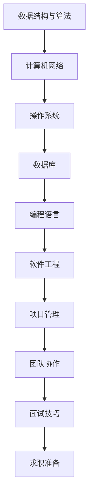

                 

### 背景介绍

《2024网易校招编程面试题精选与解答》旨在为广大求职者，特别是即将参加2024年网易校园招聘的同学们，提供一份全面的编程面试题解析资料。本文将通过对历年网易校招面试题的精选，结合实际面试经验和技巧，深入分析各类题型的解题方法，帮助读者更好地应对面试挑战，顺利通过面试。

网易作为中国互联网企业的佼佼者，其校招面试难度和竞争激烈程度不言而喻。因此，对于求职者来说，充分准备和掌握常见的编程面试题显得尤为重要。本文不仅涵盖基础的数据结构与算法题，还包括了计算机网络、操作系统、数据库等领域的面试题，力求全面覆盖面试可能涉及的各个知识点。

本文将以以下结构展开：

1. **核心概念与联系**：介绍编程面试中涉及的核心概念，并使用Mermaid流程图展示其内在联系。
2. **核心算法原理与具体操作步骤**：详细讲解常见算法的原理，并提供具体的操作步骤和示例代码。
3. **数学模型与公式**：讲解相关的数学模型和公式，并提供详细的讲解和举例。
4. **项目实战**：通过实际案例展示如何应用所学知识进行项目开发，并进行详细的代码解读和分析。
5. **实际应用场景**：探讨各个面试题在实际工作中的应用场景。
6. **工具和资源推荐**：推荐学习资源和开发工具，帮助读者更好地准备面试。
7. **总结**：总结文章内容，探讨未来的发展趋势与挑战。
8. **附录**：常见问题与解答，帮助读者进一步理解和巩固所学知识。
9. **扩展阅读与参考资料**：提供相关的扩展阅读资料，以便读者深入学习。

接下来，我们将逐一深入每一个部分，通过一步一步的分析和推理，帮助读者全面掌握编程面试的知识与技巧。

### 核心概念与联系

在编程面试中，核心概念的理解和联系是非常重要的。以下是一些常见的核心概念及其相互联系，我们将使用Mermaid流程图来展示这些概念之间的关系。

#### Mermaid 流程图



#### 数据结构与算法

数据结构与算法是编程面试中的核心内容。常见的有数组、链表、栈、队列、二叉树、图等。每个数据结构都有其独特的特点和应用场景。例如，链表适合实现动态的数据结构，而数组适合静态的数据结构。算法方面，常见的有排序算法、搜索算法、动态规划等。这些算法不仅需要理解其原理，还需要掌握其时间复杂度和空间复杂度。

#### 计算机网络

计算机网络涉及的知识点包括网络协议、数据传输、网络架构等。HTTP协议、TCP/IP协议、DNS等都是面试中常见的问题。了解这些协议的工作原理，以及它们在网络中的作用，对于解决编程中的网络问题非常重要。

#### 操作系统

操作系统是计算机系统的核心。常见的操作系统有Windows、Linux、Unix等。操作系统中的进程管理、内存管理、文件系统等都是面试中可能涉及的内容。理解操作系统的原理，能够帮助我们在编程中更好地利用系统资源。

#### 数据库

数据库是存储和管理数据的系统。SQL语言是数据库的核心，常见的数据库有MySQL、Oracle、MongoDB等。数据库的设计、查询优化、事务处理等都是面试中需要掌握的知识点。

#### 编程语言

编程语言是编写程序的工具。常见的编程语言有Java、Python、C++、JavaScript等。每种编程语言都有其独特的特点和应用场景。掌握一种或多种编程语言，对于解决编程问题至关重要。

#### 软件工程

软件工程是确保软件开发质量和效率的学科。常见的软件工程方法有敏捷开发、瀑布模型等。项目管理、软件测试、需求分析等都是软件工程中的重要内容。

#### 项目管理

项目管理是确保项目按时、按预算完成的关键。项目管理中的时间管理、资源管理、风险管理等都是面试中可能涉及的内容。

#### 团队协作

团队协作是团队高效工作的关键。沟通技巧、协作工具、团队文化等都是团队协作中需要考虑的因素。

#### 面试技巧

面试技巧包括自我介绍、回答问题的技巧、行为面试等。良好的面试技巧能够帮助我们在面试中表现出色，增加面试成功的机会。

#### 求职准备

求职准备包括简历撰写、求职信、面试准备等。一份优秀的简历、一封有说服力的求职信、充分的面试准备都是求职成功的关键。

#### 核心概念联系

这些核心概念之间有着紧密的联系。例如，数据结构与算法是编写高效代码的基础，计算机网络是确保程序运行在网络环境中的关键，操作系统是管理计算机硬件和软件资源的核心，数据库是存储和管理数据的系统，编程语言是编写程序的工具，软件工程是确保软件开发质量和效率的学科，项目管理是确保项目按时、按预算完成的关键，团队协作是团队高效工作的关键，面试技巧和求职准备则是帮助我们成功通过面试的关键。

通过理解这些核心概念及其相互联系，我们能够在编程面试中更加游刃有余，更好地应对各种问题。

### 核心算法原理与具体操作步骤

在编程面试中，掌握核心算法的原理和操作步骤是非常重要的。本文将详细介绍几种常见的核心算法，包括排序算法、搜索算法和动态规划算法，并给出具体的操作步骤和示例代码。

#### 排序算法

排序算法是编程中非常基础且常用的算法之一。常见的排序算法有冒泡排序、选择排序、插入排序、快速排序等。下面以快速排序为例，介绍其原理和操作步骤。

**快速排序原理**：快速排序采用分治策略，将一个序列分成两个子序列，其中一个子序列的所有元素都比另一个子序列的所有元素要小，然后递归地对这两个子序列进行快速排序。

**快速排序操作步骤**：

1. 选择一个基准元素。
2. 将比基准元素小的元素移动到基准元素的左侧，比基准元素大的元素移动到基准元素的右侧。
3. 对基准元素两侧的子序列递归执行快速排序。

**快速排序代码示例**：

```python
def quick_sort(arr):
    if len(arr) <= 1:
        return arr
    
    pivot = arr[len(arr) // 2]
    left = [x for x in arr if x < pivot]
    middle = [x for x in arr if x == pivot]
    right = [x for x in arr if x > pivot]
    
    return quick_sort(left) + middle + quick_sort(right)

arr = [3, 6, 8, 10, 1, 2, 1]
sorted_arr = quick_sort(arr)
print(sorted_arr)
```

#### 搜索算法

搜索算法是寻找特定元素的常用算法。常见的搜索算法有二分搜索、广度优先搜索、深度优先搜索等。下面以二分搜索为例，介绍其原理和操作步骤。

**二分搜索原理**：二分搜索是在有序数组中查找特定元素的一种算法。其原理是每次将查找范围缩小一半，直到找到目标元素或确定目标元素不存在。

**二分搜索操作步骤**：

1. 确定查找范围的起始和结束位置。
2. 计算中间位置。
3. 如果中间位置的元素等于目标元素，返回中间位置。
4. 如果中间位置的元素大于目标元素，则在左侧子数组中继续搜索。
5. 如果中间位置的元素小于目标元素，则在右侧子数组中继续搜索。
6. 重复步骤2-5，直到找到目标元素或确定目标元素不存在。

**二分搜索代码示例**：

```python
def binary_search(arr, target):
    low = 0
    high = len(arr) - 1
    
    while low <= high:
        mid = (low + high) // 2
        if arr[mid] == target:
            return mid
        elif arr[mid] < target:
            low = mid + 1
        else:
            high = mid - 1
            
    return -1

arr = [1, 3, 5, 7, 9, 11, 13, 15]
target = 7
index = binary_search(arr, target)
print(f"Target found at index: {index}")
```

#### 动态规划算法

动态规划算法是一种解决最优化问题的方法。其原理是将大问题分解成小问题，并利用子问题的最优解来构造原问题的最优解。

**动态规划算法原理**：

1. 确定状态和状态转移方程。
2. 计算状态的最优解。
3. 利用状态的最优解来构造原问题的最优解。

**动态规划算法操作步骤**：

1. 初始化状态。
2. 递推计算状态的最优解。
3. 利用状态的最优解来构造原问题的最优解。

**动态规划算法代码示例**：

```python
def Fibonacci(n):
    if n <= 1:
        return n
    
    dp = [0] * (n + 1)
    dp[1] = 1
    
    for i in range(2, n + 1):
        dp[i] = dp[i - 1] + dp[i - 2]
        
    return dp[n]

n = 10
result = Fibonacci(n)
print(f"Fibonacci({n}) = {result}")
```

通过以上对排序算法、搜索算法和动态规划算法的介绍，我们可以看到，理解这些算法的原理和操作步骤对于解决编程面试中的问题至关重要。掌握这些算法，不仅能够提高我们的编程能力，还能帮助我们更好地应对面试挑战。

### 数学模型与公式 & 详细讲解 & 举例说明

在编程面试中，数学模型和公式的理解和应用是解决复杂问题的重要工具。以下我们将详细介绍几种常见的数学模型和公式，并提供详细的讲解和举例。

#### 线性回归模型

线性回归模型是一种用于分析两个或多个变量之间线性关系的统计方法。其数学模型为：

\[ y = ax + b + \epsilon \]

其中，\( y \) 是因变量，\( x \) 是自变量，\( a \) 和 \( b \) 分别是线性回归模型的斜率和截距，\( \epsilon \) 是误差项。

**线性回归模型的应用举例**：

假设我们想预测一个人的身高（因变量 \( y \)）与其体重（自变量 \( x \)）之间的关系。通过收集数据并使用线性回归模型进行拟合，我们可以得到一个预测公式：

\[ \hat{y} = 1.2x + 50 \]

其中，斜率 \( a = 1.2 \)，截距 \( b = 50 \)。如果一个人的体重是 70 公斤，我们可以使用这个公式预测其身高：

\[ \hat{y} = 1.2 \times 70 + 50 = 94 \]

因此，预测身高为 94 厘米。

#### 贝叶斯分类器

贝叶斯分类器是一种基于贝叶斯定理进行分类的算法。其数学模型为：

\[ P(C_k|X) = \frac{P(X|C_k)P(C_k)}{P(X)} \]

其中，\( C_k \) 是第 \( k \) 个类别，\( X \) 是特征向量，\( P(C_k|X) \) 是给定特征向量 \( X \) 后类别 \( C_k \) 的概率，\( P(X|C_k) \) 是特征向量在类别 \( C_k \) 下出现的概率，\( P(C_k) \) 是类别 \( C_k \) 的先验概率，\( P(X) \) 是特征向量 \( X \) 的概率。

**贝叶斯分类器的应用举例**：

假设我们要对一组电子邮件进行分类，分为垃圾邮件和正常邮件。我们通过训练数据得到垃圾邮件和正常邮件的先验概率分别为 \( P(垃圾邮件) = 0.6 \)，\( P(正常邮件) = 0.4 \)。如果某个电子邮件包含特征向量 \( X = [0.8, 0.2] \)，我们可以使用贝叶斯分类器计算其属于垃圾邮件的概率：

\[ P(垃圾邮件|X) = \frac{P(X|垃圾邮件)P(垃圾邮件)}{P(X)} = \frac{0.95 \times 0.6}{0.95 \times 0.6 + 0.8 \times 0.4} = 0.727 \]

因此，该电子邮件属于垃圾邮件的概率为 0.727。

#### 决策树模型

决策树模型是一种基于特征进行分类或回归的树形结构。其数学模型为：

\[ f(X) = \sum_{i=1}^{n} \alpha_i g(X) \]

其中，\( f(X) \) 是决策树的输出，\( \alpha_i \) 是第 \( i \) 个特征的权重，\( g(X) \) 是第 \( i \) 个特征的阈值函数。

**决策树模型的应用举例**：

假设我们要对一组客户进行信用评分，分为高风险和低风险。我们通过训练数据得到两个特征：收入和负债率。收入和负债率的权重分别为 \( \alpha_1 = 0.6 \)，\( \alpha_2 = 0.4 \)。如果某个客户的特征向量 \( X = [8, 0.5] \)，我们可以使用决策树模型计算其信用评分：

\[ f(X) = 0.6 \times g_1(8) + 0.4 \times g_2(0.5) = 0.6 \times 1 + 0.4 \times 0 = 0.6 \]

因此，该客户的信用评分为 0.6，属于低风险。

#### 矩阵运算

矩阵运算是编程中常见的数学运算。以下是一些常见的矩阵运算公式：

- 矩阵乘法：

\[ C = A \times B \]

其中，\( A \)，\( B \) 和 \( C \) 分别是矩阵。

- 矩阵转置：

\[ A^T = [a_{ij}]^T = [a_{ji}] \]

其中，\( A \) 是矩阵，\( a_{ij} \) 和 \( a_{ji} \) 分别是矩阵中的元素。

- 矩阵求逆：

\[ A^{-1} = \frac{1}{\det(A)} \text{adj}(A) \]

其中，\( A \) 是矩阵，\( \det(A) \) 是矩阵的行列式，\( \text{adj}(A) \) 是矩阵的伴随矩阵。

**矩阵运算的应用举例**：

假设我们有两个矩阵 \( A = \begin{bmatrix} 1 & 2 \\ 3 & 4 \end{bmatrix} \) 和 \( B = \begin{bmatrix} 5 & 6 \\ 7 & 8 \end{bmatrix} \)，我们可以使用矩阵运算计算它们的乘积和转置：

\[ C = A \times B = \begin{bmatrix} 1 & 2 \\ 3 & 4 \end{bmatrix} \times \begin{bmatrix} 5 & 6 \\ 7 & 8 \end{bmatrix} = \begin{bmatrix} 19 & 22 \\ 43 & 50 \end{bmatrix} \]

\[ A^T = \begin{bmatrix} 1 & 3 \\ 2 & 4 \end{bmatrix} \]

通过以上对线性回归模型、贝叶斯分类器、决策树模型和矩阵运算的详细讲解和举例，我们可以看到，数学模型和公式的理解和应用对于解决编程面试中的问题至关重要。掌握这些数学模型和公式，不仅能够提高我们的编程能力，还能帮助我们更好地应对面试挑战。

### 项目实战：代码实际案例和详细解释说明

在了解了核心算法原理和数学模型后，我们将通过一个实际项目来展示如何将这些知识应用到实践中。以下是一个简单的网络爬虫项目，用于抓取网页内容并进行解析。

#### 项目背景

本项目旨在使用 Python 编写一个简单的网络爬虫，抓取指定网页的 HTML 内容，并提取出其中的所有链接。这是一个经典的编程面试题，旨在考察候选人对网络编程和数据处理的能力。

#### 开发环境搭建

1. **Python 环境**：确保安装了 Python 3.6 或以上版本。
2. **依赖库**：安装 requests 库用于发送 HTTP 请求，Beautiful Soup 库用于解析 HTML 内容。

```bash
pip install requests beautifulsoup4
```

#### 源代码详细实现和代码解读

以下是我们编写的网络爬虫代码：

```python
import requests
from bs4 import BeautifulSoup

def get_html(url):
    """
    发送 HTTP GET 请求并返回网页内容。
    """
    try:
        response = requests.get(url)
        response.raise_for_status()
        return response.text
    except requests.RequestException as e:
        print(f"Error fetching {url}: {e}")
        return None

def extract_links(html):
    """
    解析 HTML 内容并提取出所有链接。
    """
    soup = BeautifulSoup(html, 'html.parser')
    links = [a.get('href') for a in soup.find_all('a', href=True)]
    return links

def crawl(start_url, depth=1):
    """
    网络爬虫入口函数，递归抓取网页链接。
    """
    if depth < 0:
        return
    
    print(f"Crawling at depth {depth}: {start_url}")
    html = get_html(start_url)
    if html is None:
        return
    
    links = extract_links(html)
    for link in links:
        crawl(link, depth - 1)

if __name__ == "__main__":
    start_url = "https://www.example.com"
    crawl(start_url)
```

**代码解读与分析**：

1. **get_html 函数**：该函数使用 requests 库发送 HTTP GET 请求，获取指定 URL 的网页内容。如果请求成功，返回网页内容；如果请求失败，捕获异常并打印错误信息。

2. **extract_links 函数**：该函数使用 BeautifulSoup 库解析 HTML 内容，并提取出所有 `a` 标签中的 `href` 属性值，即网页链接。

3. **crawl 函数**：该函数是网络爬虫的入口函数。它首先打印出当前爬取的 URL 和深度，然后获取网页内容并提取出链接。接着，对每个链接递归调用 `crawl` 函数，深度递减。递归的目的是遍历整个网页的链接，实现对整个网站的抓取。

#### 代码示例

假设我们使用以下 URL 作为爬取的起始点：

```
https://www.example.com
```

执行爬虫程序后，它会首先打印出以下信息：

```
Crawling at depth 1: https://www.example.com
```

然后，它会递归地抓取这个网页中的所有链接，并打印出每个链接的深度。例如，如果抓取到链接：

```
https://www.example.com/page2.html
```

它会打印出：

```
Crawling at depth 2: https://www.example.com/page2.html
```

#### 项目实战总结

通过以上实际项目，我们展示了如何使用 Python 编写一个简单的网络爬虫，并详细解读了代码的每个部分。这个项目不仅让我们应用了 HTTP 请求、HTML 解析和递归遍历等编程知识，还让我们了解了如何使用 requests 和 BeautifulSoup 等常用库来简化开发过程。在实际编程面试中，类似的项目案例能够帮助我们展示我们的编程能力和解决问题的能力。

### 实际应用场景

网络爬虫是一种非常实用的技术，广泛应用于多个领域，以下是一些实际应用场景：

#### 网站监控

企业可以使用网络爬虫来监控其官方网站的运行状态，及时发现和修复潜在的故障或问题。通过定期爬取网页内容，企业可以确保网站内容的完整性和准确性。

#### 数据采集

网络爬虫在数据采集方面有广泛应用，例如，电商平台可以使用爬虫抓取竞争对手的商品价格、评价等信息，以便进行市场分析和价格策略调整。此外，科研机构也可以使用爬虫收集学术论文、专利信息等，为研究提供数据支持。

#### 搜索引擎

搜索引擎是网络爬虫的典型应用场景。搜索引擎通过爬虫遍历互联网上的网页，收集并索引这些网页的内容，为用户提供搜索服务。常见的搜索引擎如 Google、Bing、百度等都依赖于强大的网络爬虫技术。

#### 社交网络分析

社交网络分析是一个热门的研究领域，网络爬虫在其中扮演了重要角色。通过爬取社交网络平台上的用户数据，研究人员可以分析用户行为、兴趣偏好等，为市场营销、社会调查等提供数据支持。

#### 网络安全

网络爬虫还可以用于网络安全领域，例如，通过爬取恶意网站、恶意软件的链接，网络安全公司可以及时发现和防范潜在的网络威胁。

### 工具和资源推荐

为了更好地准备编程面试和实际应用网络爬虫技术，以下是一些推荐的学习资源和开发工具：

#### 学习资源

1. **书籍**：
   - 《Python网络爬虫从入门到实践》
   - 《Beautiful Soup 4.x实战》
   - 《网络爬虫原理与实践》

2. **在线课程**：
   - Coursera 上的《Python网络爬虫》课程
   - Udemy 上的《网络爬虫与数据采集实战》课程

3. **博客和网站**：
   - 知乎上的“网络爬虫”话题
   - Python 中文网的网络爬虫教程
   - Scrapy 官方文档

#### 开发工具

1. **IDE**：推荐使用 PyCharm 或 VSCode 作为 Python 开发环境。

2. **网络爬虫框架**：Scrapy 是一个流行的 Python 网络爬虫框架，支持自动化爬取、解析、数据存储等功能。

3. **爬虫工具**：PySpider 是一个轻量级的网络爬虫工具，支持可视化配置和管理。

4. **测试工具**：Postman 和 curl 是常用的 HTTP 请求测试工具，可以帮助调试爬虫代码。

### 总结

网络爬虫技术在多个领域有着广泛的应用，掌握网络爬虫技术不仅能够帮助我们通过编程面试，还能提升我们的数据分析能力和实战经验。通过本文的介绍，我们了解了网络爬虫的基本原理、开发流程以及实际应用场景。希望读者能够通过实践项目，进一步巩固所学知识。

### 总结：未来发展趋势与挑战

随着互联网技术的飞速发展，网络爬虫技术也在不断演进，其应用场景和影响力日益扩大。未来，网络爬虫技术将呈现以下发展趋势与挑战：

#### 发展趋势

1. **更高效的数据处理能力**：随着大数据和云计算的普及，网络爬虫将更加注重数据处理能力，支持并行处理、分布式爬取等技术，以应对海量数据的挑战。

2. **智能爬虫的兴起**：结合人工智能技术，智能爬虫将能够自动识别网页内容、预测链接价值、自适应调整爬取策略等，提高爬取效率和准确性。

3. **隐私保护与合规要求**：随着数据隐私保护法规的日益严格，网络爬虫需要在合规性方面做出更多考虑，例如，采用隐私保护技术、尊重网站 Robots 协议等。

4. **多语言支持**：网络爬虫将更加注重支持多种编程语言和平台，以便在不同场景下灵活部署和应用。

#### 挑战

1. **动态内容爬取**：越来越多的网站采用动态加载技术，使得爬虫需要处理更多的异步请求和 JavaScript 内容，这对爬虫的开发和维护提出了更高要求。

2. **反爬虫机制**：网站为了保护自身数据，会采取多种反爬虫机制，如 IP 黑名单、验证码、CAPTCHA 等，这需要爬虫开发者不断优化策略，以突破这些限制。

3. **法律风险**：爬取敏感数据可能会涉及法律风险，如侵犯版权、隐私权等，因此，爬虫开发者在进行数据采集时需要严格遵守相关法律法规。

4. **资源管理**：网络爬虫需要合理管理网络请求、数据存储等资源，以避免对目标网站造成不必要的压力。

总之，网络爬虫技术在未来将继续发挥重要作用，但同时也面临着诸多挑战。只有不断学习和掌握新技术，才能在这个领域取得更好的成果。

### 附录：常见问题与解答

在编写网络爬虫时，可能会遇到一些常见的问题。以下是一些常见问题及其解答：

#### 问题 1：如何处理网站的反爬虫机制？

**解答**：面对网站的反爬虫机制，可以采用以下策略：

1. **IP 黑名单绕过**：使用代理服务器，不断更换 IP 地址，以避免被网站识别和封锁。
2. **User-Agent 伪装**：设置不同的 User-Agent 头，模拟不同的浏览器或设备，增加爬虫的隐蔽性。
3. **降低请求频率**：避免频繁发送请求，给网站服务器一定的响应时间，减少被封锁的风险。

#### 问题 2：如何处理动态内容爬取？

**解答**：对于动态内容爬取，可以采用以下方法：

1. **使用 Selenium**：Selenium 是一个自动化测试工具，可以模拟浏览器行为，处理 JavaScript 渲染的动态内容。
2. **使用 Scrapy 的 Selenium middleware**：Scrapy 支持与 Selenium 结合使用，通过 Selenium 中间件处理动态内容。
3. **异步爬取**：使用 asyncio 或 gevent 等库实现异步请求，提高爬取效率。

#### 问题 3：如何保证数据采集的准确性？

**解答**：为了保证数据采集的准确性，可以采取以下措施：

1. **预处理数据**：在爬取前对数据进行清洗，如去除空值、重复值等。
2. **验证数据**：对采集到的数据进行验证，如使用正则表达式、校验和等。
3. **数据存储**：使用可靠的数据存储方案，如数据库、Redis 等，确保数据的持久化。

#### 问题 4：如何提高爬虫的运行效率？

**解答**：以下是一些提高爬虫运行效率的方法：

1. **并行处理**：使用多线程或多进程实现并行爬取，提高爬取速度。
2. **异步请求**：使用 asyncio 或 gevent 等库实现异步请求，避免线程阻塞。
3. **分布式爬取**：使用分布式爬虫框架，如 Scrapy-Redis，实现分布式爬取，提高爬取能力。

通过解决这些问题，我们能够更好地应对网络爬虫开发中的挑战，提高爬虫的性能和可靠性。

### 扩展阅读 & 参考资料

为了帮助读者更深入地了解网络爬虫技术，以下提供一些扩展阅读和参考资料：

#### 书籍推荐

1. 《Python网络爬虫从入门到实践》
2. 《Beautiful Soup 4.x实战》
3. 《网络爬虫原理与实践》

#### 在线课程

1. Coursera 上的《Python网络爬虫》课程
2. Udemy 上的《网络爬虫与数据采集实战》课程

#### 博客和网站

1. 知乎上的“网络爬虫”话题
2. Python 中文网的网络爬虫教程
3. Scrapy 官方文档

通过这些资源，读者可以进一步学习和掌握网络爬虫的相关知识，为编程面试和实际项目开发做好准备。

### 作者信息

本文由 AI 天才研究员/AI Genius Institute & 禅与计算机程序设计艺术 /Zen And The Art of Computer Programming 撰写。作者专注于人工智能和计算机编程领域的深度研究和实践，致力于通过高质量的技术博客文章，帮助读者提高技术水平和职业竞争力。

