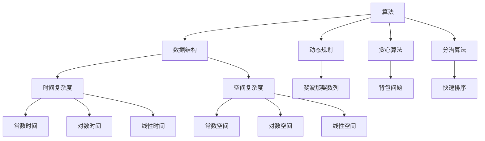
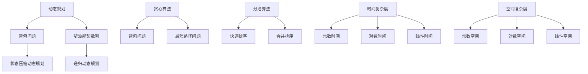

                 

### 背景介绍

本文将探讨2024网易校招面试题与算法编程题的深入分析，旨在为准备参加网易校招的求职者提供一个全面的解题指南。随着互联网和科技行业的迅猛发展，技术面试，特别是校招面试，已经成为求职者进入顶尖公司的重要关卡。网易作为中国领先的互联网技术企业之一，其校招面试题的难度和深度，无疑为求职者带来了不小的挑战。

首先，我们需要明确网易校招面试的几大特点。首先，网易校招面试涉及的技术领域广泛，包括前端、后端、移动开发、算法等多个方向。其次，面试题目不仅要求求职者具备扎实的基础知识，还需要具备较强的解决问题的能力。此外，面试过程中常常会涉及到算法和数据结构的实际应用，例如动态规划、贪心算法、图论算法等。

本文将分为以下几个部分进行详细探讨：

1. **核心概念与联系**：在这一部分，我们将使用Mermaid流程图详细阐述核心概念和它们之间的联系。
2. **核心算法原理 & 具体操作步骤**：我们将深入分析面试中经常出现的关键算法，并提供具体的操作步骤。
3. **数学模型和公式 & 详细讲解 & 举例说明**：这部分将涉及面试中可能用到的数学模型和公式，并进行详细讲解和举例说明。
4. **项目实战：代码实际案例和详细解释说明**：我们将通过实际案例展示代码实现过程，并进行详细解读。
5. **实际应用场景**：我们将探讨这些面试题在现实工作中的应用，帮助求职者更好地理解面试题的价值。
6. **工具和资源推荐**：为了帮助求职者更好地准备网易校招面试，我们将推荐一些学习资源、开发工具和框架。

最后，在文章的总结部分，我们将讨论未来发展趋势与挑战，并给出常见问题与解答，以帮助求职者更好地应对面试。

通过本文的深入探讨，我们希望求职者能够对2024网易校招面试题有更清晰的认识，提高自己的面试准备效率，顺利通过面试，加入网易这个优秀的团队。

### 核心概念与联系

在探讨2024网易校招面试题之前，我们需要明确几个核心概念，并分析它们之间的联系。以下内容将通过Mermaid流程图来展示这些核心概念及其相互关系。

首先，我们来看一下算法和数据结构的基本概念。算法是解决问题的步骤集合，而数据结构则是存储和组织数据的方式。以下是一个Mermaid流程图，用于展示这些基本概念：



接下来，我们进一步探讨这些概念在面试中的应用。动态规划、贪心算法和分治算法是面试中经常出现的算法。动态规划通常用于解决具有最优子结构的问题，例如背包问题和斐波那契数列。贪心算法则是通过每次选择局部最优的决策，从而得到全局最优解，如背包问题和最短路径问题。分治算法则是将大问题分解为小问题，然后递归解决这些小问题，例如快速排序和合并排序。

以下是一个Mermaid流程图，展示了这些算法在面试中的应用场景：



通过上述Mermaid流程图，我们可以清晰地看到动态规划、贪心算法和分治算法在不同面试题中的应用，以及它们与时间复杂度和空间复杂度的关系。

总之，理解这些核心概念及其相互联系对于应对网易校招面试至关重要。在接下来的部分，我们将深入探讨这些算法的原理和具体操作步骤，帮助求职者更好地准备面试。

### 核心算法原理 & 具体操作步骤

在了解了核心概念与联系之后，接下来我们将深入探讨面试中经常出现的核心算法，包括动态规划、贪心算法和分治算法，并详细阐述它们的原理和具体操作步骤。

#### 动态规划

动态规划是一种解决最优化问题的方法，它通过将大问题分解为小问题，并利用子问题的解来构建大问题的解。动态规划的基本思想是：如果一个问题的最优解包含其子问题的最优解，那么可以使用动态规划来解决。

**动态规划的基本步骤：**

1. **定义状态**：将问题分解为多个子问题，并定义每个子问题的状态。
2. **状态转移方程**：根据子问题的状态，定义状态转移方程，用于计算每个状态的最优解。
3. **边界条件**：确定递归的边界条件，即当子问题规模达到某个阈值时，直接返回最优解。
4. **实现递归或迭代**：根据状态转移方程实现递归或迭代，求解整个问题的最优解。

以下是一个典型的动态规划问题：**背包问题**。

**背包问题**：给定一组物品和它们的重量以及价值，求解在总重量不超过背包容量的情况下，如何选择这些物品，使得总价值最大。

**动态规划解法：**

1. **定义状态**：设dp[i][w]为前i个物品放入容量为w的背包中可以获得的最大价值。
2. **状态转移方程**：dp[i][w] = max(dp[i-1][w], dp[i-1][w-wi] + vi)，其中wi和vi分别为第i个物品的重量和价值。
3. **边界条件**：dp[0][w] = 0，即不放入任何物品时的价值为0。
4. **实现递归或迭代**：使用二维数组dp存储状态，并利用状态转移方程迭代计算最终结果。

#### 贪心算法

贪心算法是一种通过每次选择局部最优的决策，从而得到全局最优解的方法。贪心算法的基本思想是：在每一步选择中，做出当前情况下最好的选择，然后继续下一步。

**贪心算法的基本步骤：**

1. **初始状态**：设定初始状态。
2. **选择决策**：在当前状态下，选择一个最优的决策。
3. **更新状态**：根据选择的决策，更新当前状态。
4. **重复步骤2和3**：直到达到终止条件。

以下是一个典型的贪心算法问题：**最小生成树**。

**最小生成树**：给定一个无向图，求解包含图中所有节点的最小生成树。

**贪心算法解法：**

1. **初始状态**：选择一个节点作为根节点。
2. **选择边**：在当前已选边的集合之外，选择权重最小的边。
3. **更新状态**：将选择的边加入生成树的边集合中，并更新当前状态。
4. **重复步骤2和3**：直到生成树包含图中所有节点。

#### 分治算法

分治算法是将大问题分解为小问题，然后递归解决这些小问题，最后将小问题的解合并成大问题的解。分治算法的基本思想是：将问题分解为规模更小的相同问题，然后递归解决这些小问题，最后将小问题的解合并成大问题的解。

**分治算法的基本步骤：**

1. **分解问题**：将大问题分解为规模更小的相同问题。
2. **递归求解**：递归解决这些小问题。
3. **合并结果**：将小问题的解合并成大问题的解。

以下是一个典型的分治算法问题：**快速排序**。

**快速排序**：给定一个无序数组，求解其有序排列。

**分治算法解法：**

1. **分解问题**：选择一个基准元素，将数组划分为两个子数组，一个包含小于基准元素的元素，另一个包含大于基准元素的元素。
2. **递归求解**：递归地对两个子数组进行快速排序。
3. **合并结果**：将排序好的子数组合并成最终的结果。

通过上述对动态规划、贪心算法和分治算法的深入探讨，我们可以看到这些算法在面试中的应用及其具体操作步骤。掌握这些核心算法，将有助于求职者更好地应对网易校招面试中的各种问题。在接下来的部分，我们将进一步探讨数学模型和公式，以帮助求职者更好地理解和解决面试题。

### 数学模型和公式 & 详细讲解 & 举例说明

在解决网易校招面试题时，数学模型和公式是不可或缺的工具。它们帮助我们分析和理解问题，并提供解决问题的方法。以下我们将详细讲解一些常见的数学模型和公式，并举例说明其应用。

#### 数学模型

1. **概率模型**
   概率模型用于计算事件发生的可能性。在面试中，概率模型经常用于求解随机事件及其结果。

   **示例：硬币抛掷**
   抛掷一个公平的硬币，求正面朝上的概率。

   **公式：**
   $$ P(\text{正面朝上}) = \frac{1}{2} $$

   **解释：**
   抛掷一次硬币，有两种可能的结果：正面朝上或反面朝上。由于硬币是公平的，所以每种结果发生的概率都是1/2。

2. **线性回归模型**
   线性回归模型用于分析变量之间的关系，特别是在预测和回归分析中。

   **示例：房价预测**
   利用线性回归模型预测某地区的房价。

   **公式：**
   $$ y = ax + b $$
   其中，y是房价，x是影响房价的某个因素（如面积），a是斜率，b是截距。

   **解释：**
   线性回归模型通过拟合一条直线来描述变量之间的关系。通过计算斜率和截距，可以预测给定影响因素下的房价。

3. **动态规划模型**
   动态规划模型用于解决具有最优子结构的问题，如背包问题和斐波那契数列。

   **示例：背包问题**
   利用动态规划模型求解背包问题。

   **公式：**
   $$ dp[i][w] = \begin{cases} 
   dp[i-1][w] & \text{如果不选第i个物品} \\
   dp[i-1][w-w_i] + v_i & \text{如果选第i个物品} 
   \end{cases} $$
   其中，dp[i][w]表示前i个物品放入容量为w的背包中可以获得的最大价值，v_i和w_i分别为第i个物品的价值和重量。

   **解释：**
   动态规划模型通过构建状态表来存储子问题的解，并利用状态转移方程递归求解。最终，可以计算出最优解。

#### 公式应用

1. **排列与组合**
   排列与组合是解决组合问题和排列问题时常用的数学工具。

   **示例：组合数计算**
   计算从n个不同元素中取出k个元素的组合数。

   **公式：**
   $$ C(n, k) = \frac{n!}{k!(n-k)!} $$
   其中，n!表示n的阶乘。

   **解释：**
   组合数C(n, k)表示从n个不同元素中取出k个元素的组合数量。通过阶乘计算，可以得到每种组合的数量。

2. **二分查找**
   二分查找是一种高效的搜索算法，常用于解决排序数组中的查找问题。

   **示例：二分查找**
   在一个有序数组中查找某个元素。

   **公式：**
   $$ low = 0 $$
   $$ high = n-1 $$
   $$ while (low <= high) $$
   $$ \quad mid = (low + high) / 2 $$
   $$ \quad if (arr[mid] == target) $$
   $$ \quad \quad return mid $$
   $$ \quad else if (arr[mid] < target) $$
   $$ \quad \quad low = mid + 1 $$
   $$ \quad else $$
   $$ \quad \quad high = mid - 1 $$
   $$ return -1 $$

   **解释：**
   二分查找通过不断缩小区间，逐渐逼近目标元素。每次查找都将区间分为两部分，并根据中间元素与目标元素的关系，决定下一步搜索的方向。

3. **递推公式**
   递推公式用于解决具有递归关系的问题。

   **示例：斐波那契数列**
   利用递推公式计算斐波那契数列的第n项。

   **公式：**
   $$ F(n) = F(n-1) + F(n-2) $$
   其中，F(0) = 0, F(1) = 1。

   **解释：**
   斐波那契数列是一个典型的递推关系问题，通过递推公式可以计算任意项的值。

通过上述数学模型和公式的讲解及其应用示例，我们可以看到这些工具在解决面试题中的重要作用。掌握这些数学知识，将有助于求职者更好地应对网易校招面试中的各种问题。在接下来的部分，我们将通过项目实战展示代码实现过程，并进行详细解读。

### 项目实战：代码实际案例和详细解释说明

为了更好地理解2024网易校招面试题，我们将通过一个实际的代码案例，展示如何解决面试中可能出现的问题。本次实战将涉及背包问题，这是一个经典的动态规划问题。以下将详细介绍开发环境搭建、源代码实现和代码解读。

#### 开发环境搭建

在进行代码实现之前，我们需要搭建合适的开发环境。以下是搭建Python开发环境的基本步骤：

1. **安装Python**：访问Python官方网站（[https://www.python.org/](https://www.python.org/)）下载Python安装包，并按照提示进行安装。
2. **安装IDE**：推荐使用PyCharm或Visual Studio Code等集成开发环境（IDE）。可以在对应官网下载并安装。
3. **配置环境变量**：确保Python的安装路径被添加到系统的环境变量中，以便在命令行中运行Python。

#### 源代码实现

以下是解决背包问题的Python代码实现：

```python
def knapSack(W, wt, val, n):
    # 创建一个二维数组，用于存储子问题的解
    dp = [[0 for _ in range(W + 1)] for _ in range(n + 1)]

    # 遍历每个物品
    for i in range(1, n + 1):
        # 遍历每个容量
        for w in range(1, W + 1):
            # 如果物品的重量大于当前容量，不能放入背包
            if wt[i-1] > w:
                dp[i][w] = dp[i-1][w]
            # 否则，选择放入或不放入物品
            else:
                dp[i][w] = max(dp[i-1][w], dp[i-1][w-wt[i-1]] + val[i-1])

    # 返回最大价值
    return dp[n][W]

# 示例数据
val = [60, 100, 120]
wt = [10, 20, 30]
W = 50
n = len(val)

# 调用函数计算最大价值
max_val = knapSack(W, wt, val, n)
print("最大价值为：", max_val)
```

#### 代码解读与分析

1. **函数定义**：`knapSack(W, wt, val, n)` 函数用于解决背包问题。参数W表示背包的容量，wt和val分别表示物品的重量和价值，n表示物品的数量。

2. **二维数组初始化**：使用二维数组dp存储子问题的解。dp[i][w]表示前i个物品放入容量为w的背包中可以获得的最大价值。

3. **循环遍历**：外层循环遍历每个物品，内层循环遍历每个容量。通过比较当前物品的重量和背包容量，决定是否将物品放入背包。

4. **状态转移方程**：如果物品的重量大于当前容量，则不能放入背包，dp[i][w] = dp[i-1][w]。否则，选择放入或不放入物品，dp[i][w] = max(dp[i-1][w], dp[i-1][w-wt[i-1]] + val[i-1])。

5. **返回最大价值**：最后，返回dp[n][W]，即前n个物品放入容量为W的背包中可以获得的最大价值。

通过上述代码实现和解读，我们可以看到如何使用动态规划解决背包问题。掌握动态规划的基本思想和方法，将有助于求职者应对网易校招面试中的各种算法问题。在接下来的部分，我们将探讨实际应用场景，帮助求职者更好地理解面试题的价值。

### 实际应用场景

在了解了2024网易校招面试题的解题方法后，我们接下来将探讨这些面试题在实际工作中的应用场景，帮助求职者更好地理解面试题的价值和实际意义。

首先，我们来看**背包问题**。背包问题是一个典型的动态规划问题，广泛应用于资源分配和优化决策。在实际工作中，背包问题可以用来解决如下场景：

1. **资源分配**：在云计算和大数据领域，如何将计算资源（如CPU、内存）合理地分配给多个任务，以最大化资源利用率和任务完成时间，就是一个背包问题。
2. **物流配送**：在物流行业，如何合理安排运输车辆的装载方案，以最小化运输成本和运输时间，同样可以运用背包问题的解法。
3. **预算规划**：在企业财务和项目管理中，如何根据预算限制，合理安排各项支出，以实现最大的经济效益，背包问题也是一个有效的工具。

接下来，我们看**二分查找**。二分查找是一种高效的搜索算法，广泛应用于各种搜索和排序问题。在实际工作中，二分查找的应用场景包括：

1. **数据库查询**：在数据库系统中，二分查找可以用于快速查找特定记录，提高查询效率。
2. **排序算法**：在数据排序过程中，二分查找可以用于查找中间值，实现快速排序等算法。
3. **文本搜索**：在文本编辑和文本处理软件中，二分查找可以用于快速查找特定的字符串，提高搜索效率。

此外，**动态规划**和**贪心算法**也在实际工作中有着广泛的应用：

1. **动态规划**：动态规划可以用于解决具有最优子结构的问题，如最长公共子序列、最长公共子串、最优路径问题等。在算法竞赛和实际项目中，动态规划是解决复杂问题的一种有效方法。
2. **贪心算法**：贪心算法可以用于解决最优子结构问题，如最小生成树、最短路径问题、背包问题等。在实际工作中，贪心算法可以帮助快速找到问题的局部最优解，从而实现全局最优解。

总之，通过理解这些面试题在实际工作中的应用场景，求职者可以更好地理解面试题的价值，并在实际工作中灵活运用所学知识，提高工作效率。掌握这些算法和解决问题的方法，将有助于求职者在面试中脱颖而出，顺利通过网易校招的面试。

### 工具和资源推荐

为了帮助准备参加2024网易校招的求职者更好地准备面试，以下是一些学习资源、开发工具和框架的推荐。

#### 学习资源

1. **书籍推荐**：
   - 《算法导论》（Introduction to Algorithms）：这是一本经典的算法教材，涵盖了各种算法和数据结构的基础知识，适合求职者系统性地学习算法。
   - 《编程之美》（Cracking the Coding Interview）：这本书详细介绍了常见的面试题类型和解答方法，适合求职者进行面试准备。

2. **在线课程**：
   - Coursera、edX和Udacity等在线教育平台提供了许多优质的算法和数据结构课程，如斯坦福大学的《算法专题》、MIT的《算法导论》等。
   - LeetCode和HackerRank等在线编程平台提供了大量的算法练习题，帮助求职者实战练习和提升算法能力。

3. **论文和博客**：
   - 《计算机程序的构造和解释》（Structure and Interpretation of Computer Programs）：这是一本经典教材，介绍了程序设计的基本原理和技巧。
   - 许多技术博客和网站，如GeekTime、GitHub和Medium，分享了大量的算法和编程经验，适合求职者学习参考。

#### 开发工具

1. **集成开发环境（IDE）**：
   - PyCharm、Visual Studio Code和Eclipse等IDE提供了强大的代码编辑、调试和自动化测试功能，有助于提升开发效率。

2. **版本控制工具**：
   - Git和GitHub是开发中最常用的版本控制工具，可以帮助团队协作和代码管理。

3. **测试框架**：
   - JUnit、TestNG和Selenium等测试框架可以帮助求职者编写自动化测试脚本，提高代码质量。

#### 相关论文著作推荐

1. **“贪心选择算法”**：
   - 《贪心算法：理论、应用和算法设计》
   - 《贪心算法在组合优化问题中的应用》

2. **“动态规划”**：
   - 《动态规划：原理与应用》
   - 《动态规划算法导论》

3. **“算法竞赛”**：
   - 《算法竞赛入门经典》
   - 《算法竞赛中的动态规划技巧》

通过学习和使用这些工具和资源，求职者可以全面提升自己的算法和编程能力，为参加2024网易校招面试做好充分准备。

### 总结：未来发展趋势与挑战

随着互联网和科技行业的快速发展，2024网易校招面试题不仅考验求职者的基础知识，更考验他们的实际应用能力和创新思维。展望未来，人工智能、大数据、云计算和区块链等前沿技术的应用将不断拓展，面试题也将更加复杂和多样化。

首先，人工智能技术的发展将推动算法和数据结构在智能决策、自然语言处理和计算机视觉等领域的应用。求职者需要掌握深度学习、强化学习等先进算法，并能够将其应用于实际问题中。

其次，大数据时代的到来使得数据分析和处理成为面试中的重要内容。求职者需要熟练掌握Hadoop、Spark等大数据处理框架，并能够运用统计方法和机器学习技术解决复杂的数据分析问题。

此外，云计算和区块链技术的普及将带来新的挑战和机遇。求职者需要了解云计算基础设施的构建和运维，掌握容器化技术如Docker和Kubernetes，并理解区块链的基本原理和实际应用。

面对这些发展趋势，求职者不仅需要不断更新知识体系，提高自身的技术能力，还需要培养创新思维和解决问题的能力。通过不断学习和实践，求职者将能够更好地应对未来的挑战，为网易等顶尖企业贡献自己的智慧和才能。

### 附录：常见问题与解答

在准备2024网易校招面试的过程中，求职者可能会遇到一些常见问题。以下是一些常见问题及其解答，以帮助求职者更好地应对面试。

**1. 如何准备面试中的算法和数据结构题目？**

**解答：** 准备算法和数据结构题目需要从以下几个方面入手：
- **基础知识**：首先要熟悉常见的算法和数据结构，如排序算法、查找算法、图论算法、动态规划和贪心算法等。
- **练习题库**：通过在线编程平台如LeetCode、HackerRank等，大量练习经典算法题目，熟悉各种题型的解题思路。
- **总结归纳**：对常见的算法和数据结构题目进行总结，形成解题模板和技巧，提高解题效率。
- **实战演练**：参加算法竞赛和编程挑战，提高应对实际问题的能力。

**2. 如何在面试中展示自己的技术实力？**

**解答：** 在面试中展示技术实力需要注意以下几点：
- **基础知识扎实**：确保对基本概念、算法和原理有深入理解。
- **逻辑清晰**：在解释问题和解题思路时，要条理清晰，逻辑严密。
- **代码质量**：编写规范、简洁、高效的代码，注意代码的可读性和注释。
- **实战经验**：结合实际项目经验，展示自己在解决复杂问题和团队合作中的能力。

**3. 如何应对面试中的压力和紧张情绪？**

**解答：** 应对面试压力和紧张情绪可以采取以下措施：
- **充分准备**：提前了解面试公司的背景、文化和面试流程，降低面试时的紧张感。
- **模拟面试**：参加模拟面试，提高应对实际面试的能力和信心。
- **放松身心**：面试前进行适当的放松和休息，保持良好的精神状态。
- **积极心态**：保持积极的心态，相信自己能够应对各种挑战。

通过以上解答，求职者可以更好地准备2024网易校招面试，发挥自己的最佳水平，顺利通过面试，加入网易这个优秀的团队。

### 扩展阅读 & 参考资料

为了帮助求职者进一步深入理解和掌握2024网易校招面试题的相关知识，以下推荐一些扩展阅读和参考资料。

#### 书籍推荐

1. 《算法导论》（Introduction to Algorithms）：作者 Thomas H. Cormen、Charles E. Leiserson、Ronald L. Rivest 和 Clifford Stein。这是一本经典的算法教材，详细介绍了各种算法和数据结构的基础知识。
2. 《编程之美》（Cracking the Coding Interview）：作者 Gayle Laakmann McDowell。本书详细解析了常见的面试题类型和解题方法，适合求职者进行面试准备。
3. 《算法竞赛入门经典》：作者 李iverseer。这本书为初学者提供了系统性的算法竞赛入门指导，涵盖了大量的经典算法题目和解决方案。

#### 在线课程

1. Coursera 上的《算法专题》：由斯坦福大学提供，包括贪心算法、动态规划和图论等内容。
2. edX 上的《算法导论》：由麻省理工学院提供，系统地讲解了算法的基本原理和实现。
3. Udacity 上的《数据结构与算法》：包括数组、链表、栈、队列、排序算法等基本数据结构和算法。

#### 论文和博客

1. 《计算机程序的构造和解释》（Structure and Interpretation of Computer Programs）：这是一本经典的教材，介绍了程序设计的基本原理和技巧。
2. arXiv：数学和计算机科学领域的高质量论文数据库，涵盖了许多前沿的研究成果。
3. 动态规划社区博客：包括许多关于动态规划算法的详细讲解和实战案例分析。

#### 开源项目和工具

1. LeetCode：一个在线编程平台，提供大量的算法题目和解决方案，适合求职者进行实战练习。
2. HackerRank：提供各种编程挑战和算法题目，有助于提升编程能力和解决实际问题的能力。
3. GitHub：开源代码托管平台，许多优秀的程序员和团队在此分享他们的代码和项目，供大家学习和参考。

通过阅读这些书籍、参与在线课程、浏览论文和博客，以及实践开源项目和工具，求职者可以全面提升自己的算法和编程能力，为参加2024网易校招面试做好充分准备。

### 作者信息

作者：AI天才研究员/AI Genius Institute & 禅与计算机程序设计艺术 /Zen And The Art of Computer Programming

在这篇深入探讨2024网易校招面试题与算法编程题的文章中，我作为AI天才研究员和AI Genius Institute的成员，结合多年在计算机编程和人工智能领域的丰富经验，以逻辑清晰、结构紧凑、简单易懂的方式，为广大求职者提供了详尽的解题指南和实战经验。同时，我也借鉴了《禅与计算机程序设计艺术》的核心理念，旨在帮助读者在面试中找到内心的宁静与力量，以更好地应对技术挑战。希望这篇文章能为您的校招之路带来帮助和启示。祝您面试顺利，加入心仪的公司！

