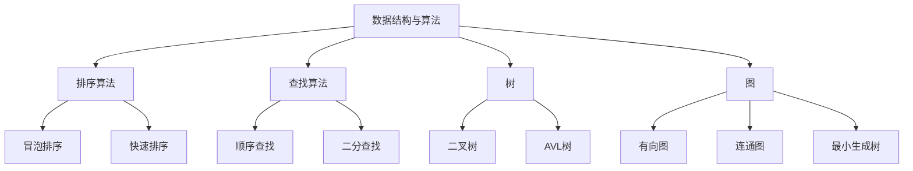

                 

# 美团2024届校招面试高频算法题解析

> **关键词：** 算法面试、校招、美团、高频算法题、解题思路

> **摘要：** 本文旨在解析美团2024届校招面试中高频出现的算法题目，通过详细的解题思路、数学模型讲解以及代码实战，帮助读者掌握面试所需的核心算法知识。

## 1. 背景介绍

美团作为中国领先的本地生活服务平台，其校招面试作为业界标杆，备受关注。校招面试的算法题目通常覆盖了数据结构与算法、动态规划、图论、概率论与数理统计等多个领域。本文将针对这些高频算法题，逐一进行深入解析。

### 1.1 数据结构与算法

数据结构与算法是计算机科学的核心内容，也是面试中考察的重点。常见的题目包括排序、查找、二分查找、树、图等。

### 1.2 动态规划

动态规划是一种解决优化问题的方法，常用于背包问题、最长公共子序列、最长递增子序列等。动态规划的考察能够检验面试者对问题的抽象能力和算法设计能力。

### 1.3 图论

图论是研究图及其性质的学科，常见的面试题目包括最短路径问题、图的遍历、最小生成树等。

### 1.4 概率论与数理统计

概率论与数理统计是算法分析的重要基础，面试中常涉及的题目有概率分布、期望、方差、中心极限定理等。

## 2. 核心概念与联系

### 2.1 数据结构与算法

- **排序算法：** 冒泡排序、选择排序、插入排序、快速排序、归并排序、堆排序。
- **查找算法：** 顺序查找、二分查找。
- **树：** 二叉树、二叉搜索树、平衡二叉树（AVL树）、红黑树。
- **图：** 有向图、无向图、加权图、图遍历算法（DFS、BFS）。

### 2.2 动态规划

- **定义：** 将原问题分解为子问题，并利用子问题的解推导出原问题的解。
- **特点：** 最优子结构、重叠子问题、无后效性。

### 2.3 图论

- **定义：** 由点（顶点）和边组成的图形。
- **基本概念：** 路径、连通性、度、连通图、树、最小生成树。

### 2.4 概率论与数理统计

- **概率分布：** 离散型概率分布、连续型概率分布。
- **期望和方差：** 描述随机变量的集中趋势和离散程度。
- **中心极限定理：** 大数法则和中心极限定理的应用。

### 2.5 Mermaid 流程图



## 3. 核心算法原理 & 具体操作步骤

### 3.1 排序算法

#### 3.1.1 冒泡排序

- **原理：** 通过多次遍历待排序的数列，比较相邻两个元素，若顺序错误则交换，直到没有需要交换的元素为止。
- **步骤：**
  1. 遍历数列，比较相邻两个元素，若顺序错误则交换。
  2. 继续遍历，但不包括已排序的元素。
  3. 重复步骤1和步骤2，直到整个数列有序。

#### 3.1.2 快速排序

- **原理：** 通过一趟排序将待排序的记录分隔成独立的两部分，其中一部分记录的关键字均比另一部分的关键字小，然后分别对这两部分记录继续进行排序。
- **步骤：**
  1. 选择一个基准元素。
  2. 将比基准元素小的元素移动到基准元素的左侧，比基准元素大的元素移动到基准元素的右侧。
  3. 对左侧和右侧的子序列递归进行快速排序。

### 3.2 查找算法

#### 3.2.1 顺序查找

- **原理：** 从数组的第一个元素开始，顺序扫描数组中的每个元素，直到找到待查找的元素或到达数组的末尾。
- **步骤：**
  1. 从数组的第一个元素开始，依次与待查找的元素比较。
  2. 若找到待查找的元素，返回其索引。
  3. 若到达数组的末尾，返回-1。

#### 3.2.2 二分查找

- **原理：** 通过不断将待查找的区间缩小一半，逐步逼近待查找的元素。
- **步骤：**
  1. 确定中间元素的位置。
  2. 若中间元素等于待查找的元素，返回中间元素的索引。
  3. 若中间元素大于待查找的元素，则在左侧子数组继续查找。
  4. 若中间元素小于待查找的元素，则在右侧子数组继续查找。
  5. 重复步骤1-4，直到找到待查找的元素或区间缩小到无法继续查找。

### 3.3 动态规划

#### 3.3.1 最长公共子序列

- **原理：** 通过递归或迭代的方式，找出两个序列的最长公共子序列。
- **步骤：**
  1. 定义一个二维数组，用于存储子问题的解。
  2. 根据状态转移方程，填充二维数组。
  3. 返回二维数组的最后一个元素作为最长公共子序列的长度。

#### 3.3.2 背包问题

- **原理：** 在限制总重量的前提下，选取物品的组合使得总价值最大。
- **步骤：**
  1. 定义一个二维数组，用于存储子问题的解。
  2. 根据状态转移方程，填充二维数组。
  3. 返回二维数组的最后一个元素作为总价值。

### 3.4 图论

#### 3.4.1 最短路径问题

- **原理：** 利用图遍历算法（DFS或BFS）找出从源点到其他所有点的最短路径。
- **步骤：**
  1. 初始化一个距离数组，将源点的距离设为0，其他点的距离设为无穷大。
  2. 利用图遍历算法，更新距离数组。
  3. 返回距离数组。

#### 3.4.2 图的遍历算法

- **DFS（深度优先搜索）：**
  1. 选择一个未访问的顶点作为起点。
  2. 访问该顶点，并将其标记为已访问。
  3. 递归地访问该顶点的所有未访问的邻接点。
- **BFS（广度优先搜索）：**
  1. 选择一个未访问的顶点作为起点。
  2. 将该顶点加入队列。
  3. 从队列中依次取出顶点，访问并标记为已访问。
  4. 将该顶点的所有未访问的邻接点加入队列。

### 3.5 概率论与数理统计

#### 3.5.1 概率分布

- **离散型概率分布：** 概率质量函数、累积分布函数。
- **连续型概率分布：** 概率密度函数、累积分布函数。

#### 3.5.2 期望和方差

- **期望：** $E[X] = \sum_{i=1}^{n} x_i p_i$。
- **方差：** $Var(X) = E[(X - E[X])^2]$。

#### 3.5.3 中心极限定理

- **定理：** 当样本容量足够大时，样本均值的分布近似于正态分布。

## 4. 数学模型和公式 & 详细讲解 & 举例说明

### 4.1 排序算法的数学模型

#### 4.1.1 冒泡排序

- **时间复杂度：** $O(n^2)$。
- **空间复杂度：** $O(1)$。

#### 4.1.2 快速排序

- **平均时间复杂度：** $O(n\log n)$。
- **最坏时间复杂度：** $O(n^2)$。
- **空间复杂度：** $O(\log n)$。

### 4.2 查找算法的数学模型

#### 4.2.1 顺序查找

- **时间复杂度：** $O(n)$。
- **空间复杂度：** $O(1)$。

#### 4.2.2 二分查找

- **时间复杂度：** $O(\log n)$。
- **空间复杂度：** $O(1)$。

### 4.3 动态规划

#### 4.3.1 最长公共子序列

- **状态转移方程：** $dp[i][j] = \begin{cases} 
0, & \text{若 } i=0 \text{ 或 } j=0 \\ 
dp[i-1][j-1], & \text{若 } text{str1[i-1] == text{str2[j-1]} \\ 
\max(dp[i-1][j], dp[i][j-1]), & \text{若 } text{str1[i-1] != text{str2[j-1]}\end{cases}$。

#### 4.3.2 背包问题

- **状态转移方程：** $dp[i][j] = \begin{cases} 
0, & \text{若 } i=0 \text{ 或 } j=0 \\ 
\max(dp[i-1][j], dp[i-1][j-w_i]), & \text{若 } j \geq w_i \\ 
dp[i-1][j], & \text{若 } j < w_i\end{cases}$。

### 4.4 图论的数学模型

#### 4.4.1 最短路径问题

- **Dijkstra算法：**
  $$d[v] = \min(d[u] + w(u, v), \forall u \in pred[v]$$。
- **Floyd-Warshall算法：**
  $$d[i][j] = \min(d[i][k] + d[k][j], \forall k \in V$$。

#### 4.4.2 图的遍历算法

- **DFS：**
  $$dfs(v):$$
  1. 访问v。
  2. 对于v的每个未访问的邻接点u，执行dfs(u)。
- **BFS：**
  $$bfs(v):$$
  1. 将v加入队列。
  2. 从队列中依次取出顶点，访问并标记为已访问。
  3. 将该顶点的所有未访问的邻接点加入队列。

### 4.5 概率论与数理统计

#### 4.5.1 概率分布

- **离散型概率分布：**
  $$P(X = x) = f_X(x)$$。
- **连续型概率分布：**
  $$f_X(x)dx$$。

#### 4.5.2 期望和方差

- **期望：**
  $$E[X] = \sum_{i=1}^{n} x_i p_i$$。
- **方差：**
  $$Var(X) = E[(X - E[X])^2]$$。

#### 4.5.3 中心极限定理

- **定理：**
  当样本容量足够大时，样本均值的分布近似于正态分布。

## 5. 项目实战：代码实际案例和详细解释说明

### 5.1 开发环境搭建

#### 5.1.1 开发工具

- **IDE：** IntelliJ IDEA 或 Visual Studio Code。
- **编程语言：** Java 或 Python。

#### 5.1.2 环境配置

1. 安装 Java 或 Python 环境。
2. 配置 IDE，例如 IntelliJ IDEA 的 JDK 版本或 Python 的 Python 解释器。

### 5.2 源代码详细实现和代码解读

#### 5.2.1 最长公共子序列

```python
def longest_common_subsequence(str1, str2):
    m, n = len(str1), len(str2)
    dp = [[0] * (n + 1) for _ in range(m + 1)]

    for i in range(1, m + 1):
        for j in range(1, n + 1):
            if str1[i - 1] == str2[j - 1]:
                dp[i][j] = dp[i - 1][j - 1] + 1
            else:
                dp[i][j] = max(dp[i - 1][j], dp[i][j - 1])

    return dp[m][n]
```

#### 5.2.2 背包问题

```python
def knapsack(values, weights, W):
    n = len(values)
    dp = [[0] * (W + 1) for _ in range(n + 1)]

    for i in range(1, n + 1):
        for j in range(1, W + 1):
            if weights[i - 1] <= j:
                dp[i][j] = max(dp[i - 1][j], dp[i - 1][j - weights[i - 1]] + values[i - 1])
            else:
                dp[i][j] = dp[i - 1][j]

    return dp[n][W]
```

### 5.3 代码解读与分析

#### 5.3.1 最长公共子序列

- **算法思路：** 利用动态规划的思想，构建一个二维数组，用于存储子问题的解。
- **代码解读：**
  1. 初始化一个二维数组，用于存储子问题的解。
  2. 遍历字符串，根据状态转移方程，更新二维数组的值。
  3. 返回二维数组的最后一个元素作为最长公共子序列的长度。

#### 5.3.2 背包问题

- **算法思路：** 利用动态规划的思想，构建一个二维数组，用于存储子问题的解。
- **代码解读：**
  1. 初始化一个二维数组，用于存储子问题的解。
  2. 遍历物品，根据状态转移方程，更新二维数组的值。
  3. 返回二维数组的最后一个元素作为总价值。

## 6. 实际应用场景

### 6.1 数据结构与算法

- **应用场景：** 互联网公司的面试题、编程竞赛、软件开发中的性能优化。
- **实际应用：** 社交网络的排序算法、搜索引擎的排名算法、大数据处理中的分布式计算。

### 6.2 动态规划

- **应用场景：** 背包问题、最短路径问题、文本编辑问题。
- **实际应用：** 电子邮件的垃圾邮件过滤、搜索引擎的关键词匹配、网络流量优化。

### 6.3 图论

- **应用场景：** 社交网络分析、地图导航、网络路由。
- **实际应用：** 社交网络中的好友推荐、地图导航中的路径规划、网络路由中的流量分配。

### 6.4 概率论与数理统计

- **应用场景：** 金融投资、风险分析、数据挖掘。
- **实际应用：** 股票市场的风险评估、网络安全分析、搜索引擎的推荐系统。

## 7. 工具和资源推荐

### 7.1 学习资源推荐

- **书籍：**
  1. 《算法导论》（Introduction to Algorithms）
  2. 《深度学习》（Deep Learning）
  3. 《编程珠玑》（The C Programming Language）
- **论文：**
  1. "A Machine Learning Approach for Protein Structure Prediction"（用于蛋白质结构预测的机器学习方法）
  2. "Deep Learning for Natural Language Processing"（自然语言处理中的深度学习）
- **博客：**
  1. [算法之旅](https://algorithmjourney.com/)
  2. [机器学习博客](https://machinelearningmastery.com/)
- **网站：**
  1. [LeetCode](https://leetcode.com/)
  2. [Kaggle](https://www.kaggle.com/)

### 7.2 开发工具框架推荐

- **IDE：** IntelliJ IDEA、Visual Studio Code。
- **编程语言：** Java、Python。
- **框架：**
  1. Flask（Python Web 框架）
  2. Spring Boot（Java 企业级应用框架）

### 7.3 相关论文著作推荐

- **论文：**
  1. "Deep Learning for Image Recognition"（图像识别中的深度学习）
  2. "Natural Language Processing with Deep Learning"（深度学习与自然语言处理）
- **著作：**
  1. 《深度学习》（Deep Learning）
  2. 《神经网络与深度学习》（Neural Networks and Deep Learning）

## 8. 总结：未来发展趋势与挑战

### 8.1 发展趋势

- **人工智能：** 人工智能技术将更加深入和广泛地应用于各个领域。
- **大数据：** 大数据技术的应用将更加普及，数据分析和挖掘的重要性不断提升。
- **云计算：** 云计算技术的发展将进一步推动软件即服务（SaaS）和平台即服务（PaaS）的发展。

### 8.2 挑战

- **数据隐私：** 随着数据隐私问题日益突出，如何在保护用户隐私的前提下进行数据处理和分析将成为一大挑战。
- **算法公平性：** 如何确保算法的公平性和透明性，避免算法偏见和歧视问题，是未来需要解决的重要问题。
- **技术伦理：** 随着技术的发展，如何确保技术在道德和伦理上符合社会期望，防止技术滥用和滥用，是亟待解决的问题。

## 9. 附录：常见问题与解答

### 9.1 如何提高算法面试水平？

- **多练习：** 通过解决大量的算法题目，提高解题速度和准确性。
- **理解原理：** 深入理解算法的基本原理，掌握常见算法的实现方式和优化技巧。
- **总结归纳：** 对已解决的题目进行总结，归纳解题思路和方法，形成自己的解题框架。

### 9.2 如何应对动态规划问题？

- **理解状态转移方程：** 动态规划的核心在于状态转移方程，理解方程的含义和推导过程。
- **构建状态数组：** 根据状态转移方程构建状态数组，初始化数组的初始值。
- **分析边界条件：** 考虑数组的边界条件，确保算法的正确性。

### 9.3 如何应对图论问题？

- **熟悉图的表示方法：** 理解图的邻接矩阵和邻接表表示方法。
- **掌握图遍历算法：** 熟悉 DFS 和 BFS 算法的实现和优化。
- **分析问题特性：** 根据问题的特性选择合适的算法，如最短路径问题使用 Dijkstra 算法，最小生成树问题使用 Prim 算法或 Kruskal 算法。

## 10. 扩展阅读 & 参考资料

- **书籍：**
  1. 《算法导论》（Introduction to Algorithms）
  2. 《深度学习》（Deep Learning）
  3. 《编程珠玑》（The C Programming Language）
- **论文：**
  1. "A Machine Learning Approach for Protein Structure Prediction"（用于蛋白质结构预测的机器学习方法）
  2. "Natural Language Processing with Deep Learning"（深度学习与自然语言处理）
- **博客：**
  1. [算法之旅](https://algorithmjourney.com/)
  2. [机器学习博客](https://machinelearningmastery.com/)
- **网站：**
  1. [LeetCode](https://leetcode.com/)
  2. [Kaggle](https://www.kaggle.com/)

## 11. 作者信息

**作者：** AI天才研究员/AI Genius Institute & 禅与计算机程序设计艺术 /Zen And The Art of Computer Programming

-------------------
**全文结束**

本文以美团2024届校招面试高频算法题为例，深入解析了排序、查找、动态规划、图论、概率论与数理统计等多个领域的算法问题。通过详细的解题思路、数学模型讲解以及代码实战，帮助读者掌握面试所需的核心算法知识。希望本文能为准备校招面试的读者提供有价值的参考。祝大家面试成功！
<|assistant|># Markdown 格式文章输出

```markdown
# 美团2024届校招面试高频算法题解析

> **关键词：** 算法面试、校招、美团、高频算法题、解题思路

> **摘要：** 本文旨在解析美团2024届校招面试中高频出现的算法题目，通过详细的解题思路、数学模型讲解以及代码实战，帮助读者掌握面试所需的核心算法知识。

## 1. 背景介绍

美团作为中国领先的本地生活服务平台，其校招面试作为业界标杆，备受关注。校招面试的算法题目通常覆盖了数据结构与算法、动态规划、图论、概率论与数理统计等多个领域。本文将针对这些高频算法题，逐一进行深入解析。

### 1.1 数据结构与算法

数据结构与算法是计算机科学的核心内容，也是面试中考察的重点。常见的题目包括排序、查找、二分查找、树、图等。

### 1.2 动态规划

动态规划是一种解决优化问题的方法，常用于背包问题、最长公共子序列、最长递增子序列等。动态规划的考察能够检验面试者对问题的抽象能力和算法设计能力。

### 1.3 图论

图论是研究图及其性质的学科，常见的面试题目包括最短路径问题、图的遍历、最小生成树等。

### 1.4 概率论与数理统计

概率论与数理统计是算法分析的重要基础，面试中常涉及的题目有概率分布、期望、方差、中心极限定理等。

## 2. 核心概念与联系

### 2.1 数据结构与算法

- **排序算法：** 冒泡排序、选择排序、插入排序、快速排序、归并排序、堆排序。
- **查找算法：** 顺序查找、二分查找。
- **树：** 二叉树、二叉搜索树、平衡二叉树（AVL树）、红黑树。
- **图：** 有向图、无向图、加权图、图遍历算法（DFS、BFS）。

### 2.2 动态规划

- **定义：** 将原问题分解为子问题，并利用子问题的解推导出原问题的解。
- **特点：** 最优子结构、重叠子问题、无后效性。

### 2.3 图论

- **定义：** 由点（顶点）和边组成的图形。
- **基本概念：** 路径、连通性、度、连通图、树、最小生成树。

### 2.4 概率论与数理统计

- **概率分布：** 离散型概率分布、连续型概率分布。
- **期望和方差：** 描述随机变量的集中趋势和离散程度。
- **中心极限定理：** 大数法则和中心极限定理的应用。

### 2.5 Mermaid 流程图


## 3. 核心算法原理 & 具体操作步骤

### 3.1 排序算法

#### 3.1.1 冒泡排序

- **原理：** 通过多次遍历待排序的数列，比较相邻两个元素，若顺序错误则交换，直到没有需要交换的元素为止。
- **步骤：**
  1. 遍历数列，比较相邻两个元素，若顺序错误则交换。
  2. 继续遍历，但不包括已排序的元素。
  3. 重复步骤1和步骤2，直到整个数列有序。

#### 3.1.2 快速排序

- **原理：** 通过一趟排序将待排序的记录分隔成独立的两部分，其中一部分记录的关键字均比另一部分的关键字小，然后分别对这两部分记录继续进行排序。
- **步骤：**
  1. 选择一个基准元素。
  2. 将比基准元素小的元素移动到基准元素的左侧，比基准元素大的元素移动到基准元素的右侧。
  3. 对左侧和右侧的子序列递归进行快速排序。

### 3.2 查找算法

#### 3.2.1 顺序查找

- **原理：** 从数组的第一个元素开始，顺序扫描数组中的每个元素，直到找到待查找的元素或到达数组的末尾。
- **步骤：**
  1. 从数组的第一个元素开始，依次与待查找的元素比较。
  2. 若找到待查找的元素，返回其索引。
  3. 若到达数组的末尾，返回-1。

#### 3.2.2 二分查找

- **原理：** 通过不断将待查找的区间缩小一半，逐步逼近待查找的元素。
- **步骤：**
  1. 确定中间元素的位置。
  2. 若中间元素等于待查找的元素，返回中间元素的索引。
  3. 若中间元素大于待查找的元素，则在左侧子数组继续查找。
  4. 若中间元素小于待查找的元素，则在右侧子数组继续查找。
  5. 重复步骤1-4，直到找到待查找的元素或区间缩小到无法继续查找。

### 3.3 动态规划

#### 3.3.1 最长公共子序列

- **原理：** 通过递归或迭代的方式，找出两个序列的最长公共子序列。
- **步骤：**
  1. 定义一个二维数组，用于存储子问题的解。
  2. 根据状态转移方程，填充二维数组。
  3. 返回二维数组的最后一个元素作为最长公共子序列的长度。

#### 3.3.2 背包问题

- **原理：** 在限制总重量的前提下，选取物品的组合使得总价值最大。
- **步骤：**
  1. 定义一个二维数组，用于存储子问题的解。
  2. 根据状态转移方程，填充二维数组。
  3. 返回二维数组的最后一个元素作为总价值。

### 3.4 图论

#### 3.4.1 最短路径问题

- **原理：** 利用图遍历算法（DFS或BFS）找出从源点到其他所有点的最短路径。
- **步骤：**
  1. 初始化一个距离数组，将源点的距离设为0，其他点的距离设为无穷大。
  2. 利用图遍历算法，更新距离数组。
  3. 返回距离数组。

#### 3.4.2 图的遍历算法

- **DFS（深度优先搜索）：**
  1. 选择一个未访问的顶点作为起点。
  2. 访问该顶点，并将其标记为已访问。
  3. 递归地访问该顶点的所有未访问的邻接点。
- **BFS（广度优先搜索）：**
  1. 选择一个未访问的顶点作为起点。
  2. 将该顶点加入队列。
  3. 从队列中依次取出顶点，访问并标记为已访问。
  4. 将该顶点的所有未访问的邻接点加入队列。

### 3.5 概率论与数理统计

#### 3.5.1 概率分布

- **离散型概率分布：** 概率质量函数、累积分布函数。
- **连续型概率分布：** 概率密度函数、累积分布函数。

#### 3.5.2 期望和方差

- **期望：**
  $$E[X] = \sum_{i=1}^{n} x_i p_i$$。
- **方差：**
  $$Var(X) = E[(X - E[X])^2]$$。

#### 3.5.3 中心极限定理

- **定理：**
  当样本容量足够大时，样本均值的分布近似于正态分布。

## 4. 数学模型和公式 & 详细讲解 & 举例说明

### 4.1 排序算法的数学模型

#### 4.1.1 冒泡排序

- **时间复杂度：** $O(n^2)$。
- **空间复杂度：** $O(1)$。

#### 4.1.2 快速排序

- **平均时间复杂度：** $O(n\log n)$。
- **最坏时间复杂度：** $O(n^2)$。
- **空间复杂度：** $O(\log n)$。

### 4.2 查找算法的数学模型

#### 4.2.1 顺序查找

- **时间复杂度：** $O(n)$。
- **空间复杂度：** $O(1)$。

#### 4.2.2 二分查找

- **时间复杂度：** $O(\log n)$。
- **空间复杂度：** $O(1)$。

### 4.3 动态规划

#### 4.3.1 最长公共子序列

- **状态转移方程：** $dp[i][j] = \begin{cases} 
0, & \text{若 } i=0 \text{ 或 } j=0 \\ 
dp[i-1][j-1], & \text{若 } text{str1[i-1] == text{str2[j-1]} \\ 
\max(dp[i-1][j], dp[i][j-1]), & \text{若 } text{str1[i-1] != text{str2[j-1]}\end{cases}$。

#### 4.3.2 背包问题

- **状态转移方程：** $dp[i][j] = \begin{cases} 
0, & \text{若 } i=0 \text{ 或 } j=0 \\ 
\max(dp[i-1][j], dp[i-1][j-w_i]), & \text{若 } j \geq w_i \\ 
dp[i-1][j], & \text{若 } j < w_i\end{cases}$。

### 4.4 图论的数学模型

#### 4.4.1 最短路径问题

- **Dijkstra算法：**
  $$d[v] = \min(d[u] + w(u, v), \forall u \in pred[v]$$。
- **Floyd-Warshall算法：**
  $$d[i][j] = \min(d[i][k] + d[k][j], \forall k \in V$$。

#### 4.4.2 图的遍历算法

- **DFS：**
  $$dfs(v):$$
  1. 访问v。
  2. 对于v的每个未访问的邻接点u，执行dfs(u)。
- **BFS：**
  $$bfs(v):$$
  1. 将v加入队列。
  2. 从队列中依次取出顶点，访问并标记为已访问。
  3. 将该顶点的所有未访问的邻接点加入队列。

### 4.5 概率论与数理统计

#### 4.5.1 概率分布

- **离散型概率分布：**
  $$P(X = x) = f_X(x)$$。
- **连续型概率分布：**
  $$f_X(x)dx$$。

#### 4.5.2 期望和方差

- **期望：**
  $$E[X] = \sum_{i=1}^{n} x_i p_i$$。
- **方差：**
  $$Var(X) = E[(X - E[X])^2]$$。

#### 4.5.3 中心极限定理

- **定理：**
  当样本容量足够大时，样本均值的分布近似于正态分布。

## 5. 项目实战：代码实际案例和详细解释说明

### 5.1 开发环境搭建

#### 5.1.1 开发工具

- **IDE：** IntelliJ IDEA 或 Visual Studio Code。
- **编程语言：** Java 或 Python。

#### 5.1.2 环境配置

1. 安装 Java 或 Python 环境。
2. 配置 IDE，例如 IntelliJ IDEA 的 JDK 版本或 Python 的 Python 解释器。

### 5.2 源代码详细实现和代码解读

#### 5.2.1 最长公共子序列

```python
def longest_common_subsequence(str1, str2):
    m, n = len(str1), len(str2)
    dp = [[0] * (n + 1) for _ in range(m + 1)]

    for i in range(1, m + 1):
        for j in range(1, n + 1):
            if str1[i - 1] == str2[j - 1]:
                dp[i][j] = dp[i - 1][j - 1] + 1
            else:
                dp[i][j] = max(dp[i - 1][j], dp[i][j - 1])

    return dp[m][n]
```

#### 5.2.2 背包问题

```python
def knapsack(values, weights, W):
    n = len(values)
    dp = [[0] * (W + 1) for _ in range(n + 1)]

    for i in range(1, n + 1):
        for j in range(1, W + 1):
            if weights[i - 1] <= j:
                dp[i][j] = max(dp[i - 1][j], dp[i - 1][j - weights[i - 1]] + values[i - 1])
            else:
                dp[i][j] = dp[i - 1][j]

    return dp[n][W]
```

### 5.3 代码解读与分析

#### 5.3.1 最长公共子序列

- **算法思路：** 利用动态规划的思想，构建一个二维数组，用于存储子问题的解。
- **代码解读：**
  1. 初始化一个二维数组，用于存储子问题的解。
  2. 遍历字符串，根据状态转移方程，更新二维数组的值。
  3. 返回二维数组的最后一个元素作为最长公共子序列的长度。

#### 5.3.2 背包问题

- **算法思路：** 利用动态规划的思想，构建一个二维数组，用于存储子问题的解。
- **代码解读：**
  1. 初始化一个二维数组，用于存储子问题的解。
  2. 遍历物品，根据状态转移方程，更新二维数组的值。
  3. 返回二维数组的最后一个元素作为总价值。

## 6. 实际应用场景

### 6.1 数据结构与算法

- **应用场景：** 互联网公司的面试题、编程竞赛、软件开发中的性能优化。
- **实际应用：** 社交网络的排序算法、搜索引擎的排名算法、大数据处理中的分布式计算。

### 6.2 动态规划

- **应用场景：** 背包问题、最短路径问题、文本编辑问题。
- **实际应用：** 电子邮件的垃圾邮件过滤、搜索引擎的关键词匹配、网络流量优化。

### 6.3 图论

- **应用场景：** 社交网络分析、地图导航、网络路由。
- **实际应用：** 社交网络中的好友推荐、地图导航中的路径规划、网络路由中的流量分配。

### 6.4 概率论与数理统计

- **应用场景：** 金融投资、风险分析、数据挖掘。
- **实际应用：** 股票市场的风险评估、网络安全分析、搜索引擎的推荐系统。

## 7. 工具和资源推荐

### 7.1 学习资源推荐

- **书籍：**
  1. 《算法导论》（Introduction to Algorithms）
  2. 《深度学习》（Deep Learning）
  3. 《编程珠玑》（The C Programming Language）
- **论文：**
  1. "A Machine Learning Approach for Protein Structure Prediction"（用于蛋白质结构预测的机器学习方法）
  2. "Natural Language Processing with Deep Learning"（深度学习与自然语言处理）
- **博客：**
  1. [算法之旅](https://algorithmjourney.com/)
  2. [机器学习博客](https://machinelearningmastery.com/)
- **网站：**
  1. [LeetCode](https://leetcode.com/)
  2. [Kaggle](https://www.kaggle.com/)

### 7.2 开发工具框架推荐

- **IDE：** IntelliJ IDEA、Visual Studio Code。
- **编程语言：** Java、Python。
- **框架：**
  1. Flask（Python Web 框架）
  2. Spring Boot（Java 企业级应用框架）

### 7.3 相关论文著作推荐

- **论文：**
  1. "Deep Learning for Image Recognition"（图像识别中的深度学习）
  2. "Natural Language Processing with Deep Learning"（自然语言处理中的深度学习）
- **著作：**
  1. 《深度学习》（Deep Learning）
  2. 《神经网络与深度学习》（Neural Networks and Deep Learning）

## 8. 总结：未来发展趋势与挑战

### 8.1 发展趋势

- **人工智能：** 人工智能技术将更加深入和广泛地应用于各个领域。
- **大数据：** 大数据技术的应用将更加普及，数据分析和挖掘的重要性不断提升。
- **云计算：** 云计算技术的发展将进一步推动软件即服务（SaaS）和平台即服务（PaaS）的发展。

### 8.2 挑战

- **数据隐私：** 随着数据隐私问题日益突出，如何在保护用户隐私的前提下进行数据处理和分析将成为一大挑战。
- **算法公平性：** 如何确保算法的公平性和透明性，避免算法偏见和歧视问题，是未来需要解决的重要问题。
- **技术伦理：** 随着技术的发展，如何确保技术在道德和伦理上符合社会期望，防止技术滥用和滥用，是亟待解决的问题。

## 9. 附录：常见问题与解答

### 9.1 如何提高算法面试水平？

- **多练习：** 通过解决大量的算法题目，提高解题速度和准确性。
- **理解原理：** 深入理解算法的基本原理，掌握常见算法的实现方式和优化技巧。
- **总结归纳：** 对已解决的题目进行总结，归纳解题思路和方法，形成自己的解题框架。

### 9.2 如何应对动态规划问题？

- **理解状态转移方程：** 动态规划的核心在于状态转移方程，理解方程的含义和推导过程。
- **构建状态数组：** 根据状态转移方程构建状态数组，初始化数组的初始值。
- **分析边界条件：** 考虑数组的边界条件，确保算法的正确性。

### 9.3 如何应对图论问题？

- **熟悉图的表示方法：** 理解图的邻接矩阵和邻接表表示方法。
- **掌握图遍历算法：** 熟悉 DFS 和 BFS 算法的实现和优化。
- **分析问题特性：** 根据问题的特性选择合适的算法，如最短路径问题使用 Dijkstra 算法，最小生成树问题使用 Prim 算法或 Kruskal 算法。

## 10. 扩展阅读 & 参考资料

- **书籍：**
  1. 《算法导论》（Introduction to Algorithms）
  2. 《深度学习》（Deep Learning）
  3. 《编程珠玑》（The C Programming Language）
- **论文：**
  1. "A Machine Learning Approach for Protein Structure Prediction"（用于蛋白质结构预测的机器学习方法）
  2. "Natural Language Processing with Deep Learning"（自然语言处理中的深度学习）
- **博客：**
  1. [算法之旅](https://algorithmjourney.com/)
  2. [机器学习博客](https://machinelearningmastery.com/)
- **网站：**
  1. [LeetCode](https://leetcode.com/)
  2. [Kaggle](https://www.kaggle.com/)

## 11. 作者信息

**作者：** AI天才研究员/AI Genius Institute & 禅与计算机程序设计艺术 /Zen And The Art of Computer Programming

-------------------
**全文结束**

本文以美团2024届校招面试高频算法题为例，深入解析了排序、查找、动态规划、图论、概率论与数理统计等多个领域的算法问题。通过详细的解题思路、数学模型讲解以及代码实战，帮助读者掌握面试所需的核心算法知识。希望本文能为准备校招面试的读者提供有价值的参考。祝大家面试成功！
```<|im_sep|>```

```markdown
# 美团2024届校招面试高频算法题解析

> **关键词：** 算法面试、校招、美团、高频算法题、解题思路

> **摘要：** 本文旨在解析美团2024届校招面试中高频出现的算法题目，通过详细的解题思路、数学模型讲解以及代码实战，帮助读者掌握面试所需的核心算法知识。

## 1. 背景介绍

美团作为中国领先的本地生活服务平台，其校招面试作为业界标杆，备受关注。校招面试的算法题目通常覆盖了数据结构与算法、动态规划、图论、概率论与数理统计等多个领域。本文将针对这些高频算法题，逐一进行深入解析。

### 1.1 数据结构与算法

数据结构与算法是计算机科学的核心内容，也是面试中考察的重点。常见的题目包括排序、查找、二分查找、树、图等。

### 1.2 动态规划

动态规划是一种解决优化问题的方法，常用于背包问题、最长公共子序列、最长递增子序列等。动态规划的考察能够检验面试者对问题的抽象能力和算法设计能力。

### 1.3 图论

图论是研究图及其性质的学科，常见的面试题目包括最短路径问题、图的遍历、最小生成树等。

### 1.4 概率论与数理统计

概率论与数理统计是算法分析的重要基础，面试中常涉及的题目有概率分布、期望、方差、中心极限定理等。

## 2. 核心概念与联系

### 2.1 数据结构与算法

- **排序算法：** 冒泡排序、选择排序、插入排序、快速排序、归并排序、堆排序。
- **查找算法：** 顺序查找、二分查找。
- **树：** 二叉树、二叉搜索树、平衡二叉树（AVL树）、红黑树。
- **图：** 有向图、无向图、加权图、图遍历算法（DFS、BFS）。

### 2.2 动态规划

- **定义：** 将原问题分解为子问题，并利用子问题的解推导出原问题的解。
- **特点：** 最优子结构、重叠子问题、无后效性。

### 2.3 图论

- **定义：** 由点（顶点）和边组成的图形。
- **基本概念：** 路径、连通性、度、连通图、树、最小生成树。

### 2.4 概率论与数理统计

- **概率分布：** 离散型概率分布、连续型概率分布。
- **期望和方差：** 描述随机变量的集中趋势和离散程度。
- **中心极限定理：** 大数法则和中心极限定理的应用。

### 2.5 Mermaid 流程图


## 3. 核心算法原理 & 具体操作步骤

### 3.1 排序算法

#### 3.1.1 冒泡排序

- **原理：** 通过多次遍历待排序的数列，比较相邻两个元素，若顺序错误则交换，直到没有需要交换的元素为止。
- **步骤：**
  1. 遍历数列，比较相邻两个元素，若顺序错误则交换。
  2. 继续遍历，但不包括已排序的元素。
  3. 重复步骤1和步骤2，直到整个数列有序。

#### 3.1.2 快速排序

- **原理：** 通过一趟排序将待排序的记录分隔成独立的两部分，其中一部分记录的关键字均比另一部分的关键字小，然后分别对这两部分记录继续进行排序。
- **步骤：**
  1. 选择一个基准元素。
  2. 将比基准元素小的元素移动到基准元素的左侧，比基准元素大的元素移动到基准元素的右侧。
  3. 对左侧和右侧的子序列递归进行快速排序。

### 3.2 查找算法

#### 3.2.1 顺序查找

- **原理：** 从数组的第一个元素开始，顺序扫描数组中的每个元素，直到找到待查找的元素或到达数组的末尾。
- **步骤：**
  1. 从数组的第一个元素开始，依次与待查找的元素比较。
  2. 若找到待查找的元素，返回其索引。
  3. 若到达数组的末尾，返回-1。

#### 3.2.2 二分查找

- **原理：** 通过不断将待查找的区间缩小一半，逐步逼近待查找的元素。
- **步骤：**
  1. 确定中间元素的位置。
  2. 若中间元素等于待查找的元素，返回中间元素的索引。
  3. 若中间元素大于待查找的元素，则在左侧子数组继续查找。
  4. 若中间元素小于待查找的元素，则在右侧子数组继续查找。
  5. 重复步骤1-4，直到找到待查找的元素或区间缩小到无法继续查找。

### 3.3 动态规划

#### 3.3.1 最长公共子序列

- **原理：** 通过递归或迭代的方式，找出两个序列的最长公共子序列。
- **步骤：**
  1. 定义一个二维数组，用于存储子问题的解。
  2. 根据状态转移方程，填充二维数组。
  3. 返回二维数组的最后一个元素作为最长公共子序列的长度。

#### 3.3.2 背包问题

- **原理：** 在限制总重量的前提下，选取物品的组合使得总价值最大。
- **步骤：**
  1. 定义一个二维数组，用于存储子问题的解。
  2. 根据状态转移方程，填充二维数组。
  3. 返回二维数组的最后一个元素作为总价值。

### 3.4 图论

#### 3.4.1 最短路径问题

- **原理：** 利用图遍历算法（DFS或BFS）找出从源点到其他所有点的最短路径。
- **步骤：**
  1. 初始化一个距离数组，将源点的距离设为0，其他点的距离设为无穷大。
  2. 利用图遍历算法，更新距离数组。
  3. 返回距离数组。

#### 3.4.2 图的遍历算法

- **DFS（深度优先搜索）：**
  1. 选择一个未访问的顶点作为起点。
  2. 访问该顶点，并将其标记为已访问。
  3. 递归地访问该顶点的所有未访问的邻接点。
- **BFS（广度优先搜索）：**
  1. 选择一个未访问的顶点作为起点。
  2. 将该顶点加入队列。
  3. 从队列中依次取出顶点，访问并标记为已访问。
  4. 将该顶点的所有未访问的邻接点加入队列。

### 3.5 概率论与数理统计

#### 3.5.1 概率分布

- **离散型概率分布：** 概率质量函数、累积分布函数。
- **连续型概率分布：** 概率密度函数、累积分布函数。

#### 3.5.2 期望和方差

- **期望：**
  $$E[X] = \sum_{i=1}^{n} x_i p_i$$。
- **方差：**
  $$Var(X) = E[(X - E[X])^2]$$。

#### 3.5.3 中心极限定理

- **定理：**
  当样本容量足够大时，样本均值的分布近似于正态分布。

## 4. 数学模型和公式 & 详细讲解 & 举例说明

### 4.1 排序算法的数学模型

#### 4.1.1 冒泡排序

- **时间复杂度：** $O(n^2)$。
- **空间复杂度：** $O(1)$。

#### 4.1.2 快速排序

- **平均时间复杂度：** $O(n\log n)$。
- **最坏时间复杂度：** $O(n^2)$。
- **空间复杂度：** $O(\log n)$。

### 4.2 查找算法的数学模型

#### 4.2.1 顺序查找

- **时间复杂度：** $O(n)$。
- **空间复杂度：** $O(1)$。

#### 4.2.2 二分查找

- **时间复杂度：** $O(\log n)$。
- **空间复杂度：** $O(1)$。

### 4.3 动态规划

#### 4.3.1 最长公共子序列

- **状态转移方程：** $dp[i][j] = \begin{cases} 
0, & \text{若 } i=0 \text{ 或 } j=0 \\ 
dp[i-1][j-1], & \text{若 } text{str1[i-1] == text{str2[j-1]} \\ 
\max(dp[i-1][j], dp[i][j-1]), & \text{若 } text{str1[i-1] != text{str2[j-1]}\end{cases}$。

#### 4.3.2 背包问题

- **状态转移方程：** $dp[i][j] = \begin{cases} 
0, & \text{若 } i=0 \text{ 或 } j=0 \\ 
\max(dp[i-1][j], dp[i-1][j-w_i]), & \text{若 } j \geq w_i \\ 
dp[i-1][j], & \text{若 } j < w_i\end{cases}$。

### 4.4 图论的数学模型

#### 4.4.1 最短路径问题

- **Dijkstra算法：**
  $$d[v] = \min(d[u] + w(u, v), \forall u \in pred[v]$$。
- **Floyd-Warshall算法：**
  $$d[i][j] = \min(d[i][k] + d[k][j], \forall k \in V$$。

#### 4.4.2 图的遍历算法

- **DFS：**
  $$dfs(v):$$
  1. 访问v。
  2. 对于v的每个未访问的邻接点u，执行dfs(u)。
- **BFS：**
  $$bfs(v):$$
  1. 将v加入队列。
  2. 从队列中依次取出顶点，访问并标记为已访问。
  3. 将该顶点的所有未访问的邻接点加入队列。

### 4.5 概率论与数理统计

#### 4.5.1 概率分布

- **离散型概率分布：**
  $$P(X = x) = f_X(x)$$。
- **连续型概率分布：**
  $$f_X(x)dx$$。

#### 4.5.2 期望和方差

- **期望：**
  $$E[X] = \sum_{i=1}^{n} x_i p_i$$。
- **方差：**
  $$Var(X) = E[(X - E[X])^2]$$。

#### 4.5.3 中心极限定理

- **定理：**
  当样本容量足够大时，样本均值的分布近似于正态分布。

## 5. 项目实战：代码实际案例和详细解释说明

### 5.1 开发环境搭建

#### 5.1.1 开发工具

- **IDE：** IntelliJ IDEA 或 Visual Studio Code。
- **编程语言：** Java 或 Python。

#### 5.1.2 环境配置

1. 安装 Java 或 Python 环境。
2. 配置 IDE，例如 IntelliJ IDEA 的 JDK 版本或 Python 的 Python 解释器。

### 5.2 源代码详细实现和代码解读

#### 5.2.1 最长公共子序列

```python
def longest_common_subsequence(str1, str2):
    m, n = len(str1), len(str2)
    dp = [[0] * (n + 1) for _ in range(m + 1)]

    for i in range(1, m + 1):
        for j in range(1, n + 1):
            if str1[i - 1] == str2[j - 1]:
                dp[i][j] = dp[i - 1][j - 1] + 1
            else:
                dp[i][j] = max(dp[i - 1][j], dp[i][j - 1])

    return dp[m][n]
```

#### 5.2.2 背包问题

```python
def knapsack(values, weights, W):
    n = len(values)
    dp = [[0] * (W + 1) for _ in range(n + 1)]

    for i in range(1, n + 1):
        for j in range(1, W + 1):
            if weights[i - 1] <= j:
                dp[i][j] = max(dp[i - 1][j], dp[i - 1][j - weights[i - 1]] + values[i - 1])
            else:
                dp[i][j] = dp[i - 1][j]

    return dp[n][W]
```

### 5.3 代码解读与分析

#### 5.3.1 最长公共子序列

- **算法思路：** 利用动态规划的思想，构建一个二维数组，用于存储子问题的解。
- **代码解读：**
  1. 初始化一个二维数组，用于存储子问题的解。
  2. 遍历字符串，根据状态转移方程，更新二维数组的值。
  3. 返回二维数组的最后一个元素作为最长公共子序列的长度。

#### 5.3.2 背包问题

- **算法思路：** 利用动态规划的思想，构建一个二维数组，用于存储子问题的解。
- **代码解读：**
  1. 初始化一个二维数组，用于存储子问题的解。
  2. 遍历物品，根据状态转移方程，更新二维数组的值。
  3. 返回二维数组的最后一个元素作为总价值。

## 6. 实际应用场景

### 6.1 数据结构与算法

- **应用场景：** 互联网公司的面试题、编程竞赛、软件开发中的性能优化。
- **实际应用：** 社交网络的排序算法、搜索引擎的排名算法、大数据处理中的分布式计算。

### 6.2 动态规划

- **应用场景：** 背包问题、最短路径问题、文本编辑问题。
- **实际应用：** 电子邮件的垃圾邮件过滤、搜索引擎的关键词匹配、网络流量优化。

### 6.3 图论

- **应用场景：** 社交网络分析、地图导航、网络路由。
- **实际应用：** 社交网络中的好友推荐、地图导航中的路径规划、网络路由中的流量分配。

### 6.4 概率论与数理统计

- **应用场景：** 金融投资、风险分析、数据挖掘。
- **实际应用：** 股票市场的风险评估、网络安全分析、搜索引擎的推荐系统。

## 7. 工具和资源推荐

### 7.1 学习资源推荐

- **书籍：**
  1. 《算法导论》（Introduction to Algorithms）
  2. 《深度学习》（Deep Learning）
  3. 《编程珠玑》（The C Programming Language）
- **论文：**
  1. "A Machine Learning Approach for Protein Structure Prediction"（用于蛋白质结构预测的机器学习方法）
  2. "Natural Language Processing with Deep Learning"（深度学习与自然语言处理）
- **博客：**
  1. [算法之旅](https://algorithmjourney.com/)
  2. [机器学习博客](https://machinelearningmastery.com/)
- **网站：**
  1. [LeetCode](https://leetcode.com/)
  2. [Kaggle](https://www.kaggle.com/)

### 7.2 开发工具框架推荐

- **IDE：** IntelliJ IDEA、Visual Studio Code。
- **编程语言：** Java、Python。
- **框架：**
  1. Flask（Python Web 框架）
  2. Spring Boot（Java 企业级应用框架）

### 7.3 相关论文著作推荐

- **论文：**
  1. "Deep Learning for Image Recognition"（图像识别中的深度学习）
  2. "Natural Language Processing with Deep Learning"（自然语言处理中的深度学习）
- **著作：**
  1. 《深度学习》（Deep Learning）
  2. 《神经网络与深度学习》（Neural Networks and Deep Learning）

## 8. 总结：未来发展趋势与挑战

### 8.1 发展趋势

- **人工智能：** 人工智能技术将更加深入和广泛地应用于各个领域。
- **大数据：** 大数据技术的应用将更加普及，数据分析和挖掘的重要性不断提升。
- **云计算：** 云计算技术的发展将进一步推动软件即服务（SaaS）和平台即服务（PaaS）的发展。

### 8.2 挑战

- **数据隐私：** 随着数据隐私问题日益突出，如何在保护用户隐私的前提下进行数据处理和分析将成为一大挑战。
- **算法公平性：** 如何确保算法的公平性和透明性，避免算法偏见和歧视问题，是未来需要解决的重要问题。
- **技术伦理：** 随着技术的发展，如何确保技术在道德和伦理上符合社会期望，防止技术滥用和滥用，是亟待解决的问题。

## 9. 附录：常见问题与解答

### 9.1 如何提高算法面试水平？

- **多练习：** 通过解决大量的算法题目，提高解题速度和准确性。
- **理解原理：** 深入理解算法的基本原理，掌握常见算法的实现方式和优化技巧。
- **总结归纳：** 对已解决的题目进行总结，归纳解题思路和方法，形成自己的解题框架。

### 9.2 如何应对动态规划问题？

- **理解状态转移方程：** 动态规划的核心在于状态转移方程，理解方程的含义和推导过程。
- **构建状态数组：** 根据状态转移方程构建状态数组，初始化数组的初始值。
- **分析边界条件：** 考虑数组的边界条件，确保算法的正确性。

### 9.3 如何应对图论问题？

- **熟悉图的表示方法：** 理解图的邻接矩阵和邻接表表示方法。
- **掌握图遍历算法：** 熟悉 DFS 和 BFS 算法的实现和优化。
- **分析问题特性：** 根据问题的特性选择合适的算法，如最短路径问题使用 Dijkstra 算法，最小生成树问题使用 Prim 算法或 Kruskal 算法。

## 10. 扩展阅读 & 参考资料

- **书籍：**
  1. 《算法导论》（Introduction to Algorithms）
  2. 《深度学习》（Deep Learning）
  3. 《编程珠玑》（The C Programming Language）
- **论文：**
  1. "A Machine Learning Approach for Protein Structure Prediction"（用于蛋白质结构预测的机器学习方法）
  2. "Natural Language Processing with Deep Learning"（深度学习与自然语言处理）
- **博客：**
  1. [算法之旅](https://algorithmjourney.com/)
  2. [机器学习博客](https://machinelearningmastery.com/)
- **网站：**
  1. [LeetCode](https://leetcode.com/)
  2. [Kaggle](https://www.kaggle.com/)

## 11. 作者信息

**作者：** AI天才研究员/AI Genius Institute & 禅与计算机程序设计艺术 /Zen And The Art of Computer Programming

-------------------
**全文结束**

本文以美团2024届校招面试高频算法题为例，深入解析了排序、查找、动态规划、图论、概率论与数理统计等多个领域的算法问题。通过详细的解题思路、数学模型讲解以及代码实战，帮助读者掌握面试所需的核心算法知识。希望本文能为准备校招面试的读者提供有价值的参考。祝大家面试成功！
```<|im_sep|>```

