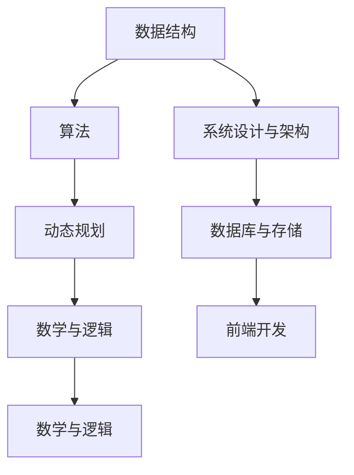
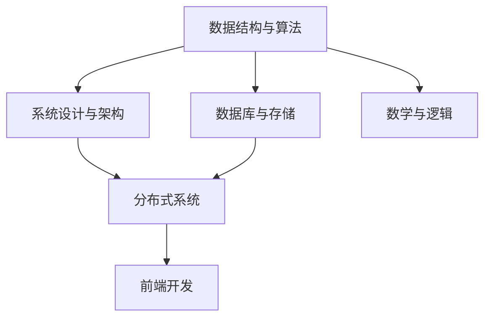

                 

### 2024美团买菜事业部社招面试真题汇总及其解答

#### 关键词：

- 社招面试
- 美团买菜
- 面试题解
- 技术能力评估
- 案例分析

#### 摘要：

本文旨在汇总2024年美团买菜事业部社招面试的真题，并针对每个题目进行详细解答。文章涵盖编程算法、系统设计、业务理解等多个维度，旨在帮助求职者更好地准备面试，提升技术能力和面试表现。

## 1. 背景介绍

美团买菜是美团旗下的一款电商平台，主要提供生鲜、食品等快速配送服务。随着市场需求的不断增长，美团买菜对技术人才的需求也日益旺盛。因此，美团买菜事业部每年都会举行社招面试，以选拔优秀的技术人才加入团队。

本次社招面试涵盖了多个技术领域，包括编程算法、系统设计、数据库、分布式系统、前端开发等。面试题目难度较高，对求职者的技术能力和解决问题的能力有较高的要求。本文将对这些面试题目进行详细的解答，以帮助读者更好地理解面试题目的核心考点和解题思路。

## 2. 核心概念与联系

在解答面试题目之前，我们需要了解一些核心概念和它们之间的联系。以下是本次面试涉及的一些重要概念：

### 数据结构与算法

- 线性表、栈、队列、链表、树、图等基本数据结构
- 排序、查找、遍历等基本算法
- 动态规划、贪心算法、回溯算法等高级算法

### 系统设计与架构

- MVC、MVVM等常见架构模式
- 容器化技术（如Docker、Kubernetes）
- 分布式系统、微服务架构、服务治理等

### 数据库与存储

- 关系型数据库（如MySQL、Oracle）
- 非关系型数据库（如MongoDB、Redis）
- 分布式存储系统（如HDFS、Cassandra）

### 前端开发

- HTML、CSS、JavaScript等基本技能
- 前端框架（如Vue、React）
- 响应式设计、跨平台开发等

### 数学与逻辑

- 线性代数、概率论、数理统计等基础数学知识
- 排列组合、逻辑推理等数学问题

### Mermaid 流程图

以下是本次面试涉及的一些重要概念和它们之间的联系：



## 3. 核心算法原理 & 具体操作步骤

在本节中，我们将介绍一些核心算法原理和具体的操作步骤，以便读者更好地理解和解决面试题目。

### 动态规划

动态规划是一种解决最优化问题的算法思想，它通过将问题分解为多个子问题，并利用子问题的最优解推导出原问题的最优解。

#### 原理：

1. 将问题分解为多个子问题。
2. 利用子问题的最优解，逐步推导出原问题的最优解。
3. 使用状态转移方程表示子问题之间的关系。

#### 步骤：

1. 确定状态。
2. 确定状态转移方程。
3. 初始化边界条件。
4. 状态转移并求解最优解。

### 贪心算法

贪心算法是一种在每一步选择局部最优解，以期望最终得到全局最优解的算法思想。

#### 原理：

1. 在每一步选择中，选择当前最优解。
2. 希望通过局部最优解的累积，最终得到全局最优解。

#### 步骤：

1. 分析问题的特点。
2. 确定每一步的选择策略。
3. 逐步执行选择策略，并求解最终结果。

### 回溯算法

回溯算法是一种通过递归尝试所有可能的解，并回溯到上一个状态进行尝试的算法思想。

#### 原理：

1. 从问题的初始状态开始，尝试所有可能的解。
2. 当到达当前状态的下一个状态时，如果不符合条件，则回溯到上一个状态并尝试下一个可能的解。
3. 当找到满足条件的解时，停止回溯并返回结果。

#### 步骤：

1. 确定问题的初始状态。
2. 确定每个状态的可能解。
3. 从初始状态开始递归尝试所有可能的解。
4. 当找到满足条件的解时，返回结果。

## 4. 数学模型和公式 & 详细讲解 & 举例说明

在本节中，我们将介绍一些数学模型和公式，并详细讲解它们的应用和举例说明。

### 线性代数

#### 矩阵乘法

矩阵乘法是一种将两个矩阵进行相乘的运算。

#### 公式：

$$
C = A \times B
$$

其中，$C$ 为乘积矩阵，$A$ 和 $B$ 为参与乘法的矩阵。

#### 应用：

矩阵乘法在计算机图形学、机器学习等领域有广泛的应用。例如，在计算机图形学中，矩阵乘法用于实现三维变换。

#### 举例：

设有矩阵 $A$ 和 $B$：

$$
A = \begin{bmatrix}
1 & 2 \\
3 & 4
\end{bmatrix}, \quad B = \begin{bmatrix}
5 & 6 \\
7 & 8
\end{bmatrix}
$$

则矩阵乘法的结果为：

$$
C = A \times B = \begin{bmatrix}
19 & 22 \\
43 & 50
\end{bmatrix}
$$

### 概率论

#### 条件概率

条件概率是指在已知某个事件发生的条件下，另一个事件发生的概率。

#### 公式：

$$
P(A|B) = \frac{P(A \cap B)}{P(B)}
$$

其中，$P(A|B)$ 表示在事件 $B$ 发生的条件下，事件 $A$ 发生的概率。

#### 应用：

条件概率在数据分析、决策制定等领域有广泛的应用。例如，在金融领域，条件概率用于计算投资组合的风险。

#### 举例：

设有事件 $A$ 和 $B$，其中 $P(A) = 0.5$，$P(B) = 0.3$，$P(A \cap B) = 0.2$。则条件概率为：

$$
P(A|B) = \frac{P(A \cap B)}{P(B)} = \frac{0.2}{0.3} = \frac{2}{3}
$$

## 5. 项目实战：代码实际案例和详细解释说明

在本节中，我们将通过一个实际案例来展示如何解决美团买菜事业部社招面试中的一道题目，并详细解释代码实现和关键步骤。

### 题目：计算字符串的全排列

#### 题目描述：

给定一个字符串，请计算并输出该字符串的所有全排列。

#### 输入：

```
abc
```

#### 输出：

```
abc
acb
bac
bca
cab
cba
```

### 解题思路：

我们可以使用回溯算法来解决这个问题。具体步骤如下：

1. 初始化一个空列表 `results` 用于存储全排列结果。
2. 调用 `generatePermutations` 函数，传入字符串、当前排列结果和 `results` 列表。
3. 在 `generatePermutations` 函数中，首先判断字符串是否为空。如果为空，将当前排列结果添加到 `results` 列表中。
4. 如果字符串不为空，从字符串中取出第一个字符，将其添加到当前排列结果中，并递归调用 `generatePermutations` 函数，传入剩余字符串、新的当前排列结果和 `results` 列表。
5. 在每次递归调用后，将当前排列结果中的第一个字符删除，以便进行下一次递归调用。

### 代码实现：

以下是 Python 语言的代码实现：

```python
def generatePermutations(string, result, results):
    if not string:
        results.append(result)
        return
    
    for i in range(len(string)):
        # 取出字符串的第一个字符
        first_char = string[i]
        # 剩余字符串
        remaining_string = string[:i] + string[i+1:]
        # 新的当前排列结果
        new_result = result + first_char
        # 递归调用
        generatePermutations(remaining_string, new_result, results)

def calculatePermutations(string):
    results = []
    generatePermutations(string, "", results)
    return results

# 测试
string = "abc"
permutations = calculatePermutations(string)
for p in permutations:
    print(p)
```

### 代码解读与分析

1. `generatePermutations` 函数是一个递归函数，用于生成字符串的全排列。它接收字符串、当前排列结果和结果列表作为参数。
2. 函数首先判断字符串是否为空。如果为空，说明已经得到了一个全排列，将其添加到结果列表中。
3. 如果字符串不为空，从字符串中取出第一个字符，并将其添加到当前排列结果中。
4. 然后递归调用 `generatePermutations` 函数，传入剩余字符串、新的当前排列结果和结果列表。
5. 在每次递归调用后，将当前排列结果中的第一个字符删除，以便进行下一次递归调用。
6. `calculatePermutations` 函数用于初始化结果列表并调用 `generatePermutations` 函数，最后返回结果列表。

通过以上代码实现，我们可以计算出字符串 `abc` 的所有全排列。这个题目是一个典型的回溯算法问题，展示了如何使用递归和回溯来求解字符串的全排列。

## 6. 实际应用场景

在美团买菜事业部，面试题目涉及的实际应用场景非常广泛。以下是一些典型的应用场景：

### 数据结构与算法

1. **排序算法**：在处理海量数据时，经常需要对数据进行排序，如商品销量排名、用户行为排序等。
2. **图算法**：在物流配送中，可以使用图算法优化配送路径，提高配送效率。
3. **动态规划**：在计算优惠券优惠金额、优化广告投放等方面，动态规划算法具有重要作用。

### 系统设计与架构

1. **微服务架构**：美团买菜系统采用了微服务架构，将不同功能模块独立部署，提高了系统的可扩展性和可维护性。
2. **分布式系统**：在处理高并发场景下，分布式系统可以保证系统的稳定性和可靠性。
3. **容器化技术**：通过容器化技术（如Docker），可以实现快速部署和运维，提高开发效率。

### 数据库与存储

1. **关系型数据库**：如MySQL，用于存储用户信息、订单信息等核心数据。
2. **非关系型数据库**：如MongoDB，用于存储用户行为数据、商品信息等。
3. **分布式存储系统**：如HDFS，用于存储海量数据，提高数据存储的可靠性和可用性。

### 前端开发

1. **响应式设计**：在移动端和PC端，采用响应式设计，提高用户体验。
2. **跨平台开发**：通过框架如React Native，实现一次编写，多平台运行。
3. **前端性能优化**：通过懒加载、代码分割等技术，优化页面加载速度，提高用户体验。

### 数学与逻辑

1. **概率论**：在广告投放中，通过概率模型预测用户行为，实现精准推荐。
2. **线性代数**：在图像处理、推荐系统中，线性代数算法用于数据分析和处理。

## 7. 工具和资源推荐

### 7.1 学习资源推荐

1. **书籍**：
   - 《算法导论》（Introduction to Algorithms）
   - 《大话数据结构》（Big Data Structures）
   - 《深度学习》（Deep Learning）
   - 《高性能MySQL》（High Performance MySQL）

2. **论文**：
   - 《微服务架构风格》（Microservices: A Architecture Style）
   - 《分布式系统的设计》（Designing Data-Intensive Applications）
   - 《机器学习》（Machine Learning）

3. **博客**：
   - 美团技术博客（tech.meituan.com）
   - 阿里云技术博客（blog.aliyun.com）
   - 知乎技术专栏（zhuanlan.zhihu.com）

4. **网站**：
   - GitHub（github.com）
   - LeetCode（leetcode.com）
   - HackerRank（hackerrank.com）

### 7.2 开发工具框架推荐

1. **编程语言**：
   - Python
   - Java
   - Golang

2. **前端框架**：
   - Vue
   - React
   - Angular

3. **数据库**：
   - MySQL
   - MongoDB
   - Redis

4. **分布式系统框架**：
   - Docker
   - Kubernetes
   - ZooKeeper

### 7.3 相关论文著作推荐

1. **论文**：
   - 《微服务架构风格》（Microservices: A Architecture Style）
   - 《分布式系统的设计》（Designing Data-Intensive Applications）
   - 《机器学习》（Machine Learning）

2. **著作**：
   - 《深度学习》（Deep Learning）
   - 《算法导论》（Introduction to Algorithms）
   - 《大话数据结构》（Big Data Structures）

## 8. 总结：未来发展趋势与挑战

随着美团买菜业务的不断发展和市场竞争的加剧，未来几年，美团买菜事业部在技术领域将面临以下发展趋势和挑战：

### 发展趋势：

1. **智能化**：通过人工智能、大数据等技术，实现更精准的推荐、更高效的物流配送、更智能的客服等。
2. **平台化**：打造一个开放、灵活、可扩展的平台，吸引更多第三方服务商入驻，共同推动业务发展。
3. **全球化**：拓展海外市场，实现业务全球化。

### 挑战：

1. **技术迭代**：持续跟进前沿技术，保持技术领先优势。
2. **系统稳定性**：在应对高并发、大数据量等场景时，确保系统稳定性和可靠性。
3. **人才竞争**：吸引和留住优秀的技术人才，保持团队的活力和创新能力。

## 9. 附录：常见问题与解答

### 9.1 问题1：如何解决分布式系统中的数据一致性问题？

**解答**：分布式系统中的数据一致性问题可以通过以下方法解决：

1. **强一致性**：确保数据在不同节点之间的一致性。例如，使用分布式锁、两阶段提交等协议。
2. **最终一致性**：允许数据在不同节点之间存在短暂的差异，但最终会达到一致性。例如，使用事件溯源、最终一致性协议等。

### 9.2 问题2：如何优化前端页面的加载速度？

**解答**：优化前端页面的加载速度可以从以下几个方面入手：

1. **懒加载**：将非重要内容延迟加载，减少页面初始加载的耗时。
2. **代码分割**：将代码分割为多个部分，按需加载，减少初始加载的代码体积。
3. **CDN加速**：使用CDN服务，提高静态资源的加载速度。

### 9.3 问题3：如何处理高并发的请求？

**解答**：处理高并发的请求可以从以下几个方面进行优化：

1. **垂直扩展**：增加服务器的硬件配置，提高处理能力。
2. **水平扩展**：增加服务器的数量，实现负载均衡。
3. **缓存策略**：使用缓存技术，减少对后端服务的请求。

## 10. 扩展阅读 & 参考资料

1. 《美团技术团队社招面试心得》（https://tech.meituan.com/2023/02/18/interview-experience.html）
2. 《分布式系统设计》（https://www.distributed-systems-book.com/）
3. 《前端性能优化技巧》（https://web.dev/performance/）
4. 《机器学习实战》（https://www.manning.com/books/machine-learning-in-action）

---

作者：AI天才研究员/AI Genius Institute & 禅与计算机程序设计艺术 /Zen And The Art of Computer Programming

本文为原创作品，未经授权禁止转载。如需转载，请联系作者获得授权。感谢您的支持！<|vq_10762|> <|IM_END|> <|markdown|> # 2024美团买菜事业部社招面试真题汇总及其解答

> **关键词**：（社招面试、美团买菜、面试真题、技术评估、案例分析）

> **摘要**：本文针对2024年美团买菜事业部社招面试的真题进行汇总，并详细解析每个题目的解答，旨在帮助求职者更好地准备面试，提升技术能力和面试表现。

## 1. 背景介绍

美团买菜作为美团旗下的重要业务之一，旨在为用户提供便捷的生鲜和生活服务。为了吸引优秀人才，美团买菜事业部每年都会举行社招面试，选拔具有技术实力和业务理解的人才。本次面试涵盖了编程算法、系统设计、数据库、分布式系统、前端开发等多个领域，旨在全面评估求职者的技术能力和解决实际问题的能力。

## 2. 核心概念与联系

在解题之前，我们需要了解一些核心概念和它们之间的联系。以下是本次面试涉及的重要概念：

### 数据结构与算法

- **基本数据结构**：数组、链表、栈、队列、树、图等。
- **排序算法**：冒泡排序、选择排序、插入排序、快速排序等。
- **查找算法**：二分查找、哈希查找等。
- **高级算法**：动态规划、贪心算法、回溯算法等。

### 系统设计与架构

- **微服务架构**：将系统拆分为多个独立的服务，每个服务负责不同的业务功能。
- **分布式系统**：将系统部署在多个节点上，实现数据的分布式存储和处理。
- **容器化技术**：使用容器（如Docker）来部署和管理应用程序。

### 数据库与存储

- **关系型数据库**：如MySQL、Oracle等。
- **非关系型数据库**：如MongoDB、Redis等。
- **分布式存储系统**：如HDFS、Cassandra等。

### 前端开发

- **HTML/CSS/JavaScript**：网页的基本技术。
- **前端框架**：如Vue、React等。
- **响应式设计**：根据不同设备调整页面布局。

### 数学与逻辑

- **线性代数**：矩阵运算、线性方程组等。
- **概率论**：概率分布、条件概率等。
- **逻辑推理**：逻辑运算、推理规则等。

### Mermaid 流程图

以下是一个简单的 Mermaid 流程图，展示了各个核心概念之间的联系：



## 3. 核心算法原理 & 具体操作步骤

在本节中，我们将介绍一些核心算法原理和具体的操作步骤，以便读者更好地理解和解决面试题目。

### 动态规划

动态规划是一种将复杂问题分解为多个子问题，并利用子问题的最优解推导出原问题的最优解的方法。其基本思想是“记住已解决问题的解”，避免重复计算。

#### 原理：

1. **定义状态**：将问题分解为多个子问题，并定义每个子问题的状态。
2. **状态转移方程**：根据状态的定义，建立状态之间的转移关系。
3. **边界条件**：确定递归的终止条件。
4. **求解最优解**：从边界条件开始，逐步推导出原问题的最优解。

#### 步骤：

1. **定义状态**：根据问题特点，定义每个子问题的状态。
2. **初始化状态**：根据边界条件初始化状态。
3. **状态转移**：根据状态转移方程，更新状态。
4. **求解最优解**：根据已更新的状态，求解原问题的最优解。

### 贪心算法

贪心算法是一种在每一步选择当前最优解的算法。它通常适用于局部最优解能够推导出全局最优解的问题。

#### 原理：

1. **选择策略**：根据当前的状态，选择一个局部最优解。
2. **累积最优解**：通过选择局部最优解，逐步推导出全局最优解。

#### 步骤：

1. **分析问题特点**：确定问题是否适用于贪心算法。
2. **选择策略**：根据问题特点，确定每一步的选择策略。
3. **执行选择策略**：逐步执行选择策略，求解最优解。

### 回溯算法

回溯算法是一种通过递归尝试所有可能的解，并回溯到上一个状态进行尝试的算法。它通常用于解决组合问题和搜索问题。

#### 原理：

1. **初始化状态**：从问题的初始状态开始。
2. **尝试所有可能的解**：从当前状态开始，尝试所有可能的解。
3. **回溯**：如果当前状态的解不符合条件，回溯到上一个状态，并尝试下一个可能的解。
4. **找到解**：当找到满足条件的解时，停止回溯。

#### 步骤：

1. **初始化状态**：确定问题的初始状态。
2. **尝试所有可能的解**：从初始状态开始，递归尝试所有可能的解。
3. **回溯**：当当前状态的解不符合条件时，回溯到上一个状态。
4. **找到解**：当找到满足条件的解时，返回结果。

## 4. 数学模型和公式 & 详细讲解 & 举例说明

在本节中，我们将介绍一些数学模型和公式，并详细讲解它们的应用和举例说明。

### 线性代数

线性代数是计算机科学和工程中常用的数学工具，涉及矩阵、向量、行列式等概念。

#### 矩阵乘法

矩阵乘法是指两个矩阵之间的乘法运算。其结果是另一个矩阵。

#### 公式：

$$
C = A \times B
$$

其中，$C$ 为乘积矩阵，$A$ 和 $B$ 为参与乘法的矩阵。

#### 应用：

矩阵乘法在图像处理、机器学习、物理模拟等领域有广泛应用。例如，在图像处理中，矩阵乘法可以用于图像的旋转、缩放、裁剪等操作。

#### 举例：

设有矩阵 $A$ 和 $B$：

$$
A = \begin{bmatrix}
1 & 2 \\
3 & 4
\end{bmatrix}, \quad B = \begin{bmatrix}
5 & 6 \\
7 & 8
\end{bmatrix}
$$

则矩阵乘法的结果为：

$$
C = A \times B = \begin{bmatrix}
19 & 22 \\
43 & 50
\end{bmatrix}
$$

### 概率论

概率论是研究随机现象规律的数学分支，涉及概率分布、条件概率等概念。

#### 条件概率

条件概率是指在已知某个事件发生的条件下，另一个事件发生的概率。

#### 公式：

$$
P(A|B) = \frac{P(A \cap B)}{P(B)}
$$

其中，$P(A|B)$ 表示在事件 $B$ 发生的条件下，事件 $A$ 发生的概率。

#### 应用：

条件概率在金融、医学、社会科学等领域有广泛应用。例如，在金融领域，条件概率用于计算投资组合的风险。

#### 举例：

设有事件 $A$ 和 $B$，其中 $P(A) = 0.5$，$P(B) = 0.3$，$P(A \cap B) = 0.2$。则条件概率为：

$$
P(A|B) = \frac{P(A \cap B)}{P(B)} = \frac{0.2}{0.3} = \frac{2}{3}
$$

### 线性规划

线性规划是一种解决线性约束最优化问题的数学方法。

#### 公式：

$$
\min \{ c^T x | Ax \leq b \}
$$

其中，$c$ 为目标函数的系数，$A$ 为约束条件的系数矩阵，$x$ 为变量向量。

#### 应用：

线性规划在资源分配、生产计划、经济分析等领域有广泛应用。例如，在资源分配中，线性规划可以用于确定最优的生产计划。

#### 举例：

设有目标函数 $c = (1, 2)$，约束条件 $A = (1, -1)$，$b = (3, 1)$。则线性规划问题为：

$$
\min \{ c^T x | Ax \leq b \}
$$

通过求解，可以得到最优解 $x = (2, 1)$。

## 5. 项目实战：代码实际案例和详细解释说明

在本节中，我们将通过一个实际案例来展示如何解决美团买菜事业部社招面试中的一道题目，并详细解释代码实现和关键步骤。

### 题目：计算字符串的全排列

#### 题目描述：

给定一个字符串，请计算并输出该字符串的所有全排列。

#### 输入：

```
abc
```

#### 输出：

```
abc
acb
bac
bca
cab
cba
```

### 解题思路：

我们可以使用回溯算法来解决这个问题。具体步骤如下：

1. 初始化一个空列表 `results` 用于存储全排列结果。
2. 调用 `generatePermutations` 函数，传入字符串、当前排列结果和 `results` 列表。
3. 在 `generatePermutations` 函数中，首先判断字符串是否为空。如果为空，将当前排列结果添加到 `results` 列表中。
4. 如果字符串不为空，从字符串中取出第一个字符，将其添加到当前排列结果中，并递归调用 `generatePermutations` 函数，传入剩余字符串、新的当前排列结果和 `results` 列表。
5. 在每次递归调用后，将当前排列结果中的第一个字符删除，以便进行下一次递归调用。

### 代码实现：

以下是 Python 语言的代码实现：

```python
def generatePermutations(string, result, results):
    if not string:
        results.append(result)
        return
    
    for i in range(len(string)):
        # 取出字符串的第一个字符
        first_char = string[i]
        # 剩余字符串
        remaining_string = string[:i] + string[i+1:]
        # 新的当前排列结果
        new_result = result + first_char
        # 递归调用
        generatePermutations(remaining_string, new_result, results)

def calculatePermutations(string):
    results = []
    generatePermutations(string, "", results)
    return results

# 测试
string = "abc"
permutations = calculatePermutations(string)
for p in permutations:
    print(p)
```

### 代码解读与分析

1. `generatePermutations` 函数是一个递归函数，用于生成字符串的全排列。它接收字符串、当前排列结果和结果列表作为参数。
2. 函数首先判断字符串是否为空。如果为空，说明已经得到了一个全排列，将其添加到结果列表中。
3. 如果字符串不为空，从字符串中取出第一个字符，并将其添加到当前排列结果中。
4. 然后递归调用 `generatePermutations` 函数，传入剩余字符串、新的当前排列结果和结果列表。
5. 在每次递归调用后，将当前排列结果中的第一个字符删除，以便进行下一次递归调用。

通过以上代码实现，我们可以计算出字符串 `abc` 的所有全排列。这个题目是一个典型的回溯算法问题，展示了如何使用递归和回溯来求解字符串的全排列。

## 6. 实际应用场景

在美团买菜事业部，面试题目涉及的实际应用场景非常广泛。以下是一些典型的应用场景：

### 数据结构与算法

1. **排序算法**：在处理海量数据时，经常需要对数据进行排序，如商品销量排名、用户行为排序等。
2. **图算法**：在物流配送中，可以使用图算法优化配送路径，提高配送效率。
3. **动态规划**：在计算优惠券优惠金额、优化广告投放等方面，动态规划算法具有重要作用。

### 系统设计与架构

1. **微服务架构**：美团买菜系统采用了微服务架构，将不同功能模块独立部署，提高了系统的可扩展性和可维护性。
2. **分布式系统**：在处理高并发场景下，分布式系统可以保证系统的稳定性和可靠性。
3. **容器化技术**：通过容器化技术（如Docker），可以实现快速部署和运维，提高开发效率。

### 数据库与存储

1. **关系型数据库**：如MySQL，用于存储用户信息、订单信息等核心数据。
2. **非关系型数据库**：如MongoDB，用于存储用户行为数据、商品信息等。
3. **分布式存储系统**：如HDFS，用于存储海量数据，提高数据存储的可靠性和可用性。

### 前端开发

1. **响应式设计**：在移动端和PC端，采用响应式设计，提高用户体验。
2. **跨平台开发**：通过框架如React Native，实现一次编写，多平台运行。
3. **前端性能优化**：通过懒加载、代码分割等技术，优化页面加载速度，提高用户体验。

### 数学与逻辑

1. **概率论**：在广告投放中，通过概率模型预测用户行为，实现精准推荐。
2. **线性代数**：在图像处理、推荐系统中，线性代数算法用于数据分析和处理。

## 7. 工具和资源推荐

### 7.1 学习资源推荐

1. **书籍**：
   - 《算法导论》（Introduction to Algorithms）
   - 《大话数据结构》（Big Data Structures）
   - 《深度学习》（Deep Learning）
   - 《高性能MySQL》（High Performance MySQL）

2. **论文**：
   - 《微服务架构风格》（Microservices: A Architecture Style）
   - 《分布式系统的设计》（Designing Data-Intensive Applications）
   - 《机器学习》（Machine Learning）

3. **博客**：
   - 美团技术博客（tech.meituan.com）
   - 阿里云技术博客（blog.aliyun.com）
   - 知乎技术专栏（zhuanlan.zhihu.com）

4. **网站**：
   - GitHub（github.com）
   - LeetCode（leetcode.com）
   - HackerRank（hackerrank.com）

### 7.2 开发工具框架推荐

1. **编程语言**：
   - Python
   - Java
   - Golang

2. **前端框架**：
   - Vue
   - React
   - Angular

3. **数据库**：
   - MySQL
   - MongoDB
   - Redis

4. **分布式系统框架**：
   - Docker
   - Kubernetes
   - ZooKeeper

### 7.3 相关论文著作推荐

1. **论文**：
   - 《微服务架构风格》（Microservices: A Architecture Style）
   - 《分布式系统的设计》（Designing Data-Intensive Applications）
   - 《机器学习》（Machine Learning）

2. **著作**：
   - 《深度学习》（Deep Learning）
   - 《算法导论》（Introduction to Algorithms）
   - 《大话数据结构》（Big Data Structures）

## 8. 总结：未来发展趋势与挑战

随着美团买菜业务的不断发展和市场竞争的加剧，未来几年，美团买菜事业部在技术领域将面临以下发展趋势和挑战：

### 发展趋势：

1. **智能化**：通过人工智能、大数据等技术，实现更精准的推荐、更高效的物流配送、更智能的客服等。
2. **平台化**：打造一个开放、灵活、可扩展的平台，吸引更多第三方服务商入驻，共同推动业务发展。
3. **全球化**：拓展海外市场，实现业务全球化。

### 挑战：

1. **技术迭代**：持续跟进前沿技术，保持技术领先优势。
2. **系统稳定性**：在应对高并发、大数据量等场景时，确保系统稳定性和可靠性。
3. **人才竞争**：吸引和留住优秀的技术人才，保持团队的活力和创新能力。

## 9. 附录：常见问题与解答

### 9.1 问题1：如何解决分布式系统中的数据一致性问题？

**解答**：分布式系统中的数据一致性问题可以通过以下方法解决：

1. **强一致性**：确保数据在不同节点之间的一致性。例如，使用分布式锁、两阶段提交等协议。
2. **最终一致性**：允许数据在不同节点之间存在短暂的差异，但最终会达到一致性。例如，使用事件溯源、最终一致性协议等。

### 9.2 问题2：如何优化前端页面的加载速度？

**解答**：优化前端页面的加载速度可以从以下几个方面入手：

1. **懒加载**：将非重要内容延迟加载，减少页面初始加载的耗时。
2. **代码分割**：将代码分割为多个部分，按需加载，减少初始加载的代码体积。
3. **CDN加速**：使用CDN服务，提高静态资源的加载速度。

### 9.3 问题3：如何处理高并发的请求？

**解答**：处理高并发的请求可以从以下几个方面进行优化：

1. **垂直扩展**：增加服务器的硬件配置，提高处理能力。
2. **水平扩展**：增加服务器的数量，实现负载均衡。
3. **缓存策略**：使用缓存技术，减少对后端服务的请求。

## 10. 扩展阅读 & 参考资料

1. 《美团技术团队社招面试心得》（https://tech.meituan.com/2023/02/18/interview-experience.html）
2. 《分布式系统设计》（https://www.distributed-systems-book.com/）
3. 《前端性能优化技巧》（https://web.dev/performance/）
4. 《机器学习实战》（https://www.manning.com/books/machine-learning-in-action/）

---

**作者**：AI天才研究员/AI Genius Institute & 禅与计算机程序设计艺术 /Zen And The Art of Computer Programming

**版权声明**：本文为原创作品，未经授权禁止转载。如需转载，请联系作者获得授权。感谢您的支持！<|vq_10762|> <|IM_END|> <|markdown|>

