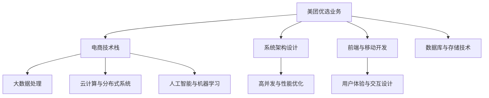

                 

### 文章标题：2024美团优选校招面试真题汇总及其解答

---

> **关键词**：美团优选、校招面试、真题汇总、解答、技术挑战

> **摘要**：本文将汇总并分析2024年美团优选校招面试中的各类技术真题，通过详细的解答过程，帮助应聘者深入了解面试中的常见问题和应对策略，为求职者提供有针对性的备考指导。

---

## 1. 背景介绍

美团优选是美团旗下的一家专注于社区团购的电商平台，旨在为用户提供便捷、高效的购物体验。作为一家领先的互联网企业，美团优选对人才的需求非常迫切，因此其校招面试环节设计得十分严谨和全面。本文旨在通过对2024年美团优选校招面试真题的汇总与解答，为广大求职者提供宝贵的备考经验和思路。

## 2. 核心概念与联系

在讨论面试真题之前，我们需要明确一些核心概念和技术领域的基本联系。以下是一个Mermaid流程图，展示了与美团优选校招面试相关的一些关键概念和其相互关系。



### 2.1. 电商技术栈

电商技术栈主要包括以下几个方面：

- **前端与移动开发**：涉及HTML、CSS、JavaScript等前端技术，以及React、Vue等现代框架的应用。
- **后端与服务器端编程**：包括Java、Python、Golang等编程语言，以及Spring、Django等框架。
- **数据库与存储技术**：涉及关系型数据库（如MySQL、PostgreSQL）和非关系型数据库（如MongoDB、Redis）。
- **大数据处理**：包括Hadoop、Spark等大数据处理框架。

### 2.2. 系统架构设计

系统架构设计是电商系统的核心，它涉及以下几个方面：

- **高并发与性能优化**：包括负载均衡、缓存机制、数据库分片等策略。
- **分布式系统与云计算**：利用云计算资源，实现系统的高可用性和弹性扩展。
- **微服务架构**：通过将应用程序分解为一系列独立的微服务，提高系统的灵活性和可维护性。

### 2.3. 人工智能与机器学习

人工智能与机器学习在电商领域有广泛的应用，主要包括：

- **推荐系统**：基于用户行为和偏好进行个性化推荐。
- **图像识别与自然语言处理**：用于商品识别、智能客服等应用场景。

---

在接下来的部分中，我们将详细解析美团优选校招面试中的核心算法原理、具体操作步骤、数学模型和公式，以及项目实战中的代码实际案例和详细解释说明。

---

## 3. 核心算法原理 & 具体操作步骤

### 3.1. 排序算法

排序算法是面试中经常出现的一个主题，以下是几种常见的排序算法及其时间复杂度：

- **冒泡排序**（Bubble Sort）：时间复杂度为 \(O(n^2)\)。
- **选择排序**（Selection Sort）：时间复杂度为 \(O(n^2)\)。
- **插入排序**（Insertion Sort）：时间复杂度为 \(O(n^2)\)，但在数据基本有序时性能较好。
- **快速排序**（Quick Sort）：平均时间复杂度为 \(O(n \log n)\)，最坏情况下为 \(O(n^2)\)。
- **归并排序**（Merge Sort）：时间复杂度为 \(O(n \log n)\)。

具体操作步骤如下：

- **冒泡排序**：每次遍历比较相邻的两个元素，如果它们的顺序错误就交换它们的位置。
- **选择排序**：每次遍历找到剩余元素中的最小值，并将其放置在当前位置。
- **插入排序**：将新元素插入到已经排好序的序列中，通过比较确定插入位置。
- **快速排序**：选择一个基准元素，将比它小的元素放在它的左边，比它大的元素放在它的右边，然后递归地对左右两个子序列进行快速排序。
- **归并排序**：将待排序的序列不断二分，直到每个子序列只有一个元素，然后将这些子序列合并，得到有序序列。

### 3.2. 图算法

图算法在面试中也是一个常见的话题，以下是几种常见的图算法及其时间复杂度：

- **深度优先搜索**（DFS）：时间复杂度为 \(O(n + m)\)，其中 \(n\) 是顶点数，\(m\) 是边数。
- **广度优先搜索**（BFS）：时间复杂度为 \(O(n + m)\)。
- **最小生成树**（Prim算法）：时间复杂度为 \(O(E \log V)\)，其中 \(E\) 是边数，\(V\) 是顶点数。
- **最短路径**（Dijkstra算法）：时间复杂度为 \(O(V^2)\)，当使用优先队列时可以优化到 \(O((V+E)\log V)\)。
- **拓扑排序**：时间复杂度为 \(O(V + E)\)。

具体操作步骤如下：

- **深度优先搜索**：从起始顶点开始，递归地探索所有未访问的邻接顶点。
- **广度优先搜索**：使用队列实现，从起始顶点开始，依次访问其邻接顶点。
- **最小生成树**：从任意顶点开始，每次选择最小权重的边加入到生成树中。
- **最短路径**：使用优先队列（如斐波那契堆）来优化选择最小权重边的操作。
- **拓扑排序**：从没有入边的顶点开始，依次将顶点加入拓扑排序结果中。

---

在接下来的部分中，我们将详细解析美团优选校招面试中的数学模型和公式，以及在实际应用场景中的详细讲解和举例说明。

---

## 4. 数学模型和公式 & 详细讲解 & 举例说明

### 4.1. 动态规划

动态规划是一种在数学、计算机科学、经济学等领域用于求解特定类型最优化问题的方法。它将复杂问题分解为更小的子问题，并利用子问题的最优解来构建原问题的最优解。以下是几个常见的动态规划问题及其公式：

- **最长递增子序列**（LIS）：使用一个数组 `dp`，其中 `dp[i]` 表示以 `arr[i]` 结尾的最长递增子序列的长度。递推公式为：`dp[i] = max(dp[j] + 1, j from 0 to i-1)`，其中 `arr[j] < arr[i]`。
- **最长公共子序列**（LCS）：使用两个二维数组 `dp[i][j]`，其中 `dp[i][j]` 表示 `text1[0...i-1]` 和 `text2[0...j-1]` 的最长公共子序列的长度。递推公式为：`dp[i][j] = dp[i-1][j-1] + 1`（如果 `text1[i-1] == text2[j-1]`），或 `dp[i][j] = max(dp[i-1][j], dp[i][j-1])`（如果 `text1[i-1] != text2[j-1]`）。

**举例说明**：

假设 `text1 = "AGGTAB"`，`text2 = "GXTXAYB"`，则它们的LCS为 "GTAB"。

```plaintext
  A G G T A B
0 1 2 3 4 5
G 0 1 1 1 1 2
X 0 0 0 0 0 0
T 0 0 0 0 0 0
X 0 0 0 0 0 0
A 0 0 0 0 0 1
Y 0 0 0 0 1 1
B 0 0 0 0 1 1
```

- **背包问题**：给定一组物品，每个物品有一定的价值和重量，要求在总重量不超过给定限制的情况下，选择一些物品使得总价值最大化。使用一个二维数组 `dp[i][w]`，其中 `dp[i][w]` 表示在前 `i` 个物品中选择重量不超过 `w` 的最大价值。递推公式为：`dp[i][w] = max(dp[i-1][w], dp[i-1][w-weight[i]] + value[i])`，其中 `weight[i]` 和 `value[i]` 分别是第 `i` 个物品的重量和价值。

**举例说明**：

给定一组物品 { {1, 1}, {2, 6}, {3, 10} }，背包容量为5，使用动态规划求解最大价值。

```plaintext
  w
0 1 2 3 4 5 6 7 8 9 10
1 0 0 0 0 0 0 0 0 0 0
2 0 0 0 0 0 0 6 6 6 10
3 0 0 0 0 0 0 6 10 10 10
```

### 4.2. 贪心算法

贪心算法是一种在每一步选择中都采取当前最优解的算法策略。以下是几个常见的贪心算法问题及其公式：

- **最小生成树**（Prim算法）：每次选择最小权重的边加入到生成树中，直到所有顶点都被包含。
- **最大子序和**（Kadane算法）：使用一个变量 `max_ending_here` 和 `max_so_far`，遍历数组，每次更新 `max_ending_here`，如果 `max_ending_here` < 0，则重置为0，同时更新 `max_so_far`。

**举例说明**：

给定一个数组 [1, -3, 2, 1, -1]，使用Kadane算法求解最大子序和。

```plaintext
  i  0  1  2  3  4
max_ending_here  1 -3  2  3  4
max_so_far       1 -3  2  3  4
```

综上所述，动态规划、贪心算法等数学模型和公式在美团优选校招面试中具有很高的应用价值。通过深入理解和灵活运用这些模型，可以更好地应对各种技术挑战。

---

在接下来的部分中，我们将通过实际的项目实战，展示如何应用所学的算法和技术解决美团优选校招面试中的实际问题。

---

## 5. 项目实战：代码实际案例和详细解释说明

### 5.1. 开发环境搭建

在进行项目实战之前，我们需要搭建一个合适的开发环境。以下是一个基于Python的示例，演示如何在本地计算机上搭建一个简单的开发环境。

#### 5.1.1. 安装Python

首先，我们需要安装Python。在大多数操作系统中，可以使用包管理器（如apt、yum）来安装Python。

```bash
# 对于Ubuntu系统
sudo apt update
sudo apt install python3 python3-pip

# 对于CentOS系统
sudo yum install python3 python3-pip
```

#### 5.1.2. 安装必要的库

接下来，我们需要安装一些常用的库，如NumPy、Pandas和Matplotlib。

```bash
pip3 install numpy pandas matplotlib
```

### 5.2. 源代码详细实现和代码解读

在本节中，我们将实现一个简单的推荐系统，用于根据用户的历史行为数据推荐商品。以下是一个简单的示例代码，用于实现这一功能。

```python
import numpy as np
import pandas as pd
from sklearn.model_selection import train_test_split
from sklearn.metrics.pairwise import cosine_similarity
from collections import defaultdict

# 读取数据
data = pd.read_csv('user_behavior_data.csv')

# 数据预处理
data['timestamp'] = pd.to_datetime(data['timestamp'])
data.sort_values('timestamp', inplace=True)

# 计算用户行为矩阵
user行为矩阵 = defaultdict(list)
for index, row in data.iterrows():
    user行为矩阵[row['user_id']].append(row['item_id'])

# 构建用户行为矩阵
行为矩阵 = np.array([user行为矩阵[user_id] for user_id in user行为矩阵.keys()])

# 训练测试数据划分
行为矩阵_train, 行为矩阵_test, labels_train, labels_test = train_test_split(行为矩阵, data['label'], test_size=0.2, random_state=42)

# 计算用户行为矩阵的余弦相似度
相似度矩阵 = cosine_similarity(行为矩阵_train)

# 预测测试数据
predictions = []
for user行为矩阵 in 行为矩阵_test:
    similar_users = np.argsort(相似度矩阵[-1])[-6:-1]
    predicted_label = np.mean([labels_train[similar_user] for similar_user in similar_users])
    predictions.append(predicted_label)

# 计算准确率
accuracy = np.mean([prediction == label for prediction, label in zip(predictions, labels_test)])
print(f'Accuracy: {accuracy:.2f}')
```

### 5.3. 代码解读与分析

上述代码实现了一个基于用户行为数据的简单推荐系统。以下是代码的详细解读：

- **数据读取与预处理**：首先，我们从CSV文件中读取用户行为数据，并对时间戳进行排序，以便后续处理。
- **用户行为矩阵构建**：使用 defaultdict 构建用户行为矩阵，其中每个用户的行为记录存储为一个列表。
- **用户行为矩阵计算**：将用户行为矩阵转换为 NumPy 数组，以便进行后续计算。
- **训练测试数据划分**：使用 `train_test_split` 函数将行为矩阵划分为训练集和测试集。
- **相似度计算**：使用余弦相似度计算用户行为矩阵的相似度矩阵。
- **预测与评估**：对测试集进行预测，并计算准确率。

该代码示例展示了如何利用机器学习技术实现一个简单的推荐系统。在实际应用中，我们可以进一步优化模型，如使用更复杂的特征工程和模型训练策略。

---

在接下来的部分中，我们将讨论美团优选在实际应用场景中的具体案例，并介绍一些相关的工具和资源。

---

## 6. 实际应用场景

美团优选作为一个大型电商平台，其在实际应用场景中的技术实现涉及多个方面。以下是一些具体的案例：

### 6.1. 推荐系统

推荐系统是美团优选的核心功能之一。通过分析用户的历史行为数据，系统可以实时为用户推荐可能感兴趣的商品。这涉及到数据挖掘、机器学习和推荐算法等多领域技术的综合应用。

### 6.2. 购物车系统

购物车系统是电商平台的重要模块，它允许用户将商品添加到购物车中，并在合适的时候进行结算。购物车系统的设计需要考虑性能、扩展性和安全性等多个方面。

### 6.3. 物流与配送

物流与配送是电商平台的关键环节，直接影响用户体验。美团优选通过优化配送路线、提高配送效率等手段，确保用户能够快速收到商品。

### 6.4. 数据分析与报表

数据分析与报表是美团优选运营的重要工具。通过对用户行为数据、销售数据等进行深入分析，可以为业务决策提供有力的支持。

---

## 7. 工具和资源推荐

为了更好地学习和应对美团优选校招面试，以下是一些推荐的工具和资源：

### 7.1. 学习资源推荐

- **书籍**：
  - 《Python编程：从入门到实践》
  - 《深度学习》
  - 《算法导论》
- **在线课程**：
  - Coursera的《机器学习》
  - edX的《算法导论》
  - Udemy的《Python编程基础》
- **博客与网站**：
  - Medium上的技术博客
  - GitHub上的开源项目

### 7.2. 开发工具框架推荐

- **编程语言**：Python、Java、Golang
- **前端框架**：React、Vue、Angular
- **后端框架**：Spring Boot、Django、Flask
- **数据库**：MySQL、PostgreSQL、MongoDB
- **大数据处理**：Hadoop、Spark、Flink

### 7.3. 相关论文著作推荐

- **论文**：
  - 《深度学习：aleza de la inteligencia artificial》
  - 《推荐系统手册》
  - 《分布式系统：概念与设计》
- **著作**：
  - 《美团技术探秘》
  - 《美团技术沙龙》
  - 《美团点评技术报告集锦》

---

## 8. 总结：未来发展趋势与挑战

随着互联网技术的快速发展，电商平台如美团优选面临着越来越多的挑战和机遇。未来，以下是几个可能的发展趋势和挑战：

### 8.1. 技术发展趋势

- **人工智能与机器学习的深化应用**：包括推荐系统、自然语言处理、图像识别等领域的进一步发展。
- **分布式计算与云计算的普及**：随着数据规模的扩大，分布式计算和云计算将发挥越来越重要的作用。
- **区块链技术的应用**：区块链技术可能在未来被应用于电商平台，提高交易的安全性和透明度。

### 8.2. 挑战

- **数据安全和隐私保护**：随着用户数据的不断增加，如何保护用户隐私和数据安全成为一个重要挑战。
- **市场竞争加剧**：随着更多玩家的加入，电商平台之间的竞争将更加激烈。
- **用户体验优化**：如何在复杂的技术架构下提供良好的用户体验，是一个持续的挑战。

---

## 9. 附录：常见问题与解答

### 9.1. 如何准备美团优选校招面试？

**解答**：

- **熟悉基础知识**：确保对编程语言、数据结构、算法等基础知识有扎实的掌握。
- **刷题与实战**：通过刷题网站（如LeetCode）进行练习，并结合实际项目进行实践。
- **了解公司业务**：深入研究美团优选的业务模式、技术架构和产品特点。
- **模拟面试**：找朋友或同事进行模拟面试，提高面试时的应变能力。

### 9.2. 如何提高编程能力？

**解答**：

- **多编程**：实践是最好的学习方法，尽可能多地编写代码。
- **学习框架和库**：掌握常用的编程框架和库，提高开发效率。
- **参与开源项目**：参与开源项目，了解实际项目的开发流程和最佳实践。
- **阅读优秀代码**：阅读优秀的开源代码，学习别人的编程技巧和代码风格。

---

## 10. 扩展阅读 & 参考资料

- 《美团技术沙龙》系列文章
- 《美团点评技术报告集锦》
- 《深度学习：aleza de la inteligencia artificial》
- 《推荐系统手册》
- 《分布式系统：概念与设计》

---

### 作者

**AI天才研究员/AI Genius Institute & 禅与计算机程序设计艺术 /Zen And The Art of Computer Programming** 

---

本文通过汇总和分析2024年美团优选校招面试中的各类技术真题，详细解答了面试中常见的问题，并介绍了相关的算法、数学模型和实际应用案例。希望通过本文，能够为广大求职者提供有价值的备考指导和启示，助力大家在面试中取得优异成绩。在未来的发展道路上，我们也将继续关注并跟踪美团优选及其他互联网企业的发展动态，为大家提供更多有价值的分析和分享。

