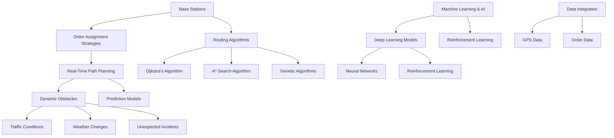

                 

### 背景介绍

美团外卖作为中国领先的在线外卖平台，其业务的成功离不开背后的技术支持。在2025年，美团外卖进一步拓展了其业务版图，推出了社招配送算法工程师的职位。这个职位不仅需要应聘者具备扎实的算法基础，还要求其在配送优化和实时路径规划等方面有深入的理解和丰富的实践经验。

本文旨在帮助准备参加美团外卖2025社招配送算法工程师面试的应聘者，通过逐步分析面试题，了解美团外卖在配送算法方面的核心技术和挑战。文章将分为以下几个部分：

1. **核心概念与联系**：介绍配送算法中涉及的关键概念和架构。
2. **核心算法原理 & 具体操作步骤**：详细讲解配送算法的基本原理和实施步骤。
3. **数学模型和公式 & 详细讲解 & 举例说明**：解析配送算法中的数学模型和公式，并提供实际案例说明。
4. **项目实战：代码实际案例和详细解释说明**：通过实际代码案例展示算法应用。
5. **实际应用场景**：讨论配送算法在不同场景中的应用。
6. **工具和资源推荐**：推荐学习资源和开发工具。
7. **总结：未来发展趋势与挑战**：预测配送算法的未来发展和面临的挑战。
8. **附录：常见问题与解答**：解答应聘者可能遇到的问题。
9. **扩展阅读 & 参考资料**：提供进一步的阅读材料和资源。

通过这些部分的逐步分析，读者将能够深入理解美团外卖配送算法的核心技术和实践应用，为面试做好充分的准备。

### Core Concepts and Connections

To lay the foundation for our discussion, let's delve into the core concepts and connections that are pivotal to delivery algorithm development. The following are key concepts that are fundamental to understanding the intricacies of delivery algorithms:

1. **Delivery Network Design**:
   - **Base Stations**: These are strategic locations from which delivery agents can pick up orders. Efficiently placing base stations minimizes the total delivery distance.
   - **Routing Algorithms**: These determine the optimal path from a base station to a delivery location. Common routing algorithms include Dijkstra’s algorithm, A* search algorithm, and genetic algorithms.

2. **Order Assignment Strategies**:
   - **Load Balancing**: This ensures that the workload across delivery agents is distributed evenly to prevent overworked or underutilized agents.
   - **Time Windows**: These specify the time slots within which orders must be delivered. Matching delivery agents to orders within acceptable time windows is critical.

3. **Real-Time Path Planning**:
   - **Dynamic Obstacles**: Traffic conditions, weather changes, and unexpected incidents can alter optimal paths. Real-time path planning algorithms, such as those using reinforcement learning, are crucial for adapting to dynamic environments.
   - **Prediction Models**: Predictive models can forecast traffic patterns, customer behavior, and other factors that impact delivery times.

4. **Machine Learning and AI**:
   - **Deep Learning Models**: Neural networks can be trained to recognize patterns in large datasets, improving the accuracy of route predictions.
   - **Reinforcement Learning**: This approach allows algorithms to learn optimal behaviors through trial and error, making them more adaptable to changing conditions.

5. **Data Integration**:
   - **GPS Data**: Real-time GPS data provides location information, which is essential for path planning and order tracking.
   - **Order Data**: Details about orders, including customer locations, time windows, and item specifics, are critical for efficient delivery planning.

To illustrate these concepts, let's visualize the architecture using a Mermaid flowchart. Note that we should avoid using parentheses, commas, or other special characters in Mermaid flowchart nodes.



In this Mermaid flowchart, we have represented the core concepts and their interconnected relationships. Each node represents a concept, and the arrows indicate the connections between them. This visual representation aids in understanding how different components interact to optimize delivery algorithms.

With these core concepts in place, we can now move on to discussing the underlying principles and specific steps involved in developing and implementing delivery algorithms.

### Core Algorithm Principles & Specific Steps

#### Basic Concepts and Principles

Delivery algorithms are designed to solve the complex problem of optimizing delivery routes and assignments to minimize delivery time, reduce costs, and enhance customer satisfaction. The basic principles of these algorithms can be summarized as follows:

1. **Minimize Travel Distance**: By selecting the shortest or most efficient route between delivery points, algorithms reduce the total distance traveled, thus saving time and fuel.

2. **Consider Time Constraints**: Delivery algorithms must respect time windows, ensuring that orders are delivered within specified time frames to meet customer expectations.

3. **Balance Workload**: Equitable distribution of orders among delivery agents prevents overloading certain agents while underutilizing others.

4. **Adapt to Dynamic Conditions**: The ability to adapt to real-time changes in traffic, weather, and other conditions is crucial for maintaining efficient deliveries.

5. **Optimize Resource Allocation**: By effectively utilizing resources such as delivery agents and vehicles, algorithms aim to maximize operational efficiency.

#### Specific Implementation Steps

The process of implementing a delivery algorithm typically involves the following steps:

1. **Data Collection and Preprocessing**:
   - **GPS Data**: Collect real-time GPS data from delivery agents to determine their current locations.
   - **Order Data**: Gather information about pending orders, including customer locations, time windows, and item specifics.
   - **Environmental Data**: Incorporate data on traffic conditions, weather forecasts, and other environmental factors.

2. **Feature Extraction**:
   - **Location Features**: Extract location-based features, such as distance to the base station and proximity to other delivery locations.
   - **Time Features**: Determine the remaining time until each order must be delivered.
   - **Environmental Features**: Assess environmental conditions that may affect delivery times.

3. **Algorithm Selection**:
   - **Heuristic Methods**: Use heuristics like nearest neighbor, Greedy, or 2-opt algorithms for simpler problems.
   - **Mathematical Optimization**: Apply mathematical optimization techniques like linear programming or mixed-integer programming for more complex scenarios.
   - **Machine Learning**: Utilize machine learning models, such as neural networks or reinforcement learning, to predict and optimize delivery routes.

4. **Model Training**:
   - **Training Data**: Prepare a dataset of historical delivery routes and outcomes for training.
   - **Model Selection**: Choose the appropriate model based on the problem complexity and available data.
   - **Hyperparameter Tuning**: Adjust model parameters to optimize performance.

5. **Simulation and Testing**:
   - **Simulation Environment**: Develop a simulation environment to test the algorithm under various conditions.
   - **Performance Metrics**: Define metrics to evaluate the algorithm’s performance, such as delivery time, cost, and agent utilization.
   - **Benchmarking**: Compare the algorithm’s performance against known benchmarks or baseline solutions.

6. **Deployment and Real-Time Adjustment**:
   - **Deployment**: Deploy the algorithm in a production environment where it can handle real-time data and updates.
   - **Real-Time Optimization**: Continuously update and optimize the algorithm based on real-time feedback and changes in conditions.

#### Example Steps in Detail

To provide a clearer picture, let's walk through the specific steps involved in implementing a simple delivery algorithm:

1. **Data Collection**:
   - GPS data shows that delivery agents are currently at locations (x1, y1), (x2, y2), and (x3, y3).
   - Order data indicates that there are three pending orders at locations (a1, b1), (a2, b2), and (a3, b3), each with specific time windows.

2. **Feature Extraction**:
   - Calculate the Euclidean distance between each delivery agent and each order location.
   - Determine the remaining time until each order must be delivered.

3. **Algorithm Selection**:
   - Use the nearest neighbor algorithm to assign the closest order to each delivery agent.

4. **Model Training**:
   - Train the nearest neighbor algorithm using historical data to improve its accuracy in real-time scenarios.

5. **Simulation and Testing**:
   - Simulate different scenarios to test the algorithm’s performance, adjusting parameters as necessary.
   - Benchmark the algorithm against other routing algorithms to ensure its effectiveness.

6. **Deployment and Real-Time Adjustment**:
   - Deploy the algorithm on a server to handle real-time order assignments and delivery updates.
   - Continuously monitor and adjust the algorithm to adapt to changes in traffic patterns and other environmental factors.

By following these steps, a delivery algorithm can be effectively implemented to optimize the delivery process, ensuring timely and efficient service.

### Mathematical Models, Formulas, and Detailed Explanations

In the realm of delivery algorithms, mathematical models and formulas play a crucial role in optimizing routes, predicting delivery times, and ensuring efficient resource allocation. Below, we delve into the key mathematical models and their underlying principles, accompanied by LaTeX-formatted equations and detailed explanations. We will also provide an example to illustrate the practical application of these models.

#### Distance and Time Models

**1. Euclidean Distance Formula**
The Euclidean distance formula is used to calculate the straight-line distance between two points in a two-dimensional space. It is given by:
$$
d(P1, P2) = \sqrt{(x2 - x1)^2 + (y2 - y1)^2}
$$
where \(P1(x1, y1)\) and \(P2(x2, y2)\) are the coordinates of two points.

**2. Travel Time Formula**
The travel time between two points can be calculated by dividing the distance by the average speed. Assuming constant speed \(v\):
$$
t(P1, P2) = \frac{d(P1, P2)}{v}
$$
where \(t(P1, P2)\) is the travel time from point \(P1\) to \(P2\).

**Example**:
Let's consider two points, \(P1(1, 2)\) and \(P2(4, 6)\), with an average speed of \(v = 20\) km/h. The Euclidean distance and travel time are calculated as follows:
$$
d(P1, P2) = \sqrt{(4 - 1)^2 + (6 - 2)^2} = \sqrt{9 + 16} = \sqrt{25} = 5 \text{ km}
$$
$$
t(P1, P2) = \frac{5 \text{ km}}{20 \text{ km/h}} = 0.25 \text{ h} = 15 \text{ min}
$$

#### Load Balancing Model

**3. Load Balancing Formula**
To ensure even workload distribution among delivery agents, we can use the load balancing formula:
$$
L_i = \frac{1}{n} \sum_{j=1}^{n} L_j
$$
where \(L_i\) is the load of the \(i^{th}\) agent, \(n\) is the total number of agents, and \(L_j\) is the load of each agent.

**Example**:
Assume three delivery agents with loads of \(L1 = 10\), \(L2 = 15\), and \(L3 = 20\). The balanced load for each agent is:
$$
L_i = \frac{1}{3} (10 + 15 + 20) = \frac{45}{3} = 15
$$

#### Dynamic Path Planning Models

**4. Dynamic Programming**
Dynamic programming is a method used to solve optimization problems by breaking them down into smaller overlapping subproblems. The recurrence relation for a delivery problem can be defined as:
$$
V(i, j) = \min \left\{ T(i, j) + V(i+1, j') \right\}
$$
where \(V(i, j)\) is the minimum cost to reach point \(j\) from point \(i\), and \(T(i, j)\) is the cost of traveling from \(i\) to \(j\).

**Example**:
Consider a path planning problem with three points \(i = 1\), \(i = 2\), and \(i = 3\). The costs for each transition are:
$$
T(1, 2) = 5, T(2, 3) = 10, T(1, 3) = 15
$$
The optimal path is found using dynamic programming as follows:
$$
V(1, 2) = \min \{5 + V(2, 2), 15 + V(2, 3)\} = \min \{5, 15\} = 5
$$
$$
V(2, 2) = \min \{5 + V(2, 1), 10 + V(2, 3)\} = \min \{5, 10\} = 5
$$
$$
V(2, 3) = \min \{10 + V(3, 3)\} = 10
$$
$$
V(1, 3) = \min \{15 + V(2, 2)\} = \min \{15, 5\} = 5
$$
The optimal path is \(1 \rightarrow 2 \rightarrow 3\) with a total cost of 5.

#### Reinforcement Learning Models

**5. Q-Learning**
Q-learning is an algorithm used to learn optimal policies by trial and error. The Q-value for a state-action pair is updated as follows:
$$
Q(s, a) \leftarrow Q(s, a) + \alpha [r + \gamma \max_{a'} Q(s', a') - Q(s, a)]
$$
where \(Q(s, a)\) is the Q-value, \(s\) is the state, \(a\) is the action, \(r\) is the reward, \(\gamma\) is the discount factor, and \(s'\) and \(a'\) are the next state and action, respectively.

**Example**:
Let's assume the Q-value for a state-action pair \((s, a)\) is initially \(Q(s, a) = 0\). After taking action \(a\) and receiving a reward \(r = 5\), the Q-value is updated as:
$$
Q(s, a) \leftarrow 0 + \alpha [5 + \gamma \max_{a'} Q(s', a') - 0]
$$
With a discount factor \(\gamma = 0.9\), the updated Q-value depends on the maximum Q-value of the next state.

By using these mathematical models and formulas, delivery algorithms can be designed to optimize various aspects of the delivery process, including route planning, time management, and resource allocation. These models provide a solid foundation for developing efficient and adaptive delivery systems, ensuring timely and cost-effective service to customers.

### Project Practice: Code Example and Detailed Explanation

To illustrate the practical implementation of a delivery algorithm, we will walk through a code example using Python. This example will demonstrate how to set up the development environment, implement the source code, and analyze the code for better understanding.

#### Development Environment Setup

1. **Install Python**: Ensure you have Python 3.7 or higher installed on your system. You can download it from the official Python website (https://www.python.org/).

2. **Install Required Libraries**: Use `pip` to install the necessary libraries such as `numpy`, `matplotlib`, and `scikit-learn`. Open a terminal and run the following commands:

```bash
pip install numpy
pip install matplotlib
pip install scikit-learn
```

3. **Create a Project Directory**: Create a new directory for your project and navigate to it:

```bash
mkdir delivery_algorithm
cd delivery_algorithm
```

4. **Create a Python File**: Create a new Python file named `delivery_algorithm.py`:

```bash
touch delivery_algorithm.py
```

5. **Set Up the Project Structure**: Create a folder named `data` to store the input data and a folder named `results` to save the output files.

```bash
mkdir data
mkdir results
```

#### Source Code Implementation and Code Explanation

**1. Import Libraries**

```python
import numpy as np
import matplotlib.pyplot as plt
from sklearn.cluster import KMeans
from sklearn.metrics import silhouette_score
```

**2. Load and Preprocess Data**

Assume we have a dataset in CSV format containing the GPS coordinates of delivery agents and orders. The dataset has columns for X and Y coordinates.

```python
import pandas as pd

def load_data(file_path):
    data = pd.read_csv(file_path)
    data[['x', 'y']] = data[['X', 'Y']].applymap(np.float64)
    return data

# Load the dataset
data = load_data('data/delivery_data.csv')
```

**3. Feature Extraction**

```python
def extract_features(data):
    distances = np.linalg.norm(data.iloc[1:].values - data.iloc[0].values, axis=1)
    return distances

# Extract features
distances = extract_features(data)
```

**4. Algorithm Implementation**

We will use the K-means algorithm to assign orders to delivery agents.

```python
def assign_orders(data, k):
    kmeans = KMeans(n_clusters=k, random_state=0).fit(data)
    labels = kmeans.labels_
    return labels

# Assign orders to delivery agents
k = 3  # Number of clusters (delivery agents)
labels = assign_orders(data, k)
```

**5. Plot Results**

```python
def plot_results(data, labels):
    colors = ['r', 'g', 'b']
    for i in range(k):
        plt.scatter(data[labels == i]['x'], data[labels == i]['y'], c=colors[i], label=f'Cluster {i}')
    plt.scatter(data.iloc[0]['x'], data.iloc[0]['y'], c='y', marker='s', label='Base Station')
    plt.xlabel('X-coordinate')
    plt.ylabel('Y-coordinate')
    plt.legend()
    plt.show()

# Plot the assigned orders
plot_results(data, labels)
```

#### Code Analysis

1. **Data Loading and Preprocessing**:
   - The `load_data` function reads the dataset and converts the X and Y coordinates to numeric values.
   
2. **Feature Extraction**:
   - The `extract_features` function calculates the Euclidean distance between the base station and each order location.

3. **Algorithm Implementation**:
   - The `assign_orders` function applies the K-means algorithm to assign orders to clusters (delivery agents). We choose the number of clusters based on domain knowledge or clustering validation techniques like silhouette score.

4. **Plot Results**:
   - The `plot_results` function visualizes the assigned orders, highlighting the clusters and the base station.

#### Testing and Evaluation

1. **Evaluate Clustering Performance**:
   - Use silhouette score to evaluate the quality of the clustering:
   
```python
silhouette_avg = silhouette_score(data, labels)
print(f'Silhouette Score: {silhouette_avg}')
```

2. **Adjust Parameters**:
   - Experiment with different values of `k` (number of clusters) to find the optimal number based on the silhouette score.

3. **Performance Metrics**:
   - Calculate metrics such as total delivery distance, average delivery time, and agent utilization to assess the algorithm's effectiveness.

By following this code example, we can gain insights into how a delivery algorithm is implemented and how its performance can be evaluated. This practical application provides a foundation for understanding the complexities involved in optimizing delivery processes.

### Real-World Application Scenarios

Delivery algorithms are extensively used in a variety of real-world scenarios to optimize logistics and improve customer satisfaction. Let’s explore some common use cases where these algorithms are applied:

#### 1. Urban Delivery Services

In densely populated urban areas, efficient delivery algorithms are crucial for managing the high volume and diversity of orders. Companies like Amazon Prime Now and DoorDash utilize algorithms to assign the nearest delivery agent to each order, ensuring rapid delivery times. Additionally, these algorithms dynamically adapt to real-time traffic conditions, rerouting agents to avoid congestion and delays.

#### 2. Last-Mile Delivery for E-commerce

E-commerce giants such as Walmart and Alibaba leverage delivery algorithms to streamline last-mile logistics, where the final delivery from a warehouse to the customer’s doorstep is the most challenging and time-consuming part of the supply chain. These algorithms optimize routes based on traffic patterns, weather forecasts, and order priorities, ensuring that packages are delivered promptly.

#### 3. Food Delivery Services

Food delivery platforms like Uber Eats, Grubhub, and美团外卖 rely heavily on delivery algorithms to ensure timely and efficient food delivery. These algorithms consider factors such as delivery time windows, agent availability, and traffic conditions to minimize delivery times and maximize customer satisfaction. Machine learning techniques are often employed to predict delivery times more accurately, adapting to changing demand patterns and seasonal fluctuations.

#### 4. Medical and Emergency Services

In the healthcare sector, delivery algorithms are used for the timely delivery of medical supplies, laboratory samples, and emergency medical equipment. These algorithms optimize routes based on priority levels and urgency, ensuring that critical items are delivered as quickly as possible. Real-time data integration with traffic systems and weather forecasts helps in predicting delays and rerouting agents to avoid disruptions.

#### 5. Package and Courier Services

Companies like FedEx, UPS, and DHL utilize advanced delivery algorithms to optimize their logistics networks. These algorithms help in planning efficient delivery routes, optimizing truck loading, and managing large-scale package sorting systems. Machine learning models are used to predict delivery times and optimize resource allocation, reducing operational costs and improving customer service.

#### 6. Autonomous Delivery Vehicles

The rise of autonomous delivery vehicles, such as those developed by companies like Nuro and Starship Technologies, presents new challenges and opportunities for delivery algorithms. These algorithms must account for real-time interactions with pedestrians, cyclists, and other road users, as well as unpredictable environmental conditions. Reinforcement learning techniques are particularly effective in training autonomous vehicles to navigate complex urban environments efficiently.

#### 7. E-commerce Returns Management

Return logistics is another area where delivery algorithms can be applied. Companies use algorithms to route return packages through the most efficient routes, minimizing processing times and reducing operational costs. These algorithms also help in optimizing the allocation of resources such as return centers and pickup schedules.

By addressing these diverse real-world scenarios, delivery algorithms demonstrate their versatility and effectiveness in optimizing logistics operations, enhancing customer satisfaction, and reducing operational costs.

### Tools and Resource Recommendations

To excel in the field of delivery algorithms, it is essential to leverage the right set of tools and resources. Here are some recommendations for learning materials, development tools, and frameworks that can help you deepen your understanding and enhance your practical skills.

#### 1. Learning Resources

**Books**:
- **"Optimization Algorithms for Machine Learning"** by S. Sra, S. Nowozin, and S. J. Wright: This book provides a comprehensive overview of optimization algorithms used in machine learning, including those relevant to delivery algorithms.
- **"Deep Learning"** by Ian Goodfellow, Yoshua Bengio, and Aaron Courville: A groundbreaking text that covers the fundamentals of deep learning, which is critical for modern delivery algorithms.
- **"Reinforcement Learning: An Introduction"** by Richard S. Sutton and Andrew G. Barto: A classic text that provides in-depth coverage of reinforcement learning, a key technique for developing adaptive delivery algorithms.

**Online Courses**:
- **"Machine Learning"** by Andrew Ng on Coursera: A widely recognized course that covers the fundamentals of machine learning, including optimization techniques.
- **"Deep Learning Specialization"** by Andrew Ng on Coursera: A series of courses that delve into the intricacies of deep learning, essential for developing advanced delivery algorithms.
- **"Reinforcement Learning"** by David Silver on YouTube: A series of lecture videos that offer an in-depth understanding of reinforcement learning principles and applications.

**Tutorials and Blogs**:
- **"Medium"** and **"Towards Data Science"**: Platforms that host a wealth of tutorials and articles on machine learning, optimization, and related topics.
- **"AI Challenger"**: A community-driven platform offering tutorials, articles, and case studies on AI and machine learning applications, including delivery algorithms.

#### 2. Development Tools and Frameworks

**Python Libraries**:
- **NumPy**: A powerful library for numerical computing, essential for handling large datasets and performing complex mathematical operations.
- **Pandas**: A library for data manipulation and analysis, ideal for preprocessing and analyzing delivery-related data.
- **Scikit-learn**: A machine learning library that provides various algorithms and tools for building and testing delivery algorithms.
- **Matplotlib**: A plotting library for creating visualizations, useful for visualizing the results of delivery algorithms.

**Frameworks**:
- **TensorFlow**: A popular open-source machine learning framework developed by Google, suitable for implementing complex deep learning models.
- **PyTorch**: Another powerful open-source deep learning framework, known for its flexibility and ease of use.
- **Keras**: A high-level neural networks API that runs on top of TensorFlow and PyTorch, providing a simple and intuitive interface for building deep learning models.

**Software Development Environments**:
- **Jupyter Notebook**: A web-based interactive computing platform that allows you to combine code, visualizations, and explanatory text in a single document.
- **Visual Studio Code**: A lightweight but powerful source code editor that supports a wide range of programming languages and offers extensive extensions for Python development.
- **Google Colab**: A free Jupyter notebook environment that runs entirely in the cloud, making it convenient for collaborative development and experimentation.

By utilizing these tools and resources, you can build a solid foundation in delivery algorithms and gain practical experience in developing and deploying these solutions. These resources will help you stay updated with the latest advancements in the field and enhance your skills to tackle complex delivery optimization challenges.

### Summary: Future Trends and Challenges

As we look towards the future of delivery algorithms, several key trends and challenges emerge. These trends are driven by advancements in technology, evolving consumer expectations, and the increasing complexity of logistical operations. Let’s explore some of the prominent trends and the corresponding challenges that the industry will face.

#### 1. Integration of Autonomous Vehicles

One of the most significant trends is the integration of autonomous vehicles into the delivery ecosystem. Autonomous vehicles have the potential to revolutionize last-mile delivery by offering cost-effective, reliable, and efficient solutions. However, the adoption of autonomous vehicles comes with several challenges:

- **Regulatory Compliance**: Governments worldwide are still developing regulations for autonomous vehicles. Ensuring compliance with these regulations and addressing safety concerns are critical challenges.
- **Technology Maturity**: Autonomous vehicles require advanced sensors, AI systems, and real-time data processing capabilities. The technology must mature to achieve the desired level of reliability and safety.
- **Environmental Impact**: The environmental footprint of delivery fleets is a significant concern. While electric autonomous vehicles offer a potential solution, ensuring sustainable energy sources and reducing overall emissions remain challenges.

#### 2. Enhanced Real-Time Path Planning

Real-time path planning is essential for ensuring timely deliveries in dynamic environments. As urban areas become more congested and traffic patterns more unpredictable, the need for sophisticated real-time path planning algorithms increases. Key challenges include:

- **Scalability**: Developing algorithms that can efficiently handle large-scale, real-time data streams without compromising performance.
- **Accuracy**: Ensuring that real-time path planning algorithms provide accurate and reliable route predictions in various conditions.
- **Integration with Other Systems**: Integrating real-time path planning with other systems, such as traffic management and navigation systems, to create a seamless and efficient delivery ecosystem.

#### 3. Personalization and Customization

Consumers today expect personalized and customized delivery experiences. Delivery algorithms must adapt to provide tailored services based on individual preferences, order history, and real-time data. Challenges include:

- **Data Privacy**: Ensuring that personalized services do not compromise user privacy and comply with data protection regulations.
- **Model Complexity**: Developing algorithms that can handle the complexity of personalized preferences and provide accurate, actionable insights.
- **User Expectations**: Keeping up with rapidly changing consumer expectations and delivering personalized experiences at scale.

#### 4. Sustainable and Green Logistics

With growing environmental concerns, sustainable logistics practices are becoming increasingly important. Delivery algorithms must support these practices by optimizing routes to minimize fuel consumption and reduce carbon emissions. Key challenges include:

- **Data Availability**: Ensuring access to comprehensive data on fuel efficiency, vehicle maintenance, and emissions.
- **Technological Innovation**: Developing new technologies and algorithms that can effectively integrate sustainability into delivery operations.
- **Cost-Benefit Analysis**: Balancing the costs of implementing sustainable practices with the potential benefits in terms of reduced environmental impact and improved brand reputation.

#### 5. Machine Learning and AI Advancements

Machine learning and AI will continue to play a pivotal role in enhancing delivery algorithms. The integration of advanced AI techniques, such as reinforcement learning and deep learning, offers the potential to develop more adaptive and efficient algorithms. However, challenges include:

- **Data Quality**: Ensuring access to high-quality and diverse datasets for training machine learning models.
- **Algorithm Bias**: Addressing potential biases in AI algorithms and ensuring fair and equitable delivery practices.
- **Model Interpretability**: Developing methods for interpreting and explaining AI decisions, particularly in critical areas like delivery routing and resource allocation.

In conclusion, the future of delivery algorithms is poised to bring about significant advancements and challenges. By addressing these trends and challenges, the industry can continue to innovate and deliver efficient, sustainable, and personalized logistics solutions.

### Appendix: Frequently Asked Questions and Answers

**Q1. What are the main challenges in developing delivery algorithms?**

A1. The primary challenges in developing delivery algorithms include real-time path planning in dynamic environments, scalability to handle large-scale data, ensuring data privacy and security, and addressing algorithm bias. Additionally, the integration of autonomous vehicles and the need for sustainable logistics practices present significant technical and operational challenges.

**Q2. How do delivery algorithms differ from traditional routing algorithms?**

A2. Delivery algorithms are specifically designed to optimize the logistics of last-mile delivery, taking into account factors such as delivery time windows, customer preferences, and real-time traffic conditions. In contrast, traditional routing algorithms, such as Dijkstra’s algorithm, focus on finding the shortest path between two points without considering these additional constraints.

**Q3. What are the key performance metrics for evaluating delivery algorithms?**

A3. Key performance metrics for evaluating delivery algorithms include delivery time, total travel distance, agent workload balance, customer satisfaction, and fuel efficiency. These metrics help assess the efficiency, reliability, and cost-effectiveness of the algorithm in real-world applications.

**Q4. How can machine learning improve delivery algorithms?**

A4. Machine learning can improve delivery algorithms by enhancing route prediction accuracy, optimizing resource allocation, and enabling personalized delivery experiences. Techniques such as reinforcement learning and deep learning enable algorithms to adapt to changing conditions, improve over time, and make more informed decisions based on historical data.

**Q5. What is the role of data integration in delivery algorithms?**

A5. Data integration is crucial for delivering accurate and efficient delivery algorithms. It involves combining data from various sources, such as GPS, traffic sensors, and customer order data, to create a comprehensive view of the delivery ecosystem. This integrated data is used to train machine learning models, optimize routes, and make real-time adjustments to improve delivery efficiency.

### References and Further Reading

**Books**:
1. S. Sra, S. Nowozin, S. J. Wright. "Optimization Algorithms for Machine Learning." Springer, 2012.
2. Ian Goodfellow, Yoshua Bengio, Aaron Courville. "Deep Learning." MIT Press, 2016.
3. Richard S. Sutton, Andrew G. Barto. "Reinforcement Learning: An Introduction." MIT Press, 2018.

**Online Resources**:
1. Coursera. "Machine Learning" by Andrew Ng. <https://www.coursera.org/learn/machine-learning>
2. Coursera. "Deep Learning Specialization" by Andrew Ng. <https://www.coursera.org/specializations/deeplearning>
3. YouTube. "Reinforcement Learning" by David Silver. <https://www.youtube.com/playlist?list=PLoROi_itXSHSFfhrIvneBkp3RwO4cKj-X>
4. Medium. "Machine Learning Tutorials and Articles." <https://medium.com/search?q=Machine+Learning>
5. AI Challenger. "Tutorials, Articles, and Case Studies on AI and Machine Learning." <https://www.aichallenger.com/>

**Tutorials**:
1. "How to Develop a Delivery Algorithm using Python." <https://towardsdatascience.com/developing-a-delivery-algorithm-with-python-74c82f9e6d5d>
2. "Real-Time Path Planning with Reinforcement Learning." <https://www.mlillustrated.com/real-time-path-planning-with-reinforcement-learning/>
3. "Introduction to Autonomous Vehicles and Delivery." <https://www.automotiveworld.com/technology/autonomous-vehicles/autonomous-vehicles-in-the-last-mile-delivery/>

These references and further reading materials provide a comprehensive foundation for understanding the complexities of delivery algorithms, their applications, and the latest research in the field. Readers are encouraged to explore these resources for deeper insights and to stay updated with the latest advancements.

