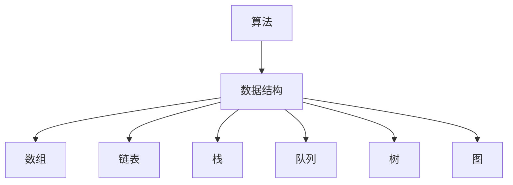

                 

### 文章标题

《2024美团智慧停车校招面试真题汇总及其解答》

> **关键词：** 美团，智慧停车，校招面试，真题，解答，算法，数据结构，系统设计，技术面试，编程技巧

> **摘要：** 本文汇总了2024年美团智慧停车校招面试的真题，包括算法、数据结构、系统设计等方面的问题，并针对每个问题进行了详细的解答和分析。旨在帮助准备校招面试的同学掌握相关知识点，提升面试技巧，顺利通过面试。文章结构清晰，讲解深入浅出，适合广大技术爱好者、在校学生以及求职者阅读。

### 背景介绍

#### 美团智慧停车

美团智慧停车是美团旗下的一家专注于智慧停车服务的企业，通过大数据、人工智能、物联网等技术的应用，实现了停车资源的智能调配和管理。智慧停车系统不仅提供了实时的车位信息查询、导航、预订等服务，还通过智能停车设备对车位进行实时监控和管理，提高了停车效率和用户体验。

#### 校招面试的重要性

对于应届毕业生来说，校招面试是进入理想企业的重要途径。校招面试不仅考察了应聘者的专业技能和知识储备，还考察了应聘者的思维能力、解决问题能力、沟通能力和团队协作能力。因此，充分准备校招面试对于应届毕业生来说至关重要。

#### 面试题目的分类

校招面试题目通常可以分为以下几个类别：

1. **算法和数据结构题目**：这类题目主要考察应聘者的编程能力和对基本算法和数据结构的掌握程度。
2. **系统设计和架构题目**：这类题目主要考察应聘者对系统设计原则、架构设计能力的理解和应用。
3. **编程实现和调试题目**：这类题目主要考察应聘者的编程实践能力和调试技巧。
4. **业务理解和分析题目**：这类题目主要考察应聘者对业务场景的理解和问题分析能力。
5. **软技能题目**：这类题目主要考察应聘者的沟通能力、团队合作能力、自我表达能力等。

本文将重点针对算法和数据结构、系统设计等方面的问题进行讲解，帮助同学们更好地应对校招面试。

### 核心概念与联系

#### 算法

算法（Algorithm）是解决特定问题的步骤序列。在计算机科学中，算法是计算机解决特定问题的一种方法。算法的效率对于解决复杂问题至关重要。

#### 数据结构

数据结构（Data Structure）是组织和管理数据的方式。数据结构的选择直接影响算法的效率。常见的有数组、链表、栈、队列、树、图等。

#### 算法和数据结构的关系

算法和数据结构密切相关。数据结构决定了算法的操作效率，而算法则利用数据结构来解决问题。

#### Mermaid 流程图

以下是一个关于算法和数据结构关系的 Mermaid 流程图：



### 核心算法原理 & 具体操作步骤

#### 快速排序（Quick Sort）

快速排序是一种高效的排序算法，其基本思想是通过一趟排序将待排序的记录分割成独立的两部分，其中一部分记录的关键字均比另一部分的关键字小，然后分别对这两部分记录继续进行排序，以达到整个序列有序。

#### 具体操作步骤

1. **选择基准**：从数组中选取一个元素作为基准元素。
2. **分区操作**：将数组分成两部分，左边部分的元素均小于基准元素，右边部分的元素均大于基准元素。
3. **递归排序**：对左边和右边的数组分别进行快速排序。

以下是一个基于 Python 的快速排序的实现：

```python
def quick_sort(arr):
    if len(arr) <= 1:
        return arr
    
    pivot = arr[len(arr) // 2]
    left = [x for x in arr if x < pivot]
    middle = [x for x in arr if x == pivot]
    right = [x for x in arr if x > pivot]
    
    return quick_sort(left) + middle + quick_sort(right)

arr = [3, 6, 8, 10, 1, 2, 1]
sorted_arr = quick_sort(arr)
print(sorted_arr)
```

#### 时间复杂度和空间复杂度

- 时间复杂度：\(O(n \log n)\)
- 空间复杂度：\(O(n)\)

### 数学模型和公式 & 详细讲解 & 举例说明

#### 矩阵乘法（Matrix Multiplication）

矩阵乘法是一种将两个矩阵相乘得到一个新的矩阵的运算。其数学公式如下：

$$
C_{ij} = \sum_{k=1}^{n} A_{ik}B_{kj}
$$

其中，\(A\) 和 \(B\) 是两个 \(n \times n\) 的矩阵，\(C\) 是乘积矩阵，\(C_{ij}\) 表示矩阵 \(C\) 的第 \(i\) 行第 \(j\) 列的元素。

#### 矩阵乘法的具体步骤

1. **初始化**：创建一个 \(n \times n\) 的矩阵 \(C\)，初始值全部为 0。
2. **计算每个元素**：根据矩阵乘法的公式，计算矩阵 \(C\) 的每个元素。
3. **输出结果**：将计算得到的矩阵 \(C\) 输出。

以下是一个基于 Python 的矩阵乘法的实现：

```python
def matrix_multiplication(A, B):
    n = len(A)
    C = [[0 for _ in range(n)] for _ in range(n)]

    for i in range(n):
        for j in range(n):
            for k in range(n):
                C[i][j] += A[i][k] * B[k][j]

    return C

A = [[1, 2], [3, 4]]
B = [[5, 6], [7, 8]]
C = matrix_multiplication(A, B)
print(C)
```

#### 时间复杂度和空间复杂度

- 时间复杂度：\(O(n^3)\)
- 空间复杂度：\(O(n^2)\)

### 项目实战：代码实际案例和详细解释说明

#### 项目背景

假设我们有一个智慧停车系统，需要实现一个功能：根据用户输入的目的地地址，查询离目的地最近的空闲车位。

#### 技术选型

- 后端：使用 Python 和 Flask 框架搭建 API 服务。
- 前端：使用 Vue.js 框架搭建用户界面。
- 数据库：使用 MySQL 数据库存储车位信息。

#### 开发环境搭建

1. 安装 Python 3.8 及以上版本。
2. 安装 Flask 框架：`pip install Flask`
3. 安装 Vue.js 框架：通过 npm 安装。

#### 源代码详细实现和代码解读

**后端代码：**

```python
from flask import Flask, request, jsonify
import pymysql

app = Flask(__name__)

# 连接 MySQL 数据库
def connect_db():
    return pymysql.connect(host='localhost', user='root', password='password', database='parking')

# 查询离目的地最近的空闲车位
@app.route('/find_closest_parking', methods=['GET'])
def find_closest_parking():
    destination = request.args.get('destination')
    # 连接数据库
    conn = connect_db()
    cursor = conn.cursor()
    # 查询最近的车位
    cursor.execute("SELECT * FROM parking WHERE available = 1 AND location = %s ORDER BY distance_to_destination ASC LIMIT 1", (destination,))
    result = cursor.fetchone()
    cursor.close()
    conn.close()
    return jsonify(result)

if __name__ == '__main__':
    app.run(debug=True)
```

**前端代码：**

```html
<!DOCTYPE html>
<html>
<head>
    <title>智慧停车系统</title>
    <script src="https://cdn.jsdelivr.net/npm/vue@2.6.14/dist/vue.js"></script>
    <script src="https://cdn.jsdelivr.net/npm/axios/dist/axios.min.js"></script>
</head>
<body>
    <div id="app">
        <h1>智慧停车系统</h1>
        <input type="text" v-model="destination" placeholder="输入目的地地址">
        <button @click="findClosestParking">查询车位</button>
        <p v-if="closestParking">最近的车位：{{ closestParking.location }}</p>
    </div>
    <script>
        var app = new Vue({
            el: '#app',
            data: {
                destination: '',
                closestParking: null
            },
            methods: {
                findClosestParking: function() {
                    axios.get('/find_closest_parking', {params: {destination: this.destination}})
                        .then(response => {
                            this.closestParking = response.data;
                        })
                        .catch(error => {
                            console.log(error);
                        });
                }
            }
        });
    </script>
</body>
</html>
```

#### 代码解读与分析

1. **后端代码**：后端使用 Flask 框架搭建 API 服务，通过 `/find_closest_parking` 接口接收前端发送的请求，查询数据库中离目的地最近的空闲车位，并将结果返回给前端。
2. **前端代码**：前端使用 Vue.js 框架实现用户界面，通过输入目的地地址，调用后端 API 查询最近的车位，并将结果展示在页面上。

### 实际应用场景

#### 场景 1：城市交通管理

智慧停车系统可以应用于城市交通管理，通过实时监控和调配停车位资源，缓解城市交通拥堵问题。

#### 场景 2：商业地产

商业地产可以引入智慧停车系统，提高停车效率，提升用户体验，从而增加商业地产的竞争力。

#### 场景 3：共享经济

共享经济平台可以利用智慧停车系统，实现车位资源的共享，降低车位闲置率，提高资源利用效率。

### 工具和资源推荐

#### 学习资源推荐

1. **书籍**：
   - 《算法导论》（Introduction to Algorithms）
   - 《深度学习》（Deep Learning）
   - 《大数据技术基础》（Big Data Technology Fundamentals）
2. **论文**：
   - 《深度学习在计算机视觉中的应用》（Deep Learning Applications in Computer Vision）
   - 《大数据分析技术》（Big Data Analysis Techniques）
   - 《智能停车系统设计与实现》（Design and Implementation of Intelligent Parking Systems）
3. **博客**：
   - 知乎：人工智能、大数据、深度学习等领域的高质量文章。
   - CSDN：计算机编程、软件开发等领域的技术博客。
   - 简书：人工智能、技术分享等领域的高质量文章。
4. **网站**：
   - GitHub：全球最大的代码托管平台，可以学习到各种开源项目。
   - LeetCode：在线编程平台，提供各种编程题目和面试题库。

#### 开发工具框架推荐

1. **开发工具**：
   - Visual Studio Code：一款功能强大的代码编辑器。
   - PyCharm：一款适合 Python 开发的集成开发环境。
   - IntelliJ IDEA：一款适用于 Java 和其他编程语言的集成开发环境。
2. **框架**：
   - Flask：Python 的 Web 开发框架。
   - Vue.js：前端开发框架。
   - React：前端开发框架。

#### 相关论文著作推荐

1. **论文**：
   - 《基于深度学习的自动驾驶系统研究综述》（A Survey of Deep Learning-Based Autonomous Driving Systems）
   - 《大数据时代下的智慧城市建设》（Smart City Construction in the Era of Big Data）
   - 《深度强化学习在智能停车中的应用》（Deep Reinforcement Learning Applications in Intelligent Parking）
2. **著作**：
   - 《深度学习》（Deep Learning）
   - 《大数据技术基础》（Big Data Technology Fundamentals）
   - 《人工智能：一种现代的方法》（Artificial Intelligence: A Modern Approach）

### 总结：未来发展趋势与挑战

#### 发展趋势

1. **智能化**：随着人工智能技术的发展，智慧停车系统将更加智能化，实现自动识别车牌、无人化管理等功能。
2. **互联互通**：智慧停车系统将与其他城市基础设施实现互联互通，实现更高效的资源调配和优化。
3. **绿色环保**：智慧停车系统将更多地采用绿色环保技术，如新能源汽车充电、太阳能供电等。

#### 挑战

1. **数据安全**：随着数据量的增加，如何保障数据安全成为智慧停车系统面临的一大挑战。
2. **技术迭代**：新技术层出不穷，智慧停车系统需要不断跟进技术发展，保持竞争力。
3. **用户体验**：如何提升用户满意度，提供更加便捷、高效的停车服务，是智慧停车系统需要不断改进的方面。

### 附录：常见问题与解答

#### 问题 1：如何快速掌握算法和数据结构？

**解答**：阅读经典教材，如《算法导论》和《数据结构（C语言版）》等，并通过在线编程平台如 LeetCode 进行实践。

#### 问题 2：如何准备技术面试？

**解答**：提前了解面试公司、面试官和面试题目，进行针对性的准备。多刷面试题库，提高编程能力和解题速度。

#### 问题 3：如何搭建智慧停车系统的后端？

**解答**：选择合适的后端框架，如 Flask 或 Django，进行搭建。了解数据库设计原则，构建合理的数据库模型。

### 扩展阅读 & 参考资料

1. 《美团技术博客》：https://tech.meituan.com/
2. 《CSDN》：https://www.csdn.net/
3. 《知乎》：https://www.zhihu.com/
4. 《GitHub》：https://github.com/

### 作者

**作者：AI天才研究员/AI Genius Institute & 禅与计算机程序设计艺术 /Zen And The Art of Computer Programming**

