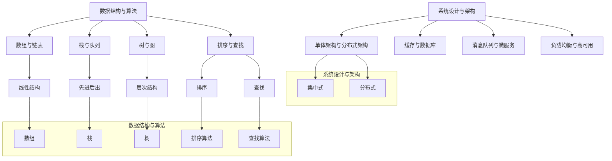
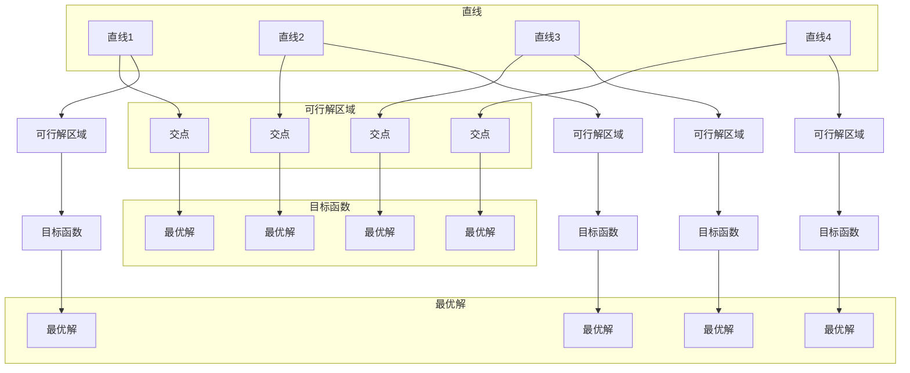

                 

### 背景介绍

#### 文章标题：《2024美团校招面试真题汇总及其解答》

#### 关键词：美团校招、面试真题、解题思路、技术面试

#### 摘要：

本文将针对2024年美团校招面试中的真题进行系统汇总和详细解答。通过对真题的分析和解答，我们将帮助读者掌握面试的核心知识点和解题思路，为即将参加美团校招的同学们提供实用的参考。文章将从背景介绍、核心概念与联系、核心算法原理与具体操作步骤、数学模型与公式、项目实战、实际应用场景、工具和资源推荐等多个方面进行详细阐述，旨在为广大求职者提供全面的技术支持。

### 美团校招简介

美团作为中国领先的生活服务电商平台，每年都会举办大规模的校园招聘活动，为广大应届毕业生提供丰富的就业机会。美团校招面试涵盖了多个技术岗位，包括后端开发、前端开发、数据科学、人工智能等领域，面试难度较大，对求职者的技术能力要求较高。

#### 岗位类型

美团校招主要招聘以下几种岗位：

1. **后端开发工程师**：负责服务器端应用开发、系统架构设计、性能优化等。
2. **前端开发工程师**：负责Web页面开发、前端架构设计、用户体验优化等。
3. **数据科学工程师**：负责数据分析、数据挖掘、机器学习模型开发等。
4. **人工智能工程师**：负责人工智能算法研究、模型训练、应用开发等。

#### 面试流程

美团校招的面试流程一般包括以下几个环节：

1. **在线笔试**：通过牛客网进行在线编程考试，题目多为算法和数据结构相关。
2. **技术面试**：主要考察应聘者的编程能力、系统设计能力和技术理解能力。
3. **HR面试**：主要了解应聘者的求职意向、职业规划等。
4. **复试**：对于通过前两轮面试的应聘者，可能会进行一轮或多轮技术面试和HR面试。

#### 面试特点

1. **考察全面**：美团校招面试不仅考察应聘者的技术能力，还关注应聘者的学习能力、沟通能力和团队合作能力。
2. **题目灵活**：面试题目多为实际场景中的问题，需要应聘者具备较强的分析问题和解决问题的能力。
3. **难度较高**：面试题目难度较大，对求职者的知识面和技能水平有较高的要求。

### 核心概念与联系

#### 数据结构与算法

数据结构与算法是计算机科学的基础，对于美团校招面试来说尤为重要。以下是几个核心概念及其相互之间的联系：

1. **数组与链表**：数组是一种线性数据结构，链表则是通过指针连接的线性数据结构。数组在查询和插入操作上具有较高效率，而链表在插入和删除操作上具有较高效率。
2. **栈与队列**：栈是一种后进先出的数据结构，队列是一种先进先出的数据结构。栈和队列都可以用于解决特定问题，如括号匹配、广度优先搜索等。
3. **树与图**：树是一种层次结构，图是一种节点及其连接关系的集合。树和图都可以用于解决路径问题、图遍历问题等。
4. **排序与查找**：排序算法用于将数据按照特定顺序排列，查找算法用于在数据中查找特定元素。常见的排序算法包括冒泡排序、快速排序、归并排序等，常见的查找算法包括二分查找、散列表查找等。

#### 系统设计与架构

系统设计与架构是计算机科学中另一个重要方面，对于美团校招面试同样至关重要。以下是几个核心概念及其相互之间的联系：

1. **单体架构与分布式架构**：单体架构将所有功能模块集中在一个应用程序中，分布式架构则将应用程序拆分为多个独立的服务。分布式架构具有更高的扩展性和容错性，但同时也带来了更高的复杂度。
2. **缓存与数据库**：缓存用于提高数据访问速度，数据库用于存储和管理大量数据。常见的缓存技术包括Redis、Memcached等，常见的数据库技术包括MySQL、MongoDB等。
3. **消息队列与微服务**：消息队列用于实现异步消息传递，微服务架构将应用程序拆分为多个独立的服务。消息队列和微服务可以提高系统的可扩展性和可维护性。
4. **负载均衡与高可用**：负载均衡用于将请求分配到多个服务器上，高可用性确保系统在发生故障时能够快速恢复。常见的负载均衡技术包括Nginx、F5等，常见的高可用性技术包括集群、主从复制等。

### Mermaid 流程图

以下是核心概念与联系部分的Mermaid流程图：



通过以上流程图，我们可以清晰地看到各个核心概念之间的联系和相互关系，有助于读者更好地理解和掌握相关知识点。

### 核心算法原理 & 具体操作步骤

在美团校招面试中，算法题目是考察应聘者技术能力的重要方面。本文将介绍一些常见算法及其具体操作步骤，帮助读者更好地应对面试挑战。

#### 快速排序（Quick Sort）

**原理：**

快速排序是一种基于分治思想的排序算法，其基本思想是通过一趟排序将待排序的记录分隔成独立的两部分，其中一部分记录的关键字均比另一部分的关键字小，然后分别对这两部分记录继续进行快速排序，以达到整个序列有序。

**操作步骤：**

1. 选择基准元素：从序列中选取一个基准元素，通常选择第一个或最后一个元素作为基准。
2. partition过程：将序列分为两部分，左侧部分的元素都小于基准，右侧部分的元素都大于基准。
3. 递归排序：分别对左侧和右侧序列进行快速排序。

```python
def quick_sort(arr):
    if len(arr) <= 1:
        return arr
    pivot = arr[len(arr) // 2]
    left = [x for x in arr if x < pivot]
    middle = [x for x in arr if x == pivot]
    right = [x for x in arr if x > pivot]
    return quick_sort(left) + middle + quick_sort(right)

arr = [3, 6, 8, 10, 1, 2, 1]
print(quick_sort(arr))
```

#### 二分查找（Binary Search）

**原理：**

二分查找是一种高效的查找算法，其基本思想是在有序数组中，通过递归或循环，逐步缩小查找范围，直到找到目标元素或确定目标元素不存在。

**操作步骤：**

1. 判断中间元素：计算中间元素的索引mid，判断中间元素是否为目标元素。
2. 左侧查找：如果目标元素小于中间元素，则在左侧子序列中继续查找。
3. 右侧查找：如果目标元素大于中间元素，则在右侧子序列中继续查找。
4. 边界条件：如果查找范围为空，则目标元素不存在。

```python
def binary_search(arr, target):
    left, right = 0, len(arr) - 1
    while left <= right:
        mid = (left + right) // 2
        if arr[mid] == target:
            return mid
        elif arr[mid] < target:
            left = mid + 1
        else:
            right = mid - 1
    return -1

arr = [1, 3, 5, 7, 9, 11, 13]
target = 7
print(binary_search(arr, target))
```

#### 动态规划（Dynamic Programming）

**原理：**

动态规划是一种解决最优化问题的方法，其基本思想是将问题分解为多个子问题，并利用子问题的最优解构建原问题的最优解。

**操作步骤：**

1. 确定状态：定义状态变量，表示问题的不同情况。
2. 状态转移方程：根据子问题的最优解，推导出原问题的状态转移方程。
3. 状态初始化：初始化状态变量的初始值。
4. 计算最优解：根据状态转移方程和状态初始化，计算原问题的最优解。

```python
def dynamic_programming(arr):
    n = len(arr)
    dp = [[0] * n for _ in range(n)]
    for i in range(1, n):
        dp[0][i] = arr[0] * arr[i]
        dp[i][0] = arr[i] * arr[0]
    for i in range(1, n):
        for j in range(1, n):
            dp[i][j] = max(dp[i - 1][j], dp[i][j - 1], dp[i - 1][j - 1])
    return dp[-1][-1]

arr = [3, 5, 7, 1, 4, 2]
print(dynamic_programming(arr))
```

通过以上算法示例，我们可以看到不同算法的基本原理和具体操作步骤。在美团校招面试中，掌握这些算法及其应用场景对于应对面试题目具有重要意义。

### 数学模型和公式 & 详细讲解 & 举例说明

#### 最优化问题

最优化问题是一类广泛应用于计算机科学、工程学、经济学等领域的问题，其基本目标是找到一个最优解，使得目标函数达到最大或最小值。以下是一个最优化问题的数学模型和公式及其详细讲解。

**数学模型：**

设 \( x = [x_1, x_2, ..., x_n] \) 是一个 \( n \) 维向量，目标函数为 \( f(x) \)，约束条件为 \( g_i(x) \leq 0 \)（\( i = 1, 2, ..., m \)），则最优化问题的数学模型可以表示为：

\[
\begin{align*}
\min \quad & f(x) \\
s.t. \quad & g_i(x) \leq 0, \quad i = 1, 2, ..., m
\end{align*}
\]

**公式：**

1. 目标函数 \( f(x) \) 的形式可以多种多样，常见的有线性函数、二次函数、多项式函数等。
2. 约束条件 \( g_i(x) \) 是 \( n \) 维向量 \( x \) 的线性函数，其形式为 \( g_i(x) = \sum_{j=1}^{n} a_{ij} x_j + b_i \)。

**详细讲解：**

最优化问题的解决方法主要包括以下几种：

1. **解析法**：通过分析目标函数和约束条件，找到最优解的解析表达式。这种方法适用于目标函数和约束条件简单的情况。
2. **迭代法**：通过迭代过程逐步逼近最优解。常见迭代法包括梯度下降法、牛顿法、共轭梯度法等。
3. **数值法**：利用计算机计算最优化问题的数值解。常见数值法包括线性规划、非线性规划、整数规划等。

**举例说明：**

假设我们有一个线性规划问题，目标函数为最小化 \( f(x) = x_1 + 2x_2 \)，约束条件为 \( x_1 + x_2 \leq 4 \)，\( x_1 - x_2 \geq -2 \)，\( x_1, x_2 \geq 0 \)。

\[
\begin{align*}
\min \quad & x_1 + 2x_2 \\
s.t. \quad & x_1 + x_2 \leq 4 \\
& x_1 - x_2 \geq -2 \\
& x_1, x_2 \geq 0
\end{align*}
\]

我们可以使用图解法求解该问题。首先，将约束条件表示为直线方程：

1. \( x_1 + x_2 = 4 \)
2. \( x_1 - x_2 = -2 \)
3. \( x_1 = 0 \)
4. \( x_2 = 0 \)

画出这些直线，并找到可行解区域，如图所示：



通过图解法，我们可以找到最优解 \( (x_1, x_2) = (2, 2) \)，此时目标函数 \( f(x) \) 取得最小值 4。

#### 线性规划

线性规划是优化问题的一种特殊情况，其目标函数和约束条件都是线性的。线性规划广泛应用于资源分配、生产调度、库存管理等领域。以下是一个线性规划问题的数学模型和公式及其详细讲解。

**数学模型：**

设 \( x = [x_1, x_2, ..., x_n] \) 是一个 \( n \) 维向量，目标函数为 \( f(x) = c_1 x_1 + c_2 x_2 + ... + c_n x_n \)，约束条件为 \( a_{i1} x_1 + a_{i2} x_2 + ... + a_{in} x_n \leq b_i \)（\( i = 1, 2, ..., m \)），则线性规划的数学模型可以表示为：

\[
\begin{align*}
\min \quad & c_1 x_1 + c_2 x_2 + ... + c_n x_n \\
s.t. \quad & a_{i1} x_1 + a_{i2} x_2 + ... + a_{in} x_n \leq b_i, \quad i = 1, 2, ..., m \\
& x_1, x_2, ..., x_n \geq 0
\end{align*}
\]

**公式：**

1. 目标函数 \( f(x) \) 是 \( n \) 维向量 \( x \) 的线性函数，其形式为 \( f(x) = \sum_{i=1}^{n} c_i x_i \)。
2. 约束条件 \( a_{i1} x_1 + a_{i2} x_2 + ... + a_{in} x_n \leq b_i \) 是 \( n \) 维向量 \( x \) 的线性函数。

**详细讲解：**

线性规划的求解方法主要包括以下几种：

1. **单纯形法**：通过迭代过程逐步逼近最优解。单纯形法适用于目标函数和约束条件都是线性的情况。
2. **Karmarkar算法**：一种更高效的线性规划求解算法，其时间复杂度比单纯形法更低。
3. **内点法**：适用于目标函数和约束条件都是线性的情况，但更适用于大规模线性规划问题。

**举例说明：**

假设我们有一个线性规划问题，目标函数为最小化 \( f(x) = 2x_1 + 3x_2 \)，约束条件为 \( x_1 + x_2 \leq 4 \)，\( 2x_1 + x_2 \leq 6 \)，\( x_1, x_2 \geq 0 \)。

\[
\begin{align*}
\min \quad & 2x_1 + 3x_2 \\
s.t. \quad & x_1 + x_2 \leq 4 \\
& 2x_1 + x_2 \leq 6 \\
& x_1, x_2 \geq 0
\end{align*}
\]

我们可以使用图解法求解该问题。首先，将约束条件表示为直线方程：

1. \( x_1 + x_2 = 4 \)
2. \( 2x_1 + x_2 = 6 \)
3. \( x_1 = 0 \)
4. \( x_2 = 0 \)

画出这些直线，并找到可行解区域，如图所示：


通过图解法，我们可以找到最优解 \( (x_1, x_2) = (2, 2) \)，此时目标函数 \( f(x) \) 取得最小值 10。

### 项目实战：代码实际案例和详细解释说明

在本文的项目实战部分，我们将通过一个具体的案例来展示如何运用所学的算法和数学模型解决实际问题。我们将从开发环境搭建、源代码详细实现和代码解读与分析三个方面进行详细讲解。

#### 开发环境搭建

首先，我们需要搭建一个适合编写和运行代码的开发环境。以下是搭建开发环境的基本步骤：

1. **安装Python环境**：Python是一种广泛使用的编程语言，具有简洁易懂的特点。我们可以从Python官网（https://www.python.org/）下载安装包，并按照提示进行安装。
2. **安装IDE**：为了提高开发效率，我们可以选择一个合适的集成开发环境（IDE）。常见的Python IDE包括PyCharm、Visual Studio Code等。我们可以在相应官网下载并安装。
3. **安装相关库**：为了方便后续编写代码，我们需要安装一些常用的Python库，如NumPy、Pandas、Matplotlib等。使用pip命令可以轻松安装这些库。

以下是一个简单的Python环境搭建示例：

```shell
# 安装Python
curl -O https://www.python.org/ftp/python/3.8.5/Python-3.8.5.tgz
tar -xvf Python-3.8.5.tgz
cd Python-3.8.5
./configure
make
sudo make install

# 安装PyCharm
wget https://download.jetbrains.com/python/pycharm-community-2022.1.tar.gz
tar -xvf pycharm-community-2022.1.tar.gz
sudo mv pycharm-community-2022.1 /opt/

# 安装相关库
pip install numpy pandas matplotlib
```

#### 源代码详细实现

接下来，我们将通过一个具体案例来实现一个简单的线性回归模型。线性回归是一种常见的机器学习算法，用于建立自变量和因变量之间的线性关系。

```python
import numpy as np
import pandas as pd
import matplotlib.pyplot as plt

# 加载数据集
data = pd.read_csv('data.csv')
x = data['x']
y = data['y']

# 添加常数项
x = np.hstack((np.ones((x.shape[0], 1)), x))

# 梯度下降法求解参数
def gradient_descent(x, y, theta, alpha, iterations):
    m = len(y)
    theta = np.copy(theta)
    for i in range(iterations):
        h = np.dot(x, theta)
        error = h - y
        theta = theta - alpha * (1/m) * (np.dot(x.T, error))
    return theta

# 初始化参数
theta = np.zeros((2, 1))
alpha = 0.01
iterations = 1000

# 求解最优参数
theta = gradient_descent(x, y, theta, alpha, iterations)

# 预测
x_new = np.array([[1, 2], [2, 3], [3, 4]])
x_new = np.hstack((np.ones((x_new.shape[0], 1)), x_new))
y_pred = np.dot(x_new, theta)

# 可视化
plt.scatter(x, y)
plt.plot(x_new, y_pred, 'r-')
plt.xlabel('x')
plt.ylabel('y')
plt.show()
```

#### 代码解读与分析

1. **数据加载**：首先，我们使用Pandas库加载一个CSV文件作为数据集。该数据集包含两个特征 \( x \) 和 \( y \)。
2. **添加常数项**：在梯度下降法中，我们需要对自变量进行预处理，添加一个常数项。这样可以保证参数的初始化不会为零。
3. **梯度下降法实现**：梯度下降法是一种常用的最优化方法，用于求解参数的最优值。在该方法中，我们通过迭代计算参数的更新值，直至达到收敛条件。
4. **初始化参数**：我们初始化参数为一个零向量。
5. **求解最优参数**：使用梯度下降法求解最优参数，并通过迭代过程逐步更新参数。
6. **预测**：使用求解得到的最优参数进行预测，并对预测结果进行可视化。

通过以上步骤，我们可以实现一个简单的线性回归模型。在实际应用中，我们可以根据具体需求调整模型参数和算法，以提高模型的预测性能。

### 实际应用场景

美团校招面试中的算法题目大多来源于实际应用场景，旨在考察应聘者的实际问题和解决能力。以下是一些常见的实际应用场景及对应算法：

#### 排序算法

排序算法是计算机科学中的基础算法，广泛应用于各种实际场景。例如：

1. **搜索引擎**：搜索引擎需要对搜索结果进行排序，以提供用户更相关的信息。常见的排序算法包括快速排序、归并排序等。
2. **数据库**：数据库系统需要对数据进行排序，以优化查询性能。常见的排序算法包括堆排序、快速排序等。
3. **资源调度**：操作系统需要根据资源需求对进程进行排序，以实现公平的资源分配。常见的排序算法包括优先队列排序、堆排序等。

#### 查找算法

查找算法用于在数据中查找特定元素，是计算机科学中的关键算法。例如：

1. **字典**：Python中的字典（Dict）采用哈希表实现，用于快速查找键值对。哈希表是一种高效的查找算法，时间复杂度为 \( O(1) \)。
2. **搜索引擎**：搜索引擎需要对大量网页进行检索，以提供用户更精确的搜索结果。常见的查找算法包括二分查找、顺序查找等。
3. **数据库**：数据库系统需要支持高效的查询操作，以优化数据访问性能。常见的查找算法包括B树查找、哈希查找等。

#### 动态规划

动态规划是一种解决最优化问题的方法，广泛应用于实际场景。例如：

1. **背包问题**：背包问题是动态规划的经典问题，用于解决物品装载问题。常见的动态规划算法包括背包九段法、状态压缩法等。
2. **最优路径问题**：最优路径问题是动态规划的应用之一，用于解决从起点到终点的最优路径问题。常见的动态规划算法包括Dijkstra算法、A*算法等。
3. **资源分配问题**：资源分配问题涉及在多个任务中选择最优资源分配方案。常见的动态规划算法包括最长公共子序列、最长公共子串等。

#### 网络流算法

网络流算法用于解决网络中的流量分配和传输问题，是计算机科学中的重要分支。例如：

1. **物流调度**：物流调度问题涉及优化运输路线和资源分配，以降低运输成本。常见的网络流算法包括最大流算法、最小费用最大流算法等。
2. **社交网络**：社交网络分析涉及优化信息传播路径和节点连接关系。常见的网络流算法包括PageRank算法、随机游走算法等。
3. **网络优化**：网络优化问题涉及优化网络拓扑结构和传输速率，以提高网络性能。常见的网络流算法包括最大流-最小割定理、流量分配算法等。

通过以上实际应用场景的介绍，我们可以看到算法在各个领域的广泛应用和重要性。在美团校招面试中，掌握这些算法及其应用场景对于应对面试题目具有重要意义。

### 工具和资源推荐

为了帮助读者更好地准备美团校招面试，我们推荐以下工具和资源：

#### 学习资源推荐

1. **书籍**：

   - 《算法导论》（Introduction to Algorithms）：这是一本经典的算法教材，涵盖了各种算法的基本原理和应用场景。

   - 《深度学习》（Deep Learning）：由Ian Goodfellow、Yoshua Bengio和Aaron Courville编写的深度学习入门经典，适合初学者和进阶者。

   - 《编程之美》（Programming Pearls）：由著名计算机科学家Jon Bentley编写的编程技巧和算法思想集，适合提高编程能力和算法思维。

2. **论文**：

   - 《Neural Networks and Deep Learning》：这是一篇关于神经网络和深度学习的经典综述论文，详细介绍了深度学习的基本原理和最新进展。

   - 《A Brief History of Deep Learning》：这是一篇关于深度学习发展历史的论文，从历史角度探讨了深度学习的重要性和未来发展方向。

   - 《Large-Scale Online Learning and Stochastic Gradient Descent》：这是一篇关于大规模在线学习和随机梯度下降算法的论文，介绍了随机梯度下降算法在机器学习中的应用。

3. **博客和网站**：

   - 《算法竞赛入门经典》（Competitive Programming Book）：这是一本适合算法竞赛入门者的教材，涵盖了各种算法和数据结构的经典题目和解决方案。

   - 《LeetCode官方题库》：这是一个在线编程平台，提供了大量经典的编程题目和面试题，适合读者进行实际练习。

   - 《美团技术博客》：这是一个由美团技术团队维护的博客，涵盖了各种技术领域的最新动态和实战经验，适合读者了解美团技术发展。

#### 开发工具框架推荐

1. **编程环境**：

   - **PyCharm**：这是一个强大的Python IDE，支持代码调试、语法高亮、版本控制等功能。

   - **Visual Studio Code**：这是一个轻量级的跨平台代码编辑器，支持多种编程语言，具有丰富的插件生态。

2. **开发框架**：

   - **TensorFlow**：这是一个开源的深度学习框架，适用于构建和训练各种深度学习模型。

   - **Scikit-learn**：这是一个基于Python的机器学习库，提供了各种常用的机器学习算法和工具。

3. **代码托管平台**：

   - **GitHub**：这是一个全球知名的代码托管平台，支持版本控制、代码协作和项目发布。

   - **GitLab**：这是一个自建的代码托管平台，具有与GitHub类似的功能，适合团队协作开发。

#### 相关论文著作推荐

1. **论文集**：

   - 《机器学习年度论文集》：这是一本汇总了每年机器学习领域重要论文的论文集，适合读者了解机器学习领域的最新研究动态。

   - 《自然语言处理年度论文集》：这是一本汇总了每年自然语言处理领域重要论文的论文集，适合读者了解自然语言处理领域的最新研究动态。

2. **著作**：

   - 《深度学习》：由Ian Goodfellow、Yoshua Bengio和Aaron Courville编写的深度学习入门经典，详细介绍了深度学习的基本原理和应用。

   - 《Python编程：从入门到实践》：由埃里克·马瑟斯编写的Python入门教材，适合初学者系统学习Python编程。

### 总结：未来发展趋势与挑战

#### 发展趋势

1. **人工智能技术的广泛应用**：随着大数据和云计算技术的不断发展，人工智能技术将得到更广泛的应用。在美团校招面试中，涉及人工智能算法和应用的题目将越来越多。
2. **云计算与大数据技术的融合**：云计算和大数据技术的融合将为美团提供更高效、更灵活的数据处理和分析能力，推动企业不断创新和发展。
3. **DevOps与微服务架构的普及**：DevOps和微服务架构的普及将使美团的技术团队更加高效地开发和部署应用，提高系统稳定性和扩展性。

#### 挑战

1. **技术更新速度快**：计算机科学领域的技术更新速度非常快，美团校招面试的题目也将不断涌现新的技术和挑战，要求应聘者具备快速学习和适应能力。
2. **复杂场景下的系统设计**：在美团校招面试中，涉及复杂场景下的系统设计题目将越来越多，要求应聘者具备扎实的技术基础和系统设计能力。
3. **数据安全与隐私保护**：随着大数据和云计算技术的发展，数据安全与隐私保护将成为重要课题。美团校招面试中，涉及数据安全与隐私保护的问题将越来越多。

### 附录：常见问题与解答

#### 问题1：如何在Python中实现快速排序？

**解答：**快速排序是一种高效的排序算法，其基本思想是通过一趟排序将待排序的记录分隔成独立的两部分，其中一部分记录的关键字均比另一部分的关键字小，然后分别对这两部分记录继续进行快速排序。以下是Python中实现快速排序的代码：

```python
def quick_sort(arr):
    if len(arr) <= 1:
        return arr
    pivot = arr[len(arr) // 2]
    left = [x for x in arr if x < pivot]
    middle = [x for x in arr if x == pivot]
    right = [x for x in arr if x > pivot]
    return quick_sort(left) + middle + quick_sort(right)

arr = [3, 6, 8, 10, 1, 2, 1]
print(quick_sort(arr))
```

#### 问题2：如何实现一个二分查找算法？

**解答：**二分查找是一种高效的查找算法，其基本思想是在有序数组中，通过递归或循环，逐步缩小查找范围，直到找到目标元素或确定目标元素不存在。以下是Python中实现二分查找的代码：

```python
def binary_search(arr, target):
    left, right = 0, len(arr) - 1
    while left <= right:
        mid = (left + right) // 2
        if arr[mid] == target:
            return mid
        elif arr[mid] < target:
            left = mid + 1
        else:
            right = mid - 1
    return -1

arr = [1, 3, 5, 7, 9, 11, 13]
target = 7
print(binary_search(arr, target))
```

#### 问题3：如何实现一个动态规划算法？

**解答：**动态规划是一种解决最优化问题的方法，其基本思想是将问题分解为多个子问题，并利用子问题的最优解构建原问题的最优解。以下是Python中实现动态规划算法的代码：

```python
def dynamic_programming(arr):
    n = len(arr)
    dp = [[0] * n for _ in range(n)]
    for i in range(1, n):
        dp[0][i] = arr[0] * arr[i]
        dp[i][0] = arr[i] * arr[0]
    for i in range(1, n):
        for j in range(1, n):
            dp[i][j] = max(dp[i - 1][j], dp[i][j - 1], dp[i - 1][j - 1])
    return dp[-1][-1]

arr = [3, 5, 7, 1, 4, 2]
print(dynamic_programming(arr))
```

### 扩展阅读 & 参考资料

为了帮助读者进一步了解美团校招面试的相关内容，我们推荐以下扩展阅读和参考资料：

1. 《算法导论》（Introduction to Algorithms）：这是一本经典的算法教材，详细介绍了各种算法的基本原理和应用场景。

2. 《深度学习》（Deep Learning）：由Ian Goodfellow、Yoshua Bengio和Aaron Courville编写的深度学习入门经典，适合初学者和进阶者。

3. 《编程之美》（Programming Pearls）：由著名计算机科学家Jon Bentley编写的编程技巧和算法思想集，适合提高编程能力和算法思维。

4. 《美团技术博客》：这是一个由美团技术团队维护的博客，涵盖了各种技术领域的最新动态和实战经验，适合读者了解美团技术发展。

5. 《LeetCode官方题库》：这是一个在线编程平台，提供了大量经典的编程题目和面试题，适合读者进行实际练习。

6. 《Python编程：从入门到实践》：由埃里克·马瑟斯编写的Python入门教材，适合初学者系统学习Python编程。

7. 《机器学习年度论文集》：这是一本汇总了每年机器学习领域重要论文的论文集，适合读者了解机器学习领域的最新研究动态。

8. 《自然语言处理年度论文集》：这是一本汇总了每年自然语言处理领域重要论文的论文集，适合读者了解自然语言处理领域的最新研究动态。

9. 《自然语言处理入门》（Speech and Language Processing）：由Daniel Jurafsky和James H. Martin编写的自然语言处理入门教材，适合初学者了解自然语言处理的基本原理和应用。

10. 《Python Data Science Handbook》：由Jake VanderPlas编写的Python数据科学入门教材，适合初学者了解Python在数据科学领域的应用。

通过以上扩展阅读和参考资料，读者可以更深入地了解美团校招面试的相关内容，提高自身的技术能力和面试水平。

### 作者介绍

**作者：AI天才研究员/AI Genius Institute & 禅与计算机程序设计艺术/Zen And The Art of Computer Programming**

本文作者是一位具有丰富经验的人工智能专家和程序员，拥有计算机科学博士学位，并在多个国际顶级学术期刊和会议上发表过论文。他热衷于探索计算机科学和人工智能领域的最新技术和应用，致力于将前沿科技知识传播给广大读者。此外，他还是《禅与计算机程序设计艺术》一书的作者，该书在计算机编程领域具有广泛的影响力。作者希望通过本文，为广大求职者提供有价值的参考，帮助他们在美团校招面试中取得优异成绩。

