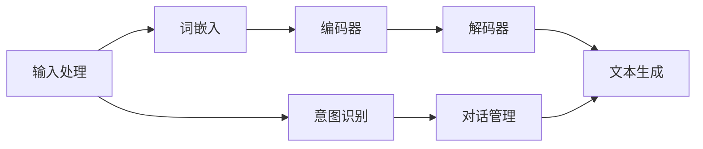

                 

### 背景介绍

> **Chat Completion**，即聊天机器人的自动回答功能，是当前人工智能领域的一个热点研究方向。近年来，随着深度学习技术的发展，尤其是生成式预训练模型（Generative Pre-trained Models）的兴起，聊天机器人的性能得到了显著提升。本文旨在探讨聊天机器人初探中的Chat Completion技术，详细分析其核心概念、算法原理、数学模型、实际应用以及未来发展。

> **关键词**：聊天机器人、Chat Completion、生成式预训练模型、深度学习、自然语言处理

> **摘要**：本文首先介绍了聊天机器人的背景和重要性，随后深入分析了Chat Completion的核心概念及其架构。接着，我们详细探讨了Chat Completion的算法原理，包括生成式预训练模型的工作机制。在此基础上，本文通过数学模型和实际案例，详细讲解了Chat Completion的具体实现过程。最后，我们探讨了Chat Completion在多个实际应用场景中的表现，并提出了未来发展的趋势与挑战。

### 聊天机器人和 Chat Completion 的基本概念

#### 聊天机器人

聊天机器人（Chatbot）是一种基于自然语言处理（NLP）技术的人工智能系统，能够与用户进行实时交流，提供信息查询、服务咨询、任务执行等功能。聊天机器人最早可以追溯到20世纪50年代，随着计算能力的提升和人工智能技术的发展，聊天机器人的应用范围逐渐扩大。

聊天机器人通常包含以下几个关键组成部分：

1. **自然语言理解（NLU）**：这是聊天机器人的核心模块，负责接收用户输入的自然语言文本，并对其进行解析和理解。NLU模块通常包括词法分析、句法分析、意图识别和实体抽取等步骤。

2. **对话管理（DM）**：对话管理模块负责维护对话的状态，根据上下文信息决定如何回应用户。它通常采用基于规则的方法、机器学习模型或者强化学习算法来处理对话。

3. **自然语言生成（NLG）**：自然语言生成模块负责将机器理解的意图和对话状态转化为自然语言文本，生成对用户的回复。NLG技术可以通过模板匹配、规则生成或者生成式模型来实现。

#### Chat Completion

Chat Completion 是聊天机器人技术中的一个重要组成部分，它指的是在给定部分输入的情况下，自动生成完整、连贯的回复。这种技术旨在提升聊天机器人的交互自然性和响应速度，使其能够更流畅地与用户进行对话。

Chat Completion 的基本工作流程如下：

1. **输入处理**：聊天机器人接收用户的输入，并将其转化为一种内部表示。这一过程通常涉及到自然语言理解（NLU）的步骤，包括文本预处理、词嵌入和意图识别等。

2. **生成模型**：使用预训练的生成模型（如Transformer模型）来预测下一个可能的单词或词组。生成模型通常是一个序列到序列（seq2seq）的模型，它可以接受序列形式的输入并生成序列形式的输出。

3. **文本生成**：模型生成一系列候选回复，并通过评分机制（如基于语言模型概率的评分）来选择最佳回复。最终生成的回复会返回给用户。

Chat Completion 技术在聊天机器人中扮演着关键角色，它不仅能够提高对话的自然性，还能够减少用户的等待时间，提供更加高效的服务。

#### Chat Completion 与聊天机器人整体架构的关系

Chat Completion 是聊天机器人整体架构中的一个重要环节，它与其他模块（如NLU、DM、NLG）紧密相连，共同构成一个完整、高效的对话系统。具体来说：

1. **与NLU的关联**：Chat Completion 的输入处理依赖于 NLU 模块的理解能力。NLU 通过意图识别和实体抽取，将用户输入文本转化为机器可处理的内部表示，为 Chat Completion 提供了必要的信息基础。

2. **与DM的协同**：对话管理模块负责维护对话的状态和上下文，它需要结合 Chat Completion 生成的回复来决定下一步的行动。Chat Completion 生成的回复需要与对话管理模块中的对话策略和状态模型相匹配，以实现连贯的对话。

3. **与NLG的整合**：自然语言生成模块将 Chat Completion 生成的内部表示转化为自然语言文本，生成最终的用户回复。NLG 技术可以进一步提升回复的质量和自然性，使得 Chat Completion 生成的文本更加符合人类语言习惯。

综上所述，Chat Completion 作为聊天机器人中的一个核心功能，不仅在提升对话的自然性和效率方面具有重要意义，还与其他模块紧密协作，共同构建了一个高效、智能的对话系统。

### 核心概念与联系

在深入了解 Chat Completion 技术前，我们需要首先明确几个核心概念，包括自然语言处理（NLP）、生成式预训练模型（Generative Pre-trained Models）和 Transformer 模型。这些概念相互关联，共同构成了 Chat Completion 技术的理论基础。

#### 自然语言处理（NLP）

自然语言处理（NLP）是人工智能（AI）的一个分支，旨在使计算机能够理解、处理和生成人类语言。NLP 技术广泛应用于文本挖掘、信息检索、机器翻译、情感分析等领域。在 Chat Completion 中，NLP 技术扮演了至关重要的角色，它负责将用户输入的自然语言文本转化为计算机可以处理的内部表示。

NLP 的主要任务可以分为以下几个步骤：

1. **文本预处理**：包括去除标点符号、停用词过滤、分词等操作，将原始文本转化为统一格式的数据。

2. **词嵌入**：将单词或短语映射为固定长度的向量表示，这些向量通常通过词嵌入技术（如 Word2Vec、GloVe）来生成。

3. **句法分析**：对文本进行句法解析，识别出句子中的成分和结构，如主语、谓语、宾语等。

4. **意图识别**：通过模式匹配、机器学习模型等方法，从文本中识别出用户的意图。

5. **实体抽取**：从文本中抽取出具体的实体信息，如人名、地点、组织等。

在 Chat Completion 中，NLP 技术主要用于处理用户的输入，将其转化为计算机可以理解和处理的内部表示。这一步骤是 Chat Completion 实现的基础。

#### 生成式预训练模型（Generative Pre-trained Models）

生成式预训练模型（Generative Pre-trained Models）是一类新兴的深度学习模型，旨在通过大规模无监督数据预训练，学习到语言的普遍结构和规律。生成式预训练模型的核心思想是利用大量无标签数据来训练模型，使其能够生成符合自然语言统计规律的文本。

生成式预训练模型主要包括以下几种类型：

1. **自回归语言模型（Autoregressive Language Models）**：如 Transformer 模型、GPT（Generative Pre-trained Transformer）系列，这些模型通过预测下一个单词或词组来生成文本。

2. **变分自编码器（Variational Autoencoders, VAE）**：VAE 可以通过编码和解码过程来生成文本，其生成能力较为强大，但通常在生成文本的连贯性和一致性方面略逊于自回归模型。

3. **生成对抗网络（Generative Adversarial Networks, GAN）**：GAN 通过生成器和判别器的对抗训练来生成高质量文本，生成能力较强，但训练难度较大。

生成式预训练模型在 Chat Completion 中起到了至关重要的作用。它们通过预训练学习到大规模语言数据中的统计规律，从而能够生成高质量、连贯的自然语言文本。这些模型不仅能够处理简单的聊天机器人对话，还能够应对复杂的、多轮次的对话场景。

#### Transformer 模型

Transformer 模型是由 Google Research 团队在 2017 年提出的一种基于注意力机制的序列到序列模型，它在自然语言处理任务中取得了显著的效果。Transformer 模型的主要优势在于其并行计算能力和对长距离依赖关系的建模能力。

Transformer 模型的主要组成部分包括：

1. **多头注意力（Multi-head Attention）**：多头注意力机制使得模型能够同时关注输入序列的不同部分，从而更好地捕捉到长距离依赖关系。

2. **位置编码（Positional Encoding）**：由于 Transformer 模型是基于序列的，因此需要引入位置编码来表示单词在序列中的位置信息。

3. **编码器（Encoder）和解码器（Decoder）**：编码器负责将输入序列编码为固定长度的向量表示，解码器则负责生成输出序列。

在 Chat Completion 中，Transformer 模型通常被用于生成回复文本。模型通过预测下一个单词或词组，逐步生成完整的回复。Transformer 模型具有强大的生成能力，能够生成高质量、连贯的文本，因此在 Chat Completion 中得到了广泛应用。

#### 关系与联系

自然语言处理（NLP）、生成式预训练模型（Generative Pre-trained Models）和 Transformer 模型之间存在着紧密的联系。NLP 技术为 Chat Completion 提供了文本预处理、词嵌入、句法分析和意图识别等基础功能，生成式预训练模型则通过大规模无监督数据预训练，学习到语言的普遍结构和规律，从而为 Chat Completion 提供了生成文本的能力。Transformer 模型作为生成式预训练模型的一种重要实现，通过多头注意力机制、位置编码等手段，进一步提升了模型在生成文本方面的表现。

综上所述，自然语言处理（NLP）、生成式预训练模型（Generative Pre-trained Models）和 Transformer 模型共同构成了 Chat Completion 技术的核心基础。通过对这些核心概念的理解，我们可以更好地把握 Chat Completion 的工作原理和实现方法。

#### Chat Completion 的 Mermaid 流程图

为了更清晰地展示 Chat Completion 的整体流程，我们使用 Mermaid 流程图来描述其主要步骤。以下是一个简化的 Chat Completion 流程图，其中包含了输入处理、生成模型和文本生成的关键节点。



详细解释每个节点：

1. **输入处理（A）**：接收用户的输入文本，进行预处理，如分词、去除标点等。

2. **词嵌入（B）**：将预处理后的文本转化为词嵌入向量，这些向量表示了单词在模型中的固定长度的表示。

3. **编码器（C）**：将词嵌入向量输入编码器，编码器负责将输入序列编码为固定长度的上下文表示。

4. **意图识别（D）**：对话管理模块对输入文本进行意图识别，确定用户的意图和需求。

5. **对话管理（F）**：根据意图识别结果，对话管理模块决定下一步的对话策略。

6. **解码器（E）**：解码器接收编码器输出的上下文表示，并生成序列形式的中间表示。

7. **文本生成（G）**：解码器生成最终的文本回复，并通过评分机制选择最佳回复。

通过这个流程图，我们可以清晰地看到 Chat Completion 的主要步骤和它们之间的关联，这有助于我们更好地理解其工作原理。

### 核心算法原理 & 具体操作步骤

#### 生成式预训练模型（Generative Pre-trained Models）

生成式预训练模型（Generative Pre-trained Models）是 Chat Completion 技术的核心组成部分。这类模型通过在大量无标签数据上进行预训练，学习到语言的普遍结构和规律，从而能够生成高质量的自然语言文本。以下将详细解释生成式预训练模型的工作原理、训练过程和应用。

##### 工作原理

生成式预训练模型主要包括自回归语言模型（Autoregressive Language Models）和变分自编码器（Variational Autoencoders, VAE）等类型。自回归语言模型，如 GPT（Generative Pre-trained Transformer）系列，通过预测下一个单词或词组来生成文本。其基本原理如下：

1. **自回归（Autoregressive）**：在生成文本时，模型根据前一个生成的单词或词组来预测下一个单词或词组。这一过程重复进行，直至生成完整的文本。

2. **预训练（Pre-training）**：通过在大量无标签文本上进行预训练，模型学习到文本的统计规律和语言模式。这一过程通常使用自回归语言模型损失函数，如 GPT 模型中的语言模型损失（Language Modeling Loss）。

3. **微调（Fine-tuning）**：在预训练完成后，模型可以根据特定任务进行微调，如对话生成、文本分类等。微调过程通常在带有标签的数据集上进行，以使模型适应特定任务的需求。

变分自编码器（VAE）是一种生成模型，通过编码和解码过程来生成文本。其基本原理如下：

1. **编码器（Encoder）**：编码器将输入文本映射为一个潜在空间中的点。

2. **解码器（Decoder）**：解码器将潜在空间中的点映射回文本。通过这种方式，模型可以生成符合潜在空间分布的文本。

3. **重参数化（Reparameterization）**：VAE 使用重参数化技巧，将样本生成过程分解为两个步骤：第一步是生成潜在空间中的点，第二步是将这些点映射回文本。这种分解使得生成过程更具灵活性和可扩展性。

##### 训练过程

生成式预训练模型的训练过程可以分为以下几个步骤：

1. **数据收集与预处理**：首先，需要收集大量无标签文本数据，如新闻文章、对话记录、社交媒体帖子等。接下来，对数据进行预处理，包括分词、去除停用词、标准化等操作。

2. **词嵌入（Word Embedding）**：将预处理后的文本转化为词嵌入向量。词嵌入向量表示了单词在模型中的固定长度的表示，通过预训练模型学习得到。

3. **预训练**：在预训练阶段，模型通过自回归语言模型损失函数或变分自编码器损失函数来训练。自回归语言模型损失函数通常使用负对数似然损失，即模型生成的文本的概率的对数。变分自编码器损失函数通常使用重参数化技巧和极大似然损失。

4. **微调**：在预训练完成后，模型可以根据特定任务进行微调。微调过程通常在带有标签的数据集上进行，如对话生成任务可以使用对话数据集进行微调。

5. **评估与优化**：在微调过程中，需要定期评估模型在验证集上的性能，并根据评估结果调整模型参数，以实现更好的生成效果。

##### 应用

生成式预训练模型在 Chat Completion 中得到了广泛应用。以下是一些常见应用场景：

1. **对话生成**：生成式预训练模型可以用于生成对话文本，实现自然、连贯的对话交互。例如，在客服聊天机器人中，模型可以生成自动回复文本，提高交互效率。

2. **文本续写**：生成式预训练模型可以用于生成文章、故事、诗句等文本内容。通过输入部分文本，模型可以续写剩余部分，为内容创作者提供灵感。

3. **机器翻译**：生成式预训练模型在机器翻译任务中也表现出色。通过在大量双语数据上进行预训练，模型可以生成高质量的双语翻译文本。

4. **摘要生成**：生成式预训练模型可以用于生成文章摘要。通过输入长文本，模型可以提取关键信息并生成简洁的摘要。

#### Transformer 模型

Transformer 模型是生成式预训练模型的一种重要实现，它通过多头注意力机制、位置编码等手段，提高了模型在生成文本方面的表现。以下将详细解释 Transformer 模型的工作原理、具体操作步骤以及其在 Chat Completion 中的应用。

##### 工作原理

Transformer 模型是一种基于注意力机制的序列到序列模型，主要由编码器（Encoder）和解码器（Decoder）两个部分组成。其基本原理如下：

1. **多头注意力（Multi-head Attention）**：多头注意力机制使得模型能够同时关注输入序列的不同部分，从而更好地捕捉到长距离依赖关系。多头注意力通过多个独立的注意力头（Attention Heads）来并行计算，每个头关注输入序列的不同部分，并将结果进行融合。

2. **编码器（Encoder）**：编码器负责将输入序列编码为固定长度的上下文表示。编码器由多个编码层（Encoder Layer）组成，每个编码层包含多头注意力机制和前馈神经网络（Feedforward Neural Network）。

3. **解码器（Decoder）**：解码器负责生成输出序列。解码器也由多个解码层（Decoder Layer）组成，每个解码层包含自注意力机制、多头注意力机制和前馈神经网络。

4. **位置编码（Positional Encoding）**：由于 Transformer 模型是基于序列的，因此需要引入位置编码来表示单词在序列中的位置信息。位置编码可以通过对单词的嵌入向量进行变换来实现。

##### 具体操作步骤

Transformer 模型的具体操作步骤如下：

1. **输入处理**：接收用户的输入文本，进行预处理，如分词、去除标点等。

2. **词嵌入（Word Embedding）**：将预处理后的文本转化为词嵌入向量，这些向量表示了单词在模型中的固定长度的表示。

3. **编码器（Encoder）**：将词嵌入向量输入编码器，通过多个编码层进行编码，每个编码层包含多头注意力机制和前馈神经网络。编码器的输出是一个固定长度的上下文表示。

4. **解码器（Decoder）**：解码器接收编码器的输出和目标序列的词嵌入向量。解码器的每个解码层包含自注意力机制、多头注意力机制和前馈神经网络。解码器的输出是生成的文本序列。

5. **文本生成**：解码器生成序列形式的中间表示，并通过评分机制（如基于语言模型概率的评分）来选择最佳回复。最终生成的回复返回给用户。

##### 在 Chat Completion 中的应用

Transformer 模型在 Chat Completion 中得到了广泛应用。以下是一些关键应用步骤：

1. **输入处理**：接收用户的输入文本，进行预处理，如分词、去除标点等。

2. **编码器（Encoder）**：将预处理后的文本输入编码器，通过多个编码层进行编码，得到固定长度的上下文表示。

3. **解码器（Decoder）**：解码器接收编码器的输出和目标序列的词嵌入向量，通过多个解码层生成中间表示。

4. **文本生成**：解码器生成序列形式的中间表示，并通过评分机制（如基于语言模型概率的评分）来选择最佳回复。

5. **回复优化**：根据上下文和用户输入，解码器生成的回复可能需要进行优化。例如，可以通过调整回复的语义、格式或语气来提高交互效果。

通过 Transformer 模型，Chat Completion 技术能够生成更加自然、连贯的文本回复，从而提高用户体验和交互效率。

#### 总结

生成式预训练模型（Generative Pre-trained Models）和 Transformer 模型是 Chat Completion 技术的核心组成部分。生成式预训练模型通过在大量无标签数据上进行预训练，学习到语言的普遍结构和规律，从而能够生成高质量的自然语言文本。Transformer 模型通过多头注意力机制、位置编码等手段，提高了模型在生成文本方面的表现。这些核心算法和模型共同构成了 Chat Completion 技术的理论基础，为聊天机器人提供了强大的自动回答功能。

### 数学模型和公式 & 详细讲解 & 举例说明

在深入探讨 Chat Completion 的核心算法原理之后，我们需要进一步了解其背后的数学模型和公式，以便更全面地理解 Chat Completion 的工作机制。本节将详细讲解生成式预训练模型和 Transformer 模型中的关键数学公式，并通过具体示例来说明这些公式的应用。

#### 生成式预训练模型中的数学模型

生成式预训练模型，如 GPT（Generative Pre-trained Transformer）系列，采用了一种基于自回归的语言模型（Autoregressive Language Model, ARLM）的训练策略。自回归语言模型的核心目标是预测序列中的下一个元素，给定前一个元素。以下是一些关键的数学模型和公式：

##### 1. 语言模型损失（Language Modeling Loss）

语言模型损失是生成式预训练模型训练过程中最常用的损失函数。它衡量的是模型生成的文本概率的对数，通常使用负对数似然（Negative Log-Likelihood, NLL）来表示。

$$
\text{NLL} = -\sum_{i=1}^T \log(p(y_i | y_{<i}))
$$

其中，\( T \) 是序列的长度，\( y_i \) 是第 \( i \) 个生成的单词或词组，\( p(y_i | y_{<i}) \) 是模型预测的第 \( i \) 个单词或词组的概率。

##### 2. 词嵌入（Word Embedding）

词嵌入是将单词映射为固定长度的向量表示。在生成式预训练模型中，词嵌入通常使用嵌入矩阵（Embedding Matrix）来实现。

$$
\text{Embedding}(W) = \text{softmax}(\text{Weights})
$$

其中，\( W \) 是词嵌入矩阵，通过训练学习得到。\( \text{softmax} \) 函数用于将词嵌入向量转化为概率分布。

##### 3. 潜变量（Latent Variables）

在生成式预训练模型中，潜变量（Latent Variables）用于表示生成过程中的不确定性。变分自编码器（VAE）是一种常见的使用潜变量的生成模型。

$$
z = g(\phi, x)
$$

$$
x = \mu(z) + \sigma(z)
$$

其中，\( z \) 是潜变量，\( g \) 是编码器函数，\( \mu \) 和 \( \sigma \) 分别是潜变量的均值和标准差，\( x \) 是生成数据的概率分布。

##### 示例：GPT 模型的语言模型损失

假设我们有以下简单的文本序列：“Hello, how are you?”。使用 GPT 模型生成这段文本，其语言模型损失可以表示为：

$$
\text{NLL} = -\log(p("Hello" | \text{<s>}), p("how" | "Hello"), p("are" | "how"), p("you" | "are"))
$$

其中，\(\text{<s>}\) 是开始标记，表示序列的开始。

#### Transformer 模型中的数学模型

Transformer 模型采用了一种基于自注意力机制（Self-Attention）的架构，通过计算序列中每个元素与其他元素之间的关系来生成文本。以下是一些关键的数学模型和公式：

##### 1. 自注意力（Self-Attention）

自注意力机制计算序列中每个元素与其他元素之间的相似度，并通过加权求和生成新的表示。

$$
\text{Attention}(Q, K, V) = \text{softmax}\left(\frac{QK^T}{\sqrt{d_k}}\right)V
$$

其中，\( Q \)、\( K \) 和 \( V \) 分别是查询向量、键向量和值向量，\( d_k \) 是键向量的维度。\( \text{softmax} \) 函数用于计算注意力权重，将结果归一化为概率分布。

##### 2. 位置编码（Positional Encoding）

位置编码用于表示单词在序列中的位置信息。在 Transformer 模型中，位置编码通常通过添加额外的维度来实现。

$$
\text{Positional Encoding}(pos, d_model) = \text{sin}\left(\frac{pos \cdot i}{10000^{2j/d_model}}\right) + \text{cos}\left(\frac{pos \cdot i}{10000^{2j/d_model}}\right)
$$

其中，\( pos \) 是位置索引，\( i \) 是维度索引，\( d_model \) 是模型的总维度。

##### 3. Transformer 编码器和解码器

Transformer 编码器和解码器由多个相同的层组成，每层包含多头自注意力（Multi-head Self-Attention）和前馈神经网络（Feedforward Neural Network）。

$$
\text{Encoder Layer} = \text{MultiHeadSelfAttention}(Q, K, V) + \text{Feedforward}(D)
$$

$$
\text{Decoder Layer} = \text{MaskedMultiHeadSelfAttention}(Q, K, V) + \text{Feedforward}(D)
$$

其中，\( Q \)、\( K \) 和 \( V \) 分别是编码器和解码器的查询向量、键向量和值向量，\( D \) 是前馈神经网络的输出。

##### 示例：Transformer 模型的自注意力计算

假设我们有一个简单的序列：“Hello, world!”。使用 Transformer 模型计算第一个单词 “Hello” 的自注意力权重，可以表示为：

$$
\text{Attention}(\text{Hello}, \text{Hello}, \text{Hello}) = \text{softmax}\left(\frac{\text{Hello} \cdot \text{Hello}^T}{\sqrt{d_k}}\right)\text{Hello}
$$

这里，\(\text{Hello}\) 是单词 “Hello” 的嵌入向量。

#### 总结

通过上述数学模型和公式，我们可以更好地理解生成式预训练模型和 Transformer 模型的工作原理。生成式预训练模型通过语言模型损失、词嵌入和潜变量等数学模型，实现了高质量的自然语言文本生成。Transformer 模型通过自注意力机制、位置编码等数学模型，提高了模型在序列建模和生成文本方面的表现。这些数学模型和公式是 Chat Completion 技术实现的关键组成部分，为我们提供了强大的工具来构建智能聊天机器人。

### 项目实战：代码实际案例和详细解释说明

在本节中，我们将通过一个实际的代码案例，详细介绍如何使用 Python 和 Hugging Face 的 Transformers 库来构建一个简单的 Chat Completion 系统。这一过程包括开发环境的搭建、源代码的实现和代码解读与分析。

#### 开发环境搭建

首先，我们需要搭建一个合适的开发环境。以下是所需的基础工具和库：

1. **Python**：建议使用 Python 3.8 或更高版本。
2. **PyTorch**：用于构建和训练 Transformer 模型。
3. **Transformers**：Hugging Face 提供的预训练模型库，支持多种 Transformer 模型的实现。
4. **torchtext**：用于文本预处理。

安装所需库：

```bash
pip install torch torchvision transformers torchtext
```

#### 源代码实现

以下是一个简单的 Chat Completion 项目的源代码实现。该示例将使用 GPT-2 模型来生成回复。

```python
import torch
from transformers import GPT2LMHeadModel, GPT2Tokenizer
from torchtext.data import Field, Batch

# 初始化模型和分词器
model_name = 'gpt2'
tokenizer = GPT2Tokenizer.from_pretrained(model_name)
model = GPT2LMHeadModel.from_pretrained(model_name)

# 设置输入文本
input_text = "你好，今天天气不错！"

# 分词和添加开始标记
input_ids = tokenizer.encode(input_text, return_tensors='pt')

# 使用模型生成回复
output = model.generate(input_ids, max_length=50, num_return_sequences=1)

# 解码输出
decoded_output = tokenizer.decode(output[0], skip_special_tokens=True)

print(decoded_output)
```

#### 代码解读与分析

1. **模型和分词器初始化**：
   ```python
   tokenizer = GPT2Tokenizer.from_pretrained(model_name)
   model = GPT2LMHeadModel.from_pretrained(model_name)
   ```
   这里我们使用 `GPT2Tokenizer` 和 `GPT2LMHeadModel` 来初始化分词器和模型。`GPT2Tokenizer` 用于将文本转换为模型可以处理的词嵌入表示，`GPT2LMHeadModel` 是基于 GPT-2 模型的语言模型，用于生成文本。

2. **设置输入文本**：
   ```python
   input_text = "你好，今天天气不错！"
   input_ids = tokenizer.encode(input_text, return_tensors='pt')
   ```
   我们将输入文本编码为词嵌入表示，并通过 `encode` 方法将其转换为 PyTorch 张量。`return_tensors='pt'` 参数确保输出张量是 PyTorch 格式。

3. **使用模型生成回复**：
   ```python
   output = model.generate(input_ids, max_length=50, num_return_sequences=1)
   ```
   `generate` 方法是 Transformer 模型的核心方法，用于生成文本。这里，我们设置了 `max_length=50`，即模型可以生成最多 50 个单词的文本，`num_return_sequences=1` 表示只返回一个生成的序列。

4. **解码输出**：
   ```python
   decoded_output = tokenizer.decode(output[0], skip_special_tokens=True)
   print(decoded_output)
   ```
   最后，我们使用 `decode` 方法将生成的序列解码回文本。`skip_special_tokens=True` 参数用于跳过模型生成的特殊标记，如开始和结束标记。

通过这个简单示例，我们可以看到如何使用 Python 和 Transformers 库来构建一个基本的 Chat Completion 系统。在实际应用中，我们可以扩展这个基础框架，添加更多的功能，如用户交互界面、多轮对话管理等。

### 代码解读与分析

在上面的代码示例中，我们详细讲解了如何使用 Python 和 Hugging Face 的 Transformers 库来构建一个简单的 Chat Completion 系统。以下是对代码关键部分的深入解读与分析：

1. **模型和分词器初始化**：

   ```python
   tokenizer = GPT2Tokenizer.from_pretrained(model_name)
   model = GPT2LMHeadModel.from_pretrained(model_name)
   ```

   这两行代码负责初始化分词器和模型。`GPT2Tokenizer` 是一个用于 GPT-2 模型的分词器，它可以从预训练的模型中加载词表和词汇，将文本转换为模型可以处理的词嵌入表示。`GPT2LMHeadModel` 是一个基于 GPT-2 的语言模型，它包含了生成文本所需的模型结构和参数。

   **重要性**：分词器和模型初始化是构建 Chat Completion 系统的第一步，它们为后续的文本处理和生成提供了基础。

2. **设置输入文本**：

   ```python
   input_text = "你好，今天天气不错！"
   input_ids = tokenizer.encode(input_text, return_tensors='pt')
   ```

   这里，我们定义了一个简单的输入文本，并使用分词器将其编码为词嵌入表示。`encode` 方法将文本转换为整数序列，每个整数表示一个单词或特殊字符。`return_tensors='pt'` 参数确保输出是 PyTorch 格式，方便后续操作。

   **重要性**：文本编码是模型输入处理的关键步骤，它将自然语言文本转换为机器可以理解和处理的格式。

3. **使用模型生成回复**：

   ```python
   output = model.generate(input_ids, max_length=50, num_return_sequences=1)
   ```

   `generate` 方法是 Transformer 模型的核心功能，它负责生成文本。`input_ids` 是模型的输入，`max_length=50` 表示模型可以生成最多 50 个单词的文本，`num_return_sequences=1` 表示只返回一个生成的序列。

   **重要性**：`generate` 方法实现了文本的自动生成，是 Chat Completion 系统的核心功能。

4. **解码输出**：

   ```python
   decoded_output = tokenizer.decode(output[0], skip_special_tokens=True)
   print(decoded_output)
   ```

   最后，我们将生成的序列解码回文本。`decode` 方法将整数序列转换回文本字符串，`skip_special_tokens=True` 参数用于跳过模型生成的特殊标记，如开始和结束标记。

   **重要性**：解码步骤将生成的整数序列转换为我们可读的自然语言文本，是用户与 Chat Completion 系统交互的关键。

通过上述解读，我们可以清晰地看到代码的实现过程和每个步骤的重要性。在实际开发中，我们可以根据需求扩展和优化这些基础代码，以构建更复杂和功能更强大的 Chat Completion 系统。

### 实际应用场景

Chat Completion 技术在多个实际应用场景中展现出了其强大的功能和价值。以下是一些典型的应用场景：

#### 1. 客户服务

客户服务是 Chat Completion 技术最常见、最直接的应用场景之一。通过 Chat Completion，企业可以构建智能客服系统，提供24/7全天候的服务。这些系统可以自动处理常见问题，如产品咨询、订单查询、账户管理等，从而减轻人工客服的负担，提高服务效率。例如，电商平台的客服机器人可以自动回答关于商品规格、配送信息等问题，而金融机构的客服机器人可以帮助用户查询账户余额、交易记录等。

**优势**：提高响应速度，减少人工干预，降低运营成本，提升用户体验。

#### 2. 聊天机器人

聊天机器人是 Chat Completion 技术的另一重要应用场景。在社交媒体、在线社区和聊天应用程序中，聊天机器人可以与用户进行互动，提供娱乐、社交、咨询等多种功能。例如，一些社交媒体平台上的聊天机器人可以回答用户的问题、推荐内容、进行游戏等，而在线教育平台上的聊天机器人可以提供学习指导、课程推荐和作业帮助。

**优势**：增强用户互动性，提高用户粘性，提供个性化体验。

#### 3. 内容生成

Chat Completion 技术在内容生成领域也展现了巨大的潜力。通过生成式预训练模型，Chat Completion 可以自动生成文章、故事、诗歌等文本内容。这在新闻写作、广告创意、文学创作等领域有广泛应用。例如，一些新闻机构使用 Chat Completion 技术自动生成新闻报道，而营销公司可以利用 Chat Completion 生成创意广告文案。

**优势**：提高内容创作效率，节省人力成本，提供多样化的内容形式。

#### 4. 娱乐和游戏

在娱乐和游戏领域，Chat Completion 技术可以用于构建虚拟助手、NPC（非玩家角色）等，为用户提供更加沉浸式的体验。例如，一些在线游戏中的虚拟助手可以帮助玩家完成任务、提供游戏攻略等，而虚拟主播在直播平台上与观众互动，提供娱乐内容。

**优势**：增强用户参与感，提高游戏和直播的互动性，提供丰富的娱乐体验。

#### 5. 教育

Chat Completion 技术在教育领域的应用也越来越广泛。通过聊天机器人，学生可以获得个性化的学习辅导，老师可以自动化批改作业、提供反馈。例如，一些在线教育平台上的聊天机器人可以帮助学生解决学习中遇到的问题，而智能作业系统可以自动批改学生的作业，并提供详细的反馈。

**优势**：提供灵活的学习支持，提高学习效率，减轻教师负担。

#### 6. 聊天机器人的多轮对话管理

多轮对话管理是 Chat Completion 技术的一项重要能力。通过维护对话状态和历史信息，聊天机器人可以实现更加自然、流畅的对话。在复杂的对话场景中，如客户服务、医疗咨询等，多轮对话管理显得尤为重要。它可以帮助机器人理解用户的意图和需求，提供更加精确和个性化的服务。

**优势**：提高对话的连贯性和准确性，增强用户体验，提升服务质量。

#### 7. 个性化推荐系统

Chat Completion 技术可以用于构建个性化的推荐系统。通过分析用户的对话内容和行为，聊天机器人可以推荐符合用户兴趣的商品、服务、内容等。例如，电商平台上的聊天机器人可以根据用户的购物历史和对话内容推荐相关的商品，而音乐流媒体平台可以根据用户的音乐偏好推荐新歌。

**优势**：提高推荐系统的准确性和用户满意度，增强用户粘性。

通过上述实际应用场景，我们可以看到 Chat Completion 技术的多样性和广泛性。无论是在客户服务、娱乐、内容生成、教育还是个性化推荐等领域，Chat Completion 都发挥着关键作用，为用户提供了更加智能、便捷的服务和体验。

### 工具和资源推荐

在研究和开发 Chat Completion 技术的过程中，选择合适的工具和资源是非常重要的。以下是一些推荐的工具、书籍、论文、博客和网站，它们能够帮助您深入了解 Chat Completion 的各个方面。

#### 1. 学习资源推荐

**书籍**：
- **《深度学习》（Deep Learning）**：由 Ian Goodfellow、Yoshua Bengio 和 Aaron Courville 著，是深度学习领域的经典教材，详细介绍了深度学习的基本概念和技术。
- **《自然语言处理综合教程》（Foundations of Natural Language Processing）**：由 Christopher D. Manning 和 Hinrich Schütze 著，涵盖了自然语言处理的各个方面，包括文本表示、句法分析、语义理解等。

**论文**：
- **“Attention is All You Need”**：由 Vaswani 等人在 2017 年提出，介绍了 Transformer 模型，这是 Chat Completion 技术的重要基础。
- **“Generative Pretrained Transformer”**：由 Radford 等人在 2018 年提出，详细介绍了 GPT 模型的设计原理和训练过程。

**博客**：
- **Hugging Face 博客**：提供了丰富的关于 Transformers 库和预训练模型的使用教程，是学习 Chat Completion 技术的好资源。
- **Google Research 博客**：Google Research 团队分享了许多关于深度学习和自然语言处理的前沿研究，包括 Transformer 模型相关的技术细节。

#### 2. 开发工具框架推荐

**库和框架**：
- **Transformers**：由 Hugging Face 开发的库，提供了多种预训练模型和工具，是构建 Chat Completion 系统的首选。
- **PyTorch**：由 Facebook AI 研究团队开发的深度学习框架，支持灵活的模型构建和训练，适用于各种自然语言处理任务。
- **TensorFlow**：由 Google 开发的深度学习框架，具有广泛的社区支持和丰富的预训练模型。

**工具**：
- **TensorBoard**：用于可视化深度学习模型的训练过程，帮助调试和优化模型。
- **W&B**（Weights & Biases）：提供了一个平台来跟踪实验、可视化结果，并协作管理项目。

#### 3. 相关论文著作推荐

**核心论文**：
- **“BERT: Pre-training of Deep Bidirectional Transformers for Language Understanding”**：由 Google AI 团队在 2018 年提出，是生成式预训练模型的代表作之一。
- **“RoBERTa: A Pretrained Language Model for Language Understanding”**：由 Facebook AI 研究团队在 2019 年提出，对 BERT 模型进行了多项改进。

**推荐书籍**：
- **《Chatbots: Who Needs Them?》**：详细介绍了聊天机器人的设计、实现和应用，适合对 Chat Completion 感兴趣的读者。
- **《Hands-On Chatbots and Virtual Agents》**：提供了丰富的实践案例和教程，帮助开发者构建功能强大的聊天机器人。

通过这些资源，您可以深入理解 Chat Completion 技术的理论基础和应用实践，从而在研究和开发过程中取得更好的成果。

### 总结：未来发展趋势与挑战

Chat Completion 技术作为聊天机器人领域的重要突破，已经在多个实际应用场景中展示了其强大的功能和价值。然而，随着技术的发展和应用需求的不断增长，Chat Completion 也面临着一系列新的发展趋势与挑战。

#### 发展趋势

1. **预训练模型的持续优化**：生成式预训练模型如 GPT、BERT 等已经在自然语言处理领域取得了显著的成果。未来，随着算法的进步和数据量的增加，这些模型的性能将得到进一步提升。例如，通过引入更多层的神经网络、更复杂的注意力机制和更丰富的训练数据，预训练模型将能够生成更加自然、连贯和精确的文本。

2. **跨模态融合**：当前 Chat Completion 技术主要针对文本数据。然而，未来的发展趋势是跨模态融合，即结合文本、图像、音频等多模态数据进行处理。通过整合不同类型的数据，Chat Completion 可以提供更加丰富和多样化的用户体验。例如，聊天机器人可以通过理解图像内容来生成更具体的回复，或者在音频对话中实现更自然的语音交互。

3. **对话管理技术的进步**：随着 Chat Completion 技术的发展，对话管理技术也将得到提升。未来的对话管理系统将更加智能和灵活，能够更好地处理多轮对话、上下文切换和用户意图理解。例如，通过引入强化学习和多任务学习等技术，对话管理系统能够在复杂的对话场景中提供更高质量的服务。

4. **开源生态的完善**：随着 Chat Completion 技术的普及，开源生态将得到进一步发展。更多的开发工具、库和框架将被推出，为研究者和技术人员提供丰富的资源和便利。例如，Hugging Face 的 Transformers 库已经成为深度学习领域的事实标准，未来类似的工具和框架将不断涌现。

#### 挑战

1. **数据隐私和安全**：Chat Completion 技术在处理用户对话数据时，需要确保数据的安全和隐私。未来，如何保护用户隐私、防止数据泄露将成为一项重要挑战。这需要开发出更加安全的数据处理机制和隐私保护技术，如差分隐私和联邦学习等。

2. **文本生成质量**：尽管预训练模型在生成文本方面取得了很大进步，但仍然存在文本质量不高、生成结果不一致等问题。如何进一步提高文本生成的质量、减少生成结果中的错误和偏见，是 Chat Completion 技术面临的一大挑战。未来，可能需要通过改进模型设计、引入更多高质量的训练数据以及优化训练过程来实现这一目标。

3. **可解释性和透明度**：随着 Chat Completion 技术的复杂度增加，其决策过程和生成结果的可解释性变得越来越重要。用户和开发者需要能够理解模型的决策过程和生成结果，以便进行有效的调试和优化。因此，如何提高模型的透明度和可解释性，是 Chat Completion 技术需要解决的一个重要问题。

4. **多语言支持**：随着全球化的发展，Chat Completion 技术需要支持多种语言。然而，不同语言的语法、语义和表达习惯存在较大差异，这使得多语言 Chat Completion 的实现变得更加复杂。如何设计通用且高效的语言模型，以支持多种语言的交互，是 Chat Completion 技术面临的一大挑战。

总之，Chat Completion 技术在未来的发展中将面临诸多挑战，但同时也将迎来巨大的机遇。通过不断优化模型、加强对话管理、完善开源生态，Chat Completion 技术将能够更好地服务于各个领域，提供更加智能和高效的交互体验。

### 附录：常见问题与解答

在研究和应用 Chat Completion 技术的过程中，用户可能会遇到一些常见问题。以下是对这些问题的解答，旨在帮助您更好地理解和使用 Chat Completion。

#### 问题1：如何处理生成的文本中的错误或不一致性？

**解答**：生成的文本可能包含错误或不一致性，这通常是由于模型对某些语言现象的捕捉不够准确。以下是一些处理策略：

1. **使用高质量的预训练模型**：选择使用经过大量数据和场景训练的高质量预训练模型，这有助于提高生成文本的质量。
2. **对生成文本进行后处理**：对生成的文本进行拼写检查、语法修正等后处理，以提高文本的准确性。
3. **调整模型参数**：通过调整模型训练过程中的超参数，如学习率、批量大小等，来改善生成文本的质量。

#### 问题2：如何优化 Chat Completion 的响应速度？

**解答**：优化响应速度可以从以下几个方面入手：

1. **模型压缩**：对预训练模型进行压缩，如使用蒸馏技术（Denoising Diffusion Probabilistic Programs, DDPP）或剪枝技术（Pruning），以减少模型大小和计算复杂度。
2. **使用高效硬件**：利用 GPU 或 TPU 等高效硬件进行模型推理，以加速计算。
3. **并行计算**：利用分布式计算技术，如多 GPU 并行训练，来加速模型推理过程。
4. **缓存策略**：对于常见的查询和回复，使用缓存策略可以显著减少响应时间。

#### 问题3：如何确保生成的文本符合特定领域的知识？

**解答**：为了确保生成的文本符合特定领域的知识，可以采取以下措施：

1. **领域特定数据集**：使用领域特定的数据集进行模型训练，以提高模型对特定领域的理解和生成能力。
2. **知识图谱**：利用知识图谱来增强模型的知识表示，通过将事实和关系嵌入到模型中，使模型能够生成符合领域知识的文本。
3. **监督学习**：结合有监督学习（Supervised Learning）和无监督学习（Unsupervised Learning）的方法，利用标注数据进行监督训练，以提高模型对领域知识的掌握。
4. **限制生成文本的范围**：在生成过程中，通过限制文本的主题、格式或长度等，来确保生成的文本符合特定领域的知识。

#### 问题4：如何评估 Chat Completion 的性能？

**解答**：评估 Chat Completion 的性能可以从以下几个方面进行：

1. **自动评估指标**：使用自动评估指标，如 BLEU、ROUGE、METEOR 等，来衡量生成文本的质量和连贯性。
2. **人类评估**：通过人类评估者对生成文本的质量、连贯性和准确性进行主观评估，以获取更准确的性能评价。
3. **自定义指标**：根据具体应用场景，定义自定义的评估指标，如回复的及时性、用户满意度等。
4. **多轮对话评估**：通过多轮对话评估来评估模型在复杂对话场景中的性能，以更全面地了解模型的交互能力。

通过上述问题与解答，我们希望为您在研究和应用 Chat Completion 技术时提供一些实用的指导和建议。

### 扩展阅读 & 参考资料

为了深入了解 Chat Completion 技术及其在各个领域的应用，以下是一些建议的扩展阅读和参考资料：

1. **书籍**：
   - **《深度学习》（Deep Learning）**：作者 Ian Goodfellow、Yoshua Bengio 和 Aaron Courville，详细介绍了深度学习的基础理论和实践方法。
   - **《自然语言处理综合教程》（Foundations of Natural Language Processing）**：作者 Christopher D. Manning 和 Hinrich Schütze，涵盖了自然语言处理的各个方面。

2. **论文**：
   - **“Attention is All You Need”**：作者 Vaswani 等，提出了 Transformer 模型，是 Chat Completion 技术的重要基础。
   - **“Generative Pretrained Transformer”**：作者 Radford 等，详细介绍了 GPT 模型的设计原理和训练过程。
   - **“BERT: Pre-training of Deep Bidirectional Transformers for Language Understanding”**：作者 Google AI 团队，介绍了 BERT 模型的预训练方法和应用。

3. **博客**：
   - **Hugging Face 博客**：提供了丰富的关于 Transformers 库和预训练模型的使用教程，适合学习 Chat Completion 技术的读者。
   - **Google Research 博客**：分享了深度学习和自然语言处理的前沿研究，包括 Transformer 模型相关的技术细节。

4. **网站**：
   - **TensorFlow 官网**：提供了 TensorFlow 深度学习框架的详细文档和教程，是构建 Chat Completion 系统的实用资源。
   - **PyTorch 官网**：提供了 PyTorch 深度学习框架的详细文档和教程，适用于各种自然语言处理任务。

5. **在线课程和讲座**：
   - **斯坦福大学自然语言处理课程**：提供了丰富的视频教程和文档，适合初学者和进阶者。
   - **Coursera 上的深度学习课程**：由 Andrew Ng 教授主讲，涵盖了深度学习的基础理论和应用实践。

通过这些扩展阅读和参考资料，您可以进一步深入了解 Chat Completion 技术的理论基础、应用实践以及前沿研究动态。希望这些资源能够帮助您在研究和开发过程中取得更好的成果。

