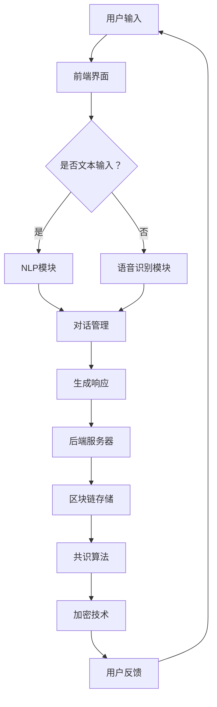

                 

# 聊天机器人区块链：安全和去中心化应用

> **关键词：** 聊天机器人、区块链、去中心化、安全、智能合约、共识算法、加密技术

> **摘要：** 本文旨在探讨将区块链技术应用于聊天机器人，特别是在提升安全性和实现去中心化方面的重要性。通过详细分析聊天机器人的架构、区块链的基本原理、以及两者的结合，本文将介绍如何利用区块链技术确保聊天机器人的安全性，并提供实际案例以说明如何开发一个去中心化的聊天机器人。此外，还将探讨未来的发展趋势和面临的挑战，以及推荐的工具和资源。

## 1. 背景介绍

随着互联网的普及和人工智能技术的发展，聊天机器人已成为企业与用户互动的重要工具。这些机器人能够提供实时、个性化的服务，从而提高客户满意度。然而，传统的聊天机器人存在一些问题，如数据泄露、单点故障、以及中心化控制等，这些问题严重影响了其安全性。

区块链技术，作为一种去中心化的分布式数据库，以其安全性、透明性和不可篡改性而受到广泛关注。将区块链技术应用于聊天机器人，可以有效解决传统聊天机器人的安全隐患，并实现数据的去中心化存储。本文将详细探讨这一主题，旨在为开发者提供有关如何构建安全和去中心化聊天机器人的指导。

## 2. 核心概念与联系

### 2.1 聊天机器人

聊天机器人（Chatbot）是一种基于自然语言处理（NLP）和机器学习技术的应用程序，能够模拟人类对话，为用户提供实时服务。聊天机器人的架构通常包括前端界面、后端服务器、以及自然语言处理模块。

#### 2.1.1 前端界面

前端界面是用户与聊天机器人交互的窗口，通常包括文本聊天界面、语音聊天界面或图形用户界面（GUI）。

#### 2.1.2 后端服务器

后端服务器负责处理用户的输入，理解用户意图，并生成适当的响应。后端服务器通常包括自然语言处理（NLP）模块、对话管理模块和知识库。

#### 2.1.3 自然语言处理（NLP）模块

自然语言处理模块是聊天机器人的核心组件，负责将用户的自然语言输入转化为机器可理解的结构化数据。NLP模块通常包括词法分析、句法分析、语义分析和对话管理。

### 2.2 区块链

区块链（Blockchain）是一种分布式账本技术，其基本原理是利用加密算法和共识机制，实现数据的去中心化存储和验证。区块链的架构包括数据层、网络层、共识层和应用层。

#### 2.2.1 数据层

数据层主要封装了链式块结构、分布式时间戳服务、密码学和网络协议等基本模块。

#### 2.2.2 网络层

网络层则包括数据区块在网络中的传输机制和数据验证机制等。

#### 2.2.3 共识层

共识层主要解决如何共同维护数据一致性、如何处理系统中的争端问题等。

#### 2.2.4 应用层

应用层则是区块链与实际业务场景的结合，例如金融、物联网、智能合约等。

### 2.3 区块链与聊天机器人的结合

区块链与聊天机器人的结合主要体现在以下几个方面：

#### 2.3.1 去中心化

通过将聊天机器人数据存储在区块链上，可以避免传统中心化存储所带来的单点故障问题，实现数据的去中心化存储和管理。

#### 2.3.2 安全性

区块链的加密技术和共识算法能够有效保护聊天机器人数据的安全性，防止数据泄露和篡改。

#### 2.3.3 透明性

区块链的透明性使得用户可以实时查看和验证聊天机器人的数据，增强用户信任。

#### 2.3.4 智能合约

智能合约是一种运行在区块链上的程序，可以实现自动化执行和验证。在聊天机器人中，智能合约可以用于自动化处理用户请求、计费、授权等操作。

### 2.4 Mermaid 流程图

以下是区块链与聊天机器人结合的 Mermaid 流程图：



在上述流程图中，用户输入通过前端界面传递到NLP模块或语音识别模块，NLP模块或语音识别模块处理用户输入后，生成响应并传递到后端服务器。后端服务器将响应存储在区块链上，并通过共识算法和加密技术确保数据的安全性。最终，用户反馈将再次触发整个流程。

## 3. 核心算法原理 & 具体操作步骤

### 3.1 加密算法

加密算法是区块链技术中的核心组件，用于确保数据的机密性和完整性。在聊天机器人中，加密算法可用于保护用户隐私、加密通信数据、以及验证数据的真实性。

#### 3.1.1 对称加密

对称加密是一种加密算法，使用相同的密钥对数据进行加密和解密。常见的对称加密算法包括AES、DES等。

#### 3.1.2 非对称加密

非对称加密使用一对密钥（公钥和私钥）进行加密和解密。公钥用于加密数据，私钥用于解密数据。常见的非对称加密算法包括RSA、ECC等。

#### 3.1.3 具体操作步骤

1. 用户生成一对非对称密钥（公钥和私钥）。
2. 用户将公钥上传到区块链，以便其他用户可以使用公钥加密与用户通信。
3. 用户使用私钥解密接收到的加密数据。

### 3.2 共识算法

共识算法是区块链网络中的核心组件，用于确保所有节点对数据的共识。在聊天机器人中，共识算法可用于确保聊天数据的真实性和一致性。

#### 3.2.1 工作量证明（Proof of Work，PoW）

工作量证明是一种常见的共识算法，通过解决数学难题来证明节点的工作量。比特币网络采用的就是工作量证明算法。

#### 3.2.2 权益证明（Proof of Stake，PoS）

权益证明是一种替代工作量证明的共识算法，通过持有代币的数量和时间来决定节点的工作量。以太坊2.0计划采用权益证明算法。

#### 3.2.3 具体操作步骤

1. 节点参与区块链网络，并持有一定数量的代币。
2. 节点根据持有的代币数量和时间顺序参与区块生成。
3. 节点使用共识算法验证其他节点的区块。
4. 验证通过后，节点将区块添加到区块链。

### 3.3 智能合约

智能合约是一种运行在区块链上的程序，用于自动化执行和验证合同条款。在聊天机器人中，智能合约可用于自动化处理用户请求、计费和授权等操作。

#### 3.3.1 智能合约原理

智能合约是一种基于图灵完备编程语言的程序，其执行过程由区块链网络中的节点共同验证。智能合约的执行结果一旦被确认，就不可篡改。

#### 3.3.2 具体操作步骤

1. 开发者编写智能合约代码。
2. 将智能合约部署到区块链上。
3. 用户通过智能合约与聊天机器人进行交互。
4. 智能合约自动执行用户请求，并返回结果。

## 4. 数学模型和公式 & 详细讲解 & 举例说明

### 4.1 对称加密算法

对称加密算法的基本原理是使用相同的密钥对数据进行加密和解密。以AES加密算法为例，其加密和解密过程如下：

#### 4.1.1 加密过程

$$
C = E_K(P)
$$

其中，$C$ 表示加密后的数据，$E_K$ 表示加密函数，$P$ 表示原始数据，$K$ 表示加密密钥。

#### 4.1.2 解密过程

$$
P = D_K(C)
$$

其中，$P$ 表示解密后的数据，$D_K$ 表示解密函数，$C$ 表示加密后的数据，$K$ 表示加密密钥。

### 4.2 非对称加密算法

非对称加密算法的基本原理是使用一对密钥（公钥和私钥）进行加密和解密。以RSA加密算法为例，其加密和解密过程如下：

#### 4.2.1 加密过程

$$
C = E_K(P)
$$

其中，$C$ 表示加密后的数据，$E_K$ 表示加密函数，$P$ 表示原始数据，$K$ 表示公钥。

#### 4.2.2 解密过程

$$
P = D_K(C)
$$

其中，$P$ 表示解密后的数据，$D_K$ 表示解密函数，$C$ 表示加密后的数据，$K$ 表示私钥。

### 4.3 共识算法

共识算法的基本原理是确保所有节点对数据的共识。以工作量证明算法为例，其工作原理如下：

#### 4.3.1 节点参与竞争

节点根据算法生成随机数，并尝试找到一个满足特定条件的哈希值。

#### 4.3.2 节点提交结果

找到满足条件的哈希值的节点将结果提交给其他节点。

#### 4.3.3 节点验证结果

其他节点验证提交的哈希值是否满足条件。

#### 4.3.4 节点共识

如果验证通过，节点将达成共识，并更新区块链。

## 5. 项目实战：代码实际案例和详细解释说明

### 5.1 开发环境搭建

为了实现聊天机器人区块链功能，我们需要搭建以下开发环境：

- 操作系统：Linux或MacOS
- 编程语言：Solidity（用于编写智能合约）
- 智能合约开发工具：Truffle
- 测试网络：Ropsten测试网络

### 5.2 源代码详细实现和代码解读

#### 5.2.1 智能合约代码

```solidity
// SPDX-License-Identifier: MIT
pragma solidity ^0.8.0;

contract Chatbot {
    mapping(address => string) public userMessages;

    function sendMessage(string memory _message) public {
        userMessages[msg.sender] = _message;
    }

    function getMessage(address _user) public view returns (string memory) {
        return userMessages[_user];
    }
}
```

上述代码是一个简单的智能合约，用于存储用户的聊天消息。其中，`userMessages` 是一个映射，用于存储用户的聊天消息。`sendMessage` 函数用于存储用户消息，`getMessage` 函数用于获取用户消息。

#### 5.2.2 测试智能合约

1. 将智能合约代码上传到 Truffle。
2. 使用 Truffle 在 Ropsten 测试网络上部署智能合约。
3. 编写测试脚本，验证智能合约功能。

```solidity
pragma solidity ^0.8.0;

import "truffle/Assert.sol";
import "truffle/deployed-contracts/Chatbot.sol";

contract ChatbotTest {
    function testSendMessage() public {
        Chatbot chatbot = Chatbot_deployed;

        chatbot.sendMessage("Hello, World!");

        Assert.equal(chatbot.getMessage(msg.sender), "Hello, World!", "Message should be stored correctly");
    }
}
```

### 5.3 代码解读与分析

上述代码中，`Chatbot` 智能合约包含两个主要函数：`sendMessage` 和 `getMessage`。

- `sendMessage` 函数用于存储用户消息。函数中，`userMessages` 映射使用用户地址作为键，存储用户消息。使用 `msg.sender` 可以获取当前消息发送者的地址。
- `getMessage` 函数用于获取用户消息。函数中，使用 `userMessages` 映射获取指定用户的消息。

通过这个简单的智能合约，我们可以实现一个基本的去中心化聊天机器人。用户可以通过智能合约发送消息，其他用户可以查询特定用户的消息。

## 6. 实际应用场景

### 6.1 跨平台聊天机器人

区块链聊天机器人可以应用于跨平台的聊天应用，如WhatsApp、Facebook Messenger、Slack等。通过区块链技术，用户可以在不同平台之间进行安全的聊天，而无需担心数据泄露或单点故障问题。

### 6.2 客户服务

企业可以利用区块链聊天机器人提供更高效的客户服务。通过与区块链集成，企业可以确保用户隐私和数据安全，同时实现实时、个性化的服务。

### 6.3 数字身份验证

区块链聊天机器人可以用于数字身份验证，确保用户的身份真实可靠。通过区块链技术，用户可以在无需透露个人信息的情况下，验证其他用户的身份。

### 6.4 去中心化社交媒体

区块链聊天机器人可以应用于去中心化社交媒体平台，如Mastodon、Steemit等。通过区块链技术，用户可以自由表达观点，而无需担心平台审查或内容篡改。

## 7. 工具和资源推荐

### 7.1 学习资源推荐

- **书籍：**
  - 《区块链技术指南》：详细介绍了区块链的基本原理和应用。
  - 《智能合约开发实战》：涵盖了智能合约的开发和部署。

- **论文：**
  - 《比特币：一种点对点的电子现金系统》：比特币的白皮书，详细介绍了区块链技术的原理。

- **博客：**
  - Ethereum官方博客：提供了大量有关以太坊和智能合约的教程和文档。
  - ConsenSys博客：涵盖了区块链技术和智能合约的广泛话题。

- **网站：**
  - Etherscan：以太坊区块链浏览器，可以查看智能合约的代码和交易。
  - Truffle：智能合约开发框架，提供了丰富的工具和文档。

### 7.2 开发工具框架推荐

- **编程语言：** Solidity，用于编写以太坊智能合约。
- **开发框架：** Truffle，用于智能合约的开发和部署。
- **区块链网络：** Ropsten测试网络，用于测试智能合约。

### 7.3 相关论文著作推荐

- 《区块链：从数字货币到智能合约》：全面介绍了区块链技术的各个方面。
- 《智能合约设计与实现》：详细介绍了智能合约的设计原则和实现方法。

## 8. 总结：未来发展趋势与挑战

### 8.1 发展趋势

- **去中心化应用（dApps）的普及**：随着区块链技术的成熟，越来越多的去中心化应用将涌现。
- **智能合约的广泛应用**：智能合约将在金融、供应链管理、版权保护等领域发挥重要作用。
- **隐私保护**：区块链技术将在隐私保护和用户数据安全方面发挥关键作用。

### 8.2 挑战

- **性能瓶颈**：区块链技术需要克服性能瓶颈，以满足大规模应用的需求。
- **安全性问题**：区块链系统需要不断改进，以提高安全性，防止恶意攻击。
- **法律法规**：随着区块链技术的发展，需要制定相应的法律法规，以规范其应用。

## 9. 附录：常见问题与解答

### 9.1 问题1：区块链聊天机器人的安全性如何保证？

**解答**：区块链聊天机器人的安全性主要通过以下方面保证：

- **加密技术**：使用加密算法对用户数据进行加密，确保数据在传输和存储过程中的安全性。
- **共识算法**：共识算法确保区块链网络中的所有节点对数据的共识，防止数据篡改。
- **智能合约**：智能合约自动执行和验证用户请求，确保操作的合法性和安全性。

### 9.2 问题2：如何实现区块链聊天机器人的去中心化？

**解答**：实现区块链聊天机器人的去中心化主要通过以下方式：

- **数据存储**：将聊天数据存储在区块链上，避免中心化存储带来的单点故障问题。
- **去中心化共识**：采用去中心化的共识算法，如工作量证明或权益证明，确保区块链网络中的所有节点对数据的共识。
- **智能合约**：使用智能合约自动化执行和验证用户请求，实现去中心化的操作和管理。

## 10. 扩展阅读 & 参考资料

- 《区块链技术完全教程》：全面介绍了区块链技术的原理和应用。
- 《智能合约开发实战》：详细介绍了智能合约的开发和部署。
- Ethereum官网：提供了大量有关以太坊和智能合约的教程和文档。
- ConsenSys官网：涵盖了区块链技术和智能合约的广泛话题。

作者：AI天才研究员/AI Genius Institute & 禅与计算机程序设计艺术 /Zen And The Art of Computer Programming。本文仅供学习和交流使用，不构成任何投资建议。在应用区块链技术时，请务必遵守相关法律法规。如需转载，请注明出处。

