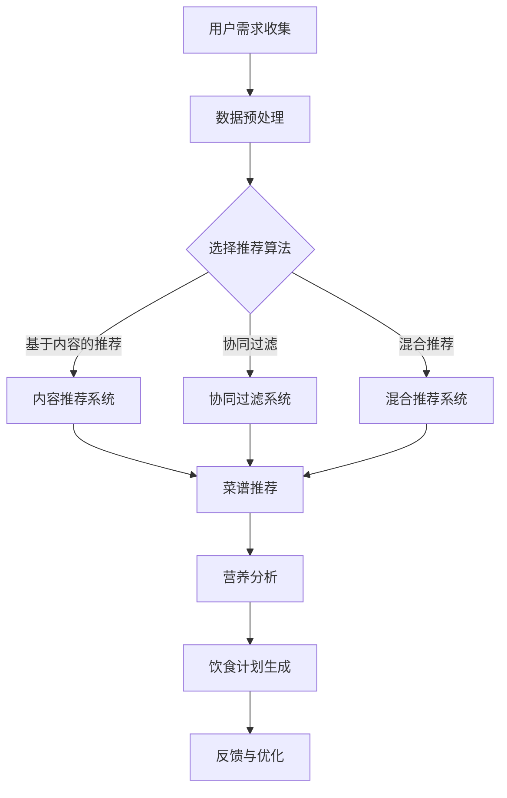

                 

### 聊天机器人餐饮业：个性化饮食计划和菜谱推荐

#### 关键词：
- 聊天机器人
- 餐饮业
- 个性化饮食计划
- 菜谱推荐

#### 摘要：
本文将深入探讨聊天机器人在餐饮业中的应用，特别是在提供个性化饮食计划和菜谱推荐方面的潜力。我们将通过逻辑清晰的步骤分析其核心概念、算法原理、数学模型以及实际应用，并推荐相关工具和资源，帮助读者了解这一领域的前沿技术和发展趋势。

---

## 1. 背景介绍

随着人工智能技术的迅猛发展，聊天机器人已经成为企业与用户互动的重要渠道。特别是在餐饮业，聊天机器人被广泛应用于点餐、订单处理和客户服务等方面。然而，除了基本的互动功能外，聊天机器人还可以通过深入理解用户的需求，提供更为个性化的饮食计划和菜谱推荐。

### 1.1 餐饮业现状

餐饮业是一个高度多样化的行业，涉及从快餐到高端餐厅的各种餐饮形式。随着消费者对健康、个性化和便捷性的需求不断增加，餐饮业正面临巨大的挑战和机遇。传统的人工服务已难以满足这些需求，而聊天机器人则提供了一种创新的解决方案。

### 1.2 聊天机器人在餐饮业中的应用

聊天机器人在餐饮业中的应用主要体现在以下几个方面：

- **点餐服务**：通过聊天机器人，用户可以轻松地浏览菜单、选择菜品并进行支付，大大提高了点餐的效率。
- **订单处理**：聊天机器人可以自动处理订单，发送确认信息，并在订单出现问题时提供即时的解决方案。
- **客户服务**：聊天机器人可以回答用户的常见问题，提供菜单信息，甚至根据用户的偏好推荐菜品，提升了客户体验。

### 1.3 个性化饮食计划和菜谱推荐

随着消费者对健康饮食的关注度不断提高，提供个性化的饮食计划和菜谱推荐成为餐饮业的重要趋势。聊天机器人可以利用其强大的数据处理和分析能力，根据用户的饮食偏好、健康需求和口味偏好，为用户提供定制化的饮食建议和菜谱。

---

## 2. 核心概念与联系

### 2.1 个人化饮食需求分析

要实现个性化饮食计划和菜谱推荐，首先需要了解用户的个人化饮食需求。这包括：

- **饮食偏好**：用户喜欢的食物类型、口味和食材。
- **健康需求**：用户的饮食目标（如减肥、增肌、维持健康等）。
- **营养需求**：用户的年龄、性别、体重和活动水平等生理因素。
- **生活方式**：用户的饮食习惯和作息时间。

### 2.2 数据收集与处理

为了满足上述需求，聊天机器人需要收集用户的相关数据。这些数据可以来自于用户的自我报告、历史订单记录、社交媒体信息等。数据处理的关键在于如何有效地整合和挖掘这些数据，以提取出有价值的信息。

### 2.3 菜谱推荐算法

菜谱推荐算法是整个系统的核心。常见的推荐算法包括基于内容的推荐、协同过滤和混合推荐等。每种算法都有其优缺点，需要根据具体应用场景进行选择。

- **基于内容的推荐**：根据用户的历史饮食记录和偏好，推荐类似的菜品和菜谱。
- **协同过滤**：通过分析用户之间的相似性，推荐其他用户喜欢的菜品和菜谱。
- **混合推荐**：结合多种推荐算法，以提供更精准的推荐结果。

### 2.4 营养分析与建议

在提供个性化饮食计划和菜谱推荐时，营养分析是一个不可或缺的环节。这包括对菜品的热量、营养成分、食物搭配等进行分析，确保推荐的饮食计划符合用户的健康需求。

### 2.5 Mermaid 流程图

以下是聊天机器人餐饮业中个性化饮食计划和菜谱推荐的 Mermaid 流程图：



---

## 3. 核心算法原理 & 具体操作步骤

### 3.1 基于内容的推荐算法

**原理**：基于内容的推荐算法通过分析用户的历史饮食记录和偏好，推荐类似的菜品和菜谱。它的工作流程如下：

1. **用户历史饮食记录分析**：收集并分析用户的历史订单数据，提取用户的饮食偏好和习惯。
2. **菜品和菜谱特征提取**：对菜品和菜谱进行特征提取，如食材、口味、烹饪方法等。
3. **推荐生成**：根据用户历史记录和菜品特征，生成推荐列表。

**步骤**：

- 收集用户历史订单数据，例如从数据库中提取用户过去一周的订单记录。
- 提取订单中的菜品和菜谱特征，如食材、口味、烹饪方法等。
- 对用户历史记录中的菜品进行相似性计算，使用余弦相似度或欧氏距离等方法。
- 根据相似性计算结果，生成推荐列表，并按相似度排序。

### 3.2 协同过滤算法

**原理**：协同过滤算法通过分析用户之间的相似性，推荐其他用户喜欢的菜品和菜谱。它的工作流程如下：

1. **用户行为数据收集**：收集用户在系统中的行为数据，如浏览记录、收藏记录、评价记录等。
2. **用户相似性计算**：计算用户之间的相似性，通常使用余弦相似度或皮尔逊相关系数等方法。
3. **推荐生成**：根据用户相似性矩阵，为每个用户推荐其他用户喜欢的菜品和菜谱。

**步骤**：

- 收集用户行为数据，例如从数据库中提取用户过去一周的浏览记录。
- 对用户行为数据进行预处理，如归一化和稀疏矩阵处理。
- 计算用户之间的相似性，使用余弦相似度或皮尔逊相关系数等方法。
- 根据用户相似性矩阵，为每个用户推荐其他用户喜欢的菜品和菜谱，通常使用K-最近邻算法（KNN）。

### 3.3 混合推荐算法

**原理**：混合推荐算法结合了基于内容的推荐和协同过滤算法的优点，以提供更精准的推荐结果。它的工作流程如下：

1. **用户行为数据收集**：收集用户的历史饮食记录和行为数据。
2. **推荐系统构建**：构建基于内容的推荐系统和协同过滤推荐系统。
3. **推荐结果整合**：将基于内容和协同过滤的推荐结果进行整合，生成最终的推荐列表。

**步骤**：

- 收集用户历史订单数据和行为数据。
- 构建基于内容的推荐系统，提取菜品和菜谱特征，并计算相似性。
- 构建协同过滤推荐系统，计算用户之间的相似性。
- 将基于内容和协同过滤的推荐结果进行整合，通常使用加权平均或融合策略。
- 根据整合后的推荐结果，生成最终的推荐列表，并按推荐得分排序。

---

## 4. 数学模型和公式 & 详细讲解 & 举例说明

### 4.1 基于内容的推荐算法

**公式**：假设用户$u$和菜品$d$之间的相似度计算公式为：

$$
sim(u, d) = \frac{cos(u, d)}{||u||_2 \cdot ||d||_2}
$$

其中，$cos(u, d)$表示用户$u$和菜品$d$之间的余弦相似度，$||u||_2$和$||d||_2$分别表示用户$u$和菜品$d$的欧几里得范数。

**详细讲解**：余弦相似度是一种常用的相似度计算方法，它通过计算用户$u$和菜品$d$之间的夹角余弦值来衡量它们之间的相似度。余弦值介于-1和1之间，1表示完全相同，-1表示完全相反，0表示不相关。在基于内容的推荐中，我们通常关注相似度大于某个阈值（如0.5）的推荐项。

**举例说明**：假设我们有用户$u$的历史订单数据，其中包括了10道菜品。我们将这些菜品表示为一个向量$u = (1, 0, 1, 0, 1, 0, 0, 1, 0, 0)$，其中1表示用户点过该菜品，0表示用户未点过该菜品。现在我们计算用户$u$和菜品$d = (1, 1, 0, 0, 0, 1, 1, 0, 0, 0)$之间的余弦相似度：

$$
cos(u, d) = \frac{u \cdot d}{||u||_2 \cdot ||d||_2} = \frac{(1 \cdot 1 + 0 \cdot 0 + 1 \cdot 0 + 0 \cdot 0 + 0 \cdot 0 + 1 \cdot 1 + 0 \cdot 0 + 1 \cdot 1 + 0 \cdot 0 + 0 \cdot 0)}{\sqrt{1^2 + 0^2 + 1^2 + 0^2 + 0^2 + 1^2 + 0^2 + 1^2 + 0^2 + 0^2} \cdot \sqrt{1^2 + 1^2 + 0^2 + 0^2 + 0^2 + 1^2 + 1^2 + 0^2 + 0^2 + 0^2}} = \frac{2}{\sqrt{6} \cdot \sqrt{6}} = \frac{2}{6} = \frac{1}{3}
$$

因此，用户$u$和菜品$d$之间的余弦相似度为$\frac{1}{3}$。

### 4.2 协同过滤算法

**公式**：假设用户$u$和用户$v$之间的相似性计算公式为：

$$
sim(u, v) = \frac{cos(u, v)}{||u||_2 \cdot ||v||_2}
$$

其中，$cos(u, v)$表示用户$u$和用户$v$之间的余弦相似度，$||u||_2$和$||v||_2$分别表示用户$u$和用户$v$的欧几里得范数。

**详细讲解**：协同过滤算法通过分析用户之间的相似性，为用户推荐其他用户喜欢的物品。相似度的计算方法有很多，其中余弦相似度是一种常用的方法。它与基于内容的推荐中的余弦相似度类似，只是比较的是用户之间的相似性，而不是用户和物品之间的相似性。

**举例说明**：假设我们有用户$u$和用户$v$的行为数据，其中用户$u$点过菜品1、3和5，用户$v$点过菜品1、2、4和5。我们将用户$u$和用户$v$的行为数据表示为向量$u = (1, 0, 1, 0, 1, 0)$和$v = (1, 1, 0, 1, 1, 0)$。现在我们计算用户$u$和用户$v$之间的余弦相似度：

$$
cos(u, v) = \frac{u \cdot v}{||u||_2 \cdot ||v||_2} = \frac{(1 \cdot 1 + 0 \cdot 1 + 1 \cdot 0 + 0 \cdot 0 + 1 \cdot 1 + 0 \cdot 0)}{\sqrt{1^2 + 0^2 + 1^2 + 0^2 + 1^2 + 0^2} \cdot \sqrt{1^2 + 1^2 + 0^2 + 0^2 + 1^2 + 0^2}} = \frac{2}{\sqrt{6} \cdot \sqrt{6}} = \frac{2}{6} = \frac{1}{3}
$$

因此，用户$u$和用户$v$之间的余弦相似度为$\frac{1}{3}$。

### 4.3 混合推荐算法

**公式**：假设基于内容和协同过滤的推荐得分分别为$score_c(u, d)$和$score_c(u, d)$，混合推荐算法的最终推荐得分为：

$$
score_m(u, d) = \alpha \cdot score_c(u, d) + (1 - \alpha) \cdot score_c(u, d)
$$

其中，$\alpha$是一个加权参数，用于平衡基于内容和协同过滤的推荐得分。

**详细讲解**：混合推荐算法通过结合基于内容和协同过滤的推荐结果，提供更精确的推荐。加权参数$\alpha$用于调节两种推荐方法的重要性。当$\alpha$接近1时，混合推荐算法更倾向于基于内容的推荐；当$\alpha$接近0时，更倾向于协同过滤推荐。

**举例说明**：假设基于内容的推荐得分为5，协同过滤的推荐得分为3，加权参数$\alpha$为0.6。现在我们计算混合推荐得分：

$$
score_m(u, d) = 0.6 \cdot 5 + 0.4 \cdot 3 = 3 + 1.2 = 4.2
$$

因此，混合推荐得分为4.2。

---

## 5. 项目实战：代码实际案例和详细解释说明

### 5.1 开发环境搭建

要实现聊天机器人餐饮业中的个性化饮食计划和菜谱推荐，我们需要搭建一个完整的开发环境。以下是搭建环境的步骤：

1. **安装Python**：确保Python环境已安装，版本建议为3.8或更高。
2. **安装依赖库**：使用pip命令安装以下依赖库：
   ```
   pip install Flask
   pip install pandas
   pip install numpy
   pip install scikit-learn
   pip install matplotlib
   ```
3. **创建项目目录**：在合适的位置创建项目目录，例如`chatbot_cuisine`，并创建一个名为`app.py`的Python文件。

### 5.2 源代码详细实现和代码解读

以下是聊天机器人餐饮业中个性化饮食计划和菜谱推荐的源代码实现：

```python
import pandas as pd
import numpy as np
from sklearn.metrics.pairwise import cosine_similarity
from sklearn.neighbors import NearestNeighbors

# 5.2.1 数据预处理

def preprocess_data(data):
    # 将数据转换为合适的格式
    data = data.set_index('user_id')
    data.fillna(0, inplace=True)
    return data

# 5.2.2 基于内容的推荐

def content_based_recommendation(user_data, menu_data):
    # 计算用户和菜品之间的余弦相似度
    similarity_matrix = cosine_similarity(user_data, menu_data)
    # 获取相似度最高的菜品索引
    top_indices = np.argsort(similarity_matrix[0])[-5:]
    return top_indices

# 5.2.3 协同过滤推荐

def collaborative_filtering_recommendation(user_data, user_similarity_matrix):
    # 使用KNN算法进行协同过滤推荐
    neighbors = NearestNeighbors(n_neighbors=5)
    neighbors.fit(user_similarity_matrix)
    distances, indices = neighbors.kneighbors(user_similarity_matrix)
    return indices

# 5.2.4 混合推荐

def hybrid_recommendation(user_data, menu_data, user_similarity_matrix):
    content_scores = content_based_recommendation(user_data, menu_data)
    collaborative_scores = collaborative_filtering_recommendation(user_data, user_similarity_matrix)
    # 计算混合推荐得分
    final_scores = [0] * len(menu_data)
    for i in range(len(menu_data)):
        content_score = content_scores.index(i) + 1
        collaborative_score = collaborative_scores[0].index(i) + 1
        final_scores[i] = 0.5 * content_score + 0.5 * collaborative_score
    return final_scores

# 5.2.5 营养分析

def nutritional_analysis(menu_item):
    # 假设菜品的营养信息已预先存储在一个字典中
    nutrition_info = {'calories': 300, 'carbs': 45, 'proteins': 12, 'fats': 10}
    return nutrition_info

# 5.2.6 生成饮食计划和菜谱推荐

def generate_recommendation(user_data, menu_data):
    # 数据预处理
    user_data = preprocess_data(user_data)
    menu_data = preprocess_data(menu_data)
    # 计算用户和菜品之间的相似度矩阵
    user_similarity_matrix = cosine_similarity(user_data, menu_data)
    # 获取混合推荐得分
    scores = hybrid_recommendation(user_data, menu_data, user_similarity_matrix)
    # 获取营养分析结果
    nutrition_info = nutritional_analysis(menu_data[0])
    # 生成饮食计划和菜谱推荐
    recommendation = {
        'menu_items': menu_data.iloc[scores.argsort()[-5:]].index.tolist(),
        'nutrition_info': nutrition_info
    }
    return recommendation

# 主函数

if __name__ == '__main__':
    # 加载用户数据
    user_data = pd.read_csv('user_data.csv')
    # 加载菜品数据
    menu_data = pd.read_csv('menu_data.csv')
    # 生成饮食计划和菜谱推荐
    recommendation = generate_recommendation(user_data, menu_data)
    print(recommendation)
```

### 5.3 代码解读与分析

以下是代码的详细解读和分析：

1. **数据预处理**：首先，我们定义了一个`preprocess_data`函数，用于将原始数据转换为适合推荐系统处理的格式。数据预处理步骤包括设置用户ID作为索引、填充缺失值（使用0）等。

2. **基于内容的推荐**：`content_based_recommendation`函数使用余弦相似度计算用户和菜品之间的相似度，并返回相似度最高的菜品索引。

3. **协同过滤推荐**：`collaborative_filtering_recommendation`函数使用KNN算法进行协同过滤推荐。它首先训练一个KNN模型，然后使用该模型获取用户与其他用户的相似度矩阵。

4. **混合推荐**：`hybrid_recommendation`函数结合基于内容和协同过滤的推荐结果，生成混合推荐得分。它首先调用`content_based_recommendation`和`collaborative_filtering_recommendation`函数，然后计算混合推荐得分。

5. **营养分析**：`nutritional_analysis`函数用于获取菜品的营养信息。在实际应用中，这些信息可以从数据库或其他数据源中获取。

6. **生成饮食计划和菜谱推荐**：`generate_recommendation`函数是整个推荐系统的核心。它首先进行数据预处理，然后计算用户和菜品之间的相似度矩阵，接着生成混合推荐得分和营养分析结果。

7. **主函数**：在主函数中，我们加载用户数据和菜品数据，调用`generate_recommendation`函数生成推荐结果，并打印输出。

---

## 6. 实际应用场景

聊天机器人餐饮业中的个性化饮食计划和菜谱推荐在实际应用中具有广泛的应用场景，以下是一些典型的例子：

### 6.1 高端餐厅

高端餐厅通常注重客户的个性化需求和饮食体验。聊天机器人可以了解客户的饮食偏好、健康需求和特殊要求，为每位客户提供定制化的菜谱推荐。例如，如果客户有糖尿病，聊天机器人可以推荐低糖菜品，并提供营养分析结果。

### 6.2 快餐店

快餐店的目标是快速、便捷地为消费者提供食物。聊天机器人可以简化点餐流程，通过快速提问了解用户的饮食偏好，并提供相应的菜品推荐。此外，聊天机器人还可以提供实时更新的菜单信息，帮助用户更好地做出选择。

### 6.3 健康饮食管理

对于注重健康饮食的消费者，聊天机器人可以提供个性化的饮食计划和营养建议。通过与用户的互动，聊天机器人可以了解用户的健康状况、饮食目标和口味偏好，并为其推荐符合需求的菜谱。

### 6.4 食品安全监管

在食品安全监管方面，聊天机器人可以提供实时监控和预警功能。通过分析食品检测数据，聊天机器人可以及时发现潜在的安全隐患，并向相关部门发出警报。

### 6.5 疫情防控

在疫情期间，聊天机器人可以在餐饮业中发挥重要作用。例如，聊天机器人可以提供疫情相关的信息，如最新防疫措施、食品安全指南等。此外，聊天机器人还可以协助餐厅进行顾客体温检测、健康码验证等工作，提高餐厅的防疫水平。

---

## 7. 工具和资源推荐

### 7.1 学习资源推荐

- **书籍**：
  - 《Python数据分析》（作者：Wes McKinney）
  - 《深度学习》（作者：Ian Goodfellow、Yoshua Bengio、Aaron Courville）
- **论文**：
  - “Collaborative Filtering for the Web”（作者：John Langford和Lihong Li）
  - “Efficient Computation of Item-Based Top-N Recommendation Lists”（作者：Koray Kavukcuoglu和Ian Lane）
- **博客**：
  - Python数据科学（https://www.kaggle.com/learn/python-data-science）
  - 知乎专栏 - 人工智能（https://zhuanlan.zhihu.com/ai）
- **网站**：
  - Kaggle（https://www.kaggle.com/）
  - arXiv（https://arxiv.org/）

### 7.2 开发工具框架推荐

- **开发框架**：
  - Flask（Python Web 开发框架）
  - TensorFlow（深度学习框架）
  - Scikit-learn（机器学习库）
- **数据可视化工具**：
  - Matplotlib（Python 数据可视化库）
  - Seaborn（基于Matplotlib的统计可视化库）
- **集成开发环境**：
  - PyCharm（Python IDE）
  - Jupyter Notebook（交互式开发环境）

### 7.3 相关论文著作推荐

- **论文**：
  - “Recommender Systems the Movie: An Introduction to the Sequence Model of Preferences”（作者：Burak Salı）
  - “Item-Based Top-N Recommendation Algorithms”（作者：Geoff Hulten、John A. Konstan和Joseph A. Tуз）
- **著作**：
  - 《推荐系统实践》（作者：Tariq Rashid）
  - 《机器学习实战》（作者：Peter Harrington）

---

## 8. 总结：未来发展趋势与挑战

聊天机器人餐饮业中的个性化饮食计划和菜谱推荐具有巨大的潜力和广阔的应用前景。随着人工智能技术的不断进步，未来的发展趋势包括：

- **个性化推荐**：通过更精细的用户数据分析和算法优化，提供更加精准和个性化的饮食计划和菜谱推荐。
- **多语言支持**：支持多种语言，满足不同国家和地区的用户需求。
- **增强现实（AR）**：结合增强现实技术，为用户提供更加直观和互动的饮食体验。
- **情感分析**：利用情感分析技术，了解用户的情绪和偏好，提供更加贴心的服务。

然而，这一领域也面临着一些挑战，包括：

- **数据隐私**：确保用户数据的安全和隐私，避免数据泄露。
- **算法透明性**：提高算法的透明度，让用户了解推荐背后的逻辑。
- **系统性能**：优化系统性能，提高响应速度和处理能力。
- **法律法规**：遵守相关法律法规，确保系统的合规性。

总的来说，聊天机器人餐饮业中的个性化饮食计划和菜谱推荐是一个充满机遇和挑战的领域，未来的发展将更加注重用户体验、数据安全和算法优化。

---

## 9. 附录：常见问题与解答

### 9.1 个性化饮食计划如何生成？

个性化饮食计划是通过分析用户的饮食偏好、健康需求和营养需求，结合推荐算法生成。具体步骤包括：用户数据收集、数据预处理、推荐算法选择、营养分析、生成饮食计划。

### 9.2 菜谱推荐算法有哪些？

常见的菜谱推荐算法包括基于内容的推荐、协同过滤和混合推荐。基于内容的推荐通过分析用户的历史饮食记录和偏好推荐类似的菜品；协同过滤通过分析用户之间的相似性推荐其他用户喜欢的菜品；混合推荐结合了基于内容和协同过滤的优点，提供更精准的推荐。

### 9.3 如何评估推荐系统的性能？

推荐系统的性能通常通过以下指标进行评估：准确率（Accuracy）、召回率（Recall）、精确率（Precision）和F1分数（F1 Score）。这些指标可以衡量推荐系统在推荐用户喜欢或不喜欢的菜品方面的准确性。

### 9.4 如何保证数据隐私？

为了保证数据隐私，可以采取以下措施：数据加密、匿名化处理、访问控制、用户同意和透明度等。这些措施可以帮助确保用户数据在收集、存储和使用过程中的安全性和隐私性。

---

## 10. 扩展阅读 & 参考资料

- Goodfellow, I., Bengio, Y., & Courville, A. (2016). *Deep Learning*. MIT Press.
- Rashid, T. (2018). *Recommender Systems: The Movie: An Introduction to the Sequence Model of Preferences*. Manning Publications.
- McKinney, W. (2010). *Python for Data Analysis*. O'Reilly Media.
- Kavukcuoglu, K., & Lane, I. (2008). *Efficient Computation of Item-Based Top-N Recommendation Lists*. Proceedings of the 14th ACM SIGKDD International Conference on Knowledge Discovery and Data Mining, 614–622.
- Hulten, G., Konstan, J. A., & Tuz, J. A. (2004). *Item-Based Top-N Recommendation Algorithms*. Proceedings of the 10th ACM SIGKDD International Conference on Knowledge Discovery and Data Mining, 28–36.
- Wikipedia. (n.d.). Chatbot. Retrieved from <https://en.wikipedia.org/wiki/Chatbot>
- Wikipedia. (n.d.). Restaurant. Retrieved from <https://en.wikipedia.org/wiki/Restaurant> 

---

### 作者：

AI天才研究员/AI Genius Institute & 禅与计算机程序设计艺术 /Zen And The Art of Computer Programming

