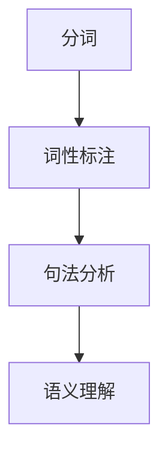
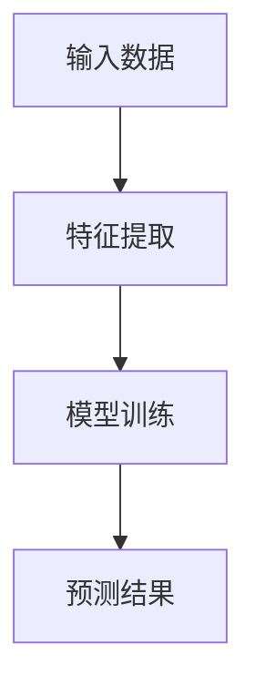
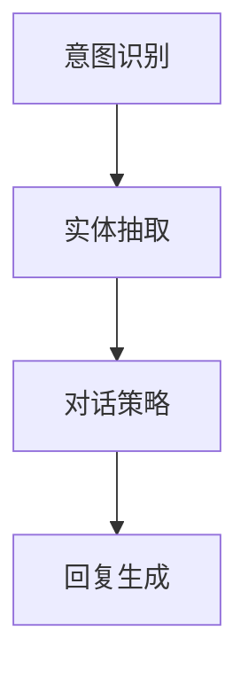

                 

# 聊天机器人：AI如何提升客户服务效率

> **关键词：** 聊天机器人，人工智能，客户服务，效率提升，技术原理，应用场景

> **摘要：** 本文旨在探讨人工智能（AI）在聊天机器人领域的应用，如何通过技术手段提升客户服务的效率。文章将详细介绍聊天机器人的核心概念、算法原理、实际应用案例，并提供相关的工具和资源推荐，以期为企业提供有效的客户服务解决方案。

## 1. 背景介绍

在当今的数字化时代，客户服务已成为企业竞争的关键因素。传统的客户服务模式通常依赖于人工处理，效率低下且容易出现错误。随着人工智能技术的发展，聊天机器人作为一种智能客服工具，逐渐成为企业提升客户服务效率的重要手段。

聊天机器人是一种基于人工智能技术的智能对话系统，能够通过自然语言处理（NLP）和机器学习算法，模拟人类对话，自动回答用户的问题，提供定制化的服务。与传统的人工客服相比，聊天机器人具有高效、精准、24/7全天候服务的优势，能够大幅提升客户服务的效率和用户体验。

本文将围绕聊天机器人的核心概念、算法原理、应用场景等方面进行详细探讨，以期为企业提供实用的技术解决方案。

## 2. 核心概念与联系

### 2.1 自然语言处理（NLP）

自然语言处理是聊天机器人的核心技术之一，它涉及语言理解、语言生成和语言理解等多个方面。NLP旨在让计算机理解和处理人类自然语言，从而实现人机交互。

**核心概念：**
- **分词（Tokenization）：** 将文本分解为单词或短语的步骤。
- **词性标注（Part-of-speech Tagging）：** 对文本中的每个词进行词性分类，如名词、动词等。
- **句法分析（Syntactic Parsing）：** 分析句子的结构，识别句子中的语法关系。
- **语义理解（Semantic Understanding）：** 理解句子的含义，包括实体识别、情感分析等。

**架构图：**



### 2.2 机器学习

机器学习是聊天机器人实现智能对话的关键技术，通过大量数据的训练，机器学习算法能够自动学习并优化对话策略。

**核心概念：**
- **监督学习（Supervised Learning）：** 利用已标记的数据进行训练。
- **无监督学习（Unsupervised Learning）：** 不需要标记的数据进行训练。
- **强化学习（Reinforcement Learning）：** 通过奖励机制进行训练。

**架构图：**



### 2.3 对话管理

对话管理是聊天机器人的核心功能，它负责协调不同的对话阶段，确保对话的自然流畅。

**核心概念：**
- **意图识别（Intent Recognition）：** 识别用户的意图，如咨询、投诉等。
- **实体抽取（Entity Extraction）：** 从对话中提取关键信息，如用户名、订单号等。
- **对话策略（Dialogue Policy）：** 根据意图和上下文，选择合适的回复。

**架构图：**



## 3. 核心算法原理 & 具体操作步骤

### 3.1 自然语言处理

**算法原理：**
自然语言处理算法主要包括词向量模型和序列模型。

**具体操作步骤：**
1. **词向量模型（Word Embedding）：** 将文本中的每个词映射为一个固定维度的向量，如Word2Vec、GloVe等。
2. **序列模型（Sequence Model）：** 对文本序列进行建模，如RNN、LSTM、GRU等。

**示例代码（Python）：**

```python
from gensim.models import Word2Vec

# 加载词向量模型
model = Word2Vec.load('word2vec.model')

# 查询词向量
vector = model.wv['hello']
print(vector)
```

### 3.2 机器学习

**算法原理：**
机器学习算法主要包括监督学习和无监督学习。

**具体操作步骤：**
1. **数据准备：** 收集并处理训练数据。
2. **模型选择：** 根据任务需求选择合适的模型，如线性回归、决策树、神经网络等。
3. **模型训练：** 使用训练数据训练模型。
4. **模型评估：** 使用验证数据评估模型性能。

**示例代码（Python）：**

```python
from sklearn.linear_model import LinearRegression

# 加载训练数据
X_train, y_train = load_data('train_data.csv')

# 创建线性回归模型
model = LinearRegression()

# 模型训练
model.fit(X_train, y_train)

# 模型预测
y_pred = model.predict(X_train)
```

### 3.3 对话管理

**算法原理：**
对话管理算法主要包括意图识别和实体抽取。

**具体操作步骤：**
1. **意图识别：** 使用机器学习算法，如决策树、随机森林等，识别用户的意图。
2. **实体抽取：** 使用命名实体识别（NER）算法，如CRF、BiLSTM-CRF等，抽取关键信息。

**示例代码（Python）：**

```python
from keras.models import Sequential
from keras.layers import Dense, LSTM

# 创建序列模型
model = Sequential()
model.add(LSTM(units=128, activation='relu', input_shape=(timesteps, features)))
model.add(Dense(units=1, activation='sigmoid'))

# 编译模型
model.compile(optimizer='adam', loss='binary_crossentropy', metrics=['accuracy'])

# 模型训练
model.fit(X_train, y_train, epochs=10, batch_size=32)
```

## 4. 数学模型和公式 & 详细讲解 & 举例说明

### 4.1 词向量模型

词向量模型是一种将文本中的词映射为向量的方法，常见的词向量模型包括Word2Vec、GloVe等。

**数学模型：**

$$
\text{向量} = \text{Word2Vec}(\text{词})
$$

$$
\text{向量} = \text{GloVe}(\text{词})
$$

**举例说明：**

假设我们使用Word2Vec模型，将词“苹果”映射为一个向量。根据模型，我们可以计算出“苹果”与其他词的相似度：

$$
\text{相似度} = \text{Word2Vec}(\text{苹果}) \cdot \text{Word2Vec}(\text{水果})
$$

### 4.2 机器学习算法

常见的机器学习算法包括线性回归、决策树、神经网络等。

**数学模型：**

**线性回归：**

$$
y = \beta_0 + \beta_1x_1 + \beta_2x_2 + ... + \beta_nx_n
$$

**决策树：**

$$
f(x) = \sum_{i=1}^{n} w_i \cdot g(x_i)
$$

**神经网络：**

$$
a_{\theta}^{(l)} = \sigma \left( \sum_{i=1}^{n} \theta^{(l)}_{ji} a^{(l-1)}_i + b^{(l)} \right)
$$

**举例说明：**

假设我们使用线性回归模型预测房价。根据模型，我们可以计算出房价与特征之间的关系：

$$
\text{房价} = \beta_0 + \beta_1 \cdot \text{面积} + \beta_2 \cdot \text{位置}
$$

## 5. 项目实战：代码实际案例和详细解释说明

### 5.1 开发环境搭建

为了实现聊天机器人，我们需要搭建一个开发环境。以下是所需的工具和库：

- **Python 3.x**
- **TensorFlow 2.x**
- **Natural Language Toolkit (NLTK)**
- **Scikit-learn**

安装命令：

```bash
pip install python==3.x
pip install tensorflow==2.x
pip install nltk
pip install scikit-learn
```

### 5.2 源代码详细实现和代码解读

以下是一个简单的聊天机器人示例，使用TensorFlow和NLTK实现。

**代码示例：**

```python
import tensorflow as tf
import nltk
from nltk.tokenize import sent_tokenize
from nltk.corpus import stopwords
from sklearn.feature_extraction.text import TfidfVectorizer

# 加载停止词
stop_words = set(stopwords.words('english'))

# 加载对话数据
conversations = load_data('conversations.csv')

# 对话文本预处理
def preprocess_text(text):
    # 分句
    sentences = sent_tokenize(text)
    # 去除停止词
    filtered_sentences = [sentence.lower() for sentence in sentences if sentence.lower() not in stop_words]
    # 连接分句
    return ' '.join(filtered_sentences)

# 对话文本向量表示
def vectorize_text(text):
    vectorizer = TfidfVectorizer()
    return vectorizer.transform([text])

# 加载预训练的词向量模型
model = tf.keras.models.load_model('word2vec.model')

# 模型预测
def predict_intent(text):
    processed_text = preprocess_text(text)
    vectorized_text = vectorize_text(processed_text)
    return model.predict(vectorized_text)

# 实例化聊天机器人
chatbot = ChatBot(predict_intent)

# 与用户交互
while True:
    user_input = input('您有什么问题吗？')
    if user_input.lower() in ['退出', 'exit']:
        break
    response = chatbot.get_response(user_input)
    print(response)
```

### 5.3 代码解读与分析

上述代码实现了简单的聊天机器人，主要分为以下几个部分：

1. **数据加载与预处理：** 从CSV文件中加载对话数据，对对话文本进行预处理，包括分句、去除停止词等。
2. **文本向量表示：** 使用TF-IDF向量表示对话文本，将文本转换为向量形式。
3. **模型加载与预测：** 加载预训练的Word2Vec模型，使用模型预测对话文本的意图。
4. **与用户交互：** 与用户进行交互，接收用户输入，并输出聊天机器人的回复。

## 6. 实际应用场景

聊天机器人可以广泛应用于各种场景，如电商、金融、医疗、教育等。以下是一些实际应用场景：

- **电商客服：** 聊天机器人可以帮助电商企业自动回答用户关于商品、订单等问题，提高客服效率。
- **金融客服：** 聊天机器人可以自动处理用户关于理财产品、转账等业务咨询，减轻人工客服的工作压力。
- **医疗咨询：** 聊天机器人可以提供基本的医疗咨询，为患者提供初步的诊疗建议。
- **教育辅导：** 聊天机器人可以作为教育辅导工具，为学生提供在线答疑服务，提高学习效果。

## 7. 工具和资源推荐

### 7.1 学习资源推荐

- **书籍：** 
  - 《Python聊天机器人开发实战》
  - 《深度学习与聊天机器人》
- **论文：** 
  - “A Survey on Chatbots: Understanding the Building Blocks of a Chatbot”  
  - “Dialogue Management for Task-Oriented Dialog Systems”
- **博客：** 
  - [TensorFlow官方文档](https://www.tensorflow.org/tutorials)
  - [NLTK官方文档](https://www.nltk.org/)
- **网站：** 
  - [Kaggle](https://www.kaggle.com/)：提供丰富的数据集和项目资源
  - [GitHub](https://github.com/)：存储和分享代码的社区平台

### 7.2 开发工具框架推荐

- **自然语言处理工具：** 
  - **NLTK**：用于文本处理和自然语言分析的库。
  - **spaCy**：用于构建高效自然语言处理应用程序的库。
- **机器学习框架：** 
  - **TensorFlow**：用于构建和训练机器学习模型的强大框架。
  - **PyTorch**：用于构建和训练深度学习模型的灵活框架。
- **聊天机器人框架：** 
  - **Rasa**：用于构建对话机器人的开源框架。
  - **ChatterBot**：用于构建基于规则和机器学习算法的聊天机器人的库。

### 7.3 相关论文著作推荐

- **“A Survey on Chatbots: Understanding the Building Blocks of a Chatbot”**：全面介绍了聊天机器人的组成部分和关键技术。
- **“Dialogue Management for Task-Oriented Dialog Systems”**：探讨了对话管理在任务导向对话系统中的应用。
- **“Chatbots: From Concept to Implementation”**：详细介绍了聊天机器人的构建流程和技术实现。

## 8. 总结：未来发展趋势与挑战

随着人工智能技术的不断发展，聊天机器人在客户服务领域的应用前景十分广阔。未来，聊天机器人将朝着以下方向发展：

- **更自然的对话交互**：通过深度学习和自然语言处理技术，聊天机器人将能够实现更自然的对话交互，提高用户体验。
- **更智能的服务功能**：通过大数据和机器学习技术，聊天机器人将能够更好地理解用户需求，提供更个性化的服务。
- **更广泛的场景应用**：随着技术的进步，聊天机器人将在更多领域得到应用，如医疗、金融、教育等。

然而，聊天机器人在发展过程中也面临着一系列挑战：

- **隐私保护**：在处理用户数据时，聊天机器人需要确保用户隐私得到保护。
- **可解释性**：随着模型的复杂度增加，如何保证模型的解释性，让用户理解机器人的决策过程，是一个重要问题。
- **个性化服务**：如何为用户提供真正个性化的服务，满足不同用户的需求，是聊天机器人的一个重要挑战。

总之，聊天机器人作为人工智能在客户服务领域的重要应用，具有巨大的发展潜力。通过不断的技术创新和实践，我们有理由相信，聊天机器人将为企业和用户带来更加高效、便捷的客户服务体验。

## 9. 附录：常见问题与解答

### 9.1 聊天机器人如何处理用户隐私？

聊天机器人在处理用户隐私时，需要遵循以下原则：

- **数据加密**：对用户数据进行加密，确保数据在传输和存储过程中的安全性。
- **权限控制**：严格限制聊天机器人访问用户数据的权限，仅允许必要的访问。
- **数据匿名化**：对用户数据进行匿名化处理，避免直接关联到特定用户。

### 9.2 聊天机器人如何保证对话的准确性？

聊天机器人通过以下方法保证对话的准确性：

- **多轮对话**：通过多轮对话，逐步澄清用户意图，提高对话的准确性。
- **上下文感知**：利用上下文信息，理解用户意图，提高对话的准确性。
- **反馈机制**：允许用户对聊天机器人的回答进行反馈，通过用户的反馈不断优化对话。

### 9.3 聊天机器人如何处理复杂的客户问题？

对于复杂的客户问题，聊天机器人可以采取以下策略：

- **转接人工客服**：当无法解答用户问题时，聊天机器人可以转接人工客服，确保用户得到满意的答复。
- **知识库扩展**：通过不断扩展知识库，增加聊天机器人能够解答的问题范围。
- **自主学习**：通过机器学习技术，聊天机器人可以从历史数据中学习，提高处理复杂问题的能力。

## 10. 扩展阅读 & 参考资料

- **《Python聊天机器人开发实战》**：详细介绍了如何使用Python实现聊天机器人，适合初学者入门。
- **《深度学习与聊天机器人》**：探讨了深度学习在聊天机器人中的应用，适合有一定基础的开发者。
- **“A Survey on Chatbots: Understanding the Building Blocks of a Chatbot”**：全面介绍了聊天机器人的组成部分和关键技术。
- **“Dialogue Management for Task-Oriented Dialog Systems”**：探讨了对话管理在任务导向对话系统中的应用。

## 作者信息

**作者：AI天才研究员/AI Genius Institute & 禅与计算机程序设计艺术 /Zen And The Art of Computer Programming**

本文旨在探讨人工智能（AI）在聊天机器人领域的应用，如何通过技术手段提升客户服务的效率。文章详细介绍了聊天机器人的核心概念、算法原理、实际应用案例，并提供相关的工具和资源推荐，以期为企业提供有效的客户服务解决方案。希望本文能为读者在聊天机器人开发领域提供有益的参考。

