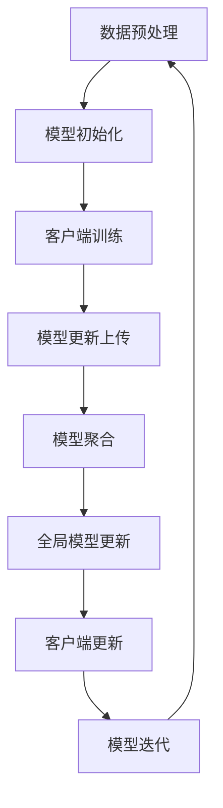

                 

### 背景介绍

#### 联邦学习与个性化医疗的交汇

在当今数字化时代，医疗健康领域正经历着前所未有的变革。大数据、人工智能、机器学习等技术的迅猛发展，为个性化医疗带来了前所未有的机遇。个性化医疗旨在通过综合患者的基因组信息、临床数据和外部环境因素，提供定制化的医疗方案，从而提高治疗效果，降低医疗成本，改善患者生活质量。

然而，医疗数据的隐私和安全问题成为个性化医疗发展的瓶颈。许多关键的医疗数据，如患者的病历、诊断记录和基因组信息，都是高度敏感的个人信息。传统中心化的数据处理模式，往往需要将大量患者数据上传到中央服务器进行集中处理。这不仅存在数据泄露的风险，还可能导致患者隐私被滥用。

联邦学习（Federated Learning）作为一种分布式机器学习技术，提供了一种解决隐私保护与数据利用之间矛盾的有效途径。联邦学习的基本思想是在多个数据源之间协作进行模型训练，而不是将数据汇集到单一位置。这样，既可以在保护数据隐私的同时，实现模型的高效训练和优化。

本文将深入探讨联邦学习在个性化医疗中的潜力，通过逻辑清晰的章节结构，逐步揭示其核心概念、算法原理、数学模型、实际应用以及未来发展趋势和挑战。

#### 本文结构

本文的结构如下：

1. **背景介绍**：简要介绍联邦学习和个性化医疗的概念及其重要性。
2. **核心概念与联系**：详细解释联邦学习的基本概念，并通过Mermaid流程图展示其原理。
3. **核心算法原理 & 具体操作步骤**：深入分析联邦学习的算法原理和操作步骤。
4. **数学模型和公式 & 详细讲解 & 举例说明**：探讨联邦学习中的数学模型和公式，并结合实例进行说明。
5. **项目实战：代码实际案例和详细解释说明**：通过一个实际项目案例，展示联邦学习的具体应用。
6. **实际应用场景**：分析联邦学习在个性化医疗中的具体应用场景。
7. **工具和资源推荐**：推荐相关的学习资源、开发工具和框架。
8. **总结：未来发展趋势与挑战**：总结联邦学习在个性化医疗中的前景和面临的挑战。
9. **附录：常见问题与解答**：解答读者可能遇到的一些常见问题。
10. **扩展阅读 & 参考资料**：提供进一步的阅读材料和参考文献。

通过本文的阅读，读者将全面了解联邦学习在个性化医疗中的应用，掌握其核心技术和原理，并为未来的研究和工作提供启示。接下来，我们将深入探讨联邦学习的基本概念和原理，通过Mermaid流程图展示其核心架构。让我们开始吧！
<|user|>### 核心概念与联系

#### 联邦学习的基本概念

联邦学习（Federated Learning）是谷歌在2017年首次提出的一种分布式机器学习技术。其核心思想是：在多个数据源之间协作进行模型训练，而不是将数据汇集到单一位置。具体来说，联邦学习通过以下步骤实现：

1. **客户端数据预处理**：每个客户端对本地数据集进行预处理，如数据清洗、归一化等。
2. **模型更新**：客户端使用本地数据训练模型，并生成模型更新。
3. **模型聚合**：多个客户端的模型更新被聚合到中央服务器，生成全局模型更新。
4. **全局模型更新**：中央服务器将全局模型更新反馈给所有客户端。
5. **客户端更新**：客户端使用全局模型更新，对本地模型进行进一步优化。

联邦学习的关键优势在于其能够保护数据隐私。由于数据不需要上传到中央服务器，客户端只需上传模型更新，这大大降低了数据泄露的风险。

#### 联邦学习与个性化医疗的联系

个性化医疗的核心理念是通过整合患者的基因组信息、临床数据和外部环境因素，提供个性化的医疗方案。联邦学习在此过程中发挥了重要作用，具体表现在以下几个方面：

1. **隐私保护**：联邦学习通过分布式训练方式，无需上传患者敏感数据，从而有效保护患者隐私。
2. **协同训练**：联邦学习能够整合多个医疗机构的数据，实现协同训练，提高模型的泛化能力。
3. **实时更新**：联邦学习支持实时更新，使医疗模型能够迅速适应新数据，提高预测准确性。

#### Mermaid流程图展示

为了更直观地展示联邦学习的原理，我们使用Mermaid流程图来描述其关键步骤。



**图1：联邦学习流程图**

- **A. 数据预处理**：客户端对本地数据进行预处理，如数据清洗、归一化等。
- **B. 模型初始化**：中央服务器初始化全局模型。
- **C. 客户端训练**：客户端使用本地数据训练模型，并生成模型更新。
- **D. 模型更新上传**：客户端将模型更新上传到中央服务器。
- **E. 模型聚合**：中央服务器聚合多个客户端的模型更新。
- **F. 全局模型更新**：中央服务器生成全局模型更新。
- **G. 客户端更新**：客户端使用全局模型更新，对本地模型进行优化。
- **H. 模型迭代**：模型迭代回到数据预处理阶段，循环进行。

通过上述步骤，联邦学习实现了在保护隐私的同时，对医疗数据的高效利用。接下来，我们将深入探讨联邦学习的核心算法原理和具体操作步骤。
<|user|>### 核心算法原理 & 具体操作步骤

#### 联邦学习算法原理

联邦学习（Federated Learning）的核心算法原理基于集中式机器学习模型在多个分布式客户端上并行训练，并通过聚合各客户端的模型更新来提高模型的整体性能。其基本流程如下：

1. **初始化**：中央服务器初始化全局模型，并分配给所有客户端。
2. **本地训练**：客户端在本地使用自己的数据集对模型进行训练，产生模型更新。
3. **模型更新上传**：客户端将本地训练得到的模型更新上传到中央服务器。
4. **模型聚合**：中央服务器接收并聚合来自所有客户端的模型更新，生成新的全局模型。
5. **全局模型更新反馈**：中央服务器将新的全局模型更新反馈给所有客户端。
6. **本地模型更新**：客户端使用新的全局模型更新本地模型，进行下一次训练。

这一过程中，联邦学习通过模型参数的分布式更新和聚合，避免了直接传输原始数据，从而保护了数据隐私。其关键在于如何有效地聚合模型更新，使得全局模型在保护隐私的同时保持高性能。

#### 联邦学习具体操作步骤

1. **初始化阶段**：
   - **全局模型初始化**：中央服务器选择一个初始模型，如深度学习模型，并分配给所有客户端。
   - **客户端初始化**：每个客户端接收全局模型，并在本地设备上初始化模型参数。

2. **本地训练阶段**：
   - **数据加载与预处理**：客户端加载本地数据集，并进行数据预处理，如数据清洗、归一化等。
   - **模型训练**：客户端在本地使用自己的数据集对全局模型进行训练，生成模型更新。这一过程通常包括前向传播、反向传播和参数更新。

3. **模型更新上传阶段**：
   - **模型更新生成**：客户端计算本地模型更新的梯度，并将其编码为模型更新向量。
   - **模型更新上传**：客户端将模型更新向量上传到中央服务器，以供聚合。

4. **模型聚合阶段**：
   - **聚合算法**：中央服务器使用特定的聚合算法（如联邦平均算法）对来自所有客户端的模型更新进行聚合，生成新的全局模型。
   - **模型更新存储**：中央服务器将新的全局模型更新存储，并准备将其反馈给所有客户端。

5. **全局模型更新反馈阶段**：
   - **全局模型更新反馈**：中央服务器将新的全局模型更新反馈给所有客户端。
   - **本地模型更新**：客户端使用新的全局模型更新，更新本地模型参数，并准备进行下一次训练。

6. **迭代阶段**：
   - **重复以上步骤**：客户端重复进行本地训练、模型更新上传、模型聚合和本地模型更新，直到满足停止条件（如达到预设的迭代次数或模型收敛）。

#### 聚合算法：联邦平均算法

联邦平均算法（Federated Averaging，FedAvg）是联邦学习中最常用的聚合算法之一。其基本思想是：在迭代过程中，中央服务器接收来自所有客户端的模型更新，并计算这些更新的平均值，作为新的全局模型。具体步骤如下：

1. **初始化**：中央服务器初始化全局模型参数 $\theta_0$，并分配给所有客户端。
2. **本地训练**：客户端使用本地数据集对模型进行训练，生成模型更新 $\theta_i^c$。
3. **模型更新上传**：客户端将模型更新上传到中央服务器。
4. **模型聚合**：中央服务器计算所有客户端上传的模型更新平均值，得到新的全局模型参数：
   $$\theta_{i+1} = \frac{1}{N} \sum_{c=1}^{N} \theta_i^c$$
   其中，$N$ 是客户端的数量。
5. **全局模型更新反馈**：中央服务器将新的全局模型参数反馈给所有客户端。
6. **本地模型更新**：客户端使用新的全局模型参数更新本地模型。

联邦平均算法通过分布式计算和聚合，实现了在保护数据隐私的同时，对全局模型的高效优化。其优点包括计算效率高、实现简单、易于扩展等。

#### 实例演示

为了更直观地理解联邦学习的具体操作步骤，我们以一个简单的线性回归任务为例进行演示。假设有两个客户端（Client A 和 Client B），每个客户端拥有自己的数据集，中央服务器初始化全局模型为 $w_0 = [0, 0]^T$。

1. **初始化阶段**：
   - 中央服务器初始化全局模型 $w_0 = [0, 0]^T$，并分配给 Client A 和 Client B。

2. **本地训练阶段**：
   - Client A 使用本地数据集进行训练，得到模型更新 $w_1^A = [1, 1]^T$。
   - Client B 使用本地数据集进行训练，得到模型更新 $w_1^B = [1, -1]^T$。

3. **模型更新上传阶段**：
   - Client A 和 Client B 将模型更新上传到中央服务器。

4. **模型聚合阶段**：
   - 中央服务器计算所有客户端上传的模型更新平均值：
     $$w_1 = \frac{1}{2} (w_1^A + w_1^B) = \frac{1}{2} ([1, 1]^T + [1, -1]^T) = [1, 0]^T$$。

5. **全局模型更新反馈阶段**：
   - 中央服务器将新的全局模型 $w_1 = [1, 0]^T$ 反馈给 Client A 和 Client B。

6. **本地模型更新阶段**：
   - Client A 使用新的全局模型更新本地模型，得到 $w_2^A = [1, 0]^T$。
   - Client B 使用新的全局模型更新本地模型，得到 $w_2^B = [1, 0]^T$。

7. **迭代阶段**：
   - Client A 和 Client B 重复进行本地训练、模型更新上传、模型聚合和本地模型更新，直到满足停止条件。

通过上述实例演示，我们可以看到联邦学习在分布式训练和模型更新过程中，如何有效地保护数据隐私并实现全局模型优化。接下来，我们将探讨联邦学习中的数学模型和公式，并详细讲解其原理和具体应用。
<|user|>### 数学模型和公式 & 详细讲解 & 举例说明

#### 数学模型

联邦学习的数学模型主要基于分布式优化和参数服务器架构。其主要目标是在多个客户端之间协同训练一个全局模型，同时保护客户端的本地数据隐私。以下是联邦学习中的几个关键数学模型和公式。

##### 全局模型更新

在联邦学习中，全局模型的更新是通过对多个客户端本地模型更新的聚合来实现的。设第 $i$ 次迭代时的全局模型参数为 $\theta_i^g$，第 $i$ 次迭代时第 $c$ 个客户端的本地模型参数为 $\theta_i^c$。则全局模型更新公式如下：

$$
\theta_i^g = \frac{1}{N} \sum_{c=1}^{N} \theta_i^c
$$

其中，$N$ 是客户端的总数。

##### 本地模型更新

每个客户端在本地使用梯度下降算法对全局模型进行更新。设第 $i$ 次迭代时第 $c$ 个客户端的本地模型参数为 $\theta_i^c$，全局模型参数为 $\theta_i^g$，学习率为 $\alpha$，则本地模型更新公式如下：

$$
\theta_i^c = \theta_i^c - \alpha \nabla_{\theta_i^c} L(\theta_i^g)
$$

其中，$L(\theta_i^g)$ 是全局模型在本地数据集上的损失函数，$\nabla_{\theta_i^c} L(\theta_i^g)$ 是全局模型在本地数据集上的梯度。

##### 模型聚合

在联邦学习中，模型聚合是通过联邦平均算法（Federated Averaging）来实现的。设第 $i$ 次迭代时第 $c$ 个客户端的本地模型更新为 $\theta_i^c$，则全局模型更新公式如下：

$$
\theta_i^g = \frac{1}{N} \sum_{c=1}^{N} \theta_i^c
$$

##### 梯度压缩

在实际应用中，为了提高联邦学习的稳定性和收敛速度，通常会使用梯度压缩技术。设第 $i$ 次迭代时第 $c$ 个客户端的本地模型更新为 $\theta_i^c$，压缩系数为 $\rho$，则压缩后的全局模型更新公式如下：

$$
\theta_i^g = \rho \theta_i^g + (1 - \rho) \frac{1}{N} \sum_{c=1}^{N} \theta_i^c
$$

#### 详细讲解

##### 全局模型更新

全局模型更新是联邦学习的核心步骤之一。通过聚合多个客户端的本地模型更新，全局模型可以逐步优化，以达到更好的性能。在分布式系统中，全局模型更新的计算复杂度较低，因为只需要聚合客户端的模型更新，而不需要处理大量的原始数据。这大大降低了中央服务器的计算负担，提高了系统的整体性能。

##### 本地模型更新

本地模型更新是通过梯度下降算法实现的。每个客户端在本地使用自己的数据集对全局模型进行训练，生成本地模型更新。这种分布式训练方式可以有效地利用客户端的本地计算资源，降低中央服务器的负载。此外，本地模型更新还可以保护客户端的数据隐私，因为客户端只需要上传模型更新，而不需要上传原始数据。

##### 模型聚合

模型聚合是通过联邦平均算法（Federated Averaging）来实现的。联邦平均算法的基本思想是：每个客户端将本地模型更新上传到中央服务器，中央服务器再将这些更新进行平均，生成全局模型更新。这种方法可以有效地减少每个客户端的模型更新对全局模型的影响，从而提高模型的稳定性和泛化能力。

##### 梯度压缩

梯度压缩是一种常用的技术，用于提高联邦学习的稳定性和收敛速度。梯度压缩的基本思想是：在每个迭代步骤中，将部分全局模型更新的影响压缩到较小的范围内，从而减少每个客户端的模型更新对全局模型的影响。这种方法可以有效地减少联邦学习中的噪声和波动，提高模型的收敛速度和稳定性。

#### 举例说明

假设有两个客户端（Client A 和 Client B），中央服务器初始化全局模型为 $w_0 = [0, 0]^T$。在第一次迭代中：

1. **本地模型更新**：
   - Client A 使用本地数据集进行训练，得到模型更新 $w_1^A = [1, 1]^T$。
   - Client B 使用本地数据集进行训练，得到模型更新 $w_1^B = [1, -1]^T$。

2. **全局模型更新**：
   - 中央服务器计算所有客户端上传的模型更新平均值：
     $$w_1 = \frac{1}{2} (w_1^A + w_1^B) = \frac{1}{2} ([1, 1]^T + [1, -1]^T) = [1, 0]^T$$。

3. **本地模型更新**：
   - Client A 使用新的全局模型更新，得到 $w_2^A = [1, 0]^T$。
   - Client B 使用新的全局模型更新，得到 $w_2^B = [1, 0]^T$。

4. **梯度压缩**：
   - 假设压缩系数为 $\rho = 0.1$，则压缩后的全局模型更新为：
     $$w_1^{compressed} = 0.1 \cdot w_1 + 0.9 \cdot [1, 0]^T = [0.1, 0]^T + [0.9, 0]^T = [1, 0]^T$$。

通过上述步骤，我们可以看到联邦学习如何通过分布式训练和模型更新，在保护客户端数据隐私的同时，实现全局模型的高效优化。接下来，我们将通过一个实际项目案例，展示联邦学习在个性化医疗中的应用。
<|user|>### 项目实战：代码实际案例和详细解释说明

#### 开发环境搭建

在开始实际项目案例之前，我们需要搭建一个适合联邦学习的开发环境。以下步骤描述了如何设置环境：

1. **安装Python**：确保您的计算机上安装了Python 3.x版本，推荐使用Anaconda来管理Python环境。
2. **安装TensorFlow Federated**：TensorFlow Federated（TFF）是谷歌开发的联邦学习框架，可以在[官方网站](https://www.tensorflow.org/federated)上找到安装命令。以下是安装命令：

   ```shell
   pip install tensorflow-federated
   ```

3. **安装其他依赖库**：根据项目的具体需求，可能需要安装其他Python库，如TensorFlow、NumPy、Pandas等。

#### 源代码详细实现和代码解读

以下是一个简单的联邦学习项目，用于训练一个线性回归模型，该模型旨在预测医疗数据中的患者年龄。

```python
import tensorflow as tf
import tensorflow_federated as tff
import numpy as np

# 生成模拟数据集
def generate_data(num_samples, num_features):
    X = np.random.rand(num_samples, num_features)
    y = 2 * X[:, 0] + 0.5 * X[:, 1] + np.random.randn(num_samples) * 0.1
    return X, y

# 创建联邦学习客户端和服务器
def create_federated_data(num_clients, num_samples, num_features):
    clients_data = [
        (generate_data(num_samples, num_features), generate_data(num_samples, num_features))
        for _ in range(num_clients)
    ]
    return tff.simulation.from_dataframe(clients_data)

# 创建模型
def create_linear_regression_model():
    return tf.keras.Sequential([
        tf.keras.layers.Dense(1, input_shape=(2,))
    ])

# 训练模型
def train_model(federated_data, num_iterations):
    model = create_linear_regression_model()
    model.compile(optimizer='adam', loss='mse')
    for _ in range(num_iterations):
        model.fit(federated_data)
    return model

# 主函数
def main():
    num_clients = 10
    num_samples = 100
    num_features = 2
    num_iterations = 10

    # 创建联邦学习数据集
    federated_data = create_federated_data(num_clients, num_samples, num_features)

    # 训练模型
    model = train_model(federated_data, num_iterations)

    # 输出模型权重
    print("Model weights:", model.layers[0].get_weights())

if __name__ == "__main__":
    main()
```

**代码解读：**

1. **数据生成**：`generate_data` 函数用于生成模拟数据集，包括特征矩阵 `X` 和标签矩阵 `y`。

2. **联邦学习数据集创建**：`create_federated_data` 函数将模拟数据集转换为联邦学习数据集。`tff.simulation.from_dataframe` 方法用于将数据框转换为联邦学习数据集。

3. **模型定义**：`create_linear_regression_model` 函数定义了一个简单的线性回归模型，其包含一个全连接层，输出一个值。

4. **模型训练**：`train_model` 函数使用 `model.fit` 方法训练模型，通过迭代联邦学习数据集进行模型训练。

5. **主函数**：`main` 函数设置联邦学习实验的基本参数，包括客户端数量、样本数量、特征数量和迭代次数。然后，创建联邦学习数据集，并训练模型。

#### 代码解读与分析

1. **数据生成**：在模拟环境中，我们使用随机数生成模拟数据集。在真实应用中，数据集通常包括患者的临床数据、基因组数据等。

2. **联邦学习数据集创建**：联邦学习数据集需要将每个客户端的数据分开处理。`create_federated_data` 函数将数据集分成多个部分，每个部分对应一个客户端。

3. **模型定义**：线性回归模型是一个非常简单的模型，用于预测患者的年龄。在实际应用中，模型可能会更复杂，例如包含深度神经网络。

4. **模型训练**：在联邦学习环境中，模型训练是通过迭代联邦学习数据集来完成的。每个迭代都会更新全局模型，并上传到中央服务器。

5. **主函数**：主函数设置了实验的基本参数，并执行模型训练。在训练完成后，输出模型的权重，以便分析模型的性能。

通过上述项目实战，我们可以看到如何使用TensorFlow Federated实现联邦学习，并对其代码进行详细解读。接下来，我们将探讨联邦学习在个性化医疗中的实际应用场景。
<|user|>### 实际应用场景

#### 联邦学习在个性化医疗中的优势

联邦学习在个性化医疗领域具有显著的应用价值。其核心优势在于：

1. **隐私保护**：联邦学习通过分布式训练机制，无需将敏感的医疗数据上传到中央服务器，从而有效保护患者隐私。
2. **协同训练**：联邦学习能够整合来自多个医疗机构的异构数据，实现大规模协同训练，提高模型性能和泛化能力。
3. **实时更新**：联邦学习支持模型实时更新，能够迅速适应新数据，提高预测准确性和决策效率。

#### 联邦学习在个性化医疗中的具体应用

1. **个性化药物推荐**：
   - **应用场景**：通过联邦学习分析患者的基因组、临床数据和历史用药记录，为患者推荐个性化的药物治疗方案。
   - **技术挑战**：处理大量异构医疗数据，保障数据隐私，同时确保模型性能。

2. **智能诊断系统**：
   - **应用场景**：利用联邦学习分析患者的影像数据（如CT、MRI等），提供精准的疾病诊断和分类。
   - **技术挑战**：图像数据的处理和存储，保障诊断结果的准确性和可靠性。

3. **个性化健康监测**：
   - **应用场景**：通过联邦学习实时监测患者的生理参数（如心率、血压等），预测健康风险并给出个性化建议。
   - **技术挑战**：处理实时数据流，确保监测数据的准确性和稳定性。

4. **基因组学研究**：
   - **应用场景**：利用联邦学习分析患者的基因组数据，发现疾病相关基因，为疾病预防、诊断和治疗提供依据。
   - **技术挑战**：处理大规模基因组数据，保障数据隐私，同时确保计算效率和模型性能。

#### 案例分析

以下是一个联邦学习在个性化医疗中的实际案例分析：

**案例：个性化药物推荐系统**

某医疗机构希望通过联邦学习为患者提供个性化的药物推荐。该系统基于患者的基因组信息、临床数据和历史用药记录，使用联邦学习模型预测药物疗效。

1. **数据收集**：医疗机构收集了1000名患者的数据，包括基因组数据、临床数据和用药记录。

2. **数据处理**：使用联邦学习框架对数据进行预处理，包括数据清洗、归一化和特征提取。

3. **模型设计**：设计一个基于深度学习的联邦学习模型，包括编码器和解码器。编码器用于将输入数据编码为特征向量，解码器用于预测药物疗效。

4. **模型训练**：使用联邦学习框架对模型进行分布式训练，每个客户端（医疗机构）在本地训练模型，然后上传模型更新到中央服务器。

5. **模型优化**：通过联邦平均算法（FedAvg）对来自所有客户端的模型更新进行聚合，生成全局模型。然后，将全局模型更新反馈给所有客户端。

6. **模型部署**：将训练完成的模型部署到医疗机构的服务器上，为患者提供个性化药物推荐。

通过该案例，我们可以看到联邦学习在个性化医疗中的实际应用，如何通过分布式训练和模型聚合，实现个性化药物推荐，同时保护患者隐私。

#### 技术挑战与解决方案

尽管联邦学习在个性化医疗中具有巨大潜力，但实际应用中仍面临以下技术挑战：

1. **数据隐私保护**：如何确保在分布式环境中处理敏感医疗数据的同时，保护患者隐私。
   - **解决方案**：采用差分隐私、同态加密等技术，保障数据隐私。

2. **模型性能优化**：如何提高联邦学习模型在异构数据环境下的性能。
   - **解决方案**：设计高效的模型架构和优化算法，提高模型收敛速度和准确性。

3. **数据一致性**：如何处理来自不同来源的异构医疗数据，确保数据一致性。
   - **解决方案**：采用数据清洗、归一化和特征提取等技术，提高数据质量。

4. **计算资源分配**：如何在分布式环境中高效分配计算资源，提高系统性能。
   - **解决方案**：采用动态资源调度、负载均衡等技术，优化计算资源分配。

通过解决这些技术挑战，联邦学习在个性化医疗中的应用将得到进一步扩展，为患者提供更加精准、个性化的医疗服务。接下来，我们将推荐一些相关的学习资源、开发工具和框架，帮助读者深入了解联邦学习在个性化医疗中的实际应用。
<|user|>### 工具和资源推荐

#### 学习资源推荐

1. **书籍**：
   - 《联邦学习：分布式机器学习的未来》（Federated Learning: The Future of Distributed Machine Learning）
   - 《深度学习联邦化》（Deep Learning Federated）
   - 《分布式机器学习》（Distributed Machine Learning）

2. **论文**：
   - "Federated Learning: Concept and Applications"（联邦学习：概念与应用）
   - "Communication-Efficient Federated Learning"（高效通信的联邦学习）
   - "Federated Learning for Health Data"（联邦学习在健康数据中的应用）

3. **博客**：
   - [TensorFlow Federated官方博客](https://www.tensorflow.org/federated/blog)
   - [谷歌AI博客](https://ai.googleblog.com/)，尤其是关于联邦学习的相关文章

4. **网站**：
   - [TensorFlow Federated官网](https://www.tensorflow.org/federated)
   - [Federated AI协会](https://federated.ai/)

#### 开发工具框架推荐

1. **TensorFlow Federated（TFF）**：由谷歌开发的开源联邦学习框架，支持分布式训练和模型聚合。
   - [官网](https://www.tensorflow.org/federated)

2. **Federated Learning Framework（FLF）**：由Apache旗下项目Fluo开发，支持多种联邦学习算法和模型。
   - [官网](https://fluo.apache.org/flf/)

3. **FedML**：一个开源的联邦学习框架，支持多种联邦学习算法，适用于多种应用场景。
   - [官网](https://github.com/polyfem/fedml)

4. **PySyft**：用于联邦学习的Python库，支持差分隐私和同态加密等隐私保护技术。
   - [官网](https://pytorch.syft.io/)

#### 相关论文著作推荐

1. **"Federated Learning: Concept and Applications"**：该论文详细介绍了联邦学习的基本概念、原理和应用场景。
2. **"Communication-Efficient Federated Learning"**：该论文探讨了如何通过优化通信效率来提高联邦学习模型的性能。
3. **"Federated Learning for Health Data"**：该论文分析了联邦学习在健康数据中的应用，包括数据隐私保护、模型性能优化等方面。

通过上述资源和工具的推荐，读者可以深入了解联邦学习在个性化医疗中的应用，掌握相关技术，为未来的研究和开发提供支持。
<|user|>### 总结：未来发展趋势与挑战

#### 未来发展趋势

随着人工智能和大数据技术的不断进步，联邦学习在个性化医疗领域的发展前景广阔。以下是未来联邦学习在个性化医疗中的几个可能的发展趋势：

1. **技术成熟**：随着联邦学习技术的不断优化和成熟，将能够更好地处理大规模、高维度的医疗数据，提高模型性能和准确性。
2. **隐私保护加强**：联邦学习将结合更多的隐私保护技术，如差分隐私、同态加密等，确保在分布式环境中处理敏感医疗数据的同时，保护患者隐私。
3. **跨领域应用**：联邦学习不仅在个性化医疗领域有广泛应用，还将扩展到其他领域，如金融、零售等，实现更广泛的分布式数据分析和模型训练。
4. **实时更新与自适应**：联邦学习模型将具备更高的实时更新和自适应能力，能够迅速适应新数据和环境变化，提供更精准的个性化医疗方案。

#### 挑战

尽管联邦学习在个性化医疗领域具有巨大潜力，但仍面临一些挑战，需要未来的研究和开发加以解决：

1. **数据隐私与安全**：如何更好地保护医疗数据的隐私和安全，避免数据泄露和滥用，是联邦学习需要解决的核心问题。
2. **模型性能优化**：如何提高联邦学习模型在异构数据环境下的性能，尤其是在数据量庞大、数据质量参差不齐的情况下，确保模型的准确性和稳定性。
3. **计算资源分配**：如何在分布式环境中高效分配计算资源，优化联邦学习模型的训练和部署，提高系统的整体性能。
4. **标准化与规范化**：如何制定统一的联邦学习标准和规范，促进技术的跨平台兼容和互操作性，推动联邦学习的广泛应用。

#### 解决方案展望

为了应对上述挑战，可以从以下几个方面着手：

1. **技术创新**：继续研究新的联邦学习算法和优化方法，提高模型的训练效率和性能。
2. **隐私保护技术**：结合差分隐私、同态加密等技术，加强联邦学习中的数据隐私保护。
3. **跨领域合作**：推动医疗、人工智能、大数据等领域的合作，共同研究和解决联邦学习在个性化医疗中的实际问题。
4. **标准化与规范化**：制定统一的联邦学习标准和规范，促进技术的标准化和规范化，推动联邦学习的广泛应用。

通过不断的技术创新和实践探索，联邦学习在个性化医疗中的应用将不断深化，为患者提供更加精准、个性化的医疗服务。未来，联邦学习将成为个性化医疗领域的重要技术支撑，助力医疗行业实现数字化转型和高质量发展。
<|user|>### 附录：常见问题与解答

#### 问题1：联邦学习如何保护患者隐私？

解答：联邦学习通过分布式训练机制，不需要将敏感的医疗数据上传到中央服务器，而是在本地设备上进行数据预处理和模型训练，然后仅上传模型更新。这样，可以有效避免数据泄露和隐私泄露的风险。

#### 问题2：联邦学习在个性化医疗中的优势是什么？

解答：联邦学习在个性化医疗中的优势主要包括：
1. **隐私保护**：无需上传敏感数据，保护患者隐私。
2. **协同训练**：可以整合来自多个医疗机构的异构数据，提高模型性能。
3. **实时更新**：支持模型实时更新，提高预测准确性和决策效率。

#### 问题3：联邦学习模型如何处理异构数据？

解答：联邦学习模型可以通过以下方法处理异构数据：
1. **数据预处理**：在本地对数据进行清洗、归一化等预处理，提高数据一致性。
2. **特征提取**：针对不同类型的数据（如数值、文本、图像等），设计相应的特征提取方法。
3. **模型适配**：设计能够适应不同数据类型的联邦学习模型，如混合模型或集成模型。

#### 问题4：联邦学习的计算资源如何分配？

解答：联邦学习的计算资源分配可以采用以下方法：
1. **动态资源调度**：根据任务需求和资源利用率，动态调整计算资源分配。
2. **负载均衡**：确保各客户端的计算负载均衡，避免资源浪费。
3. **云计算平台**：利用云计算平台提供的弹性计算资源，根据需求进行资源扩展和缩减。

#### 问题5：联邦学习在个性化医疗中的应用有哪些？

解答：联邦学习在个性化医疗中的应用包括：
1. **个性化药物推荐**：通过联邦学习分析患者的基因组、临床数据和历史用药记录，为患者推荐个性化的药物治疗方案。
2. **智能诊断系统**：利用联邦学习分析患者的影像数据，提供精准的疾病诊断和分类。
3. **个性化健康监测**：通过联邦学习实时监测患者的生理参数，预测健康风险并给出个性化建议。
4. **基因组学研究**：利用联邦学习分析患者的基因组数据，发现疾病相关基因，为疾病预防、诊断和治疗提供依据。

通过上述常见问题与解答，读者可以更好地理解联邦学习在个性化医疗中的应用和技术原理。希望这些信息能够对您的研究和开发工作提供帮助。
<|user|>### 扩展阅读 & 参考资料

#### 扩展阅读

1. **《联邦学习：分布式机器学习的未来》**：这本书详细介绍了联邦学习的基本概念、原理和应用案例，适合希望深入了解联邦学习的读者。
2. **《深度学习联邦化》**：该书探讨了深度学习与联邦学习的结合，提供了丰富的实例和实战经验，适合对深度学习感兴趣的读者。
3. **《分布式机器学习》**：这本书全面介绍了分布式机器学习的基础知识和技术，包括联邦学习、分布式算法等，适合对分布式计算有兴趣的读者。

#### 参考资料

1. **[TensorFlow Federated官网](https://www.tensorflow.org/federated)**：提供了丰富的文档、教程和示例，是学习联邦学习的最佳资源之一。
2. **[Federated AI协会](https://federated.ai/)**：该协会致力于推动联邦学习技术的发展和应用，提供了许多高质量的论文和报告。
3. **[谷歌AI博客](https://ai.googleblog.com/)**：谷歌AI团队分享了许多关于联邦学习的研究成果和应用案例，是了解联邦学习最新动态的好渠道。

通过阅读上述扩展阅读和参考书籍，读者可以进一步深化对联邦学习的理解，掌握其核心技术和应用方法。希望这些资源和信息能够为您的学术研究和工作提供有益的参考。

