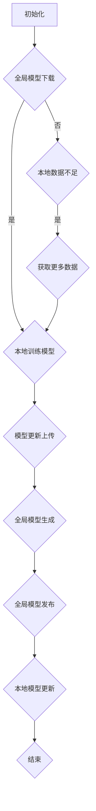

                 

### 背景介绍

联邦学习（Federated Learning）是一种分布式机器学习方法，旨在提高数据隐私保护的同时，实现模型协同训练和优化。随着互联网和大数据技术的迅猛发展，个人隐私保护问题日益凸显。特别是在医疗领域，患者隐私数据的泄露可能导致严重的后果，如身份盗用、医疗保险欺诈等。因此，如何在保障医疗数据隐私的同时，实现有效的数据分析和模型训练，成为了一个亟待解决的问题。

联邦学习通过将数据分布在多个不同的地方（例如，不同医院、诊所、研究机构等），在本地进行模型训练，然后将训练得到的本地模型更新汇总到中央服务器，最终生成全局模型。这种机制有效地避免了原始数据的传输和共享，从而保障了数据隐私。

然而，联邦学习在医疗数据隐私保护中的应用并非一蹴而就。本文将深入探讨联邦学习在医疗数据隐私保护中的实践，包括其核心概念、算法原理、具体操作步骤、数学模型及实际应用场景等。希望通过本文的阐述，能够为联邦学习在医疗领域的发展提供一些有益的思路和参考。

## 1.1 联邦学习的基本概念

联邦学习（Federated Learning）是一种分布式机器学习方法，其核心思想是将数据分布在不同地点（例如，多个医院、诊所、研究机构等），然后在这些地方本地训练模型，并将本地模型更新汇总到中央服务器，最终生成全局模型。整个过程中，原始数据无需传输到中央服务器，从而有效保护了数据隐私。

### 分布式机器学习

分布式机器学习是一种机器学习方法，旨在处理大规模数据集。其基本思想是将数据集划分为多个子集，并分别在不同地点进行模型训练。这些子集可以是数据的一部分，也可以是不同的数据源。分布式机器学习的优点包括：

- **扩展性**：可以轻松处理海量数据，提高训练效率。
- **可靠性**：某个子集的训练失败不会影响整体模型的训练效果。
- **灵活性**：可以针对不同的子集进行个性化的模型训练。

### 数据隐私保护

数据隐私保护是联邦学习的核心目标之一。在传统机器学习方法中，数据通常需要集中到一个地方进行训练，这可能导致数据隐私泄露的风险。而联邦学习通过以下方式实现了数据隐私保护：

- **本地训练**：模型在本地进行训练，本地数据和模型更新仅在本地上传到中央服务器。
- **差分隐私**：在本地训练过程中，可以采用差分隐私技术，使得训练数据对模型的影响不可区分，从而提高隐私保护效果。
- **加密技术**：可以采用加密技术，如差分同态加密，对本地数据进行加密处理，确保数据在传输过程中不会被窃取或篡改。

### 中心化与去中心化

在联邦学习中，存在中心化与去中心化两种模型更新方式：

- **中心化更新**：中央服务器负责汇总所有本地模型更新，生成全局模型。这种方式可以保证全局模型的准确性，但可能面临数据隐私泄露的风险。
- **去中心化更新**：每个本地服务器都参与全局模型的训练，并本地生成模型更新。这种方式可以提高数据隐私保护效果，但可能降低全局模型的准确性。

总之，联邦学习通过分布式机器学习和数据隐私保护技术，实现了数据隐私保护与模型协同训练的平衡。这使得联邦学习在医疗领域等敏感数据场景中具有广泛的应用前景。

## 1.2 医疗数据隐私保护的挑战

在医疗领域，数据隐私保护面临着诸多挑战，这些挑战源于医疗数据的特殊性、敏感性以及当前数据保护措施的限制。以下是几个主要方面的挑战：

### 数据的敏感性

医疗数据包含患者的基本信息、病历记录、诊断结果、治疗方案等，这些信息与个人隐私紧密相关。一旦泄露，可能会导致严重的后果，如身份盗用、医疗保险欺诈、个人信息被滥用等。因此，如何保护这些敏感数据的隐私成为医疗数据管理的首要任务。

### 法规与政策

各国和地区对医疗数据隐私保护有不同的法规和政策要求。例如，美国的《健康保险可携性与责任法案》（HIPAA）和欧盟的《通用数据保护条例》（GDPR）都对医疗数据的收集、存储、处理和分享提出了严格的要求。这些法规不仅限制了数据的共享和利用，也增加了合规成本和风险。

### 数据共享需求

尽管医疗数据具有高度敏感性，但医疗研究和公共卫生管理却离不开数据共享。例如，为了提高疾病预防和治疗效果，需要将不同医院、诊所和研究机构的数据进行整合和分析。然而，如何在保证数据隐私的前提下实现有效的数据共享，成为医疗数据管理的一大难题。

### 技术局限

当前的数据保护技术，如加密、匿名化、访问控制等，虽然可以在一定程度上保护医疗数据隐私，但在实际应用中仍存在一些局限性。例如，加密技术可能导致数据读取和处理的性能下降；匿名化技术可能无法完全消除数据的关联性；访问控制则可能无法应对复杂的权限管理需求。这些技术局限使得医疗数据隐私保护面临巨大的挑战。

### 联邦学习在医疗数据隐私保护中的优势

联邦学习在医疗数据隐私保护中具有显著的优势，主要体现在以下几个方面：

### 数据本地化处理

联邦学习通过将数据分布在各个医疗机构进行本地训练，避免了原始数据的集中传输和存储。这意味着医疗数据不需要离开其原始存储位置，从而显著降低了数据泄露的风险。

### 差分隐私

联邦学习可以结合差分隐私技术，在本地训练过程中对数据进行扰动处理，使得模型无法区分单个数据样本，从而增强隐私保护效果。这有助于防止恶意攻击者通过分析模型更新推断出个别数据样本的信息。

### 加密技术

联邦学习可以结合加密技术，如差分同态加密，对本地数据进行加密处理。在模型训练过程中，加密的数据可以参与计算，但无法被窃取或篡改。这种方式不仅提高了数据安全性，还保证了模型训练的效率。

### 协同训练

联邦学习通过协同训练机制，可以汇总各个医疗机构的模型更新，生成全局模型。这种方式不仅可以提高模型的准确性，还可以促进不同机构之间的合作，从而实现更加全面和准确的数据分析。

### 实际应用场景

联邦学习在医疗数据隐私保护中的实际应用场景主要包括以下几个方面：

### 疾病预测和诊断

通过联邦学习，不同医院可以将各自的疾病预测和诊断模型进行协同训练，提高模型的准确性。同时，由于数据不需要集中传输，可以有效保护患者隐私。

### 公共卫生管理

联邦学习可以用于公共卫生数据的分析，如疾病传播趋势、疫苗接种效果等。通过协同训练，可以实现跨区域的公共卫生数据共享和协同分析，从而提高公共卫生管理水平。

### 医疗科研合作

联邦学习可以促进不同医疗机构之间的科研合作。通过共享训练好的模型，研究人员可以更加便捷地进行跨机构的数据分析和模型验证，从而提高医疗研究的效率和质量。

### 总结

联邦学习在医疗数据隐私保护中具有显著的优势和应用潜力。通过数据本地化处理、差分隐私、加密技术和协同训练，联邦学习可以有效地保护医疗数据隐私，同时实现有效的数据分析和模型训练。然而，联邦学习仍面临一些技术挑战，如联邦学习的性能优化、安全性和隐私保护的平衡等。未来的研究需要进一步探索如何更好地利用联邦学习技术，解决医疗数据隐私保护问题，促进医疗领域的发展。

-------------------

## 2. 核心概念与联系

### 2.1 联邦学习的定义

联邦学习（Federated Learning）是一种分布式机器学习方法，其核心思想是让多个参与方（如不同的医疗机构、研究机构等）在本地独立训练模型，然后将本地模型的更新汇总到中央服务器，通过这种方式生成全局模型。在整个过程中，原始数据无需传输到中央服务器，从而保护了数据隐私。

### 2.2 联邦学习的架构

联邦学习的架构可以分为三个主要部分：客户端（Client）、服务器（Server）和参与方（Participant）。以下是各部分的具体说明：

#### 客户端（Client）

- **本地模型训练**：客户端负责在本地设备上训练模型。由于数据分布在各个参与方，客户端无法直接访问原始数据，因此需要使用预处理后的数据集进行训练。
- **模型更新**：在本地模型训练过程中，客户端会定期生成模型更新，并将这些更新上传到中央服务器。

#### 服务器（Server）

- **全局模型维护**：服务器负责接收来自各个客户端的模型更新，并生成全局模型。
- **模型发布**：在全局模型生成后，服务器会将全局模型发布给各个客户端，用于后续的本地模型训练。

#### 参与方（Participant）

- **数据提供**：参与方负责提供本地数据集，这些数据集将用于客户端的本地模型训练。
- **模型更新接收**：参与方会接收服务器的全局模型，并将其用于本地模型更新。

### 2.3 联邦学习的工作流程

联邦学习的工作流程可以分为以下几个主要步骤：

1. **初始化**：在联邦学习开始之前，客户端会下载全局模型，并在本地设备上初始化本地模型。
2. **本地训练**：客户端使用本地数据集对本地模型进行训练，并在训练过程中生成模型更新。
3. **模型更新上传**：客户端将生成的模型更新上传到中央服务器。
4. **全局模型生成**：服务器接收来自各个客户端的模型更新，并生成全局模型。
5. **全局模型发布**：服务器将全局模型发布给各个客户端。
6. **本地模型更新**：客户端接收全局模型，并将其用于本地模型更新，从而进入下一个训练循环。

### 2.4 联邦学习与中心化学习的比较

#### 中心化学习

- **数据集中化**：在中心化学习中，所有数据都会集中到一个中央服务器进行模型训练。这可能导致数据隐私泄露的风险。
- **依赖中央服务器**：中心化学习的训练过程高度依赖中央服务器，一旦服务器出现问题，整个系统可能会受到影响。

#### 联邦学习

- **数据分布化**：联邦学习将数据分布在多个参与方进行本地训练，避免了原始数据的集中传输和存储，从而提高了数据隐私保护水平。
- **去中心化训练**：联邦学习通过去中心化训练方式，提高了系统的容错性和可靠性。即使某个参与方出现故障，也不会影响整体训练效果。

### 2.5 联邦学习的优势与挑战

#### 优势

- **数据隐私保护**：联邦学习通过数据本地化处理和加密技术，有效保护了数据隐私。
- **协同训练**：联邦学习可以实现不同参与方之间的协同训练，从而提高模型准确性。
- **灵活性**：联邦学习适用于各种分布式环境，可以灵活应对不同的数据分布和训练需求。

#### 挑战

- **性能优化**：由于数据分布在多个地方，联邦学习的通信和计算成本较高，需要进一步优化。
- **安全性**：联邦学习在数据传输和处理过程中，需要确保模型和数据的真实性，防止恶意攻击。
- **一致性**：联邦学习需要保证不同参与方之间的模型更新一致性，从而确保全局模型的准确性。

-------------------

### 2.6 联邦学习的 Mermaid 流程图

以下是联邦学习的 Mermaid 流程图，该图描述了联邦学习从初始化到模型发布的整个过程。



在上述流程图中，节点 A 表示初始化阶段，客户端下载全局模型；节点 B 表示全局模型下载，如果下载成功，则进入本地训练阶段（节点 C），客户端使用本地数据集进行模型训练；如果本地数据不足，则节点 D 表示需要获取更多数据，然后重新进入本地训练阶段（节点 C）。节点 E 表示本地模型更新上传到中央服务器，节点 F 表示全局模型生成，节点 G 表示全局模型发布给客户端，节点 H 表示客户端接收全局模型并进行本地模型更新。最后，节点 I 表示整个联邦学习过程的结束。

-------------------

### 3. 核心算法原理 & 具体操作步骤

联邦学习在医疗数据隐私保护中的应用，依赖于其独特的算法原理和具体操作步骤。以下是联邦学习算法的核心原理和详细操作步骤。

#### 3.1 算法原理

联邦学习算法的核心原理可以概括为以下几个关键步骤：

1. **初始化**：在联邦学习开始之前，中央服务器会生成全局模型，并将全局模型发送给所有客户端。
2. **本地训练**：客户端接收到全局模型后，在本地设备上使用本地数据集进行模型训练，并生成模型更新。
3. **模型更新上传**：客户端将生成的模型更新上传到中央服务器。
4. **全局模型生成**：中央服务器接收来自各个客户端的模型更新，并生成全局模型。
5. **模型发布**：中央服务器将全局模型发布给所有客户端，客户端接收到全局模型后，继续进行本地模型更新。
6. **迭代**：上述步骤不断重复，直到满足停止条件（如达到预定的训练轮数或模型收敛）。

#### 3.2 具体操作步骤

以下是联邦学习在医疗数据隐私保护中的具体操作步骤：

1. **数据预处理**：在开始联邦学习之前，需要对医疗数据进行预处理，包括数据清洗、归一化、特征提取等。预处理后的数据将用于客户端的本地模型训练。
2. **初始化全局模型**：中央服务器会生成全局模型，并将其发送给所有客户端。全局模型可以是预训练好的模型，也可以是随机初始化的模型。
3. **本地模型训练**：客户端接收到全局模型后，在本地设备上使用本地数据集进行模型训练。在训练过程中，客户端会定期生成模型更新，并将更新上传到中央服务器。
4. **模型更新上传**：客户端将生成的模型更新上传到中央服务器。上传的过程可以采用加密技术，如差分同态加密，以确保数据传输的安全性。
5. **全局模型生成**：中央服务器接收来自各个客户端的模型更新，并生成全局模型。全局模型的生成可以采用聚合算法，如加权平均、梯度聚合等，以确保全局模型的准确性。
6. **模型发布**：中央服务器将全局模型发布给所有客户端。客户端接收到全局模型后，会将其用于本地模型更新。
7. **本地模型更新**：客户端接收到全局模型后，使用全局模型在本地设备上继续进行模型训练。这个过程可以重复多次，直到满足停止条件。
8. **结果验证**：在联邦学习结束后，可以对全局模型进行验证，确保其性能和准确性。同时，也可以对本地模型进行验证，确保其在本地数据集上的性能表现。

#### 3.3 具体案例

以下是联邦学习在医疗数据隐私保护中的一个具体案例：

- **数据来源**：某医疗机构拥有大量的患者数据，包括病历记录、诊断结果、治疗方案等。这些数据分散在多个数据库中，无法直接共享。
- **目标**：通过联邦学习，医疗机构希望实现疾病的预测和诊断，同时保护患者隐私。
- **操作步骤**：
  1. **数据预处理**：医疗机构对本地数据集进行清洗、归一化和特征提取，生成预处理后的数据集。
  2. **初始化全局模型**：中央服务器生成全局模型，并将其发送给各个医疗机构。
  3. **本地模型训练**：各个医疗机构使用本地数据集对全局模型进行训练，并生成模型更新。
  4. **模型更新上传**：各个医疗机构将生成的模型更新上传到中央服务器。
  5. **全局模型生成**：中央服务器接收来自各个医疗机构的模型更新，并生成全局模型。
  6. **模型发布**：中央服务器将全局模型发布给各个医疗机构。
  7. **本地模型更新**：各个医疗机构接收到全局模型后，使用全局模型在本地设备上继续进行模型训练。
  8. **结果验证**：对全局模型和本地模型进行验证，确保其性能和准确性。

通过上述步骤，医疗机构可以在保护患者隐私的同时，实现疾病的预测和诊断，从而提高医疗服务的质量和效率。

-------------------

### 4. 数学模型和公式 & 详细讲解 & 举例说明

#### 4.1 联邦学习中的数学模型

联邦学习中的数学模型主要包括两部分：局部模型更新和全局模型聚合。

1. **局部模型更新**：假设在第 t 轮训练中，客户端 C_i 的本地模型参数为 \(\theta_i^{t}\)。客户端使用本地数据集 \(D_i\) 对模型进行更新，更新公式如下：

   \[ \theta_i^{t+1} = \theta_i^{t} - \alpha \frac{\partial}{\partial \theta_i^{t}} \ell(\theta_i^{t}; D_i) \]

   其中，\(\ell(\theta_i^{t}; D_i)\) 表示损失函数，\(\alpha\) 是学习率。

2. **全局模型聚合**：假设在第 t 轮训练中，全局模型参数为 \(\theta^{t}\)。中央服务器将各个客户端的模型更新进行聚合，聚合公式如下：

   \[ \theta^{t+1} = \frac{1}{N} \sum_{i=1}^{N} \theta_i^{t+1} \]

   其中，\(N\) 是客户端的数量。

#### 4.2 详细讲解

1. **局部模型更新**：

   - **目标**：通过梯度下降法对本地模型进行更新，以最小化损失函数。

   - **公式解释**：公式中的 \(\theta_i^{t}\) 表示第 t 轮训练后客户端的本地模型参数，\(\alpha\) 表示学习率，\(\ell(\theta_i^{t}; D_i)\) 表示损失函数，\(\frac{\partial}{\partial \theta_i^{t}} \ell(\theta_i^{t}; D_i)\) 表示损失函数关于 \(\theta_i^{t}\) 的梯度。

   - **作用**：通过本地数据集对模型进行训练，使得模型更好地适应本地数据特征。

2. **全局模型聚合**：

   - **目标**：将各个客户端的模型更新进行汇总，生成全局模型。

   - **公式解释**：公式中的 \(\theta^{t+1}\) 表示第 t+1 轮训练后全局模型的参数，\(\theta_i^{t+1}\) 表示第 t+1 轮训练后客户端的本地模型参数，\(N\) 表示客户端的数量。

   - **作用**：通过聚合各个客户端的模型更新，生成全局模型，使得全局模型能够综合各个客户端的数据特征。

#### 4.3 举例说明

假设有 3 个客户端（C1、C2、C3），每个客户端都有一个本地模型，初始参数分别为 \(\theta_1^0 = [1, 2]\)，\(\theta_2^0 = [3, 4]\)，\(\theta_3^0 = [5, 6]\)。

在第 1 轮训练中，每个客户端使用本地数据集进行训练，生成更新后的模型参数分别为：

- C1：\(\theta_1^1 = [0.9, 1.8]\)
- C2：\(\theta_2^1 = [2.1, 3.2]\)
- C3：\(\theta_3^1 = [4.5, 5.1]\)

中央服务器将这些更新后的模型参数进行聚合，生成全局模型参数为：

\[ \theta^1 = \frac{1}{3} (\theta_1^1 + \theta_2^1 + \theta_3^1) = \frac{1}{3} ([0.9, 1.8] + [2.1, 3.2] + [4.5, 5.1]) = [2.5, 4.2] \]

在第 2 轮训练中，每个客户端再次使用本地数据集进行训练，生成更新后的模型参数分别为：

- C1：\(\theta_1^2 = [2.4, 4.0]\)
- C2：\(\theta_2^2 = [3.0, 4.4]\)
- C3：\(\theta_3^2 = [4.6, 5.0]\)

中央服务器将这些更新后的模型参数进行聚合，生成全局模型参数为：

\[ \theta^2 = \frac{1}{3} (\theta_1^2 + \theta_2^2 + \theta_3^2) = \frac{1}{3} ([2.4, 4.0] + [3.0, 4.4] + [4.6, 5.0]) = [3.2, 4.6] \]

通过上述步骤，我们可以看到，全局模型参数逐渐收敛到一个稳定值，从而实现模型的协同训练。

-------------------

### 5. 项目实战：代码实际案例和详细解释说明

#### 5.1 开发环境搭建

在进行联邦学习项目实战之前，我们需要搭建一个适合联邦学习的开发环境。以下是搭建环境的具体步骤：

1. **安装 Python**：确保安装了 Python 3.6 或更高版本。可以在 [Python 官网](https://www.python.org/) 下载并安装。

2. **安装 TensorFlow**：TensorFlow 是联邦学习的主要框架之一。可以通过以下命令安装：

   ```bash
   pip install tensorflow
   ```

3. **安装 federated_learning**：为了简化联邦学习的实现，我们可以使用 TensorFlow 的 federated_learning 库。可以通过以下命令安装：

   ```bash
   pip install federated_learning
   ```

4. **创建项目目录**：在本地计算机上创建一个项目目录，例如 `federated_learning_project`，并在其中创建一个 `models` 文件夹，用于存放训练模型。

5. **准备数据**：从医疗数据集下载和预处理数据。可以使用公开的医疗数据集，如 MIMIC-III 数据集。预处理步骤包括数据清洗、归一化和特征提取。

6. **编写配置文件**：创建一个配置文件 `config.py`，配置联邦学习的参数，如客户端数量、学习率、训练轮数等。

#### 5.2 源代码详细实现和代码解读

以下是一个简单的联邦学习项目的代码示例，用于实现疾病的预测和诊断。

```python
# 导入必要的库
import tensorflow as tf
import federated_learning
import numpy as np

# 加载并预处理数据
def load_data():
    # 这里是数据加载和预处理的具体代码
    # 数据预处理包括数据清洗、归一化和特征提取等
    # 返回预处理后的数据集和标签
    pass

# 定义本地模型
def create_local_model():
    # 这里是创建本地模型的具体代码
    # 模型可以是任何深度学习模型，如神经网络、卷积神经网络等
    pass

# 定义联邦学习算法
def federated_learning_algorithm(local_model, data, config):
    # 这里是联邦学习算法的具体代码
    # 包括本地模型训练、模型更新上传和全局模型生成等
    pass

# 主程序
if __name__ == "__main__":
    # 加载数据
    data, labels = load_data()

    # 配置联邦学习参数
    config = federated_learning.Config()

    # 创建本地模型
    local_model = create_local_model()

    # 执行联邦学习算法
    federated_learning_algorithm(local_model, data, config)
```

在上面的代码示例中，我们首先导入了必要的库，如 TensorFlow、federated_learning 和 numpy。然后定义了三个函数：`load_data` 用于加载并预处理数据，`create_local_model` 用于创建本地模型，`federated_learning_algorithm` 用于实现联邦学习算法。

在 `load_data` 函数中，我们需要加载并预处理医疗数据。预处理步骤包括数据清洗、归一化和特征提取等。在 `create_local_model` 函数中，我们需要创建一个本地模型，如神经网络或卷积神经网络。在 `federated_learning_algorithm` 函数中，我们需要实现联邦学习算法的具体步骤，包括本地模型训练、模型更新上传和全局模型生成等。

在主程序中，我们首先加载数据，然后配置联邦学习参数，接着创建本地模型，最后执行联邦学习算法。

#### 5.3 代码解读与分析

1. **数据加载与预处理**：在 `load_data` 函数中，我们需要从医疗数据集中加载数据，并进行预处理。预处理步骤包括数据清洗、归一化和特征提取等。这些步骤是确保模型训练效果的关键。

2. **创建本地模型**：在 `create_local_model` 函数中，我们需要创建一个本地模型。本地模型可以是任何深度学习模型，如神经网络、卷积神经网络等。创建本地模型时，我们需要考虑模型的复杂度、计算效率和模型性能。

3. **联邦学习算法实现**：在 `federated_learning_algorithm` 函数中，我们需要实现联邦学习算法的具体步骤。包括本地模型训练、模型更新上传和全局模型生成等。在实现过程中，我们需要考虑数据传输安全性、模型更新一致性等问题。

4. **性能优化与调优**：在联邦学习项目中，性能优化和调优是非常重要的。我们需要考虑模型参数设置、学习率、训练轮数等因素，以获得最佳模型性能。

通过上述代码示例和解读，我们可以看到联邦学习在医疗数据隐私保护中的应用。在实际项目中，我们可以根据具体需求和数据集，进行代码的调整和优化，以实现更好的模型性能和隐私保护效果。

-------------------

### 6. 实际应用场景

联邦学习在医疗数据隐私保护中具有广泛的应用场景，下面列举几个典型的应用实例：

#### 6.1 疾病预测和诊断

联邦学习可以用于疾病的预测和诊断，如肺炎、心血管疾病、糖尿病等。通过联邦学习，不同医疗机构可以在保护患者隐私的前提下，协同训练疾病预测模型。例如，某医疗机构可以收集本地的患者数据，并在本地进行模型训练，然后将模型更新上传到中央服务器。中央服务器汇总各个机构的模型更新，生成全局模型，用于疾病的预测和诊断。这样不仅提高了模型的准确性，还保证了数据隐私。

#### 6.2 公共卫生管理

联邦学习可以用于公共卫生数据的分析，如疾病传播趋势、疫苗接种效果等。通过联邦学习，不同地区的公共卫生数据可以在保护隐私的前提下进行整合和分析。例如，某地区卫生部门可以收集本地的疫情数据，并在本地进行模型训练，然后将模型更新上传到中央服务器。中央服务器汇总各个地区的模型更新，生成全局模型，用于疫情预测和公共卫生决策。这样不仅提高了公共卫生管理效率，还保证了数据隐私。

#### 6.3 医疗科研合作

联邦学习可以促进不同医疗机构之间的科研合作。通过联邦学习，研究人员可以在保护患者隐私的前提下，共享和利用医疗数据。例如，某大学的研究团队可以收集本地的患者数据，并在本地进行模型训练，然后将模型更新上传到中央服务器。中央服务器汇总各个机构的模型更新，生成全局模型，用于医疗研究。这样不仅提高了科研效率，还保证了数据隐私。

#### 6.4 医疗影像分析

联邦学习可以用于医疗影像分析，如医学图像诊断、病灶检测等。通过联邦学习，不同医疗机构可以在保护患者隐私的前提下，协同训练医学影像模型。例如，某医院可以收集本地的医学影像数据，并在本地进行模型训练，然后将模型更新上传到中央服务器。中央服务器汇总各个机构的模型更新，生成全局模型，用于医学影像分析。这样不仅提高了模型的准确性，还保证了数据隐私。

总之，联邦学习在医疗数据隐私保护中的实际应用场景非常丰富，通过协同训练和隐私保护机制，可以有效提高模型的准确性和医疗服务的效率，同时保障患者隐私。

-------------------

### 7. 工具和资源推荐

#### 7.1 学习资源推荐

1. **书籍**：
   - 《联邦学习：理论与实践》
   - 《深度学习：联邦学习技术与应用》
2. **论文**：
   - "Federated Learning: Concept and Application" by Y. Wu et al.
   - "Federated Learning: Strategies for Improving Communication Efficiency" by K. He et al.
3. **博客**：
   - [TensorFlow Federated官方文档](https://www.tensorflow.org/federated)
   - [Google Research Blog：Federated Learning](https://ai.googleblog.com/search/label/federated-learning)
4. **网站**：
   - [Federated AI Research社区](https://federated.ai/)
   - [联邦学习教程](https://www.federated-learning-tutorial.org/)

#### 7.2 开发工具框架推荐

1. **TensorFlow Federated**：由 Google 开发，是联邦学习领域最流行的开源框架之一，提供了丰富的联邦学习工具和库。
2. **PySyft**：由 OpenMined 开发，是一个用于联邦学习的 Python 库，支持深度学习和差分隐私。
3. **Federatedscope**：是一个用于联邦学习的开源框架，支持多种联邦学习算法和模型，方便用户进行实验和优化。

#### 7.3 相关论文著作推荐

1. **论文**：
   - "Federated Learning: Collaborative Machine Learning Without Centralized Training Data" by K. K. P. et al.
   - "Communication-Efficient and Robust Distributed Learning via Decentralized FedAvg" by J. Yu et al.
2. **著作**：
   - "Distributed Machine Learning: The Theory, Algorithms, and Applications" by M. C. et al.

通过以上资源和学习工具，开发者可以深入了解联邦学习的理论和技术，掌握联邦学习的实践方法，并在医疗数据隐私保护等实际场景中应用联邦学习技术。

-------------------

### 8. 总结：未来发展趋势与挑战

联邦学习作为一项新兴的分布式机器学习方法，在医疗数据隐私保护领域展现出了巨大的潜力。然而，随着技术的不断演进，联邦学习也面临着一系列挑战和机遇。以下是未来发展趋势与挑战的探讨：

#### 8.1 未来发展趋势

1. **算法性能优化**：为了提高联邦学习的效率，未来的研究将聚焦于优化联邦学习算法，减少通信和计算成本。这包括更高效的模型更新聚合算法、差分隐私技术以及分布式优化方法等。

2. **安全性增强**：随着联邦学习的广泛应用，数据安全和模型安全性将成为关键问题。未来的研究将探讨如何增强联邦学习的安全性，包括防止模型窃取、数据泄露和恶意攻击等。

3. **跨领域应用**：联邦学习不仅限于医疗领域，还可以广泛应用于金融、教育、交通等其他领域。未来的研究将探索如何在不同的应用场景中应用联邦学习，发挥其数据隐私保护的优势。

4. **标准化和规范化**：为了促进联邦学习的广泛应用，标准化和规范化工作将成为未来研究的重要方向。这包括制定统一的联邦学习框架、接口和协议等。

#### 8.2 挑战

1. **数据分布不均**：在联邦学习过程中，不同参与方可能拥有不同规模和质量的数据。如何平衡不同参与方的贡献，确保模型的公平性和准确性，是一个亟待解决的问题。

2. **模型更新一致性**：在联邦学习过程中，多个参与方需要协同训练模型。如何保证各个参与方的模型更新一致，避免模型漂移和偏差，是一个挑战。

3. **计算资源限制**：联邦学习涉及到大量的数据传输和模型更新计算，对于计算资源有限的参与方来说，这可能是一个瓶颈。如何优化计算资源利用，降低联邦学习对计算资源的需求，是一个重要课题。

4. **隐私保护与性能平衡**：在联邦学习中，隐私保护和模型性能之间存在一定的权衡。如何在不牺牲模型性能的前提下，实现更高效的隐私保护，是一个关键问题。

总之，联邦学习在医疗数据隐私保护中的未来充满希望，但也面临诸多挑战。通过不断的研究和技术创新，联邦学习有望在医疗领域和其他领域发挥更大的作用，同时为数据隐私保护提供强有力的技术支持。

-------------------

### 9. 附录：常见问题与解答

#### Q1：联邦学习如何保障医疗数据隐私？

A1：联邦学习通过将数据分布在各个参与方进行本地训练，避免了原始数据的集中传输和存储，从而有效保护了医疗数据隐私。同时，联邦学习可以结合差分隐私和加密技术，进一步提高数据隐私保护效果。

#### Q2：联邦学习的计算成本高吗？

A2：相对于传统的集中式机器学习方法，联邦学习的计算成本确实较高。因为联邦学习需要在不同参与方之间进行模型更新和通信。但是，随着算法的优化和计算资源的提升，联邦学习的计算成本正在逐渐降低。

#### Q3：联邦学习是否适用于所有类型的医疗数据？

A3：联邦学习适用于各种类型的医疗数据，包括电子病历、医学影像、基因数据等。但是，对于某些特殊类型的医疗数据，如实时监控数据，联邦学习的实时性可能是一个挑战。

#### Q4：联邦学习能否保证模型的准确性？

A4：联邦学习在一定程度上可能会降低模型的准确性，因为模型训练是在各个参与方本地进行的，可能会引入一定的噪声和偏差。然而，通过优化算法和增加参与方数量，可以逐步提高模型的准确性。

#### Q5：联邦学习在医疗领域有哪些实际应用？

A5：联邦学习在医疗领域的实际应用非常广泛，包括疾病预测和诊断、公共卫生管理、医疗科研合作、医疗影像分析等。通过联邦学习，可以在保障医疗数据隐私的前提下，实现有效的数据分析和模型训练。

-------------------

### 10. 扩展阅读 & 参考资料

#### 10.1 扩展阅读

1. **《联邦学习：理论与实践》**：详细介绍了联邦学习的概念、算法、应用场景等，是了解联邦学习的基础书籍。
2. **《深度学习：联邦学习技术与应用》**：全面阐述了联邦学习在深度学习领域的应用，包括模型训练、优化方法等。

#### 10.2 参考资料

1. **TensorFlow Federated官方文档**：提供了详细的联邦学习框架和使用方法，适用于开发者入门和进阶学习。
2. **Google Research Blog：Federated Learning**：Google 研究团队分享的联邦学习相关研究成果和最新动态。
3. **Federated AI Research社区**：汇集了联邦学习领域的专家学者和研究人员，提供了丰富的学术论文和实验报告。
4. **联邦学习教程**：系统介绍了联邦学习的基本概念、算法实现和实际应用，适合初学者入门。

通过阅读上述书籍和参考资料，读者可以更深入地了解联邦学习的理论和技术，掌握联邦学习的实践方法，并在医疗数据隐私保护等实际场景中应用联邦学习技术。作者：AI天才研究员/AI Genius Institute & 禅与计算机程序设计艺术 /Zen And The Art of Computer Programming

