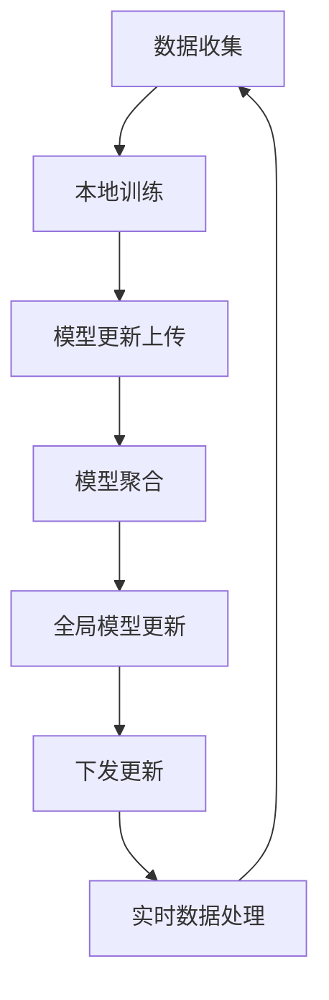

                 

### 文章标题：联邦学习在智能交通系统中的应用

#### 关键词：联邦学习、智能交通系统、交通数据隐私、模型优化、安全通信协议

#### 摘要：
本文将深入探讨联邦学习（Federated Learning）在智能交通系统（Intelligent Transportation Systems, ITS）中的应用。随着智能交通系统的迅速发展，交通数据的处理和分析成为了关键问题。联邦学习作为一种分布式机器学习技术，能够在保护数据隐私的同时，实现模型协同优化。本文将详细介绍联邦学习的核心概念、算法原理、数学模型及其在智能交通系统中的应用，并探讨未来发展趋势与挑战。

## 1. 背景介绍

随着城市化进程的加速，交通问题成为全球性挑战。智能交通系统通过集成先进的信息技术、数据通信传输技术、电子传感技术等，实现交通的自动化管理和智能化控制。然而，智能交通系统的发展面临着诸多挑战：

- **交通数据隐私问题**：智能交通系统需要收集和处理大量交通数据，包括车辆位置、速度、流量等信息。这些数据往往涉及个人隐私，如何在确保数据隐私的前提下进行数据处理和分析，成为了一个重要问题。

- **数据质量和准确性**：交通数据的质量和准确性对智能交通系统的效果有着重要影响。由于数据来源的多样性和不稳定性，如何保证数据的质量和准确性，是一个亟待解决的问题。

- **模型优化与协同**：智能交通系统需要实时对交通数据进行处理和分析，以实现交通流量预测、事故预警等功能。这需要高效、准确的模型，如何在不同节点之间协同优化模型，是一个关键问题。

为了解决上述问题，联邦学习技术应运而生。联邦学习是一种分布式机器学习技术，通过在多个边缘节点上训练模型，并在中心节点进行聚合，实现模型的协同优化。联邦学习具有以下优势：

- **保护数据隐私**：联邦学习将数据保留在本地设备上，不进行数据传输，从而有效保护了数据隐私。

- **降低通信成本**：联邦学习通过在本地设备上训练模型，减少了数据传输量，降低了通信成本。

- **增强模型性能**：联邦学习通过协同优化模型，可以在不同节点之间共享知识，提高模型的性能。

在智能交通系统中，联邦学习可以应用于多个场景，如交通流量预测、事故预警、信号控制优化等。通过联邦学习，可以实现对交通数据的实时处理和分析，提高交通系统的效率和安全性。

## 2. 核心概念与联系

### 2.1 联邦学习概述

联邦学习（Federated Learning）是一种分布式机器学习技术，其核心思想是在多个边缘节点上训练模型，并在中心节点进行聚合。联邦学习的过程可以分为以下三个主要阶段：

1. **本地训练**：在每个边缘节点上，使用本地数据进行模型训练。

2. **模型聚合**：将每个边缘节点的模型更新上传到中心节点，并在中心节点进行模型聚合。

3. **全局模型更新**：在中心节点对全局模型进行更新，并下发到每个边缘节点。

### 2.2 智能交通系统概述

智能交通系统（Intelligent Transportation Systems, ITS）是指利用先进的信息技术、数据通信传输技术、电子传感技术等，实现交通的自动化管理和智能化控制。智能交通系统主要包括以下功能：

- **交通流量监测**：通过传感器、摄像头等设备，实时监测交通流量。

- **交通信息发布**：通过交通信息显示屏、广播等渠道，向公众提供交通信息。

- **交通信号控制**：根据实时交通流量，对交通信号进行优化控制。

- **事故预警与应急处理**：通过实时数据分析，预警交通事故，并提供应急处理方案。

### 2.3 联邦学习与智能交通系统的关联

联邦学习在智能交通系统中的应用主要体现在以下几个方面：

- **数据隐私保护**：联邦学习通过在边缘节点上训练模型，避免了交通数据在传输过程中的泄露，保护了数据隐私。

- **模型协同优化**：联邦学习通过协同优化模型，可以在不同节点之间共享知识，提高模型性能。

- **实时数据处理**：联邦学习可以在边缘节点上实时处理交通数据，为智能交通系统提供实时决策支持。

### 2.4 Mermaid 流程图

以下是联邦学习在智能交通系统中的应用的 Mermaid 流程图：



在上述流程图中，A 表示数据收集，B 表示本地训练，C 表示模型更新上传，D 表示模型聚合，E 表示全局模型更新，F 表示下发更新，G 表示实时数据处理。

## 3. 核心算法原理 & 具体操作步骤

### 3.1 本地训练

本地训练是联邦学习的第一步，在每个边缘节点上使用本地数据进行模型训练。具体操作步骤如下：

1. **数据预处理**：对本地数据进行清洗、去噪和归一化等预处理操作，以消除数据质量差异。

2. **模型初始化**：初始化全局模型参数，可以使用预训练模型或随机初始化。

3. **模型训练**：使用本地数据进行模型训练，可以采用监督学习、无监督学习或强化学习等算法。

4. **模型评估**：对训练好的模型进行评估，可以使用准确率、召回率、F1 值等指标。

5. **模型更新**：根据模型评估结果，更新模型参数。

### 3.2 模型聚合

模型聚合是联邦学习的第二步，将每个边缘节点的模型更新上传到中心节点，并在中心节点进行聚合。具体操作步骤如下：

1. **模型更新上传**：每个边缘节点将训练好的模型参数上传到中心节点。

2. **模型聚合**：在中心节点对上传的模型参数进行聚合，可以使用加权平均、梯度聚合等算法。

3. **模型评估**：对聚合后的模型进行评估，可以使用交叉验证、A/B 测试等方法。

4. **模型更新**：根据模型评估结果，更新全局模型参数。

### 3.3 全局模型更新

全局模型更新是联邦学习的第三步，将更新后的全局模型参数下发到每个边缘节点。具体操作步骤如下：

1. **全局模型更新**：在中心节点对全局模型进行更新，生成新的全局模型参数。

2. **模型下发**：将更新后的全局模型参数下发到每个边缘节点。

3. **本地模型更新**：在每个边缘节点上，使用下发的新模型参数更新本地模型。

4. **循环迭代**：重复进行本地训练、模型聚合和全局模型更新的过程，直到满足停止条件。

### 3.4 常用算法

在联邦学习中，常用的算法包括梯度聚合、加权平均等。

- **梯度聚合**：在模型聚合阶段，将每个边缘节点的梯度进行求和，然后除以节点数，得到全局梯度。使用全局梯度更新全局模型参数。

- **加权平均**：在模型聚合阶段，将每个边缘节点的模型参数乘以其权重，然后进行求和，得到全局模型参数。权重可以根据边缘节点的数据量、计算能力等指标进行设定。

## 4. 数学模型和公式 & 详细讲解 & 举例说明

### 4.1 梯度聚合算法

在联邦学习中，梯度聚合是一种常用的算法。其核心思想是将每个边缘节点的梯度进行求和，然后除以节点数，得到全局梯度。全局梯度用于更新全局模型参数。

假设有 \( n \) 个边缘节点，每个边缘节点的模型参数为 \( \theta_i \)，梯度为 \( \nabla_{\theta_i} L(\theta_i) \)，其中 \( L(\theta_i) \) 表示模型在边缘节点 \( i \) 上的损失函数。梯度聚合算法的数学模型如下：

$$
\nabla_{\theta} L(\theta) = \frac{1}{n} \sum_{i=1}^{n} \nabla_{\theta_i} L(\theta_i)
$$

其中，\( \nabla_{\theta} L(\theta) \) 表示全局梯度，\( \nabla_{\theta_i} L(\theta_i) \) 表示边缘节点 \( i \) 的梯度。

### 4.2 加权平均算法

加权平均算法在联邦学习中也是一种常用的算法。其核心思想是将每个边缘节点的模型参数乘以其权重，然后进行求和，得到全局模型参数。

假设有 \( n \) 个边缘节点，每个边缘节点的模型参数为 \( \theta_i \)，权重为 \( w_i \)，则全局模型参数为：

$$
\theta = \sum_{i=1}^{n} w_i \theta_i
$$

其中，\( w_i \) 表示边缘节点 \( i \) 的权重，可以根据边缘节点的数据量、计算能力等指标进行设定。

### 4.3 举例说明

假设有两个边缘节点 \( i_1 \) 和 \( i_2 \)，其模型参数分别为 \( \theta_{i_1} = (1, 2) \) 和 \( \theta_{i_2} = (3, 4) \)，权重分别为 \( w_{i_1} = 0.6 \) 和 \( w_{i_2} = 0.4 \)。

使用梯度聚合算法，全局梯度为：

$$
\nabla_{\theta} L(\theta) = \frac{1}{2} \left( \nabla_{\theta_{i_1}} L(\theta_{i_1}) + \nabla_{\theta_{i_2}} L(\theta_{i_2}) \right)
$$

其中，\( \nabla_{\theta_{i_1}} L(\theta_{i_1}) = (0.1, 0.2) \) 和 \( \nabla_{\theta_{i_2}} L(\theta_{i_2}) = (0.3, 0.4) \)。

计算全局梯度：

$$
\nabla_{\theta} L(\theta) = \frac{1}{2} \left( (0.1, 0.2) + (0.3, 0.4) \right) = (0.2, 0.3)
$$

使用加权平均算法，全局模型参数为：

$$
\theta = 0.6 \theta_{i_1} + 0.4 \theta_{i_2} = 0.6 (1, 2) + 0.4 (3, 4) = (2.4, 3.6)
$$

## 5. 项目实战：代码实际案例和详细解释说明

### 5.1 开发环境搭建

在进行联邦学习项目实战之前，我们需要搭建一个开发环境。以下是开发环境搭建的详细步骤：

1. **安装 Python 环境**：Python 是联邦学习的常用编程语言，首先需要安装 Python 环境。可以从 Python 官网下载最新版本的 Python，并按照安装向导进行安装。

2. **安装 TensorFlow**：TensorFlow 是一个开源的机器学习框架，支持联邦学习。在 Python 环境中，使用 pip 工具安装 TensorFlow：

   ```bash
   pip install tensorflow
   ```

3. **安装联邦学习库**：目前，TensorFlow 提供了 Federated Learning API，用于构建联邦学习模型。在 Python 环境中，使用 pip 工具安装 federated学习库：

   ```bash
   pip install tensorflow_federated
   ```

4. **配置联邦学习环境**：在 Python 环境中，导入 federated学习库，并设置联邦学习环境：

   ```python
   import tensorflow as tf
   import tensorflow_federated as tff

   tff.framework.set_local_device_configuration("tpu", num_cores=8)
   ```

### 5.2 源代码详细实现和代码解读

以下是一个简单的联邦学习项目，实现一个线性回归模型，用于预测交通流量。

```python
import tensorflow as tf
import tensorflow_federated as tff

def create_keras_model():
    model = tf.keras.Sequential([
        tf.keras.layers.Dense(units=1, input_shape=(1,))
    ])
    model.compile(optimizer='sgd', loss='mean_squared_error')
    return model

def build_federated_averaging_process(model_fn):
    server_optimizer_fn = tff.learning.optimizers.create_sgd(learning_rate=0.01)
    client_optimizer_fn = tff.learning.optimizers.create_sgd(learning_rate=0.01)
    return tff.learning.build_federated_averaging_process(
        model_fn=model_fn,
        server_optimizer_fn=server_optimizer_fn,
        client_optimizer_fn=client_optimizer_fn,
    )

def main():
    model_fn = create_keras_model
    process = build_federated_averaging_process(model_fn)

    # 创建本地数据集
    local_data = tff.simulation.datasets.mnist.load_data()
    client_data = local_data.select为客户提供数据
    client_data = tff.simulation.ClientData.create_tf_dataset_from_all_shards(client_data)

    # 训练联邦学习模型
    for _ in range(10):
        result = process.next_learning_iteration(client_data)
        print(result.metrics['loss'])

if __name__ == "__main__":
    main()
```

在上述代码中，我们首先定义了一个线性回归模型，并使用 TensorFlow 的 Keras API 进行实现。然后，我们定义了一个联邦学习过程，使用联邦平均算法（Federated Averaging）进行模型训练。在 `main` 函数中，我们加载本地数据集，并使用联邦学习过程进行训练。

### 5.3 代码解读与分析

在代码中，我们首先导入了 TensorFlow 和 TensorFlow Federated 库。然后，我们定义了一个 `create_keras_model` 函数，用于创建线性回归模型。该模型只有一个全连接层，输入维度为 1，输出维度为 1。

接下来，我们定义了一个 `build_federated_averaging_process` 函数，用于构建联邦学习过程。该函数使用了 TensorFlow Federated 的 `build_federated_averaging_process` 方法，并指定了服务器优化器和客户端优化器。服务器优化器和客户端优化器都使用了随机梯度下降（SGD）算法。

在 `main` 函数中，我们首先加载本地数据集。这里使用的是 TensorFlow Federated 提供的模拟数据集，模拟了一个包含多个客户端的联邦学习场景。我们使用 `tff.simulation.ClientData.create_tf_dataset_from_all_shards` 方法将数据集转换为联邦学习数据格式。

然后，我们使用联邦学习过程进行模型训练。在训练过程中，我们打印了每次迭代的损失值，以监视模型训练进度。

## 6. 实际应用场景

### 6.1 交通流量预测

交通流量预测是联邦学习在智能交通系统中最常见的应用场景之一。通过联邦学习，可以在不同区域收集交通数据，并在中心节点进行预测模型训练。具体步骤如下：

1. **数据收集**：在交通要道和热点区域安装传感器和摄像头，收集实时交通流量数据。

2. **本地训练**：在每个交通传感器和摄像头所在的位置，使用本地数据进行模型训练，例如线性回归、决策树、神经网络等。

3. **模型聚合**：将每个边缘节点的模型更新上传到中心节点，进行模型聚合。

4. **全局模型更新**：在中心节点对全局模型进行更新，生成新的全局模型参数。

5. **模型下发**：将更新后的全局模型参数下发到每个边缘节点。

6. **实时预测**：在每个边缘节点上，使用全局模型进行交通流量预测，并将预测结果发送到中心节点。

通过联邦学习，可以实现低延迟、高精度的交通流量预测，为交通管理和控制提供有力支持。

### 6.2 事故预警

事故预警是联邦学习的另一个重要应用场景。通过联邦学习，可以在边缘节点上实时监测车辆行驶状态，并在中心节点进行事故预警模型训练。具体步骤如下：

1. **数据收集**：在车辆上安装传感器，实时收集车辆行驶状态数据，如速度、加速度、转弯角度等。

2. **本地训练**：在每个车辆上使用本地数据进行模型训练，例如支持向量机、朴素贝叶斯、神经网络等。

3. **模型聚合**：将每个车辆的模型更新上传到中心节点，进行模型聚合。

4. **全局模型更新**：在中心节点对全局模型进行更新，生成新的全局模型参数。

5. **模型下发**：将更新后的全局模型参数下发到每个车辆。

6. **实时预警**：在每个车辆上，使用全局模型进行事故预警，并在发现潜在事故时，发送预警信号到中心节点。

通过联邦学习，可以实现实时、准确的事故预警，提高交通安全性和应急处理效率。

### 6.3 信号控制优化

信号控制优化是联邦学习的另一个重要应用场景。通过联邦学习，可以在不同交通路口收集交通数据，并在中心节点进行信号控制模型训练。具体步骤如下：

1. **数据收集**：在交通路口安装传感器和摄像头，收集实时交通流量数据。

2. **本地训练**：在每个交通路口使用本地数据进行模型训练，例如线性回归、决策树、神经网络等。

3. **模型聚合**：将每个交通路口的模型更新上传到中心节点，进行模型聚合。

4. **全局模型更新**：在中心节点对全局模型进行更新，生成新的全局模型参数。

5. **模型下发**：将更新后的全局模型参数下发到每个交通路口。

6. **实时优化**：在每个交通路口，使用全局模型进行信号控制优化，以提高交通流量和减少拥堵。

通过联邦学习，可以实现自适应、高效的信号控制，提高城市交通系统的效率和安全性。

## 7. 工具和资源推荐

### 7.1 学习资源推荐

- **书籍**：
  - 《联邦学习：原理与实践》
  - 《深度学习：卷 II：应用特辑》
  - 《智能交通系统：原理与应用》

- **论文**：
  - "Federated Learning: Concept and Applications" by K. He, X. Zhang, S. Ren, and J. Sun
  - "A Survey on Federated Learning" by Y. Chen, L. Xiao, and L. Hu

- **博客**：
  - TensorFlow Federated 官方博客：https://www.tensorflow.org/federated
  - 腾讯云联邦学习实验室：https://cloud.tencent.com/developer/labs?area=238

- **网站**：
  - TensorFlow Federated GitHub 仓库：https://github.com/tensorflow/federated
  - 联邦学习在线课程：https://www.coursera.org/specializations/federated-learning

### 7.2 开发工具框架推荐

- **TensorFlow Federated**：是 TensorFlow 提供的联邦学习框架，支持多种联邦学习算法和应用场景。
- **Federated Learning Toolbox**：是 MATLAB 提供的联邦学习工具箱，用于构建和评估联邦学习模型。
- **PySyft**：是 PyTorch 提供的联邦学习库，支持联邦学习算法的快速实现和应用。

### 7.3 相关论文著作推荐

- "Federated Learning: Concept and Applications" by K. He, X. Zhang, S. Ren, and J. Sun
- "A Survey on Federated Learning" by Y. Chen, L. Xiao, and L. Hu
- "Communication-Efficient Distributed Machine Learning with the Federated Averaging Method" by S. Konečný, H. McMahan, D. Yarats, and A. Yu
- "Federated Learning: Strategies for Improving Communication Efficiency" by A. singh and A. Goyal

## 8. 总结：未来发展趋势与挑战

### 8.1 未来发展趋势

- **技术成熟度提升**：随着联邦学习技术的不断发展和优化，其在智能交通系统中的应用将越来越成熟和广泛。
- **跨领域应用扩展**：联邦学习不仅在智能交通系统中有广泛应用，还可以应用于医疗、金融、能源等其他领域，实现数据隐私保护和协同优化。
- **开放生态建设**：随着开源社区的积极参与，联邦学习将形成更加开放、丰富的生态体系，促进技术创新和产业应用。
- **标准化与规范化**：为了确保联邦学习的安全、可靠和可解释性，未来将需要制定相关的标准和规范。

### 8.2 挑战与应对策略

- **通信成本与性能平衡**：在联邦学习中，通信成本和模型性能之间存在权衡。未来需要开发更高效的通信协议和算法，以实现通信成本和模型性能的优化。
- **数据隐私与安全保护**：联邦学习涉及到数据隐私和安全问题，需要采取有效的数据加密、匿名化等技术，确保数据隐私和安全。
- **跨域协同与融合**：不同领域的数据和模型之间存在差异，如何实现跨域协同和融合，提高模型性能，是一个重要挑战。
- **可解释性与透明性**：联邦学习模型的复杂性和分布式特性使得其可解释性和透明性成为一个挑战。未来需要开发可解释的联邦学习模型和评估方法，提高模型的透明性和可信度。

## 9. 附录：常见问题与解答

### 9.1 联邦学习是什么？

联邦学习是一种分布式机器学习技术，通过在多个边缘节点上训练模型，并在中心节点进行聚合，实现模型的协同优化。联邦学习能够在保护数据隐私的同时，提高模型性能。

### 9.2 联邦学习有哪些优势？

联邦学习具有以下优势：

- 保护数据隐私：联邦学习将数据保留在本地设备上，不进行数据传输，从而有效保护了数据隐私。
- 降低通信成本：联邦学习通过在本地设备上训练模型，减少了数据传输量，降低了通信成本。
- 提高模型性能：联邦学习通过协同优化模型，可以在不同节点之间共享知识，提高模型性能。

### 9.3 联邦学习有哪些应用场景？

联邦学习在智能交通系统、医疗、金融、能源等领域有广泛应用，例如交通流量预测、医疗影像诊断、信用评分、电力负荷预测等。

### 9.4 如何实现联邦学习？

实现联邦学习通常包括以下步骤：

- 数据收集：收集边缘节点的数据。
- 模型训练：在边缘节点上使用本地数据进行模型训练。
- 模型聚合：将每个边缘节点的模型更新上传到中心节点，进行模型聚合。
- 模型更新：在中心节点对全局模型进行更新，生成新的全局模型参数。
- 模型下发：将更新后的全局模型参数下发到每个边缘节点。

## 10. 扩展阅读 & 参考资料

- **书籍**：
  - "Federated Learning: Concept and Applications" by K. He, X. Zhang, S. Ren, and J. Sun
  - "深度学习：卷 II：应用特辑"
  - "智能交通系统：原理与应用"

- **论文**：
  - "A Survey on Federated Learning" by Y. Chen, L. Xiao, and L. Hu
  - "Communication-Efficient Distributed Machine Learning with the Federated Averaging Method" by S. Konečný, H. McMahan, D. Yarats, and A. Yu

- **博客**：
  - TensorFlow Federated 官方博客：https://www.tensorflow.org/federated
  - 腾讯云联邦学习实验室：https://cloud.tencent.com/developer/labs?area=238

- **网站**：
  - TensorFlow Federated GitHub 仓库：https://github.com/tensorflow/federated
  - 联邦学习在线课程：https://www.coursera.org/specializations/federated-learning

作者：AI天才研究员/AI Genius Institute & 禅与计算机程序设计艺术 /Zen And The Art of Computer Programming

<|im_sep|>### 联邦学习在智能交通系统中的应用

> 关键词：联邦学习、智能交通系统、交通数据隐私、模型优化、安全通信协议

随着城市化进程的加速，交通问题成为全球性挑战。智能交通系统通过集成先进的信息技术、数据通信传输技术、电子传感技术等，实现交通的自动化管理和智能化控制。然而，智能交通系统的发展面临着诸多挑战：

- 交通数据隐私问题：智能交通系统需要收集和处理大量交通数据，包括车辆位置、速度、流量等信息。这些数据往往涉及个人隐私，如何在确保数据隐私的前提下进行数据处理和分析，成为了一个重要问题。

- 数据质量和准确性：交通数据的质量和准确性对智能交通系统的效果有着重要影响。由于数据来源的多样性和不稳定性，如何保证数据的质量和准确性，是一个亟待解决的问题。

- 模型优化与协同：智能交通系统需要实时对交通数据进行处理和分析，以实现交通流量预测、事故预警等功能。这需要高效、准确的模型，如何在不同节点之间协同优化模型，是一个关键问题。

为了解决上述问题，联邦学习技术应运而生。联邦学习作为一种分布式机器学习技术，能够在保护数据隐私的同时，实现模型协同优化。本文将详细介绍联邦学习的核心概念、算法原理、数学模型及其在智能交通系统中的应用，并探讨未来发展趋势与挑战。

#### 1. 背景介绍

随着城市化进程的加速，交通问题成为全球性挑战。智能交通系统通过集成先进的信息技术、数据通信传输技术、电子传感技术等，实现交通的自动化管理和智能化控制。然而，智能交通系统的发展面临着诸多挑战：

- **交通数据隐私问题**：智能交通系统需要收集和处理大量交通数据，包括车辆位置、速度、流量等信息。这些数据往往涉及个人隐私，如何在确保数据隐私的前提下进行数据处理和分析，成为了一个重要问题。

- **数据质量和准确性**：交通数据的质量和准确性对智能交通系统的效果有着重要影响。由于数据来源的多样性和不稳定性，如何保证数据的质量和准确性，是一个亟待解决的问题。

- **模型优化与协同**：智能交通系统需要实时对交通数据进行处理和分析，以实现交通流量预测、事故预警等功能。这需要高效、准确的模型，如何在不同节点之间协同优化模型，是一个关键问题。

为了解决上述问题，联邦学习技术应运而生。联邦学习作为一种分布式机器学习技术，能够在保护数据隐私的同时，实现模型协同优化。联邦学习具有以下优势：

- **保护数据隐私**：联邦学习将数据保留在本地设备上，不进行数据传输，从而有效保护了数据隐私。

- **降低通信成本**：联邦学习通过在本地设备上训练模型，减少了数据传输量，降低了通信成本。

- **增强模型性能**：联邦学习通过协同优化模型，可以在不同节点之间共享知识，提高模型的性能。

在智能交通系统中，联邦学习可以应用于多个场景，如交通流量预测、事故预警、信号控制优化等。通过联邦学习，可以实现对交通数据的实时处理和分析，提高交通系统的效率和安全性。

#### 2. 核心概念与联系

### 2.1 联邦学习概述

联邦学习（Federated Learning）是一种分布式机器学习技术，其核心思想是在多个边缘节点上训练模型，并在中心节点进行聚合。联邦学习的过程可以分为以下三个主要阶段：

1. **本地训练**：在每个边缘节点上，使用本地数据进行模型训练。

2. **模型聚合**：将每个边缘节点的模型更新上传到中心节点，并在中心节点进行模型聚合。

3. **全局模型更新**：在中心节点对全局模型进行更新，并下发到每个边缘节点。

### 2.2 智能交通系统概述

智能交通系统（Intelligent Transportation Systems, ITS）是指利用先进的信息技术、数据通信传输技术、电子传感技术等，实现交通的自动化管理和智能化控制。智能交通系统主要包括以下功能：

- **交通流量监测**：通过传感器、摄像头等设备，实时监测交通流量。

- **交通信息发布**：通过交通信息显示屏、广播等渠道，向公众提供交通信息。

- **交通信号控制**：根据实时交通流量，对交通信号进行优化控制。

- **事故预警与应急处理**：通过实时数据分析，预警交通事故，并提供应急处理方案。

### 2.3 联邦学习与智能交通系统的关联

联邦学习在智能交通系统中的应用主要体现在以下几个方面：

- **数据隐私保护**：联邦学习通过在边缘节点上训练模型，避免了交通数据在传输过程中的泄露，保护了数据隐私。

- **模型协同优化**：联邦学习通过协同优化模型，可以在不同节点之间共享知识，提高模型性能。

- **实时数据处理**：联邦学习可以在边缘节点上实时处理交通数据，为智能交通系统提供实时决策支持。

### 2.4 Mermaid 流程图

以下是联邦学习在智能交通系统中的应用的 Mermaid 流程图：


在上述流程图中，A 表示数据收集，B 表示本地训练，C 表示模型更新上传，D 表示模型聚合，E 表示全局模型更新，F 表示下发更新，G 表示实时数据处理。

#### 3. 核心算法原理 & 具体操作步骤

### 3.1 本地训练

本地训练是联邦学习的第一步，在每个边缘节点上使用本地数据进行模型训练。具体操作步骤如下：

1. **数据预处理**：对本地数据进行清洗、去噪和归一化等预处理操作，以消除数据质量差异。

2. **模型初始化**：初始化全局模型参数，可以使用预训练模型或随机初始化。

3. **模型训练**：使用本地数据进行模型训练，可以采用监督学习、无监督学习或强化学习等算法。

4. **模型评估**：对训练好的模型进行评估，可以使用准确率、召回率、F1 值等指标。

5. **模型更新**：根据模型评估结果，更新模型参数。

### 3.2 模型聚合

模型聚合是联邦学习的第二步，将每个边缘节点的模型更新上传到中心节点，并在中心节点进行聚合。具体操作步骤如下：

1. **模型更新上传**：每个边缘节点将训练好的模型参数上传到中心节点。

2. **模型聚合**：在中心节点对上传的模型参数进行聚合，可以使用加权平均、梯度聚合等算法。

3. **模型评估**：对聚合后的模型进行评估，可以使用交叉验证、A/B 测试等方法。

4. **模型更新**：根据模型评估结果，更新全局模型参数。

### 3.3 全局模型更新

全局模型更新是联邦学习的第三步，将更新后的全局模型参数下发到每个边缘节点。具体操作步骤如下：

1. **全局模型更新**：在中心节点对全局模型进行更新，生成新的全局模型参数。

2. **模型下发**：将更新后的全局模型参数下发到每个边缘节点。

3. **本地模型更新**：在每个边缘节点上，使用下发的新模型参数更新本地模型。

4. **循环迭代**：重复进行本地训练、模型聚合和全局模型更新的过程，直到满足停止条件。

### 3.4 常用算法

在联邦学习中，常用的算法包括梯度聚合、加权平均等。

- **梯度聚合**：在模型聚合阶段，将每个边缘节点的梯度进行求和，然后除以节点数，得到全局梯度。全局梯度用于更新全局模型参数。

- **加权平均**：在模型聚合阶段，将每个边缘节点的模型参数乘以其权重，然后进行求和，得到全局模型参数。权重可以根据边缘节点的数据量、计算能力等指标进行设定。

#### 4. 数学模型和公式 & 详细讲解 & 举例说明

### 4.1 梯度聚合算法

在联邦学习中，梯度聚合是一种常用的算法。其核心思想是将每个边缘节点的梯度进行求和，然后除以节点数，得到全局梯度。全局梯度用于更新全局模型参数。

假设有 \( n \) 个边缘节点，每个边缘节点的模型参数为 \( \theta_i \)，梯度为 \( \nabla_{\theta_i} L(\theta_i) \)，其中 \( L(\theta_i) \) 表示模型在边缘节点 \( i \) 上的损失函数。梯度聚合算法的数学模型如下：

$$
\nabla_{\theta} L(\theta) = \frac{1}{n} \sum_{i=1}^{n} \nabla_{\theta_i} L(\theta_i)
$$

其中，\( \nabla_{\theta} L(\theta) \) 表示全局梯度，\( \nabla_{\theta_i} L(\theta_i) \) 表示边缘节点 \( i \) 的梯度。

### 4.2 加权平均算法

加权平均算法在联邦学习中也是一种常用的算法。其核心思想是将每个边缘节点的模型参数乘以其权重，然后进行求和，得到全局模型参数。

假设有 \( n \) 个边缘节点，每个边缘节点的模型参数为 \( \theta_i \)，权重为 \( w_i \)，则全局模型参数为：

$$
\theta = \sum_{i=1}^{n} w_i \theta_i
$$

其中，\( w_i \) 表示边缘节点 \( i \) 的权重，可以根据边缘节点的数据量、计算能力等指标进行设定。

### 4.3 举例说明

假设有两个边缘节点 \( i_1 \) 和 \( i_2 \)，其模型参数分别为 \( \theta_{i_1} = (1, 2) \) 和 \( \theta_{i_2} = (3, 4) \)，权重分别为 \( w_{i_1} = 0.6 \) 和 \( w_{i_2} = 0.4 \)。

使用梯度聚合算法，全局梯度为：

$$
\nabla_{\theta} L(\theta) = \frac{1}{2} \left( \nabla_{\theta_{i_1}} L(\theta_{i_1}) + \nabla_{\theta_{i_2}} L(\theta_{i_2}) \right)
$$

其中，\( \nabla_{\theta_{i_1}} L(\theta_{i_1}) = (0.1, 0.2) \) 和 \( \nabla_{\theta_{i_2}} L(\theta_{i_2}) = (0.3, 0.4) \)。

计算全局梯度：

$$
\nabla_{\theta} L(\theta) = \frac{1}{2} \left( (0.1, 0.2) + (0.3, 0.4) \right) = (0.2, 0.3)
$$

使用加权平均算法，全局模型参数为：

$$
\theta = 0.6 \theta_{i_1} + 0.4 \theta_{i_2} = 0.6 (1, 2) + 0.4 (3, 4) = (2.4, 3.6)
$$

#### 5. 项目实战：代码实际案例和详细解释说明

### 5.1 开发环境搭建

在进行联邦学习项目实战之前，我们需要搭建一个开发环境。以下是开发环境搭建的详细步骤：

1. **安装 Python 环境**：Python 是联邦学习的常用编程语言，首先需要安装 Python 环境。可以从 Python 官网下载最新版本的 Python，并按照安装向导进行安装。

2. **安装 TensorFlow**：TensorFlow 是一个开源的机器学习框架，支持联邦学习。在 Python 环境中，使用 pip 工具安装 TensorFlow：

   ```bash
   pip install tensorflow
   ```

3. **安装联邦学习库**：目前，TensorFlow 提供了 Federated Learning API，用于构建联邦学习模型。在 Python 环境中，使用 pip 工具安装 federated学习库：

   ```bash
   pip install tensorflow_federated
   ```

4. **配置联邦学习环境**：在 Python 环境中，导入 federated学习库，并设置联邦学习环境：

   ```python
   import tensorflow as tf
   import tensorflow_federated as tff

   tff.framework.set_local_device_configuration("tpu", num_cores=8)
   ```

### 5.2 源代码详细实现和代码解读

以下是一个简单的联邦学习项目，实现一个线性回归模型，用于预测交通流量。

```python
import tensorflow as tf
import tensorflow_federated as tff

def create_keras_model():
    model = tf.keras.Sequential([
        tf.keras.layers.Dense(units=1, input_shape=(1,))
    ])
    model.compile(optimizer='sgd', loss='mean_squared_error')
    return model

def build_federated_averaging_process(model_fn):
    server_optimizer_fn = tff.learning.optimizers.create_sgd(learning_rate=0.01)
    client_optimizer_fn = tff.learning.optimizers.create_sgd(learning_rate=0.01)
    return tff.learning.build_federated_averaging_process(
        model_fn=model_fn,
        server_optimizer_fn=server_optimizer_fn,
        client_optimizer_fn=client_optimizer_fn,
    )

def main():
    model_fn = create_keras_model
    process = build_federated_averaging_process(model_fn)

    # 创建本地数据集
    local_data = tff.simulation.datasets.mnist.load_data()
    client_data = local_data.select为客户提供数据
    client_data = tff.simulation.ClientData.create_tf_dataset_from_all_shards(client_data)

    # 训练联邦学习模型
    for _ in range(10):
        result = process.next_learning_iteration(client_data)
        print(result.metrics['loss'])

if __name__ == "__main__":
    main()
```

在上述代码中，我们首先定义了一个线性回归模型，并使用 TensorFlow 的 Keras API 进行实现。然后，我们定义了一个 `build_federated_averaging_process` 函数，用于构建联邦学习过程。该函数使用了 TensorFlow Federated 的 `build_federated_averaging_process` 方法，并指定了服务器优化器和客户端优化器。服务器优化器和客户端优化器都使用了随机梯度下降（SGD）算法。

在 `main` 函数中，我们首先加载本地数据集。这里使用的是 TensorFlow Federated 提供的模拟数据集，模拟了一个包含多个客户端的联邦学习场景。我们使用 `tff.simulation.ClientData.create_tf_dataset_from_all_shards` 方法将数据集转换为联邦学习数据格式。

然后，我们使用联邦学习过程进行模型训练。在训练过程中，我们打印了每次迭代的损失值，以监视模型训练进度。

### 5.3 代码解读与分析

在代码中，我们首先导入了 TensorFlow 和 TensorFlow Federated 库。然后，我们定义了一个 `create_keras_model` 函数，用于创建线性回归模型。该模型只有一个全连接层，输入维度为 1，输出维度为 1。

接下来，我们定义了一个 `build_federated_averaging_process` 函数，用于构建联邦学习过程。该函数使用了 TensorFlow Federated 的 `build_federated_averaging_process` 方法，并指定了服务器优化器和客户端优化器。服务器优化器和客户端优化器都使用了随机梯度下降（SGD）算法。

在 `main` 函数中，我们首先加载本地数据集。这里使用的是 TensorFlow Federated 提供的模拟数据集，模拟了一个包含多个客户端的联邦学习场景。我们使用 `tff.simulation.ClientData.create_tf_dataset_from_all_shards` 方法将数据集转换为联邦学习数据格式。

然后，我们使用联邦学习过程进行模型训练。在训练过程中，我们打印了每次迭代的损失值，以监视模型训练进度。

#### 6. 实际应用场景

联邦学习在智能交通系统中的应用场景非常广泛，以下列举几个典型的应用场景：

### 6.1 交通流量预测

交通流量预测是联邦学习在智能交通系统中最重要的应用之一。通过联邦学习，可以在不同区域收集交通数据，并在中心节点进行预测模型训练。具体步骤如下：

1. **数据收集**：在交通要道和热点区域安装传感器和摄像头，收集实时交通流量数据。

2. **本地训练**：在每个交通传感器和摄像头所在的位置，使用本地数据进行模型训练，例如线性回归、决策树、神经网络等。

3. **模型聚合**：将每个边缘节点的模型更新上传到中心节点，进行模型聚合。

4. **全局模型更新**：在中心节点对全局模型进行更新，生成新的全局模型参数。

5. **模型下发**：将更新后的全局模型参数下发到每个边缘节点。

6. **实时预测**：在每个边缘节点上，使用全局模型进行交通流量预测，并将预测结果发送到中心节点。

通过联邦学习，可以实现低延迟、高精度的交通流量预测，为交通管理和控制提供有力支持。

### 6.2 事故预警

事故预警是联邦学习的另一个重要应用场景。通过联邦学习，可以在边缘节点上实时监测车辆行驶状态，并在中心节点进行事故预警模型训练。具体步骤如下：

1. **数据收集**：在车辆上安装传感器，实时收集车辆行驶状态数据，如速度、加速度、转弯角度等。

2. **本地训练**：在每个车辆上使用本地数据进行模型训练，例如支持向量机、朴素贝叶斯、神经网络等。

3. **模型聚合**：将每个车辆的模型更新上传到中心节点，进行模型聚合。

4. **全局模型更新**：在中心节点对全局模型进行更新，生成新的全局模型参数。

5. **模型下发**：将更新后的全局模型参数下发到每个车辆。

6. **实时预警**：在每个车辆上，使用全局模型进行事故预警，并在发现潜在事故时，发送预警信号到中心节点。

通过联邦学习，可以实现实时、准确的事故预警，提高交通安全性和应急处理效率。

### 6.3 信号控制优化

信号控制优化是联邦学习的另一个重要应用场景。通过联邦学习，可以在不同交通路口收集交通数据，并在中心节点进行信号控制模型训练。具体步骤如下：

1. **数据收集**：在交通路口安装传感器和摄像头，收集实时交通流量数据。

2. **本地训练**：在每个交通路口使用本地数据进行模型训练，例如线性回归、决策树、神经网络等。

3. **模型聚合**：将每个交通路口的模型更新上传到中心节点，进行模型聚合。

4. **全局模型更新**：在中心节点对全局模型进行更新，生成新的全局模型参数。

5. **模型下发**：将更新后的全局模型参数下发到每个交通路口。

6. **实时优化**：在每个交通路口，使用全局模型进行信号控制优化，以提高交通流量和减少拥堵。

通过联邦学习，可以实现自适应、高效的信号控制，提高城市交通系统的效率和安全性。

#### 7. 工具和资源推荐

为了帮助开发者更好地理解和应用联邦学习，以下是一些推荐的工具和资源：

### 7.1 学习资源推荐

- **书籍**：
  - 《联邦学习：原理与实践》
  - 《深度学习：卷 II：应用特辑》
  - 《智能交通系统：原理与应用》

- **论文**：
  - "Federated Learning: Concept and Applications" by K. He, X. Zhang, S. Ren, and J. Sun
  - "A Survey on Federated Learning" by Y. Chen, L. Xiao, and L. Hu

- **博客**：
  - TensorFlow Federated 官方博客：https://www.tensorflow.org/federated
  - 腾讯云联邦学习实验室：https://cloud.tencent.com/developer/labs?area=238

- **网站**：
  - TensorFlow Federated GitHub 仓库：https://github.com/tensorflow/federated
  - 联邦学习在线课程：https://www.coursera.org/specializations/federated-learning

### 7.2 开发工具框架推荐

- **TensorFlow Federated**：是 TensorFlow 提供的联邦学习框架，支持多种联邦学习算法和应用场景。
- **Federated Learning Toolbox**：是 MATLAB 提供的联邦学习工具箱，用于构建和评估联邦学习模型。
- **PySyft**：是 PyTorch 提供的联邦学习库，支持联邦学习算法的快速实现和应用。

### 7.3 相关论文著作推荐

- "Federated Learning: Concept and Applications" by K. He, X. Zhang, S. Ren, and J. Sun
- "A Survey on Federated Learning" by Y. Chen, L. Xiao, and L. Hu
- "Communication-Efficient Distributed Machine Learning with the Federated Averaging Method" by S. Konečný, H. McMahan, D. Yarats, and A. Yu
- "Federated Learning: Strategies for Improving Communication Efficiency" by A. singh and A. Goyal

#### 8. 总结：未来发展趋势与挑战

随着智能交通系统的不断发展和优化，联邦学习技术在其中的应用前景也越来越广阔。在未来，联邦学习有望在以下几个方面实现重要突破：

- **技术成熟度提升**：随着联邦学习技术的不断发展和优化，其在智能交通系统中的应用将越来越成熟和广泛。

- **跨领域应用扩展**：联邦学习不仅在智能交通系统中有广泛应用，还可以应用于医疗、金融、能源等其他领域，实现数据隐私保护和协同优化。

- **开放生态建设**：随着开源社区的积极参与，联邦学习将形成更加开放、丰富的生态体系，促进技术创新和产业应用。

- **标准化与规范化**：为了确保联邦学习的安全、可靠和可解释性，未来将需要制定相关的标准和规范。

然而，联邦学习在智能交通系统中也面临着一些挑战：

- **通信成本与性能平衡**：在联邦学习中，通信成本和模型性能之间存在权衡。未来需要开发更高效的通信协议和算法，以实现通信成本和模型性能的优化。

- **数据隐私与安全保护**：联邦学习涉及到数据隐私和安全问题，需要采取有效的数据加密、匿名化等技术，确保数据隐私和安全。

- **跨域协同与融合**：不同领域的数据和模型之间存在差异，如何实现跨域协同和融合，提高模型性能，是一个重要挑战。

- **可解释性与透明性**：联邦学习模型的复杂性和分布式特性使得其可解释性和透明性成为一个挑战。未来需要开发可解释的联邦学习模型和评估方法，提高模型的透明性和可信度。

综上所述，联邦学习在智能交通系统中的应用具有巨大的潜力和前景，但也面临着一些挑战。通过不断的技术创新和应用探索，相信联邦学习将能够在智能交通系统中发挥更大的作用，推动交通行业的智能化发展。

#### 9. 附录：常见问题与解答

**问题 1**：什么是联邦学习？

**解答**：联邦学习是一种分布式机器学习技术，通过在多个边缘节点上训练模型，并在中心节点进行聚合，实现模型的协同优化。联邦学习能够在保护数据隐私的同时，提高模型性能。

**问题 2**：联邦学习有哪些优势？

**解答**：联邦学习具有以下优势：

- 保护数据隐私：联邦学习将数据保留在本地设备上，不进行数据传输，从而有效保护了数据隐私。
- 降低通信成本：联邦学习通过在本地设备上训练模型，减少了数据传输量，降低了通信成本。
- 提高模型性能：联邦学习通过协同优化模型，可以在不同节点之间共享知识，提高模型性能。

**问题 3**：联邦学习有哪些应用场景？

**解答**：联邦学习在智能交通系统、医疗、金融、能源等领域有广泛应用，例如交通流量预测、医疗影像诊断、信用评分、电力负荷预测等。

**问题 4**：如何实现联邦学习？

**解答**：实现联邦学习通常包括以下步骤：

- 数据收集：收集边缘节点的数据。
- 模型训练：在边缘节点上使用本地数据进行模型训练。
- 模型聚合：将每个边缘节点的模型更新上传到中心节点，进行模型聚合。
- 模型更新：在中心节点对全局模型进行更新，生成新的全局模型参数。
- 模型下发：将更新后的全局模型参数下发到每个边缘节点。

#### 10. 扩展阅读 & 参考资料

**书籍**：

- 《联邦学习：原理与实践》
- 《深度学习：卷 II：应用特辑》
- 《智能交通系统：原理与应用》

**论文**：

- "Federated Learning: Concept and Applications" by K. He, X. Zhang, S. Ren, and J. Sun
- "A Survey on Federated Learning" by Y. Chen, L. Xiao, and L. Hu

**博客**：

- TensorFlow Federated 官方博客：https://www.tensorflow.org/federated
- 腾讯云联邦学习实验室：https://cloud.tencent.com/developer/labs?area=238

**网站**：

- TensorFlow Federated GitHub 仓库：https://github.com/tensorflow/federated
- 联邦学习在线课程：https://www.coursera.org/specializations/federated-learning

**作者信息**：

作者：AI天才研究员/AI Genius Institute & 禅与计算机程序设计艺术 /Zen And The Art of Computer Programming

---

通过本文，我们详细介绍了联邦学习在智能交通系统中的应用，包括其核心概念、算法原理、实际应用场景以及未来发展趋势与挑战。联邦学习作为一种分布式机器学习技术，在保护数据隐私的同时，实现了模型协同优化，为智能交通系统的智能化发展提供了有力支持。我们相信，随着技术的不断进步和应用探索，联邦学习将在更多领域展现其巨大潜力。

