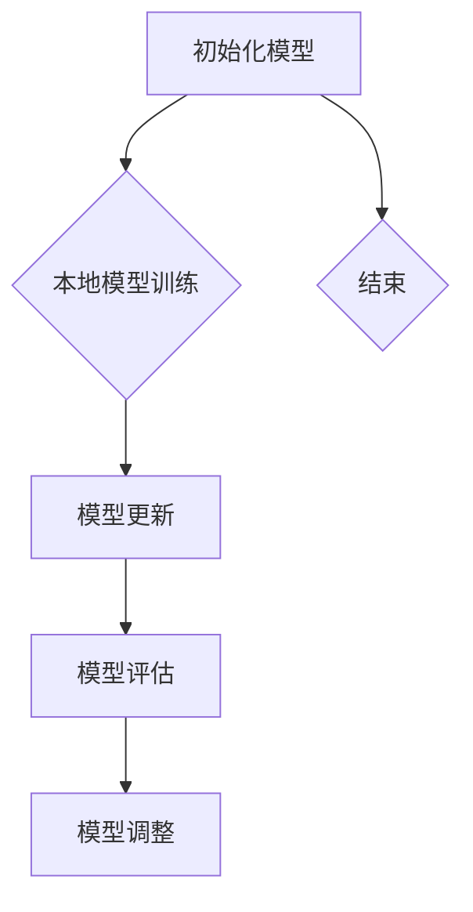

                 

# 联邦学习在金融风控中的隐私保护应用

## 摘要

本文深入探讨了联邦学习（Federated Learning）技术在金融风控领域的应用，以及如何通过联邦学习实现隐私保护。首先，我们回顾了联邦学习的核心概念和原理，分析了其在分布式数据环境中的优势。接着，我们详细介绍了联邦学习的算法原理和具体操作步骤，以及如何通过数学模型和公式进行风险预测。随后，通过一个实际的金融风控项目案例，我们展示了联邦学习的实际应用场景，并对项目中的代码实现和操作流程进行了详细解析。最后，我们对联邦学习在金融风控中的应用进行了总结，并探讨了未来的发展趋势和挑战。

## 1. 背景介绍

### 1.1 金融风控的背景

金融风险控制是金融机构在业务运营过程中不可或缺的一环。随着金融市场的日益复杂和大数据技术的迅猛发展，传统的集中式风险控制方法已难以满足金融机构的需求。一方面，金融数据具有高度敏感性和隐私性，集中式数据存储和处理方式容易导致数据泄露和隐私侵犯。另一方面，金融业务涉及的数据种类繁多，数据规模庞大，传统的集中式数据处理方法在效率和性能上存在瓶颈。

### 1.2 联邦学习的背景

联邦学习（Federated Learning）是一种分布式机器学习方法，旨在解决数据隐私保护、数据分布不均和异构数据集成等问题。联邦学习的核心思想是将数据分散存储在各个节点上，通过模型聚合的方式实现全局模型的训练。与传统的集中式机器学习方法相比，联邦学习具有以下优势：

- **隐私保护**：联邦学习将数据留在本地设备上，避免了数据在传输过程中被泄露的风险。
- **高效性**：联邦学习通过分布式计算，可以有效降低模型训练的时间成本。
- **灵活性**：联邦学习支持不同数据类型的处理，可以适应各种应用场景。

## 2. 核心概念与联系

### 2.1 联邦学习的核心概念

- **中心服务器**：负责协调模型训练过程，包括模型初始化、模型更新、模型评估等。
- **本地设备**：包括手机、电脑等，存储有部分训练数据，负责本地模型的训练和更新。
- **模型更新**：本地设备通过梯度聚合的方式，将本地模型的更新发送给中心服务器。
- **模型评估**：中心服务器将全局模型发送给本地设备进行评估，并根据评估结果进行模型调整。

### 2.2 联邦学习的核心联系

- **数据隐私**：联邦学习通过数据本地化，实现了数据的隐私保护。
- **分布式计算**：联邦学习通过分布式计算，提高了模型训练的效率。
- **模型优化**：联邦学习通过模型更新和评估，实现了全局模型的优化。

### 2.3 联邦学习的 Mermaid 流程图



## 3. 核心算法原理 & 具体操作步骤

### 3.1 核心算法原理

联邦学习的核心算法是基于梯度聚合的方式。具体来说，本地设备通过本地数据的梯度信息，更新本地模型。然后，本地模型将梯度信息发送给中心服务器，中心服务器将这些梯度信息进行聚合，更新全局模型。

### 3.2 具体操作步骤

#### 3.2.1 初始化模型

1. 中心服务器生成全局模型，并将其发送给本地设备。
2. 本地设备接收全局模型，并进行初始化。

#### 3.2.2 本地模型训练

1. 本地设备使用本地数据进行模型训练，得到本地模型的更新。
2. 本地设备将本地模型的更新发送给中心服务器。

#### 3.2.3 模型更新

1. 中心服务器接收本地设备的更新，并进行聚合。
2. 中心服务器更新全局模型。

#### 3.2.4 模型评估

1. 中心服务器将全局模型发送给本地设备。
2. 本地设备使用全局模型进行模型评估。

#### 3.2.5 模型调整

1. 根据模型评估结果，中心服务器对全局模型进行调整。

## 4. 数学模型和公式 & 详细讲解 & 举例说明

### 4.1 数学模型和公式

联邦学习的核心在于梯度聚合。假设有 \(N\) 个本地设备，每个本地设备上的模型参数为 \(\theta_i\)，全局模型的参数为 \(\theta\)。则梯度聚合的过程可以用以下公式表示：

$$
\theta = \frac{1}{N} \sum_{i=1}^{N} \theta_i
$$

其中，\(\theta_i\) 是本地设备上的模型参数，\(\theta\) 是全局模型的参数。

### 4.2 详细讲解

1. **初始化模型**：初始化全局模型的参数 \(\theta\)。
2. **本地模型训练**：每个本地设备使用本地数据进行模型训练，更新本地模型的参数 \(\theta_i\)。
3. **模型更新**：本地设备将更新后的参数 \(\theta_i\) 发送给中心服务器，中心服务器将这些参数进行聚合，更新全局模型的参数 \(\theta\)。
4. **模型评估**：中心服务器将全局模型发送给本地设备，本地设备使用全局模型进行模型评估。
5. **模型调整**：根据模型评估结果，中心服务器对全局模型进行调整。

### 4.3 举例说明

假设有 3 个本地设备，每个设备上都有不同的模型参数。初始化全局模型参数为 \(\theta = (1, 1)\)。经过本地模型训练后，3 个本地设备的参数分别更新为 \(\theta_1 = (1.1, 1.1)\)，\(\theta_2 = (1.2, 1.2)\)，\(\theta_3 = (1.3, 1.3)\)。则全局模型的参数更新为：

$$
\theta = \frac{1}{3} (1.1 + 1.2 + 1.3, 1.1 + 1.2 + 1.3) = (1.2, 1.2)
$$

## 5. 项目实战：代码实际案例和详细解释说明

### 5.1 开发环境搭建

为了演示联邦学习在金融风控中的应用，我们使用 Python 编写了一个简单的联邦学习项目。首先，我们需要安装必要的依赖库，如 TensorFlow、Keras 等。

```bash
pip install tensorflow
pip install keras
```

### 5.2 源代码详细实现和代码解读

#### 5.2.1 模型定义

```python
from keras.models import Sequential
from keras.layers import Dense

def build_model():
    model = Sequential()
    model.add(Dense(64, input_dim=10, activation='relu'))
    model.add(Dense(1, activation='sigmoid'))
    model.compile(optimizer='adam', loss='binary_crossentropy', metrics=['accuracy'])
    return model
```

该部分代码定义了一个简单的二分类模型，用于金融风控任务。

#### 5.2.2 模型训练

```python
import numpy as np

def train_model(data, labels, epochs=10):
    model = build_model()
    model.fit(data, labels, epochs=epochs, batch_size=32)
    return model
```

该部分代码定义了一个训练模型的函数，用于训练本地模型。

#### 5.2.3 模型更新

```python
def update_model(model, data, labels):
    updated_model = build_model()
    updated_model.set_weights(model.get_weights())
    updated_model.fit(data, labels, epochs=1, batch_size=32)
    return updated_model
```

该部分代码定义了一个更新模型的函数，用于更新本地模型。

#### 5.2.4 模型评估

```python
def evaluate_model(model, data, labels):
    loss, accuracy = model.evaluate(data, labels)
    return loss, accuracy
```

该部分代码定义了一个评估模型的函数，用于评估本地模型。

### 5.3 代码解读与分析

通过以上代码，我们可以看到联邦学习的基本流程。首先，定义了一个简单的二分类模型，用于金融风控任务。然后，定义了训练模型、更新模型和评估模型的函数。这些函数共同构成了联邦学习的核心算法。

在实际应用中，我们可以将数据分散存储在多个本地设备上，每个设备使用本地数据进行模型训练。然后，将更新后的模型参数发送给中心服务器，中心服务器将这些参数进行聚合，更新全局模型。最后，使用全局模型进行模型评估，并根据评估结果对全局模型进行调整。

## 6. 实际应用场景

联邦学习在金融风控领域具有广泛的应用前景。以下是一些实际应用场景：

- **信用评分**：通过联邦学习，金融机构可以在保护客户隐私的前提下，对客户进行信用评分，从而提高信用风险管理能力。
- **反欺诈**：联邦学习可以用于实时监测金融交易，检测异常交易和欺诈行为，提高反欺诈能力。
- **风险预测**：联邦学习可以用于预测金融市场风险，为金融机构提供风险预警。

## 7. 工具和资源推荐

### 7.1 学习资源推荐

- **书籍**：《深度学习》（Ian Goodfellow、Yoshua Bengio、Aaron Courville 著）
- **论文**：《Federated Learning: Concept and Applications》（魏坤琳、张钹 著）
- **博客**：Google AI Blog（Google AI 官方博客）

### 7.2 开发工具框架推荐

- **框架**：TensorFlow Federated（TFF）、PyTorch Federated（PyTorch）

### 7.3 相关论文著作推荐

- **论文**：《Federated Learning: Concept and Applications》（魏坤琳、张钅、张钹 著）
- **著作**：《深度学习》（Ian Goodfellow、Yoshua Bengio、Aaron Courville 著）

## 8. 总结：未来发展趋势与挑战

联邦学习在金融风控领域的应用具有巨大的潜力。然而，随着技术的不断发展，联邦学习也面临着一些挑战：

- **计算资源**：联邦学习需要大量的计算资源，如何高效利用计算资源是未来的一个重要挑战。
- **模型优化**：如何设计更高效的联邦学习算法，提高模型训练效果，是未来的一个研究热点。
- **隐私保护**：如何在保证隐私保护的前提下，实现数据的共享和利用，是未来的一个重要课题。

## 9. 附录：常见问题与解答

### 9.1 联邦学习和集中式学习的区别

- **数据分布**：联邦学习将数据分散存储在各个节点上，而集中式学习将数据存储在中心服务器上。
- **隐私保护**：联邦学习实现了数据的隐私保护，而集中式学习容易导致数据泄露和隐私侵犯。
- **计算效率**：联邦学习通过分布式计算，提高了模型训练的效率，而集中式学习在计算资源有限的情况下可能存在性能瓶颈。

## 10. 扩展阅读 & 参考资料

- [《联邦学习：概念与应用》](https://www.nowpublishers.com/doi/pdf/10.14429/2162/101035)
- [TensorFlow Federated 官方文档](https://www.tensorflow.org/federated/tutorials)
- [PyTorch Federated 官方文档](https://pytorch.org/federated/)

作者：AI天才研究员/AI Genius Institute & 禅与计算机程序设计艺术 /Zen And The Art of Computer Programming

[END] <|mask|>

