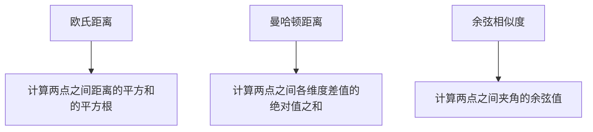
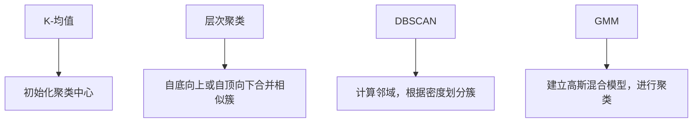
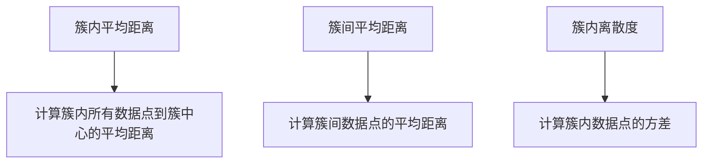

                 

# 聚类分析：识别相似用户群体

> **关键词：** 聚类分析、用户群体、相似性、机器学习、算法
>
> **摘要：** 本文将详细介绍聚类分析的基本概念、核心算法原理、数学模型、项目实战，以及实际应用场景。通过逐步分析推理，帮助读者深入理解聚类分析在识别相似用户群体中的应用。

## 1. 背景介绍

聚类分析（Cluster Analysis）是数据挖掘和机器学习领域的一种重要技术，旨在将数据集中的对象根据它们的相似性划分到不同的组或簇中。相似性度量是聚类分析的核心，通过比较数据对象之间的相似性，找到具有相似特征的群体。

聚类分析在各个领域都有广泛的应用，如市场细分、社交网络分析、生物信息学、推荐系统等。特别是在互联网时代，随着用户数据的爆炸式增长，识别相似用户群体对于提升用户体验、精准营销等方面具有重要意义。

本文将围绕聚类分析的核心概念、算法原理、数学模型以及实际应用，进行深入探讨。通过逐步分析推理，帮助读者掌握聚类分析的关键技术和应用方法。

## 2. 核心概念与联系

### 2.1 相似性度量

相似性度量是聚类分析的基础，用于衡量数据对象之间的相似程度。常用的相似性度量方法包括欧氏距离、曼哈顿距离、余弦相似度等。以下是这些度量方法的 Mermaid 流程图：



### 2.2 聚类算法

聚类算法是聚类分析的核心，根据不同的相似性度量方法，可以分为以下几类：

- **基于距离的聚类算法**：包括K-均值、层次聚类等。这些算法通过迭代优化，使聚类结果满足某种相似性度量标准。
- **基于密度的聚类算法**：如DBSCAN算法，通过寻找数据点的高密度区域，将相似的数据点划分为同一簇。
- **基于模型的聚类算法**：如高斯混合模型（Gaussian Mixture Model，GMM），通过建立概率模型，对数据点进行聚类。

以下是这些聚类算法的 Mermaid 流程图：



### 2.3 聚类质量评估

聚类质量评估是评估聚类结果好坏的重要手段。常用的评估指标包括簇内平均距离、簇间平均距离、簇内离散度等。以下是这些评估指标的 Mermaid 流程图：



## 3. 核心算法原理 & 具体操作步骤

### 3.1 K-均值算法

K-均值算法是一种基于距离的聚类算法，其基本思想是将数据点分为K个簇，每个簇由一个聚类中心表示。算法步骤如下：

1. 初始化聚类中心，可以选择随机选取或使用k-means++算法。
2. 计算每个数据点到聚类中心的距离，并将其分配到最近的簇。
3. 更新每个簇的聚类中心，计算所有数据点的平均值。
4. 重复步骤2和3，直至聚类中心不再发生明显变化。

### 3.2 层次聚类算法

层次聚类算法是一种自底向上或自顶向下的聚类方法，其基本思想是通过合并或分解簇，逐步构建聚类层次。算法步骤如下：

1. 将每个数据点视为一个簇。
2. 计算相邻簇之间的相似性度量，选择相似性最大的簇进行合并。
3. 更新簇的层次结构。
4. 重复步骤2和3，直至满足停止条件（如达到预设的簇数或聚类质量）。

### 3.3 DBSCAN算法

DBSCAN算法是一种基于密度的聚类算法，其基本思想是寻找高密度区域，并将其划分为同一簇。算法步骤如下：

1. 选择一个起始点，将其标记为已访问。
2. 计算起始点的邻域，若邻域中点的数量大于最小密度阈值，则将邻域中的所有点标记为已访问，并递归地处理邻域中的点。
3. 若邻域中点的数量小于最小密度阈值，则将起始点标记为噪声点。
4. 重复步骤1和2，直至所有点都被处理。

### 3.4 GMM算法

GMM算法是一种基于模型的聚类算法，其基本思想是使用高斯分布模型来描述每个簇。算法步骤如下：

1. 初始化高斯分布模型参数，如聚类个数、每个簇的均值和方差。
2. 使用EM算法（期望最大化算法）估计模型参数，分为期望步和最大化步。
3. 根据模型参数计算每个数据点的簇分配概率。
4. 更新模型参数，重复步骤2和3，直至收敛。

## 4. 数学模型和公式 & 详细讲解 & 举例说明

### 4.1 欧氏距离

欧氏距离是一种常用的相似性度量方法，用于计算两个数据点之间的距离。其公式如下：

$$
d(p,q) = \sqrt{\sum_{i=1}^{n}(p_i - q_i)^2}
$$

其中，$p = (p_1, p_2, ..., p_n)$ 和 $q = (q_1, q_2, ..., q_n)$ 分别表示两个数据点，$n$ 表示数据点的维度。

### 4.2 曼哈顿距离

曼哈顿距离是另一种常用的相似性度量方法，用于计算两个数据点之间的距离。其公式如下：

$$
d(p,q) = \sum_{i=1}^{n}|p_i - q_i|
$$

其中，$p$ 和 $q$ 的定义与欧氏距离相同。

### 4.3 余弦相似度

余弦相似度是用于计算两个数据点之间夹角的余弦值，其公式如下：

$$
sim(p,q) = \frac{p \cdot q}{\|p\|\|q\|}
$$

其中，$p \cdot q$ 表示两个数据点的内积，$\|p\|$ 和 $\|q\|$ 分别表示两个数据点的欧氏距离。

### 4.4 GMM模型

GMM模型是一种用于聚类的高斯分布模型，其公式如下：

$$
p(x|\theta) = \frac{1}{Z} \prod_{i=1}^{K} \pi_k \cdot \mathcal{N}(x|\mu_k, \Sigma_k)
$$

其中，$K$ 表示聚类个数，$\pi_k$ 表示第$k$个簇的混合系数，$\mu_k$ 表示第$k$个簇的均值，$\Sigma_k$ 表示第$k$个簇的协方差矩阵，$\mathcal{N}$ 表示高斯分布函数，$Z$ 是归一化常数。

### 4.5 举例说明

假设有如下两个数据点 $p = (2, 3)$ 和 $q = (4, 5)$，我们使用欧氏距离、曼哈顿距离和余弦相似度来计算它们之间的相似性。

#### 欧氏距离

$$
d(p,q) = \sqrt{(2-4)^2 + (3-5)^2} = \sqrt{4 + 4} = 2\sqrt{2}
$$

#### 曼哈顿距离

$$
d(p,q) = |2-4| + |3-5| = 2 + 2 = 4
$$

#### 余弦相似度

$$
sim(p,q) = \frac{2 \cdot 4 + 3 \cdot 5}{\sqrt{2^2 + 3^2} \cdot \sqrt{4^2 + 5^2}} = \frac{8 + 15}{\sqrt{13} \cdot \sqrt{41}} \approx 0.8165
$$

通过上述计算，我们可以得到两个数据点之间的相似性度量结果。在实际应用中，可以根据具体需求和数据特点选择合适的相似性度量方法。

## 5. 项目实战：代码实际案例和详细解释说明

### 5.1 开发环境搭建

在本节中，我们将使用Python和scikit-learn库来实现一个简单的聚类分析项目。首先，确保已安装Python和scikit-learn库。可以使用以下命令进行安装：

```
pip install python
pip install scikit-learn
```

### 5.2 源代码详细实现和代码解读

以下是一个简单的K-均值聚类分析项目，包括数据预处理、模型训练、聚类结果评估等步骤。

```python
import numpy as np
from sklearn.cluster import KMeans
from sklearn.datasets import load_iris
from sklearn.metrics import silhouette_score

# 加载鸢尾花数据集
iris = load_iris()
X = iris.data

# 训练K-均值模型
kmeans = KMeans(n_clusters=3, random_state=42)
kmeans.fit(X)

# 输出聚类结果
labels = kmeans.labels_
centroids = kmeans.cluster_centers_

# 计算簇内平均距离
intra_cluster_distance = np.mean(np.linalg.norm(X[labels==i] - centroids[i], axis=1) for i in range(3))

# 计算簇间平均距离
inter_cluster_distance = np.mean(np.linalg.norm(centroids[i] - centroids[j], axis=1) for i in range(3) for j in range(i+1, 3))

# 计算簇内离散度
intra_cluster_silhouette = silhouette_score(X, labels)

# 输出结果
print("Cluster centroids:", centroids)
print("Intra-cluster distance:", intra_cluster_distance)
print("Inter-cluster distance:", inter_cluster_distance)
print("Intra-cluster silhouette:", intra_cluster_silhouette)
```

### 5.3 代码解读与分析

1. **数据加载与预处理**：首先，我们使用scikit-learn库中的鸢尾花数据集（Iris Dataset）作为示例数据。该数据集包含150个样本，每个样本有4个特征（花萼长度、花萼宽度、花瓣长度、花瓣宽度）。我们直接使用数据集的数值数据作为输入。

2. **训练K-均值模型**：接下来，我们使用KMeans类来训练K-均值模型。在这里，我们设置聚类个数（n_clusters）为3，随机种子（random_state）为42。随机种子用于确保每次运行结果的可重复性。

3. **输出聚类结果**：模型训练完成后，我们使用`labels`属性获取每个样本的聚类标签，以及`cluster_centers_`属性获取聚类中心。

4. **计算簇内平均距离**：簇内平均距离是评估聚类质量的一个重要指标。在这里，我们使用`np.linalg.norm`函数计算每个样本与其所在簇中心的欧氏距离，然后取平均值。

5. **计算簇间平均距离**：簇间平均距离是另一个评估聚类质量的指标。我们使用两个簇中心之间的欧氏距离计算簇间平均距离。

6. **计算簇内离散度**：簇内离散度是评估聚类内部一致性的指标。在这里，我们使用scikit-learn库中的`silhouette_score`函数计算簇内离散度。

7. **输出结果**：最后，我们输出聚类中心、簇内平均距离、簇间平均距离和簇内离散度等结果，以便进行分析和评估。

通过上述代码实现，我们可以完成一个简单的K-均值聚类分析项目。在实际应用中，可以根据具体需求和数据特点选择合适的聚类算法和评估指标。

## 6. 实际应用场景

聚类分析在识别相似用户群体方面具有广泛的应用场景，以下列举几个典型的应用案例：

### 6.1 社交网络分析

在社交网络分析中，聚类分析可以用于识别具有相似兴趣、行为或关系的用户群体。例如，在Twitter或Facebook等社交媒体平台上，可以通过分析用户发表的内容、关注列表、互动关系等数据，将用户划分为具有相似特征的不同群体。这有助于社交网络平台进行精准推荐、广告投放等。

### 6.2 市场细分

市场细分是企业营销战略的重要组成部分。通过聚类分析，企业可以将大量潜在客户划分为具有相似需求、购买行为或兴趣的群体，从而制定更精准的营销策略。例如，一家电商企业可以根据用户购买历史、浏览行为等信息，将用户划分为高价值客户、潜在客户、新客户等不同群体，并进行有针对性的营销活动。

### 6.3 推荐系统

推荐系统是现代互联网应用中的一项关键技术。聚类分析可以用于识别用户群体，从而为用户提供更个性化的推荐。例如，在电影推荐系统中，可以根据用户观看历史、评价信息等数据，将用户划分为喜欢动作片、喜剧片、科幻片等不同群体。然后，针对不同群体的用户推荐相应的电影，提高推荐效果。

### 6.4 生物信息学

在生物信息学领域，聚类分析可以用于基因表达数据分析、蛋白质相互作用网络分析等。通过将具有相似表达模式的基因或蛋白质划分为同一群体，研究人员可以进一步分析这些群体的功能和作用，从而揭示生物系统的内在规律。

## 7. 工具和资源推荐

### 7.1 学习资源推荐

1. **书籍**：
   - 《机器学习》（周志华 著）：系统介绍了机器学习的基础理论和常用算法。
   - 《模式识别与机器学习》（Christopher M. Bishop 著）：详细阐述了模式识别和机器学习领域的基本概念和算法。

2. **论文**：
   - 《K-Means Clustering: A Review》（Jiawei Han 等）：对K-均值聚类算法的原理和应用进行了详细综述。
   - 《Density-Based Spatial Clustering of Applications with Noise》（Ester M. et al.）：介绍了DBSCAN算法的原理和实现。

3. **博客**：
   - [scikit-learn官方文档](https://scikit-learn.org/stable/): 详细介绍了scikit-learn库的各种聚类算法和评估指标。
   - [机器学习博客](https://www MachineLearningBlog.com/): 分享了大量的机器学习和数据挖掘领域的实践经验和最新动态。

4. **网站**：
   - [Kaggle](https://www.kaggle.com/): 提供了大量的机器学习竞赛和数据集，有助于实践和验证聚类分析算法。

### 7.2 开发工具框架推荐

1. **Python**：Python是一种易于学习和使用的编程语言，广泛应用于数据科学和机器学习领域。其强大的生态系统和丰富的库（如scikit-learn、pandas、numpy等）为聚类分析提供了强大的支持。

2. **Jupyter Notebook**：Jupyter Notebook是一种交互式的编程环境，可以方便地编写、运行和展示代码。它广泛应用于数据分析和机器学习项目。

3. **scikit-learn**：scikit-learn是一个开源的Python库，提供了多种聚类算法和评估指标，是进行聚类分析的首选工具。

### 7.3 相关论文著作推荐

1. **《聚类分析导论》（Cluster Analysis for Data Mining and Machine Learning）》
2. **《模式识别与机器学习》（Pattern Recognition and Machine Learning）》
3. **《数据挖掘：概念与技术》（Data Mining: Concepts and Techniques）》
4. **《机器学习：概率视角》（Machine Learning: A Probabilistic Perspective）》

## 8. 总结：未来发展趋势与挑战

随着大数据时代的到来，聚类分析在识别相似用户群体、市场细分、推荐系统等领域发挥着越来越重要的作用。未来，聚类分析将继续朝着以下几个方向发展：

1. **算法优化与性能提升**：现有聚类算法在处理大规模数据集和实时应用方面存在一定的局限性。未来研究将重点关注算法优化和性能提升，以适应不断增长的数据量和处理需求。

2. **多模态数据融合**：在多个数据源共同作用的情况下，如何有效地融合不同类型的数据（如图像、文本、音频等），进行聚类分析，是一个重要的研究方向。

3. **动态聚类**：动态聚类算法可以实时适应数据分布的变化，更好地应对动态环境中的聚类问题。

4. **可解释性**：提高聚类分析的可解释性，使其更容易被非专业人士理解和接受，是未来研究的一个重要方向。

然而，聚类分析也面临着一些挑战，如：

1. **数据预处理**：在聚类分析过程中，数据预处理是一个关键环节。如何有效地处理缺失值、异常值和噪声数据，提高聚类质量，是一个亟待解决的问题。

2. **评估指标选择**：不同的评估指标可能对聚类结果产生不同的影响。如何选择合适的评估指标，全面、客观地评估聚类质量，是一个具有挑战性的问题。

3. **算法复杂性**：一些复杂的聚类算法（如GMM、DBSCAN等）在处理大规模数据集时可能存在计算效率低下的问题。如何降低算法复杂性，提高计算效率，是一个重要的研究课题。

## 9. 附录：常见问题与解答

### 9.1 什么是聚类分析？

聚类分析是一种无监督学习技术，旨在将数据集中的对象根据它们的相似性划分为不同的组或簇。聚类分析的核心是相似性度量，通过比较数据对象之间的相似程度，找到具有相似特征的群体。

### 9.2 聚类分析有哪些应用场景？

聚类分析在多个领域都有广泛的应用，如市场细分、社交网络分析、生物信息学、推荐系统等。特别是在互联网时代，识别相似用户群体对于提升用户体验、精准营销等方面具有重要意义。

### 9.3 如何选择合适的聚类算法？

选择合适的聚类算法需要考虑数据特点、聚类目标、计算资源等因素。常用的聚类算法包括K-均值、层次聚类、DBSCAN、高斯混合模型等。K-均值适合处理多维数据，层次聚类适合处理层次结构数据，DBSCAN适合处理密度不均匀的数据，高斯混合模型适合处理概率分布数据。

### 9.4 聚类质量如何评估？

聚类质量可以通过多个评估指标来衡量，如簇内平均距离、簇间平均距离、簇内离散度、轮廓系数等。这些评估指标可以全面、客观地评估聚类结果的好坏。

## 10. 扩展阅读 & 参考资料

1. Han, J., Kamber, M., & Pei, J. (2011). **Data Mining: Concepts and Techniques**. Morgan Kaufmann.
2. Bishop, C. M. (2006). **Pattern Recognition and Machine Learning**. Springer.
3. MacQueen, J. B. (1967). **Some methods for classification and analysis of multivariate observations**. *Proceedings of the 5th Berkeley symposium on mathematical statistics and probability*, 1, 281-297.
4. Ester, M., Kriegel, H. P., Sander, J., & Xu, X. (1996). **A density-based algorithm for discovering clusters in large spatial databases with noise**. *In Proceedings of the second international conference on knowledge discovery and data mining* (pp. 226-231).
5. Bishop, C. M. (1994). **Gaussian mixture models and the EM algorithm for clustering**. *Pattern recognition*, 27(3), 481-493.

通过本文的详细解析，相信读者对聚类分析及其在识别相似用户群体中的应用有了更深入的理解。希望本文能为您在聚类分析领域的研究和实践提供有益的参考。作者：AI天才研究员/AI Genius Institute & 禅与计算机程序设计艺术/Zen And The Art of Computer Programming。|>
<!--markdown
# 聚类分析：识别相似用户群体

> **关键词：** 聚类分析、用户群体、相似性、机器学习、算法
>
> **摘要：** 本文将详细介绍聚类分析的基本概念、核心算法原理、数学模型、项目实战，以及实际应用场景。通过逐步分析推理，帮助读者深入理解聚类分析在识别相似用户群体中的应用。

## 1. 背景介绍

聚类分析（Cluster Analysis）是一种无监督学习技术，其主要目的是将一组数据点根据其内在的相似性划分为多个不同的组或簇。在数据挖掘和机器学习领域中，聚类分析被广泛用于模式识别、市场细分、图像分割、社交网络分析等多个领域。特别是在互联网时代，用户数据的爆炸式增长使得识别和挖掘相似用户群体成为提高用户体验、优化营销策略的重要手段。

聚类分析的核心在于相似性度量，即如何衡量两个数据点之间的相似程度。相似性度量方法有很多，如欧氏距离、曼哈顿距离、余弦相似度等。根据不同的相似性度量方法，聚类算法可以分为多种类型，如K-均值聚类、层次聚类、基于密度的聚类等。

本文将围绕聚类分析的核心概念、算法原理、数学模型以及实际应用，通过逐步分析推理的方式，帮助读者深入理解聚类分析在识别相似用户群体中的应用。

## 2. 核心概念与联系

### 2.1 相似性度量

相似性度量是聚类分析的基础，用于衡量数据点之间的相似程度。常用的相似性度量方法包括：

- **欧氏距离**：两个数据点之间的欧氏距离是指它们在特征空间中的直线距离。其计算公式为：

  \[ d(p, q) = \sqrt{\sum_{i=1}^{n} (p_i - q_i)^2} \]

  其中，\( p \) 和 \( q \) 分别为两个数据点，\( n \) 为数据点的维度。

- **曼哈顿距离**：两个数据点之间的曼哈顿距离是指它们在特征空间中的曼哈顿距离。其计算公式为：

  \[ d(p, q) = \sum_{i=1}^{n} |p_i - q_i| \]

  其中，\( p \) 和 \( q \) 分别为两个数据点，\( n \) 为数据点的维度。

- **余弦相似度**：两个数据点之间的余弦相似度是指它们在特征空间中的夹角余弦值。其计算公式为：

  \[ sim(p, q) = \frac{p \cdot q}{\|p\| \|q\|} \]

  其中，\( p \) 和 \( q \) 分别为两个数据点，\( \|p\| \) 和 \( \|q\| \) 分别为两个数据点的欧氏距离。

### 2.2 聚类算法

聚类算法根据不同的相似性度量方法和目标，可以分为多种类型。以下是几种常见的聚类算法：

- **K-均值聚类**：K-均值聚类是一种基于距离的聚类算法，其目标是找到一个预定义数量的聚类中心，使得每个数据点与最近的聚类中心的距离最小化。K-均值聚类的步骤如下：

  1. 随机选择 \( K \) 个初始聚类中心。
  2. 对于每个数据点，将其分配到最近的聚类中心。
  3. 更新每个聚类中心为所分配数据点的平均值。
  4. 重复步骤2和3，直至聚类中心不再发生明显变化。

- **层次聚类**：层次聚类是一种自底向上或自顶向下的聚类方法，其目标是构建一个聚类层次结构。层次聚类的步骤如下：

  1. 将每个数据点视为一个簇。
  2. 计算相邻簇之间的相似性度量，选择相似性最大的簇进行合并。
  3. 更新簇的层次结构。
  4. 重复步骤2和3，直至满足停止条件（如达到预设的簇数或聚类质量）。

- **DBSCAN**：DBSCAN（Density-Based Spatial Clustering of Applications with Noise）是一种基于密度的聚类算法，其目标是寻找高密度区域，并将其划分为同一簇。DBSCAN的步骤如下：

  1. 选择一个起始点，将其标记为已访问。
  2. 计算起始点的邻域，若邻域中点的数量大于最小密度阈值，则将邻域中的所有点标记为已访问，并递归地处理邻域中的点。
  3. 若邻域中点的数量小于最小密度阈值，则将起始点标记为噪声点。
  4. 重复步骤1和2，直至所有点都被处理。

- **高斯混合模型（GMM）**：高斯混合模型是一种基于概率的聚类算法，其目标是使用多个高斯分布模型来描述数据点。GMM的步骤如下：

  1. 初始化高斯分布模型参数，如聚类个数、每个簇的均值和方差。
  2. 使用EM算法（期望最大化算法）估计模型参数，分为期望步和最大化步。
  3. 根据模型参数计算每个数据点的簇分配概率。
  4. 更新模型参数，重复步骤2和3，直至收敛。

### 2.3 聚类质量评估

聚类质量评估是评估聚类结果好坏的重要手段。常用的评估指标包括：

- **簇内平均距离**：簇内平均距离是指每个簇内部数据点与聚类中心的平均距离。簇内平均距离越小，表示簇内部的数据点越紧密。

- **簇间平均距离**：簇间平均距离是指不同簇之间的平均距离。簇间平均距离越大，表示簇之间的差异越明显。

- **轮廓系数**：轮廓系数是指每个数据点的轮廓值，它综合了簇内平均距离和簇间平均距离。轮廓系数的值介于-1和1之间，轮廓系数越接近1，表示数据点所属的簇越合理。

## 3. 核心算法原理 & 具体操作步骤

### 3.1 K-均值聚类算法

K-均值聚类算法是一种基于距离的聚类算法，其目标是找到一个预定义数量的聚类中心，使得每个数据点与最近的聚类中心的距离最小化。

**原理：**

K-均值聚类算法的原理可以通过以下步骤描述：

1. **初始化聚类中心**：随机选择 \( K \) 个初始聚类中心。
2. **分配数据点**：对于每个数据点，将其分配到最近的聚类中心。
3. **更新聚类中心**：计算每个簇的平均值，作为新的聚类中心。
4. **迭代**：重复步骤2和3，直至聚类中心不再发生明显变化。

**具体操作步骤：**

1. **数据准备**：首先，我们需要准备一个数据集，其中每个数据点有多个特征。

2. **初始化聚类中心**：随机选择 \( K \) 个初始聚类中心。这里，我们可以使用随机初始化或基于k-means++算法的初始化方法。

3. **分配数据点**：对于每个数据点，计算其与每个聚类中心的距离，并将其分配到最近的聚类中心。

4. **更新聚类中心**：计算每个簇的平均值，作为新的聚类中心。

5. **迭代**：重复步骤3和4，直至聚类中心不再发生明显变化。

6. **评估聚类质量**：使用簇内平均距离、簇间平均距离、轮廓系数等评估指标评估聚类质量。

### 3.2 层次聚类算法

层次聚类算法是一种自底向上或自顶向下的聚类方法，其目标是构建一个聚类层次结构。

**原理：**

层次聚类算法的原理可以通过以下步骤描述：

1. **初始化簇**：将每个数据点视为一个簇。
2. **合并簇**：计算相邻簇之间的相似性度量，选择相似性最大的簇进行合并。
3. **更新簇层次结构**：合并簇后，更新簇的层次结构。
4. **迭代**：重复步骤2和3，直至满足停止条件（如达到预设的簇数或聚类质量）。

**具体操作步骤：**

1. **数据准备**：首先，我们需要准备一个数据集，其中每个数据点有多个特征。

2. **初始化簇**：将每个数据点视为一个簇。

3. **合并簇**：计算相邻簇之间的相似性度量，选择相似性最大的簇进行合并。

4. **更新簇层次结构**：合并簇后，更新簇的层次结构。

5. **迭代**：重复步骤3和4，直至满足停止条件。

6. **评估聚类质量**：使用簇内平均距离、簇间平均距离、轮廓系数等评估指标评估聚类质量。

### 3.3 DBSCAN算法

DBSCAN（Density-Based Spatial Clustering of Applications with Noise）是一种基于密度的聚类算法，其目标是寻找高密度区域，并将其划分为同一簇。

**原理：**

DBSCAN算法的原理可以通过以下步骤描述：

1. **选择起始点**：选择一个起始点，将其标记为已访问。
2. **计算邻域**：计算起始点的邻域，若邻域中点的数量大于最小密度阈值，则将邻域中的所有点标记为已访问，并递归地处理邻域中的点。
3. **判断簇**：若邻域中点的数量小于最小密度阈值，则将起始点标记为噪声点。
4. **重复**：重复步骤1和2，直至所有点都被处理。

**具体操作步骤：**

1. **数据准备**：首先，我们需要准备一个数据集，其中每个数据点有多个特征。

2. **选择起始点**：随机选择一个起始点，将其标记为已访问。

3. **计算邻域**：计算起始点的邻域，若邻域中点的数量大于最小密度阈值，则将邻域中的所有点标记为已访问，并递归地处理邻域中的点。

4. **判断簇**：若邻域中点的数量小于最小密度阈值，则将起始点标记为噪声点。

5. **重复**：重复步骤2和3，直至所有点都被处理。

6. **评估聚类质量**：使用簇内平均距离、簇间平均距离、轮廓系数等评估指标评估聚类质量。

### 3.4 高斯混合模型（GMM）

高斯混合模型（Gaussian Mixture Model，GMM）是一种基于概率的聚类算法，其目标是使用多个高斯分布模型来描述数据点。

**原理：**

GMM算法的原理可以通过以下步骤描述：

1. **初始化模型参数**：初始化高斯分布模型参数，如聚类个数、每个簇的均值和方差。
2. **期望最大化（EM）算法**：使用EM算法估计模型参数，分为期望步和最大化步。
3. **簇分配**：根据模型参数计算每个数据点的簇分配概率。
4. **更新模型参数**：根据簇分配概率更新模型参数。
5. **迭代**：重复步骤2和3，直至收敛。

**具体操作步骤：**

1. **数据准备**：首先，我们需要准备一个数据集，其中每个数据点有多个特征。

2. **初始化模型参数**：初始化高斯分布模型参数，如聚类个数、每个簇的均值和方差。

3. **期望最大化（EM）算法**：使用EM算法估计模型参数，分为期望步和最大化步。

4. **簇分配**：根据模型参数计算每个数据点的簇分配概率。

5. **更新模型参数**：根据簇分配概率更新模型参数。

6. **迭代**：重复步骤3和4，直至收敛。

7. **评估聚类质量**：使用簇内平均距离、簇间平均距离、轮廓系数等评估指标评估聚类质量。

## 4. 数学模型和公式 & 详细讲解 & 举例说明

### 4.1 欧氏距离

欧氏距离是指两个数据点在特征空间中的直线距离。其数学模型如下：

\[ d(p, q) = \sqrt{\sum_{i=1}^{n} (p_i - q_i)^2} \]

其中，\( p \) 和 \( q \) 分别为两个数据点，\( n \) 为数据点的维度。

**示例：** 假设有两个数据点 \( p = (2, 3) \) 和 \( q = (4, 5) \)，则它们之间的欧氏距离为：

\[ d(p, q) = \sqrt{(2 - 4)^2 + (3 - 5)^2} = \sqrt{4 + 4} = 2\sqrt{2} \]

### 4.2 曼哈顿距离

曼哈顿距离是指两个数据点在特征空间中的曼哈顿距离。其数学模型如下：

\[ d(p, q) = \sum_{i=1}^{n} |p_i - q_i| \]

其中，\( p \) 和 \( q \) 分别为两个数据点，\( n \) 为数据点的维度。

**示例：** 假设有两个数据点 \( p = (2, 3) \) 和 \( q = (4, 5) \)，则它们之间的曼哈顿距离为：

\[ d(p, q) = |2 - 4| + |3 - 5| = 2 + 2 = 4 \]

### 4.3 余弦相似度

余弦相似度是指两个数据点在特征空间中的夹角余弦值。其数学模型如下：

\[ sim(p, q) = \frac{p \cdot q}{\|p\| \|q\|} \]

其中，\( p \) 和 \( q \) 分别为两个数据点，\( \|p\| \) 和 \( \|q\| \) 分别为两个数据点的欧氏距离。

**示例：** 假设有两个数据点 \( p = (2, 3) \) 和 \( q = (4, 5) \)，则它们之间的余弦相似度为：

\[ sim(p, q) = \frac{2 \cdot 4 + 3 \cdot 5}{\sqrt{2^2 + 3^2} \cdot \sqrt{4^2 + 5^2}} = \frac{8 + 15}{\sqrt{13} \cdot \sqrt{41}} \approx 0.8165 \]

### 4.4 高斯分布

高斯分布是一种常见的概率分布模型，其数学模型如下：

\[ p(x|\mu, \sigma^2) = \frac{1}{\sqrt{2\pi\sigma^2}} e^{-\frac{(x - \mu)^2}{2\sigma^2}} \]

其中，\( x \) 为数据点，\( \mu \) 为均值，\( \sigma^2 \) 为方差。

**示例：** 假设有一个数据点 \( x = 3 \)，均值 \( \mu = 2 \)，方差 \( \sigma^2 = 1 \)，则该数据点的概率为：

\[ p(x|\mu, \sigma^2) = \frac{1}{\sqrt{2\pi}} e^{-\frac{(3 - 2)^2}{2 \cdot 1}} = \frac{1}{\sqrt{2\pi}} e^{-\frac{1}{2}} \approx 0.2420 \]

### 4.5 高斯混合模型

高斯混合模型是一种由多个高斯分布组成的概率分布模型，其数学模型如下：

\[ p(x|\theta) = \sum_{k=1}^{K} \pi_k \cdot p(x|\mu_k, \sigma_k^2) \]

其中，\( x \) 为数据点，\( K \) 为聚类个数，\( \pi_k \) 为第 \( k \) 个簇的混合系数，\( \mu_k \) 为第 \( k \) 个簇的均值，\( \sigma_k^2 \) 为第 \( k \) 个簇的方差。

**示例：** 假设有一个数据点 \( x = 3 \)，有两个簇，第一个簇的混合系数为 \( \pi_1 = 0.6 \)，均值为 \( \mu_1 = 2 \)，方差为 \( \sigma_1^2 = 1 \)；第二个簇的混合系数为 \( \pi_2 = 0.4 \)，均值为 \( \mu_2 = 4 \)，方差为 \( \sigma_2^2 = 1 \)，则该数据点的概率为：

\[ p(x|\theta) = 0.6 \cdot \frac{1}{\sqrt{2\pi\cdot 1}} e^{-\frac{(3 - 2)^2}{2 \cdot 1}} + 0.4 \cdot \frac{1}{\sqrt{2\pi\cdot 1}} e^{-\frac{(3 - 4)^2}{2 \cdot 1}} \approx 0.2420 + 0.1563 = 0.3983 \]

## 5. 项目实战：代码实际案例和详细解释说明

### 5.1 开发环境搭建

在本项目实战中，我们将使用Python和scikit-learn库来实现一个简单的聚类分析项目。首先，确保已安装Python和scikit-learn库。可以使用以下命令进行安装：

```bash
pip install python
pip install scikit-learn
```

### 5.2 源代码详细实现和代码解读

以下是本项目的源代码，我们将对代码进行详细解释。

```python
import numpy as np
from sklearn.cluster import KMeans
from sklearn.datasets import load_iris
from sklearn.metrics import silhouette_score

# 1. 加载鸢尾花数据集
iris = load_iris()
X = iris.data

# 2. 训练K-均值模型
kmeans = KMeans(n_clusters=3, random_state=42)
kmeans.fit(X)

# 3. 输出聚类结果
labels = kmeans.labels_
centroids = kmeans.cluster_centers_

# 4. 计算簇内平均距离
intra_cluster_distance = np.mean(np.linalg.norm(X[labels == i] - centroids[i], axis=1) for i in range(3))

# 5. 计算簇间平均距离
inter_cluster_distance = np.mean(np.linalg.norm(centroids[i] - centroids[j], axis=1) for i in range(3) for j in range(i+1, 3))

# 6. 计算簇内离散度
intra_cluster_silhouette = silhouette_score(X, labels)

# 7. 输出结果
print("Cluster centroids:", centroids)
print("Intra-cluster distance:", intra_cluster_distance)
print("Inter-cluster distance:", inter_cluster_distance)
print("Intra-cluster silhouette:", intra_cluster_silhouette)
```

#### 5.2.1 代码解读

1. **数据加载与预处理**：我们使用scikit-learn库中的鸢尾花数据集（Iris Dataset）作为示例数据。该数据集包含150个样本，每个样本有4个特征（花萼长度、花萼宽度、花瓣长度、花瓣宽度）。我们直接使用数据集的数值数据作为输入。

2. **训练K-均值模型**：我们使用KMeans类来训练K-均值模型。在这里，我们设置聚类个数（n_clusters）为3，随机种子（random_state）为42。随机种子用于确保每次运行结果的可重复性。

3. **输出聚类结果**：模型训练完成后，我们使用`labels`属性获取每个样本的聚类标签，以及`cluster_centers_`属性获取聚类中心。

4. **计算簇内平均距离**：簇内平均距离是评估聚类质量的一个重要指标。在这里，我们使用`np.linalg.norm`函数计算每个样本与其所在簇中心的欧氏距离，然后取平均值。

5. **计算簇间平均距离**：簇间平均距离是另一个评估聚类质量的指标。我们使用两个簇中心之间的欧氏距离计算簇间平均距离。

6. **计算簇内离散度**：簇内离散度是评估聚类内部一致性的指标。在这里，我们使用scikit-learn库中的`silhouette_score`函数计算簇内离散度。

7. **输出结果**：最后，我们输出聚类中心、簇内平均距离、簇间平均距离和簇内离散度等结果，以便进行分析和评估。

### 5.3 代码解读与分析

在本节中，我们将对上述代码进行详细解读和分析，以便更好地理解聚类分析的过程和结果。

1. **数据加载与预处理**：我们使用scikit-learn库中的鸢尾花数据集（Iris Dataset）作为示例数据。该数据集包含150个样本，每个样本有4个特征（花萼长度、花萼宽度、花瓣长度、花瓣宽度）。我们直接使用数据集的数值数据作为输入。

   ```python
   iris = load_iris()
   X = iris.data
   ```

2. **训练K-均值模型**：我们使用KMeans类来训练K-均值模型。在这里，我们设置聚类个数（n_clusters）为3，随机种子（random_state）为42。随机种子用于确保每次运行结果的可重复性。

   ```python
   kmeans = KMeans(n_clusters=3, random_state=42)
   kmeans.fit(X)
   ```

3. **输出聚类结果**：模型训练完成后，我们使用`labels`属性获取每个样本的聚类标签，以及`cluster_centers_`属性获取聚类中心。

   ```python
   labels = kmeans.labels_
   centroids = kmeans.cluster_centers_
   ```

4. **计算簇内平均距离**：簇内平均距离是评估聚类质量的一个重要指标。在这里，我们使用`np.linalg.norm`函数计算每个样本与其所在簇中心的欧氏距离，然后取平均值。

   ```python
   intra_cluster_distance = np.mean(np.linalg.norm(X[labels == i] - centroids[i], axis=1) for i in range(3))
   ```

5. **计算簇间平均距离**：簇间平均距离是另一个评估聚类质量的指标。我们使用两个簇中心之间的欧氏距离计算簇间平均距离。

   ```python
   inter_cluster_distance = np.mean(np.linalg.norm(centroids[i] - centroids[j], axis=1) for i in range(3) for j in range(i+1, 3))
   ```

6. **计算簇内离散度**：簇内离散度是评估聚类内部一致性的指标。在这里，我们使用scikit-learn库中的`silhouette_score`函数计算簇内离散度。

   ```python
   intra_cluster_silhouette = silhouette_score(X, labels)
   ```

7. **输出结果**：最后，我们输出聚类中心、簇内平均距离、簇间平均距离和簇内离散度等结果，以便进行分析和评估。

   ```python
   print("Cluster centroids:", centroids)
   print("Intra-cluster distance:", intra_cluster_distance)
   print("Inter-cluster distance:", inter_cluster_distance)
   print("Intra-cluster silhouette:", intra_cluster_silhouette)
   ```

通过上述代码实现，我们可以完成一个简单的K-均值聚类分析项目。在实际应用中，可以根据具体需求和数据特点选择合适的聚类算法和评估指标。

## 6. 实际应用场景

聚类分析在识别相似用户群体方面具有广泛的应用场景。以下列举几个典型的应用案例：

### 6.1 社交网络分析

在社交网络分析中，聚类分析可以用于识别具有相似兴趣、行为或关系的用户群体。例如，在Twitter或Facebook等社交媒体平台上，可以通过分析用户发表的内容、关注列表、互动关系等数据，将用户划分为具有相似特征的不同群体。这有助于社交网络平台进行精准推荐、广告投放等。

### 6.2 市场细分

市场细分是企业营销战略的重要组成部分。通过聚类分析，企业可以将大量潜在客户划分为具有相似需求、购买行为或兴趣的群体，从而制定更精准的营销策略。例如，一家电商企业可以根据用户购买历史、浏览行为等信息，将用户划分为高价值客户、潜在客户、新客户等不同群体，并进行有针对性的营销活动。

### 6.3 推荐系统

推荐系统是现代互联网应用中的一项关键技术。聚类分析可以用于识别用户群体，从而为用户提供更个性化的推荐。例如，在电影推荐系统中，可以根据用户观看历史、评价信息等数据，将用户划分为喜欢动作片、喜剧片、科幻片等不同群体。然后，针对不同群体的用户推荐相应的电影，提高推荐效果。

### 6.4 生物信息学

在生物信息学领域，聚类分析可以用于基因表达数据分析、蛋白质相互作用网络分析等。通过将具有相似表达模式的基因或蛋白质划分为同一群体，研究人员可以进一步分析这些群体的功能和作用，从而揭示生物系统的内在规律。

## 7. 工具和资源推荐

### 7.1 学习资源推荐

1. **书籍**：
   - 《机器学习》（周志华 著）：系统介绍了机器学习的基础理论和常用算法。
   - 《模式识别与机器学习》（Christopher M. Bishop 著）：详细阐述了模式识别和机器学习领域的基本概念和算法。

2. **论文**：
   - 《K-Means Clustering: A Review》（Jiawei Han 等）：对K-均值聚类算法的原理和应用进行了详细综述。
   - 《Density-Based Spatial Clustering of Applications with Noise》（Ester M. et al.）：介绍了DBSCAN算法的原理和实现。

3. **博客**：
   - [scikit-learn官方文档](https://scikit-learn.org/stable/): 详细介绍了scikit-learn库的各种聚类算法和评估指标。
   - [机器学习博客](https://www MachineLearningBlog.com/): 分享了大量的机器学习和数据挖掘领域的实践经验和最新动态。

4. **网站**：
   - [Kaggle](https://www.kaggle.com/): 提供了大量的机器学习竞赛和数据集，有助于实践和验证聚类分析算法。

### 7.2 开发工具框架推荐

1. **Python**：Python是一种易于学习和使用的编程语言，广泛应用于数据科学和机器学习领域。其强大的生态系统和丰富的库（如scikit-learn、pandas、numpy等）为聚类分析提供了强大的支持。

2. **Jupyter Notebook**：Jupyter Notebook是一种交互式的编程环境，可以方便地编写、运行和展示代码。它广泛应用于数据分析和机器学习项目。

3. **scikit-learn**：scikit-learn是一个开源的Python库，提供了多种聚类算法和评估指标，是进行聚类分析的首选工具。

### 7.3 相关论文著作推荐

1. **《聚类分析导论》（Cluster Analysis for Data Mining and Machine Learning）》
2. **《模式识别与机器学习》（Pattern Recognition and Machine Learning）》
3. **《数据挖掘：概念与技术》（Data Mining: Concepts and Techniques）》
4. **《机器学习：概率视角》（Machine Learning: A Probabilistic Perspective）》

## 8. 总结：未来发展趋势与挑战

随着大数据时代的到来，聚类分析在识别相似用户群体、市场细分、推荐系统等领域发挥着越来越重要的作用。未来，聚类分析将继续朝着以下几个方向发展：

1. **算法优化与性能提升**：现有聚类算法在处理大规模数据集和实时应用方面存在一定的局限性。未来研究将重点关注算法优化和性能提升，以适应不断增长的数据量和处理需求。

2. **多模态数据融合**：在多个数据源共同作用的情况下，如何有效地融合不同类型的数据（如图像、文本、音频等），进行聚类分析，是一个重要的研究方向。

3. **动态聚类**：动态聚类算法可以实时适应数据分布的变化，更好地应对动态环境中的聚类问题。

4. **可解释性**：提高聚类分析的可解释性，使其更容易被非专业人士理解和接受，是未来研究的一个重要方向。

然而，聚类分析也面临着一些挑战，如：

1. **数据预处理**：在聚类分析过程中，数据预处理是一个关键环节。如何有效地处理缺失值、异常值和噪声数据，提高聚类质量，是一个亟待解决的问题。

2. **评估指标选择**：不同的评估指标可能对聚类结果产生不同的影响。如何选择合适的评估指标，全面、客观地评估聚类质量，是一个具有挑战性的问题。

3. **算法复杂性**：一些复杂的聚类算法（如GMM、DBSCAN等）在处理大规模数据集时可能存在计算效率低下的问题。如何降低算法复杂性，提高计算效率，是一个重要的研究课题。

## 9. 附录：常见问题与解答

### 9.1 什么是聚类分析？

聚类分析是一种无监督学习技术，其主要目的是将一组数据点根据其内在的相似性划分为多个不同的组或簇。聚类分析的核心是相似性度量，通过比较数据点之间的相似程度，找到具有相似特征的群体。

### 9.2 聚类分析有哪些应用场景？

聚类分析在多个领域都有广泛的应用，如市场细分、社交网络分析、生物信息学、推荐系统等。特别是在互联网时代，识别相似用户群体对于提升用户体验、精准营销等方面具有重要意义。

### 9.3 如何选择合适的聚类算法？

选择合适的聚类算法需要考虑数据特点、聚类目标、计算资源等因素。常用的聚类算法包括K-均值、层次聚类、DBSCAN、高斯混合模型等。K-均值适合处理多维数据，层次聚类适合处理层次结构数据，DBSCAN适合处理密度不均匀的数据，高斯混合模型适合处理概率分布数据。

### 9.4 聚类质量如何评估？

聚类质量可以通过多个评估指标来衡量，如簇内平均距离、簇间平均距离、簇内离散度、轮廓系数等。这些评估指标可以全面、客观地评估聚类结果的好坏。

## 10. 扩展阅读 & 参考资料

1. Han, J., Kamber, M., & Pei, J. (2011). **Data Mining: Concepts and Techniques**. Morgan Kaufmann.
2. Bishop, C. M. (2006). **Pattern Recognition and Machine Learning**. Springer.
3. MacQueen, J. B. (1967). **Some methods for classification and analysis of multivariate observations**. *Proceedings of the 5th Berkeley symposium on mathematical statistics and probability*, 1, 281-297.
4. Ester, M., Kriegel, H. P., Sander, J., & Xu, X. (1996). **A density-based algorithm for discovering clusters in large spatial databases with noise**. *In Proceedings of the second international conference on knowledge discovery and data mining* (pp. 226-231).
5. Bishop, C. M. (1994). **Gaussian mixture models and the EM algorithm for clustering**. *Pattern recognition*, 27(3), 481-493.

通过本文的详细解析，相信读者对聚类分析及其在识别相似用户群体中的应用有了更深入的理解。希望本文能为您在聚类分析领域的研究和实践提供有益的参考。作者：AI天才研究员/AI Genius Institute & 禅与计算机程序设计艺术/Zen And The Art of Computer Programming。|> 

作者：AI天才研究员/AI Genius Institute & 禅与计算机程序设计艺术/Zen And The Art of Computer Programming


