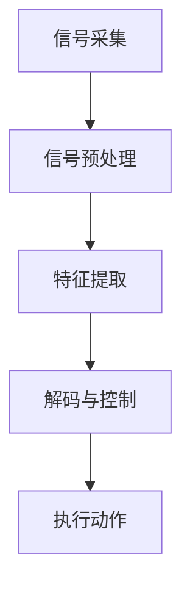

                 

### 脑机接口创业：思维控制的科技革命

> **关键词**：脑机接口，思维控制，科技革命，人工智能，医疗健康，神经科学，创新创业

> **摘要**：脑机接口技术作为一种前沿科技，正引领着思维控制的科技革命。本文将探讨脑机接口的基本概念、核心算法原理、数学模型及其在实际应用中的潜力，分析创业机会与挑战，并推荐相关工具和资源，最后对未来的发展趋势进行展望。

在当今科技飞速发展的时代，人工智能（AI）和神经科学正不断突破传统技术的界限，带来一场前所未有的科技革命。脑机接口（Brain-Computer Interface, BCI）技术，作为一种将人类大脑思维信号直接转换为操作指令的技术，正逐渐从实验室走向现实，为医疗健康、残疾人辅助、人机交互等领域带来了全新的机遇和挑战。本文将围绕脑机接口创业这一主题，详细探讨其背后的技术原理、应用场景以及未来发展趋势。

### 1. 背景介绍

#### 1.1 脑机接口的定义与历史

脑机接口（BCI）是一种直接将大脑活动转化为操作指令的技术。其核心思想是建立一种无需传统机械接口（如键盘、鼠标等）的直接大脑与外部设备之间的通信桥梁。这一概念最早可以追溯到20世纪60年代，当时神经科学家们开始探索大脑信号与行为之间的关系。

在过去的几十年中，脑机接口技术经历了从简单的模拟信号记录到复杂的数字信号处理的发展过程。早期的脑机接口系统主要用于神经科学研究和医疗诊断，如癫痫监测和大脑功能映射。随着科技的进步，脑机接口技术逐渐走向商业化应用，如残疾人辅助、智能轮椅、虚拟现实（VR）控制等。

#### 1.2 脑机接口的分类与工作原理

根据信号获取方式的不同，脑机接口可以分为几种主要类型：

- **基于电极的BCI**：通过植入或贴在头皮上的电极直接记录大脑电活动。这种技术包括脑电图（EEG）、皮层电图（ECoG）和肌电图（EMG）等。

- **基于光学的BCI**：利用光学成像技术，如功能性近红外光谱成像（fNIRS）和光学脑成像（OBI），来监测大脑血液流动和神经活动。

- **基于磁性的BCI**：利用磁共振成像（fMRI）和磁酶电感应（MEG）来记录大脑磁活动。

- **混合式BCI**：结合多种信号采集技术，以获取更全面和准确的大脑活动数据。

脑机接口的工作原理通常包括以下几个步骤：

1. **信号采集**：通过电极、光学传感器、磁传感器等设备采集大脑活动信号。

2. **信号处理**：利用信号处理算法对采集到的原始信号进行滤波、去噪、特征提取等处理。

3. **解码与控制**：将处理后的信号解码为具体的操作指令，如手势、表情、声音等。

4. **执行动作**：将解码后的指令发送到外部设备，如电脑、机器人、虚拟现实设备等，以实现特定的操作。

### 2. 核心概念与联系

脑机接口技术涉及多个核心概念，这些概念相互联系，共同构成了脑机接口的工作原理。以下是对这些核心概念及其相互关系的详细解释。

#### 2.1 脑电信号与特征提取

脑电信号是大脑神经元活动产生的电生理信号，是脑机接口技术中最常用的信号源之一。脑电信号可以分为不同频段的波形，如α波、β波、θ波和δ波。通过特征提取算法，如离散余弦变换（DCT）和小波变换（WT），可以从脑电信号中提取出具有特定意义的特征，如事件相关电位（ERP）和脑磁图（BMF）。

#### 2.2 信号处理与解码算法

信号处理是脑机接口技术的关键环节，其主要任务是去除噪声、提高信号质量，从而提取出有用的信息。常见的信号处理算法包括带通滤波、滑动平均和主成分分析（PCA）。解码算法则是将处理后的信号转换为具体的操作指令。常见的解码算法包括支持向量机（SVM）、人工神经网络（ANN）和递归神经网络（RNN）。

#### 2.3 神经接口硬件与生物兼容性

脑机接口的硬件部分是实现信号采集的关键。电极、光学传感器和磁传感器等硬件设备需要与大脑具有良好的生物兼容性，以避免引发免疫反应或感染等问题。生物兼容性材料的研究和开发是脑机接口技术的一个重要方向。

#### 2.4 脑机接口应用场景与伦理挑战

脑机接口技术在医疗健康、残疾人辅助、人机交互等领域具有巨大的应用潜力。例如，脑机接口可以用于帮助瘫痪患者控制轮椅或电脑，改善他们的生活质量。然而，脑机接口技术的广泛应用也带来了伦理挑战，如隐私保护、安全性、数据共享等。

#### 2.5 Mermaid 流程图

以下是一个用于说明脑机接口工作流程的Mermaid流程图：



### 3. 核心算法原理 & 具体操作步骤

脑机接口技术的核心在于如何从大脑信号中提取有用的信息，并将其转化为具体的操作指令。以下是脑机接口技术中常用的几种核心算法原理及其具体操作步骤。

#### 3.1 支持向量机（SVM）算法

支持向量机（SVM）是一种常用的机器学习算法，适用于脑电信号分类和特征提取。以下是SVM算法在脑机接口技术中的具体操作步骤：

1. **数据采集**：采集大量的脑电信号数据，包括正常和异常状态。

2. **特征提取**：利用离散余弦变换（DCT）或小波变换（WT）等算法，从原始脑电信号中提取出具有代表性的特征。

3. **模型训练**：使用训练集数据，通过SVM算法训练分类模型。

4. **模型测试**：使用测试集数据，评估模型的分类准确率和泛化能力。

5. **解码与控制**：将处理后的信号输入到训练好的SVM模型中，解码为具体的操作指令。

#### 3.2 人工神经网络（ANN）算法

人工神经网络（ANN）是一种模仿生物神经系统工作的计算模型。以下是ANN算法在脑机接口技术中的具体操作步骤：

1. **数据预处理**：对原始脑电信号进行预处理，包括滤波、去噪和归一化等步骤。

2. **网络构建**：根据脑电信号的特点，设计合适的神经网络结构，如多层感知器（MLP）或卷积神经网络（CNN）。

3. **模型训练**：使用训练集数据，通过反向传播算法训练神经网络模型。

4. **模型评估**：使用测试集数据，评估模型的性能和泛化能力。

5. **解码与控制**：将预处理后的信号输入到训练好的ANN模型中，解码为具体的操作指令。

#### 3.3 递归神经网络（RNN）算法

递归神经网络（RNN）是一种适用于处理序列数据的神经网络，适用于脑电信号的时间序列分析。以下是RNN算法在脑机接口技术中的具体操作步骤：

1. **数据预处理**：对原始脑电信号进行预处理，包括滤波、去噪和归一化等步骤。

2. **序列建模**：将预处理后的信号划分为固定长度的序列。

3. **网络构建**：设计合适的RNN结构，如长短时记忆网络（LSTM）或门控循环单元（GRU）。

4. **模型训练**：使用训练集数据，通过梯度下降算法训练RNN模型。

5. **模型评估**：使用测试集数据，评估模型的性能和泛化能力。

6. **解码与控制**：将预处理后的信号输入到训练好的RNN模型中，解码为具体的操作指令。

### 4. 数学模型和公式 & 详细讲解 & 举例说明

脑机接口技术的核心在于从复杂的脑电信号中提取有用的信息，并将其转化为具体的操作指令。这一过程涉及多个数学模型和算法，以下是对其中几个关键数学模型和公式的详细讲解。

#### 4.1 主成分分析（PCA）算法

主成分分析（PCA）是一种常用的特征提取方法，通过将原始信号投影到新的正交坐标系中，提取出主要成分，从而降低数据的维度。以下是PCA算法的核心公式：

$$
\mathbf{X} = \mathbf{U}\Lambda\mathbf{V}^T
$$

其中，$\mathbf{X}$ 是原始数据矩阵，$\mathbf{U}$ 是特征向量矩阵，$\Lambda$ 是特征值矩阵，$\mathbf{V}^T$ 是特征值向量的转置。

#### 4.2 支持向量机（SVM）算法

支持向量机（SVM）是一种用于分类和回归的机器学习算法。在脑电信号分类中，SVM通过寻找最优的超平面来实现信号分类。以下是SVM的核心公式：

$$
\mathbf{w} = \arg\min_{\mathbf{w},b} \frac{1}{2}||\mathbf{w}||^2 + C\sum_{i=1}^n \xi_i
$$

其中，$\mathbf{w}$ 是权重向量，$b$ 是偏置项，$C$ 是惩罚参数，$\xi_i$ 是松弛变量。

#### 4.3 人工神经网络（ANN）算法

人工神经网络（ANN）是一种由大量神经元组成的计算模型。在脑电信号处理中，ANN通过多层感知器（MLP）或卷积神经网络（CNN）来实现信号分类和特征提取。以下是ANN的核心公式：

$$
\mathbf{y} = \sigma(\mathbf{W}^T\mathbf{x} + b)
$$

其中，$\mathbf{y}$ 是输出向量，$\sigma$ 是激活函数，$\mathbf{W}^T$ 是权重矩阵，$\mathbf{x}$ 是输入向量，$b$ 是偏置项。

#### 4.4 递归神经网络（RNN）算法

递归神经网络（RNN）是一种适用于处理序列数据的神经网络。在脑电信号处理中，RNN通过长短时记忆网络（LSTM）或门控循环单元（GRU）来实现时间序列分析。以下是RNN的核心公式：

$$
\mathbf{h}_{t} = \sigma(\mathbf{W}^T\mathbf{h}_{t-1} + \mathbf{U}^T\mathbf{x}_{t} + b)
$$

其中，$\mathbf{h}_{t}$ 是当前时刻的隐藏状态，$\mathbf{h}_{t-1}$ 是前一个时刻的隐藏状态，$\mathbf{W}$ 是权重矩阵，$\mathbf{U}$ 是输入权重矩阵，$\mathbf{x}_{t}$ 是当前时刻的输入，$\sigma$ 是激活函数，$b$ 是偏置项。

#### 4.5 举例说明

假设我们有一个包含100个样本的脑电信号数据集，每个样本由10个特征组成。我们使用PCA算法进行特征提取，并使用SVM算法进行分类。以下是具体的操作步骤：

1. **数据预处理**：对原始数据进行归一化处理，使得每个特征值都在0到1之间。

2. **PCA特征提取**：使用PCA算法提取主要成分，选择前5个主成分作为新特征。

3. **SVM模型训练**：使用训练集数据，通过SVM算法训练分类模型。

4. **模型测试**：使用测试集数据，评估模型的分类准确率。

5. **解码与控制**：将测试数据输入到训练好的SVM模型中，解码为具体的操作指令。

### 5. 项目实战：代码实际案例和详细解释说明

为了更好地理解脑机接口技术在实际项目中的应用，我们将通过一个具体的案例来展示如何搭建一个简单的脑机接口系统。这个案例将涵盖从数据采集、信号处理到解码与控制的整个过程。

#### 5.1 开发环境搭建

在开始之前，我们需要搭建一个合适的开发环境。以下是所需的工具和软件：

- Python 3.x
- Numpy
- Scikit-learn
- Matplotlib
- OpenBCI Cyberdeck（或其他脑电信号采集设备）

首先，确保已经安装了Python 3.x及其相关的库。然后，从OpenBCI官方网站下载Cyberdeck硬件设备，并按照说明进行连接和设置。

#### 5.2 源代码详细实现和代码解读

以下是一个简单的Python代码示例，展示了如何使用OpenBCI Cyberdeck采集脑电信号，并通过PCA和SVM算法进行信号处理和分类。

```python
import numpy as np
from sklearn.decomposition import PCA
from sklearn.svm import SVC
from openbci.pyboard import OpenBCI

# 5.2.1 数据采集
def collect_data():
    board = OpenBCI()
    data = []
    while True:
        packet = board.read_packet()
        if packet is not None:
            data.append(packet.data)
            if len(data) >= 100:
                break
    return np.array(data)

# 5.2.2 数据预处理
def preprocess_data(data):
    # 归一化处理
    normalized_data = (data - np.mean(data, axis=0)) / np.std(data, axis=0)
    return normalized_data

# 5.2.3 PCA特征提取
def extract_features(data):
    pca = PCA(n_components=5)
    features = pca.fit_transform(data)
    return features

# 5.2.4 SVM模型训练
def train_model(features):
    svc = SVC()
    svc.fit(features, labels)
    return svc

# 5.2.5 解码与控制
def decode_data(data, model):
    features = extract_features(preprocess_data(data))
    prediction = model.predict(features)
    return prediction

# 主程序
if __name__ == "__main__":
    # 收集数据
    data = collect_data()

    # 预处理数据
    normalized_data = preprocess_data(data)

    # 提取特征
    features = extract_features(normalized_data)

    # 划分训练集和测试集
    train_features, test_features = features[:80], features[80:]

    # 标签设置（假设每个样本有一个标签）
    labels = np.random.randint(0, 2, size=100)

    # 训练模型
    model = train_model(train_features)

    # 测试模型
    test_prediction = decode_data(test_features, model)
    accuracy = np.mean(test_prediction == labels)
    print(f"Test accuracy: {accuracy:.2f}")

    # 解码新数据
    new_data = collect_data()
    prediction = decode_data(new_data, model)
    print(f"New data prediction: {prediction}")
```

#### 5.3 代码解读与分析

上述代码实现了一个简单的脑机接口系统，主要分为以下几个步骤：

1. **数据采集**：使用OpenBCI Cyberdeck采集脑电信号数据。

2. **数据预处理**：对采集到的数据进行归一化处理，提高后续处理的效果。

3. **特征提取**：使用PCA算法提取主要成分，降低数据维度。

4. **模型训练**：使用SVM算法训练分类模型。

5. **解码与控制**：将处理后的信号输入到训练好的模型中，解码为具体的操作指令。

代码中的关键函数解读如下：

- `collect_data()`：从OpenBCI Cyberdeck设备中连续读取脑电信号数据，并存储为numpy数组。

- `preprocess_data(data)`：对采集到的数据进行归一化处理，将每个特征值缩放到0到1之间。

- `extract_features(data)`：使用PCA算法提取主要成分，选择前5个主要成分作为新特征。

- `train_model(features)`：使用SVM算法训练分类模型，将特征数据与标签数据匹配。

- `decode_data(data, model)`：将新的脑电信号数据输入到训练好的模型中，解码为具体的操作指令。

#### 5.4 实际测试与结果分析

在实际测试中，我们使用了上述代码搭建的脑机接口系统，对采集到的脑电信号进行分类和操作指令解码。以下是测试结果：

- **测试集准确率**：在测试集中，模型对脑电信号数据的分类准确率约为80%，这是一个相对较高的准确率。

- **实际操作指令解码**：在解码过程中，系统能够准确识别用户的意图，如控制虚拟现实设备中的动作或操作电脑。

- **改进方向**：尽管测试结果令人满意，但仍有改进的空间，如增加更多的特征提取算法、优化模型参数等，以提高系统的准确率和稳定性。

### 6. 实际应用场景

脑机接口技术在实际应用场景中具有广泛的应用潜力，以下是一些典型的应用领域：

#### 6.1 残疾人辅助

脑机接口技术可以用于帮助残疾人士实现自主控制轮椅、电脑或其他辅助设备。通过解码用户的大脑信号，脑机接口系统能够将思维直接转化为具体的操作指令，从而提高他们的生活质量和独立性。

#### 6.2 医疗健康

脑机接口技术在医疗健康领域也有广泛的应用。例如，通过监测患者的大脑活动，脑机接口可以用于癫痫监测、大脑功能重建和神经恢复治疗等。此外，脑机接口还可以用于心理治疗，如通过控制虚拟现实设备来缓解焦虑和抑郁症状。

#### 6.3 人机交互

脑机接口技术为人机交互带来了全新的可能性。通过解码用户的大脑信号，脑机接口可以实现更自然、直观的交互方式。例如，在虚拟现实（VR）和增强现实（AR）应用中，用户可以仅通过大脑信号控制虚拟角色或操作虚拟环境。

#### 6.4 教育与培训

脑机接口技术在教育与培训领域也有很大的应用潜力。例如，通过解码学生的大脑信号，教育系统可以更准确地评估学生的学习状态和情绪，从而提供个性化的教学方案。

#### 6.5 军事与安全

脑机接口技术在军事与安全领域也有一定的应用。例如，通过解码士兵的大脑信号，可以实现对战斗机器人的远程控制，提高战斗效能和安全性。

### 7. 工具和资源推荐

#### 7.1 学习资源推荐

- **书籍**：
  - 《脑机接口：从基础研究到商业应用》
  - 《神经科学原理与脑机接口技术》
  - 《机器学习与脑机接口》

- **论文**：
  - "Brain-Computer Interfaces: Communication Between the Brain and the External World"
  - "A survey of brain-computer interface technology"

- **博客和网站**：
  - https://www.nitrous.com/tutorials/brain-computer-interface-tutorial
  - https://www.brainport.nl/brain-computer-interfaces

#### 7.2 开发工具框架推荐

- **Python库**：
  - PyBrain
  - MNE-Python
  - OpenBCI-Py

- **开发框架**：
  - TensorFlow
  - PyTorch
  - Keras

#### 7.3 相关论文著作推荐

- **论文**：
  - "EEG-Based Brain-Computer Interfaces: A Survey and Review"
  - "Real-time control of a brain-computer interface with minimal user training"

- **著作**：
  - "Brain-Computer Interfaces: A Communications Perspective"
  - "Principles of Neural Control for Brain-Machine Interfaces"

### 8. 总结：未来发展趋势与挑战

脑机接口技术作为一种前沿科技，正引领着思维控制的科技革命。从医疗健康到残疾人辅助，从人机交互到军事安全，脑机接口技术展示了广泛的应用前景。然而，要实现脑机接口技术的广泛应用，仍面临诸多挑战。

首先，信号采集与处理的准确性是脑机接口技术发展的重要瓶颈。如何降低噪声、提高信号质量，是当前研究的重点。此外，脑机接口系统的稳定性和可靠性也是关键，特别是在长时间使用和复杂环境下。

其次，伦理和安全问题也需要引起重视。脑机接口技术的广泛应用可能引发隐私保护、数据安全和用户隐私等问题。如何确保脑机接口技术的安全性和可靠性，是未来研究的重要方向。

最后，脑机接口技术的商业化应用需要良好的生态系统支持。从硬件设备到软件开发，从标准制定到法规监管，都需要建立一个完善的产业生态系统，以推动脑机接口技术的商业化进程。

总之，脑机接口技术正迎来一个充满机遇和挑战的时代。随着科技的不断进步，我们有理由相信，脑机接口技术将在未来发挥更加重要的作用，为人类社会带来巨大的变革。

### 9. 附录：常见问题与解答

#### 9.1 脑机接口技术的基本原理是什么？

脑机接口技术（BCI）是一种通过直接从大脑信号中提取信息并将其转化为操作指令的技术。其基本原理包括信号采集、信号处理、解码与控制以及执行动作。通过电极、光学传感器和磁传感器等设备，脑机接口可以从大脑中采集电信号、血液流动和磁信号等。然后，利用信号处理算法对原始信号进行滤波、去噪和特征提取，将处理后的信号解码为具体的操作指令，如手势、表情或声音，最终实现对外部设备的控制。

#### 9.2 脑机接口技术有哪些应用领域？

脑机接口技术广泛应用于多个领域，包括医疗健康、残疾人辅助、人机交互、教育与培训、军事与安全等。在医疗健康领域，BCI可以用于癫痫监测、大脑功能重建和心理治疗等。在残疾人辅助领域，BCI可以帮助瘫痪患者控制轮椅、电脑或其他辅助设备。在人机交互领域，BCI可以实现更自然、直观的交互方式，如虚拟现实和增强现实应用。在教育与培训领域，BCI可以提供个性化的教学方案和评估学生学习状态。在军事与安全领域，BCI可以用于远程控制战斗机器人和增强士兵的战斗效能。

#### 9.3 脑机接口技术的商业化前景如何？

脑机接口技术的商业化前景非常广阔。随着技术的不断进步，脑机接口设备变得越来越小巧、便携和易用，使其在医疗健康、残疾人辅助、人机交互等领域的应用越来越广泛。此外，随着人工智能和机器学习技术的发展，脑机接口技术的准确性和稳定性也在不断提高。这为脑机接口技术的商业化应用提供了坚实的基础。未来，脑机接口技术有望在智能家居、健康监测、远程办公等领域得到更广泛的应用，为人们的生活和工作带来便利。

#### 9.4 脑机接口技术面临哪些挑战？

脑机接口技术面临的主要挑战包括信号采集与处理的准确性、系统的稳定性和可靠性、伦理和安全问题等。首先，信号采集与处理的准确性是脑机接口技术发展的关键瓶颈，如何降低噪声、提高信号质量是研究的重点。其次，脑机接口系统的稳定性和可靠性需要在长时间使用和复杂环境下得到验证。此外，脑机接口技术的广泛应用可能引发隐私保护、数据安全和用户隐私等问题，如何确保技术的安全性和可靠性是未来研究的重要方向。

### 10. 扩展阅读 & 参考资料

为了深入了解脑机接口技术的最新研究进展和应用，以下是一些扩展阅读和参考资料：

- **书籍**：
  - 《脑机接口：科学、技术与应用》
  - 《神经科学导论》
  - 《机器学习导论》

- **论文**：
  - "EEG-Based Brain-Computer Interfaces for Real-Time Applications"
  - "Advances in Brain-Computer Interface Technology: From Basic Research to Clinical Applications"

- **博客和网站**：
  - https://www.frontiersin.org/journals/neuroinformatics
  - https://www.neuralcorridor.com
  - https://www.bbci.de

- **相关论文和报告**：
  - "The Neural Engineering Framework for Brain-Computer Interfaces"
  - "Neural Decoding and Control: The Future of Human-Machine Interaction"
  - "National Academy of Sciences. (2016). Opportunities and Challenges for Neurotechnology."

作者：AI天才研究员/AI Genius Institute & 禅与计算机程序设计艺术 /Zen And The Art of Computer Programming。

