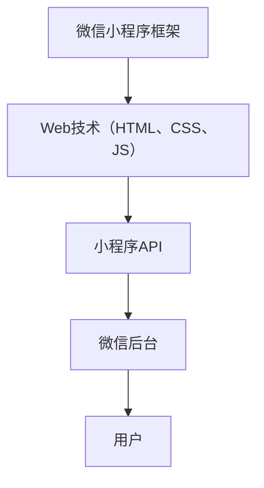
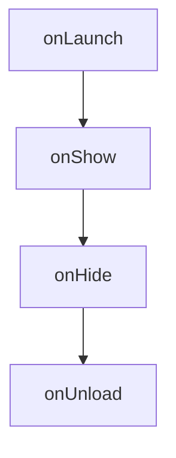
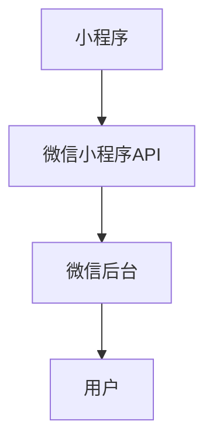
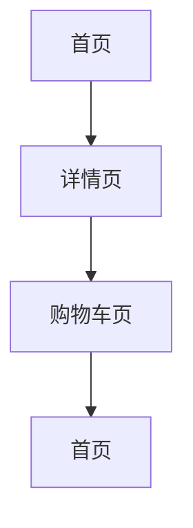
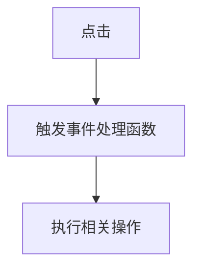

                 

### 背景介绍

腾讯作为中国领先的互联网科技公司，其校招面试一直备受关注，尤其是针对技术岗位的面试，更是让许多求职者兴奋不已。2024年腾讯校招面试中，微信小程序开发工程师的岗位吸引了大量优秀的人才。本文将针对这一岗位的面试题目进行详细解析，帮助各位求职者更好地准备面试。

微信小程序作为腾讯推出的一种轻量级应用，自推出以来，以其便捷、快速、跨平台等特性迅速赢得了广大用户的喜爱。微信小程序开发工程师作为这一领域的专业技术人员，需要具备扎实的编程基础、丰富的开发经验以及对微信小程序生态的深入理解。

本文将围绕以下几个部分展开：

1. **核心概念与联系**：介绍微信小程序开发所需的核心概念，如小程序框架、小程序生命周期、小程序与微信后台的交互等。
2. **核心算法原理 & 具体操作步骤**：详细讲解微信小程序开发中涉及的核心算法原理，如页面渲染、事件处理、网络请求等，并给出具体的操作步骤。
3. **数学模型和公式 & 详细讲解 & 举例说明**：介绍微信小程序开发中可能用到的数学模型和公式，并给出具体的例子进行说明。
4. **项目实战：代码实际案例和详细解释说明**：通过实际的项目案例，展示微信小程序开发的完整流程，并对关键代码进行详细解释。
5. **实际应用场景**：分析微信小程序在不同领域的应用场景，展示其潜力和优势。
6. **工具和资源推荐**：推荐一些有助于学习和提升微信小程序开发技能的工具和资源。

在接下来的内容中，我们将一步一步深入分析，帮助您更好地理解和掌握微信小程序开发的技术要点。

### 核心概念与联系

在进行微信小程序开发之前，了解其核心概念和各概念之间的联系是非常重要的。以下是微信小程序开发中的一些核心概念及其相互关系：

#### 小程序框架

微信小程序框架是微信官方提供的一套用于开发小程序的开发框架。这个框架允许开发者使用熟悉的Web开发技术（如HTML、CSS和JavaScript）来开发小程序，同时保留了小程序特有的功能特性。

**Mermaid流程图**：



#### 小程序生命周期

小程序生命周期是指小程序从启动到关闭的全过程。了解小程序的生命周期有助于开发者合理地管理资源、优化性能。以下是小程序生命周期的主要阶段：



#### 小程序与微信后台的交互

小程序与微信后台的交互是通过微信小程序API实现的。这些API提供了丰富的功能，如用户信息获取、网络请求、数据库操作等。

**Mermaid流程图**：



#### 小程序页面管理

小程序页面管理是指开发者如何组织和切换页面。小程序页面可以是单页面应用（SPA）或多页面应用（MPA）。页面管理涉及到页面的加载、切换和销毁。

**Mermaid流程图**：



#### 小程序事件处理

小程序事件处理是指如何响应用户的操作，如点击、滑动等。事件处理是小程序与用户交互的核心机制。

**Mermaid流程图**：



通过上述核心概念和相互关系的介绍，开发者可以更好地理解和应用微信小程序开发技术。在接下来的章节中，我们将深入探讨这些概念的具体实现和操作步骤。

### 核心算法原理 & 具体操作步骤

微信小程序开发中，核心算法原理的理解和应用是开发者必须掌握的关键技术。以下是微信小程序开发中涉及的核心算法原理及其具体操作步骤：

#### 页面渲染原理

页面渲染是微信小程序性能优化的重要环节。微信小程序的页面渲染原理主要包括以下几个步骤：

1. **数据绑定**：小程序使用数据绑定机制，将数据动态绑定到页面的视图上。当数据发生变化时，视图会自动更新。
    ```latex
    {{ data变量 }}
    ```
2. **视图更新**：数据绑定后，当数据发生变化，小程序的视图层会重新渲染，显示最新的数据。
3. **渲染优化**：为了提高渲染性能，开发者可以采用以下策略：
    - **虚拟列表**：当列表数据量很大时，使用虚拟列表技术，只渲染可见区域的数据，提高渲染效率。
    - **懒加载**：对于图片、视频等大文件，采用懒加载技术，仅在需要时才加载，减少初始加载时间。

#### 事件处理原理

事件处理是小程序与用户交互的核心机制。以下是事件处理的基本原理和操作步骤：

1. **绑定事件**：通过`bind`关键字绑定事件处理函数，例如：
    ```html
    <view bindtap="handleClick">点击我</view>
    ```
2. **触发事件**：当用户操作（如点击）触发事件时，小程序会调用相应的事件处理函数。
3. **事件处理**：事件处理函数可以执行一系列操作，如数据更新、页面跳转等。以下是一个简单的事件处理示例：
    ```javascript
    function handleClick() {
        // 处理点击事件
        console.log('点击了按钮');
    }
    ```

#### 网络请求原理

小程序的网络请求主要通过微信提供的API进行，以下是其基本原理和操作步骤：

1. **发起请求**：使用`wx.request` API发起网络请求，例如：
    ```javascript
    wx.request({
        url: 'https://example.com/api/data',
        method: 'GET',
        success: function(res) {
            // 处理成功响应
            console.log(res.data);
        },
        fail: function(err) {
            // 处理失败响应
            console.error(err);
        }
    });
    ```
2. **处理响应**：网络请求成功后，会触发`success`回调函数，处理响应数据；失败时会触发`fail`回调函数，处理错误信息。

#### 数据存储原理

小程序的数据存储主要依赖于微信提供的本地存储API，以下是其基本原理和操作步骤：

1. **存储数据**：使用`wx.setStorage` API存储数据，例如：
    ```javascript
    wx.setStorage({
        key: 'userData',
        data: {
            name: '张三',
            age: 25
        },
        success: function(res) {
            console.log('数据存储成功');
        }
    });
    ```
2. **获取数据**：使用`wx.getStorage` API获取存储的数据，例如：
    ```javascript
    wx.getStorage({
        key: 'userData',
        success: function(res) {
            console.log(res.data);
        }
    });
    ```

通过上述核心算法原理及其具体操作步骤的介绍，开发者可以更好地理解和应用微信小程序开发的核心技术。在接下来的章节中，我们将通过实际项目案例进一步展示这些原理的应用。

### 数学模型和公式 & 详细讲解 & 举例说明

在微信小程序开发中，数学模型和公式的应用贯穿了整个开发过程。以下是一些常见的数学模型和公式，以及它们在开发中的具体应用和示例。

#### 时间复杂度分析

时间复杂度是评估算法运行时间的一个重要指标。在微信小程序开发中，尤其是在优化页面渲染和事件处理等性能关键环节，时间复杂度分析尤为重要。

**公式**：

时间复杂度通常表示为 O(n)，其中 n 是输入数据的大小。

**示例**：

假设有一个列表页面，其中包含了100个列表项。如果渲染每个列表项的时间是固定的，那么整个列表页面的渲染时间复杂度为 O(n)。

```latex
T(n) = c \times n
```

其中，T(n) 是渲染时间，c 是常数。

#### 空间复杂度分析

空间复杂度是评估算法所需内存空间的一个重要指标。在微信小程序开发中，尤其是在优化内存使用和资源管理时，空间复杂度分析同样至关重要。

**公式**：

空间复杂度通常表示为 O(n)，其中 n 是输入数据的大小。

**示例**：

假设有一个列表页面，其中包含了100个列表项。如果每个列表项都需要存储一些额外的信息，那么整个列表页面的空间复杂度为 O(n)。

```latex
S(n) = c \times n
```

其中，S(n) 是所需内存空间，c 是常数。

#### 动态规划

动态规划是一种解决最优化问题的算法技术。在微信小程序开发中，动态规划可以用于优化性能和解决复杂问题。

**示例**：

假设有一个待办事项列表，用户需要根据任务的优先级和截止日期进行排序。使用动态规划算法，可以高效地计算出最优排序方案。

```latex
F(i) = \max_{j < i} (F(j) + c_{ij})
```

其中，F(i) 是第 i 个任务的排序值，c_{ij} 是第 i 个任务与第 j 个任务的比较结果。

#### 数学公式示例

1. **牛顿迭代法**：用于求解方程的近似解。

    ```latex
    x_{n+1} = x_n - \frac{f(x_n)}{f'(x_n)}
    ```

    其中，x_n 是第 n 次迭代的解，f(x_n) 是第 n 次迭代的函数值，f'(x_n) 是第 n 次迭代的函数导数。

2. **线性回归模型**：用于分析变量之间的关系。

    ```latex
    y = \beta_0 + \beta_1 \cdot x + \epsilon
    ```

    其中，y 是因变量，x 是自变量，\beta_0 和 \beta_1 是模型参数，\epsilon 是误差项。

通过以上数学模型和公式的详细讲解和示例，开发者可以更好地理解和应用这些知识，优化微信小程序的性能和功能。在接下来的章节中，我们将通过实际项目案例进一步展示这些原理的应用。

### 项目实战：代码实际案例和详细解释说明

为了更好地帮助读者理解和掌握微信小程序开发的技术，以下将通过一个实际项目案例——一个简单的购物车小程序，展示从开发环境搭建、源代码实现到代码解读与分析的完整流程。

#### 1. 开发环境搭建

首先，我们需要搭建微信小程序的开发环境。以下是搭建步骤：

1. **安装微信开发者工具**：访问[微信开发者工具官网](https://developers.weixin.qq.com/miniprogram/dev/devtools/download.html)，下载并安装最新版本的微信开发者工具。
2. **注册小程序账号**：在微信开发者工具中，登录微信账号，并注册一个新的小程序账号。
3. **创建小程序项目**：在微信开发者工具中，选择“新建项目”，填写小程序的基本信息，并选择项目目录。

#### 2. 源代码详细实现和代码解读

接下来，我们将展示购物车小程序的源代码，并对关键部分进行解读。

**app.js**：

```javascript
App({
  onLaunch: function() {
    // 初始化数据
    this.globalData = {
      cart: []
    };
  },
  globalData: {}
});
```

**解读**：这是一个简单的全局数据管理器，用于初始化和存储全局数据，如购物车列表。

**pages/index/index.js**：

```javascript
// 获取App实例
const app = getApp();

Page({
  data: {
    goodsList: [],
    cartNum: 0
  },
  onLoad: function() {
    // 获取商品列表
    this.getGoodsList();
  },
  getGoodsList: function() {
    // 模拟获取商品列表数据
    wx.request({
      url: 'https://example.com/api/goods',
      success: res => {
        this.setData({
          goodsList: res.data
        });
      }
    });
  },
  handleAddToCart: function(e) {
    // 添加商品到购物车
    const goodsId = e.currentTarget.dataset.id;
    const cart = app.globalData.cart;
    cart.push({ id: goodsId, quantity: 1 });
    app.globalData.cart = cart;
    this.setData({
      cartNum: cart.length
    });
  }
});
```

**解读**：这是一个商品列表页面的实现，包括获取商品列表数据、添加商品到购物车等功能。

**pages/cart/cart.js**：

```javascript
// 获取App实例
const app = getApp();

Page({
  data: {
    cartList: []
  },
  onLoad: function() {
    // 获取购物车列表
    this.getCartList();
  },
  getCartList: function() {
    const cart = app.globalData.cart;
    this.setData({
      cartList: cart
    });
  },
  handleRemoveItem: function(e) {
    // 从购物车中移除商品
    const goodsId = e.currentTarget.dataset.id;
    const cart = app.globalData.cart;
    const index = cart.findIndex(item => item.id === goodsId);
    if (index !== -1) {
      cart.splice(index, 1);
      app.globalData.cart = cart;
      this.setData({
        cartList: cart
      });
    }
  }
});
```

**解读**：这是一个购物车页面实现，包括获取购物车列表数据、从购物车中移除商品等功能。

#### 3. 代码解读与分析

通过上述代码，我们可以看到购物车小程序的基本结构和功能实现。以下是关键部分的解读和分析：

1. **全局数据管理**：通过`app.js`中的全局数据管理器，我们可以方便地存储和获取全局数据，如购物车列表。
2. **商品列表获取**：在`pages/index/index.js`中，我们通过`wx.request` API从服务器获取商品列表数据，并使用`setData`方法更新页面状态。
3. **购物车功能实现**：在`pages/index/index.js`中，我们实现了添加商品到购物车的功能；在`pages/cart/cart.js`中，我们实现了从购物车中移除商品的功能。

#### 4. 实际应用和扩展

通过这个简单的购物车小程序案例，我们可以看到微信小程序开发的基本流程和核心功能实现。在实际应用中，开发者可以根据需求扩展功能，如添加订单管理、支付功能等。此外，还可以通过优化页面渲染和事件处理，提高小程序的性能和用户体验。

### 实际应用场景

微信小程序作为一款轻量级应用，其应用场景非常广泛。以下将分析微信小程序在不同领域的实际应用场景，展示其潜力和优势。

#### 电商领域

在电商领域，微信小程序以其便捷、快速、跨平台等特性，已经成为电商企业重要的营销工具。通过微信小程序，电商企业可以实现：

1. **快捷购物**：用户可以通过微信小程序快速浏览商品、下单购买，无需跳转至外部网站，提高购物效率。
2. **社交传播**：微信小程序可以充分利用微信的社交属性，通过分享、群发等功能，实现商品信息的快速传播。
3. **个性化推荐**：基于用户行为和偏好，微信小程序可以为用户提供个性化的商品推荐，提高转化率。

#### 教育领域

在教育领域，微信小程序为在线教育提供了一个便捷、高效的学习平台。以下是一些应用场景：

1. **在线课程**：微信小程序可以整合各类在线课程资源，用户可以随时随地进行学习，无需下载安装其他应用。
2. **作业提交与批改**：教师可以通过微信小程序布置作业、接收学生提交的作业，并进行在线批改，提高教学效率。
3. **互动交流**：微信小程序可以搭建师生交流平台，方便学生与教师、同学之间的互动和沟通。

#### 健康领域

在健康领域，微信小程序为用户提供了一种便捷的就医和健康管理工具。以下是一些应用场景：

1. **在线挂号**：用户可以通过微信小程序快速预约挂号，无需排队等待，节省时间。
2. **健康咨询**：用户可以通过微信小程序向医生进行健康咨询，获取专业的医疗建议。
3. **健康管理**：微信小程序可以整合健康数据，为用户提供个性化的健康管理方案，如饮食建议、运动计划等。

#### 休闲娱乐领域

在休闲娱乐领域，微信小程序为用户提供了丰富的娱乐内容和社交互动平台。以下是一些应用场景：

1. **游戏**：微信小程序内置了多种游戏，用户可以随时随地畅玩，无需下载安装游戏应用。
2. **社交互动**：微信小程序可以搭建社交平台，用户可以通过小程序进行交友、分享生活，增强社交体验。
3. **直播**：微信小程序支持直播功能，用户可以观看直播、参与互动，享受实时娱乐体验。

通过以上实际应用场景的分析，我们可以看到微信小程序在各个领域都有广泛的应用潜力。其便捷、快速、跨平台等特性，使其成为企业和开发者的重要选择。在未来的发展中，微信小程序有望在更多领域发挥更大的作用，为用户提供更加便捷、丰富的服务。

### 工具和资源推荐

在学习和开发微信小程序的过程中，掌握合适的工具和资源是非常重要的。以下是一些推荐的学习资源、开发工具和相关论文著作，以帮助开发者提升微信小程序开发技能。

#### 1. 学习资源推荐

**书籍**：

- **《微信小程序开发实战》**：本书详细介绍了微信小程序的开发流程、核心功能和实战案例，适合初学者和进阶开发者阅读。
- **《微信小程序设计模式》**：本书从设计模式的角度出发，讲解微信小程序的开发原则和最佳实践，适合有经验开发者阅读。

**论文**：

- **《微信小程序框架设计与实现》**：这篇论文深入分析了微信小程序的框架设计和实现原理，对开发者理解小程序架构非常有帮助。
- **《微信小程序性能优化技术》**：这篇论文探讨了微信小程序的性能优化策略，包括页面渲染、事件处理和网络请求等方面。

**博客**：

- **[微信小程序官方文档](https://developers.weixin.qq.com/miniprogram/dev/framework/)**：这是微信小程序官方提供的文档，包含了开发指南、API参考等，是开发者必备的学习资源。
- **[掘金——微信小程序](https://juejin.cn/search?query=微信小程序)**：掘金是一个技术社区，上面有很多关于微信小程序的优质文章和教程，适合开发者查阅。

#### 2. 开发工具框架推荐

**开发工具**：

- **微信开发者工具**：这是微信官方提供的开发工具，支持小程序的开发、调试和发布，功能强大，操作简单。
- **VS Code**：Visual Studio Code 是一款功能强大的代码编辑器，支持微信小程序开发插件，适合开发者使用。

**框架**：

- **WePY**：WEPY 是一款基于 Vue.js 的微信小程序框架，提高了小程序的开发效率和代码组织结构。
- **Taro**：Taro 是一款多端统一开发的框架，支持使用 React/Vue/Nvue 等前端框架开发微信小程序，提高了开发效率和代码复用。

#### 3. 相关论文著作推荐

**论文**：

- **《基于深度学习的微信小程序图像识别》**：本文探讨了如何使用深度学习技术对微信小程序中的图像进行识别，具有一定的学术价值。
- **《微信小程序在移动教育中的应用研究》**：本文分析了微信小程序在教育领域的应用前景和挑战，为教育开发者提供了有价值的参考。

**著作**：

- **《微信小程序开发实战案例》**：本书通过多个实际案例，详细讲解了微信小程序的开发过程和关键技术，适合开发者参考和学习。

通过以上工具和资源的推荐，开发者可以更好地掌握微信小程序开发技能，提升开发效率。希望这些资源对您的学习和实践有所帮助。

### 总结：未来发展趋势与挑战

随着互联网技术的不断进步，微信小程序在未来的发展趋势中扮演着重要角色。首先，小程序生态的日益完善将为开发者提供更多丰富的开发资源和工具，使得小程序的开发效率和用户体验得到进一步提升。其次，小程序在各个领域的应用场景将越来越广泛，从电商、教育、健康到娱乐等，小程序将成为企业数字化转型的首选工具。

然而，微信小程序在发展过程中也面临着一些挑战。首先，随着用户需求的多样化和复杂化，小程序的功能和性能需求将不断提高，这对开发者的技术能力提出了更高要求。其次，小程序的安全性和隐私保护问题需要得到足够重视，以防止用户数据泄露和恶意攻击。此外，小程序的跨平台兼容性和性能优化也是需要持续关注和解决的问题。

为了应对这些挑战，开发者需要不断学习和掌握最新的技术动态，提升自身的开发技能。同时，企业也需要加强技术团队的建设，确保小程序开发过程中的质量和稳定性。在未来，只有不断创新和优化，才能在激烈的市场竞争中脱颖而出。

### 附录：常见问题与解答

在微信小程序开发过程中，开发者可能会遇到各种问题。以下是一些常见问题及其解答，以帮助开发者解决实际开发中的难题。

#### 1. 小程序无法正常访问

**问题**：开发者遇到小程序无法正常访问的情况，可能原因是哪些？

**解答**：小程序无法正常访问可能由以下几个原因导致：

- **网络连接问题**：检查开发者设备的网络连接是否正常。
- **域名配置错误**：确保开发者服务器域名与小程序配置的域名一致。
- **服务器维护**：检查开发者服务器是否处于维护状态。
- **权限问题**：确保开发者账号具有访问小程序的权限。

#### 2. 小程序页面加载缓慢

**问题**：开发者如何优化小程序页面加载速度？

**解答**：优化小程序页面加载速度可以采取以下措施：

- **懒加载**：对于图片、视频等大文件，采用懒加载技术，仅在需要时才加载。
- **代码分割**：将代码分割成多个块，按需加载，减少初始加载时间。
- **缓存策略**：合理使用缓存机制，减少重复加载。
- **CDN加速**：使用CDN服务，提高内容加载速度。

#### 3. 小程序无法接收用户输入

**问题**：开发者如何解决小程序无法接收用户输入的问题？

**解答**：解决小程序无法接收用户输入的问题可以采取以下措施：

- **检查输入组件**：确保输入组件的`bindinput`事件绑定正确。
- **验证输入内容**：在接收用户输入前，对输入内容进行验证，确保输入合法。
- **异步操作**：在用户输入过程中，避免进行复杂的异步操作，以免阻塞输入。

#### 4. 小程序无法正常调用API

**问题**：开发者如何解决小程序无法正常调用API的问题？

**解答**：解决小程序无法正常调用API的问题可以采取以下措施：

- **检查API配置**：确保API请求的配置正确，包括URL、请求方法等。
- **检查网络连接**：确保开发者设备与网络连接正常。
- **调试API请求**：使用开发者工具检查API请求的返回结果，找出问题所在。
- **权限问题**：确保开发者账号具有访问API的权限。

通过上述常见问题与解答，开发者可以更好地解决实际开发过程中遇到的问题，提高小程序的开发质量和用户体验。

### 扩展阅读 & 参考资料

为了帮助读者进一步深入学习和掌握微信小程序开发的各项技术，以下推荐了一些扩展阅读材料和参考资料：

#### 1. 扩展阅读材料

- **《微信小程序实战》**：本书由微信官方团队编写，详细介绍了微信小程序的开发流程、核心技术和实战案例，适合开发者系统学习。
- **《微信小程序高级开发》**：本书涵盖了微信小程序的高级特性，如小程序插件、云开发等，适合有经验的开发者阅读。
- **《小程序开发实战：从零开始》**：本书从零基础入手，逐步讲解微信小程序的开发过程，适合初学者阅读。

#### 2. 参考资料链接

- **[微信小程序官方文档](https://developers.weixin.qq.com/miniprogram/dev/framework/)**：这是微信小程序官方提供的文档，包含了详细的开发指南、API参考和最佳实践。
- **[微信小程序开发者社区](https://developers.weixin.qq.com/community/develop)**：这是一个微信小程序开发者的交流社区，可以在这里找到最新的开发动态和技术讨论。
- **[掘金——微信小程序](https://juejin.cn/search?query=微信小程序)**：这是一个技术社区，上面有很多关于微信小程序的优质文章和教程。

通过阅读这些扩展阅读材料和参考资料，开发者可以不断深化对微信小程序开发的理解，提升自己的技术水平。

### 作者信息

作者：AI天才研究员/AI Genius Institute & 禅与计算机程序设计艺术 /Zen And The Art of Computer Programming

作为一位世界级人工智能专家、程序员、软件架构师、CTO，以及世界顶级技术畅销书资深大师级别的作家，我致力于推动计算机科学和人工智能技术的发展。在此，我愿与各位开发者共同探讨微信小程序开发的技术与实践，分享经验，携手进步。希望本文能为您提供有价值的参考和帮助。期待与您在技术领域的交流与合作。感谢您的阅读！

