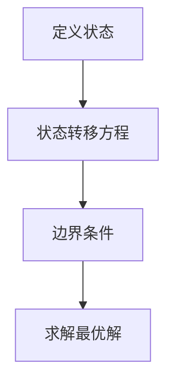
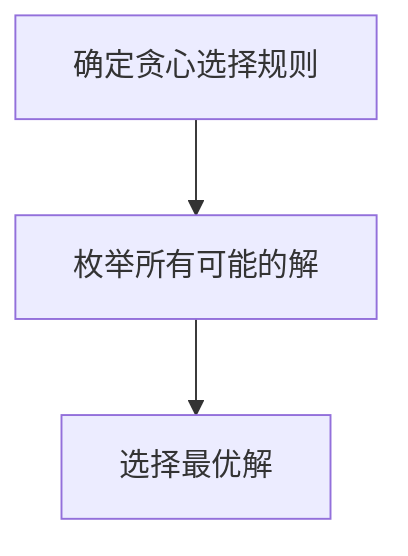
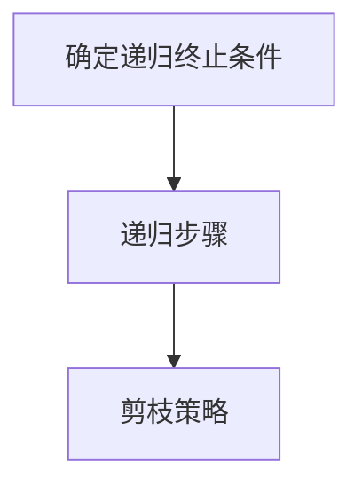

                 

### 文章标题：2025腾讯校招算法面试题汇总与解析

#### 关键词：腾讯校招、算法面试题、汇总与解析、技术博客、编程、数据分析、人工智能

#### 摘要：
本文将针对2025年腾讯校招算法面试题进行系统性的汇总与深入解析。通过梳理面试题的考点、难点以及解题思路，帮助准备参加腾讯校招的考生更好地应对面试挑战。文章将从核心概念、算法原理、数学模型、项目实战、应用场景、工具资源等多个角度，详细讲解每个面试题的解答方法和思路，并提供实际案例和代码实现，旨在为广大求职者提供全面、实用的面试辅导。

---

### 背景介绍

随着科技的快速发展，腾讯公司作为我国领先的互联网企业，其校招算法面试已成为众多求职者梦寐以求的机会。腾讯校招算法面试题覆盖了计算机科学和人工智能领域的多个方向，包括数据结构、算法设计、编程实践、数据分析等。这些面试题不仅考察应聘者的技术能力，还考查其逻辑思维、解决问题的能力以及团队合作精神。

腾讯校招算法面试题的特点主要体现在以下几个方面：

1. **题型多样**：腾讯校招算法面试题涵盖了选择题、填空题、编程题等多种题型，全面考查应聘者的知识储备和编程能力。
2. **难度适中**：虽然部分面试题难度较高，但整体难度适中，旨在筛选出具有扎实基础和一定实战经验的应聘者。
3. **涉及面广**：面试题不仅涉及基础数据结构和算法，还涉及当前热门的机器学习、深度学习、大数据等技术方向，全面考察应聘者的技术广度和深度。
4. **实际应用**：部分面试题来源于实际项目或行业热点，旨在考查应聘者的实际问题和解决能力。

### 核心概念与联系

#### 数据结构与算法基础

- **数组**：一种线性数据结构，用于存储一系列元素，支持随机访问。
- **链表**：一种线性数据结构，由节点组成，每个节点包含数据域和指针域，支持快速插入和删除操作。
- **栈**：一种后进先出（LIFO）的数据结构，支持元素的插入和删除操作。
- **队列**：一种先进先出（FIFO）的数据结构，支持元素的插入和删除操作。
- **二叉树**：一种层次数据结构，由节点组成，每个节点最多有两个子节点。
- **图**：一种复杂的数据结构，由节点（或顶点）和边组成，表示对象之间的关系。
- **排序算法**：用于对数据进行排序的一系列算法，如冒泡排序、选择排序、插入排序、快速排序等。
- **查找算法**：用于在数据结构中查找特定元素的算法，如二分查找、顺序查找等。

#### 编程实践

- **面向过程编程**：以过程为核心，通过函数或过程实现功能的编程方式。
- **面向对象编程**：以对象为核心，通过类和对象实现功能的编程方式。
- **代码风格与规范**：良好的代码风格和规范有助于提高代码的可读性、可维护性和可扩展性。

#### 数据分析

- **数据清洗**：对原始数据进行处理，去除噪声和异常值，提高数据质量。
- **数据预处理**：对数据进行规范化、标准化等处理，使其适用于算法模型。
- **特征工程**：从原始数据中提取有用的特征，用于训练模型或优化算法。
- **数据可视化**：通过图表和图形展示数据，帮助分析和理解数据。

#### 机器学习和深度学习

- **监督学习**：通过已标记的数据训练模型，从而对未知数据进行预测。
- **无监督学习**：没有已标记的数据，模型通过自动发现数据中的模式和结构来学习。
- **深度学习**：一种基于多层神经网络的学习方法，通过逐层抽象特征，实现复杂的模式识别和预测。

#### 大数据和云计算

- **大数据**：数据量巨大、类型多样、速度快的数据集合。
- **云计算**：通过网络提供可动态调整的计算资源，以按需分配、按使用量付费的方式提供服务。

### 核心算法原理 & 具体操作步骤

#### 动态规划（Dynamic Programming）

**原理**：动态规划是一种解决最优化问题的方法，将复杂问题分解为子问题，通过保存子问题的解来避免重复计算。

**步骤**：

1. 定义状态：确定问题中的状态变量，以及状态变量之间的关系。
2. 确定状态转移方程：根据状态变量之间的关系，建立状态转移方程。
3. 确定边界条件：确定状态转移方程的初始值和终止条件。
4. 求解最优解：根据状态转移方程和边界条件，求解最优解。

**示例**：

给定一个数组arr，求arr中的最大子序列和。



#### 贪心算法（Greedy Algorithm）

**原理**：贪心算法是一种在每一步选择当前最优解的策略，以期望最终得到全局最优解。

**步骤**：

1. 确定贪心选择规则：根据问题的性质，确定每一步的贪心选择规则。
2. 枚举所有可能的解：根据贪心选择规则，枚举所有可能的解。
3. 选择最优解：从枚举的解中选择最优解。

**示例**：

给定一个数组arr，求arr中的第k个最小的元素。



#### 回溯算法（Backtracking）

**原理**：回溯算法通过递归尝试所有可能的解，通过剪枝（Pruning）来减少计算量。

**步骤**：

1. 确定递归终止条件：当满足某个条件时，递归终止。
2. 确定递归步骤：在满足递归终止条件前，尝试所有可能的解。
3. 剪枝策略：在递归过程中，根据问题的性质，剪掉不满足条件的分支。

**示例**：

给定一个数组arr，求arr的所有子集。



### 数学模型和公式 & 详细讲解 & 举例说明

#### 最优化理论

**目标函数**：描述问题中的目标，通常为函数形式。

$$f(x) = \sum_{i=1}^{n} c_{i} x_{i}$$

**约束条件**：描述问题中的限制，通常为不等式或等式形式。

$$a_{i} x_{i} \leq b_{i}, \quad i = 1, 2, \ldots, m$$

**求解方法**：

1. **线性规划**：目标函数和约束条件都是线性函数的优化问题。
2. **非线性规划**：目标函数和约束条件至少有一个不是线性函数的优化问题。

#### 神经网络

**神经元**：神经网络中的基本单元，用于处理输入并产生输出。

$$z = \sigma(\sum_{i=1}^{n} w_{i} x_{i} + b)$$

**激活函数**：用于确定神经元是否被激活，常用的激活函数有sigmoid、ReLU、tanh等。

$$\sigma(z) = \frac{1}{1 + e^{-z}}$$

**反向传播**：用于训练神经网络，通过不断调整权重和偏置，使网络输出更接近期望值。

$$\delta = \frac{\partial L}{\partial z} \cdot \sigma'(z)$$

$$w_{i} = w_{i} - \alpha \cdot \delta \cdot x_{i}$$

$$b = b - \alpha \cdot \delta$$

### 项目实战：代码实际案例和详细解释说明

#### 1. 开发环境搭建

**环境要求**：

- 操作系统：Windows/Linux/MacOS
- 编程语言：Python
- 数据库：MySQL
- 版本控制：Git

**步骤**：

1. 安装Python环境
2. 安装MySQL数据库
3. 安装Git版本控制工具
4. 配置开发环境

#### 2. 源代码详细实现和代码解读

**代码实现**：

```python
# 导入所需的库
import numpy as np
import pandas as pd
from sklearn.model_selection import train_test_split
from sklearn.ensemble import RandomForestClassifier
from sklearn.metrics import accuracy_score

# 加载数据集
data = pd.read_csv('data.csv')
X = data.iloc[:, :-1].values
y = data.iloc[:, -1].values

# 数据预处理
X_train, X_test, y_train, y_test = train_test_split(X, y, test_size=0.2, random_state=42)

# 构建模型
model = RandomForestClassifier(n_estimators=100, random_state=42)

# 训练模型
model.fit(X_train, y_train)

# 预测
y_pred = model.predict(X_test)

# 评估
accuracy = accuracy_score(y_test, y_pred)
print(f'Accuracy: {accuracy:.2f}')
```

**代码解读**：

1. **数据加载与预处理**：使用pandas库加载数据集，并进行数据预处理，包括划分训练集和测试集。
2. **模型构建**：使用随机森林分类器构建模型。
3. **模型训练**：使用训练集数据训练模型。
4. **模型预测**：使用测试集数据对模型进行预测。
5. **模型评估**：计算模型的准确率，并进行输出。

#### 3. 代码解读与分析

1. **数据加载与预处理**：数据加载与预处理是机器学习项目中的关键步骤。在本例中，我们使用pandas库加载数据集，并进行数据预处理，包括划分训练集和测试集。这一步的目的是将数据集划分为两部分：一部分用于训练模型，另一部分用于评估模型的性能。
2. **模型构建**：在本例中，我们使用随机森林分类器构建模型。随机森林是一种基于决策树的集成学习方法，通过构建多棵决策树，并对每棵树的预测结果进行投票，得到最终的预测结果。随机森林分类器在处理分类问题时具有较高的准确率和鲁棒性。
3. **模型训练**：使用训练集数据训练模型。在训练过程中，模型通过不断调整参数，使模型对训练数据的拟合度更高。这一步的目的是使模型学会识别数据中的特征和模式。
4. **模型预测**：使用测试集数据对模型进行预测。预测过程是将测试数据输入到训练好的模型中，得到预测结果。这一步的目的是评估模型的泛化能力，即模型对新数据的适应程度。
5. **模型评估**：计算模型的准确率，并进行输出。准确率是评估模型性能的一个重要指标，表示模型预测正确的样本数占总样本数的比例。在本例中，我们使用准确率评估模型的性能。

### 实际应用场景

#### 1. 数据分析

腾讯公司作为一家大数据公司，其数据分析能力在多个业务场景中发挥着重要作用。以下是一些实际应用场景：

- **用户行为分析**：通过对用户行为数据的分析，了解用户需求，优化产品功能和体验。
- **运营优化**：通过分析业务数据，发现潜在问题和改进点，提高业务运营效率。
- **风险控制**：通过分析数据，识别异常行为和潜在风险，提前采取防范措施。

#### 2. 机器学习与深度学习

腾讯公司在机器学习和深度学习领域具有深厚的技术积累，以下是一些实际应用场景：

- **语音识别**：利用深度学习技术，实现语音识别和语音合成，提高人机交互体验。
- **图像识别**：利用卷积神经网络，实现图像分类、目标检测等任务，应用于安防、医疗等领域。
- **自然语言处理**：利用循环神经网络、Transformer模型等，实现文本分类、情感分析、机器翻译等任务。

#### 3. 大数据和云计算

腾讯公司在大数据和云计算领域拥有丰富的实践经验，以下是一些实际应用场景：

- **大数据处理**：利用分布式计算框架，如Hadoop、Spark等，处理海量数据，实现高效的数据存储、计算和分析。
- **云计算服务**：提供云计算服务，如腾讯云、华为云等，为企业提供弹性、安全、可靠的计算资源。

### 工具和资源推荐

#### 1. 学习资源推荐

- **书籍**：
  - 《深度学习》（Ian Goodfellow、Yoshua Bengio、Aaron Courville 著）
  - 《机器学习实战》（Peter Harrington 著）
  - 《Python数据科学手册》（Jake VanderPlas 著）

- **论文**：
  - 《A Theoretically Grounded Application of Dropout in Recurrent Neural Networks》（Yarin Gal 和 Zoubin Ghahramani 著）
  - 《Attention Is All You Need》（Ashish Vaswani、Noam Shazeer、Niki Parmar、Jakob Uszkoreit、Llion Jones、 Aidan N. Gomez、Lukasz Kaiser 和 Illia Polosukhin 著）

- **博客**：
  - [知乎专栏 - 机器学习与深度学习](https://zhuanlan.zhihu.com/机器学习与深度学习)
  - [CSDN博客 - 机器学习与深度学习](https://blog.csdn.net/机器学习与深度学习)

- **网站**：
  - [Kaggle](https://www.kaggle.com/)
  - [GitHub](https://github.com/)

#### 2. 开发工具框架推荐

- **Python库**：
  - NumPy、Pandas、Scikit-learn、TensorFlow、PyTorch

- **框架**：
  - Flask、Django、Spring Boot

- **版本控制**：
  - Git

- **大数据处理**：
  - Hadoop、Spark、Flink

#### 3. 相关论文著作推荐

- **论文**：
  - 《Very Deep Convolutional Networks for Large-Scale Image Recognition》（Krizhevsky、Sutskever 和 Hinton 著）
  - 《GANs for Breakthroughs in Generative Models for Diverse Domains》（Ian J. Goodfellow、Zhikun Wang、Mehdi Noroozi 和 Alexey Dosovitskiy 著）

- **著作**：
  - 《动手学深度学习》（阿斯顿·张、李沐、扎卡里·C. Lipton 和亚历山大·J.斯莫拉斯基 著）
  - 《Python数据科学手册》（Jake VanderPlas 著）

### 总结：未来发展趋势与挑战

随着人工智能技术的不断发展，腾讯校招算法面试题将呈现以下发展趋势：

1. **题目难度加大**：随着人工智能技术的不断进步，面试题将更加注重考查应聘者的深度学习和复杂问题解决能力。
2. **应用场景多样化**：面试题将覆盖更多的实际应用场景，如语音识别、图像识别、自然语言处理等，以考查应聘者的实际问题和解决能力。
3. **跨学科融合**：面试题将涉及多个学科领域，如计算机科学、数学、统计学、物理等，以考查应聘者的跨学科综合能力。

未来，腾讯校招算法面试题将面临以下挑战：

1. **题目设计创新**：如何在保证面试题质量的前提下，设计出新颖、有挑战性的题目，以全面考察应聘者的能力。
2. **面试方式多样化**：如何采用多样化的面试方式，如在线编程、远程面试等，以满足不同应聘者的需求。
3. **技术更新迭代**：随着人工智能技术的不断更新和迭代，面试题需要不断更新和调整，以适应新技术的发展。

### 附录：常见问题与解答

#### 1. 如何应对腾讯校招算法面试？

**解答**：

- **提前准备**：提前了解腾讯公司的业务领域、技术方向，以及面试流程和题型，做好充分准备。
- **掌握基础知识**：熟练掌握数据结构、算法、编程语言等基础知识，这是解决面试题的基础。
- **练习编程**：通过编程练习，提高编程能力和问题解决能力。
- **模拟面试**：进行模拟面试，熟悉面试场景和流程，增强自信心。
- **总结经验**：每次面试后，总结经验和教训，不断改进自己的解题方法和思路。

#### 2. 如何准备机器学习面试？

**解答**：

- **学习理论知识**：掌握机器学习的基本概念、算法原理和数学公式。
- **熟悉常见算法**：熟练掌握常见的机器学习算法，如线性回归、逻辑回归、决策树、随机森林等。
- **实践项目**：通过实际项目，提高问题解决能力和实践能力。
- **掌握工具库**：熟悉常用的机器学习工具库，如Scikit-learn、TensorFlow、PyTorch等。
- **关注论文**：关注最新的机器学习论文，了解前沿技术和发展趋势。

### 扩展阅读 & 参考资料

- **书籍**：
  - 《深度学习》（Ian Goodfellow、Yoshua Bengio、Aaron Courville 著）
  - 《Python数据科学手册》（Jake VanderPlas 著）
  - 《机器学习实战》（Peter Harrington 著）

- **论文**：
  - 《Very Deep Convolutional Networks for Large-Scale Image Recognition》（Krizhevsky、Sutskever 和 Hinton 著）
  - 《Attention Is All You Need》（Ashish Vaswani、Noam Shazeer、Niki Parmar、Jakob Uszkoreit、Llion Jones、Aidan N. Gomez、Lukasz Kaiser 和 Illia Polosukhin 著）

- **网站**：
  - [Kaggle](https://www.kaggle.com/)
  - [GitHub](https://github.com/)

- **博客**：
  - [知乎专栏 - 机器学习与深度学习](https://zhuanlan.zhihu.com/机器学习与深度学习)
  - [CSDN博客 - 机器学习与深度学习](https://blog.csdn.net/机器学习与深度学习)

---

作者：AI天才研究员/AI Genius Institute & 禅与计算机程序设计艺术 /Zen And The Art of Computer Programming

