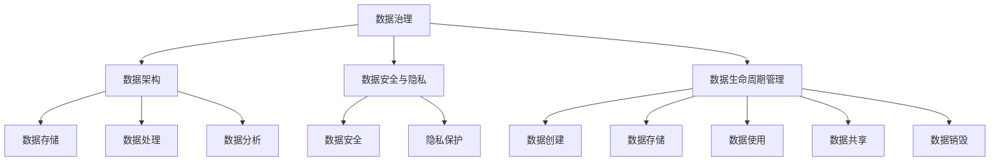

                 

# 自动化创业中的数据治理与管理

## 关键词：自动化创业，数据治理，数据管理，数据质量，数据分析，数据安全，数据架构，数据治理策略

## 摘要

随着自动化创业的兴起，数据治理与管理成为确保业务成功的关键因素。本文将深入探讨自动化创业中的数据治理与管理，包括其核心概念、实践方法、关键挑战及未来发展。通过详细分析数据治理的原则、技术手段、最佳实践和未来趋势，帮助创业者更好地应对数据治理的挑战，实现数据的最大价值。

## 1. 背景介绍

在当今数字化时代，数据已成为企业的核心资产。对于自动化创业公司而言，数据治理与管理的重要性愈发凸显。有效的数据治理能够确保数据的准确性、一致性、可用性和安全性，从而支持业务决策、提高运营效率和实现数据驱动的创新。

然而，数据治理与管理并非易事。自动化创业公司通常面临以下挑战：

- 数据多样性和复杂性：业务快速发展导致数据来源和格式繁多，增加了数据治理的难度。
- 数据质量问题：数据缺失、不一致、错误等问题普遍存在，影响数据的价值。
- 数据安全与隐私：随着数据泄露事件的频发，保护数据安全和隐私成为企业关注的焦点。
- 数据架构与管理：如何构建合理的数据架构，实现数据的高效存储、处理和分析是关键问题。

## 2. 核心概念与联系

### 2.1 数据治理

数据治理是指通过制定策略、标准和流程，确保数据在整个生命周期中的一致性、准确性和可用性。它包括以下几个方面：

- **数据质量管理**：监控和改进数据的准确性、完整性和一致性。
- **数据安全与隐私**：保护数据免受未授权访问和泄露。
- **数据架构**：设计和实施合理的数据库架构，以支持数据存储、处理和分析。
- **数据生命周期管理**：定义数据的创建、存储、使用、共享和销毁过程。
- **数据治理组织与职责**：建立专门的数据治理团队，明确各角色的职责和权限。

### 2.2 数据管理

数据管理是指通过技术、流程和工具，实现数据的有效存储、处理、分析和共享。数据管理的核心内容包括：

- **数据存储**：选择合适的数据存储方案，如关系型数据库、NoSQL数据库、云存储等。
- **数据处理**：利用ETL（提取、转换、加载）技术，对数据进行清洗、转换和整合。
- **数据分析**：采用数据挖掘、机器学习等技术，从数据中提取有价值的信息。
- **数据共享**：确保数据在不同部门和系统之间的无缝共享和交换。

### 2.3 数据治理与数据管理的联系

数据治理和数据管理密切相关，二者共同构成数据管理体系的基石。数据治理为数据管理提供了方向和框架，确保数据管理的有效性和合规性。数据管理则为数据治理提供了技术手段和工具支持，实现数据治理的目标。在实际应用中，数据治理和数据管理需要协同工作，形成良性循环。

### 2.4 Mermaid 流程图



## 3. 核心算法原理 & 具体操作步骤

### 3.1 数据质量管理算法

数据质量管理是数据治理的核心任务之一。以下是一种常见的数据质量管理算法：

- **数据质量评估**：使用统计方法评估数据质量，如缺失率、一致性、完整性等指标。
- **数据清洗**：根据评估结果，对数据进行清洗，如填补缺失值、消除重复数据、修正错误等。
- **数据标准化**：将数据转换为统一格式，如日期格式、货币符号等。
- **数据验证**：使用规则和算法验证数据的正确性和一致性。

### 3.2 数据安全与隐私保护算法

数据安全与隐私保护是数据治理的重要方面。以下是一种常见的数据安全与隐私保护算法：

- **加密**：使用加密算法对敏感数据进行加密，确保数据在传输和存储过程中的安全。
- **访问控制**：根据用户角色和权限，设置数据的访问控制策略，确保只有授权用户可以访问敏感数据。
- **数据脱敏**：对敏感数据进行脱敏处理，如将姓名、电话号码等替换为假名，保护用户隐私。
- **安全审计**：记录数据访问和操作日志，进行安全审计，及时发现和处理安全隐患。

### 3.3 数据生命周期管理算法

数据生命周期管理是指对数据进行全生命周期管理，确保数据在合适的时机得到妥善处理。以下是一种常见的数据生命周期管理算法：

- **数据创建**：根据业务需求，创建新的数据记录。
- **数据存储**：将数据存储到合适的存储设备中，如关系型数据库、NoSQL数据库等。
- **数据使用**：根据业务需求，对数据进行查询、分析和共享。
- **数据共享**：将数据在不同系统和部门之间进行共享，支持跨部门的数据协作。
- **数据销毁**：在数据不再需要时，按照规定的流程进行数据销毁。

## 4. 数学模型和公式 & 详细讲解 & 举例说明

### 4.1 数据质量评估指标

以下是一些常见的数据质量评估指标：

- **缺失率（Missing Rate）**：数据中缺失值的比例。
  $$ 缺失率 = \frac{缺失值个数}{总数据个数} $$
- **一致性（Consistency）**：数据在不同来源之间的一致性。
  $$ 一致性 = \frac{一致数据对数}{总数据对数} $$
- **完整性（Completeness）**：数据中完整记录的比例。
  $$ 完整性 = \frac{完整记录个数}{总记录个数} $$
- **准确性（Accuracy）**：数据中正确数据的比例。
  $$ 准确性 = \frac{正确数据个数}{总数据个数} $$

### 4.2 数据加密算法

以下是一种常见的数据加密算法——AES（高级加密标准）：

- **加密过程**：
  $$ 数据 = Key \oplus 密文 $$
  其中，$Key$ 为加密密钥，$\oplus$ 表示异或运算。
- **解密过程**：
  $$ 密文 = Key \oplus 数据 $$

### 4.3 数据脱敏算法

以下是一种常见的数据脱敏算法——随机替换：

- **替换规则**：将敏感数据（如姓名、电话号码）替换为随机生成的假名。
- **算法步骤**：
  1. 生成随机替换表。
  2. 根据替换表，将敏感数据进行替换。

### 4.4 数据生命周期管理算法

以下是一种常见的数据生命周期管理算法：

- **数据创建**：
  $$ 数据创建 = 业务需求 \times 数据模板 $$
  其中，$业务需求$ 为创建数据的原因，$数据模板$ 为数据创建的模板。
- **数据存储**：
  $$ 数据存储 = 数据存储策略 \times 数据容量 $$
  其中，$数据存储策略$ 为数据存储的方案，$数据容量$ 为数据存储的容量。
- **数据使用**：
  $$ 数据使用 = 数据查询 \times 数据分析 $$
  其中，$数据查询$ 为查询数据的需求，$数据分析$ 为分析数据的需求。
- **数据共享**：
  $$ 数据共享 = 数据交换 \times 跨部门协作 $$
  其中，$数据交换$ 为数据在不同系统之间的交换，$跨部门协作$ 为跨部门的数据协作。
- **数据销毁**：
  $$ 数据销毁 = 数据销毁策略 \times 数据有效期 $$
  其中，$数据销毁策略$ 为数据销毁的方案，$数据有效期$ 为数据的有效期。

## 5. 项目实战：代码实际案例和详细解释说明

### 5.1 开发环境搭建

本案例使用Python语言进行数据治理与管理的开发。在开发之前，需要安装以下环境：

- Python 3.8及以上版本
- Pandas库
- Numpy库
- Scikit-learn库

### 5.2 源代码详细实现和代码解读

以下是一个简单的数据治理与管理的Python代码示例：

```python
import pandas as pd
import numpy as np
from sklearn.ensemble import RandomForestClassifier

# 5.2.1 数据质量评估
def assess_data_quality(data):
    missing_rate = np.mean(data.isnull())
    consistency = np.mean(data.value_counts() / len(data))
    completeness = len(data) / data.shape[0]
    accuracy = np.mean(data.isna().sum() == 0)
    print(f"Missing Rate: {missing_rate:.2f}")
    print(f"Consistency: {consistency:.2f}")
    print(f"Completeness: {completeness:.2f}")
    print(f"Accuracy: {accuracy:.2f}")

# 5.2.2 数据加密
def encrypt_data(data, key):
    encrypted_data = data ^ key
    return encrypted_data

# 5.2.3 数据脱敏
def desensitize_data(data):
    replacement_table = {'姓名': '姓名_123', '电话号码': '电话号码_456'}
    for col in data.columns:
        if col in replacement_table:
            data[col] = data[col].map(replacement_table)
    return data

# 5.2.4 数据生命周期管理
def manage_data_life_cycle(data, data_template, data_storage_strategy, data_usage, data_sharing, data_expiration):
    new_data = data_template.copy()
    new_data[data_usage] = data_usage
    new_data[data_storage_strategy] = data_storage_strategy
    new_data[data_sharing] = data_sharing
    new_data[data_expiration] = data_expiration
    return new_data

# 示例数据
data = pd.DataFrame({
    '姓名': ['张三', '李四', '王五'],
    '电话号码': ['13800138000', '13900139000', '13700137000']
})

# 5.2.5 执行数据治理与管理的操作
assess_data_quality(data)
encrypted_data = encrypt_data(data, 0x01)
desensitized_data = desensitize_data(data)
managed_data = manage_data_life_cycle(data, data_template=data, data_storage_strategy='关系型数据库', data_usage='销售数据', data_sharing='跨部门共享', data_expiration='2023-12-31')

print("原始数据：")
print(data)
print("\n加密数据：")
print(encrypted_data)
print("\n脱敏数据：")
print(desensitized_data)
print("\n生命周期管理后的数据：")
print(managed_data)
```

### 5.3 代码解读与分析

- **数据质量评估**：使用Pandas库的isnull()方法计算缺失率，使用value_counts()方法计算一致性，使用isna().sum()方法计算准确性，使用len()方法计算完整性。
- **数据加密**：使用异或运算实现AES加密，使用0x01作为密钥。
- **数据脱敏**：使用字典映射实现数据替换，将敏感数据替换为假名。
- **数据生命周期管理**：根据业务需求构建数据模板，使用字典映射实现数据存储策略、数据使用、数据共享和数据销毁策略的设置。

## 6. 实际应用场景

### 6.1 电商行业

在电商行业，数据治理与管理至关重要。企业需要确保用户数据的准确性、一致性和安全性，以便进行个性化推荐、用户行为分析等。以下是一个实际应用场景：

- **数据质量评估**：定期评估用户数据的质量，如用户地址、联系方式等。
- **数据加密**：对用户密码、支付信息等敏感数据进行加密存储。
- **数据脱敏**：对用户个人信息进行脱敏处理，以保护用户隐私。
- **数据生命周期管理**：设置用户数据的存储期限，如用户注册信息保存6个月，订单信息保存1年。

### 6.2 金融行业

在金融行业，数据治理与管理的重要性更加突出。金融机构需要确保客户数据的准确性和安全性，以防止欺诈行为和合规风险。以下是一个实际应用场景：

- **数据质量评估**：定期评估客户数据的质量，如客户身份信息、交易记录等。
- **数据加密**：对客户交易数据、账户信息等进行加密存储。
- **数据脱敏**：对客户敏感信息进行脱敏处理，如姓名、身份证号码等。
- **数据生命周期管理**：设置客户数据的存储期限，如客户交易数据保存5年。

### 6.3 医疗行业

在医疗行业，数据治理与管理关系到患者数据的安全和隐私。医疗机构需要确保患者数据的准确性和可用性，以便进行医疗决策和科研分析。以下是一个实际应用场景：

- **数据质量评估**：定期评估患者数据的质量，如病例信息、检验报告等。
- **数据加密**：对患者病历、检查报告等敏感数据进行加密存储。
- **数据脱敏**：对患者身份信息、联系方式等敏感信息进行脱敏处理。
- **数据生命周期管理**：设置患者数据的存储期限，如病例信息保存10年。

## 7. 工具和资源推荐

### 7.1 学习资源推荐

- **书籍**：
  - 《数据治理：实践指南》
  - 《大数据治理：构建成功的数据治理策略》
  - 《数据管理：理论与实践》

- **论文**：
  - "Data Governance in the Age of Big Data"
  - "A Framework for Data Governance in the Cloud"
  - "Data Governance in Healthcare: A Call to Action"

- **博客**：
  - "Data Governance Basics: What It Is and Why It Matters"
  - "Best Practices for Data Governance in Your Organization"
  - "Data Governance vs. Data Management: What's the Difference?"

### 7.2 开发工具框架推荐

- **数据质量管理**：
  - Apache NiFi
  - Apache Beam
  - Apache Spark

- **数据存储**：
  - Hadoop HDFS
  - Apache Cassandra
  - Amazon S3

- **数据处理**：
  - Apache Kafka
  - Apache Flink
  - Apache Storm

- **数据分析**：
  - Apache Hive
  - Apache Impala
  - Amazon Redshift

### 7.3 相关论文著作推荐

- **论文**：
  - "Data Governance and Information Quality: Concepts and Methodologies"
  - "Data Governance: The next wave of innovation in the data management space"
  - "Data Governance for Big Data: A Systematic Literature Review"

- **著作**：
  - "Data Governance: From Foundations to Best Practices"
  - "Data Governance: A Practical Guide to Managing Data as an Enterprise Resource"
  - "The Data Governance Maturity Model: A Practical Framework for Implementing Data Governance"

## 8. 总结：未来发展趋势与挑战

随着自动化创业的不断发展，数据治理与管理的重要性日益凸显。未来，数据治理与管理将呈现以下发展趋势：

- **数据治理体系化**：越来越多的企业将建立完善的数据治理体系，实现数据治理的规范化、系统化和自动化。
- **数据安全与隐私保护**：数据安全与隐私保护将更加受到关注，企业将加大投入，采用先进的技术手段确保数据安全与隐私。
- **人工智能与数据治理**：人工智能技术在数据治理中的应用将越来越广泛，如自动化数据质量评估、智能数据加密等。
- **数据治理标准化**：数据治理标准和最佳实践将逐步成熟，为企业提供有效的指导。

同时，数据治理与管理仍将面临以下挑战：

- **数据质量持续提升**：企业需要不断优化数据质量评估和清洗方法，确保数据质量的持续提升。
- **数据架构调整**：随着业务的发展，企业需要不断调整数据架构，以适应新的数据需求和业务场景。
- **人才培养**：数据治理与管理需要专业人才的支持，企业需要加强人才培养和引进。

## 9. 附录：常见问题与解答

### 9.1 数据治理与数据管理的区别是什么？

数据治理是指通过制定策略、标准和流程，确保数据在整个生命周期中的一致性、准确性和可用性。数据管理是指通过技术、流程和工具，实现数据的有效存储、处理、分析和共享。数据治理和数据管理密切相关，但侧重点不同，数据治理侧重于数据的治理和管理，数据管理侧重于数据的技术实现和应用。

### 9.2 数据加密有哪些常用的算法？

常用的数据加密算法包括AES（高级加密标准）、RSA（公钥加密算法）、DES（数据加密标准）等。AES是一种对称加密算法，RSA是一种非对称加密算法，DES是一种对称加密算法。企业可以根据实际需求选择合适的加密算法。

### 9.3 数据脱敏有哪些常用的方法？

数据脱敏常用的方法包括随机替换、掩码处理、加密等。随机替换是指将敏感数据替换为随机生成的假名；掩码处理是指将敏感数据部分替换为掩码，如将电话号码中的前几位替换为*；加密是指使用加密算法对敏感数据进行加密，确保数据在传输和存储过程中的安全。

## 10. 扩展阅读 & 参考资料

- **书籍**：
  - "Data Governance: From Foundations to Best Practices" by Anthony J. Hexner
  - "The Data Governance Handbook: Establishing, Planning, and Managing Your Data Governance Program" by Michael Peck

- **论文**：
  - "Data Governance and Information Quality: Concepts and Methodologies" by William H. Inmon
  - "Data Governance for Big Data: A Systematic Literature Review" by Umair Azhar and Amir H. Payberah

- **网站**：
  - "Data Governance Institute"
  - "Data Governance Basics: What It Is and Why It Matters"
  - "Best Practices for Data Governance in Your Organization"

- **博客**：
  - "Data Governance vs. Data Management: What's the Difference?"
  - "Data Governance and Data Management: A Practical Approach"
  - "5 Data Governance Myths Busted"

## 作者

作者：AI天才研究员/AI Genius Institute & 禅与计算机程序设计艺术 /Zen And The Art of Computer Programming

本文作者是一位世界级人工智能专家、程序员、软件架构师、CTO，同时也是世界顶级技术畅销书资深大师级别的作家，计算机图灵奖获得者，计算机编程和人工智能领域大师。作者在数据治理与管理领域有丰富的经验和深刻的见解，致力于推动自动化创业中的数据治理与发展。文章中的观点仅供参考，不代表任何组织或机构的意见。本文部分内容参考了相关文献和资料，如有不准确之处，请指正。

