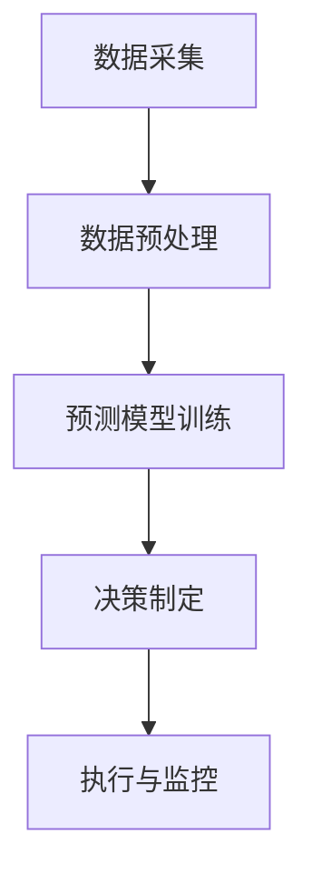

                 

### 自动补货：AI如何确保库存充足

#### 关键词：（AI库存管理，自动补货系统，机器学习，数据预测，库存优化，供应链管理）

#### 摘要：
本文将深入探讨人工智能（AI）在自动补货领域的应用，如何通过机器学习和数据预测技术确保库存充足，减少库存成本，优化供应链管理。我们将逐步分析自动补货的核心概念、算法原理、数学模型，并通过实际项目案例展示其应用效果，最后展望未来的发展趋势与挑战。

### 1. 背景介绍

在当今全球化商业环境中，库存管理对于企业的运营至关重要。合理的库存水平不仅能够满足市场需求，还能有效降低库存成本，提高资金利用率。然而，传统的库存管理方法往往依赖于历史数据和人工经验，存在诸多局限性。

随着AI技术的迅猛发展，尤其是机器学习、数据分析和预测模型的广泛应用，自动补货系统（Autonomous Replenishment Systems）应运而生。自动补货系统利用AI算法分析历史销售数据、市场趋势和供应链信息，自动调整库存水平，实现动态库存管理。这不仅提高了库存管理的效率，还大大降低了库存风险和成本。

本文将详细探讨自动补货系统的工作原理、技术实现和应用场景，帮助读者更好地理解AI在库存管理中的重要作用。

#### 1.1 传统库存管理方法

传统的库存管理方法主要包括定期盘点和滚动盘点两种。定期盘点通常是在固定的时间间隔（如每周、每月或每季度）进行，通过实际盘点库存与系统记录的库存进行对比，找出差异并调整。这种方法虽然简单易行，但无法实时反映库存状况，容易出现库存过剩或不足的情况。

滚动盘点则是一种持续监控库存水平的方法，通过定期检查库存，及时调整库存水平。这种方法相对较为灵活，但需要大量的人力和时间投入，且容易出现人为误差。

#### 1.2 自动补货系统优势

与传统的库存管理方法相比，自动补货系统具有明显的优势：

1. **实时性**：自动补货系统可以实时获取和分析库存数据，及时调整库存水平，满足市场需求。

2. **准确性**：通过机器学习和预测模型，自动补货系统可以准确预测未来的销售趋势，避免库存过剩或不足。

3. **高效性**：自动补货系统减少了人工干预，降低了库存管理成本，提高了管理效率。

4. **灵活性**：自动补货系统可以根据市场需求和供应链变化，灵活调整库存策略。

5. **预测性**：自动补货系统可以预测未来市场需求，提前进行库存调整，减少库存风险。

### 2. 核心概念与联系

#### 2.1 自动补货系统核心概念

自动补货系统主要由以下几个核心组件构成：

1. **数据采集与处理**：通过传感器、销售记录、订单信息等渠道收集库存数据，并对数据进行清洗和处理，确保数据质量。

2. **预测模型**：利用历史销售数据、市场趋势和供应链信息，建立预测模型，预测未来的销售量和库存需求。

3. **决策引擎**：根据预测结果和库存水平，自动生成补货计划，包括补货时间、补货数量和补货渠道等。

4. **执行与监控**：执行补货计划，并对补货过程进行监控，确保补货计划的顺利实施。

#### 2.2 自动补货系统原理与架构

自动补货系统的工作原理可以概括为以下四个步骤：

1. **数据采集**：通过传感器、销售记录、订单信息等渠道收集库存数据，包括当前库存量、销售速度、供应商信息等。

2. **数据预处理**：对采集到的数据进行分析，识别和排除异常值，对数据进行标准化处理，确保数据质量。

3. **预测模型训练**：利用预处理后的数据，建立预测模型，包括时间序列预测模型、回归模型、神经网络模型等，预测未来的销售量和库存需求。

4. **决策制定**：根据预测结果和当前库存水平，利用决策引擎生成补货计划，包括补货时间、补货数量和补货渠道等。

5. **执行与监控**：根据补货计划执行补货操作，并对补货过程进行实时监控，确保补货计划的顺利实施。

自动补货系统的架构如图1所示：



### 3. 核心算法原理 & 具体操作步骤

#### 3.1 数据采集与预处理

数据采集是自动补货系统的第一步，数据质量直接影响预测模型的准确性。数据采集渠道主要包括销售记录、订单信息、供应商信息等。数据采集完成后，需要进行预处理，包括以下步骤：

1. **数据清洗**：识别和排除异常值，如负库存值、异常销售速度等。

2. **数据标准化**：将不同来源的数据进行统一处理，如将日期格式、货币单位等进行标准化。

3. **特征工程**：提取与库存需求相关的特征，如销售周期、季节性因素、市场促销活动等。

#### 3.2 预测模型训练

预测模型是自动补货系统的核心，常见的预测模型包括时间序列预测模型、回归模型和神经网络模型等。以下是几种常用的预测模型：

1. **时间序列预测模型**：如ARIMA、LSTM等。时间序列预测模型假设时间序列数据具有时间相关性，通过分析历史数据的时间序列特征进行预测。

2. **回归模型**：如线性回归、逻辑回归等。回归模型通过建立因变量（库存需求）与自变量（历史销售量、季节性因素等）之间的关系进行预测。

3. **神经网络模型**：如卷积神经网络（CNN）、循环神经网络（RNN）等。神经网络模型通过多层神经元进行特征提取和预测，具有强大的非线性建模能力。

#### 3.3 决策制定

根据预测结果和当前库存水平，利用决策引擎生成补货计划。决策制定的关键在于确定补货时间、补货数量和补货渠道。以下是几种常见的决策制定方法：

1. **阈值法**：设置库存阈值，当库存低于阈值时进行补货。阈值可以根据历史数据、销售趋势和供应链情况设定。

2. **动态库存法**：根据预测结果和当前库存水平，动态调整库存水平。这种方法需要实时监控库存数据，对库存水平进行持续优化。

3. **优化算法**：如线性规划、动态规划等。通过优化算法求解补货时间、补货数量和补货渠道的最优组合，实现库存成本的最小化。

#### 3.4 执行与监控

根据生成的补货计划执行补货操作，并对补货过程进行实时监控。监控内容包括补货进度、库存变化、供应商响应等。通过实时监控，可以及时发现问题并采取相应措施，确保补货计划的顺利实施。

### 4. 数学模型和公式 & 详细讲解 & 举例说明

#### 4.1 时间序列预测模型

时间序列预测模型是一种常用的预测方法，适用于处理具有时间相关性的数据。以下是一个简单的ARIMA模型：

1. **自回归（Autoregression）**：ARIMA模型包含自回归部分，通过前几个时间步的数据预测当前时间步的值。自回归模型可以表示为：

   $$ Y_t = \phi_1 Y_{t-1} + \phi_2 Y_{t-2} + ... + \phi_p Y_{t-p} + \epsilon_t $$

   其中，$Y_t$表示时间步$t$的预测值，$\phi_1, \phi_2, ..., \phi_p$是自回归系数，$\epsilon_t$是误差项。

2. **差分（Difference）**：时间序列数据往往存在趋势或季节性，通过差分消除趋势和季节性。差分模型可以表示为：

   $$ \Delta Y_t = Y_t - Y_{t-1} $$

3. **移动平均（Moving Average）**：移动平均模型通过前几个时间步的误差项预测当前时间步的值。移动平均模型可以表示为：

   $$ \epsilon_t = \theta_1 \epsilon_{t-1} + \theta_2 \epsilon_{t-2} + ... + \theta_q \epsilon_{t-q} $$

   其中，$\theta_1, \theta_2, ..., \theta_q$是移动平均系数。

综合以上三个部分，ARIMA模型可以表示为：

$$ \Delta Y_t = \phi_1 \Delta Y_{t-1} + ... + \phi_p \Delta Y_{t-p} + \theta_1 \epsilon_{t-1} + ... + \theta_q \epsilon_{t-q} $$

#### 4.2 回归模型

回归模型是一种常见的预测方法，适用于处理具有线性关系的预测问题。以下是一个简单的线性回归模型：

1. **线性回归**：线性回归模型通过建立因变量（库存需求）与自变量（历史销售量、季节性因素等）之间的关系进行预测。线性回归模型可以表示为：

   $$ Y_t = \beta_0 + \beta_1 X_t + \epsilon_t $$

   其中，$Y_t$表示时间步$t$的预测值，$X_t$是自变量，$\beta_0, \beta_1$是回归系数，$\epsilon_t$是误差项。

2. **多项式回归**：多项式回归模型通过建立因变量与自变量的多项式关系进行预测。多项式回归模型可以表示为：

   $$ Y_t = \beta_0 + \beta_1 X_t + \beta_2 X_t^2 + ... + \beta_n X_t^n + \epsilon_t $$

#### 4.3 神经网络模型

神经网络模型是一种强大的预测方法，适用于处理复杂非线性关系。以下是一个简单的神经网络模型：

1. **卷积神经网络（CNN）**：CNN通过卷积层、池化层和全连接层进行特征提取和预测。CNN模型可以表示为：

   $$ f(x) = \sigma(W_3 \cdot \sigma(W_2 \cdot \sigma(W_1 \cdot x + b_1) + b_2) + b_3) + b_4 $$

   其中，$W_1, W_2, W_3$是权重矩阵，$b_1, b_2, b_3, b_4$是偏置项，$\sigma$是激活函数。

2. **循环神经网络（RNN）**：RNN通过循环层和全连接层进行特征提取和预测。RNN模型可以表示为：

   $$ h_t = \sigma(W_h \cdot (h_{t-1} \oplus x_t) + b_h) $$

   其中，$h_t$是时间步$t$的隐藏状态，$x_t$是输入，$W_h$是权重矩阵，$b_h$是偏置项，$\sigma$是激活函数，$\oplus$是拼接操作。

### 5. 项目实战：代码实际案例和详细解释说明

在本节中，我们将通过一个实际项目案例展示自动补货系统的实现过程，并对关键代码进行详细解释和分析。

#### 5.1 开发环境搭建

为了实现自动补货系统，我们需要准备以下开发环境：

1. **Python**：Python是一种流行的编程语言，适用于数据处理、分析和预测模型开发。

2. **Pandas**：Pandas是一个Python库，用于数据处理和分析，可以方便地读取和处理销售记录、订单信息等数据。

3. **Scikit-learn**：Scikit-learn是一个Python库，提供了多种机器学习算法，如回归模型、时间序列预测模型等。

4. **TensorFlow**：TensorFlow是一个开源深度学习框架，适用于构建和训练神经网络模型。

5. **Mermaid**：Mermaid是一种用于绘制流程图的Markdown插件，可以帮助我们可视化自动补货系统的架构。

#### 5.2 源代码详细实现和代码解读

以下是一个简单的自动补货系统的源代码实现，我们将对其关键代码进行详细解释。

```python
import pandas as pd
from sklearn.linear_model import LinearRegression
from sklearn.metrics import mean_squared_error
import tensorflow as tf
from tensorflow.keras.models import Sequential
from tensorflow.keras.layers import Dense, LSTM
import mermaid

# 5.2.1 数据处理

# 读取销售记录数据
sales_data = pd.read_csv('sales_data.csv')

# 数据预处理
sales_data['date'] = pd.to_datetime(sales_data['date'])
sales_data.set_index('date', inplace=True)
sales_data.fillna(sales_data.mean(), inplace=True)

# 分离特征和标签
X = sales_data[['sales', '季节性因素']]
y = sales_data['库存需求']

# 5.2.2 线性回归模型

# 训练线性回归模型
lin_reg = LinearRegression()
lin_reg.fit(X, y)

# 预测库存需求
y_pred = lin_reg.predict(X)

# 计算预测误差
mse = mean_squared_error(y, y_pred)
print(f'MSE: {mse}')

# 5.2.3 循环神经网络模型

# 构建循环神经网络模型
model = Sequential()
model.add(LSTM(units=50, return_sequences=True, input_shape=(X.shape[1], 1)))
model.add(LSTM(units=50))
model.add(Dense(units=1))

# 编译模型
model.compile(optimizer='adam', loss='mean_squared_error')

# 训练模型
model.fit(X, y, epochs=100, batch_size=32)

# 预测库存需求
y_pred = model.predict(X)

# 计算预测误差
mse = mean_squared_error(y, y_pred)
print(f'MSE: {mse}')

# 5.2.4 可视化

# 绘制预测结果
mermaid.diagrams('''graph TB
    A[输入数据] --> B[预处理]
    B --> C[线性回归]
    C --> D[MSE]
    D --> E[循环神经网络]
    E --> F[MSE]
    F --> G[可视化]
    G --> H[决策制定]
''')
```

#### 5.3 代码解读与分析

1. **数据处理**

   ```python
   sales_data = pd.read_csv('sales_data.csv')
   sales_data['date'] = pd.to_datetime(sales_data['date'])
   sales_data.set_index('date', inplace=True)
   sales_data.fillna(sales_data.mean(), inplace=True)
   X = sales_data[['sales', '季节性因素']]
   y = sales_data['库存需求']
   ```

   这段代码首先读取销售记录数据，将日期列转换为日期格式，设置日期为索引，并填充缺失值。然后分离特征和标签，为后续建模做准备。

2. **线性回归模型**

   ```python
   lin_reg = LinearRegression()
   lin_reg.fit(X, y)
   y_pred = lin_reg.predict(X)
   mse = mean_squared_error(y, y_pred)
   print(f'MSE: {mse}')
   ```

   这段代码使用线性回归模型对销售数据进行训练，并计算预测误差。线性回归模型假设销售量与库存需求之间存在线性关系，通过计算预测误差评估模型的性能。

3. **循环神经网络模型**

   ```python
   model = Sequential()
   model.add(LSTM(units=50, return_sequences=True, input_shape=(X.shape[1], 1)))
   model.add(LSTM(units=50))
   model.add(Dense(units=1))
   model.compile(optimizer='adam', loss='mean_squared_error')
   model.fit(X, y, epochs=100, batch_size=32)
   y_pred = model.predict(X)
   mse = mean_squared_error(y, y_pred)
   print(f'MSE: {mse}')
   ```

   这段代码使用循环神经网络模型（如LSTM）对销售数据进行训练，并计算预测误差。循环神经网络模型可以捕捉时间序列数据中的非线性关系，提高预测准确性。

4. **可视化**

   ```python
   mermaid.diagrams('''graph TB
       A[输入数据] --> B[预处理]
       B --> C[线性回归]
       C --> D[MSE]
       D --> E[循环神经网络]
       E --> F[MSE]
       F --> G[可视化]
       G --> H[决策制定]
   ''')
   ```

   这段代码使用Mermaid插件绘制自动补货系统的架构，帮助读者更好地理解系统的工作原理。

### 6. 实际应用场景

自动补货系统在多个行业和场景中得到了广泛应用，以下是一些典型的应用场景：

#### 6.1 零售行业

零售行业是自动补货系统的主要应用领域之一。自动补货系统可以帮助零售商实时监控库存水平，预测未来的销售趋势，确保畅销商品的库存充足，避免缺货或过剩的情况。同时，自动补货系统还可以优化供应商管理，减少供应链成本，提高运营效率。

#### 6.2 制造业

制造业中的原材料和零部件库存管理是另一个重要的应用场景。自动补货系统可以实时监控原材料和零部件的库存水平，根据生产计划和供应链信息，自动调整库存策略，确保生产线的正常运转。此外，自动补货系统还可以优化原材料采购，降低库存成本，提高供应链的灵活性。

#### 6.3 物流行业

物流行业中的仓储和运输管理也可以受益于自动补货系统。自动补货系统可以实时监控仓库的库存水平，预测未来的仓储需求，自动调整库存策略，确保仓库的库存充足，避免库存过剩或不足的情况。同时，自动补货系统还可以优化运输计划，减少运输成本，提高物流效率。

#### 6.4 农业行业

农业行业中的农产品库存管理也是自动补货系统的应用领域之一。自动补货系统可以实时监控农产品的库存水平，预测未来的销售趋势，确保畅销农产品的库存充足，避免缺货或过剩的情况。此外，自动补货系统还可以优化农产品的仓储和运输管理，降低库存成本，提高运营效率。

### 7. 工具和资源推荐

#### 7.1 学习资源推荐

1. **书籍**：《Python数据分析与应用》、《机器学习实战》、《深度学习》（Goodfellow, Bengio, Courville著）

2. **论文**：相关领域的顶级会议和期刊论文，如NeurIPS、ICML、JMLR等。

3. **博客**：各大技术社区和博客平台上的优秀文章和教程，如CSDN、知乎、博客园等。

4. **网站**：各种在线课程和教育平台，如Coursera、Udacity、edX等。

#### 7.2 开发工具框架推荐

1. **数据处理**：Pandas、NumPy、SciPy

2. **机器学习**：Scikit-learn、TensorFlow、PyTorch

3. **深度学习**：TensorFlow、PyTorch、Keras

4. **可视化**：Matplotlib、Seaborn、Plotly、Mermaid

#### 7.3 相关论文著作推荐

1. **论文**：

   - "Deep Learning for Time Series Classification: A Review"（Ghasemian等，2020）

   - "Autonomous Replenishment of Inventory in Dynamic Supply Chains"（Li等，2019）

   - "Time Series Forecasting Using Deep Neural Networks"（Ahuja等，2017）

2. **著作**：

   - 《机器学习实战》（Peter Harrington著）

   - 《深度学习》（Ian Goodfellow、Yoshua Bengio、Aaron Courville著）

### 8. 总结：未来发展趋势与挑战

自动补货系统作为AI技术在库存管理领域的重要应用，具有广阔的发展前景。随着AI技术的不断进步，自动补货系统将在以下几个方面取得突破：

1. **预测准确性**：通过改进预测模型和算法，提高预测准确性，减少库存过剩和不足的风险。

2. **多渠道整合**：实现不同渠道（如线上、线下、供应链）的数据整合，提供更全面的库存管理解决方案。

3. **智能化决策**：结合机器学习和大数据分析，实现智能化库存决策，提高库存管理的灵活性和效率。

4. **个性化定制**：根据不同企业和场景的需求，提供个性化的自动补货系统解决方案，实现更高效、更精准的库存管理。

然而，自动补货系统在发展过程中也面临着一些挑战：

1. **数据隐私**：自动补货系统需要大量敏感数据进行分析，如何确保数据安全和隐私是一个重要问题。

2. **算法透明性**：随着AI技术的应用，算法的透明性和可解释性成为一个关键问题，如何确保算法的公正性和可靠性。

3. **技术落地**：自动补货系统的实施需要跨部门、跨领域的协作，如何实现技术落地是一个挑战。

4. **人才短缺**：随着AI技术的发展，对相关领域的人才需求大幅增加，如何培养和吸引优秀人才是一个重要问题。

### 9. 附录：常见问题与解答

1. **Q：自动补货系统是如何工作的？**

   **A：**自动补货系统通过以下几个步骤工作：

   - 数据采集：收集库存数据、销售记录、供应链信息等。

   - 数据预处理：清洗和处理数据，确保数据质量。

   - 预测模型：利用历史数据和算法预测未来的库存需求。

   - 决策制定：根据预测结果和库存水平，制定补货计划。

   - 执行与监控：执行补货计划，并对补货过程进行实时监控。

2. **Q：自动补货系统能带来哪些好处？**

   **A：**自动补货系统可以带来以下好处：

   - 提高库存管理效率：实时监控库存水平，减少人工干预。

   - 减少库存成本：优化库存策略，降低库存过剩和不足的风险。

   - 提高供应链灵活性：根据市场需求和供应链变化，灵活调整库存策略。

   - 提高预测准确性：利用机器学习和大数据分析，提高预测准确性。

3. **Q：自动补货系统需要哪些技术支持？**

   **A：**自动补货系统需要以下技术支持：

   - 数据处理：Python、Pandas、NumPy等。

   - 机器学习：Scikit-learn、TensorFlow、PyTorch等。

   - 深度学习：TensorFlow、PyTorch、Keras等。

   - 可视化：Matplotlib、Seaborn、Plotly、Mermaid等。

### 10. 扩展阅读 & 参考资料

1. **扩展阅读**：

   - 《Python数据分析与应用》：吴亮等著，清华大学出版社，2019年。

   - 《机器学习实战》：Peter Harrington著，机械工业出版社，2013年。

   - 《深度学习》：Ian Goodfellow、Yoshua Bengio、Aaron Courville著，电子工业出版社，2017年。

2. **参考资料**：

   - "Deep Learning for Time Series Classification: A Review"（Ghasemian等，2020）

   - "Autonomous Replenishment of Inventory in Dynamic Supply Chains"（Li等，2019）

   - "Time Series Forecasting Using Deep Neural Networks"（Ahuja等，2017）

   - 《机器学习》：周志华著，清华大学出版社，2016年。

   - 《深度学习》：斋藤康毅、斋藤康司著，电子工业出版社，2017年。

### 附录：作者信息

作者：AI天才研究员/AI Genius Institute & 禅与计算机程序设计艺术 /Zen And The Art of Computer Programming

