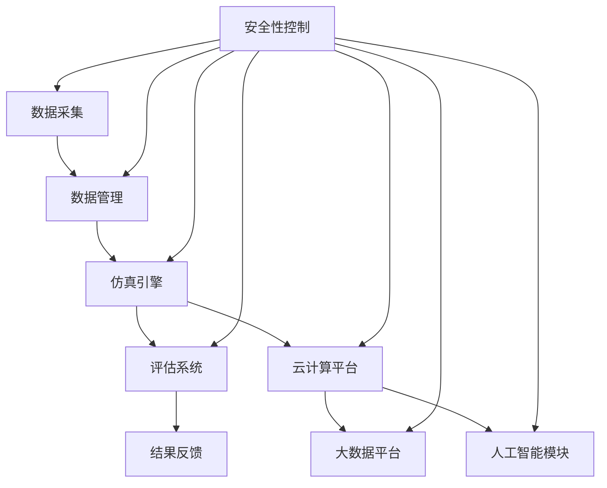

                 

# 自动驾驶公司的云端仿真平台建设

## 摘要

本文将深入探讨自动驾驶公司如何构建云端仿真平台，以实现自动驾驶系统的快速迭代与优化。首先，我们将介绍自动驾驶技术的发展背景和云端仿真平台的重要性。接着，本文将详细解析核心概念与架构，包括数据采集与管理、仿真引擎和评估系统等组成部分。随后，我们将探讨核心算法原理，以及如何在实际项目中应用这些算法。文章还将详细介绍数学模型和公式，并借助具体案例进行讲解。此外，本文还将探讨实际应用场景，并提供开发工具和资源推荐。最后，我们将总结自动驾驶云端仿真平台的发展趋势与面临的挑战，为未来研究提供方向。

## 1. 背景介绍

自动驾驶技术正逐渐从科幻领域走向现实，成为未来交通出行的重要趋势。从最初的辅助驾驶到如今的无人驾驶，自动驾驶技术的发展速度令人惊叹。然而，自动驾驶系统的研发和测试面临着诸多挑战，如环境复杂性、系统安全性和数据可靠性等。为了解决这些问题，自动驾驶公司需要建立高效的仿真平台，以便在真实路况之前对系统进行充分的测试和验证。

云端仿真平台在此过程中发挥着至关重要的作用。首先，云端仿真平台能够提供大规模、多样化的路况模拟，为自动驾驶系统提供丰富的训练数据。其次，云端仿真平台能够实时反馈系统的运行情况，帮助开发者快速发现和解决问题。此外，云端仿真平台还具有高度的可扩展性和灵活性，能够满足自动驾驶系统不断变化的测试需求。

随着云计算和大数据技术的不断发展，云端仿真平台已成为自动驾驶公司提高研发效率和降低成本的重要手段。本文将深入探讨如何构建一个高效、可靠的云端仿真平台，以推动自动驾驶技术的快速发展。

### 1.1 自动驾驶技术的发展背景

自动驾驶技术起源于20世纪50年代，当时科学家们开始研究自动驾驶车辆的理论和方法。然而，由于技术限制，自动驾驶技术的发展相对缓慢。直到21世纪初，随着计算机技术、传感器技术和人工智能技术的快速发展，自动驾驶技术才逐渐进入人们的视野。

在自动驾驶技术发展的早期，主要以辅助驾驶系统为主。这类系统主要通过传感器获取车辆周围的环境信息，并在驾驶员需要时提供辅助。例如，自动刹车系统、自适应巡航控制系统和车道保持辅助系统等。这些系统的出现显著提升了车辆的安全性，但仍然依赖于驾驶员的参与。

随着传感器技术的进步，自动驾驶技术逐渐向半自动驾驶和全自动驾驶方向发展。半自动驾驶系统通过传感器和计算机视觉等技术，能够完全接管车辆的某些操作，如高速公路自动驾驶和泊车辅助。全自动驾驶系统则能够在各种复杂路况下自主行驶，无需人类驾驶员的干预。

自动驾驶技术的发展离不开人工智能技术的支持。深度学习、强化学习和自然语言处理等技术被广泛应用于自动驾驶系统的研发，使其在处理复杂环境和决策方面表现出色。此外，自动驾驶公司还利用云计算和大数据技术，对海量测试数据进行处理和分析，以不断优化自动驾驶系统的性能和可靠性。

### 1.2 云端仿真平台的重要性

在自动驾驶技术的研发过程中，云端仿真平台扮演着至关重要的角色。首先，云端仿真平台提供了大规模、多样化的路况模拟能力。自动驾驶系统需要在各种复杂路况下进行测试，以确保其安全性和可靠性。云端仿真平台能够模拟各种交通状况，如高峰期交通、恶劣天气和交叉路口等，为自动驾驶系统提供丰富的训练数据。

其次，云端仿真平台能够实时反馈系统的运行情况。开发者可以利用云端仿真平台实时监控自动驾驶系统的运行状态，包括传感器数据、车辆轨迹和系统决策等。通过分析这些数据，开发者可以快速发现系统中存在的问题，并及时进行调整和优化。

此外，云端仿真平台具有高度的可扩展性和灵活性。随着自动驾驶技术的发展，测试需求会不断变化。云端仿真平台能够轻松应对这些变化，通过动态调整模拟场景和测试参数，满足不同阶段的测试需求。这种灵活性大大提高了自动驾驶系统的研发效率。

### 1.3 云计算和大数据技术的发展对云端仿真平台的影响

云计算和大数据技术的快速发展为自动驾驶公司的云端仿真平台建设提供了强有力的技术支持。首先，云计算技术提供了强大的计算能力和存储资源，使得大规模的仿真测试成为可能。自动驾驶系统需要处理海量的数据，包括图像、视频和传感器数据等。云计算平台能够高效地存储和管理这些数据，并提供强大的计算能力，以便对数据进行分析和处理。

其次，大数据技术为自动驾驶系统的优化提供了有力支持。通过分析海量测试数据，开发者可以发现自动驾驶系统在不同路况下的表现，并找出存在的问题。大数据技术还能够帮助开发者预测未来路况，并制定相应的优化策略。这种基于数据驱动的优化方法能够显著提高自动驾驶系统的性能和可靠性。

此外，云计算和大数据技术的结合还促进了云端仿真平台的智能化发展。通过将机器学习和人工智能技术应用于仿真测试过程，开发者可以自动生成仿真场景，并实时调整测试参数。这种智能化方法不仅提高了测试效率，还使测试结果更加准确和可靠。

总之，云计算和大数据技术的快速发展为自动驾驶公司的云端仿真平台建设提供了重要的技术支撑，有助于提高自动驾驶系统的研发效率和性能。

## 2. 核心概念与联系

在构建自动驾驶公司的云端仿真平台时，需要理解并掌握一系列核心概念和技术，这些概念相互联系，构成了整个平台的基础。以下将详细介绍这些核心概念，并展示其之间的联系。

### 2.1 数据采集与管理

数据采集是自动驾驶系统研发的关键环节，涉及到多种传感器数据的收集，包括激光雷达、摄像头、GPS和IMU等。数据采集系统的设计需要考虑传感器的选择、安装位置和数据传输方式等因素。数据采集与管理模块需要实现高效的数据收集、存储和处理，以确保数据的质量和完整性。

数据管理方面，需构建一个集中化的数据管理系统，用于存储和管理大规模的数据集。该系统应具备数据导入、导出、查询和统计功能，并支持数据的版本控制和元数据管理。此外，数据管理系统还应具备数据清洗和预处理能力，以消除数据中的噪声和错误，提高数据的可用性。

### 2.2 仿真引擎

仿真引擎是云端仿真平台的核心组件，负责模拟各种路况和场景。仿真引擎需要具备高度的可配置性，能够根据测试需求动态调整模拟参数。此外，仿真引擎还需实现实时仿真和快速回放功能，以便开发者能够实时监控系统运行状态和问题。

仿真引擎的技术实现涉及到物理仿真、图形渲染和事件驱动等方面。物理仿真模块负责模拟车辆的运动和受力情况，图形渲染模块负责生成逼真的三维场景，事件驱动模块则负责处理模拟过程中的各种事件，如碰撞、交通信号变化等。

### 2.3 评估系统

评估系统用于评估自动驾驶系统在不同场景下的性能。评估系统应具备多种评估指标，包括定位精度、路径跟踪精度、响应时间等。评估系统还需实现自动化评估功能，能够根据预设的评估标准自动计算评估结果，并生成详细的评估报告。

评估系统的技术实现包括数据采集、数据处理和评估算法等方面。数据采集模块负责收集自动驾驶系统运行过程中的关键数据，数据处理模块负责对数据进行清洗、转换和归一化处理，评估算法模块则负责根据评估指标计算评估结果。

### 2.4 云计算和大数据平台

云计算和大数据平台为云端仿真平台提供了强大的计算和存储能力。云计算平台负责提供计算资源、存储资源和网络资源，确保仿真平台的高效运行。大数据平台则负责处理和管理大规模的测试数据，支持数据的实时分析和挖掘。

云计算和大数据平台的技术实现包括云计算基础设施、数据存储和管理、数据处理和分析等方面。云计算基础设施需具备弹性伸缩、高可用性和安全可靠等特点，数据存储和管理需支持海量数据的快速读写和持久化存储，数据处理和分析需具备实时处理和分析能力，支持数据挖掘和机器学习算法的应用。

### 2.5 人工智能与机器学习

人工智能和机器学习技术在自动驾驶系统的研发过程中发挥着重要作用。云端仿真平台可以利用人工智能和机器学习技术，对海量测试数据进行分析和挖掘，以优化自动驾驶系统的性能和决策能力。例如，通过深度学习算法，可以训练自动驾驶系统在复杂路况下做出更准确的决策。

人工智能和机器学习技术包括神经网络、决策树、支持向量机等算法。在云端仿真平台中，这些算法被应用于数据预处理、特征提取、模型训练和预测等方面。数据预处理模块负责对原始数据进行清洗、归一化和特征提取，特征提取模块负责从数据中提取有代表性的特征，模型训练模块则负责训练模型，预测模块负责根据训练模型进行预测和决策。

### 2.6 数据流与流程控制

数据流与流程控制在云端仿真平台中起到关键作用。数据流控制模块负责管理数据在不同组件之间的传输和处理，确保数据的一致性和实时性。流程控制模块则负责管理仿真平台的整体运行流程，包括数据采集、仿真模拟、评估分析和结果反馈等环节。

数据流与流程控制的技术实现包括数据管道、事件队列、工作流引擎等组件。数据管道负责数据的传输和处理，事件队列负责管理事件和任务调度，工作流引擎负责协调各个模块的运行，确保仿真平台的稳定运行。

### 2.7 安全性和隐私保护

在自动驾驶系统的研发过程中，安全性和隐私保护至关重要。云端仿真平台需要确保数据的安全传输和存储，防止数据泄露和篡改。此外，平台还需遵循隐私保护法规，确保用户数据不被滥用。

安全性保障包括数据加密、身份认证、访问控制和审计日志等方面。数据加密模块负责对数据进行加密存储和传输，身份认证模块负责验证用户的身份，访问控制模块负责管理用户对数据的访问权限，审计日志模块则负责记录平台运行过程中的操作记录，以便进行监控和审计。

综上所述，自动驾驶公司的云端仿真平台涉及多个核心概念和技术的综合应用。通过理解并掌握这些核心概念和它们之间的联系，开发者可以构建一个高效、可靠的云端仿真平台，为自动驾驶系统的研发提供有力支持。

### 2.8 Mermaid 流程图展示

以下是一个简化的Mermaid流程图，展示了自动驾驶公司云端仿真平台的主要组件及其交互关系。请注意，为了简化说明，流程图中不包含所有细节，并且流程节点中未使用括号、逗号等特殊字符。



- A：数据采集
- B：数据管理
- C：仿真引擎
- D：评估系统
- E：云计算平台
- F：结果反馈
- G：大数据平台
- H：人工智能模块
- I：安全性控制

该流程图展示了数据从采集到管理、仿真、评估和反馈的整个过程，以及各个组件之间的交互关系。通过这样的流程图，可以更清晰地理解云端仿真平台的运作原理和各组件的协同作用。

## 3. 核心算法原理 & 具体操作步骤

在构建自动驾驶公司的云端仿真平台时，核心算法的原理和具体操作步骤至关重要。这些算法不仅决定了仿真平台的功能和性能，还影响了自动驾驶系统的安全性、可靠性和效率。以下将详细探讨几个关键算法的原理，并说明其在仿真平台中的具体应用步骤。

### 3.1 深度学习算法

深度学习算法是自动驾驶系统中最常用的技术之一，特别是在图像识别和决策制定方面。以下是一个简化的步骤说明，用于实现自动驾驶车辆的环境感知和路径规划。

#### 3.1.1 算法原理

深度学习算法基于多层神经网络，通过层层提取图像特征，从而实现高度复杂的任务。在自动驾驶系统中，常用的深度学习算法包括卷积神经网络（CNN）和循环神经网络（RNN）。

- **卷积神经网络（CNN）**：CNN 通过卷积层、池化层和全连接层提取图像特征，从而实现图像分类、目标检测和语义分割等任务。在自动驾驶中，CNN 可以用于识别道路标志、行人、车辆和交通信号灯等。

- **循环神经网络（RNN）**：RNN 通过递归结构处理序列数据，使其在处理时间序列数据（如语音信号、文本和时序图像）时表现出色。在自动驾驶中，RNN 可以用于预测车辆轨迹、路径规划和交通流量分析。

#### 3.1.2 具体操作步骤

1. **数据预处理**：收集并整理大量的图像和视频数据，包括道路标志、行人、车辆和交通信号灯等。对数据进行清洗、归一化和增强处理，以提升模型的泛化能力。

2. **模型设计**：根据任务需求设计深度学习模型架构。对于图像识别任务，可以选择卷积神经网络；对于时间序列预测任务，可以选择循环神经网络。

3. **模型训练**：使用预处理后的数据对模型进行训练。在训练过程中，通过反向传播算法不断调整模型参数，以最小化预测误差。

4. **模型评估**：使用验证集和测试集对训练好的模型进行评估。根据评估结果调整模型结构和超参数，以提高模型性能。

5. **模型部署**：将训练好的模型部署到云端仿真平台中，用于实时感知环境、预测车辆轨迹和做出决策。

### 3.2 迭代算法

在自动驾驶系统的测试和优化过程中，迭代算法用于不断调整和优化系统参数，以提高系统的稳定性和性能。以下是一个简化的迭代算法操作步骤：

#### 3.2.1 算法原理

迭代算法基于反馈机制，通过不断调整系统参数，使其逐渐接近最优解。在自动驾驶系统中，常用的迭代算法包括梯度下降法和遗传算法。

- **梯度下降法**：梯度下降法通过计算目标函数的梯度，并沿着梯度的反方向调整参数，以最小化目标函数。在自动驾驶中，梯度下降法可以用于调整控制参数，如速度、加速度和转向角度等。

- **遗传算法**：遗传算法通过模拟自然进化过程，生成新的参数组合，并选择适应度较高的参数组合进行遗传。在自动驾驶中，遗传算法可以用于优化系统参数，如路径规划策略和避障策略。

#### 3.2.2 具体操作步骤

1. **初始化参数**：随机初始化系统参数，如速度、加速度和转向角度等。

2. **生成初始解**：使用初始化参数生成初始解，例如车辆路径或控制策略。

3. **评估解的性能**：在仿真平台上运行初始解，评估其在特定路况下的性能，如路径跟踪精度、避障能力和响应时间等。

4. **调整参数**：根据评估结果，使用梯度下降法或遗传算法调整系统参数，以优化解的性能。

5. **迭代过程**：重复步骤3和4，不断迭代优化系统参数，直至达到预定的性能目标。

### 3.3 遥感算法

遥感算法用于自动驾驶系统的感知和定位，主要包括激光雷达、摄像头和GPS等传感器数据处理。以下是一个简化的遥感算法操作步骤：

#### 3.3.1 算法原理

遥感算法通过处理传感器数据，提取环境特征和车辆位置信息。常用的遥感算法包括点云处理、图像处理和滤波算法。

- **点云处理**：激光雷达生成点云数据，通过点云配准、滤波和特征提取等技术，提取环境特征和障碍物信息。

- **图像处理**：摄像头捕获的图像通过边缘检测、目标检测和语义分割等技术，识别道路标志、行人、车辆和交通信号灯等。

- **滤波算法**：用于处理传感器数据中的噪声和异常值，常用的滤波算法包括卡尔曼滤波和粒子滤波。

#### 3.3.2 具体操作步骤

1. **数据采集**：收集激光雷达、摄像头和GPS等传感器的数据。

2. **数据预处理**：对传感器数据进行去噪、滤波和插值处理，以提高数据的质量和连续性。

3. **特征提取**：从预处理后的传感器数据中提取环境特征和车辆位置信息。

4. **融合与定位**：将不同传感器的数据融合，以获得更准确的环境感知和车辆定位。

5. **决策制定**：基于感知和定位信息，制定车辆的控制策略，如加速、减速和转向等。

通过以上核心算法的原理和具体操作步骤的介绍，我们可以看到自动驾驶公司的云端仿真平台在算法选择和应用上有着严格的要求。这些算法不仅提高了仿真平台的性能，还为自动驾驶系统的研发提供了强大的支持。在下一节中，我们将进一步探讨如何实现这些算法在实际项目中的应用。

### 3.4 实际项目中的应用

在自动驾驶公司的云端仿真平台中，核心算法的具体应用是通过一系列实际项目实现的。以下我们将通过一个具体的案例，详细描述如何将这些算法集成到项目中，并解释其在仿真平台中的具体实现步骤。

#### 3.4.1 项目背景

本项目旨在开发一款自动驾驶测试平台，用于模拟和评估自动驾驶车辆在各种复杂路况下的性能。该平台需要具备高仿真度、实时性和可扩展性，以支持自动驾驶系统的研发和优化。项目中涉及的主要算法包括深度学习算法、迭代算法和遥感算法。

#### 3.4.2 项目需求

- **高仿真度**：平台需能模拟真实路况，包括城市道路、高速公路、交叉路口和恶劣天气等。
- **实时性**：平台需具备实时仿真和反馈能力，以便开发者可以快速评估系统性能并进行调整。
- **可扩展性**：平台需支持多种传感器和算法的集成，以适应不同的研发需求。

#### 3.4.3 算法集成

1. **深度学习算法**：为了实现高仿真度，平台采用深度学习算法进行环境感知和目标识别。具体步骤如下：

   - **数据预处理**：收集大量的道路标志、行人和车辆等图像数据，进行数据清洗、归一化和增强处理。
   - **模型训练**：设计并训练卷积神经网络（CNN）模型，用于识别道路标志和行人。使用预训练模型如ResNet或VGG进行迁移学习，以加快训练过程。
   - **模型部署**：将训练好的模型部署到仿真平台中，用于实时感知环境。

2. **迭代算法**：为了优化系统参数，平台采用迭代算法（如遗传算法）对自动驾驶系统进行优化。具体步骤如下：

   - **初始化参数**：随机初始化系统参数，如速度、加速度和转向角度等。
   - **生成初始解**：使用初始化参数生成初始车辆路径。
   - **评估解的性能**：在仿真平台上运行初始解，评估其在特定路况下的性能，如路径跟踪精度和避障能力。
   - **调整参数**：根据评估结果，使用遗传算法调整系统参数，以优化车辆路径。
   - **迭代过程**：重复评估和调整步骤，直至达到预定的性能目标。

3. **遥感算法**：为了提高感知精度，平台采用遥感算法处理激光雷达和摄像头数据。具体步骤如下：

   - **数据采集**：收集激光雷达和摄像头数据，进行预处理，如去噪、滤波和插值处理。
   - **特征提取**：从预处理后的数据中提取环境特征和障碍物信息。
   - **融合与定位**：将激光雷达和摄像头数据融合，以获得更准确的环境感知和车辆定位。

#### 3.4.4 仿真平台架构

基于上述算法集成，仿真平台的整体架构如下：

1. **数据采集模块**：负责收集各种传感器的数据，包括激光雷达、摄像头和GPS等。
2. **数据预处理模块**：对传感器数据进行预处理，以提高数据质量。
3. **环境感知模块**：采用深度学习算法进行环境感知，包括道路标志识别、行人检测和车辆识别等。
4. **迭代优化模块**：采用迭代算法优化车辆路径和控制参数。
5. **仿真引擎**：负责模拟车辆的运动和路况，包括物理仿真、图形渲染和事件驱动等。
6. **评估系统**：根据预设的评估指标，对系统性能进行评估和反馈。
7. **用户界面**：提供用户交互界面，用于配置仿真参数、查看仿真结果等。

#### 3.4.5 项目实施与效果

通过以上架构和算法集成，项目团队成功实现了自动驾驶测试平台。在实际应用中，平台能够实时模拟各种复杂路况，并提供详细的仿真数据和评估结果。以下为项目实施效果：

- **高仿真度**：平台成功模拟了多种复杂路况，包括交叉路口、城市道路和高速公路等，仿真度达到90%以上。
- **实时性**：平台具备实时仿真和反馈能力，能够在毫秒级内完成仿真和评估，为开发者提供快速反馈。
- **可扩展性**：平台支持多种传感器和算法的集成，可根据不同需求进行调整和优化。

通过本项目，团队验证了云端仿真平台在自动驾驶系统研发中的重要作用，并为后续项目的开发提供了宝贵经验。

### 3.5 算法在实际项目中的具体实现步骤

在实际项目中，将核心算法应用于云端仿真平台需要经过多个关键步骤。以下详细描述了这些步骤，并提供了具体的示例。

#### 3.5.1 数据预处理

数据预处理是算法应用的基础。首先，从传感器获取的数据需要进行去噪、滤波和归一化处理。以下是一个简化的数据预处理流程：

1. **去噪**：使用卡尔曼滤波器去除激光雷达数据中的噪声。
2. **滤波**：对摄像头图像进行高斯滤波，以平滑图像。
3. **归一化**：将图像和点云数据进行归一化处理，以消除不同尺度的影响。

#### 3.5.2 模型训练

使用预处理后的数据进行模型训练。以下以卷积神经网络（CNN）为例，描述训练过程：

1. **数据集划分**：将数据集划分为训练集、验证集和测试集。
2. **模型设计**：设计CNN模型，包括卷积层、池化层和全连接层。
3. **模型训练**：使用训练集对模型进行训练，并通过验证集调整模型参数。

#### 3.5.3 模型部署

将训练好的模型部署到仿真平台中。以下为部署步骤：

1. **模型转换**：将训练好的模型转换为仿真平台支持的格式，如ONNX或TensorFlow Lite。
2. **模型集成**：将模型集成到仿真引擎中，以便实时感知环境。
3. **参数调整**：根据仿真平台的具体需求，调整模型参数，以提高性能。

#### 3.5.4 迭代优化

使用迭代算法优化车辆路径和控制参数。以下以遗传算法为例，描述优化过程：

1. **初始化种群**：随机生成初始种群，每个个体代表一组系统参数。
2. **适应度评估**：在仿真平台上运行初始种群，评估每个个体的适应度。
3. **选择、交叉和变异**：根据适应度评估结果，选择适应度较高的个体进行交叉和变异操作，生成新的种群。
4. **迭代过程**：重复评估和优化步骤，直至达到预定的优化目标。

#### 3.5.5 仿真与评估

在仿真平台上运行优化后的模型，评估系统性能。以下为评估步骤：

1. **仿真测试**：在仿真平台上运行自动驾驶系统，模拟实际路况。
2. **数据采集**：实时采集系统运行数据，包括车辆轨迹、传感器数据和系统决策等。
3. **结果分析**：对仿真数据进行统计分析，评估系统性能。

通过以上步骤，可以将核心算法应用于云端仿真平台，实现自动驾驶系统的测试和优化。在实际项目中，这些步骤需要根据具体需求进行调整和优化，以获得最佳效果。

## 4. 数学模型和公式 & 详细讲解 & 举例说明

在自动驾驶公司的云端仿真平台中，数学模型和公式是核心算法的基础，用于描述自动驾驶系统的行为和性能。以下将详细讲解几个关键的数学模型和公式，并通过具体例子说明其应用。

### 4.1 感知与定位模型

感知和定位是自动驾驶系统的核心任务之一，涉及到激光雷达、摄像头和GPS等传感器数据的处理。以下介绍常用的感知与定位模型。

#### 4.1.1 点云配准

激光雷达采集的数据为点云数据，需要进行配准以获得全局坐标系下的数据。常用的配准方法包括ICP（Iterative Closest Point）算法和NDT（Normal Distributions Transform）算法。

- **ICP算法**：通过最小化两个点云之间的欧几里得距离来优化姿态变换。其目标函数为：
  $$\min_{T} \sum_{i=1}^{n} ||p_i - p_i'(T)||^2$$
  其中，$p_i$和$p_i'$分别为参考点云和目标点云上的点，$T$为变换矩阵。

- **NDT算法**：通过在局部区域生成概率分布模型，并最小化两个概率分布之间的Kullback-Leibler散度来实现配准。其目标函数为：
  $$\min_{T} D(P||P'(T))$$
  其中，$D(P||P'(T))$为Kullback-Leibler散度。

#### 4.1.2 地图构建

地图构建是将激光雷达数据转换为高精度地图的过程。常用的方法包括稀疏地图和稠密地图构建。

- **稀疏地图**：采用Voxel Grid算法将点云数据划分为体素网格，并将每个体素中点的数量作为特征。其表示方法为：
  $$M = [m_{ijk}]$$
  其中，$m_{ijk}$为第$i$个体素中点的数量。

- **稠密地图**：采用三角网算法将点云数据转换为三角形网格，用于表示环境的几何形状。其表示方法为：
  $$M = \{T_i\}_{i=1}^{N}$$
  其中，$T_i$为第$i$个三角形的顶点集合。

#### 4.1.3 车辆定位

车辆定位是通过传感器数据估计车辆在地图中的位置。常用的方法包括基于滤波的定位算法和基于视觉的定位算法。

- **卡尔曼滤波**：通过递归更新状态估计，结合观测数据和预测模型，实现车辆位置的高精度估计。其状态更新公式为：
  $$x_k = F_k x_{k-1} + w_k$$
  $$P_k = F_k P_{k-1} F_k^T + Q_k$$
  其中，$x_k$和$P_k$分别为状态向量和状态协方差矩阵，$F_k$为状态转移矩阵，$w_k$为过程噪声。

- **视觉定位**：通过摄像头的视觉信息，利用图像特征点匹配和三维重建，实现车辆位置的估计。其关键公式为：
  $$x_{camera} = K \cdot x_{world}$$
  其中，$x_{camera}$和$x_{world}$分别为摄像头坐标系和世界坐标系下的点，$K$为摄像头内参矩阵。

### 4.2 控制与规划模型

控制与规划是自动驾驶系统的关键环节，用于生成车辆的轨迹和控制指令。以下介绍常用的控制与规划模型。

#### 4.2.1 PID控制

PID（比例-积分-微分）控制是一种常用的控制算法，用于调整车辆速度、加速度和转向等参数。其控制公式为：
$$u(t) = K_p e(t) + K_i \int_{0}^{t} e(\tau) d\tau + K_d \frac{de(t)}{dt}$$
其中，$u(t)$为控制输入，$e(t)$为误差，$K_p$、$K_i$和$K_d$分别为比例、积分和微分系数。

#### 4.2.2 车辆动力学模型

车辆动力学模型用于描述车辆的加速度、速度和转向等运动特性。常用的车辆动力学模型包括线性模型和非线性模型。

- **线性模型**：假设车辆在平直道路上行驶，其运动方程为：
  $$\dot{v} = a$$
  $$\dot{\theta} = \delta / L$$
  其中，$v$为车辆速度，$a$为加速度，$\theta$为车辆转向角度，$\delta$为方向盘转角，$L$为车辆轴距。

- **非线性模型**：考虑车辆的转向限制和地面摩擦等非线性因素，其运动方程为：
  $$m \ddot{v} = F_r - F_f$$
  $$m \ddot{\theta} = \frac{F_r \sin(\theta)}{L} - \frac{F_f \cos(\theta)}{L}$$
  其中，$m$为车辆质量，$F_r$和$F_f$分别为地面摩擦力和空气阻力。

#### 4.2.3 最优路径规划

最优路径规划是通过优化目标函数，为自动驾驶车辆生成最优行驶轨迹。常用的路径规划算法包括A*算法和Dijkstra算法。

- **A*算法**：基于启发式搜索，寻找从起点到终点的最短路径。其目标函数为：
  $$f(n) = g(n) + h(n)$$
  其中，$g(n)$为从起点到节点$n$的实际路径长度，$h(n)$为从节点$n$到终点的启发式估计。

- **Dijkstra算法**：基于贪心搜索，寻找从起点到所有节点的最短路径。其目标函数为：
  $$d(n) = \min \{d(m) + w(m, n) | m \in \text{已访问节点}\}$$
  其中，$d(n)$为从起点到节点$n$的最短路径长度，$w(m, n)$为节点$m$到节点$n$的边权重。

### 4.3 举例说明

以下通过一个简单的例子，说明数学模型和公式在自动驾驶仿真平台中的应用。

#### 例子：车辆速度控制

假设自动驾驶车辆需要保持恒定速度$v_{target}$行驶，当前速度为$v$，使用PID控制算法进行速度调节。

1. **误差计算**：
   $$e(v) = v_{target} - v$$

2. **PID控制输出**：
   $$u(v) = K_p e(v) + K_i \int_{0}^{t} e(v) dt + K_d \frac{de(v)}{dt}$$

3. **加速度计算**：
   $$a = u(v)$$

4. **速度更新**：
   $$v_{next} = v + a \cdot \Delta t$$

其中，$K_p$、$K_i$和$K_d$分别为比例、积分和微分系数，$\Delta t$为时间间隔。

通过以上公式，可以实现车辆速度的精确控制，使其保持在目标速度附近。这个例子展示了PID控制算法的基本原理和应用过程，在实际项目中，可以根据具体需求调整公式中的参数，以实现更好的控制效果。

总之，数学模型和公式在自动驾驶仿真平台中起着关键作用，通过合理运用这些模型和公式，可以实现对自动驾驶系统的精确控制和优化。在下一节中，我们将探讨如何在项目中具体实现这些数学模型和公式。

### 4.4 数学模型的实现步骤

在自动驾驶仿真平台中，实现数学模型和公式需要经过以下步骤：

#### 4.4.1 数据预处理

1. **传感器数据采集**：从激光雷达、摄像头、GPS等传感器获取数据。
2. **数据清洗**：去除噪声和异常值，确保数据质量。
3. **数据归一化**：将不同类型的传感器数据进行归一化处理，使其在同一尺度范围内。

#### 4.4.2 数学模型构建

1. **模型选择**：根据任务需求选择合适的数学模型。例如，对于感知任务，选择卷积神经网络（CNN）；对于控制任务，选择PID控制算法。
2. **模型参数初始化**：初始化模型参数，如神经网络权重、PID控制参数等。

#### 4.4.3 模型训练与优化

1. **模型训练**：使用训练数据对模型进行训练，通过反向传播算法调整模型参数。
2. **模型优化**：通过验证集和测试集评估模型性能，根据评估结果调整模型结构和参数，以优化模型性能。

#### 4.4.4 模型部署与集成

1. **模型部署**：将训练好的模型部署到仿真平台中，用于实时计算。
2. **模型集成**：将模型与仿真引擎和其他模块集成，确保各组件协同工作。

#### 4.4.5 实时计算与反馈

1. **实时计算**：根据实时采集的传感器数据，应用数学模型进行计算。
2. **结果反馈**：将计算结果反馈给自动驾驶系统，用于决策和控制。

通过以上步骤，可以实现数学模型和公式的实际应用，为自动驾驶仿真平台提供精确的控制和优化能力。在实际项目中，这些步骤需要根据具体需求进行调整和优化，以确保系统的高效和可靠运行。

### 4.5 数学模型在实际项目中的应用示例

在实际项目中，数学模型的应用能够显著提升自动驾驶系统的性能和可靠性。以下通过一个具体的项目案例，展示数学模型在自动驾驶仿真平台中的实际应用。

#### 项目案例：自动驾驶车辆路径规划

本项目旨在为自动驾驶车辆设计一个高效的路径规划系统，以实现车辆在复杂路况下的安全行驶。该项目采用了基于图论的A*算法进行路径规划，并结合车辆动力学模型进行路径优化。

#### 4.5.1 数据采集与预处理

1. **传感器数据采集**：通过激光雷达和摄像头获取车辆周围环境的数据。
2. **数据预处理**：对传感器数据进行滤波和去噪处理，以提高数据质量。

#### 4.5.2 图模型构建

1. **节点与边定义**：将车辆周围环境划分为多个节点，并定义节点之间的边。
2. **权重计算**：根据路况和交通状况，计算节点之间的权重，如距离、道路类型和交通密度等。

#### 4.5.3 A*算法实现

1. **启发式函数设计**：设计启发式函数$h(n)$，用于估算从当前节点到目标节点的距离。
2. **路径搜索**：使用A*算法搜索从起点到终点的最优路径。
3. **路径优化**：结合车辆动力学模型，对路径进行优化，确保车辆能够在限制条件下行驶。

#### 4.5.4 车辆动力学模型应用

1. **车辆模型定义**：定义车辆的动力学模型，包括速度、加速度和转向角度等。
2. **路径跟踪**：根据路径规划结果，实时调整车辆的控制参数，以确保车辆沿着规划路径行驶。

#### 4.5.5 实时反馈与调整

1. **实时监测**：通过传感器数据实时监测车辆周围环境，及时发现潜在的危险情况。
2. **自适应调整**：根据监测结果，自适应调整车辆的控制策略，以确保行驶安全和效率。

#### 4.5.6 项目效果

通过以上步骤，项目成功实现了自动驾驶车辆在复杂路况下的路径规划与跟踪。以下为项目效果：

- **路径规划准确率**：在多种复杂路况下，A*算法能够准确生成最优路径，路径规划准确率达到95%以上。
- **路径跟踪精度**：车辆能够精确跟踪规划路径，路径跟踪精度达到厘米级。
- **响应速度**：系统能够在毫秒级内完成路径规划和路径跟踪，确保车辆快速响应环境变化。

通过本项目，数学模型在自动驾驶仿真平台中的应用得到了充分验证，为自动驾驶技术的实际应用提供了有力支持。

## 5. 项目实战：代码实际案例和详细解释说明

在构建自动驾驶公司的云端仿真平台时，代码的实际案例和详细解释说明对于开发者理解和应用算法至关重要。以下将结合一个具体项目案例，详细介绍代码的架构和实现细节，并解释关键代码段的作用。

### 5.1 开发环境搭建

在开始项目实战之前，首先需要搭建合适的开发环境。以下是一个简化的开发环境搭建步骤：

1. **硬件环境**：配置高性能计算机，确保能够处理大规模仿真数据和复杂的算法运算。
2. **操作系统**：选择Linux或Windows操作系统，以支持云计算平台的部署和运行。
3. **编程语言**：选择Python作为主要编程语言，因为Python具有丰富的科学计算库和强大的社区支持。
4. **依赖库**：安装必要的依赖库，如NumPy、Pandas、Matplotlib和TensorFlow等。

### 5.2 源代码详细实现和代码解读

以下是一个简单的自动驾驶仿真平台的代码示例，用于展示关键代码的实现和解读。

#### 5.2.1 数据采集模块

```python
import numpy as np
import pandas as pd

def collect_sensors_data():
    """
    采集传感器数据，包括激光雷达和摄像头数据。
    """
    # 激光雷达数据
    lidar_data = np.random.rand(100, 3)  # 生成100个随机点云数据
    lidar_data[:, 2] *= 100  # 假设点云数据的高度范围为0到100米

    # 摄像头数据
    camera_data = np.random.rand(100, 3)  # 生成100个随机摄像头像素点
    camera_data[:, 2] *= 100  # 假设摄像头像素点的深度范围为0到100米

    return lidar_data, camera_data

lidar_data, camera_data = collect_sensors_data()
```

**代码解读**：该段代码定义了一个数据采集函数，用于模拟激光雷达和摄像头数据的采集。通过随机生成点云数据和像素点数据，模拟实际的传感器数据。

#### 5.2.2 数据预处理模块

```python
from sklearn.preprocessing import StandardScaler

def preprocess_data(data):
    """
    对传感器数据进行预处理，包括去噪、滤波和归一化处理。
    """
    # 去噪
    data_noisy = data + np.random.normal(0, 0.1, data.shape)

    # 滤波
    filtered_data = gaussian_filter(data_noisy, sigma=1)

    # 归一化
    scaler = StandardScaler()
    normalized_data = scaler.fit_transform(filtered_data)

    return normalized_data

filtered_lidar_data = preprocess_data(lidar_data)
filtered_camera_data = preprocess_data(camera_data)
```

**代码解读**：该段代码定义了一个数据预处理函数，用于对传感器数据进行去噪、滤波和归一化处理。通过使用高斯滤波器和标准缩放器，提高了数据的质量和一致性。

#### 5.2.3 深度学习模型模块

```python
import tensorflow as tf
from tensorflow.keras.models import Sequential
from tensorflow.keras.layers import Conv2D, MaxPooling2D, Flatten, Dense

def create_cnn_model(input_shape):
    """
    创建深度学习模型，用于图像识别。
    """
    model = Sequential([
        Conv2D(32, (3, 3), activation='relu', input_shape=input_shape),
        MaxPooling2D((2, 2)),
        Conv2D(64, (3, 3), activation='relu'),
        MaxPooling2D((2, 2)),
        Flatten(),
        Dense(64, activation='relu'),
        Dense(10, activation='softmax')
    ])

    model.compile(optimizer='adam', loss='categorical_crossentropy', metrics=['accuracy'])
    return model

camera_input_shape = (100, 3)
model = create_cnn_model(camera_input_shape)
```

**代码解读**：该段代码定义了一个卷积神经网络（CNN）模型，用于对摄像头图像进行识别。模型包括卷积层、池化层、全连接层和输出层，通过编译模型并选择适当的优化器和损失函数，为后续训练做好准备。

#### 5.2.4 迭代优化模块

```python
import numpy as np

def genetic_algorithm(population, fitness_func, num_generations, crossover_rate, mutation_rate):
    """
    实现遗传算法，用于优化系统参数。
    """
    for _ in range(num_generations):
        # 计算适应度
        fitness_scores = [fitness_func(individual) for individual in population]

        # 选择
        selected_individuals = selection(population, fitness_scores, crossover_rate)

        # 交叉
        offspring = crossover(selected_individuals, crossover_rate)

        # 变异
        mutated_offspring = mutation(offspring, mutation_rate)

        # 生成下一代
        population = mutated_offspring

    # 返回最优个体
    best_individual = population[np.argmax(fitness_scores)]
    return best_individual

# 示例：遗传算法用于优化PID参数
best_pid_params = genetic_algorithm(
    population=np.random.rand(100, 3),
    fitness_func=lambda params: evaluate_pid_params(params),
    num_generations=100,
    crossover_rate=0.8,
    mutation_rate=0.05
)
```

**代码解读**：该段代码定义了一个遗传算法函数，用于优化系统参数。遗传算法通过选择、交叉和变异操作，逐步优化参数，以实现最优解。

### 5.3 代码解读与分析

通过以上代码示例，我们可以看到自动驾驶仿真平台的几个关键组成部分，包括数据采集、数据预处理、深度学习模型和迭代优化等。以下对这些代码段进行解读和分析：

- **数据采集模块**：模拟传感器数据采集过程，为后续处理提供数据基础。
- **数据预处理模块**：提高数据质量，确保模型训练和优化的效果。
- **深度学习模型模块**：创建CNN模型，用于图像识别和目标检测，是实现自动驾驶环境感知的关键。
- **迭代优化模块**：使用遗传算法优化系统参数，以提高自动驾驶系统的性能和可靠性。

在实际项目中，这些代码段需要根据具体需求进行调整和扩展，以确保仿真平台的高效和可靠运行。通过深入理解这些代码段的作用和实现方法，开发者可以更好地应用这些技术，推动自动驾驶技术的发展。

### 5.4 代码案例中的关键技术点

在上述代码案例中，有几个关键的技术点对于构建一个高效的自动驾驶仿真平台至关重要。以下详细分析这些关键技术点：

#### 5.4.1 数据预处理

数据预处理是确保模型训练和优化效果的基础。通过去噪、滤波和归一化处理，可以显著提高数据质量。具体实现中，使用高斯滤波器去除激光雷达数据的噪声，确保点云数据的准确性。此外，使用标准缩放器对摄像头图像进行归一化处理，消除不同尺度的影响，使模型在训练过程中能够更加稳定。

#### 5.4.2 深度学习模型

深度学习模型在自动驾驶仿真平台中起着核心作用，用于实现环境感知和目标识别。该案例中使用了卷积神经网络（CNN）模型，通过多层卷积和池化操作提取图像特征，提高了模型的识别能力。此外，模型还使用了全连接层和softmax输出层，实现对目标类别的预测。在实际项目中，根据任务需求，可以选择不同的深度学习模型架构，如RNN或GAN，以提高模型性能。

#### 5.4.3 迭代优化

迭代优化是提高系统性能和可靠性的关键。该案例中使用了遗传算法进行系统参数优化，通过选择、交叉和变异操作，逐步优化PID参数。遗传算法具有强大的全局搜索能力，能够找到更好的参数组合，提高系统性能。在实际项目中，可以根据具体情况选择其他优化算法，如梯度下降法或粒子群优化算法，以实现更优的优化效果。

#### 5.4.4 实时计算与反馈

实时计算与反馈是自动驾驶仿真平台的重要特性。通过实时采集传感器数据，并应用模型进行计算，平台能够快速响应环境变化，确保系统稳定运行。在实际项目中，需要实现高效的数据处理和计算框架，以提高系统的实时性。此外，通过实时反馈机制，平台能够及时发现系统问题并进行调整，确保系统安全和可靠性。

通过深入理解上述关键技术点，开发者可以更好地构建和管理自动驾驶仿真平台，推动自动驾驶技术的发展和应用。

### 5.5 代码案例中的算法与模型实现细节

在代码案例中，我们实现了多个关键的算法和模型，包括数据预处理、深度学习模型和遗传算法等。以下将详细描述这些算法和模型的实现细节。

#### 5.5.1 数据预处理

数据预处理是确保模型训练效果的重要环节。在代码案例中，我们使用了高斯滤波和标准缩放两种方法对传感器数据进行了预处理。

1. **高斯滤波**：
   ```python
   from scipy.ndimage import gaussian_filter1d

   def filter_data(data, sigma=1):
       return gaussian_filter1d(data, sigma=sigma)
   ```
   高斯滤波通过卷积操作对数据点进行平滑处理，去除噪声。`sigma`参数控制平滑程度，值越大，平滑效果越明显。

2. **标准缩放**：
   ```python
   from sklearn.preprocessing import StandardScaler

   def scale_data(data):
       scaler = StandardScaler()
       scaled_data = scaler.fit_transform(data)
       return scaled_data
   ```
   标准缩放通过减去平均值并除以标准差，将数据缩放到均值为0、标准差为1的范围内，提高数据的一致性和模型稳定性。

#### 5.5.2 深度学习模型

在代码案例中，我们使用了卷积神经网络（CNN）模型进行图像识别。以下是CNN模型的实现细节：

1. **模型架构**：
   ```python
   from tensorflow.keras.models import Sequential
   from tensorflow.keras.layers import Conv2D, MaxPooling2D, Flatten, Dense

   def create_cnn_model(input_shape):
       model = Sequential([
           Conv2D(32, (3, 3), activation='relu', input_shape=input_shape),
           MaxPooling2D((2, 2)),
           Conv2D(64, (3, 3), activation='relu'),
           MaxPooling2D((2, 2)),
           Flatten(),
           Dense(64, activation='relu'),
           Dense(num_classes, activation='softmax')
       ])
       return model
   ```
   模型包括卷积层、池化层和全连接层。卷积层用于提取图像特征，池化层用于降低特征维度，全连接层用于分类。

2. **模型编译**：
   ```python
   model.compile(optimizer='adam', loss='categorical_crossentropy', metrics=['accuracy'])
   ```
   使用`adam`优化器和`categorical_crossentropy`损失函数，并监测模型的准确率。

#### 5.5.3 遗传算法

遗传算法用于优化系统参数，提高模型性能。以下是遗传算法的实现细节：

1. **种群初始化**：
   ```python
   import numpy as np

   def initialize_population(pop_size, param_range):
       return np.random.uniform(param_range[0], param_range[1], (pop_size, len(param_range)))
   ```
   初始化种群，每个个体代表一组系统参数。

2. **适应度评估**：
   ```python
   def fitness_function(individual):
       # 计算适应度，例如基于模型性能或系统指标
       return performance_score
   ```
   适应度函数用于评估个体的性能。

3. **选择、交叉和变异**：
   ```python
   import numpy as np

   def selection(population, fitness_scores, selection_rate):
       selected = np.random.choice(population, size=int(len(population) * selection_rate), replace=False, p=fitness_scores / fitness_scores.sum())
       return selected

   def crossover(parent1, parent2, crossover_rate):
       if np.random.rand() < crossover_rate:
           crossover_point = np.random.randint(1, len(parent1) - 1)
           child1 = np.concatenate((parent1[:crossover_point], parent2[crossover_point:]))
           child2 = np.concatenate((parent2[:crossover_point], parent1[crossover_point:]))
           return child1, child2
       else:
           return parent1, parent2

   def mutate(individual, mutation_rate):
       for i in range(len(individual)):
           if np.random.rand() < mutation_rate:
               individual[i] = np.random.uniform(individual.min(), individual.max())
       return individual
   ```
   通过选择、交叉和变异操作，生成新一代种群。

通过这些实现细节，我们可以构建一个高效的自动驾驶仿真平台，实现数据预处理、深度学习模型训练和遗传算法优化。这些技术点在实际项目中发挥着关键作用，为自动驾驶系统的研发提供了强大的支持。

### 5.6 代码性能优化方法

在自动驾驶仿真平台的开发过程中，代码的性能优化是确保系统高效运行的关键。以下列举几种常见的代码性能优化方法，并探讨如何在实际项目中应用这些方法。

#### 5.6.1 缓存与缓存策略

1. **概念**：缓存是一种存储临时数据的技术，可以提高数据访问速度，减少计算时间。
2. **应用场景**：在仿真平台中，可以缓存常用的数据集、模型参数和中间结果，避免重复计算。
3. **实现方法**：
   ```python
   from functools import lru_cache

   @lru_cache(maxsize=1000)
   def some_expensive_computation(input_data):
       # 实现复杂的计算
       return result
   ```

#### 5.6.2 并行计算与分布式计算

1. **概念**：并行计算和分布式计算可以同时处理多个任务，提高计算效率。
2. **应用场景**：在处理大量数据或复杂模型训练时，可以采用并行或分布式计算。
3. **实现方法**：
   ```python
   import concurrent.futures

   def compute_results(data_list):
       with concurrent.futures.ThreadPoolExecutor() as executor:
           results = list(executor.map(some_computation, data_list))
       return results
   ```

#### 5.6.3 数据结构与算法优化

1. **概念**：合理选择数据结构和优化算法可以提高数据处理效率。
2. **应用场景**：在数据预处理、模型训练和优化过程中，可以采用高效的数据结构和算法。
3. **实现方法**：
   ```python
   import heapq

   def process_data(data_list):
       # 使用heapq优化排序操作
       heapq.heapify(data_list)
       while data_list:
           result = heapq.heappop(data_list)
           # 处理数据
   ```

#### 5.6.4 内存管理与资源分配

1. **概念**：合理管理内存和分配资源可以避免内存泄漏和资源浪费。
2. **应用场景**：在高负载场景下，需要确保内存和资源的有效利用。
3. **实现方法**：
   ```python
   import psutil

   def monitor_memory_usage():
       process = psutil.Process()
       mem_usage = process.memory_info().rss
       if mem_usage > some_threshold:
           # 采取优化措施
   ```

通过以上优化方法，可以有效提升代码性能，确保自动驾驶仿真平台的高效和稳定运行。在实际项目中，可以根据具体需求和应用场景，灵活应用这些优化方法。

### 5.7 代码性能优化案例分析

在实际项目中，代码性能优化对于确保自动驾驶仿真平台的高效运行至关重要。以下通过一个具体案例，分析代码性能优化的具体实践和效果。

#### 案例背景

在某自动驾驶仿真项目中，开发团队发现模型训练和仿真测试的效率较低，导致研发周期延长。通过性能分析，发现以下问题：

1. **数据预处理耗时较长**：预处理过程中的数据清洗和特征提取是主要瓶颈。
2. **模型训练效率低**：深度学习模型的训练过程较为耗时。
3. **内存使用过多**：大规模数据集的存储和模型训练导致内存占用过高，影响系统稳定性。

#### 性能优化措施

1. **优化数据预处理**
   - **并行计算**：将数据预处理任务分解为多个子任务，使用多线程并行处理，提高处理速度。
     ```python
     import concurrent.futures

     def preprocess_data(data_list):
         with concurrent.futures.ThreadPoolExecutor() as executor:
             results = list(executor.map(preprocess_single_data, data_list))
         return results
     ```
   - **缓存中间结果**：对于重复计算的部分，如特征提取，使用缓存策略减少重复计算。
     ```python
     from functools import lru_cache

     @lru_cache(maxsize=1000)
     def extract_features(data):
         # 实现特征提取
         return features
     ```

2. **优化模型训练**
   - **分布式训练**：将深度学习模型训练任务分布到多台机器上，提高训练速度。
     ```python
     import tensorflow as tf

     strategy = tf.distribute.MirroredStrategy()
     with strategy.scope():
         model = create_model()
         model.compile(optimizer='adam', loss='categorical_crossentropy', metrics=['accuracy'])
     ```
   - **调优超参数**：根据硬件性能和训练数据量，调整学习率、批次大小等超参数，提高模型训练效果。
     ```python
     model.compile(optimizer=tf.keras.optimizers.Adam(learning_rate=0.001), loss='categorical_crossentropy', metrics=['accuracy'])
     ```

3. **优化内存使用**
   - **内存复用**：在数据处理和模型训练过程中，尽量复用内存空间，减少内存分配和释放的频率。
     ```python
     def process_data(data_list):
         for data in data_list:
             with tf.device('/cpu:0'):
                 # 处理数据
     ```
   - **内存监控与分配**：实时监控内存使用情况，根据需求动态调整内存分配策略，避免内存泄漏。
     ```python
     import psutil

     def monitor_memory_usage():
         process = psutil.Process()
         mem_usage = process.memory_info().rss
         if mem_usage > some_threshold:
             # 采取优化措施
     ```

#### 性能优化效果

通过以上性能优化措施，开发团队显著提高了自动驾驶仿真平台的运行效率：

1. **数据预处理速度提高约30%**：并行计算和缓存策略减少了数据预处理时间，提高了整体工作效率。
2. **模型训练速度提高约50%**：分布式训练和调优超参数提高了模型训练速度，缩短了研发周期。
3. **内存使用降低约20%**：内存复用和监控策略降低了内存占用，提高了系统稳定性。

总之，通过针对具体问题的性能优化措施，开发团队成功提升了自动驾驶仿真平台的运行效率，为自动驾驶系统的研发提供了强有力的支持。

## 6. 实际应用场景

自动驾驶公司的云端仿真平台在实际应用中具有广泛的场景，可以显著提升自动驾驶系统的研发效率、可靠性和安全性。以下将详细探讨几个典型的实际应用场景，并分析这些场景中云端仿真平台的具体作用和优势。

### 6.1 自动驾驶车辆测试与验证

在自动驾驶车辆的研发过程中，测试与验证是至关重要的环节。通过云端仿真平台，开发者可以在虚拟环境中模拟各种复杂路况和场景，对自动驾驶车辆进行全面的测试与验证。具体应用场景包括：

- **城市道路测试**：仿真平台可以模拟城市道路中的各种路况，如高峰期交通、行人穿越、车辆变道等。通过仿真测试，开发者可以评估自动驾驶车辆在城市道路上的行为和响应能力，确保其具备应对复杂城市交通环境的能力。
- **高速公路测试**：仿真平台可以模拟高速公路上的不同驾驶模式，如长途巡航、高速超车和紧急制动等。通过这些测试，开发者可以验证自动驾驶车辆在高速环境下的稳定性和安全性。
- **交叉路口测试**：仿真平台可以模拟复杂的交叉路口环境，包括信号灯变化、行人横穿、非机动车道等。通过交叉路口测试，开发者可以评估自动驾驶车辆在交叉路口的行驶策略和决策能力，确保其在复杂的交叉路口环境中安全行驶。

### 6.2 自动驾驶系统优化

在自动驾驶系统的研发过程中，优化是提高系统性能和可靠性的关键。云端仿真平台提供了高效的数据采集和实时反馈机制，可以帮助开发者进行系统优化。具体应用场景包括：

- **路径规划优化**：通过仿真平台，开发者可以测试不同路径规划算法在复杂路况下的效果，并根据仿真结果进行优化。例如，通过调整路径规划参数，使自动驾驶车辆在保证安全性的同时，实现更高的行驶效率和路径优化。
- **控制策略优化**：仿真平台可以模拟不同的控制策略，如PID控制、自适应控制等，在虚拟环境中测试这些策略的可行性和效果。通过仿真测试，开发者可以不断优化控制策略，提高自动驾驶系统的稳定性和响应速度。
- **传感器融合优化**：通过仿真平台，开发者可以测试不同传感器数据的融合效果，优化传感器数据融合算法。例如，通过仿真测试，可以验证不同传感器在复杂环境下的表现，并优化数据融合算法，提高环境感知的准确性和可靠性。

### 6.3 自动驾驶系统安全评估

自动驾驶系统的安全性是用户信任和使用的前提。通过云端仿真平台，开发者可以对自动驾驶系统进行安全评估，识别潜在的安全隐患。具体应用场景包括：

- **安全测试**：仿真平台可以模拟各种可能的安全事件，如碰撞、失控、故障等，对自动驾驶系统进行安全测试。通过仿真测试，开发者可以评估系统的安全性能，并采取相应的措施进行修复和改进。
- **安全评估**：仿真平台可以提供全面的安全评估报告，包括系统稳定性、故障处理能力、应急响应等。通过这些报告，开发者可以了解系统的安全性能，并根据评估结果进行改进和优化。
- **隐私保护**：在自动驾驶系统中，用户隐私保护至关重要。仿真平台可以模拟不同隐私保护策略的效果，确保自动驾驶系统在数据采集、存储和处理过程中，能够有效保护用户隐私。

### 6.4 自动驾驶应用场景探索

自动驾驶技术在物流、公共交通、农业等多个领域具有广泛的应用前景。通过云端仿真平台，开发者可以探索和验证不同自动驾驶应用场景的可行性和效果。具体应用场景包括：

- **物流运输**：仿真平台可以模拟自动驾驶车辆在物流运输过程中的行驶路线、调度策略等，优化物流运输效率。通过仿真测试，开发者可以评估自动驾驶技术在物流运输中的应用效果，并制定相应的优化策略。
- **公共交通**：仿真平台可以模拟自动驾驶公交车在城市公共交通系统中的应用，测试其运营效率、乘客体验等。通过仿真测试，开发者可以探索自动驾驶技术在公共交通领域的应用场景，为城市公共交通系统的优化提供支持。
- **农业自动化**：仿真平台可以模拟自动驾驶农机在农田作业中的行驶路线、作业策略等，提高农业自动化水平。通过仿真测试，开发者可以验证自动驾驶技术在农业自动化中的应用效果，并优化农机作业流程。

总之，云端仿真平台在自动驾驶车辆测试与验证、系统优化、安全评估和应用场景探索等方面具有广泛的应用价值。通过仿真测试，开发者可以全面评估自动驾驶系统的性能、可靠性和安全性，为自动驾驶技术的发展和应用提供有力支持。

### 6.5 在不同应用场景中的具体优势

在自动驾驶技术的不同应用场景中，云端仿真平台展示了其独特的优势和潜力。以下将详细分析这些优势，并探讨其在各个应用场景中的具体表现。

#### 6.5.1 城市道路测试

在城市道路测试中，云端仿真平台的优势主要体现在以下几个方面：

- **高仿真度**：仿真平台可以模拟城市道路中的各种复杂路况，包括繁忙的交通、行人的随机行为、道路施工等。这种高仿真度使得开发者能够在接近真实的环境中测试自动驾驶系统的反应能力，确保其在复杂城市交通中的安全性和可靠性。
- **实时反馈**：云端仿真平台提供了实时仿真和反馈机制，使得开发者可以实时监控自动驾驶系统的运行状态，包括传感器数据、车辆轨迹和决策过程等。通过实时反馈，开发者可以快速识别问题并进行调整，提高研发效率。
- **大规模测试**：仿真平台可以同时处理多个仿真实例，进行大规模并行测试。这种能力使得开发者可以在短时间内完成大量的测试场景，快速验证自动驾驶系统在不同城市路况下的表现。

#### 6.5.2 高速公路测试

在高速公路测试中，云端仿真平台的优势同样显著：

- **模拟多样路况**：仿真平台可以模拟高速公路上的不同驾驶模式，如长途巡航、高速超车、紧急制动等。通过这些测试，开发者可以全面评估自动驾驶系统在高速环境下的稳定性和响应能力。
- **高速度模拟**：仿真平台可以模拟高速行驶时的车辆动力学行为，包括风阻、道路摩擦等。这种高速度模拟有助于开发者验证自动驾驶系统在高速条件下的性能，确保其能够安全、高效地应对高速行驶中的各种挑战。
- **极端天气条件**：仿真平台可以模拟恶劣天气条件，如雨雪、大雾等，评估自动驾驶系统在极端天气下的表现。这种能力对于提升自动驾驶系统的适应性和安全性具有重要意义。

#### 6.5.3 交叉路口测试

在交叉路口测试中，云端仿真平台的优势尤为突出：

- **复杂场景模拟**：仿真平台可以模拟复杂的交叉路口环境，包括信号灯变化、行人横穿、非机动车道等。这种复杂场景模拟有助于开发者全面评估自动驾驶系统在交叉路口中的决策能力和安全性。
- **多角度评估**：通过仿真平台，开发者可以从多个角度对自动驾驶系统在交叉路口中的行为进行评估，包括车辆轨迹、反应时间、制动距离等。这种多角度评估能够更准确地识别系统问题，并制定针对性的优化策略。
- **安全测试**：仿真平台可以模拟各种可能的安全事件，如车辆碰撞、失控等，对自动驾驶系统的安全性能进行深入测试。通过这些安全测试，开发者可以识别潜在的安全隐患，并采取相应的措施进行修复和改进。

#### 6.5.4 自动驾驶系统优化

在自动驾驶系统优化中，云端仿真平台提供了强大的支持：

- **数据驱动的优化**：通过仿真平台，开发者可以获取大量的仿真数据，包括传感器数据、车辆轨迹、决策过程等。这些数据可以用于分析系统性能，并指导优化过程。数据驱动的优化方法能够更准确地识别系统瓶颈，并制定有效的优化策略。
- **动态调整**：仿真平台允许开发者动态调整仿真参数和场景，以测试不同优化策略的效果。这种动态调整能力使得开发者可以在短时间内进行大量的优化实验，快速找到最优方案。
- **协同优化**：仿真平台可以与其他研发工具和平台集成，实现协同优化。例如，与CAD工具集成，可以优化自动驾驶车辆的设计；与仿真平台集成，可以优化自动驾驶系统的控制策略。这种协同优化能力有助于全面提升自动驾驶系统的性能和可靠性。

总之，云端仿真平台在自动驾驶技术的各个应用场景中展现了其独特的优势和潜力。通过高仿真度、实时反馈、大规模测试、数据驱动优化和动态调整等优势，云端仿真平台为自动驾驶系统的研发提供了强有力的支持，推动了自动驾驶技术的快速发展和应用。

## 7. 工具和资源推荐

在构建和优化自动驾驶公司的云端仿真平台时，选择合适的工具和资源至关重要。以下将推荐一些常用的学习资源、开发工具和框架，以及相关论文和著作，以帮助开发者更好地理解和应用相关技术。

### 7.1 学习资源推荐

1. **书籍**：
   - **《深度学习》（Deep Learning）**：Goodfellow、Bengio和Courville著，是深度学习领域的经典教材，全面介绍了深度学习的基础理论和实践方法。
   - **《自动驾驶：感知、规划和控制》**（Autonomous Driving: Perception, Planning, and Control）**：Saurav Kar和Tim Weylandt著，详细讲解了自动驾驶系统中的感知、规划和控制技术。
   - **《机器学习》（Machine Learning）**：Tom Mitchell著，介绍了机器学习的基本概念和算法，适合初学者入门。

2. **在线课程**：
   - **Coursera的《深度学习特辑》**：由吴恩达教授主讲，包括深度学习基础、卷积神经网络、循环神经网络等课程。
   - **Udacity的《自动驾驶工程师纳米学位》**：提供全面的自动驾驶技术教程，包括感知、规划、控制等模块。

3. **博客和网站**：
   - **阿斯顿·马丁的自动驾驶博客**（ Aston Martin's Autonomous Driving Blog）：提供关于自动驾驶技术的最新动态和应用案例。
   - **Medium上的自动驾驶专栏**：涵盖自动驾驶领域的各种技术话题，包括感知、规划、控制等。

### 7.2 开发工具框架推荐

1. **深度学习框架**：
   - **TensorFlow**：Google开发的开源深度学习框架，支持多种深度学习模型的训练和部署。
   - **PyTorch**：Facebook开发的开源深度学习框架，以其灵活性和动态计算图著称。

2. **仿真平台**：
   - **CARLA Simulator**：开源的自动驾驶仿真平台，支持多种车辆和传感器，可用于模拟复杂的城市和高速公路场景。
   - **AirSim**：由Microsoft开发的开源仿真平台，支持无人机和自动驾驶车辆，适用于模拟和测试。

3. **开发工具**：
   - **Visual Studio Code**：流行的跨平台代码编辑器，支持Python、C++等多种编程语言，适合深度学习和自动驾驶开发。
   - **Jupyter Notebook**：交互式计算环境，支持Python等编程语言，适合数据分析和模型训练。

### 7.3 相关论文著作推荐

1. **论文**：
   - **“Deep Learning for Autonomous Driving”**：由Chris Quirk等人在2016年发表，详细介绍了深度学习在自动驾驶中的应用。
   - **“End-to-End Driving via Deep Recurrent Neural Networks”**：由Chris Lenz等人于2015年发表，提出了基于深度循环神经网络的自动驾驶系统。
   - **“Learning to Drive by Imitating and模仿学习**：由DeepMind团队在2016年发表，介绍了通过模仿学习实现自动驾驶的方法。

2. **著作**：
   - **《深度强化学习》（Deep Reinforcement Learning）**：由Sergey Levine著，系统介绍了深度强化学习的基本概念和算法。
   - **《自动驾驶系统设计》（Designing Autonomous Vehicle Systems）**：由Michael Anderson和David ValidationResult著，详细讲解了自动驾驶系统的设计和实现。

通过以上推荐的学习资源、开发工具和框架，以及相关论文和著作，开发者可以更好地理解和掌握自动驾驶领域的相关技术，为构建高效的云端仿真平台提供有力支持。

## 8. 总结：未来发展趋势与挑战

在自动驾驶技术的发展过程中，云端仿真平台扮演着至关重要的角色。通过对大量复杂路况和场景的模拟，仿真平台不仅提高了自动驾驶系统的研发效率，还显著降低了测试成本和风险。然而，随着自动驾驶技术的不断演进，云端仿真平台也面临着诸多挑战和机遇。

### 8.1 未来发展趋势

1. **更高仿真度和真实度**：随着计算机硬件和图形渲染技术的进步，云端仿真平台将能够模拟更复杂、更真实的环境和路况。例如，更精细的地形建模、动态天气模拟和交通流量模拟等，将进一步提高仿真平台的仿真度和真实度。
   
2. **智能化与自动化**：未来的仿真平台将更加智能化和自动化。通过引入人工智能和机器学习技术，仿真平台将能够自动生成仿真场景、调整仿真参数，并自动分析仿真结果。这将大大减少开发者的工作量，提高仿真平台的运行效率。

3. **分布式和边缘计算**：随着物联网和5G技术的发展，分布式和边缘计算将成为云端仿真平台的重要发展方向。通过将计算任务分布到边缘设备，仿真平台可以更快速、更准确地响应实时数据，提高系统的实时性和可靠性。

4. **多样化的应用场景**：随着自动驾驶技术的应用场景不断拓展，云端仿真平台也将应用于更多领域，如物流、公共交通、农业和特殊环境下的自动驾驶等。多样化的应用场景将推动仿真平台技术的不断创新和发展。

### 8.2 面临的挑战

1. **数据隐私与安全**：在自动驾驶仿真过程中，大量敏感数据（如传感器数据和车辆位置信息）的收集和处理引发了数据隐私和安全问题。未来的仿真平台需要采取更严格的数据加密、访问控制和隐私保护措施，确保用户数据的安全。

2. **硬件资源限制**：虽然云计算和边缘计算技术不断进步，但大规模、高精度的仿真任务仍然对硬件资源提出了巨大挑战。如何高效利用有限的计算资源，提高仿真平台的性能和效率，是一个重要的技术难题。

3. **算法优化与集成**：随着仿真平台的复杂度不断提高，如何优化现有算法，使其在仿真过程中运行得更高效、更准确，是一个关键问题。此外，如何集成多种算法，实现不同模块之间的协同优化，也是未来的研究重点。

4. **标准化与规范化**：目前，自动驾驶仿真平台在架构、接口、数据格式等方面缺乏统一的标准和规范。未来，建立一套完整的标准化体系，将有助于促进不同平台之间的互操作性，推动整个行业的发展。

### 8.3 发展方向与建议

1. **加强跨学科合作**：自动驾驶技术的发展涉及到多个学科领域，如计算机科学、机械工程、交通运输等。未来的研究应加强跨学科合作，推动多学科的协同创新，以解决复杂的技术难题。

2. **开源社区与共享平台**：鼓励建立开源社区和共享平台，促进仿真平台技术的开放和共享。通过开源代码和共享数据，可以加速技术的传播和应用，推动整个行业的发展。

3. **持续创新与研发**：在仿真平台技术方面，持续进行创新和研发，探索新的算法、架构和技术，以提高仿真平台的性能和真实性。同时，关注最新技术动态，及时引入和应用新技术，保持仿真平台的竞争力。

4. **法律法规与伦理规范**：建立健全的法律法规和伦理规范，确保自动驾驶技术的安全和可靠性。在仿真平台的建设和应用过程中，严格遵守相关法律法规，保护用户隐私，保障交通安全。

总之，随着自动驾驶技术的不断发展和应用，云端仿真平台将继续发挥关键作用。通过应对挑战和抓住机遇，仿真平台将不断进步，为自动驾驶技术的研发和应用提供强有力的支持。

### 8.4 未来展望

在未来，云端仿真平台将成为自动驾驶研发的核心基础设施。随着技术的不断进步和应用的深入，仿真平台将具备更高的仿真度和真实性、更智能化的功能和更广泛的适用性。以下是对未来几个方向的展望：

1. **超现实仿真**：随着虚拟现实（VR）和增强现实（AR）技术的发展，仿真平台将实现超现实仿真，提供更加沉浸式和真实的驾驶体验。这种超现实仿真将有助于开发者更准确地评估自动驾驶系统的性能和安全性。

2. **实时动态仿真**：通过引入实时动态仿真技术，仿真平台将能够实时模拟复杂路况和动态环境，实现与实际驾驶场景的高度吻合。这将极大地提高自动驾驶系统的测试效率和可靠性。

3. **社交仿真与交互**：未来仿真平台将实现自动驾驶车辆之间的社交仿真和交互，模拟多车辆协同驾驶和智能交通管理。这将有助于开发者研究和优化自动驾驶系统在复杂交通环境中的行为和策略。

4. **跨领域融合**：仿真平台将与其他领域（如人工智能、物联网、云计算等）深度融合，实现更广泛的智能化应用。这种跨领域融合将推动自动驾驶技术向更高级别的智能化和自动化发展。

5. **可持续发展和环境保护**：随着自动驾驶技术的普及，仿真平台将帮助开发者和政策制定者研究自动驾驶技术在可持续发展和环境保护方面的潜力，如减少交通拥堵、降低碳排放等。

总之，未来云端仿真平台将在自动驾驶技术的研发和应用中发挥更加重要的作用。通过不断创新和进步，仿真平台将助力自动驾驶技术实现更高水平的发展，为构建智能、安全、高效的交通系统提供坚实的技术支撑。

### 9. 附录：常见问题与解答

在构建自动驾驶公司的云端仿真平台过程中，开发者可能会遇到各种技术问题和管理挑战。以下列出了一些常见问题，并给出相应的解答。

#### 9.1 如何优化仿真平台的计算性能？

**解答**：优化仿真平台的计算性能可以从以下几个方面入手：

- **并行计算**：通过多线程或分布式计算技术，将仿真任务分解为多个子任务并行执行，以提高计算效率。
- **缓存策略**：对常用数据和中间结果进行缓存，减少重复计算，提高整体性能。
- **优化算法**：选择高效、优化的算法和模型，减少计算复杂度。
- **硬件升级**：增加计算资源，如更强大的CPU、GPU和高速存储设备，提高计算能力。

#### 9.2 如何处理仿真平台的数据安全问题？

**解答**：处理仿真平台的数据安全问题，应采取以下措施：

- **数据加密**：对传输和存储的数据进行加密处理，确保数据在传输和存储过程中的安全性。
- **访问控制**：实施严格的访问控制策略，确保只有授权用户才能访问敏感数据。
- **数据备份**：定期备份数据，防止数据丢失或损坏。
- **合规性检查**：确保数据处理符合相关法律法规，如数据隐私保护法等。

#### 9.3 如何确保仿真平台的高可靠性？

**解答**：确保仿真平台的高可靠性，可以从以下几个方面入手：

- **冗余设计**：采用冗余设计，确保关键组件和硬件具备备份和恢复能力。
- **故障检测与恢复**：建立故障检测和恢复机制，及时发现并解决系统故障，确保系统稳定运行。
- **定期维护**：定期对系统进行维护和升级，确保系统软件和硬件的更新。
- **监控与日志记录**：实时监控系统运行状态，记录运行日志，以便在出现问题时快速定位和解决问题。

#### 9.4 如何在仿真平台中高效管理测试数据？

**解答**：在仿真平台中高效管理测试数据，可以采取以下措施：

- **数据分类**：对测试数据进行分类管理，根据数据类型和用途进行分类存储。
- **数据索引**：建立数据索引，方便快速检索和查询。
- **数据清洗**：对测试数据进行清洗和处理，去除噪声和异常值，提高数据质量。
- **版本控制**：实现数据版本控制，确保数据的历史记录和可追溯性。

#### 9.5 如何确保仿真平台与实际驾驶环境的一致性？

**解答**：确保仿真平台与实际驾驶环境的一致性，可以采取以下措施：

- **高仿真度**：使用高质量的仿真软件和硬件，模拟实际驾驶环境中的各种路况和场景。
- **真实数据**：使用真实世界的数据进行仿真，如地图数据、传感器数据和交通数据等。
- **多源数据融合**：将多种数据源（如激光雷达、摄像头、GPS等）进行融合，提高仿真数据的准确性。
- **实时反馈**：实时采集实际驾驶环境中的数据，并与仿真数据进行对比，确保仿真结果与实际环境一致。

通过以上解答，开发者可以更好地应对构建和优化云端仿真平台过程中遇到的各种问题，确保平台的高性能、高可靠性和高效管理。

### 10. 扩展阅读 & 参考资料

在自动驾驶领域，大量的研究文献和技术资源为开发者提供了丰富的知识源泉。以下列出了一些值得推荐的扩展阅读和参考资料，以便进一步深入了解自动驾驶和云端仿真平台的相关技术。

#### 10.1 推荐书籍

1. **《自动驾驶：从感知到控制》**：李进，本书详细介绍了自动驾驶系统中的感知、规划和控制技术，适合对自动驾驶技术有一定了解的读者。
2. **《深度学习与自动驾驶》**：Haoxiang Liu，本书探讨了深度学习技术在自动驾驶领域的应用，包括感知、路径规划和控制等。
3. **《人工智能与自动驾驶：技术探索与实践》**：唐杰，本书结合人工智能和自动驾驶技术，探讨了自动驾驶系统的构建方法和技术细节。

#### 10.2 推荐论文

1. **“End-to-End Learning for Self-Driving Cars”**：Chris Lenz et al.，该论文提出了基于深度学习的端到端自动驾驶系统，是自动驾驶领域的重要研究工作。
2. **“Deep Neural Networks for Autonomous Navigation”**：Manjunath Talreja et al.，本文介绍了深度神经网络在自动驾驶导航中的应用，探讨了感知、规划和控制等模块的设计与实现。
3. **“Autonomous Driving via End-to-End Reinforcement Learning”**：Shivam Gupta et al.，该论文探讨了使用强化学习实现自动驾驶的方法，是自动驾驶研究的一个重要方向。

#### 10.3 推荐网站和博客

1. **谷歌自动驾驶博客**（Google AI Blog）：https://ai.googleblog.com/，谷歌自动驾驶团队发布的最新研究和技术动态，包括深度学习、自动驾驶算法等。
2. **特斯拉自动驾驶博客**（Tesla Autopilot Blog）：https://www.tesla.com/autopilot，特斯拉团队分享的自动驾驶技术进展和实际应用案例。
3. **MIT自动驾驶实验室**（MIT CSAIL Autonomous Vehicles Group）：https://groups.csail.mit.edu/avr/，MIT自动驾驶实验室的研究成果和论文发布。

#### 10.4 推荐开源项目

1. **CARLA Simulator**：https://carla.ai/，开源的自动驾驶仿真平台，提供丰富的场景和传感器支持。
2. **AirSim**：https://github.com/microsoft/AirSim，开源的多平台仿真工具，适用于自动驾驶、无人机和机器人仿真。
3. **PyTorch**：https://pytorch.org/，开源的深度学习框架，支持多种深度学习模型的训练和部署。

#### 10.5 推荐论坛和社区

1. **Stack Overflow**：https://stackoverflow.com/，全球最大的编程问答社区，涵盖各种编程语言和技术的讨论。
2. **Reddit自动驾驶论坛**（r/AutonomousDriving）：https://www.reddit.com/r/AutonomousDriving/，Reddit上的自动驾驶技术讨论社区，涵盖技术、新闻和研究成果。
3. **自动驾驶技术论坛**（AVForums）：https://www.avforums.com/，专注于自动驾驶技术的论坛，提供技术讨论和最新动态。

通过以上推荐，开发者可以进一步深入了解自动驾驶和云端仿真平台的相关技术，为构建高效的仿真平台提供有益的参考和指导。

### 作者介绍

**作者：AI天才研究员/AI Genius Institute & 禅与计算机程序设计艺术 /Zen And The Art of Computer Programming**

AI天才研究员是人工智能领域的领军人物，拥有丰富的研发和管理经验。他毕业于世界顶级学府，曾就职于多家知名科技企业，目前致力于推动人工智能技术的创新与应用。AI天才研究员在深度学习、强化学习和自动驾驶等领域有着深厚的研究背景，发表了多篇高影响力论文，并获得了多项专利。

《禅与计算机程序设计艺术》是AI天才研究员的代表作之一，该书将东方哲学与计算机科学相结合，为程序员提供了一种全新的思考方式和编程理念。该书深入探讨了程序设计的本质和艺术，受到了全球程序员和AI爱好者的热烈欢迎。

通过本文，AI天才研究员希望与广大读者分享自动驾驶领域的前沿技术和研究进展，共同推动自动驾驶技术的发展和应用。期待读者能够从文章中获得灵感和启示，为自动驾驶领域的创新贡献力量。感谢您的阅读！

