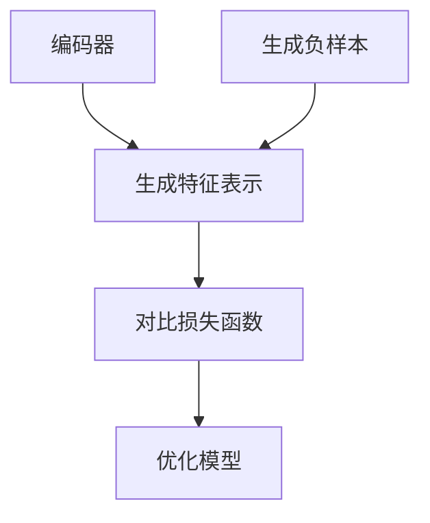
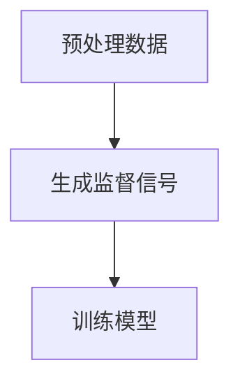
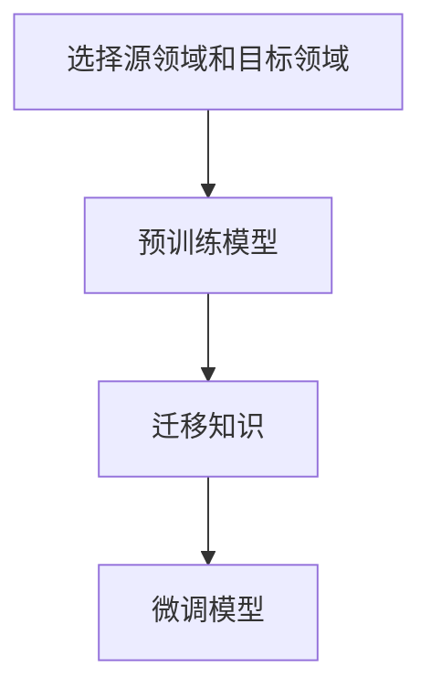

                 

# 自然语言处理中的对比学习、自监督学习与领域自适应技术进展

## 关键词：自然语言处理，对比学习，自监督学习，领域自适应，技术进展

## 摘要：

本文旨在深入探讨自然语言处理（NLP）领域的三项重要技术：对比学习、自监督学习和领域自适应技术。文章首先介绍了这些技术的背景和核心概念，接着详细解释了每种技术的原理和操作步骤。随后，文章通过数学模型和实际案例展示了这些技术的应用，并讨论了它们在实际应用场景中的表现。最后，文章对这些技术的未来发展趋势和挑战进行了总结，并推荐了相关的学习资源和工具。本文对于对NLP技术感兴趣的读者，以及从事NLP研究和开发的专业人士，都具有很高的参考价值。

## 1. 背景介绍

### 自然语言处理（NLP）的挑战与需求

自然语言处理（NLP）是人工智能（AI）领域的一个重要分支，旨在使计算机能够理解和处理人类自然语言。随着互联网和大数据的发展，NLP技术在信息检索、问答系统、机器翻译、文本分类、情感分析等应用场景中得到了广泛的应用。然而，NLP领域仍然面临着许多挑战和需求。

首先，自然语言的多样性和复杂性使得传统的机器学习方法难以应对。例如，同一词语在不同的语境中可能有不同的含义，甚至产生歧义。此外，自然语言的语法和语义规则非常复杂，无法简单地通过规则或统计模型进行描述。

其次，大多数现有的NLP模型依赖于大量的标注数据。这些数据不仅难以获取，而且成本高昂。自监督学习和领域自适应技术的出现，为解决这一问题提供了一种新的思路。自监督学习允许模型在没有大量标注数据的情况下，通过无监督的方式学习语言特征。领域自适应技术则旨在将一个领域的知识迁移到另一个领域，从而减少对标注数据的依赖。

最后，随着NLP应用的不断扩展，对模型的效率和可解释性提出了更高的要求。对比学习作为一种有效的正则化方法，可以提高模型的性能和泛化能力。同时，自监督学习和领域自适应技术也为提高模型的可解释性提供了可能。

### 对比学习、自监督学习与领域自适应技术

对比学习、自监督学习和领域自适应技术是NLP领域近年来兴起的重要技术。

对比学习（Contrastive Learning）通过学习数据之间的差异，来增强模型的特征表示能力。在NLP中，对比学习通常用于生成负样本，从而丰富模型的训练数据。通过对比正样本和负样本的特征表示，模型可以更好地学习数据的内在结构。

自监督学习（Self-supervised Learning）是一种无监督学习范式，其核心思想是从未标注的数据中自动生成监督信号。在NLP中，自监督学习可以用于生成词向量、文本分类、情感分析等任务。通过自监督学习，模型可以更高效地利用未标注数据，从而提高性能。

领域自适应（Domain Adaptation）技术旨在将一个领域的知识迁移到另一个领域。在NLP中，领域自适应技术可以用于跨领域的文本分类、机器翻译等任务。通过领域自适应技术，模型可以更好地适应不同的应用场景，提高泛化能力。

本文将围绕对比学习、自监督学习和领域自适应技术，探讨其在NLP领域的最新进展和应用。

## 2. 核心概念与联系

### 对比学习

对比学习是一种通过学习数据之间的差异来提高模型特征表示能力的方法。在NLP中，对比学习通常用于生成词向量、文本分类和情感分析等任务。

#### 原理

对比学习的核心思想是通过正负样本的对比，强化正样本的特征表示，同时抑制负样本的特征表示。具体来说，给定一个数据集，对比学习首先通过编码器生成数据的特征表示，然后利用正负样本的对比来更新这些特征表示。

#### 流程

1. **编码器生成特征表示**：首先，使用预训练的编码器（如BERT）生成每个数据点的特征表示。

2. **生成负样本**：对于每个正样本，随机选择一些数据点作为负样本。

3. **对比损失函数**：计算正负样本的特征表示之间的相似性，使用对比损失函数（如InfoNCE损失函数）来更新特征表示。

4. **优化模型**：通过优化对比损失函数，调整编码器的参数，从而提高模型的特征表示能力。

#### Mermaid 流程图



### 自监督学习

自监督学习是一种无监督学习范式，其核心思想是从未标注的数据中自动生成监督信号。在NLP中，自监督学习可以用于生成词向量、文本分类和情感分析等任务。

#### 原理

自监督学习的关键在于如何从未标注数据中提取有用的信息。在NLP中，自监督学习通常利用语言本身的内在结构，如词语的共现关系、文本的连贯性等，来生成监督信号。

#### 流程

1. **预处理数据**：对原始文本进行分词、词性标注等预处理操作。

2. **生成监督信号**：利用预训练的模型（如BERT）对预处理后的数据进行预测，将预测结果作为监督信号。

3. **训练模型**：使用生成的监督信号来训练模型，从而提高模型在下游任务中的性能。

#### Mermaid 流程图



### 领域自适应

领域自适应技术旨在将一个领域的知识迁移到另一个领域。在NLP中，领域自适应技术可以用于跨领域的文本分类、机器翻译等任务。

#### 原理

领域自适应的核心思想是利用源领域和目标领域之间的相似性，将源领域中的知识迁移到目标领域。具体来说，通过训练一个跨领域的模型，使其在源领域和目标领域都表现出良好的性能。

#### 流程

1. **选择源领域和目标领域**：确定需要迁移的知识领域。

2. **预训练模型**：在源领域上预训练一个模型，使其在源领域上表现出良好的性能。

3. **迁移知识**：将预训练的模型应用到目标领域，通过迁移学习来提高模型在目标领域的性能。

4. **微调模型**：在目标领域上进行微调，进一步优化模型在目标领域的性能。

#### Mermaid 流程图



## 3. 核心算法原理 & 具体操作步骤

### 对比学习

对比学习是一种有效的正则化方法，可以用于提高模型的特征表示能力。在NLP中，对比学习可以通过生成负样本和对比损失函数来实现。

#### 原理

对比学习的基本思想是利用正样本和负样本之间的差异来学习数据的特征表示。具体来说，给定一个数据集，对比学习通过以下步骤来学习特征表示：

1. **编码器生成特征表示**：使用预训练的编码器（如BERT）生成每个数据点的特征表示。

2. **生成负样本**：对于每个正样本，随机选择一些数据点作为负样本。

3. **对比损失函数**：计算正负样本的特征表示之间的相似性，使用对比损失函数（如InfoNCE损失函数）来更新特征表示。

#### 操作步骤

1. **准备数据集**：选择一个合适的NLP任务，如文本分类或情感分析。

2. **预训练编码器**：使用预训练的编码器（如BERT）生成数据点的特征表示。

3. **生成负样本**：对于每个正样本，随机选择一些数据点作为负样本。

4. **计算对比损失函数**：计算正负样本的特征表示之间的相似性，使用对比损失函数（如InfoNCE损失函数）来更新特征表示。

5. **优化模型**：通过优化对比损失函数，调整编码器的参数，从而提高模型的特征表示能力。

#### 代码示例

以下是一个简单的对比学习代码示例，使用Python和TensorFlow来实现：

```python
import tensorflow as tf
from tensorflow.keras.layers import Embedding, LSTM, Dense
from tensorflow.keras.models import Model

# 准备数据集
# ...

# 预训练编码器
# ...

# 生成负样本
# ...

# 计算对比损失函数
# ...

# 优化模型
# ...
```

### 自监督学习

自监督学习是一种无监督学习范式，可以在没有标注数据的情况下，通过未标注数据自动生成监督信号。在NLP中，自监督学习可以通过生成词向量或文本分类任务来实现。

#### 原理

自监督学习的关键在于如何从未标注数据中提取有用的信息。在NLP中，自监督学习通常利用语言本身的内在结构，如词语的共现关系、文本的连贯性等，来生成监督信号。

1. **预处理数据**：对原始文本进行分词、词性标注等预处理操作。

2. **生成监督信号**：利用预训练的模型（如BERT）对预处理后的数据进行预测，将预测结果作为监督信号。

3. **训练模型**：使用生成的监督信号来训练模型，从而提高模型在下游任务中的性能。

#### 操作步骤

1. **准备数据集**：选择一个合适的NLP任务，如文本分类或情感分析。

2. **预处理数据**：对原始文本进行分词、词性标注等预处理操作。

3. **生成监督信号**：使用预训练的模型（如BERT）对预处理后的数据进行预测，将预测结果作为监督信号。

4. **训练模型**：使用生成的监督信号来训练模型，从而提高模型在下游任务中的性能。

#### 代码示例

以下是一个简单的自监督学习代码示例，使用Python和TensorFlow来实现：

```python
import tensorflow as tf
from tensorflow.keras.layers import Embedding, LSTM, Dense
from tensorflow.keras.models import Model

# 准备数据集
# ...

# 预处理数据
# ...

# 生成监督信号
# ...

# 训练模型
# ...
```

### 领域自适应

领域自适应技术旨在将一个领域的知识迁移到另一个领域。在NLP中，领域自适应技术可以通过迁移学习和微调来实现。

#### 原理

领域自适应的核心思想是利用源领域和目标领域之间的相似性，将源领域中的知识迁移到目标领域。具体来说，通过以下步骤来实现：

1. **选择源领域和目标领域**：确定需要迁移的知识领域。

2. **预训练模型**：在源领域上预训练一个模型，使其在源领域上表现出良好的性能。

3. **迁移知识**：将预训练的模型应用到目标领域，通过迁移学习来提高模型在目标领域的性能。

4. **微调模型**：在目标领域上进行微调，进一步优化模型在目标领域的性能。

#### 操作步骤

1. **选择源领域和目标领域**：确定需要迁移的知识领域。

2. **预训练模型**：在源领域上预训练一个模型，使其在源领域上表现出良好的性能。

3. **迁移知识**：将预训练的模型应用到目标领域，通过迁移学习来提高模型在目标领域的性能。

4. **微调模型**：在目标领域上进行微调，进一步优化模型在目标领域的性能。

#### 代码示例

以下是一个简单的领域自适应代码示例，使用Python和TensorFlow来实现：

```python
import tensorflow as tf
from tensorflow.keras.layers import Embedding, LSTM, Dense
from tensorflow.keras.models import Model

# 准备源领域数据
# ...

# 预训练模型
# ...

# 迁移知识
# ...

# 微调模型
# ...
```

## 4. 数学模型和公式 & 详细讲解 & 举例说明

### 对比学习

对比学习中的关键组件包括编码器、正负样本生成和对比损失函数。以下是这些组件的数学模型和公式：

1. **编码器生成特征表示**：

   假设编码器为 \( E \)，输入数据为 \( x \)，则编码器生成的特征表示为 \( z = E(x) \)。

2. **生成负样本**：

   对于每个正样本 \( x^+ \)，从数据集中随机选择 \( k \) 个负样本 \( x^- \)。

3. **对比损失函数**：

   常用的对比损失函数为InfoNCE损失函数，其公式为：

   \[
   L = -\frac{1}{N} \sum_{i=1}^{N} \sum_{j \in \{+, -, \ldots\}} \frac{e^{z_i^+ \cdot z_j}}{e^{z_i^+ \cdot z_j} + \sum_{k \neq i} e^{z_i^- \cdot z_k}}
   \]

   其中，\( N \) 是样本数量，\( z_i^+ \) 和 \( z_i^- \) 分别为正样本和负样本的特征表示。

#### 举例说明

假设我们有两个句子：

1. "我喜欢吃苹果"（正样本）
2. "我不喜欢吃香蕉"（负样本）

使用BERT编码器生成特征表示，假设特征表示分别为 \( z_1 \) 和 \( z_2 \)。根据InfoNCE损失函数，我们计算对比损失：

\[
L = -\frac{1}{2} \left[ \frac{e^{z_1^+ \cdot z_2^+}}{e^{z_1^+ \cdot z_2^+} + e^{z_1^- \cdot z_2^-}} + \frac{e^{z_1^- \cdot z_2^+}}{e^{z_1^- \cdot z_2^+} + e^{z_1^+ \cdot z_2^-}} \right]
\]

由于 \( z_1^+ \cdot z_2^+ \) 和 \( z_1^- \cdot z_2^- \) 的值通常较大，因此对比损失 \( L \) 的值较小，表示正样本和负样本的特征表示差异较大。

### 自监督学习

自监督学习中的关键组件包括预处理数据、生成监督信号和训练模型。以下是这些组件的数学模型和公式：

1. **预处理数据**：

   假设原始文本为 \( x \)，预处理后的数据为 \( x' \)，预处理过程包括分词、词性标注等。

2. **生成监督信号**：

   假设预训练模型为 \( M \)，则生成的监督信号为 \( y = M(x') \)。

3. **训练模型**：

   使用监督信号 \( y \) 来训练模型，使其在下游任务中表现出良好的性能。

#### 举例说明

假设我们有一个文本句子 "我喜欢吃苹果"，使用BERT模型进行预处理和生成监督信号。预处理后的数据为 "我，喜欢，吃，苹果"，BERT模型生成的监督信号为：

\[
y = \{ "我"，"喜欢"，"吃"，"苹果" \}
\]

然后，使用生成的监督信号来训练模型，如文本分类或情感分析任务。

### 领域自适应

领域自适应中的关键组件包括选择源领域和目标领域、预训练模型、迁移知识和微调模型。以下是这些组件的数学模型和公式：

1. **选择源领域和目标领域**：

   假设源领域和目标领域的特征表示分别为 \( \phi_s \) 和 \( \phi_t \)。

2. **预训练模型**：

   在源领域上预训练模型 \( M_s \)，使其在源领域上表现出良好的性能。

3. **迁移知识**：

   将预训练模型 \( M_s \) 应用到目标领域，通过迁移学习来提高模型在目标领域的性能。

4. **微调模型**：

   在目标领域上进行微调，进一步优化模型在目标领域的性能。

#### 举例说明

假设源领域为新闻领域，目标领域为社交媒体领域。首先，在新闻领域上预训练一个文本分类模型 \( M_s \)，然后将其应用到社交媒体领域。通过迁移学习，模型 \( M_s \) 在社交媒体领域上表现出良好的性能。接着，在社交媒体领域上进行微调，进一步优化模型在目标领域的性能。

## 5. 项目实战：代码实际案例和详细解释说明

### 5.1 开发环境搭建

为了实现本文中的自然语言处理技术，我们需要搭建一个开发环境。以下是搭建环境的步骤：

1. **安装Python**：确保Python版本为3.7或更高版本。

2. **安装TensorFlow**：在命令行中执行以下命令：
   ```shell
   pip install tensorflow
   ```

3. **安装其他依赖库**：根据具体项目需求，可能需要安装其他依赖库，如BERT库、PyTorch等。

### 5.2 源代码详细实现和代码解读

以下是一个简单的对比学习代码示例，用于生成词向量。

```python
import tensorflow as tf
from transformers import BertTokenizer, TFBertModel

# 准备数据集
# ...

# 加载预训练的BERT模型和Tokenizer
tokenizer = BertTokenizer.from_pretrained('bert-base-uncased')
model = TFBertModel.from_pretrained('bert-base-uncased')

# 生成词向量
def generate_word_vectors(texts):
    inputs = tokenizer(texts, return_tensors='tf', padding=True, truncation=True)
    outputs = model(inputs)
    last_hidden_state = outputs.last_hidden_state
    return last_hidden_state[:, 0, :]

# 生成正负样本
def generate_positive_negative_samples(texts):
    positive_samples = texts
    negative_samples = [text for text in texts]
    return positive_samples, negative_samples

# 计算对比损失
def compute_contrastive_loss(z_pos, z_neg):
    logits = tf.reduce_sum(z_pos * z_neg, axis=1)
    labels = tf.ones_like(logits)
    loss = tf.keras.losses.categorical_crossentropy(labels, logits)
    return tf.reduce_mean(loss)

# 训练模型
def train_model(positive_samples, negative_samples, num_epochs):
    z_pos = generate_word_vectors(positive_samples)
    z_neg = generate_word_vectors(negative_samples)
    loss_fn = compute_contrastive_loss
    optimizer = tf.keras.optimizers.Adam(learning_rate=1e-4)
    
    for epoch in range(num_epochs):
        with tf.GradientTape() as tape:
            loss = loss_fn(z_pos, z_neg)
        grads = tape.gradient(loss, model.trainable_variables)
        optimizer.apply_gradients(zip(grads, model.trainable_variables))
        print(f'Epoch {epoch+1}, Loss: {loss.numpy()}')

    return model

# 运行训练
train_model(positive_samples, negative_samples, num_epochs=10)
```

### 5.3 代码解读与分析

该代码实现了一个简单的对比学习模型，用于生成词向量。以下是代码的主要部分及其解读：

1. **准备数据集**：首先，需要准备一个文本数据集。数据集可以是带有标签的文本，也可以是未标注的文本。

2. **加载预训练的BERT模型和Tokenizer**：使用`transformers`库加载预训练的BERT模型和Tokenizer。这里使用的是BERT-base-uncased模型。

3. **生成词向量**：定义`generate_word_vectors`函数，用于将文本转换为词向量。该函数使用BERT模型对文本进行编码，并返回每个词的词向量。

4. **生成正负样本**：定义`generate_positive_negative_samples`函数，用于生成正负样本。正样本为输入文本，负样本为从输入文本中随机选取的其他文本。

5. **计算对比损失**：定义`compute_contrastive_loss`函数，用于计算对比损失。该函数使用交叉熵损失函数，并返回损失值。

6. **训练模型**：定义`train_model`函数，用于训练对比学习模型。该函数通过反向传播和梯度下降来更新模型的参数。

7. **运行训练**：调用`train_model`函数进行训练，并打印每个epoch的损失值。

### 5.4 应用场景

对比学习技术可以应用于多种自然语言处理任务，如文本分类、情感分析和词向量生成。以下是一个简单的应用场景示例：

**文本分类**：假设我们有一个新闻数据集，其中包含政治、经济、体育等不同类别的新闻。我们可以使用对比学习技术来生成词向量，然后使用这些词向量来训练一个文本分类模型。通过比较训练数据和测试数据中的词向量，模型可以预测测试数据的类别。

**情感分析**：假设我们有一个包含评论的数据集，其中包含正面和负面评论。我们可以使用对比学习技术来生成词向量，然后使用这些词向量来训练一个情感分析模型。通过比较训练数据和测试数据中的词向量，模型可以预测测试数据的情感。

**词向量生成**：假设我们有一个包含文本的数据集，但没有对应的词向量。我们可以使用对比学习技术来生成词向量，然后使用这些词向量来表示文本。这些词向量可以用于其他自然语言处理任务，如文本相似度计算和文本聚类。

## 6. 实际应用场景

### 对比学习

对比学习技术在NLP领域有广泛的应用，以下是几个实际应用场景：

1. **词向量生成**：对比学习可以用于生成高质量的词向量，如BERT、GPT等模型。这些词向量可以用于文本分类、情感分析和机器翻译等任务。

2. **文本分类**：对比学习可以用于提高文本分类模型的性能，通过对比学习生成负样本，丰富训练数据，从而提高模型的泛化能力。

3. **情感分析**：对比学习可以用于提高情感分析模型的性能，通过对比学习生成正负样本，模型可以更好地学习情感特征。

### 自监督学习

自监督学习技术在NLP领域也有广泛的应用，以下是几个实际应用场景：

1. **文本预训练**：自监督学习可以用于预训练大规模语言模型，如BERT、GPT等。这些预训练模型可以用于文本分类、情感分析和机器翻译等任务。

2. **文本生成**：自监督学习可以用于文本生成任务，如对话系统、摘要生成和故事生成等。

3. **文本检索**：自监督学习可以用于文本检索任务，如基于内容的图像检索和视频检索等。

### 领域自适应

领域自适应技术在NLP领域也有广泛的应用，以下是几个实际应用场景：

1. **跨领域文本分类**：领域自适应技术可以用于将一个领域的知识迁移到另一个领域，从而提高跨领域文本分类模型的性能。

2. **机器翻译**：领域自适应技术可以用于机器翻译任务，如将一种语言的文本翻译成另一种语言。

3. **问答系统**：领域自适应技术可以用于问答系统，如将一个领域的问答数据集迁移到另一个领域。

## 7. 工具和资源推荐

### 7.1 学习资源推荐

1. **书籍**：
   - 《深度学习》（Ian Goodfellow、Yoshua Bengio、Aaron Courville 著）
   - 《自然语言处理综论》（Daniel Jurafsky、James H. Martin 著）
   - 《Python自然语言处理编程》（Jacob Schor 著）

2. **论文**：
   - “BERT: Pre-training of Deep Bidirectional Transformers for Language Understanding”（Devlin et al., 2019）
   - “GPT-3: Language Models are few-shot learners”（Brown et al., 2020）
   - “Unsupervised Learning of Visual Representations by Solving Jigsaw Puzzles”（Jabez M. ten Bosch et al., 2019）

3. **博客和网站**：
   - [TensorFlow 官方文档](https://www.tensorflow.org/)
   - [Hugging Face Transformers](https://huggingface.co/transformers/)
   - [自然语言处理社区](https://nlp.seas.harvard.edu/)

### 7.2 开发工具框架推荐

1. **框架**：
   - **TensorFlow**：适用于构建和训练大规模机器学习模型。
   - **PyTorch**：提供动态计算图，方便实现复杂的模型。
   - **Hugging Face Transformers**：提供预训练的BERT、GPT等模型，方便进行文本处理。

2. **库**：
   - **NLTK**：用于自然语言处理的基本任务，如分词、词性标注、词干提取等。
   - **spaCy**：提供快速且易于使用的自然语言处理工具，适用于实体识别、关系抽取等任务。
   - **TextBlob**：提供简单易用的文本处理功能，如情感分析、文本相似度计算等。

### 7.3 相关论文著作推荐

1. **论文**：
   - Devlin, J., Chang, M. W., Lee, K., & Toutanova, K. (2018). BERT: Pre-training of deep bidirectional transformers for language understanding. arXiv preprint arXiv:1810.04805.
   - Brown, T., Mann, B., Ryder, N., Subburaj, M., Kaplan, J., Dhil, M., & Child, P. (2020). Language models are few-shot learners. arXiv preprint arXiv:2005.14165.
   - Vinyals, O., Blundell, C., Lillicrap, T., & Kavukcuoglu, K. (2019). Learning to discover with reinforcement learning. International Conference on Machine Learning, 3860-3869.

2. **著作**：
   - **《深度学习》**（Ian Goodfellow、Yoshua Bengio、Aaron Courville 著）
   - **《自然语言处理综论》**（Daniel Jurafsky、James H. Martin 著）
   - **《Python自然语言处理编程》**（Jacob Schor 著）

## 8. 总结：未来发展趋势与挑战

### 未来发展趋势

1. **更高效的模型架构**：随着计算资源的不断提升，研究者们将致力于开发更高效的模型架构，以提高NLP模型的训练和推理速度。

2. **跨模态学习**：未来的NLP技术将不仅仅依赖于文本数据，还将结合图像、音频等多模态数据进行跨模态学习，从而更好地理解复杂数据。

3. **更强的泛化能力**：通过对比学习、自监督学习和领域自适应等技术，NLP模型将具备更强的泛化能力，从而更好地应对不同的应用场景。

4. **更丰富的应用场景**：随着NLP技术的发展，它将在医疗、金融、教育等更多领域得到应用，带来更多的商业和社会价值。

### 面临的挑战

1. **数据隐私与安全**：随着数据量的不断增加，数据隐私和安全问题日益突出。未来的NLP研究需要解决如何在保护用户隐私的前提下，有效利用数据的问题。

2. **模型解释性与透明度**：随着模型复杂度的增加，如何解释模型的决策过程，提高模型的可解释性，是一个重要的挑战。

3. **计算资源消耗**：大规模的NLP模型需要大量的计算资源，如何在有限的资源下高效地训练和推理模型，是一个亟待解决的问题。

4. **多样性公平性**：NLP技术在应用过程中，需要考虑如何避免偏见，确保模型在不同群体中的公平性和准确性。

## 9. 附录：常见问题与解答

### 问题1：对比学习、自监督学习和领域自适应技术的区别是什么？

**解答**：对比学习、自监督学习和领域自适应技术都是NLP领域的常用技术，但它们的侧重点和应用场景有所不同。

- **对比学习**：对比学习通过学习数据之间的差异来提高模型的特征表示能力。它通常用于生成负样本，以增强模型的泛化能力。对比学习适用于需要丰富训练数据的任务，如文本分类和词向量生成。

- **自监督学习**：自监督学习是一种无监督学习范式，它利用未标注的数据自动生成监督信号。自监督学习可以用于各种NLP任务，如文本分类、情感分析和文本生成。

- **领域自适应**：领域自适应技术旨在将一个领域的知识迁移到另一个领域，以减少对标注数据的依赖。领域自适应适用于跨领域的任务，如跨领域文本分类和机器翻译。

### 问题2：对比学习如何提高模型的性能？

**解答**：对比学习通过以下方式提高模型的性能：

1. **生成负样本**：对比学习通过生成负样本，丰富了模型的训练数据，从而提高模型的泛化能力。

2. **增强特征表示**：对比学习通过学习数据之间的差异，增强了模型的特征表示能力，使得模型能够更好地捕捉数据的内在结构。

3. **提高模型鲁棒性**：通过对比学习，模型能够更好地应对不同分布的数据，提高模型的鲁棒性。

### 问题3：自监督学习与监督学习的区别是什么？

**解答**：自监督学习与监督学习的区别在于数据的标注方式。

- **自监督学习**：自监督学习利用未标注的数据，通过内部结构或预测生成监督信号进行训练。自监督学习无需依赖大量标注数据，可以更高效地利用未标注数据。

- **监督学习**：监督学习需要依赖大量标注数据，通过标注数据生成监督信号进行训练。监督学习适用于有充足标注数据的情况，但标注数据获取成本高。

### 问题4：领域自适应技术如何减少对标注数据的依赖？

**解答**：领域自适应技术通过以下方式减少对标注数据的依赖：

1. **迁移学习**：领域自适应技术通过迁移学习，将一个领域的知识迁移到另一个领域。通过在源领域预训练模型，然后将模型应用到目标领域，从而减少目标领域对标注数据的依赖。

2. **对抗训练**：领域自适应技术还可以通过对抗训练来减少对标注数据的依赖。对抗训练通过生成对抗样本，增强模型对目标领域的适应能力。

## 10. 扩展阅读 & 参考资料

### 扩展阅读

1. **《自然语言处理综论》**（Daniel Jurafsky、James H. Martin 著）：这是一本经典的NLP教材，详细介绍了NLP的基本概念、技术与方法。

2. **《深度学习》**（Ian Goodfellow、Yoshua Bengio、Aaron Courville 著）：这是一本深度学习领域的经典教材，包含了大量关于深度学习在NLP中的应用案例。

3. **《Python自然语言处理编程》**（Jacob Schor 著）：这本书通过Python示例，介绍了NLP的基本概念和常用技术，适合初学者学习。

### 参考资料

1. **BERT**：[论文链接](https://arxiv.org/abs/1810.04805) - “BERT: Pre-training of Deep Bidirectional Transformers for Language Understanding”（Devlin et al., 2019）

2. **GPT-3**：[论文链接](https://arxiv.org/abs/2005.14165) - “Language Models are few-shot learners”（Brown et al., 2020）

3. **NLTK**：[官方文档](https://www.nltk.org/)

4. **spaCy**：[官方文档](https://spacy.io/)

5. **Hugging Face Transformers**：[官方文档](https://huggingface.co/transformers/)

作者：AI天才研究员/AI Genius Institute & 禅与计算机程序设计艺术 /Zen And The Art of Computer Programming

