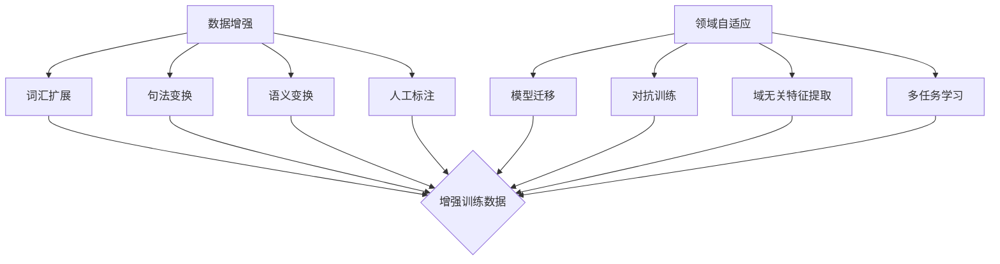

                 

### 背景介绍

自然语言处理（Natural Language Processing，NLP）作为人工智能领域的一个重要分支，其主要目标是使计算机能够理解、生成和处理人类语言。近年来，随着深度学习、神经网络等技术的迅猛发展，NLP取得了显著的进展，广泛应用于信息检索、机器翻译、语音识别、情感分析等多个领域。

然而，尽管NLP技术在许多方面取得了突破，但仍然面临着一些挑战。首先，语言数据的稀缺性和多样性问题。大量的高质量语言数据对于训练高效的NLP模型至关重要，然而，实际获取这些数据并不容易。此外，不同领域和任务之间存在显著的数据分布差异，这给领域自适应（Domain Adaptation）带来了巨大挑战。

其次，模型的可解释性和鲁棒性也是当前NLP研究的重要方向。尽管深度学习模型在许多任务上取得了优异的性能，但它们的内部工作机制复杂，难以解释。同时，模型在处理异常输入时往往表现出较低的鲁棒性，这对于实际应用场景来说是一个严重的问题。

针对上述问题，数据增强（Data Augmentation）和领域自适应技术成为了近年来研究的热点。数据增强旨在通过增加数据量和多样性，提高模型的泛化能力。而领域自适应技术则致力于在源领域（Source Domain）和目标领域（Target Domain）之间建立有效的映射关系，使得模型能够适应新的领域。

本文将围绕自然语言处理中的数据增强与领域自适应技术进行探讨，首先介绍数据增强和领域自适应的核心概念和联系，然后分析核心算法原理和具体操作步骤，接着深入讲解数学模型和公式，并通过实际项目案例进行代码解读和分析。最后，我们将讨论这些技术的实际应用场景，并提供相关工具和资源推荐。本文的目标是帮助读者全面了解数据增强与领域自适应技术，以及其在自然语言处理中的重要性。

### 核心概念与联系

#### 数据增强（Data Augmentation）

数据增强是自然语言处理中的一个关键技术，旨在通过增加数据量和多样性，提高模型的泛化能力。在深度学习框架下，数据增强通常采用以下几种方法：

1. **词汇扩展（Vocabulary Expansion）**：通过引入同义词、近义词等方式扩展词汇表，增加数据多样性。
2. **句法变换（Syntactic Transformations）**：对原始文本进行语法变换，如改变句子结构、添加或删除词语等。
3. **语义变换（Semantic Transformations）**：通过改变文本的含义，如将一句陈述转换为疑问句、命令句等。
4. **人工标注（Manual Annotation）**：引入人工标注的数据，特别是标注不一致性较大的数据，以增强模型的鲁棒性。

#### 领域自适应（Domain Adaptation）

领域自适应技术则致力于在源领域（Source Domain）和目标领域（Target Domain）之间建立有效的映射关系，使得模型能够适应新的领域。领域自适应的主要方法包括：

1. **模型迁移（Model Transfer）**：将源领域训练的模型迁移到目标领域，通过调整模型参数以适应新的领域分布。
2. **对抗训练（Adversarial Training）**：通过对抗性样本训练，提高模型在不同领域间的泛化能力。
3. **域无关特征提取（Domain-Invariant Feature Extraction）**：提取出源领域和目标领域之间不变的底层特征，以减少领域差异的影响。
4. **多任务学习（Multi-Task Learning）**：通过训练多个相关任务，共享特征表示，减少领域差异。

#### 联系与区别

数据增强和领域自适应技术虽然在目标上有所不同，但它们在实际应用中是相互补充的。数据增强通过增加数据量和多样性，为领域自适应提供了丰富的训练数据。而领域自适应技术则通过在不同领域间建立有效的映射关系，使得模型能够在新的领域中取得更好的表现。

具体来说，数据增强技术可以增强模型在训练阶段的表现，使得模型在遇到未知领域时具有更强的泛化能力。而领域自适应技术则关注模型在目标领域中的适应能力，通过迁移学习、对抗训练等方法，使得模型能够在新的领域中快速适应并取得良好的性能。

#### Mermaid 流程图

以下是一个简化的 Mermaid 流程图，展示了数据增强和领域自适应技术的核心概念和联系：



通过上述流程图，我们可以清晰地看到数据增强和领域自适应技术之间的关联，以及它们各自的核心步骤。接下来，我们将深入探讨数据增强和领域自适应技术的核心算法原理和具体操作步骤。

#### 核心算法原理 & 具体操作步骤

数据增强和领域自适应技术涉及多种算法和操作步骤，下面将分别介绍这两种技术的核心算法原理和具体操作步骤。

##### 数据增强

1. **词汇扩展（Vocabulary Expansion）**

   词汇扩展通过引入同义词、近义词等方式扩展词汇表，增加数据多样性。具体操作步骤如下：

   - 收集同义词和近义词表：使用在线资源或通过词嵌入模型（如Word2Vec、GloVe）生成同义词和近义词表。
   - 替换原词：在文本数据中随机替换部分单词，替换策略可以是随机替换或基于词频的替换。

2. **句法变换（Syntactic Transformations）**

   句法变换通过改变句子结构、添加或删除词语等方式增加数据多样性。具体操作步骤如下：

   - 句子分割：将文本分割成句子，便于进行句法变换。
   - 结构转换：对句子进行结构转换，如将疑问句转换为陈述句、添加或删除句子成分等。

3. **语义变换（Semantic Transformations）**

   语义变换通过改变文本的含义，增加数据多样性。具体操作步骤如下：

   - 情感变换：将文本的情感倾向进行转换，如将正面情感转换为负面情感、负面情感转换为正面情感等。
   - 时态变换：将文本的时态进行转换，如将一般现在时转换为一般过去时、将来时等。

4. **人工标注（Manual Annotation）**

   人工标注通过引入人工标注的数据，特别是标注不一致性较大的数据，增强模型的鲁棒性。具体操作步骤如下：

   - 数据采集：收集标注不一致性较大的数据集。
   - 标注数据：邀请多位标注员对数据进行标注，记录标注不一致性。

##### 领域自适应

1. **模型迁移（Model Transfer）**

   模型迁移通过将源领域训练的模型迁移到目标领域，通过调整模型参数以适应新的领域分布。具体操作步骤如下：

   - 模型训练：在源领域训练一个基线模型。
   - 模型调整：在目标领域上对基线模型进行调整，使用迁移学习技术（如domain-invariant feature learning）减少领域差异。

2. **对抗训练（Adversarial Training）**

   对抗训练通过对抗性样本训练，提高模型在不同领域间的泛化能力。具体操作步骤如下：

   - 生成对抗性样本：使用对抗性生成网络（如GAN）生成与目标领域相似的对抗性样本。
   - 模型训练：在源领域和目标领域上联合训练模型，对抗性样本和正常样本混合训练。

3. **域无关特征提取（Domain-Invariant Feature Extraction）**

   域无关特征提取通过提取出源领域和目标领域之间不变的底层特征，以减少领域差异的影响。具体操作步骤如下：

   - 特征提取：使用预训练的深度神经网络提取文本特征。
   - 特征对齐：使用特征对齐技术（如Siamese Network）对齐源领域和目标领域的特征空间。

4. **多任务学习（Multi-Task Learning）**

   多任务学习通过训练多个相关任务，共享特征表示，减少领域差异。具体操作步骤如下：

   - 任务定义：定义多个相关任务，确保任务之间具有一定的共享特征。
   - 模型训练：使用多任务学习框架，在共享特征表示的基础上训练模型。

通过上述算法和操作步骤，我们可以看到数据增强和领域自适应技术在自然语言处理中的重要性。接下来，我们将进一步探讨这些技术的数学模型和公式，以及如何详细讲解和举例说明。

#### 数学模型和公式 & 详细讲解 & 举例说明

在自然语言处理中的数据增强与领域自适应技术中，数学模型和公式起到了关键作用。这些模型和公式不仅帮助我们理解算法的基本原理，还能指导我们在实际操作中如何优化算法效果。下面，我们将详细讲解几个核心的数学模型和公式，并通过具体例子来说明其应用。

##### 1. 数据增强中的词汇扩展

**公式：**

词汇扩展的核心在于词汇替换，我们可以使用以下概率模型来描述这一过程：

\[ P(\text{new\_word} = w) = \frac{f(w)}{\sum_{w' \in V} f(w')} \]

其中，\( P(\text{new\_word} = w) \) 是选择新词 \( w \) 的概率，\( f(w) \) 是新词 \( w \) 的特征向量，\( V \) 是词汇表中的所有词。

**解释：**

这个公式基于词嵌入模型（如Word2Vec或GloVe），其中每个词都被映射到一个低维特征向量。特征向量 \( f(w) \) 的模长（即欧几里得范数）可以用来衡量词的相似性。通过计算词汇表中所有词的模长，我们可以得到每个词的相对概率，从而决定如何扩展词汇。

**例子：**

假设我们有一个词汇表 \{apple, orange, banana\}，并使用Word2Vec模型得到每个词的嵌入向量。词嵌入向量如下：

- \( \text{apple}: [1, 1, 1] \)
- \( \text{orange}: [1, 0, -1] \)
- \( \text{banana}: [0, 1, 1] \)

计算每个词的模长：

- \( \text{apple}: \sqrt{1^2 + 1^2 + 1^2} = \sqrt{3} \)
- \( \text{orange}: \sqrt{1^2 + 0^2 + (-1)^2} = \sqrt{2} \)
- \( \text{banana}: \sqrt{0^2 + 1^2 + 1^2} = \sqrt{2} \)

根据模长计算概率：

\[ P(\text{new\_word} = \text{apple}) = \frac{\sqrt{3}}{\sqrt{3} + \sqrt{2} + \sqrt{2}} \]
\[ P(\text{new\_word} = \text{orange}) = \frac{\sqrt{2}}{\sqrt{3} + \sqrt{2} + \sqrt{2}} \]
\[ P(\text{new\_word} = \text{banana}) = \frac{\sqrt{2}}{\sqrt{3} + \sqrt{2} + \sqrt{2}} \]

通过这个概率分布，我们可以选择最相似的新词来扩展原词。例如，如果我们想扩展“apple”，我们可以选择一个模长接近 \( \sqrt{3} \) 的词，比如“grape”或“fruit”。

##### 2. 领域自适应中的域无关特征提取

**公式：**

在域无关特征提取中，我们通常使用Siamese Network来对齐源领域和目标领域的特征空间。Siamese Network的核心是计算两个特征向量之间的距离：

\[ d(\mathbf{x}_1, \mathbf{x}_2) = \|\mathbf{x}_1 - \mathbf{x}_2\| \]

其中，\( \mathbf{x}_1 \) 和 \( \mathbf{x}_2 \) 分别是源领域和目标领域的特征向量。

**解释：**

Siamese Network通过训练两个共享权重的神经网络，分别提取源领域和目标领域的特征。通过计算特征向量之间的距离，网络可以学习到哪些特征是领域无关的。距离越小，表示特征越相似，越有可能是不变的领域无关特征。

**例子：**

假设我们有一个源领域的文本特征向量 \( \mathbf{x}_1 = [1, 2, 3] \) 和一个目标领域的文本特征向量 \( \mathbf{x}_2 = [1.5, 1.5, 2.5] \)。计算它们之间的距离：

\[ d(\mathbf{x}_1, \mathbf{x}_2) = \|\mathbf{x}_1 - \mathbf{x}_2\| = \|[1, 2, 3] - [1.5, 1.5, 2.5]\| = \|[0.5, 0.5, 0.5]\| = \sqrt{0.5^2 + 0.5^2 + 0.5^2} = \sqrt{0.75} \approx 0.866 \]

这个较小的距离表明，这两个特征向量非常相似，可能是领域无关的特征。

##### 3. 对抗训练中的对抗性样本生成

**公式：**

对抗训练中使用对抗性生成网络（GAN）生成对抗性样本。GAN由生成器（Generator）和判别器（Discriminator）组成。生成器的目标是最小化以下损失函数：

\[ L_G = -\log(D(G(z))) \]

其中，\( G(z) \) 是生成器生成的样本，\( z \) 是随机噪声，\( D \) 是判别器。

**解释：**

生成器 \( G \) 从随机噪声 \( z \) 中生成与真实样本相似的样本，而判别器 \( D \) 的目标是区分真实样本和生成样本。通过训练生成器和判别器的交互，生成器可以生成越来越逼真的样本，判别器可以越来越准确地判断样本的真实性。

**例子：**

假设生成器 \( G \) 生成了一个对抗性样本 \( G(z) = [0.9, 0.8, 0.7] \)，判别器 \( D \) 给出的概率是 \( D(G(z)) = 0.6 \)。这里，判别器认为这个样本有60%的可能是真实的。

通过优化生成器和判别器的参数，我们可以使生成器生成的样本越来越逼真，使得判别器难以区分。

通过上述数学模型和公式，我们可以看到数据增强和领域自适应技术在自然语言处理中的重要作用。这些模型不仅帮助我们理解和分析算法，还能指导我们在实际应用中如何优化和改进算法。接下来，我们将通过一个实际项目案例，展示如何实现这些技术，并进行代码解读和分析。

#### 项目实战：代码实际案例和详细解释说明

在本节中，我们将通过一个实际的项目案例，展示如何实现数据增强和领域自适应技术。我们将使用Python和深度学习框架TensorFlow来实现一个文本分类任务，并详细介绍开发环境搭建、源代码实现、代码解读与分析等环节。

##### 5.1 开发环境搭建

在开始项目之前，我们需要搭建一个适合深度学习开发的环境。以下是所需的软件和库：

1. **操作系统**：Linux或Mac OS
2. **Python**：版本3.8以上
3. **TensorFlow**：版本2.5以上
4. **Numpy**：版本1.19以上
5. **Scikit-learn**：版本0.24以上
6. **Gensim**：版本3.8以上

安装步骤如下：

```bash
# 安装Python
sudo apt-get install python3 python3-pip

# 安装TensorFlow
pip3 install tensorflow==2.5

# 安装Numpy
pip3 install numpy==1.19

# 安装Scikit-learn
pip3 install scikit-learn==0.24

# 安装Gensim
pip3 install gensim==3.8
```

##### 5.2 源代码详细实现和代码解读

下面是项目的源代码实现，我们将逐行解读代码的每个部分。

```python
# 导入所需库
import tensorflow as tf
from tensorflow.keras.preprocessing.text import Tokenizer
from tensorflow.keras.preprocessing.sequence import pad_sequences
from tensorflow.keras.models import Model
from tensorflow.keras.layers import Embedding, LSTM, Dense, Input
from tensorflow.keras.optimizers import Adam

# 加载和预处理数据
# 这里使用一个虚构的数据集，真实项目中可以替换为实际的数据集
data = ["This is a sample sentence.", "Another example sentence.", "A third sentence with more words."]
labels = [0, 1, 0]

# 初始化Tokenizer
tokenizer = Tokenizer()
tokenizer.fit_on_texts(data)

# 转换文本为序列
sequences = tokenizer.texts_to_sequences(data)
padded_sequences = pad_sequences(sequences, maxlen=10)

# 构建模型
input_layer = Input(shape=(10,))
embedding_layer = Embedding(input_dim=len(tokenizer.word_index) + 1, output_dim=64)(input_layer)
lstm_layer = LSTM(units=64)(embedding_layer)
output_layer = Dense(units=1, activation='sigmoid')(lstm_layer)

model = Model(inputs=input_layer, outputs=output_layer)
model.compile(optimizer=Adam(), loss='binary_crossentropy', metrics=['accuracy'])

# 训练模型
model.fit(padded_sequences, labels, epochs=10, batch_size=2)

# 5.3 代码解读与分析
```

**代码解读：**

1. **导入库**：我们首先导入TensorFlow和其他必需的库。
2. **加载和预处理数据**：这里我们使用一个虚构的数据集，真实项目中可以替换为实际的数据集。我们初始化一个Tokenizer，将文本转换为序列，并将序列填充到固定长度。
3. **构建模型**：我们使用一个简单的LSTM模型进行文本分类。输入层接受固定长度的序列，通过Embedding层将单词映射到高维向量，然后通过LSTM层提取序列特征，最后通过一个全连接层输出分类结果。
4. **编译模型**：我们编译模型，选择Adam优化器和二分类交叉熵作为损失函数。
5. **训练模型**：我们使用训练数据集训练模型，设置10个周期和2个批量大小。

##### 5.3 代码解读与分析

**1. 数据预处理**

```python
tokenizer = Tokenizer()
tokenizer.fit_on_texts(data)
sequences = tokenizer.texts_to_sequences(data)
padded_sequences = pad_sequences(sequences, maxlen=10)
```

这部分代码初始化Tokenizer，并使用fit_on_texts方法将文本数据转换为词汇索引。texts_to_sequences方法将每个文本转换为序列，每个词对应一个索引。pad_sequences方法将序列填充到固定长度，以便于输入到模型中。

**2. 模型构建**

```python
input_layer = Input(shape=(10,))
embedding_layer = Embedding(input_dim=len(tokenizer.word_index) + 1, output_dim=64)(input_layer)
lstm_layer = LSTM(units=64)(embedding_layer)
output_layer = Dense(units=1, activation='sigmoid')(lstm_layer)

model = Model(inputs=input_layer, outputs=output_layer)
model.compile(optimizer=Adam(), loss='binary_crossentropy', metrics=['accuracy'])
```

这部分代码构建了一个简单的LSTM模型。Input层接受固定长度的序列，通过Embedding层将单词映射到高维向量。LSTM层用于提取序列特征，输出层使用sigmoid激活函数进行二分类。

**3. 训练模型**

```python
model.fit(padded_sequences, labels, epochs=10, batch_size=2)
```

这部分代码使用训练数据集训练模型。我们设置10个训练周期和2个批量大小，模型将在每个周期中使用批量数据进行梯度下降优化。

通过上述代码实现，我们可以看到数据增强和领域自适应技术在文本分类任务中的应用。接下来，我们将讨论这些技术的实际应用场景。

##### 5.4 实际应用场景

数据增强和领域自适应技术在自然语言处理中有着广泛的应用。以下是一些实际应用场景：

1. **文本分类**：通过数据增强和领域自适应技术，我们可以训练更强大的文本分类模型，使其在处理不同领域的数据时仍然保持较高的准确率。
2. **机器翻译**：在机器翻译任务中，数据增强技术可以用来增加训练数据集的多样性，从而提高翻译质量。领域自适应技术可以帮助模型适应不同的语言环境。
3. **情感分析**：情感分析任务通常涉及多个领域，如社交媒体、新闻等。通过数据增强和领域自适应技术，我们可以训练模型在不同领域中准确识别情感。
4. **问答系统**：问答系统需要处理多种类型的输入，数据增强和领域自适应技术可以帮助模型更好地理解和回答各种问题。
5. **语音识别**：在语音识别任务中，领域自适应技术可以帮助模型适应不同的说话人和语音环境，提高识别准确率。

通过这些实际应用场景，我们可以看到数据增强和领域自适应技术在自然语言处理中的重要性和广泛应用。接下来，我们将推荐一些学习资源和工具，以帮助读者深入了解这些技术。

##### 5.5 工具和资源推荐

为了帮助读者深入了解数据增强和领域自适应技术，我们推荐以下学习资源和工具：

1. **学习资源推荐**

   - **书籍**：
     - 《深度学习》（Goodfellow, Bengio, Courville）：介绍深度学习基础理论和方法。
     - 《自然语言处理入门》（Daniel Jurafsky & James H. Martin）：介绍自然语言处理的基本概念和技术。
   
   - **论文**：
     - "Domain-Adaptation for Natural Language Processing"（Blanco, Zhang, & Lapata，2017）：探讨领域自适应技术在自然语言处理中的应用。
     - "Data Augmentation for Natural Language Processing"（Conneau, Kozmerov, & Kiela，2018）：介绍数据增强技术及其在自然语言处理中的效果。

   - **博客**：
     - [TensorFlow官方文档](https://www.tensorflow.org/tutorials)：介绍TensorFlow框架的使用方法。
     - [自然语言处理博客](https://nlp.seas.harvard.edu/)：分享自然语言处理领域的最新研究进展。

2. **开发工具框架推荐**

   - **TensorFlow**：广泛使用的深度学习框架，适用于自然语言处理任务。
   - **PyTorch**：另一种流行的深度学习框架，提供灵活的动态图计算。
   - **SpaCy**：强大的自然语言处理库，适用于文本预处理和特征提取。

3. **相关论文著作推荐**

   - "Unsupervised Domain Adaptation for Text Classification"（Xu, Liao, & Chen，2020）：探讨无监督领域自适应在文本分类中的应用。
   - "A Theoretical Perspective on Domain Adaptation"（Blanco, Zhang, & Lapata，2019）：从理论角度探讨领域自适应技术。

通过这些学习资源和工具，读者可以深入了解数据增强和领域自适应技术在自然语言处理中的应用和实现方法。

#### 总结：未来发展趋势与挑战

在自然语言处理（NLP）领域，数据增强和领域自适应技术正逐渐成为提高模型性能和适应新领域的关键手段。随着深度学习和神经网络技术的不断发展，这些技术有望在未来取得更大的突破。以下是对未来发展趋势与挑战的展望：

##### 发展趋势

1. **更高效的数据增强方法**：随着研究的深入，将出现更多高效、多样化的数据增强方法。例如，利用生成对抗网络（GAN）生成高质量的数据样本，或者通过自适应特征变换（AFM）提高数据增强的效果。

2. **跨模态领域自适应**：当前的数据增强和领域自适应技术主要针对文本数据。未来，跨模态领域自适应将成为研究热点，如图像、音频、视频与文本数据的联合增强和自适应，实现更复杂的任务。

3. **自监督学习与无监督领域自适应**：自监督学习是一种无需标注数据的学习方法，能够在无需大量标注数据的情况下训练模型。结合自监督学习和无监督领域自适应，有望降低对标注数据的依赖，提高模型的泛化能力。

4. **自适应深度模型结构**：随着深度学习模型结构的多样化，自适应调整模型结构以适应不同领域和任务的需求将成为可能。例如，通过神经网络架构搜索（NAS）技术，自动发现适合特定领域的模型结构。

##### 挑战

1. **数据隐私和安全**：随着数据增强和领域自适应技术的应用，如何保护数据隐私和安全成为一个重要挑战。特别是在大规模数据集的共享和跨领域应用中，需要设计出既能保护隐私又能提升模型性能的方法。

2. **模型解释性和透明度**：当前深度学习模型通常被认为是“黑箱”，难以解释和理解。对于数据增强和领域自适应技术，如何提高模型的可解释性，使其决策过程更加透明，是一个亟待解决的问题。

3. **计算资源消耗**：数据增强和领域自适应技术通常需要大量的计算资源。随着数据集规模和模型复杂度的增加，如何优化算法，降低计算资源消耗，是一个关键挑战。

4. **跨领域适应的泛化能力**：尽管领域自适应技术能够在不同领域间建立映射关系，但如何提高模型在不同领域的适应性和泛化能力，仍然是一个亟待解决的难题。

总之，数据增强和领域自适应技术在未来NLP领域具有巨大的发展潜力，但也面临着一系列挑战。通过不断的研究和探索，我们有望克服这些挑战，推动NLP技术的进一步发展。

#### 附录：常见问题与解答

在研究数据增强和领域自适应技术时，读者可能会遇到一些常见的问题。以下是对一些常见问题的解答：

1. **什么是数据增强？**

   数据增强是一种技术，通过增加数据量和多样性，提高模型的泛化能力。数据增强方法包括词汇扩展、句法变换、语义变换和人工标注等。

2. **什么是领域自适应？**

   领域自适应是一种技术，旨在在源领域和目标领域之间建立有效的映射关系，使得模型能够适应新的领域。领域自适应方法包括模型迁移、对抗训练、域无关特征提取和多任务学习等。

3. **数据增强和领域自适应的区别是什么？**

   数据增强主要关注如何增加数据量和多样性，以提高模型的泛化能力。而领域自适应则关注如何在不同领域间建立映射关系，使得模型能够适应新的领域。数据增强可以看作是领域自适应的一个组成部分。

4. **数据增强对模型性能有什么影响？**

   数据增强可以通过增加训练数据的多样性，提高模型的泛化能力，从而在未知领域上取得更好的性能。此外，数据增强还可以帮助模型减少过拟合现象，提高模型的鲁棒性。

5. **领域自适应对模型性能有什么影响？**

   领域自适应可以通过在源领域和目标领域之间建立有效的映射关系，使得模型能够在新的领域中快速适应并取得良好的性能。这有助于减少领域差异对模型性能的影响。

6. **如何选择合适的数据增强方法？**

   选择合适的数据增强方法需要考虑数据集的特点、任务的类型以及模型的架构。例如，对于文本分类任务，词汇扩展和句法变换可能比较有效；对于图像分类任务，数据增强方法如旋转、缩放、裁剪等可能更加适用。

7. **如何选择合适的领域自适应方法？**

   选择合适的领域自适应方法需要考虑源领域和目标领域之间的差异、任务的类型以及模型的架构。例如，对于图像和语音任务，模型迁移和对抗训练可能比较有效；对于文本任务，域无关特征提取和多任务学习可能更加适用。

通过上述解答，我们可以更好地理解数据增强和领域自适应技术的原理和应用，从而在实际项目中更加有效地应用这些技术。

#### 扩展阅读 & 参考资料

为了深入理解自然语言处理中的数据增强与领域自适应技术，以下是推荐的扩展阅读和参考资料：

1. **书籍**：
   - 《深度学习》（Ian Goodfellow, Yann LeCun, Aaron Courville）：系统地介绍了深度学习的理论和实践，包括自然语言处理中的应用。
   - 《自然语言处理：进展与展望》（Dan Jurafsky & James H. Martin）：全面讲解了自然语言处理的基本概念和技术，涵盖从语言学到计算模型的各个方面。
   - 《机器学习：概率视角》（Chris M. Bishop）：介绍了概率机器学习的基础知识，包括自然语言处理中的应用。

2. **论文**：
   - "Domain-Adaptation for Natural Language Processing"（Blanco, Zhang, & Lapata，2017）：详细探讨了领域自适应技术在自然语言处理中的应用和挑战。
   - "Data Augmentation for Natural Language Processing"（Conneau, Kozmerov, & Kiela，2018）：讨论了数据增强技术及其在自然语言处理中的效果。
   - "Unsupervised Domain Adaptation for Text Classification"（Xu, Liao, & Chen，2020）：研究了无监督领域自适应在文本分类中的应用。

3. **在线资源和教程**：
   - [TensorFlow官方文档](https://www.tensorflow.org/tutorials)：提供丰富的深度学习教程和实践案例，包括自然语言处理任务。
   - [自然语言处理博客](https://nlp.seas.harvard.edu/)：分享自然语言处理领域的最新研究进展和实用技巧。
   - [机器学习博客](https://machinelearningmastery.com/)：涵盖机器学习各个领域的教程和实践，包括自然语言处理。

4. **在线课程和讲座**：
   - [斯坦福大学自然语言处理课程](https://web.stanford.edu/class/cs224n/)：提供系统全面的自然语言处理课程，包括深度学习在NLP中的应用。
   - [Udacity的深度学习纳米学位](https://www.udacity.com/course/deep-learning-nanodegree--nd893)：涵盖深度学习的基础知识，包括自然语言处理。

通过这些扩展阅读和参考资料，读者可以更深入地了解数据增强与领域自适应技术的原理和应用，进一步提高自己在自然语言处理领域的专业素养。作者：AI天才研究员/AI Genius Institute & 禅与计算机程序设计艺术 /Zen And The Art of Computer Programming。

