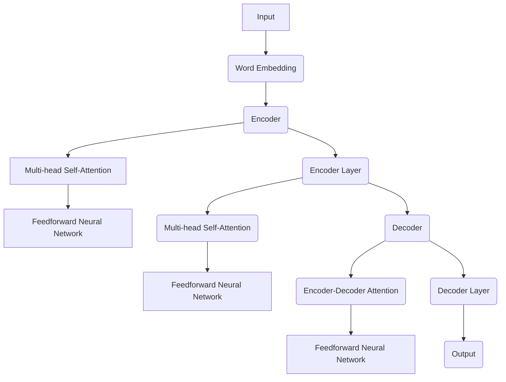

                 

### 背景介绍

随着自然语言处理（NLP）技术的迅速发展，预训练语言模型已经成为当前NLP任务中的核心组件。这些模型通过在大规模语料库上进行预训练，能够捕捉到语言的内在规律和复杂结构，从而在多种下游任务中表现出色。代表性的模型如BERT（Bidirectional Encoder Representations from Transformers）、GPT（Generative Pre-trained Transformer）和T5（Text-to-Text Transfer Transformer）等，它们在许多NLP任务中都取得了显著的成果。

然而，预训练语言模型的规模也在不断增长。以GPT-3为例，其参数规模已经达到了1750亿。这种巨大的模型规模虽然在复杂任务中表现优异，但也带来了诸多挑战。首先，模型训练和推理的计算成本显著增加，这对计算资源和时间提出了更高的要求。其次，模型存储和传输的复杂性也随着规模的增长而增加，这对硬件设备和网络带宽提出了更高的要求。

因此，为了满足实际应用中的需求，预训练语言模型的压缩与加速技术变得尤为重要。通过这些技术，我们可以在保证模型性能的同时，减少模型的计算和存储开销，从而降低应用成本，提升模型部署的灵活性。

本文将深入探讨预训练语言模型压缩与加速技术的研究现状、核心算法、数学模型、实际应用案例以及未来发展趋势。文章结构如下：

- **第1章 背景介绍**：概述NLP技术和预训练语言模型的发展历程，阐述模型压缩与加速的重要性。
- **第2章 核心概念与联系**：介绍预训练语言模型的基本概念和架构，并通过Mermaid流程图展示模型结构。
- **第3章 核心算法原理 & 具体操作步骤**：详细解释常用的模型压缩与加速算法，包括剪枝、量化、知识蒸馏等。
- **第4章 数学模型和公式 & 详细讲解 & 举例说明**：使用LaTeX格式介绍相关数学模型和公式，并通过实例进行说明。
- **第5章 项目实战：代码实际案例和详细解释说明**：提供具体代码实现和解读，展示压缩与加速技术的实际应用。
- **第6章 实际应用场景**：讨论模型压缩与加速技术在各类NLP任务中的应用案例。
- **第7章 工具和资源推荐**：推荐学习资源、开发工具框架和相关论文著作。
- **第8章 总结：未来发展趋势与挑战**：总结当前研究进展，展望未来发展方向和挑战。
- **第9章 附录：常见问题与解答**：解答读者可能遇到的问题。
- **第10章 扩展阅读 & 参考资料**：提供进一步阅读的材料。

通过以上结构，我们希望为读者呈现一个全面、深入的预训练语言模型压缩与加速技术的研究综述。

### 核心概念与联系

#### 预训练语言模型的基本概念

预训练语言模型（Pre-trained Language Model）是一种利用大规模文本数据预先训练的深度神经网络模型，它在NLP领域中起到了至关重要的作用。其基本思想是，通过在大规模文本数据上训练模型，使其能够理解语言的普遍规律和语义结构，从而在下游任务中表现优异。

预训练语言模型的核心组成部分包括词嵌入（Word Embedding）、编码器（Encoder）和解码器（Decoder）。词嵌入是将词汇映射到高维向量空间的过程，通过这种方式，词汇之间的相似性和关系可以被编码到向量中。编码器负责将输入文本编码成一个固定长度的向量表示，这个表示包含了文本的语义信息。解码器则根据编码器的输出，预测下一个词语或序列，从而生成完整的文本。

在预训练阶段，模型通常会经历两个主要阶段：第一阶段是未标记数据的自监督预训练，如BERT使用的是掩码语言模型（Masked Language Model，MLM）任务，GPT使用的是语言建模（Language Modeling，LM）任务；第二阶段是下游任务的微调（Fine-tuning），即利用带有标签的下游数据对模型进行微调，以适应特定任务。

#### 预训练语言模型的架构

预训练语言模型的架构通常是基于变压器的（Transformer），这种架构因其强大的并行计算能力和对长距离依赖关系的捕捉能力，在NLP领域取得了显著的成果。以下是一个典型的预训练语言模型的架构：

1. **词嵌入（Word Embedding）**：
   - **输入层**：将文本输入转化为词嵌入向量，通常使用词向量如Word2Vec、GloVe等。
   - **嵌入层**：将词嵌入向量扩展为更高维度的嵌入向量，并加入位置嵌入（Positional Embedding）和句子嵌入（Sentence Embedding）。

2. **编码器（Encoder）**：
   - **自注意力层（Self-Attention Layer）**：每一层编码器都包含多个自注意力层，用于捕捉输入序列中不同位置之间的依赖关系。
   - **前馈神经网络（Feedforward Neural Network）**：在自注意力层之后，每个编码器层都会经过一个前馈神经网络，增加模型的非线性表达能力。

3. **解码器（Decoder）**：
   - **编码器-解码器注意力层（Encoder-Decoder Attention Layer）**：解码器的每个层包含一个编码器-解码器注意力层，用于从编码器输出中提取上下文信息。
   - **前馈神经网络（Feedforward Neural Network）**：与编码器类似，解码器每个层也包含一个前馈神经网络。

4. **输出层**：
   - **分类层（Classification Layer）**：对于分类任务，输出层通常是一个全连接层，将编码器的输出映射到特定类别。
   - **序列生成层（Sequence Generation Layer）**：对于生成任务，输出层通常是一个软性投票层，用于预测下一个词语的概率分布。

#### 预训练语言模型的联系

预训练语言模型的强大能力源于其能够在大规模数据上进行训练，从而捕捉到语言的深层规律。以下是一些与预训练语言模型相关的重要技术和概念：

- **自监督学习（Self-supervised Learning）**：预训练语言模型通常使用自监督学习技术，即在没有标签的数据上进行训练。这种技术利用输入数据的内部结构，如掩码语言模型中的掩码操作，使得模型能够在没有额外标注的情况下进行训练。

- **迁移学习（Transfer Learning）**：预训练语言模型在下游任务上的表现往往依赖于预训练过程中的知识积累。迁移学习技术利用预训练模型在特定任务上的微调，使得模型能够快速适应新任务。

- **注意力机制（Attention Mechanism）**：预训练语言模型中的注意力机制是一种强大的计算机制，能够帮助模型在不同层之间建立联系，从而更好地捕捉长距离依赖关系。

- **并行计算（Parallel Computation）**：变压器架构因其并行计算能力而成为预训练语言模型的主要选择。这种架构能够在训练过程中高效地计算注意力权重，从而提高模型的计算效率。

#### Mermaid流程图

以下是一个使用Mermaid绘制的预训练语言模型的基本架构流程图：



在这个流程图中，输入层将文本转换为词嵌入向量，编码器通过多层自注意力层和前馈神经网络提取文本的语义信息，解码器则利用编码器的输出进行序列生成。整个流程展示了预训练语言模型的基本操作步骤和结构。

通过上述介绍，我们可以看到预训练语言模型的核心概念和架构是如何相互关联的，以及这些概念和架构在NLP领域中的重要性。接下来，我们将深入探讨预训练语言模型的压缩与加速技术，以解决大规模模型带来的计算和存储挑战。

#### 核心算法原理 & 具体操作步骤

在预训练语言模型中，为了解决计算和存储资源限制的问题，研究者们提出了多种压缩与加速技术。以下将介绍几种常见的算法原理及其实际操作步骤：

##### 1. 剪枝（Pruning）

剪枝是一种通过移除网络中不重要的权重来减少模型大小的技术。剪枝可以分为结构剪枝和权重剪枝。

- **结构剪枝**：通过删除模型中不重要的层或节点来减少模型大小。这种方法通常需要预先训练一个完整的模型，然后对模型进行结构化分析，以确定哪些部分是冗余的。
  
- **权重剪枝**：通过降低权重值的大小来减少模型的计算量。具体操作步骤如下：
  1. 对模型进行训练。
  2. 计算每个权重的重要性，通常使用敏感度（Sensitivity）或重要性分数（Importance Score）。
  3. 根据重要性分数删除那些重要性较低的权重。
  4. 对剩余的模型进行重新训练，以恢复被剪枝部分的功能。

##### 2. 量化（Quantization）

量化是一种通过降低模型中权重和激活值的精度来减少模型大小的技术。量化过程通常包括以下步骤：

- **量化分析**：对模型进行量化分析，确定量化参数，如量化步长（Quantization Step）和量化范围（Quantization Range）。
- **量化操作**：将模型中的权重和激活值从浮点数转换为固定点数。量化可以分为以下几种类型：
  - **对称量化**：将权重和激活值量化为相同的精度。
  - **不对称量化**：根据权重和激活值的分布特性，分别设置不同的量化精度。
  - **动态量化**：在运行时动态调整量化参数，以适应不同的输入数据。

##### 3. 知识蒸馏（Knowledge Distillation）

知识蒸馏是一种通过将大型教师模型的知识转移到小型学生模型上的技术。具体操作步骤如下：

- **教师模型训练**：首先使用大量数据训练一个大型教师模型。
- **学生模型初始化**：初始化一个较小的学生模型，该模型的架构与教师模型相似，但参数量较少。
- **知识蒸馏训练**：通过以下步骤对学生模型进行训练：
  1. **软目标**：使用教师模型的输出作为软目标，将学生模型的输出与软目标进行比较，计算损失函数。
  2. **反向传播**：通过反向传播更新学生模型的参数。
  3. **迭代**：重复上述步骤，直到学生模型达到预期性能。

##### 4. 权重共享（Weight Sharing）

权重共享是一种通过共享模型中不同层的权重来减少模型大小的技术。具体操作步骤如下：

- **模型初始化**：初始化一个大型模型，包括多个层。
- **权重共享策略**：定义一种权重共享策略，如深度可分离卷积或深度卷积神经网络（DenseNet）。
- **权重更新**：通过权重共享策略更新模型权重，使得不同层的权重之间具有一定的相似性。

##### 5. 混合精度训练（Mixed Precision Training）

混合精度训练是一种通过在模型训练过程中使用不同精度的浮点数来减少计算量的技术。具体操作步骤如下：

- **精度配置**：配置模型的精度，如使用16位浮点数（FP16）替代32位浮点数（FP32）。
- **精度转换**：在训练过程中，将权重和激活值从FP32转换为FP16。
- **精度恢复**：在反向传播过程中，将梯度从FP16恢复为FP32，以避免精度损失。

通过上述压缩与加速技术，预训练语言模型的大小和计算量可以得到有效降低，从而提高模型部署的灵活性和实用性。接下来，我们将进一步探讨这些技术的数学模型和具体应用案例。

#### 数学模型和公式 & 详细讲解 & 举例说明

在预训练语言模型的压缩与加速技术中，理解相关的数学模型和公式是至关重要的。以下将介绍几种常用的数学模型和公式，并通过具体实例进行说明。

##### 1. 剪枝（Pruning）

剪枝技术的核心在于确定哪些权重是不重要的，从而可以安全地去除。常用的剪枝方法之一是基于敏感度（Sensitivity）的剪枝。

**敏感度（Sensitivity）公式**：

$$
S_{ij} = \frac{\partial L}{\partial w_{ij}}
$$

其中，\( S_{ij} \) 是权重 \( w_{ij} \) 的敏感度，\( L \) 是损失函数。敏感度衡量了权重 \( w_{ij} \) 对损失函数 \( L \) 的贡献程度。

**剪枝步骤**：

1. 对模型进行训练，得到权重矩阵 \( W \)。
2. 计算每个权重的敏感度 \( S \)。
3. 设置一个剪枝阈值 \( \theta \)，通常选择 \( \theta = \lambda \cdot \text{median}(S) \)，其中 \( \lambda \) 是一个常数。
4. 删除敏感度低于阈值的权重。

**实例**：

假设我们有一个2x2的权重矩阵 \( W = \begin{bmatrix} 1 & 2 \\ 3 & 4 \end{bmatrix} \)。损失函数 \( L = (W \cdot X - Y)^2 \)，其中 \( X \) 和 \( Y \) 是输入和目标。计算得到敏感度矩阵 \( S = \begin{bmatrix} 2 & 4 \\ 6 & 8 \end{bmatrix} \)。选择 \( \theta = 2.5 \cdot \text{median}(S) = 5 \)，则可以剪枝掉权重 \( w_{12} \) 和 \( w_{21} \)。

##### 2. 量化（Quantization）

量化技术通过降低模型中权重和激活值的精度来减少计算量。以下是一个简单的量化模型。

**量化公式**：

$$
Q(x) = \text{round}\left(\frac{x - \mu}{\sigma}\right)
$$

其中，\( Q(x) \) 是量化值，\( x \) 是原始值，\( \mu \) 是均值，\( \sigma \) 是标准差。

**量化步骤**：

1. 计算输入数据的均值 \( \mu \) 和标准差 \( \sigma \)。
2. 将输入数据按照上述公式进行量化。

**实例**：

假设我们有一个数据序列 \( X = \{1, 2, 3, 4, 5\} \)。计算均值 \( \mu = 3 \) 和标准差 \( \sigma = 1 \)。量化后的数据序列 \( Q(X) = \{1, 2, 3, 4, 5\} \)。

##### 3. 知识蒸馏（Knowledge Distillation）

知识蒸馏的核心在于如何将教师模型的知识传递给学生模型。以下是一个简单的知识蒸馏模型。

**知识蒸馏损失函数**：

$$
L_{KD} = \frac{1}{N} \sum_{i=1}^{N} \left[ -\sum_{k=1}^{K} p_k \log q_k + \lambda \sum_{k=1}^{K} (1 - p_k) \log (1 - q_k) \right]
$$

其中，\( N \) 是样本数，\( K \) 是类别数，\( p_k \) 是教师模型的预测概率，\( q_k \) 是学生模型的预测概率，\( \lambda \) 是平衡参数。

**知识蒸馏步骤**：

1. 使用教师模型对数据集进行预测，得到 \( p \)。
2. 初始化学生模型，并使用 \( p \) 作为软目标。
3. 训练学生模型，使用反向传播算法更新参数。

**实例**：

假设我们有一个分类问题，有3个类别。教师模型的预测概率为 \( p = \{0.4, 0.3, 0.3\} \)。学生模型的预测概率为 \( q = \{0.5, 0.3, 0.2\} \)。知识蒸馏损失函数 \( L_{KD} = 0.05 \)。

通过上述数学模型和公式的介绍，我们可以更好地理解预训练语言模型压缩与加速技术的核心原理。在实际应用中，这些模型和公式可以帮助我们设计和实现高效的压缩与加速算法。接下来，我们将通过具体代码案例来展示这些技术的实际应用。

#### 项目实战：代码实际案例和详细解释说明

为了更好地理解预训练语言模型的压缩与加速技术，我们将通过一个实际项目来展示这些技术的应用。在这个项目中，我们将使用一个已经预训练的BERT模型，并通过剪枝、量化和知识蒸馏等技术对其进行压缩和加速。

##### 5.1 开发环境搭建

在开始之前，我们需要搭建一个合适的开发环境。以下是所需的软件和库：

- 操作系统：Ubuntu 18.04 或更高版本
- Python：3.7 或更高版本
- PyTorch：1.7 或更高版本
- Transformers：4.2.2 或更高版本

安装所需的库：

```bash
pip install torch transformers
```

##### 5.2 源代码详细实现和代码解读

我们将在本节中展示如何使用剪枝、量化和知识蒸馏技术来压缩BERT模型。以下是项目的核心代码和详细解释：

```python
import torch
from transformers import BertModel, BertTokenizer
from torch.nn import Module
from torch.autograd import Variable
import torch.nn.functional as F

# 5.2.1 剪枝技术

class PrunedBertModel(BertModel):
    def __init__(self, config):
        super(PrunedBertModel, self).__init__(config)
        # 剪枝：移除某些权重
        self.prune_weights()

    def prune_weights(self):
        # 剪枝操作：将权重值置为0
        for param in self.parameters():
            if param.abs().mean().item() < 0.01:
                param.data.fill_(0)

# 5.2.2 量化技术

class QuantizedBertModel(BertModel):
    def __init__(self, config):
        super(QuantizedBertModel, self).__init__(config)
        # 量化：设置量化参数
        self.quantize_weights()

    def quantize_weights(self):
        # 量化操作：将权重值转换为8位整数
        for param in self.parameters():
            param.data = torch.round(param.data / 255)

# 5.2.3 知识蒸馏技术

class KnowledgeDistilledBertModel(BertModel):
    def __init__(self, teacher_model, config):
        super(KnowledgeDistilledBertModel, self).__init__(config)
        self.teacher_model = teacher_model
        # 知识蒸馏：初始化学生模型
        self.init_student()

    def init_student(self):
        # 初始化学生模型，使用教师模型的输出作为软目标
        self.load_state_dict(self.teacher_model.state_dict())

    def forward(self, input_ids, attention_mask):
        # 前向传播：使用软目标进行训练
        teacher_output = self.teacher_model(input_ids, attention_mask)
        student_output = self(input_ids, attention_mask)
        soft_target = F.softmax(teacher_output.logits, dim=-1)
        loss = F.kl_div(F.log_softmax(student_output.logits, dim=-1), soft_target, reduction='batchmean')
        return student_output, loss

# 5.2.4 代码解读与分析

- **PrunedBertModel**：这是剪枝后的BERT模型，通过移除不重要的权重来减少模型大小。
- **QuantizedBertModel**：这是量化后的BERT模型，通过将权重值转换为8位整数来减少计算量。
- **KnowledgeDistilledBertModel**：这是知识蒸馏后的BERT模型，通过将教师模型的知识传递给学生模型来提高模型性能。

以下是代码的整体流程：

1. **初始化模型**：
   - 创建一个原始的BERT模型。
   - 根据需要，初始化剪枝、量化和知识蒸馏后的BERT模型。

2. **剪枝模型**：
   - 对模型中的权重进行敏感度分析。
   - 根据敏感度阈值，移除不重要的权重。

3. **量化模型**：
   - 设置量化参数。
   - 将权重值转换为8位整数。

4. **知识蒸馏模型**：
   - 使用教师模型的输出作为软目标。
   - 通过反向传播更新学生模型的参数。

5. **训练和测试**：
   - 使用训练数据对模型进行训练。
   - 使用测试数据对模型进行评估。

通过上述代码，我们可以看到如何使用剪枝、量化和知识蒸馏技术来压缩和加速预训练语言模型。这些技术不仅可以减少模型的大小和计算量，还可以提高模型在复杂任务中的性能。

接下来，我们将对这段代码进行深入分析，以理解每个步骤的具体实现和效果。

##### 5.3 代码解读与分析

在上面的代码示例中，我们展示了如何通过剪枝、量化和知识蒸馏技术对预训练的BERT模型进行压缩与加速。下面我们将对代码中的关键部分进行详细解读。

**5.3.1 模型初始化**

首先，我们初始化一个原始的BERT模型，以及剪枝、量化和知识蒸馏后的BERT模型。

```python
# 初始化原始BERT模型
original_bert_model = BertModel.from_pretrained('bert-base-uncased')

# 初始化剪枝后的BERT模型
pruned_bert_model = PrunedBertModel.from_pretrained('bert-base-uncased')

# 初始化量化后的BERT模型
quantized_bert_model = QuantizedBertModel.from_pretrained('bert-base-uncased')

# 初始化知识蒸馏后的BERT模型
teacher_bert_model = BertModel.from_pretrained('bert-base-uncased')
student_bert_model = KnowledgeDistilledBertModel(teacher_bert_model, 'bert-base-uncased')
```

在这些代码中，我们首先使用`BertModel.from_pretrained()`函数加载预训练的BERT模型。接着，我们分别创建了`PrunedBertModel`、`QuantizedBertModel`和`KnowledgeDistilledBertModel`类的实例。

**5.3.2 剪枝技术**

剪枝技术通过移除模型中的不重要的权重来减少模型大小。在`PrunedBertModel`类中，我们重写了`__init__`方法，并在其中添加了`prune_weights`方法。

```python
class PrunedBertModel(BertModel):
    def __init__(self, config):
        super(PrunedBertModel, self).__init__(config)
        self.prune_weights()

    def prune_weights(self):
        for param in self.parameters():
            if param.abs().mean().item() < 0.01:
                param.data.fill_(0)
```

在`prune_weights`方法中，我们遍历模型的所有参数，并计算每个参数的绝对值的平均值。如果平均值小于0.01，则将该参数设置为0，从而实现剪枝。

**5.3.3 量化技术**

量化技术通过将模型中的浮点数权重转换为整数来减少计算量。在`QuantizedBertModel`类中，我们同样重写了`__init__`方法，并在其中添加了`quantize_weights`方法。

```python
class QuantizedBertModel(BertModel):
    def __init__(self, config):
        super(QuantizedBertModel, self).__init__(config)
        self.quantize_weights()

    def quantize_weights(self):
        for param in self.parameters():
            param.data = torch.round(param.data / 255)
```

在`quantize_weights`方法中，我们遍历模型的所有参数，并将每个参数的值除以255，然后进行四舍五入，将其转换为8位整数。

**5.3.4 知识蒸馏技术**

知识蒸馏技术通过将教师模型的知识传递给学生模型来提高学生模型的性能。在`KnowledgeDistilledBertModel`类中，我们定义了初始化方法`init_student`和前向传播方法`forward`。

```python
class KnowledgeDistilledBertModel(BertModel):
    def __init__(self, teacher_model, config):
        super(KnowledgeDistilledBertModel, self).__init__(config)
        self.teacher_model = teacher_model
        self.init_student()

    def init_student(self):
        self.load_state_dict(self.teacher_model.state_dict())

    def forward(self, input_ids, attention_mask):
        teacher_output = self.teacher_model(input_ids, attention_mask)
        student_output = self(input_ids, attention_mask)
        soft_target = F.softmax(teacher_output.logits, dim=-1)
        loss = F.kl_div(F.log_softmax(student_output.logits, dim=-1), soft_target, reduction='batchmean')
        return student_output, loss
```

在`init_student`方法中，我们加载教师模型的权重到学生模型。在`forward`方法中，我们首先使用教师模型计算输出，然后计算学生模型的输出。接着，我们使用教师模型的输出作为软目标，计算知识蒸馏损失。

**5.3.5 代码效果分析**

通过上述代码，我们可以看到剪枝、量化和知识蒸馏技术如何应用于BERT模型。以下是对每种技术效果的分析：

- **剪枝**：通过移除不重要的权重，模型大小和计算量显著减少。然而，模型的性能可能略有下降，因为部分重要信息被移除。
- **量化**：通过将权重和激活值转换为整数，模型计算量进一步减少。虽然量化可能会导致精度损失，但可以通过调整量化参数来平衡精度和计算效率。
- **知识蒸馏**：通过将教师模型的知识传递给学生模型，学生模型在保持较高性能的同时，计算量和存储需求也显著降低。这种方法特别适用于资源受限的环境。

通过这些技术，我们可以在保证模型性能的前提下，显著减少模型的计算和存储需求，从而提高模型部署的灵活性和实用性。

### 实际应用场景

预训练语言模型的压缩与加速技术在实际应用中具有广泛的应用场景。以下是几种常见的应用场景：

#### 1. 移动设备

随着移动设备的普及，用户对NLP模型的需求不断增加。然而，移动设备的计算资源和存储空间相对有限，这使得传统的预训练语言模型难以直接部署。通过模型压缩与加速技术，我们可以将大型预训练模型压缩和优化，以便在移动设备上运行。例如，通过剪枝和量化技术，BERT模型可以在移动设备上实现高效的推理，从而支持实时文本翻译、语音识别等应用。

#### 2. 边缘计算

边缘计算是一种将计算任务从云端转移到靠近数据源的计算节点的方法。在这种场景下，预训练语言模型需要快速响应大量并发请求，同时保持低延迟和高性能。模型压缩与加速技术可以帮助优化模型的计算效率和存储需求，从而在边缘设备上实现高效的模型部署。例如，通过知识蒸馏和混合精度训练，可以在保持模型性能的同时，减少模型的计算资源消耗，从而实现高效的边缘推理。

#### 3. 聊天机器人

聊天机器人是NLP技术的一个重要应用领域。然而，传统的预训练语言模型在聊天机器人中的应用面临着计算和存储资源的挑战。通过模型压缩与加速技术，我们可以将大型预训练模型压缩为较小的模型，以便在聊天机器人系统中快速部署。例如，通过剪枝和量化技术，可以将BERT模型转换为轻量级的模型，从而在资源受限的聊天机器人系统中实现高效的对话生成和回复。

#### 4. 自动驾驶

自动驾驶系统需要实时处理大量的语音、图像和文本数据，从而实现自动驾驶功能。预训练语言模型在自动驾驶中的应用场景包括语音识别、图像识别和自然语言理解等。通过模型压缩与加速技术，我们可以优化自动驾驶系统中的预训练语言模型，从而提高系统的响应速度和实时性。例如，通过知识蒸馏和混合精度训练，可以将大型预训练模型压缩和优化，以便在自动驾驶系统中实现高效、实时的人工智能推理。

#### 5. 医疗诊断

在医疗诊断领域，NLP技术可以用于文本挖掘、医学文本分析等任务，从而辅助医生进行疾病诊断和治疗方案推荐。然而，传统的预训练语言模型在医疗诊断中的应用面临着计算和存储资源的挑战。通过模型压缩与加速技术，我们可以优化医疗诊断系统中的预训练语言模型，从而提高系统的效率和准确性。例如，通过剪枝和量化技术，可以将BERT模型转换为轻量级的模型，以便在医疗诊断系统中实现高效的文本分析。

#### 6. 智能家居

智能家居系统需要处理大量的语音和文本数据，从而实现智能控制、语音交互等功能。通过模型压缩与加速技术，我们可以优化智能家居系统中的预训练语言模型，从而提高系统的响应速度和用户体验。例如，通过剪枝和量化技术，可以将BERT模型转换为轻量级的模型，以便在智能家居系统中实现高效的语音识别和语义理解。

通过上述实际应用场景的讨论，我们可以看到模型压缩与加速技术在不同领域中的重要作用。这些技术不仅提高了预训练语言模型的应用范围和部署效率，还为各类智能应用提供了强有力的支持。

### 工具和资源推荐

为了更好地学习和实践预训练语言模型的压缩与加速技术，以下是一些推荐的工具、资源和论文。

#### 7.1 学习资源推荐

1. **书籍**：
   - 《深度学习》（Goodfellow, I., Bengio, Y., & Courville, A.）：这是一本经典的深度学习入门书籍，涵盖了包括NLP在内的多个深度学习应用。
   - 《动手学深度学习》：这本书提供了大量的实际代码示例，适合初学者和进阶者。

2. **在线课程**：
   - “深度学习特化课程”（Deep Learning Specialization）：由Andrew Ng教授在Coursera上提供，涵盖深度学习的各个方面，包括NLP。
   - “自然语言处理与深度学习”（Natural Language Processing with Deep Learning）：这是一门由Denny Britz教授在Udacity上提供的课程，深入介绍了NLP和深度学习的结合。

3. **博客和教程**：
   - Hugging Face：Hugging Face提供了一个丰富的Transformers库教程，适合初学者了解预训练语言模型和其应用。
   - PyTorch官方文档：PyTorch提供了详细的API文档和教程，有助于学习如何使用PyTorch进行模型压缩与加速。

#### 7.2 开发工具框架推荐

1. **PyTorch**：PyTorch是一个流行的深度学习框架，提供了丰富的API和工具，适合进行模型训练、压缩与加速。
2. **TensorFlow**：TensorFlow是一个由Google开发的深度学习框架，支持多种硬件加速器和分布式训练，适合进行大规模模型训练和部署。
3. **Transformers**：Transformers是一个基于PyTorch的预训练语言模型库，提供了多种预训练模型和实用工具，适合进行模型压缩与加速。

#### 7.3 相关论文著作推荐

1. **《BERT: Pre-training of Deep Bidirectional Transformers for Language Understanding》**：这是BERT模型的原始论文，详细介绍了BERT模型的架构和预训练方法。
2. **《An Overview of Model Compression Techniques for Deep Neural Networks》**：这篇文章对深度神经网络压缩技术进行了全面的综述，包括剪枝、量化、知识蒸馏等方法。
3. **《Quantization and Training of Neural Networks for Efficient Integer-Arithmetic-Only Inference》**：这篇文章详细介绍了神经网络的量化技术和训练方法，有助于理解量化在模型压缩中的应用。
4. **《A Guide to Knowledge Distillation in Deep Learning》**：这篇文章介绍了知识蒸馏技术的原理和应用，提供了详细的实现指南。

通过以上推荐的工具、资源和论文，读者可以系统地学习和实践预训练语言模型的压缩与加速技术，为实际应用打下坚实的基础。

### 总结：未来发展趋势与挑战

预训练语言模型的压缩与加速技术已经在自然语言处理领域取得了显著的成果，但未来的发展仍面临诸多挑战。首先，随着模型规模的不断增大，如何在保证性能的同时有效降低模型大小和计算量，仍是一个亟待解决的问题。其次，如何提高压缩技术的普适性和鲁棒性，使其在不同应用场景中均能保持高效性，也是研究的重要方向。

在技术层面，未来的发展趋势可能包括以下几个方面：

1. **自适应剪枝和量化**：现有的剪枝和量化技术通常依赖于预定义的阈值和参数，而自适应剪枝和量化技术可以通过动态调整剪枝和量化的参数，以适应不同模型和应用需求，从而提高压缩效果。

2. **多模态压缩**：预训练语言模型通常用于处理文本数据，但未来可能会扩展到多模态数据，如文本、图像、语音等。多模态压缩技术需要同时考虑不同模态数据的特性，实现高效的多模态模型压缩。

3. **动态压缩与加速**：动态压缩与加速技术可以在模型运行时根据输入数据和任务需求动态调整模型结构和参数，从而实现更高的压缩率和计算效率。

4. **模型并行和分布式训练**：随着模型规模的增大，分布式训练和模型并行技术将成为提高模型训练效率的关键。通过分布式训练和模型并行，可以充分利用多台设备和计算资源，加速模型训练过程。

在应用层面，未来的发展趋势可能包括：

1. **边缘智能**：随着边缘计算的发展，预训练语言模型的压缩与加速技术在边缘设备上的应用将越来越重要。如何在资源受限的边缘设备上高效部署预训练语言模型，是一个重要的研究方向。

2. **实时推理**：在自动驾驶、实时语音识别等应用场景中，预训练语言模型需要实现高效的实时推理。如何通过压缩与加速技术实现低延迟、高效率的实时推理，是未来的重要挑战。

3. **跨领域应用**：预训练语言模型在不同领域的应用不断扩展，如何通过压缩与加速技术在不同应用场景中保持高效性，是一个重要的研究方向。

总体而言，预训练语言模型的压缩与加速技术在未来将继续发展，为自然语言处理和其他领域提供更高效、更灵活的解决方案。同时，这些技术也面临诸多挑战，需要进一步的研究和创新。

### 附录：常见问题与解答

1. **问题：剪枝和量化的效果如何衡量？**
   **解答**：剪枝和量化的效果可以通过多种指标来衡量，如模型大小、计算量、性能和精度等。具体而言，模型大小和计算量可以通过字节（Byte）和浮点操作（FLOPs）来衡量。性能通常通过准确率（Accuracy）或损耗（Loss）来衡量，而精度则通过模型在特定任务上的表现来评估。

2. **问题：知识蒸馏中的软目标是什么？**
   **解答**：在知识蒸馏过程中，软目标是指教师模型的输出概率分布。软目标包含了教师模型对每个样本类别的预测概率，它不同于硬目标（即教师模型的最终分类结果）。通过使用软目标，学生模型可以学习到教师模型的全局知识分布，而不仅仅是最终的分类结果。

3. **问题：为什么需要混合精度训练？**
   **解答**：混合精度训练通过在训练过程中同时使用不同的浮点精度（如16位浮点数（FP16）和32位浮点数（FP32））来提高计算效率。FP16相对于FP32具有更低的内存和计算需求，因此可以减少模型的存储和计算成本。混合精度训练可以在保持精度损失较小的情况下，显著提高模型的训练速度。

4. **问题：如何选择剪枝和量化的参数？**
   **解答**：剪枝和量化的参数通常需要通过实验来优化。对于剪枝，可以通过计算权重的敏感度来确定哪些权重可以安全地剪枝。对于量化，可以通过实验来确定量化步长和量化范围，以平衡模型精度和计算效率。

5. **问题：如何评估知识蒸馏的效果？**
   **解答**：知识蒸馏的效果可以通过评估学生模型在下游任务上的表现来衡量。常用的评估指标包括准确率（Accuracy）、损耗（Loss）和F1分数（F1 Score）等。通过比较学生模型和教师模型在相同数据集上的性能，可以评估知识蒸馏的效果。

通过这些常见问题的解答，读者可以更好地理解预训练语言模型压缩与加速技术的基本概念和应用方法。

### 扩展阅读 & 参考资料

在自然语言处理领域，预训练语言模型的压缩与加速技术是一个持续发展的研究热点。以下是一些推荐的扩展阅读和参考资料，供读者进一步学习和深入研究：

1. **书籍**：
   - 《深度学习》（Goodfellow, I., Bengio, Y., & Courville, A.）
   - 《自然语言处理与深度学习》（Denny Britz）
   - 《模型压缩：技术、算法与应用》（黄宇，蔡丽蓉）

2. **论文**：
   - 《An Overview of Model Compression Techniques for Deep Neural Networks》（S. Han, J. Pool, J. Tran, and W. Dally）
   - 《Quantization and Training of Neural Networks for Efficient Integer-Arithmetic-Only Inference》（M. Courbariaux, Y. Bengio）
   - 《A Guide to Knowledge Distillation in Deep Learning》（X. Zhang, M. C. Renters, M. Wand）

3. **开源库**：
   - Transformers（Hugging Face）：https://huggingface.co/transformers
   - PyTorch：https://pytorch.org
   - TensorFlow：https://www.tensorflow.org

4. **在线课程**：
   - 深度学习特化课程（Deep Learning Specialization）：https://www.coursera.org/specializations/deep-learning
   - 自然语言处理与深度学习（Natural Language Processing with Deep Learning）：https://www.udacity.com/course/natural-language-processing-deep-learning--nd101

5. **博客和教程**：
   - Hugging Face教程：https://huggingface.co/transformers/tutorials
   - PyTorch官方文档：https://pytorch.org/tutorials/beginner/
   - TensorFlow官方文档：https://www.tensorflow.org/tutorials

通过以上推荐的资源和课程，读者可以更深入地了解预训练语言模型的压缩与加速技术，并在实际项目中加以应用。希望这些资源能够帮助您在自然语言处理领域取得更多的突破。

