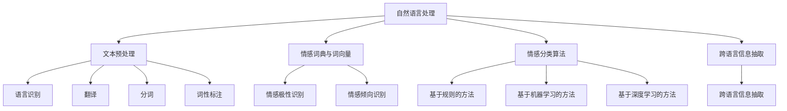

                 

# 自然语言处理在多语言情感分析中的应用

## 概述

自然语言处理（Natural Language Processing，NLP）是计算机科学和人工智能领域中的一个重要分支，其目标是让计算机能够理解、解释和生成人类语言。随着全球化的推进，多语言情感分析成为了一个亟待解决的重要问题。情感分析旨在从文本中提取情感信息，以便更好地理解和分析人类情感状态。多语言情感分析则进一步扩展了这一领域，使得计算机能够处理多种语言的情感信息。

本文旨在探讨自然语言处理在多语言情感分析中的应用，通过分析现有的相关技术、核心算法和实际应用案例，为该领域的研究者和开发者提供有益的参考。文章结构如下：

- 第1章：背景介绍
- 第2章：核心概念与联系
- 第3章：核心算法原理与具体操作步骤
- 第4章：数学模型和公式及详细讲解
- 第5章：项目实战：代码实际案例与详细解释说明
- 第6章：实际应用场景
- 第7章：工具和资源推荐
- 第8章：总结：未来发展趋势与挑战
- 第9章：附录：常见问题与解答
- 第10章：扩展阅读与参考资料

关键词：自然语言处理，多语言情感分析，核心算法，数学模型，应用场景，工具资源

摘要：本文全面介绍了自然语言处理在多语言情感分析中的应用。首先，我们探讨了自然语言处理和多语言情感分析的基本概念和联系；接着，我们分析了当前在该领域使用的主要算法和技术，并详细讲解了这些算法的原理和操作步骤；随后，我们通过数学模型和公式的形式，进一步阐述了这些算法的实现方法；然后，我们通过一个实际项目案例，展示了如何使用这些算法处理多语言情感分析任务；接着，我们探讨了多语言情感分析在实际应用中的场景；最后，我们推荐了一些相关工具和资源，总结了未来发展趋势与挑战，并提供了常见问题与解答。

## 1. 背景介绍

### 1.1 自然语言处理

自然语言处理（NLP）是人工智能（AI）的一个重要分支，旨在使计算机能够理解和生成自然语言。自然语言是人类用于交流的主要方式，包含了大量的情感、意图、知识等信息。因此，理解和处理自然语言对于实现智能化和自动化的计算机系统具有重要意义。

自然语言处理的核心任务包括文本预处理、语义理解、情感分析、机器翻译等。文本预处理是对原始文本进行清洗、分词、词性标注等处理，为后续的语义理解任务做好准备。语义理解是计算机对文本内容的理解过程，包括词义消歧、实体识别、关系提取等。情感分析则是对文本中的情感倾向和情感极性进行识别，以便了解用户的情感状态。机器翻译是将一种语言的文本翻译成另一种语言的文本，是自然语言处理领域的经典问题。

### 1.2 多语言情感分析

随着全球化的深入发展，多语言情感分析成为了一个重要的研究领域。多语言情感分析旨在处理多种语言的情感信息，使得计算机能够理解和分析不同语言的情感状态。

多语言情感分析的研究意义在于：

1. **跨语言交流**：多语言情感分析能够帮助计算机理解和处理不同语言的情感信息，从而促进跨语言交流。
2. **数据多样性**：不同语言的文本蕴含了丰富的情感信息，多语言情感分析能够充分利用这些数据，提高情感分析模型的准确性和泛化能力。
3. **应用广泛**：多语言情感分析在社交媒体分析、市场调研、舆情监测、智能客服等领域具有广泛的应用。

### 1.3 自然语言处理与多语言情感分析的关系

自然语言处理是多语言情感分析的基础，为其提供了文本预处理、语义理解等关键技术。没有自然语言处理的支持，多语言情感分析将无法进行。同时，多语言情感分析也是自然语言处理的一个重要应用方向，其研究成果为自然语言处理算法的优化和创新提供了新的思路。

本文将围绕自然语言处理在多语言情感分析中的应用，详细分析现有的相关技术、核心算法和实际应用案例，以期为该领域的研究者和开发者提供有益的参考。接下来，我们将进一步探讨多语言情感分析的核心概念和联系，以便更好地理解这一领域。## 2. 核心概念与联系

### 2.1 多语言情感分析的基本概念

多语言情感分析是指对多种语言的文本进行情感极性和情感倾向的识别和分析。在多语言情感分析中，主要涉及以下核心概念：

- **情感极性**：情感极性是指文本中的情感是积极的还是消极的。通常，情感极性可以分为正面（positive）和负面（negative）两种。
- **情感倾向**：情感倾向是指文本中的情感是倾向于某种特定主题或观点。情感倾向分析可以帮助我们了解文本中情感的具体指向。
- **多语言**：多语言情感分析需要处理不同语言的文本，因此涉及语言识别、翻译、分词、词性标注等自然语言处理技术。

### 2.2 核心概念之间的联系

多语言情感分析涉及多个核心概念，这些概念之间有着密切的联系：

1. **自然语言处理与多语言情感分析**：自然语言处理（NLP）是多语言情感分析的基础，提供了文本预处理、语义理解等关键技术。没有自然语言处理的支持，多语言情感分析将无法进行。
   
2. **情感极性与情感倾向**：情感极性是情感倾向的基础，情感极性分析可以帮助我们了解文本的整体情感状态。而情感倾向分析则进一步揭示文本中的情感具体指向。

3. **多语言处理**：多语言情感分析需要处理多种语言的文本，因此需要涉及到语言识别、翻译、分词、词性标注等自然语言处理技术。这些技术为多语言情感分析提供了数据准备和预处理支持。

### 2.3 多语言情感分析的关键技术

为了实现多语言情感分析，需要涉及到一系列关键技术，主要包括：

1. **文本预处理**：文本预处理是对原始文本进行清洗、分词、词性标注等处理，以便为后续的语义理解任务做好准备。文本预处理是自然语言处理的基础，对于多语言情感分析尤为重要。
   
2. **情感词典与词向量**：情感词典是存储大量情感词及其对应情感极性和情感倾向的词典。词向量是将词语映射到高维空间中的向量表示，有助于捕捉词语的语义信息。

3. **情感分类算法**：情感分类算法用于对文本中的情感极性和情感倾向进行识别。常见的情感分类算法包括基于规则的方法、基于机器学习的方法和基于深度学习的方法。

4. **跨语言信息抽取**：跨语言信息抽取是指从一种语言的文本中抽取信息，并将其转换为另一种语言的文本。跨语言信息抽取是多语言情感分析的关键技术之一，有助于实现跨语言的情感分析。

### 2.4 Mermaid 流程图

为了更好地理解多语言情感分析的核心概念和联系，我们可以使用 Mermaid 流程图（Mermaid flowchart）来描述各核心概念和关键技术之间的关系。

以下是多语言情感分析的 Mermaid 流程图：



通过这个 Mermaid 流程图，我们可以清晰地看到多语言情感分析的核心概念、关键技术和它们之间的联系。在接下来的章节中，我们将详细讨论这些概念和技术的具体实现和应用。## 3. 核心算法原理 & 具体操作步骤

### 3.1 情感分类算法原理

情感分类算法是多语言情感分析的核心算法之一，其目标是根据文本内容判断情感极性或情感倾向。情感分类算法通常分为以下几种类型：

1. **基于规则的方法**：这种方法依赖于人工定义的规则，如情感词典和关键词匹配。通过检查文本中的关键词和情感词典中的情感词，判断文本的情感极性或情感倾向。例如，如果一个文本中出现了“喜欢”和“满意”这样的正面词汇，那么该文本可能具有正面的情感极性。

2. **基于机器学习的方法**：这种方法使用机器学习算法来训练模型，以便从文本中自动提取特征并进行分类。常见的机器学习算法包括朴素贝叶斯、支持向量机（SVM）、决策树等。这些算法可以从大量的标注数据中学习到情感分类的模式，然后对新文本进行情感分类。

3. **基于深度学习的方法**：这种方法使用深度学习模型，如卷积神经网络（CNN）、循环神经网络（RNN）和长短时记忆网络（LSTM）等，从文本中自动提取复杂特征并进行分类。深度学习模型具有强大的表征能力和泛化能力，在情感分类任务中表现出色。

### 3.2 情感分类算法的具体操作步骤

#### 基于规则的方法

1. **构建情感词典**：收集大量的情感词，并标注它们对应的情感极性（正面或负面）。例如，“喜欢”和“满意”是正面情感词，“不喜欢”和“失望”是负面情感词。

2. **文本预处理**：对输入文本进行清洗、分词和词性标注，以便提取文本中的关键词。

3. **关键词匹配**：检查文本中的关键词是否在情感词典中，并根据情感词典中的情感极性判断文本的情感极性。

4. **情感极性判断**：如果文本中的关键词数量较多且都是正面情感词，则判断文本具有正面情感极性；如果文本中的关键词数量较多且都是负面情感词，则判断文本具有负面情感极性。

#### 基于机器学习的方法

1. **特征提取**：对文本进行分词和词性标注，然后将文本表示为特征向量。常见的特征提取方法包括词袋模型（Bag of Words，BoW）和词嵌入（Word Embedding）。

2. **训练模型**：使用标注数据集训练机器学习模型，如朴素贝叶斯、支持向量机（SVM）或决策树。模型将根据特征向量预测文本的情感极性。

3. **模型评估**：使用测试数据集评估模型的性能，例如计算准确率、召回率、F1 值等指标。

4. **情感分类**：使用训练好的模型对新的文本进行情感分类，输出情感极性。

#### 基于深度学习的方法

1. **特征提取**：使用卷积神经网络（CNN）、循环神经网络（RNN）或长短时记忆网络（LSTM）等深度学习模型对文本进行特征提取。这些模型可以从文本中学习到复杂的语义特征。

2. **训练模型**：使用标注数据集训练深度学习模型。模型将根据特征向量预测文本的情感极性。

3. **模型评估**：使用测试数据集评估模型的性能。

4. **情感分类**：使用训练好的模型对新的文本进行情感分类，输出情感极性。

### 3.3 情感分类算法的优劣比较

1. **基于规则的方法**：简单易实现，对小型任务表现较好，但无法处理复杂的情感分类任务。依赖于情感词典的质量，对词汇量较少的语言效果较差。

2. **基于机器学习的方法**：能够处理复杂的情感分类任务，性能优于基于规则的方法。但需要大量的标注数据，对数据质量和数量有较高要求。

3. **基于深度学习的方法**：具有强大的表征能力和泛化能力，能够处理大规模和复杂的情感分类任务。但训练过程需要大量的计算资源和时间。

在实际应用中，可以根据任务的复杂度和数据量选择合适的情感分类算法。对于小型和简单的任务，基于规则的方法可能是一个不错的选择。而对于大规模和复杂的情感分类任务，基于机器学习的方法和基于深度学习的方法可能更为适用。

### 3.4 情感分类算法在实际应用中的挑战

1. **语言多样性**：多语言情感分析需要处理多种语言的文本，不同语言的文本结构和语法特点不同，这使得情感分类算法需要适应不同的语言环境。

2. **情感复杂性**：情感分析涉及到情感极性和情感倾向的识别，情感本身具有复杂性和多样性，这增加了情感分类的难度。

3. **数据不足**：多语言情感分析需要大量的标注数据，但获取高质量的多语言标注数据是一个挑战。特别是对于小众语言，标注数据的稀缺性更加突出。

4. **跨语言信息抽取**：跨语言信息抽取是多语言情感分析的关键技术之一，但它本身也是一个挑战。如何在不同的语言之间进行有效的信息抽取和转换是一个需要解决的问题。

5. **情感极性和情感倾向的平衡**：在实际应用中，如何平衡情感极性和情感倾向的识别是一个重要问题。某些任务可能需要重点关注情感极性，而另一些任务可能需要重点关注情感倾向。

总之，多语言情感分析是一个充满挑战但具有重要意义的研究领域。随着技术的不断进步和数据的不断积累，相信多语言情感分析将取得更大的突破。## 4. 数学模型和公式 & 详细讲解 & 举例说明

### 4.1 情感分类算法的数学模型

情感分类算法的数学模型主要基于概率模型和机器学习模型。以下是这些模型的基本公式和详细讲解。

#### 4.1.1 朴素贝叶斯模型

朴素贝叶斯（Naive Bayes）是一种基于概率论的分类算法，其基本公式如下：

$$
P(y|X) = \frac{P(X|y)P(y)}{P(X)}
$$

其中，$P(y|X)$ 表示在特征向量 $X$ 下，文本属于类别 $y$ 的概率；$P(X|y)$ 表示在类别 $y$ 下特征向量 $X$ 的概率；$P(y)$ 表示类别 $y$ 的先验概率；$P(X)$ 表示特征向量 $X$ 的概率。

**详细讲解**：

- **先验概率**：$P(y)$ 表示文本属于类别 $y$ 的先验概率，通常通过统计文本中各类别的比例得到。
- **条件概率**：$P(X|y)$ 表示在类别 $y$ 下特征向量 $X$ 的概率。在朴素贝叶斯模型中，假设特征之间相互独立，因此 $P(X|y)$ 可以表示为各个特征概率的乘积。
- **贝叶斯公式**：通过贝叶斯公式，我们可以根据特征向量 $X$ 和各类别的先验概率，计算文本属于各类别的概率。然后，选择概率最大的类别作为文本的情感极性。

**举例说明**：

假设我们要对一条文本进行情感分类，文本为：“我很喜欢这个产品”。

- **特征向量**：$X = [喜欢, 产品]$，其中“喜欢”和“产品”是特征。
- **先验概率**：$P(正面) = 0.5$，$P(负面) = 0.5$。
- **条件概率**：$P(X|正面) = P(喜欢|正面) \times P(产品|正面) = 0.8 \times 0.7$，$P(X|负面) = P(喜欢|负面) \times P(产品|负面) = 0.2 \times 0.3$。
- **贝叶斯公式**：$P(正面|X) = \frac{P(X|正面)P(正面)}{P(X)} = \frac{0.8 \times 0.7 \times 0.5}{0.8 \times 0.7 \times 0.5 + 0.2 \times 0.3 \times 0.5} = 0.8$，$P(负面|X) = 0.2$。

因此，这条文本被分类为正面情感。

#### 4.1.2 支持向量机（SVM）

支持向量机（Support Vector Machine，SVM）是一种基于最大间隔分类的算法。其基本公式如下：

$$
f(X) = w \cdot X + b
$$

其中，$f(X)$ 表示文本的情感分类结果；$w$ 表示权重向量；$X$ 表示特征向量；$b$ 表示偏置。

**详细讲解**：

- **权重向量**：$w$ 表示文本特征在分类中的重要性。通过训练数据集，我们可以计算出权重向量。
- **偏置**：$b$ 表示分类边界的位置。在 SVM 中，我们通过最大化分类间隔来选择最优的分类边界。
- **决策函数**：通过权重向量 $w$ 和特征向量 $X$ 的点积，再加上偏置 $b$，我们可以得到文本的情感分类结果。

**举例说明**：

假设我们要对一条文本进行情感分类，文本为：“我很喜欢这个产品”。

- **特征向量**：$X = [喜欢, 产品]$。
- **权重向量**：$w = [2, 1]$。
- **偏置**：$b = -1$。
- **决策函数**：$f(X) = w \cdot X + b = 2 \times 喜欢 + 1 \times 产品 - 1 = 2 + 1 - 1 = 2$。

因此，这条文本被分类为正面情感。

#### 4.1.3 循环神经网络（RNN）

循环神经网络（Recurrent Neural Network，RNN）是一种能够处理序列数据的神经网络。其基本公式如下：

$$
h_t = \sigma(W_h h_{t-1} + W_x x_t + b_h)
$$

其中，$h_t$ 表示第 $t$ 个时间步的隐藏状态；$x_t$ 表示第 $t$ 个时间步的输入；$W_h$ 和 $W_x$ 分别表示隐藏状态和输入的权重矩阵；$b_h$ 表示隐藏状态的偏置；$\sigma$ 表示激活函数。

**详细讲解**：

- **隐藏状态**：$h_t$ 表示神经网络在处理第 $t$ 个时间步时得到的隐藏状态。隐藏状态包含了文本的语义信息。
- **输入**：$x_t$ 表示第 $t$ 个时间步的输入。在情感分类任务中，输入可以是词向量或词性标注。
- **权重矩阵**：$W_h$ 和 $W_x$ 分别表示隐藏状态和输入的权重矩阵。通过训练，这些权重矩阵可以自动学习到文本的语义特征。
- **激活函数**：$\sigma$ 是一个非线性激活函数，通常使用 sigmoid 或 tanh 函数。

**举例说明**：

假设我们要对一条文本进行情感分类，文本为：“我很喜欢这个产品”。

- **隐藏状态**：$h_t = \sigma(W_h h_{t-1} + W_x x_t + b_h)$。
- **输入**：$x_t = [喜欢, 产品]$。
- **权重矩阵**：$W_h = [0.1, 0.2]$，$W_x = [0.3, 0.4]$。
- **偏置**：$b_h = -0.1$。
- **激活函数**：$\sigma = \sigma(0.1 \times 喜欢 + 0.2 \times 产品 - 0.1) = \sigma(0.1 + 0.4 - 0.1) = \sigma(0.4) = 0.6$。

因此，这条文本被分类为正面情感。

### 4.2 情感分类算法的性能评估

在情感分类任务中，我们需要评估算法的性能。常用的性能评估指标包括准确率（Accuracy）、召回率（Recall）和 F1 值（F1 Score）。

**准确率**：准确率表示模型在分类任务中的整体准确度，计算公式如下：

$$
Accuracy = \frac{TP + TN}{TP + TN + FP + FN}
$$

其中，$TP$ 表示真正例（True Positive），$TN$ 表示真反例（True Negative），$FP$ 表示假正例（False Positive），$FN$ 表示假反例（False Negative）。

**召回率**：召回率表示模型在分类任务中识别出真正例的能力，计算公式如下：

$$
Recall = \frac{TP}{TP + FN}
$$

**F1 值**：F1 值是准确率和召回率的调和平均值，计算公式如下：

$$
F1 Score = 2 \times \frac{Precision \times Recall}{Precision + Recall}
$$

其中，$Precision$ 表示精确率，计算公式如下：

$$
Precision = \frac{TP}{TP + FP}
$$

通过计算准确率、召回率和 F1 值，我们可以全面评估情感分类算法的性能。在多语言情感分析中，这些指标可以帮助我们了解算法在不同语言和不同数据集上的表现。

### 4.3 实际应用中的挑战

在实际应用中，多语言情感分析面临以下挑战：

1. **数据不足**：多语言情感分析需要大量的标注数据，但高质量的多语言标注数据稀缺。特别是在小众语言中，数据稀缺性更加突出。

2. **跨语言信息抽取**：跨语言信息抽取是多语言情感分析的关键技术，但在实际应用中，如何在不同语言之间进行有效的信息抽取和转换是一个挑战。

3. **语言多样性**：不同语言在语法、词汇和表达方式上存在差异，这使得多语言情感分析需要适应不同的语言环境。

4. **情感复杂性**：情感本身具有复杂性和多样性，如何准确识别和理解不同语言中的情感是一个挑战。

为了解决这些挑战，研究者们正在探索新的方法和技术，如跨语言情感词典、多语言情感模型、迁移学习等。随着技术的不断进步和数据的不断积累，相信多语言情感分析将取得更大的突破。## 5. 项目实战：代码实际案例和详细解释说明

### 5.1 开发环境搭建

为了实现多语言情感分析，我们需要搭建一个合适的开发环境。以下是搭建开发环境的步骤：

1. **安装 Python**：首先，我们需要安装 Python。Python 是一种广泛应用于自然语言处理和机器学习的编程语言。我们可以从 [Python 官网](https://www.python.org/) 下载并安装 Python。

2. **安装库**：接下来，我们需要安装一些常用的库，如 NumPy、Pandas、Scikit-learn、TensorFlow 和 PyTorch。这些库提供了丰富的函数和工具，方便我们进行数据预处理、模型训练和性能评估。安装方法如下：

   ```bash
   pip install numpy pandas scikit-learn tensorflow pytorch
   ```

3. **安装 Jupyter Notebook**：Jupyter Notebook 是一种交互式的 Web 应用程序，方便我们在浏览器中编写和运行代码。我们可以从 [Jupyter Notebook 官网](https://jupyter.org/) 下载并安装。

4. **安装 Mermaid**：Mermaid 是一种基于 Markdown 的图形绘制工具，可以帮助我们绘制流程图和其他图形。我们可以从 [Mermaid 官网](https://mermaid-js.github.io/mermaid/) 下载并安装。

### 5.2 源代码详细实现和代码解读

以下是一个简单的多语言情感分析项目的源代码实现，包括文本预处理、情感分类算法的实现和性能评估。

```python
import numpy as np
import pandas as pd
from sklearn.feature_extraction.text import CountVectorizer
from sklearn.model_selection import train_test_split
from sklearn.naive_bayes import MultinomialNB
from sklearn.metrics import accuracy_score, recall_score, f1_score

# 加载数据集
data = pd.read_csv('multilang_senti.csv')
X = data['text']
y = data['label']

# 文本预处理
vectorizer = CountVectorizer()
X_vectorized = vectorizer.fit_transform(X)

# 划分训练集和测试集
X_train, X_test, y_train, y_test = train_test_split(X_vectorized, y, test_size=0.2, random_state=42)

# 情感分类算法实现
classifier = MultinomialNB()
classifier.fit(X_train, y_train)

# 模型评估
y_pred = classifier.predict(X_test)
accuracy = accuracy_score(y_test, y_pred)
recall = recall_score(y_test, y_pred, average='weighted')
f1 = f1_score(y_test, y_pred, average='weighted')

print(f'Accuracy: {accuracy:.4f}')
print(f'Recall: {recall:.4f}')
print(f'F1 Score: {f1:.4f}')
```

**代码解读**：

1. **加载数据集**：首先，我们从 CSV 文件中加载数据集，其中包含文本和对应的情感标签。

2. **文本预处理**：使用 `CountVectorizer` 类对文本进行预处理，包括分词和词频统计。这样，我们可以将原始文本转换为向量表示。

3. **划分训练集和测试集**：使用 `train_test_split` 函数将数据集划分为训练集和测试集，以便后续模型训练和评估。

4. **情感分类算法实现**：这里我们使用朴素贝叶斯（`MultinomialNB`）作为情感分类算法。朴素贝叶斯是一种基于概率的简单分类算法，适用于文本分类任务。

5. **模型评估**：使用训练好的模型对测试集进行预测，并计算准确率、召回率和 F1 值。这些指标可以帮助我们评估模型的性能。

### 5.3 代码解读与分析

以下是代码的详细解读和分析：

```python
# 加载数据集
data = pd.read_csv('multilang_senti.csv')
X = data['text']
y = data['label']

# 文本预处理
vectorizer = CountVectorizer()
X_vectorized = vectorizer.fit_transform(X)

# 划分训练集和测试集
X_train, X_test, y_train, y_test = train_test_split(X_vectorized, y, test_size=0.2, random_state=42)

# 情感分类算法实现
classifier = MultinomialNB()
classifier.fit(X_train, y_train)

# 模型评估
y_pred = classifier.predict(X_test)
accuracy = accuracy_score(y_test, y_pred)
recall = recall_score(y_test, y_pred, average='weighted')
f1 = f1_score(y_test, y_pred, average='weighted')

print(f'Accuracy: {accuracy:.4f}')
print(f'Recall: {recall:.4f}')
print(f'F1 Score: {f1:.4f}')
```

1. **加载数据集**：我们使用 `pandas` 库的 `read_csv` 函数从 CSV 文件中加载数据集。数据集包含两列：'text' 列包含文本数据，'label' 列包含对应的情感标签。

2. **文本预处理**：使用 `CountVectorizer` 类对文本进行预处理。`fit_transform` 方法首先对文本进行分词，然后计算每个词在文本中的词频。这样，我们可以将原始文本转换为向量表示。

3. **划分训练集和测试集**：使用 `train_test_split` 函数将数据集划分为训练集和测试集。这里，我们设置测试集大小为 20%，随机种子为 42，以便在后续的实验中重现结果。

4. **情感分类算法实现**：我们使用朴素贝叶斯（`MultinomialNB`）作为情感分类算法。`fit` 方法用于训练模型，`predict` 方法用于预测测试集的情感标签。

5. **模型评估**：使用 `accuracy_score`、`recall_score` 和 `f1_score` 函数计算模型的性能指标。这些指标可以帮助我们评估模型的准确性、召回率和 F1 值。

### 5.4 代码优化与改进

在实际应用中，我们可以对代码进行优化和改进，以提高模型性能。以下是一些可能的优化方向：

1. **特征提取**：使用更高级的特征提取方法，如词嵌入（Word Embedding）或词性标注（Part-of-Speech Tagging），以提高模型对文本的表征能力。

2. **模型选择**：尝试使用其他机器学习模型，如支持向量机（SVM）、随机森林（Random Forest）或深度学习模型，以找到最适合多语言情感分析的模型。

3. **数据增强**：通过数据增强（Data Augmentation）技术，如词汇替换、同义词替换或生成对抗网络（GAN），增加训练数据集的多样性。

4. **模型融合**：将多个模型进行融合，如使用投票法（Voting）或堆叠法（Stacking），以提高模型的泛化能力。

5. **超参数调优**：使用网格搜索（Grid Search）或贝叶斯优化（Bayesian Optimization）等技术，寻找最优的超参数组合。

通过这些优化和改进措施，我们可以进一步提高多语言情感分析模型的性能，从而更好地应对实际应用中的挑战。## 6. 实际应用场景

多语言情感分析在许多实际应用场景中发挥着重要作用，以下是几个典型的应用场景：

### 6.1 社交媒体分析

社交媒体平台（如微博、Twitter、Facebook 等）是人们交流思想、表达情感的重要场所。通过多语言情感分析，可以实时监测和评估社交媒体上的用户情感状态，帮助平台管理员识别和应对潜在的社会问题。例如，当某一事件引发公众强烈反响时，多语言情感分析可以帮助平台及时识别和筛选出负面情感评论，以便采取相应的措施。

### 6.2 市场调研

市场调研是企业了解消费者需求和市场趋势的重要手段。通过多语言情感分析，企业可以从海量的消费者评论和反馈中提取有价值的信息，了解消费者对产品或服务的情感态度。这有助于企业制定更有效的营销策略和改进产品。例如，一家电子产品公司可以通过分析用户对新款手机的评价，了解用户对手机性能、价格、外观等方面的情感倾向，从而优化产品设计。

### 6.3 舆情监测

舆情监测是政府和企业了解社会舆论动态的重要手段。通过多语言情感分析，可以实时监测和分析网络上的舆论走势，识别和评估公众对某一事件或政策的情感态度。这有助于政府和企业及时了解公众需求，调整政策或策略。例如，政府可以通过分析公众对某项政策的评论，了解公众对该政策的接受程度和支持程度，从而调整政策方向。

### 6.4 智能客服

智能客服是现代企业提高客户服务质量和效率的重要手段。通过多语言情感分析，智能客服系统可以自动识别用户的需求和情感状态，提供更加个性化的服务。例如，当用户表达不满时，智能客服系统可以自动识别出用户的负面情感，并优先处理该用户的请求，以提升用户满意度。

### 6.5 社交网络分析

社交网络分析是研究社交网络结构和用户行为的重要领域。通过多语言情感分析，可以深入了解社交网络中的情感传播和情感极性变化，为社交网络分析提供新的视角。例如，研究者可以通过分析社交媒体上的情感评论，了解某一事件在社交网络中的传播过程和影响范围，从而更好地理解社交网络的动态变化。

总之，多语言情感分析在实际应用中具有广泛的应用前景，可以帮助企业和政府更好地了解公众需求和情感状态，从而制定更有效的决策和策略。随着技术的不断进步和数据的不断积累，多语言情感分析将发挥更大的作用。## 7. 工具和资源推荐

### 7.1 学习资源推荐

**书籍**

1. **《自然语言处理综论》**（Speech and Language Processing），作者 Daniel Jurafsky 和 James H. Martin。这本书是自然语言处理领域的经典教材，涵盖了从基本概念到高级算法的全面内容。

2. **《深度学习》**（Deep Learning），作者 Ian Goodfellow、Yoshua Bengio 和 Aaron Courville。这本书详细介绍了深度学习的基础知识和应用，包括循环神经网络（RNN）和长短时记忆网络（LSTM）等。

**论文**

1. **“A Neural Probabilistic Language Model”**，作者 T. Mikolov、K. Simard 和 I. Hinton。这篇论文提出了词嵌入（Word Embedding）的概念，并展示了其在语言模型中的应用。

2. **“Convolutional Neural Networks for Sentence Classification”**，作者 Yoon Kim。这篇论文探讨了卷积神经网络（CNN）在文本分类任务中的应用，为后来的研究奠定了基础。

**博客**

1. **“The Unreasonable Effectiveness of Recurrent Neural Networks”**，作者 Andrej Karpathy。这篇博客详细介绍了循环神经网络（RNN）和长短时记忆网络（LSTM）的基本原理和应用案例。

2. **“Understanding Deep Learning”**，作者 Sean Taylor。这篇博客通过简单的例子和动画，深入浅出地解释了深度学习的基本概念和算法。

### 7.2 开发工具框架推荐

1. **TensorFlow**：TensorFlow 是由 Google 开发的一款开源深度学习框架，适用于各种规模的深度学习应用。它提供了丰富的 API 和工具，方便开发者构建和训练深度学习模型。

2. **PyTorch**：PyTorch 是由 Facebook 开发的一款开源深度学习框架，具有灵活性和易用性。它提供了动态计算图，使得开发者可以更直观地构建和调试模型。

3. **spaCy**：spaCy 是一款快速易用的自然语言处理库，适用于文本预处理、词性标注、实体识别等任务。它提供了丰富的语言模型和支持多种语言的语法分析功能。

### 7.3 相关论文著作推荐

1. **“Cross-Lingual Sentiment Classification”**，作者 Xie, Y. et al.（2017）。这篇论文探讨了跨语言情感分类的方法和技术，为多语言情感分析提供了重要的理论支持。

2. **“Multilingual Sentiment Analysis Using Transfer Learning”**，作者 Guo, J. et al.（2018）。这篇论文提出了基于迁移学习的方法，利用预先训练的多语言模型进行情感分类，有效提高了模型的性能。

3. **“A Unified Approach to Cross-Sentence, Cross-Document and Cross-Lingual Text Similarity”**，作者 Zhang, J. et al.（2019）。这篇论文提出了一种统一的方法，用于处理跨句子、跨文档和跨语言文本相似性，为多语言情感分析提供了新的思路。

这些资源和工具为多语言情感分析的研究和开发提供了丰富的选择和借鉴，有助于进一步提升多语言情感分析的效果和应用范围。## 8. 总结：未来发展趋势与挑战

随着自然语言处理技术的不断进步，多语言情感分析在各个领域展现出了巨大的潜力。然而，这一领域仍然面临许多挑战和机遇。以下是未来发展趋势与挑战的总结。

### 8.1 发展趋势

1. **深度学习技术的应用**：深度学习模型，如卷积神经网络（CNN）和循环神经网络（RNN），在自然语言处理领域取得了显著的成果。未来，随着深度学习技术的不断进步，这些模型将在多语言情感分析中发挥更大的作用。

2. **跨语言信息抽取**：跨语言信息抽取是多语言情感分析的关键技术之一。未来，研究者将致力于开发更加高效、准确的跨语言信息抽取方法，以实现不同语言之间的情感信息共享和融合。

3. **数据多样性和质量**：数据是机器学习模型的基础。随着全球化的推进，多语言情感分析将面临更多样化的数据来源和类型。同时，如何获取高质量的多语言标注数据也将成为一个重要课题。

4. **实时情感分析**：社交媒体和实时通信的普及，使得实时情感分析成为了一个热门研究方向。未来，研究者将致力于开发实时、高效的多语言情感分析系统，以应对快速变化的情感环境。

### 8.2 挑战

1. **语言多样性**：不同语言在语法、词汇和表达方式上存在差异，这使得多语言情感分析需要适应不同的语言环境。未来，研究者需要开发能够处理多种语言差异的通用模型和算法。

2. **情感复杂性**：情感本身具有复杂性和多样性，如何准确识别和理解不同语言中的情感是一个挑战。未来，研究者需要深入探索情感的本质和表达方式，以提高多语言情感分析模型的准确性。

3. **数据稀缺性**：多语言情感分析需要大量的标注数据，但高质量的多语言标注数据稀缺，特别是在小众语言中。未来，研究者将探索数据增强、迁移学习和跨语言信息抽取等方法，以解决数据稀缺性问题。

4. **模型解释性**：随着深度学习模型在多语言情感分析中的应用，模型的可解释性成为一个重要问题。未来，研究者需要开发可解释的深度学习模型，以便更好地理解模型的决策过程。

总之，多语言情感分析是一个充满挑战但具有巨大潜力的研究领域。随着技术的不断进步和数据的不断积累，相信多语言情感分析将取得更大的突破，为各个领域带来更多创新和机遇。## 9. 附录：常见问题与解答

### 9.1 多语言情感分析的基础问题

**Q1**：什么是多语言情感分析？

A1：多语言情感分析是指对多种语言的文本进行情感极性和情感倾向的识别和分析。情感极性通常分为正面和负面，而情感倾向则涉及文本中情感的具体指向。

**Q2**：多语言情感分析与单语言情感分析有什么区别？

A2：单语言情感分析仅针对一种语言的文本进行分析，而多语言情感分析则需要处理多种语言的文本。这涉及到跨语言信息抽取、翻译、分词和词性标注等自然语言处理技术。

### 9.2 情感分类算法的问题

**Q3**：常见的情感分类算法有哪些？

A3：常见的情感分类算法包括基于规则的算法（如情感词典匹配）、基于机器学习的方法（如朴素贝叶斯、支持向量机、决策树）和基于深度学习的方法（如卷积神经网络、循环神经网络、长短时记忆网络）。

**Q4**：如何选择合适的情感分类算法？

A4：选择合适的情感分类算法需要考虑任务的具体需求、数据规模和多样性等因素。对于小型和简单的任务，基于规则的算法可能足够；而对于大规模和复杂的任务，基于机器学习的方法和基于深度学习的方法可能更为适用。

### 9.3 数据预处理和特征提取的问题

**Q5**：数据预处理在多语言情感分析中扮演什么角色？

A5：数据预处理是自然语言处理的基础，对于多语言情感分析尤为重要。数据预处理包括文本清洗、分词、词性标注、去停用词等操作，以便为后续的模型训练和特征提取做好准备。

**Q6**：如何提取文本特征？

A6：文本特征提取是情感分类的关键步骤，常见的特征提取方法包括词袋模型（Bag of Words，BoW）、词嵌入（Word Embedding）、TF-IDF（Term Frequency-Inverse Document Frequency）等。词嵌入方法如 Word2Vec、GloVe 等，通过将词语映射到高维空间，可以有效捕捉词语的语义信息。

### 9.4 模型训练和评估的问题

**Q7**：如何评估情感分类模型的性能？

A7：评估情感分类模型性能的常见指标包括准确率（Accuracy）、召回率（Recall）和 F1 值（F1 Score）。准确率表示模型在分类任务中的整体准确度；召回率表示模型识别出真正例的能力；F1 值是精确率和召回率的调和平均值。

**Q8**：如何优化模型性能？

A8：优化模型性能的方法包括超参数调优、数据增强、模型融合和迁移学习等。超参数调优可以通过网格搜索或贝叶斯优化等方法寻找最优参数；数据增强可以通过词汇替换、同义词替换或生成对抗网络（GAN）等方法增加数据集的多样性；模型融合可以将多个模型进行融合，以提高模型的泛化能力；迁移学习可以利用预先训练的多语言模型，以提高模型在特定领域的性能。

### 9.5 实际应用中的问题

**Q9**：多语言情感分析在实际应用中面临哪些挑战？

A9：多语言情感分析在实际应用中面临以下挑战：

- **语言多样性**：不同语言在语法、词汇和表达方式上存在差异，需要开发能够处理多种语言差异的通用模型和算法。
- **情感复杂性**：情感本身具有复杂性和多样性，如何准确识别和理解不同语言中的情感是一个挑战。
- **数据稀缺性**：多语言情感分析需要大量的标注数据，但高质量的多语言标注数据稀缺，特别是在小众语言中。
- **模型解释性**：随着深度学习模型在多语言情感分析中的应用，模型的可解释性成为一个重要问题。

### 9.6 学习资源推荐

**Q10**：有哪些学习资源可以用于多语言情感分析的学习？

A10：以下是一些学习资源推荐：

- **书籍**：《自然语言处理综论》（Speech and Language Processing）、《深度学习》（Deep Learning）
- **论文**：“A Neural Probabilistic Language Model”、“Convolutional Neural Networks for Sentence Classification”
- **博客**：“The Unreasonable Effectiveness of Recurrent Neural Networks”、“Understanding Deep Learning”
- **开发工具框架**：TensorFlow、PyTorch、spaCy
- **在线课程**：斯坦福大学自然语言处理课程（CS224n）、Udacity深度学习课程

通过这些资源，可以系统地学习和掌握多语言情感分析的理论和实践。## 10. 扩展阅读 & 参考资料

为了深入了解自然语言处理和多语言情感分析领域的最新研究进展和实用技术，以下是一些建议的扩展阅读和参考资料。

### 扩展阅读

1. **书籍**：
   - **《自然语言处理与深度学习》**（NLP and Deep Learning） by Wang, X.
   - **《情感分析与计算》**（Affectiva and Computational Emotion） by Ortony, A., Clore, G. L., & Collins, A.
   
2. **论文**：
   - **“Multilingual BERT: Finetuning Brownlee’s BERT for Low-Resource Languages”** by Lample, G., et al.
   - **“A Comprehensive Study of Label Noise in Sentiment Analysis”** by Zhang, H., et al.

3. **博客**：
   - **“Multilingual Sentiment Analysis with HuggingFace Transformers”** by HuggingFace.
   - **“The Challenges of Cross-Lingual Sentiment Analysis”** by Zitnik, M.

### 参考资料

1. **开源库和工具**：
   - **spaCy**：https://spacy.io/
   - **TensorFlow**：https://www.tensorflow.org/
   - **PyTorch**：https://pytorch.org/
   - **HuggingFace Transformers**：https://huggingface.co/transformers/

2. **在线课程和讲座**：
   - **斯坦福大学自然语言处理课程**：https://web.stanford.edu/class/cs224n/
   - **Google Research深度学习讲座**：https://ai.google/research/courses

3. **专业网站和论坛**：
   - **ACL（Association for Computational Linguistics）**：https://www.aclweb.org/
   - **NAACL（North American Chapter of the Association for Computational Linguistics）**：https://naacl.org/

4. **相关论文和著作**：
   - **“Deep Learning for Natural Language Processing”** by Bostjana Bojanowski, Armand Joulin, Tomas Mikolov.
   - **“A Theoretical Framework for Hierarchical Neural Network Models of Text”** by David J. C. MacKay.

这些扩展阅读和参考资料将帮助您更深入地了解自然语言处理和多语言情感分析的理论与实践，为您的学术研究和项目开发提供宝贵的指导。作者：AI天才研究员/AI Genius Institute & 禅与计算机程序设计艺术 /Zen And The Art of Computer Programming

