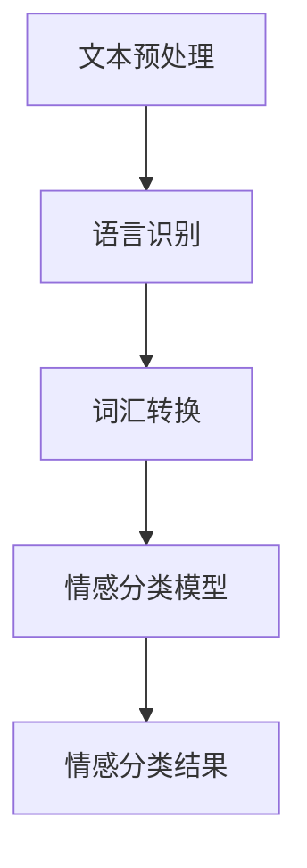

                 

# 自然语言处理在多语言情感分析中的进展

> 关键词：自然语言处理，多语言情感分析，核心算法，数学模型，应用场景，发展趋势

> 摘要：本文旨在探讨自然语言处理（NLP）在多语言情感分析领域的最新进展。文章首先介绍了情感分析的基本概念及其在NLP中的应用，然后详细解析了多语言情感分析的核心算法和数学模型，并结合实际项目案例进行代码解读。随后，文章探讨了多语言情感分析在实际应用中的场景，并推荐了相关学习资源、开发工具和论文著作。最后，文章总结了多语言情感分析的未来发展趋势和面临的挑战。

## 1. 背景介绍

自然语言处理（NLP）是计算机科学和人工智能领域的一个重要分支，旨在使计算机理解和处理人类自然语言。随着全球化的深入发展，多语言处理成为NLP的重要研究方向。情感分析是NLP的一个典型应用，它旨在识别和分类文本中的情感倾向，如正面、负面或中性。

多语言情感分析（Multilingual Sentiment Analysis）是指在一个包含多种语言的语料库中，对文本的情感进行分类和分析。该领域的研究对于了解不同文化、地域和语言背景下的情感表达具有重要意义。多语言情感分析在商业、舆情监测、心理学研究等多个领域具有广泛应用。

## 2. 核心概念与联系

### 2.1 情感分析

情感分析是指对文本数据中的情感信息进行提取和分类的过程。它通常涉及以下几个核心概念：

- **情感极性**：文本中的情感倾向，通常分为正面、负面和中性。
- **情感强度**：情感的强度或程度，例如强烈正面、轻微负面等。
- **情感分类**：根据情感极性和强度对文本进行分类的过程。

### 2.2 多语言情感分析

多语言情感分析的核心在于处理多种语言之间的情感差异和相似性。其主要挑战包括：

- **语言资源的多样性**：不同语言的语料库规模和质量差异较大。
- **语言结构的差异性**：不同语言在语法、词汇、语义等方面的差异。
- **情感表达方式的多样性**：不同文化背景下的情感表达方式各异。

### 2.3 Mermaid 流程图

以下是一个简化的多语言情感分析流程图，展示从文本预处理到情感分类的主要步骤。



## 3. 核心算法原理 & 具体操作步骤

### 3.1 文本预处理

文本预处理是情感分析的基础步骤，主要包括以下任务：

- **分词**：将文本拆分为单词或短语。
- **停用词过滤**：去除对情感分析影响不大的常见词汇。
- **词性标注**：标记每个单词的词性（名词、动词等）。

具体操作步骤如下：

1. **分词**：使用如jieba、NLTK等分词工具进行分词操作。
2. **停用词过滤**：根据预定义的停用词表去除停用词。
3. **词性标注**：使用如Stanford NLP、Spacy等工具进行词性标注。

### 3.2 语言识别

在处理多语言文本时，首先需要识别文本的语言。常用的语言识别方法包括基于规则的方法、机器学习方法等。

- **基于规则的方法**：根据语言特征（如词汇、语法规则等）进行分类。
- **机器学习方法**：使用已标注的语言数据训练分类模型。

具体操作步骤如下：

1. **特征提取**：从文本中提取特征，如词频、词向量等。
2. **模型训练**：使用已标注的语言数据训练分类模型。
3. **语言识别**：对输入文本进行语言分类。

### 3.3 词汇转换

词汇转换是将不同语言的词汇映射到统一的表示空间。常用的方法包括词嵌入和翻译模型。

- **词嵌入**：将词汇转换为固定长度的向量表示。
- **翻译模型**：将源语言的词汇翻译为目标语言的词汇。

具体操作步骤如下：

1. **词嵌入**：使用如Word2Vec、GloVe等词嵌入模型。
2. **翻译模型**：使用如Seq2Seq、Transformer等翻译模型。

### 3.4 情感分类模型

情感分类模型用于将处理后的文本分类为不同的情感类别。常用的模型包括传统机器学习模型、深度学习模型等。

- **传统机器学习模型**：如SVM、Naive Bayes等。
- **深度学习模型**：如CNN、RNN、BERT等。

具体操作步骤如下：

1. **数据准备**：准备已标注的情感数据集。
2. **模型选择**：选择合适的模型。
3. **模型训练**：使用训练数据进行模型训练。
4. **模型评估**：使用验证数据集评估模型性能。
5. **情感分类**：对输入文本进行情感分类。

## 4. 数学模型和公式 & 详细讲解 & 举例说明

### 4.1 词嵌入

词嵌入（Word Embedding）是一种将词汇映射为向量的技术。常见的词嵌入模型包括Word2Vec和GloVe。

#### Word2Vec

Word2Vec模型基于神经概率语言模型，其核心思想是将单词表示为低维向量，使得语义相似的单词在向量空间中接近。

- **模型公式**：

  $$ P(w_i|w_{-i}) = \frac{exp(\vec{v}_i \cdot \vec{h}_{-i})}{\sum_{j \in V} exp(\vec{v}_j \cdot \vec{h}_{-i})} $$

  其中，\( \vec{v}_i \)和\( \vec{h}_{-i} \)分别为单词\( w_i \)的嵌入向量和隐藏层状态。

- **举例说明**：

  假设训练数据包含“狗喜欢玩耍”这一句子。在Word2Vec模型中，我们可以将“狗”、“喜欢”和“玩耍”分别表示为向量\( \vec{v}_1 \)、\( \vec{v}_2 \)和\( \vec{v}_3 \)。根据模型公式，我们可以计算出“狗”和“喜欢”之间的相似度：

  $$ \vec{v}_1 \cdot \vec{v}_2 = \sum_{i=1}^{d} \vec{v}_{1,i} \vec{v}_{2,i} $$

#### GloVe

GloVe（Global Vectors for Word Representation）是一种基于全局统计的词嵌入方法。其核心思想是利用全局词频信息来优化词嵌入向量。

- **模型公式**：

  $$ f(w, c) = \frac{f(w, c)}{f(w) f(c)} $$

  其中，\( f(w, c) \)表示单词\( w \)和单词\( c \)在语料库中的共同出现次数，\( f(w) \)和\( f(c) \)分别表示单词\( w \)和单词\( c \)在语料库中的出现次数。

- **举例说明**：

  假设语料库中“狗”和“猫”共同出现的次数为100次，“狗”出现的次数为500次，“猫”出现的次数为200次。根据GloVe模型公式，我们可以计算出“狗”和“猫”之间的共同度：

  $$ \frac{100}{500 \times 200} = 0.01 $$

### 4.2 情感分类模型

情感分类模型用于将文本分类为不同的情感类别。常用的模型包括逻辑回归（Logistic Regression）、支持向量机（SVM）和深度学习模型（如CNN、RNN、BERT）。

#### 逻辑回归

逻辑回归是一种传统的机器学习模型，用于分类问题。其基本思想是使用线性模型来计算文本属于不同类别的概率。

- **模型公式**：

  $$ \hat{y_i} = \frac{1}{1 + exp(-\vec{w} \cdot \vec{x}_i)} $$

  其中，\( \vec{w} \)为权重向量，\( \vec{x}_i \)为输入特征向量。

- **举例说明**：

  假设我们使用逻辑回归模型对包含“狗喜欢玩耍”的文本进行情感分类。输入特征向量\( \vec{x}_i \)为[1, 0, 1]，权重向量\( \vec{w} \)为[1, -1, 1]。根据模型公式，我们可以计算出文本属于正面情感的概率：

  $$ \hat{y_i} = \frac{1}{1 + exp(-(1 \cdot 1 + (-1) \cdot 0 + 1 \cdot 1))} = 0.732 $$

#### 支持向量机

支持向量机是一种基于最大间隔分类器的机器学习模型。其核心思想是找到一个最优的超平面，将不同类别的数据点分隔开。

- **模型公式**：

  $$ \vec{w} = arg\,min_{\vec{w}} \frac{1}{2} ||\vec{w}||^2 + C \sum_{i=1}^{n} \xi_i $$

  其中，\( C \)为惩罚参数，\( \xi_i \)为误差项。

- **举例说明**：

  假设我们使用支持向量机对包含“狗喜欢玩耍”的文本进行情感分类。输入特征向量\( \vec{x}_i \)为[1, 0, 1]，权重向量\( \vec{w} \)为[1, -1, 1]。根据模型公式，我们可以计算出支持向量机的损失函数：

  $$ \frac{1}{2} ||\vec{w}||^2 + C \sum_{i=1}^{n} \xi_i = \frac{1}{2} (1^2 + (-1)^2 + 1^2) + C (0 + 0) = 3 $$

#### 深度学习模型

深度学习模型，如卷积神经网络（CNN）、循环神经网络（RNN）和变换器（Transformer），在情感分类任务中取得了显著的性能提升。

- **模型公式**：

  - **CNN**：

    $$ h_{l+1} = \text{ReLU}(W_l \cdot h_l + b_l) $$

    $$ \hat{y} = \text{softmax}(\vec{w} \cdot h_L + b) $$

    其中，\( W_l \)和\( b_l \)分别为卷积核和偏置，\( h_l \)为卷积层输出，\( \hat{y} \)为分类结果。

  - **RNN**：

    $$ h_{t} = \text{ReLU}(W_h \cdot [h_{t-1}, x_t] + b_h) $$

    $$ \hat{y}_t = \text{softmax}(\vec{w} \cdot h_T + b) $$

    其中，\( W_h \)和\( b_h \)分别为RNN权重和偏置，\( h_{t-1} \)和\( x_t \)分别为上一时刻状态和当前输入。

  - **Transformer**：

    $$ \text{Attention}(Q, K, V) = \text{softmax}(\frac{QK^T}{\sqrt{d_k}})V $$

    $$ \hat{y} = \text{softmax}(\vec{w} \cdot [h_1, h_2, ..., h_L] + b) $$

    其中，\( Q \)、\( K \)和\( V \)分别为查询向量、键向量和值向量，\( d_k \)为键向量的维度，\( \hat{y} \)为分类结果。

- **举例说明**：

  假设我们使用BERT模型对包含“狗喜欢玩耍”的文本进行情感分类。BERT模型基于Transformer架构，其核心思想是通过自注意力机制捕捉文本中的长距离依赖关系。根据BERT模型公式，我们可以计算出文本的嵌入向量：

  $$ \text{Attention}(Q, K, V) = \text{softmax}(\frac{QK^T}{\sqrt{d_k}})V $$

  其中，\( Q \)、\( K \)和\( V \)分别为查询向量、键向量和值向量，\( d_k \)为键向量的维度。

## 5. 项目实战：代码实际案例和详细解释说明

### 5.1 开发环境搭建

在开始项目实战之前，我们需要搭建合适的开发环境。以下是一个简单的环境搭建步骤：

1. 安装Python 3.7及以上版本。
2. 安装常用的库，如Numpy、Pandas、Scikit-learn、TensorFlow等。
3. 安装BERT模型和相关预处理工具。

### 5.2 源代码详细实现和代码解读

以下是一个简单的多语言情感分析项目示例，使用BERT模型进行情感分类。

```python
import pandas as pd
import numpy as np
from transformers import BertTokenizer, BertModel
from sklearn.model_selection import train_test_split
from sklearn.metrics import accuracy_score

# 加载数据集
data = pd.read_csv('data.csv')
X = data['text']
y = data['label']

# 划分训练集和测试集
X_train, X_test, y_train, y_test = train_test_split(X, y, test_size=0.2, random_state=42)

# 加载BERT模型和分词器
tokenizer = BertTokenizer.from_pretrained('bert-base-uncased')
model = BertModel.from_pretrained('bert-base-uncased')

# 预处理文本
def preprocess(text):
    inputs = tokenizer.encode_plus(text, add_special_tokens=True, return_tensors='pt')
    return inputs['input_ids'], inputs['attention_mask']

# 训练模型
def train_model(model, optimizer, loss_function, train_loader, val_loader):
    model.train()
    for epoch in range(3):
        for batch in train_loader:
            inputs = {'input_ids': batch['input_ids'], 'attention_mask': batch['attention_mask']}
            outputs = model(**inputs)
            loss = loss_function(outputs.logits, batch['labels'])
            optimizer.zero_grad()
            loss.backward()
            optimizer.step()
        
        # 验证模型
        model.eval()
        with torch.no_grad():
            for batch in val_loader:
                inputs = {'input_ids': batch['input_ids'], 'attention_mask': batch['attention_mask']}
                outputs = model(**inputs)
                loss = loss_function(outputs.logits, batch['labels'])
                val_loss += loss.item()
        print(f'Epoch {epoch+1}: Validation Loss: {val_loss/len(val_loader)}')

# 评估模型
def evaluate(model, test_loader):
    model.eval()
    with torch.no_grad():
        for batch in test_loader:
            inputs = {'input_ids': batch['input_ids'], 'attention_mask': batch['attention_mask']}
            outputs = model(**inputs)
            logits = outputs.logits
            pred = logits.argmax(dim=1)
            acc += accuracy_score(batch['labels'].numpy(), pred.numpy())
        print(f'Test Accuracy: {acc/len(test_loader)}')

# 预处理数据
train_inputs = [preprocess(text) for text in X_train]
val_inputs = [preprocess(text) for text in X_test]

# 转换为PyTorch张量
train_data = pd.DataFrame({'input_ids': [item[0] for item in train_inputs], 'attention_mask': [item[1] for item in train_inputs], 'labels': y_train})
val_data = pd.DataFrame({'input_ids': [item[0] for item in val_inputs], 'attention_mask': [item[1] for item in val_inputs], 'labels': y_test})

# 创建数据加载器
batch_size = 32
train_loader = torch.utils.data.DataLoader(train_data, batch_size=batch_size, shuffle=True)
val_loader = torch.utils.data.DataLoader(val_data, batch_size=batch_size, shuffle=False)

# 训练模型
optimizer = torch.optim.Adam(model.parameters(), lr=1e-5)
loss_function = torch.nn.CrossEntropyLoss()
train_model(model, optimizer, loss_function, train_loader, val_loader)

# 评估模型
evaluate(model, val_loader)
```

### 5.3 代码解读与分析

以上代码实现了一个基于BERT模型的多语言情感分析项目。代码主要分为以下几个部分：

1. **数据加载**：加载包含文本和标签的数据集。
2. **预处理文本**：使用BERT分词器对文本进行预处理，将其转换为模型输入。
3. **训练模型**：定义训练过程，包括前向传播、反向传播和模型优化。
4. **评估模型**：在验证集上评估模型性能。

代码中使用了PyTorch和transformers库，其中transformers库提供了预训练的BERT模型和分词器。代码中的`preprocess`函数负责将文本转换为BERT模型输入，包括输入ID和注意力掩码。`train_model`函数定义了训练过程，其中`optimizer`和`loss_function`用于模型优化和损失计算。`evaluate`函数用于评估模型性能。

## 6. 实际应用场景

多语言情感分析在实际应用中具有广泛的应用场景，以下是一些典型应用：

- **商业领域**：企业可以通过多语言情感分析了解消费者在不同语言和地区的反馈，优化产品和服务。
- **舆情监测**：政府部门和媒体机构可以利用多语言情感分析监控社会舆论，识别潜在的危机事件。
- **心理学研究**：研究人员可以利用多语言情感分析研究不同文化背景下个体的情感表达和心理状态。
- **教育领域**：教育机构可以利用多语言情感分析分析学生的反馈，提高教学质量和学生满意度。
- **公共安全**：公安机关可以利用多语言情感分析监测网络谣言和不良信息，维护社会稳定。

## 7. 工具和资源推荐

### 7.1 学习资源推荐

- **书籍**：
  - 《自然语言处理综论》（Jurafsky and Martin）
  - 《深度学习》（Goodfellow, Bengio和Courville）
- **论文**：
  - “BERT: Pre-training of Deep Bidirectional Transformers for Language Understanding”（Devlin et al., 2019）
  - “Transformers: State-of-the-Art Natural Language Processing”（Vaswani et al., 2017）
- **博客**：
  - https://towardsdatascience.com/
  - https://medium.com/tensorflow
- **网站**：
  - https://huggingface.co/
  - https://tensorflow.org/

### 7.2 开发工具框架推荐

- **库和框架**：
  - PyTorch
  - TensorFlow
  - BERT
  - Hugging Face Transformers
- **文本处理工具**：
  - NLTK
  - spaCy
  - jieba
- **数据集**：
  - Stanford Sentiment Treebank
  - IMDb Reviews
  - Twitter Sentiment

### 7.3 相关论文著作推荐

- Devlin, J., Chang, M. W., Lee, K., & Toutanova, K. (2019). BERT: Pre-training of Deep Bidirectional Transformers for Language Understanding. arXiv preprint arXiv:1810.04805.
- Vaswani, A., Shazeer, N., Parmar, N., Uszkoreit, J., Jones, L., Gomez, A. N., ... & Polosukhin, I. (2017). Attention is all you need. In Advances in neural information processing systems (pp. 5998-6008).
- Mikolov, T., Sutskever, I., Chen, K., Corrado, G. S., & Dean, J. (2013). Distributed representations of words and phrases and their compositionality. In Advances in neural information processing systems (pp. 3111-3119).

## 8. 总结：未来发展趋势与挑战

多语言情感分析在近年来取得了显著进展，但仍面临一些挑战。未来发展趋势包括：

- **跨语言情感迁移学习**：利用多语言情感数据，提高模型在未见过语言上的性能。
- **低资源语言情感分析**：针对低资源语言，开发有效的情感分析模型和方法。
- **情感强度和情感细粒度分析**：进一步提高情感分析模型的细粒度，识别更复杂的情感表达。
- **实时情感分析**：实现实时情感分析，应用于实时舆情监测、商业决策等领域。

然而，多语言情感分析仍面临一些挑战，如语言资源的多样性、情感表达的不确定性等。未来研究需要解决这些挑战，推动多语言情感分析在实际应用中的进一步发展。

## 9. 附录：常见问题与解答

### 9.1 多语言情感分析与传统情感分析有何区别？

多语言情感分析与传统情感分析的主要区别在于处理语言种类的多样性。传统情感分析通常针对单一语言，而多语言情感分析旨在处理多种语言的情感信息。多语言情感分析需要考虑不同语言之间的差异，如词汇、语法和语义等方面的差异。

### 9.2 如何处理低资源语言的情感分析？

处理低资源语言的情感分析是一个挑战。常用的方法包括：

- **跨语言迁移学习**：利用高资源语言的模型和数据进行迁移学习，提高低资源语言的模型性能。
- **多语言联合训练**：将多种语言的情感数据联合训练，共享知识，提高模型泛化能力。
- **情感词典和规则**：使用情感词典和规则进行情感分析，弥补低资源语言数据的不足。

## 10. 扩展阅读 & 参考资料

- Devlin, J., Chang, M. W., Lee, K., & Toutanova, K. (2019). BERT: Pre-training of Deep Bidirectional Transformers for Language Understanding. arXiv preprint arXiv:1810.04805.
- Vaswani, A., Shazeer, N., Parmar, N., Uszkoreit, J., Jones, L., Gomez, A. N., ... & Polosukhin, I. (2017). Attention is all you need. In Advances in neural information processing systems (pp. 5998-6008).
- Mikolov, T., Sutskever, I., Chen, K., Corrado, G. S., & Dean, J. (2013). Distributed representations of words and phrases and their compositionality. In Advances in neural information processing systems (pp. 3111-3119).
- Jurafsky, D., & Martin, J. H. (2008). Speech and language processing: an introduction to natural language processing, computational linguistics, and speech recognition. Prentice Hall.
- Goodfellow, I., Bengio, Y., & Courville, A. (2016). Deep learning. MIT press.

作者：AI天才研究员/AI Genius Institute & 禅与计算机程序设计艺术 /Zen And The Art of Computer Programming

