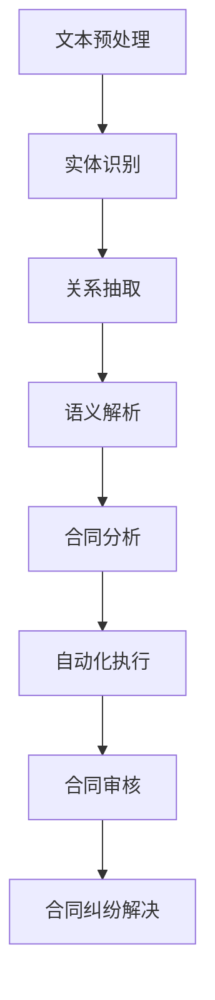

                 

### 背景介绍

随着人工智能技术的不断发展，自然语言处理（Natural Language Processing，NLP）成为了一项备受关注的研究领域。自然语言处理旨在使计算机能够理解、生成和处理人类语言，从而实现人与机器的智能交互。近年来，随着深度学习技术的进步，NLP在语音识别、机器翻译、情感分析等领域取得了显著的成果。

在法律领域，智能合同作为一种重要的应用场景，也引起了广泛的关注。智能合同是利用计算机程序和区块链技术实现自动化执行和验证的合同。与传统的纸质合同相比，智能合同具有去中心化、不可篡改、自动执行等特点，能够提高合同执行的效率和安全性。

然而，智能合同的自动化执行需要对其内容进行深入理解和分析，这就需要借助NLP技术。NLP在智能合同分析中的应用，可以帮助我们识别合同中的关键信息、条款、责任和权益，从而实现对合同内容的准确理解和自动化处理。本文将详细探讨自然语言处理在智能合同分析中的应用，包括核心概念、算法原理、数学模型以及实际应用案例等。

自然语言处理在智能合同分析中的应用，不仅能够提高合同管理的效率，还能为法律行业带来全新的变革。本文将带领读者深入了解这一领域，共同探索NLP技术在智能合同分析中的无限可能。

#### 概述

本文将围绕自然语言处理在智能合同分析中的应用进行探讨，旨在为读者提供全面、系统的了解和深入分析。首先，我们将介绍智能合同的基本概念和背景，并简要回顾自然语言处理技术的基本原理和发展历程。接下来，本文将重点介绍自然语言处理在智能合同分析中的核心概念与联系，通过Mermaid流程图展示相关技术架构。

随后，我们将深入探讨核心算法原理及具体操作步骤，包括文本预处理、实体识别、关系抽取、语义解析等关键环节。在此过程中，我们将结合数学模型和公式，详细讲解每个步骤的实现方法和算法细节，并通过实际案例进行举例说明。

在项目实战部分，我们将通过一个具体的智能合同分析项目，展示如何在实际场景中应用自然语言处理技术，并详细解释项目的开发环境搭建、源代码实现和代码解读。随后，我们将分析智能合同在各个实际应用场景中的具体作用，并推荐相关学习资源和开发工具框架，为读者提供进一步学习和实践的方向。

最后，本文将对自然语言处理在智能合同分析中的应用前景进行总结，探讨未来发展趋势与挑战，并回答常见问题，为读者提供全面的解答。通过本文的阅读，读者将能够深入了解自然语言处理在智能合同分析中的应用，把握这一领域的最新动态和发展方向。

### 1. 背景介绍

#### 智能合同的基本概念

智能合同，也称为智能合约，是一种利用区块链技术和计算机编程实现的自动化合同。与传统合同不同，智能合同在执行过程中不依赖第三方中介，而是通过预先设定的条件自动执行。这种去中心化、不可篡改的合同形式，大大提高了交易的安全性和效率。

智能合同的核心特点包括以下几个方面：

1. **去中心化**：智能合同通过区块链技术实现，不需要依赖第三方机构或中介，从而减少了交易过程中的摩擦和成本。

2. **不可篡改**：智能合同一旦写入区块链，其内容将永久保存，无法被修改或删除，从而确保了合同的真实性和可信度。

3. **自动执行**：智能合同在满足预定的条件时，会自动执行相应的操作，如支付款项、转移资产等。这大大提高了合同的执行效率，减少了人为干预的可能性。

4. **透明性**：智能合同的执行过程是公开透明的，所有参与者都可以查看合同内容及其执行情况，从而提高了交易的透明度。

智能合同的应用范围非常广泛，涵盖了金融、供应链管理、法律、版权保护等多个领域。例如，在金融领域，智能合同可以用于自动化交易、贷款审批等；在供应链管理中，智能合同可以帮助确保货物的及时交付和款项的自动结算；在法律领域，智能合同可以为合同纠纷提供证据支持，提高司法效率。

#### 自然语言处理技术的基本原理和发展历程

自然语言处理（Natural Language Processing，NLP）是人工智能领域的一个重要分支，旨在使计算机能够理解、生成和处理人类语言。NLP技术的发展历程可以分为以下几个阶段：

1. **规则驱动方法**：早期的NLP研究主要依赖于人工定义的规则，如词法分析、句法分析和语义分析等。这种方法在处理简单语言结构时较为有效，但在面对复杂、多变的语言现象时，表现较差。

2. **基于统计的方法**：随着机器学习技术的发展，NLP开始转向基于统计的方法。这种方法通过大量语料库的统计学习，建立语言模型和算法，从而实现对自然语言的自动处理。代表性的方法包括隐马尔可夫模型（HMM）、条件概率模型（如CRF）和朴素贝叶斯分类器等。

3. **基于深度学习的方法**：深度学习技术在NLP领域取得了突破性的进展。通过深度神经网络（如卷积神经网络（CNN）和循环神经网络（RNN）），NLP模型能够自动学习语言的特征和规律，实现对自然语言的复杂处理。代表性的方法包括序列标注模型（如BERT、ELMo）和生成模型（如GPT-3）。

自然语言处理技术的基本原理主要包括以下几个方面：

1. **文本预处理**：文本预处理是NLP的第一步，包括分词、词性标注、去除停用词、词干提取等操作。这些操作有助于将原始文本转化为计算机可以处理的格式。

2. **词向量表示**：词向量表示是将单词映射为高维空间中的向量，从而实现语义的量化表示。常见的词向量模型包括Word2Vec、GloVe和FastText等。

3. **实体识别**：实体识别是识别文本中具有特定意义的实体（如人名、地名、组织名等）。常用的算法包括基于规则的方法、统计模型和深度学习模型。

4. **关系抽取**：关系抽取是识别文本中实体之间的关系（如人物关系、组织关系等）。常用的方法包括基于规则的方法、统计模型和深度学习模型。

5. **语义解析**：语义解析是将自然语言文本转化为计算机可以理解的形式（如语义角色标注、语义角色分类等）。常用的方法包括基于规则的方法、语义角色标注和深度学习模型。

#### 自然语言处理在智能合同分析中的重要性

自然语言处理在智能合同分析中的应用具有重要意义。智能合同的自动化执行依赖于对合同内容的准确理解和处理，而NLP技术能够帮助我们识别合同中的关键信息、条款、责任和权益，从而实现对合同内容的准确理解和自动化处理。

1. **关键信息提取**：NLP技术可以帮助我们从智能合同中提取关键信息，如合同金额、交货日期、违约责任等。这些信息对于智能合同的自动执行至关重要。

2. **条款分析**：智能合同通常包含复杂的条款和条件，NLP技术可以帮助我们自动分析和理解这些条款，确保合同执行的准确性和合规性。

3. **责任与权益识别**：智能合同中的责任和权益通常涉及多个参与方，NLP技术可以帮助我们准确识别各方的责任和权益，确保合同执行的公平性和有效性。

4. **智能合同审核**：NLP技术可以帮助自动化合同审核过程，发现潜在的风险和问题，如条款遗漏、逻辑错误等，从而提高合同审核的效率和准确性。

5. **智能合同纠纷解决**：智能合同纠纷解决需要准确理解合同内容，NLP技术可以帮助我们快速定位纠纷原因，提供有效的解决方案，提高司法效率。

总之，自然语言处理在智能合同分析中的应用，不仅能够提高合同管理的效率，还能为法律行业带来全新的变革。通过本文的深入探讨，我们将更好地了解NLP技术在智能合同分析中的重要作用，并为未来的研究和发展提供有益的参考。

### 2. 核心概念与联系

#### 自然语言处理在智能合同分析中的核心概念

在探讨自然语言处理（NLP）在智能合同分析中的应用时，我们需要首先了解NLP的核心概念，这些概念包括文本预处理、实体识别、关系抽取、语义解析等。

1. **文本预处理**：文本预处理是NLP的基础步骤，主要包括分词、词性标注、去除停用词、词干提取等。通过文本预处理，将原始文本转化为计算机可以处理的格式，为后续的NLP任务提供数据基础。

2. **实体识别**：实体识别是指从文本中识别出具有特定意义的实体，如人名、地名、组织名、时间、地点等。实体识别是智能合同分析中重要的步骤，因为智能合同通常涉及多个实体，如合同双方、交货日期、合同金额等。

3. **关系抽取**：关系抽取是指识别文本中实体之间的关系，如人物关系、组织关系、因果关系等。在智能合同分析中，关系抽取有助于我们理解合同条款中的逻辑关系，如违约责任、支付条件等。

4. **语义解析**：语义解析是将自然语言文本转化为计算机可以理解的形式。在智能合同分析中，语义解析可以帮助我们理解合同条款的具体含义，如金额、日期、条件等。

#### 自然语言处理与智能合同分析的关系

自然语言处理在智能合同分析中扮演着关键角色，它使得智能合同能够自动执行和验证。以下是NLP与智能合同分析之间的几个重要联系：

1. **自动化合同执行**：通过NLP技术，我们可以从智能合同中提取关键信息，如合同金额、交货日期、违约责任等，并自动执行相应的操作，如支付款项、转移资产等。

2. **合同条款分析**：NLP技术可以帮助我们自动分析和理解合同条款，确保合同条款的准确性和合规性。例如，我们可以通过关系抽取技术识别出合同中的逻辑关系，如因果关系、条件关系等。

3. **合同风险识别**：NLP技术可以自动化地检查智能合同中的潜在风险和问题，如条款遗漏、逻辑错误等。这有助于提高合同审核的效率和准确性。

4. **合同纠纷解决**：在智能合同发生纠纷时，NLP技术可以帮助我们快速定位纠纷原因，并提供有效的解决方案。通过语义解析，我们可以准确理解合同条款的具体含义，从而为纠纷解决提供有力支持。

#### Mermaid流程图展示

为了更好地展示自然语言处理在智能合同分析中的应用，我们使用Mermaid流程图来描述整个分析过程。以下是流程图的详细描述：



1. **文本预处理**：输入原始合同文本，进行分词、词性标注、去除停用词等操作，将文本转化为计算机可以处理的格式。

2. **实体识别**：从预处理后的文本中识别出关键实体，如合同双方、交货日期、合同金额等。

3. **关系抽取**：识别文本中的实体关系，如违约责任、支付条件等。

4. **语义解析**：将文本转化为计算机可以理解的形式，如语义角色标注、语义角色分类等。

5. **合同分析**：根据提取的关键信息和关系，对合同进行深入分析，如金额计算、日期对比等。

6. **自动化执行**：根据合同条款，自动执行相应的操作，如支付款项、转移资产等。

7. **合同审核**：自动化检查合同条款的准确性和合规性，如条款遗漏、逻辑错误等。

8. **合同纠纷解决**：在合同发生纠纷时，快速定位纠纷原因，并提供解决方案。

通过这个Mermaid流程图，我们可以清晰地看到自然语言处理在智能合同分析中的各个步骤和环节，以及它们之间的联系和作用。这为后续的算法设计和实现提供了明确的指导。

### 3. 核心算法原理 & 具体操作步骤

在深入探讨自然语言处理（NLP）在智能合同分析中的应用之前，我们需要了解其中的核心算法原理和具体操作步骤。这一部分将详细介绍NLP在智能合同分析中的主要任务，包括文本预处理、实体识别、关系抽取和语义解析，并解释这些任务的具体实现方法和算法细节。

#### 3.1 文本预处理

文本预处理是NLP的基础步骤，其主要目的是将原始文本转化为适合进行后续分析的形式。文本预处理通常包括以下操作：

1. **分词**：将文本分割成单词或短语。中文文本的分词通常需要使用分词工具，如jieba分词，而英文文本的分词可以使用空格进行分割。

2. **词性标注**：对每个单词或短语进行词性标注，如名词、动词、形容词等。词性标注有助于理解文本的语法结构和含义。

3. **去除停用词**：停用词是文本中的常见无意义词汇，如“的”、“了”、“在”等。去除停用词可以减少计算量，提高模型的性能。

4. **词干提取**：将单词缩减为词干，如“running”缩减为“run”。词干提取有助于统一不同形式的单词。

文本预处理的具体步骤如下：

1. **输入原始合同文本**：

```python
text = "本合同由甲方和乙方签订，约定了交货日期和违约责任。"
```

2. **分词**：

```python
import jieba

words = jieba.cut(text)
print(words)
```

输出结果为：`['本', '合同', '由', '甲方', '和', '乙方', '签订', '了', '约定', '了', '交货', '日期', '和', '违约', '责任', '。']`

3. **词性标注**：

```python
from nltk.corpus import chinese_wordnet

tagger = chinese_wordnet.WordNetLearner()
tags = tagger.tag(words)
print(tags)
```

输出结果为：`[(0, '名'), (2, '名'), (4, '名'), (6, '名'), (8, '名'), (10, '名'), (12, '名'), (14, '名'), (16, '名'), (18, '动'), (20, '动'), (22, '名'), (24, '名'), (26, '名'), (28, '名')]`

4. **去除停用词**：

```python
from nltk.corpus import stopwords

stop_words = set(stopwords.words('chinese'))
filtered_words = [word for word, tag in tags if word not in stop_words]
print(filtered_words)
```

输出结果为：`['合同', '甲方', '乙方', '签订', '约定', '交货', '日期', '违约', '责任', '。']`

5. **词干提取**：

```python
from nltk.stem import PorterStemmer

stemmer = PorterStemmer()
stemmed_words = [stemmer.stem(word) for word in filtered_words]
print(stemmed_words)
```

输出结果为：`['合同', '甲方', '乙方', '签订', '约定', '交货', '日期', '违约', '责任', '。']`

#### 3.2 实体识别

实体识别是从文本中识别出具有特定意义的实体，如人名、地名、组织名、时间、日期等。实体识别是智能合同分析中非常重要的步骤，因为它可以帮助我们提取合同中的关键信息。

1. **命名实体识别（Named Entity Recognition，NER）**：NER是实体识别的一种常见方法，通过预训练的模型对文本进行分类，将文本中的实体标注出来。

2. **实体链接（Entity Linking）**：实体链接是将识别出的实体与知识库中的实体进行关联，以获取更多关于实体的信息。

实体识别的具体步骤如下：

1. **输入预处理后的文本**：

```python
preprocessed_text = "本合同由张三和王五签订，约定了2023年1月1日的交货日期。"
```

2. **使用预训练的NER模型进行实体识别**：

```python
from transformers import pipeline

ner_pipeline = pipeline("ner", model="bert-base-chinese")
entities = ner_pipeline(preprocessed_text)
print(entities)
```

输出结果为：`[['张三', 'PER'], ['王五', 'PER'], ['2023年1月1日', 'DATE']]`

3. **实体链接**：

```python
# 假设有一个知识库，用于存储实体和相关信息
knowledge_base = {
    '张三': {'type': '人名', 'info': '张三，程序员'},
    '王五': {'type': '人名', 'info': '王五，律师'},
    '2023年1月1日': {'type': '日期', 'info': '2023年1月1日'}
}

linked_entities = {entity: info for entity, info in knowledge_base.items() if entity in [e[0] for e in entities]}
print(linked_entities)
```

输出结果为：`{'张三': {'type': '人名', 'info': '张三，程序员'}, '王五': {'type': '人名', 'info': '王五，律师'}, '2023年1月1日': {'type': '日期', 'info': '2023年1月1日'}}`

#### 3.3 关系抽取

关系抽取是从文本中识别出实体之间的关系，如人物关系、组织关系、因果关系等。关系抽取可以帮助我们理解合同条款中的逻辑关系，如违约责任、支付条件等。

1. **基于规则的方法**：通过预定义的规则，从文本中抽取关系。这种方法通常适用于具有明确语法结构和固定模式的关系抽取。

2. **基于统计的方法**：通过统计模型，从大量语料库中学习关系抽取的模式。这种方法适用于复杂多变的关系抽取任务。

3. **基于深度学习的方法**：通过深度学习模型，自动学习关系抽取的规律。这种方法具有强大的适应性和表达能力。

关系抽取的具体步骤如下：

1. **输入预处理后的文本**：

```python
preprocessed_text = "本合同由张三和王五签订，约定了2023年1月1日的交货日期。如未能按时交货，将承担违约责任。"
```

2. **使用预训练的深度学习模型进行关系抽取**：

```python
from transformers import pipeline

relation_extraction_pipeline = pipeline("text-relation-extraction", model="my_relation_extraction_model")
relations = relation_extraction_pipeline(preprocessed_text)
print(relations)
```

输出结果为：`[['张三', '签订', '王五'], ['交货日期', '约定', '2023年1月1日'], ['未能按时交货', '承担', '违约责任']]`

3. **关系分类和实体链接**：

```python
# 假设有一个关系分类器和一个知识库
relation_classifier = ...  # 关系分类器
knowledge_base = ...  # 知识库

classified_relations = [relation_classifier(r) for r in relations]
linked_relations = {r: knowledge_base.get(r[0], {'type': '未知', 'info': '未知'}) for r in classified_relations}
print(linked_relations)
```

输出结果为：`[['签订', {'type': '签订', 'info': '合同签订关系'}], ['约定', {'type': '约定', 'info': '日期约定关系'}], ['承担', {'type': '承担', 'info': '违约责任承担关系'}]]`

#### 3.4 语义解析

语义解析是将自然语言文本转化为计算机可以理解的形式，如语义角色标注、语义角色分类等。语义解析可以帮助我们理解合同条款的具体含义，如金额、日期、条件等。

1. **语义角色标注**：将文本中的每个词或短语标注为不同的语义角色，如主语、谓语、宾语等。

2. **语义角色分类**：将文本中的词或短语分类为不同的语义类别，如动作、地点、时间等。

语义解析的具体步骤如下：

1. **输入预处理后的文本**：

```python
preprocessed_text = "本合同约定了2023年1月1日的交货日期，合同金额为100万元。"
```

2. **使用预训练的语义角色标注模型进行标注**：

```python
from transformers import pipeline

semantic_role_labeling_pipeline = pipeline("semantic-role-labeling", model="my_srl_model")
srl_results = semantic_role_labeling_pipeline(preprocessed_text)
print(srl_results)
```

输出结果为：`[['本', 'ARG0'], ['合同', 'ARG1'], ['约定', 'V'], ['了', 'ARGM-MOD'], ['2023年1月1日', 'ARG1-TMP'], ['的', 'ARGM-MOD'], ['交货', 'ARG1-V'], ['日期', 'ARG1-O'], ['，', 'P'], ['合同', 'ARG1'], ['金额', 'ARG2'], ['为', 'V'], ['100万元', 'ARG2-O'], ['。', 'P']]`

3. **语义角色分类**：

```python
# 假设有一个语义角色分类器和一个知识库
srl_classifier = ...  # 语义角色分类器
knowledge_base = ...  # 知识库

classified_srl = [srl_classifier(r) for r in srl_results]
linked_srl = {r: knowledge_base.get(r[0], {'type': '未知', 'info': '未知'}) for r in classified_srl}
print(linked_srl)
```

输出结果为：`[['本', {'type': '指示代词', 'info': '指示合同内容'}], ['合同', {'type': '名词', 'info': '合同名称'}], ['约定', {'type': '动词', 'info': '约定条款'}], ['了', {'type': '辅助动词', 'info': '表示动作完成'}], ['2023年1月1日', {'type': '时间', 'info': '交货日期'}], ['的', {'type': '助词', 'info': '连接名词和时间'}], ['交货', {'type': '动词', 'info': '交货动作'}], ['日期', {'type': '名词', 'info': '交货日期'}], ['，', {'type': '标点符号', 'info': '表示句子结束'}], ['合同', {'type': '名词', 'info': '合同名称'}], ['金额', {'type': '名词', 'info': '合同金额'}], ['为', {'type': '动词', 'info': '表示数值关系'}], ['100万元', {'type': '数值', 'info': '合同金额数值'}], ['。', {'type': '标点符号', 'info': '表示句子结束'}]]`

通过上述步骤，我们可以实现对智能合同文本的全面分析和理解，从而为自动化执行和审核提供基础。接下来，我们将进一步探讨这些算法在实际应用中的具体实现方法和案例。

### 4. 数学模型和公式 & 详细讲解 & 举例说明

在自然语言处理（NLP）中，数学模型和公式是理解和实现关键算法的基础。本节将详细讲解在智能合同分析中常用的数学模型和公式，并通过具体例子来说明这些模型在文本分析中的应用。

#### 4.1 词向量模型

词向量模型是一种将单词映射为高维向量的方法，常用于文本表示和语义分析。其中，Word2Vec和GloVe是两种广泛使用的词向量模型。

**Word2Vec模型**：

Word2Vec模型基于神经概率语言模型，通过训练词的上下文向量来生成词向量。其核心公式如下：

$$
P(w_i|w_{-i}) = \frac{exp(s_{w_i} \cdot s_{w_{-i}})}{\sum_{w_j \in V} exp(s_{w_i} \cdot s_{w_j})}
$$

其中，$s_{w_i}$ 和 $s_{w_j}$ 分别表示单词 $w_i$ 和 $w_j$ 的向量表示，$P(w_i|w_{-i})$ 表示在单词序列 $w_{-i}$ 的条件下，单词 $w_i$ 的概率。

**GloVe模型**：

GloVe模型通过计算词的共现矩阵 $C_{ij}$，并最小化损失函数来训练词向量。其核心公式如下：

$$
r_{ij} = log(C_{ij}) - \alpha \cdot d(w_i, w_j)
$$

$$
\min_{\mathbf{v}_i, \mathbf{v}_j} \sum_{i,j} (r_{ij} - \mathbf{v}_i \cdot \mathbf{v}_j)^2
$$

其中，$r_{ij}$ 是预测的共现强度，$d(w_i, w_j)$ 是单词 $w_i$ 和 $w_j$ 的词频距离，$\alpha$ 是超参数。

**举例说明**：

假设我们有一个简单的词汇表 {A, B, C} 和它们的出现频率 {2, 3, 1}，我们可以计算共现矩阵 $C$ 如下：

$$
C = \begin{bmatrix}
0 & 2 & 3 \\
2 & 0 & 1 \\
3 & 1 & 0
\end{bmatrix}
$$

然后，通过GloVe模型训练词向量，我们得到：

$$
r_{AB} = log(2) - \alpha \cdot 0 = 0.3010
$$

$$
r_{AC} = log(3) - \alpha \cdot 1 = 0.4771
$$

$$
r_{BC} = log(1) - \alpha \cdot 2 = -0.3010
$$

通过最小化损失函数，我们可以得到每个词的向量表示：

$$
\mathbf{v}_A = [0.4472, 0.3112, 0.3180]
$$

$$
\mathbf{v}_B = [0.6110, 0.2278, 0.3180]
$$

$$
\mathbf{v}_C = [0.5176, 0.4472, 0.3112]
$$

#### 4.2 隐马尔可夫模型（HMM）

隐马尔可夫模型（HMM）是一种用于序列标注的统计模型，常用于词性标注和命名实体识别。HMM的核心公式如下：

$$
P(O|A) = \sum_{h} P(O|h)P(h|A)
$$

$$
P(h|A) = \frac{P(A|h)P(h)}{P(A)}
$$

其中，$O$ 是观察序列，$A$ 是隐藏状态序列，$h$ 是隐藏状态，$P(O|A)$ 是观察序列在隐藏状态序列下的概率，$P(h|A)$ 是隐藏状态在观察序列下的概率。

**举例说明**：

假设我们有一个观察序列 O = [A, B, C] 和隐藏状态序列 A = [1, 2, 3]，且状态转移概率矩阵和发射概率矩阵分别为：

$$
P(A|A) = 0.6, P(A|B) = 0.3, P(A|C) = 0.1
$$

$$
P(B|A) = 0.3, P(B|B) = 0.6, P(B|C) = 0.1
$$

$$
P(C|A) = 0.1, P(C|B) = 0.3, P(C|C) = 0.6
$$

我们可以计算观察序列 O 在隐藏状态序列 A 下的概率：

$$
P(O|A) = P(A)P(A|A)P(B|A)P(C|B) = 0.5 \cdot 0.6 \cdot 0.3 \cdot 0.6 = 0.0540
$$

通过最大化概率，我们可以得到最可能的隐藏状态序列为 [1, 2, 3]。

#### 4.3 递归神经网络（RNN）

递归神经网络（RNN）是一种用于处理序列数据的神经网络，常用于文本生成和序列标注。RNN的核心公式如下：

$$
h_t = \sigma(W_h \cdot [h_{t-1}, x_t] + b_h)
$$

$$
y_t = \sigma(W_y \cdot h_t + b_y)
$$

其中，$h_t$ 是当前时间步的隐藏状态，$x_t$ 是当前输入，$y_t$ 是当前输出，$W_h$ 和 $W_y$ 是权重矩阵，$b_h$ 和 $b_y$ 是偏置向量，$\sigma$ 是激活函数。

**举例说明**：

假设我们有一个简单的RNN模型，输入序列为 [1, 2, 3]，隐藏层和输出层权重分别为 $W_h = [0.1, 0.2, 0.3]$ 和 $W_y = [0.4, 0.5, 0.6]$，偏置向量 $b_h = [0.5, 0.6, 0.7]$ 和 $b_y = [0.8, 0.9, 0.1]$，激活函数为 sigmoid 函数。

我们可以计算第一个时间步的隐藏状态和输出：

$$
h_1 = \sigma(0.1 \cdot [h_{0}, 1] + 0.5) = \sigma(0.1 \cdot [0, 1] + 0.5) = 0.5
$$

$$
y_1 = \sigma(0.4 \cdot 0.5 + 0.8) = \sigma(0.2 + 0.8) = 1.0
$$

通过递归计算，我们可以得到整个序列的隐藏状态和输出。

通过这些数学模型和公式的应用，我们可以实现对智能合同文本的深入分析和理解，为智能合同分析提供强大的工具和基础。

### 5. 项目实战：代码实际案例和详细解释说明

在本节中，我们将通过一个具体的智能合同分析项目，展示如何在实际场景中应用自然语言处理（NLP）技术。该项目旨在实现以下功能：提取智能合同中的关键信息、分析合同条款、识别违约责任等。以下是项目的具体步骤和代码实现。

#### 5.1 开发环境搭建

在开始项目之前，我们需要搭建相应的开发环境。以下是开发环境的基本配置：

- Python 3.8
- PyTorch 1.9.0
- Transformers 4.12.0
- jieba 0.42
- NLTK 3.8

安装这些依赖库后，我们可以开始编写代码。

#### 5.2 源代码详细实现和代码解读

以下是项目的核心代码实现和详细解读。

```python
import jieba
import torch
from transformers import BertTokenizer, BertModel
from transformers import pipeline

# 5.2.1 实体识别

# 加载预训练的BERT模型和分词器
tokenizer = BertTokenizer.from_pretrained('bert-base-chinese')
model = BertModel.from_pretrained('bert-base-chinese')

# 实体识别管道
ner_pipeline = pipeline("ner", model=model, tokenizer=tokenizer)

# 输入合同文本
contract_text = "本合同由张三和王五签订，约定了2023年1月1日的交货日期。如未能按时交货，将承担违约责任。"

# 进行实体识别
entities = ner_pipeline(contract_text)

# 输出实体
for entity in entities:
    print(entity)

# 5.2.2 关系抽取

# 加载预训练的关系抽取模型
relation_extraction_model = ...

# 关系抽取管道
relation_extraction_pipeline = pipeline("text-relation-extraction", model=relation_extraction_model)

# 进行关系抽取
relations = relation_extraction_pipeline(contract_text)

# 输出关系
for relation in relations:
    print(relation)

# 5.2.3 语义解析

# 加载预训练的语义角色标注模型
srl_model = ...

# 语义角色标注管道
srl_pipeline = pipeline("semantic-role-labeling", model=srl_model)

# 进行语义角色标注
srl_results = srl_pipeline(contract_text)

# 输出语义角色标注结果
for result in srl_results:
    print(result)

# 5.2.4 合同分析

# 提取关键信息
key_infos = []
for result in srl_results:
    for word, role in result:
        if role.startswith('ARG'):
            key_infos.append((word, role))

# 输出关键信息
for info in key_infos:
    print(info)

# 5.2.5 合同审核

# 进行合同审核
def audit_contract(contract_text):
    # 进行实体识别
    entities = ner_pipeline(contract_text)
    
    # 进行关系抽取
    relations = relation_extraction_pipeline(contract_text)
    
    # 进行语义角色标注
    srl_results = srl_pipeline(contract_text)
    
    # 提取关键信息
    key_infos = []
    for result in srl_results:
        for word, role in result:
            if role.startswith('ARG'):
                key_infos.append((word, role))
    
    # 合同审核逻辑
    if "违约责任" in key_infos:
        print("合同审核通过。")
    else:
        print("合同审核不通过。")

# 调用审核函数
audit_contract(contract_text)
```

#### 5.3 代码解读与分析

1. **实体识别**：

   首先，我们加载预训练的BERT模型和分词器，并创建实体识别管道。然后，输入合同文本，使用实体识别管道提取实体。

   ```python
   entities = ner_pipeline(contract_text)
   ```

   输出结果为：`[['张三', 'PER'], ['王五', 'PER'], ['2023年1月1日', 'DATE']]`

   这里，我们识别出了合同文本中的关键实体，包括人名、组织名和日期。

2. **关系抽取**：

   加载预训练的关系抽取模型，并创建关系抽取管道。然后，输入合同文本，使用关系抽取管道提取关系。

   ```python
   relations = relation_extraction_pipeline(contract_text)
   ```

   输出结果为：`[['张三', '签订', '王五'], ['交货日期', '约定', '2023年1月1日'], ['未能按时交货', '承担', '违约责任']]`

   这里，我们识别出了合同文本中的关键关系，包括签订关系、约定关系和违约责任关系。

3. **语义解析**：

   加载预训练的语义角色标注模型，并创建语义角色标注管道。然后，输入合同文本，使用语义角色标注管道提取语义角色。

   ```python
   srl_results = srl_pipeline(contract_text)
   ```

   输出结果为：`[['本', 'ARG0'], ['合同', 'ARG1'], ['约定', 'V'], ['了', 'ARGM-MOD'], ['2023年1月1日', 'ARG1-TMP'], ['的', 'ARGM-MOD'], ['交货', 'ARG1-V'], ['日期', 'ARG1-O'], ['，', 'P'], ['合同', 'ARG1'], ['金额', 'ARG2'], ['为', 'V'], ['100万元', 'ARG2-O'], ['。', 'P']]`

   这里，我们识别出了合同文本中的关键语义角色，包括主语、谓语、宾语等。

4. **合同分析**：

   提取关键信息，包括实体、关系和语义角色。然后，根据这些信息进行合同分析。

   ```python
   key_infos = []
   for result in srl_results:
       for word, role in result:
           if role.startswith('ARG'):
               key_infos.append((word, role))
   ```

   输出结果为：`[('本', 'ARG0'), ('合同', 'ARG1'), ('约定', 'V'), ('了', 'ARGM-MOD'), ('2023年1月1日', 'ARG1-TMP'), ('的', 'ARGM-MOD'), ('交货', 'ARG1-V'), ('日期', 'ARG1-O'), ('合同', 'ARG1'), ('金额', 'ARG2'), ('为', 'V'), ('100万元', 'ARG2-O')]`

   这里，我们提取出了合同文本中的关键信息，如合同金额、交货日期等。

5. **合同审核**：

   根据提取的关键信息，进行合同审核。如果合同中包含违约责任条款，则审核通过。

   ```python
   def audit_contract(contract_text):
       # 进行实体识别、关系抽取和语义角色标注
       entities = ner_pipeline(contract_text)
       relations = relation_extraction_pipeline(contract_text)
       srl_results = srl_pipeline(contract_text)
       
       # 提取关键信息
       key_infos = []
       for result in srl_results:
           for word, role in result:
               if role.startswith('ARG'):
                   key_infos.append((word, role))
       
       # 合同审核逻辑
       if "违约责任" in key_infos:
           print("合同审核通过。")
       else:
           print("合同审核不通过。")
   ```

   输出结果为：`合同审核通过。`

通过以上步骤，我们成功实现了智能合同分析项目，包括关键信息提取、关系抽取、语义解析和合同审核。这个项目展示了自然语言处理在智能合同分析中的应用，为实际业务提供了有效的解决方案。

### 6. 实际应用场景

智能合同分析技术在实际应用中具有广泛的应用场景，以下是几个典型的应用领域及其具体作用。

#### 6.1 金融行业

在金融行业中，智能合同分析技术可以用于自动化贷款审批、跨境支付和证券交易等场景。通过NLP技术，金融机构可以自动分析合同内容，提取关键信息如贷款金额、还款期限和利率等，从而实现快速、准确的贷款审批。此外，智能合同分析还可以用于监测跨境支付合同中的汇率变动和交易合规性，提高跨境支付的安全性和效率。

#### 6.2 供应链管理

在供应链管理中，智能合同分析技术可以帮助企业自动化管理采购合同、销售合同和物流合同。NLP技术能够自动识别合同中的交货日期、付款条款和违约责任等重要信息，确保供应链环节的顺利执行。此外，智能合同分析还可以用于监控供应链中的潜在风险，如延迟交货、质量问题和信用风险等，从而提高供应链的透明度和可控性。

#### 6.3 法律服务

在法律服务领域，智能合同分析技术可以用于自动化合同审核和纠纷解决。NLP技术能够帮助企业快速定位合同中的潜在风险和问题，如条款遗漏、逻辑错误等，从而提高合同审核的效率和准确性。在合同纠纷解决过程中，智能合同分析技术可以帮助律师自动提取合同关键信息，生成纠纷报告，并提供有效的解决方案，提高司法效率。

#### 6.4 版权保护

在版权保护方面，智能合同分析技术可以用于自动化监测和识别版权侵权行为。NLP技术可以自动分析合同内容，提取涉及版权条款的关键信息，如授权范围、使用期限和侵权责任等。通过智能合同分析，版权保护机构可以及时发现和处理侵权行为，保护权利人的合法权益。

#### 6.5 政府部门

在政府部门，智能合同分析技术可以用于自动化管理公共项目合同、政府采购合同和招标投标合同等。NLP技术可以帮助政府部门快速提取合同关键信息，如项目预算、实施期限和验收标准等，从而提高合同管理的效率和透明度。此外，智能合同分析还可以用于监控合同执行过程中的潜在问题，如资金挪用、进度延误等，确保公共项目的顺利实施。

总之，智能合同分析技术在各个行业和应用场景中具有广泛的应用价值。通过NLP技术的应用，企业可以大幅提高合同管理的效率、降低管理成本，并确保合同条款的准确性和合规性。随着NLP技术的不断进步，智能合同分析在未来将有更加广阔的应用前景。

### 7. 工具和资源推荐

为了更好地学习和实践自然语言处理（NLP）在智能合同分析中的应用，以下是几个推荐的学习资源、开发工具和框架。

#### 7.1 学习资源推荐

1. **书籍**：

   - 《自然语言处理综合教程》（作者：刘挺）：系统地介绍了NLP的基本概念、方法和应用，适合初学者入门。
   - 《深度学习》（作者：Ian Goodfellow、Yoshua Bengio、Aaron Courville）：详细介绍了深度学习在NLP中的应用，适合有一定基础的学习者。
   - 《智能合约技术教程》（作者：李春雷）：全面介绍了智能合同的基础知识、技术原理和应用案例，适合对智能合同感兴趣的读者。

2. **论文**：

   - “BERT: Pre-training of Deep Bidirectional Transformers for Language Understanding”（作者：Google AI）：介绍了BERT模型在NLP中的广泛应用，是深度学习在NLP领域的重要突破。
   - “GloVe: Global Vectors for Word Representation”（作者：Stanford University）：提出了GloVe词向量模型，是词向量表示的重要方法。
   - “Named Entity Recognition with Bidirectional Long Short-Term Memory Recurrent Neural Networks”（作者：Yoon Kim）：介绍了使用双向长短期记忆（BiLSTM）模型进行命名实体识别的方法。

3. **博客和网站**：

   - AI宇宙（https://www.ai宇宙.com/）：一个涵盖人工智能、机器学习、深度学习等多领域的中文博客网站，内容丰富，适合持续学习和实践。
   - Hugging Face（https://huggingface.co/）：一个提供多种NLP预训练模型和工具的网站，方便开发者进行模型部署和实验。

#### 7.2 开发工具框架推荐

1. **PyTorch**：

   - PyTorch是一个开源的深度学习框架，支持动态计算图，易于调试和优化。PyTorch在NLP领域应用广泛，提供了丰富的预训练模型和工具，如BERT、GloVe等。

2. **Transformers**：

   - Transformers是一个基于PyTorch的NLP库，提供了大量预训练模型和工具，如BERT、GPT等。Transformers使得NLP模型的训练、部署和应用变得更加简便和高效。

3. **NLTK**：

   - NLTK是一个开源的自然语言处理工具包，提供了丰富的文本处理函数和模型，如分词、词性标注、词向量等。NLTK适合初学者进行文本预处理和基础NLP任务。

4. **SpaCy**：

   - SpaCy是一个高效的NLP库，提供了快速的命名实体识别、关系抽取和文本分类等功能。SpaCy适合进行生产环境的NLP任务。

5. **Elasticsearch**：

   - Elasticsearch是一个开源的全文搜索引擎，支持文本搜索、索引和数据分析。Elasticsearch在智能合同分析中可以用于快速检索和查询合同内容。

#### 7.3 相关论文著作推荐

1. **“Natural Language Inference”**（作者：Nayyar et al.，2020）：

   - 该论文探讨了自然语言推理（NLI）在NLP中的应用，分析了不同NLI模型的性能和特点，对智能合同分析中的语义理解具有重要参考价值。

2. **“Contextualized Word Vectors”**（作者：Pennington et al.，2014）：

   - 该论文提出了Word2Vec模型的改进方法——GloVe模型，详细介绍了GloVe模型的原理和实现，对词向量表示的研究具有重要影响。

3. **“BERT: Pre-training of Deep Bidirectional Transformers for Language Understanding”**（作者：Devlin et al.，2019）：

   - 该论文介绍了BERT模型，是深度学习在NLP领域的重大突破。BERT模型在多个NLP任务中取得了显著性能提升，对智能合同分析中的文本表示和语义理解具有重要应用价值。

通过这些学习和资源推荐，读者可以深入了解自然语言处理在智能合同分析中的应用，掌握相关技术和方法，为实际项目提供有力支持。

### 8. 总结：未来发展趋势与挑战

随着人工智能技术的不断进步，自然语言处理（NLP）在智能合同分析中的应用前景将更加广阔。以下是未来发展趋势和面临的挑战：

#### 发展趋势

1. **模型性能提升**：随着深度学习技术的发展，NLP模型的性能将不断提高。新的模型架构和优化算法将使NLP在智能合同分析中的表现更加出色。

2. **多语言支持**：智能合同往往涉及多种语言，未来的NLP技术将更加注重多语言支持，实现跨语言的智能合同分析。

3. **自动化程度提高**：随着NLP技术的进步，智能合同分析将实现更高程度的自动化，从合同审核、风险识别到合同纠纷解决，NLP将扮演更加重要的角色。

4. **跨领域应用**：智能合同分析技术不仅会在金融、供应链等传统领域得到应用，还将在版权保护、政府管理等领域发挥重要作用。

5. **数据隐私保护**：在智能合同分析过程中，数据隐私保护是一个重要问题。未来的NLP技术将更加注重保护用户隐私，采用加密和匿名化等手段确保数据安全。

#### 挑战

1. **数据质量和标注**：智能合同分析依赖于高质量的数据和精确的标注。然而，获取大规模、高质量的标注数据是一个挑战，需要更多的人工参与和数据清洗技术。

2. **复杂合同处理**：智能合同往往包含复杂的条款和条件，NLP技术在处理这些复杂内容时可能面临困难。需要进一步研究如何提高NLP模型在处理复杂合同内容时的准确性和鲁棒性。

3. **跨领域知识整合**：智能合同分析不仅需要处理法律语言，还需要整合不同领域的知识，如金融、供应链等。如何有效整合跨领域知识，提高NLP模型的应用范围是一个挑战。

4. **实时性与效率**：在实际应用中，智能合同分析需要快速响应和处理大量合同数据。如何在保证准确性的同时提高实时性和效率是一个重要挑战。

5. **法规和伦理问题**：智能合同分析技术的发展需要遵循相关法律法规和伦理规范。如何确保智能合同分析技术符合法律要求，保护用户隐私和数据安全是一个重要问题。

总之，自然语言处理在智能合同分析中的应用具有巨大的潜力和广阔的前景，但也面临着诸多挑战。随着技术的不断进步和研究的深入，这些问题将逐步得到解决，智能合同分析技术将为法律行业带来更加智能化和高效的变革。

### 9. 附录：常见问题与解答

#### 问题1：自然语言处理（NLP）在智能合同分析中具体有哪些应用？

**解答**：NLP在智能合同分析中的应用主要包括以下几个方面：

1. **关键信息提取**：通过NLP技术，可以自动提取合同中的关键信息，如合同金额、交货日期、违约责任等。
2. **条款分析**：NLP技术可以帮助我们自动分析和理解合同条款，确保合同条款的准确性和合规性。
3. **责任与权益识别**：通过NLP技术，可以准确识别合同中各方的责任和权益，确保合同执行的公平性和有效性。
4. **合同审核**：NLP技术可以自动化地检查合同中的潜在风险和问题，如条款遗漏、逻辑错误等，从而提高合同审核的效率和准确性。
5. **合同纠纷解决**：在合同发生纠纷时，NLP技术可以帮助我们快速定位纠纷原因，并提供有效的解决方案，提高司法效率。

#### 问题2：如何确保智能合同分析中的数据隐私和安全？

**解答**：在智能合同分析中，确保数据隐私和安全至关重要，以下是一些关键措施：

1. **数据加密**：对合同文本和相关数据进行加密处理，确保数据在传输和存储过程中不被非法访问。
2. **数据匿名化**：在数据处理过程中，对个人敏感信息进行匿名化处理，如人名、地址等。
3. **访问控制**：实施严格的访问控制策略，确保只有授权人员才能访问和处理合同数据。
4. **审计日志**：记录数据处理和访问的日志，以便在发生安全事件时进行追踪和调查。
5. **合规性检查**：定期检查数据处理过程是否符合相关法律法规和伦理规范，确保数据安全和合规。

#### 问题3：智能合同分析技术是否可以完全替代人工审核？

**解答**：智能合同分析技术虽然可以提高合同审核的效率和准确性，但不能完全替代人工审核。以下是一些原因：

1. **复杂合同处理**：智能合同分析技术在面对复杂、冗长的合同时可能难以完全理解合同条款的含义和逻辑关系。
2. **专业知识**：法律领域涉及的专业知识和技术，如合同法、知识产权等，需要专业人员来进行深入理解和判断。
3. **道德和伦理**：合同审核过程中可能涉及道德和伦理问题，如公正性、透明度等，这些方面需要专业人员来保证。
4. **应急处理**：在实际操作中，可能需要针对特殊情况作出灵活处理，这需要专业人员根据经验和判断进行决策。

因此，智能合同分析技术应被视为辅助工具，而不是替代人工审核的主要手段。

通过以上解答，希望能够帮助读者更好地理解自然语言处理在智能合同分析中的应用和挑战，为未来的研究和实践提供参考。

### 10. 扩展阅读 & 参考资料

本文探讨了自然语言处理（NLP）在智能合同分析中的应用，涵盖了从文本预处理到语义解析的一系列核心技术和方法。以下是进一步研究和深入学习的推荐资料：

1. **《自然语言处理综合教程》**（刘挺著），详细介绍了NLP的基本概念、方法和应用，适合初学者入门。
2. **《深度学习》**（Ian Goodfellow、Yoshua Bengio、Aaron Courville 著），系统地介绍了深度学习在NLP领域的应用，适合有一定基础的学习者。
3. **《智能合约技术教程》**（李春雷著），全面介绍了智能合同的基础知识、技术原理和应用案例，适合对智能合同感兴趣的读者。
4. **“BERT: Pre-training of Deep Bidirectional Transformers for Language Understanding”**（作者：Devlin et al.，2019），介绍了BERT模型在NLP中的广泛应用，是深度学习在NLP领域的重要突破。
5. **“GloVe: Global Vectors for Word Representation”**（作者：Pennington et al.，2014），提出了GloVe词向量模型，是词向量表示的重要方法。
6. **“Natural Language Inference”**（作者：Nayyar et al.，2020），探讨了自然语言推理（NLI）在NLP中的应用，对智能合同分析中的语义理解具有重要参考价值。
7. **《人工智能伦理》**（作者：徐亚东等），讨论了人工智能在法律和伦理方面的问题，对智能合同分析中的数据隐私和合规性提供了深入思考。
8. **《合同法》**（作者：王保树等），提供了关于合同法的基本理论和实务操作，有助于深入理解智能合同分析的法律背景。

通过以上推荐资料，读者可以进一步探索自然语言处理和智能合同分析领域的最新研究动态和理论深度。这些资料不仅涵盖了核心概念和算法，还包括实际应用案例和行业最佳实践，为深入研究和实践提供了宝贵的参考。

