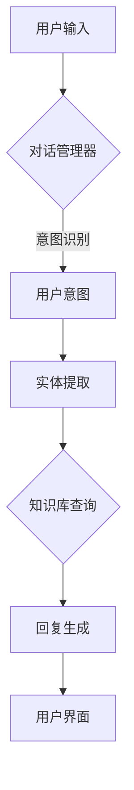
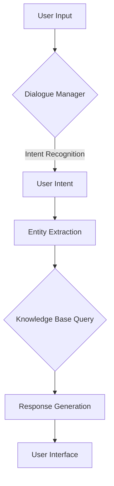

                 

### 背景介绍

自然语言处理（Natural Language Processing，NLP）是计算机科学与人工智能领域中的一个重要分支，它致力于使计算机能够理解、解释和生成人类语言。在过去的几十年中，NLP经历了显著的发展，从最初的规则驱动的方法，到基于统计的方法，再到如今基于深度学习的模型，其应用范围不断扩大，从文本分类、实体识别到机器翻译、语音识别等各个方面。

智能客服系统（Intelligent Customer Service System）是NLP技术在商业领域中的一大重要应用。随着互联网的普及和电子商务的蓬勃发展，企业和消费者之间的互动变得越来越频繁。传统的客服系统主要通过人工方式处理客户咨询，效率低且成本高。为了提高服务质量，降低运营成本，许多企业开始探索基于NLP技术的智能客服系统。

智能客服系统的核心在于能够理解客户的问题，并提供准确的回答。这不仅仅是对关键词的匹配，而是需要理解句子的结构、语法和语义。例如，当客户咨询“我的订单什么时候能送到？”时，系统需要理解“订单”、“什么时候”和“送到”等词汇的含义，并根据这些信息生成合适的回复。

目前，智能客服系统已经成为企业提升客户满意度、提高运营效率的重要工具。以下是智能客服系统的几个主要特点：

1. **高效性**：智能客服系统能够同时处理大量的客户咨询，极大地提高了响应速度和效率。
2. **一致性**：系统提供的回答始终保持一致，减少了因人为因素导致的回答不一致或错误。
3. **可扩展性**：系统可以轻松地集成到企业的现有系统中，随着业务的发展，系统可以不断扩展功能。
4. **成本效益**：智能客服系统可以显著降低企业的运营成本，尤其适用于处理高频次、重复性的问题。

智能客服系统的发展和应用不仅为消费者提供了更加便捷的服务体验，也为企业带来了显著的业务价值。在接下来的章节中，我们将深入探讨NLP在智能客服系统中的应用原理、核心算法以及实际应用案例，帮助读者全面了解这一技术领域。

---

# Background Introduction

Natural Language Processing (NLP) is a significant branch of computer science and artificial intelligence that focuses on enabling computers to understand, interpret, and generate human language. Over the past few decades, NLP has witnessed substantial growth, evolving from rule-based methods to statistical methods and, more recently, deep learning-based models. Its applications span various domains, including text classification, entity recognition, machine translation, and speech recognition.

Intelligent Customer Service Systems represent a major application of NLP in the business sector. With the widespread adoption of the internet and the booming e-commerce industry, interactions between businesses and consumers have increased significantly. Traditional customer service systems rely heavily on manual handling of customer inquiries, which is inefficient and costly. To enhance service quality and reduce operational costs, many enterprises are turning to intelligent customer service systems based on NLP technology.

The core of intelligent customer service systems is the ability to understand customer questions and provide accurate responses. This requires not just keyword matching but also an understanding of sentence structures, grammar, and semantics. For example, when a customer asks, "When will my order be delivered?", the system needs to comprehend the meanings of "order," "when," and "delivered" and generate a suitable reply based on this information.

Currently, intelligent customer service systems have become an essential tool for enterprises to improve customer satisfaction and operational efficiency. Here are several key features of intelligent customer service systems:

1. **Efficiency**: Intelligent customer service systems can handle a large volume of customer inquiries simultaneously, significantly enhancing response speed and efficiency.
2. **Consistency**: The system provides consistent responses, reducing discrepancies or errors that may arise from human factors.
3. **Scalability**: The system can be easily integrated into existing enterprise systems and can be expanded with the growth of the business.
4. **Cost-effectiveness**: Intelligent customer service systems can significantly reduce operational costs, especially for handling frequent and repetitive inquiries.

The development and application of intelligent customer service systems not only provide consumers with a more convenient service experience but also bring significant business value to enterprises. In the following sections, we will delve into the application principles of NLP in intelligent customer service systems, core algorithms, and practical case studies to give readers a comprehensive understanding of this technical field. 

---

## 2. 核心概念与联系

### 2.1 自然语言处理（NLP）基本概念

自然语言处理（NLP）涉及多个核心概念，包括文本预处理、语言模型、词向量表示、句法分析和语义理解等。这些概念相互关联，共同构成了NLP的技术框架。

- **文本预处理**：文本预处理是NLP的首要步骤，包括分词、去除停用词、词形还原等。这一步的目的是将原始文本转化为计算机可以处理的结构化数据。

- **语言模型**：语言模型用于预测一段文本的下一个词或字符。它是NLP中非常重要的工具，可以用于生成文本、完成句子、改进拼写等。

- **词向量表示**：词向量是将单词映射到高维向量空间的方法。通过词向量，计算机可以理解词与词之间的相似性，从而在语义层面进行文本处理。

- **句法分析**：句法分析旨在理解句子的结构，包括词的语法角色、句子的成分等。这有助于计算机更好地理解句子的含义。

- **语义理解**：语义理解是NLP的最高层次，它涉及理解文本的整体含义，包括事实判断、情感分析和上下文理解等。

### 2.2 智能客服系统架构

智能客服系统通常包括以下几个关键组件：

- **用户界面**：用户界面是用户与客服系统交互的入口，可以是网页、手机应用或聊天机器人等。

- **对话管理器**：对话管理器负责维护对话状态，理解用户的意图，并决定下一步的行动。它包括对话状态跟踪、意图识别和回复生成等模块。

- **知识库**：知识库存储了大量的信息，包括产品描述、常见问题及其答案、业务流程等。系统可以从知识库中获取信息，以回答用户的问题。

- **自然语言处理引擎**：自然语言处理引擎是系统的核心，负责文本预处理、意图识别、实体提取、语义理解和回复生成等任务。

### 2.3 Mermaid 流程图

为了更好地展示智能客服系统的架构，我们使用Mermaid绘制了一个流程图。以下是该流程图的Markdown表示：



在这个流程图中，用户输入通过用户界面提交给对话管理器，对话管理器首先进行意图识别，然后提取用户提到的实体。接下来，系统在知识库中查询相关信息，并根据提取的信息生成回复。最后，回复通过用户界面展示给用户。

---

### 2.1 Basic Concepts of Natural Language Processing (NLP)

Natural Language Processing (NLP) encompasses several core concepts that collectively form the technical framework of NLP, including text preprocessing, language models, word vector representation, syntactic analysis, and semantic understanding.

- **Text Preprocessing**: Text preprocessing is the initial step in NLP and involves tasks such as tokenization, removal of stop words, and lemmatization. This step is crucial for transforming raw text into structured data that can be processed by computers.

- **Language Models**: Language models are tools used to predict the next word or character in a sequence of text. They are an essential component in NLP and are utilized for tasks such as text generation, sentence completion, and spelling correction.

- **Word Vector Representation**: Word vector representation is a method to map words to high-dimensional vectors. Through word vectors, computers can understand the similarity between words, enabling semantic-level text processing.

- **Syntactic Analysis**: Syntactic analysis aims to understand the structure of sentences, including the grammatical roles of words and the components of sentences. This helps computers better comprehend the meaning of sentences.

- **Semantic Understanding**: Semantic understanding is the highest level of NLP, involving comprehension of the overall meaning of text, including fact judgment, sentiment analysis, and contextual understanding.

### 2.2 Architecture of Intelligent Customer Service Systems

Intelligent Customer Service Systems typically include several key components:

- **User Interface**: The user interface is the entry point for users to interact with the customer service system, which can be a website, mobile application, or chatbot, among others.

- **Dialogue Manager**: The dialogue manager is responsible for maintaining the state of the conversation, understanding the user's intent, and deciding on the next action. It includes modules for dialogue state tracking, intent recognition, and response generation.

- **Knowledge Base**: The knowledge base stores a vast amount of information, including product descriptions, frequently asked questions and their answers, and business processes. The system retrieves information from the knowledge base to answer user questions.

- **Natural Language Processing Engine**: The NLP engine is the core of the system and is responsible for tasks such as text preprocessing, intent recognition, entity extraction, semantic understanding, and response generation.

### 2.3 Mermaid Flowchart

To better illustrate the architecture of the intelligent customer service system, we use Mermaid to create a flowchart. Below is the Markdown representation of the flowchart:



In this flowchart, user input is submitted through the user interface to the dialogue manager. The dialogue manager first performs intent recognition, then extracts entities mentioned by the user. Next, the system queries the knowledge base for relevant information, and based on the extracted information, generates a response. Finally, the response is displayed to the user through the user interface. 

---

## 3. 核心算法原理 & 具体操作步骤

### 3.1 词嵌入（Word Embedding）

词嵌入是将单词映射到高维向量空间的方法，以便计算机能够理解词与词之间的语义关系。Word2Vec、GloVe和BERT是三种常用的词嵌入技术。

- **Word2Vec**：基于神经网络的语言模型，通过预测上下文词来学习词向量。它有两种变种：连续词袋（CBOW）和Skip-Gram。
  - **CBOW**：通过上下文词的均值来预测中心词。
  - **Skip-Gram**：通过中心词的上下文词来预测中心词。
- **GloVe**：全局向量表示，通过考虑词共现频率来学习词向量。
- **BERT**：基于Transformer的预训练语言模型，通过大规模语料进行预训练，然后使用微调进行特定任务的学习。

### 3.2 意图识别（Intent Recognition）

意图识别是智能客服系统的核心任务之一，旨在理解用户问题的意图。以下是一些常用的意图识别算法：

- **模板匹配**：通过预定义的模板来匹配用户的问题。
- **机器学习**：使用分类算法（如SVM、决策树、随机森林等）来训练模型，预测用户问题的意图。
- **深度学习**：使用神经网络（如CNN、RNN、Transformer等）来捕捉问题的语义特征。

### 3.3 实体提取（Entity Extraction）

实体提取是从用户问题中提取关键信息（如人名、地点、时间等）的过程。常用的实体提取方法包括：

- **规则方法**：基于预定义的规则来识别实体。
- **监督学习**：使用有标签的数据集训练分类模型，自动识别实体。
- **命名实体识别（NER）**：利用深度学习模型（如BERT、GPT等）进行实体识别。

### 3.4 语义理解（Semantic Understanding）

语义理解是NLP的终极目标，旨在理解文本的整体含义。以下是一些常用的语义理解方法：

- **词嵌入**：通过词向量来捕捉词与词之间的语义关系。
- **语义角色标注**：对句子中的词进行语义角色标注，如主语、谓语、宾语等。
- **语义分析**：利用知识图谱和本体论来理解文本的深层含义。

### 3.5 回复生成（Response Generation）

回复生成是智能客服系统的最后一步，旨在生成自然、准确的回复。以下是一些常用的回复生成方法：

- **模板匹配**：使用预定义的模板来生成回复。
- **规则方法**：基于预定义的规则来生成回复。
- **生成式模型**：使用生成式模型（如GPT、Seq2Seq等）来生成回复。
- **混合方法**：结合模板匹配和生成式模型来生成回复。

---

### 3.1 Core Algorithm Principles & Specific Operational Steps

### 3.1 Word Embedding (Word Embedding)

Word embedding is a technique to map words into high-dimensional vector spaces, enabling computers to understand the semantic relationships between words. Word2Vec, GloVe, and BERT are three commonly used word embedding technologies.

- **Word2Vec**: Based on a neural network language model that learns word vectors by predicting context words. It has two variants: Continuous Bag-of-Words (CBOW) and Skip-Gram.
  - **CBOW**: Predicts the central word based on the average of its context words.
  - **Skip-Gram**: Predicts the context words based on the central word.
- **GloVe**: Global Vectors for Word Representation, a technique that learns word vectors by considering word co-occurrence frequencies.
- **BERT**: Based on the Transformer architecture, a pre-trained language model that is trained on large-scale corpora and then fine-tuned for specific tasks.

### 3.2 Intent Recognition (Intent Recognition)

Intent recognition is a core task in intelligent customer service systems, aiming to understand the intent behind user questions. Here are some common intent recognition algorithms:

- **Template Matching**: Matches user questions with predefined templates.
- **Machine Learning**: Trains classification models (e.g., SVM, decision trees, random forests) using labeled datasets to predict user intents.
- **Deep Learning**: Uses neural networks (e.g., CNN, RNN, Transformer) to capture semantic features of questions.

### 3.3 Entity Extraction (Entity Extraction)

Entity extraction is the process of extracting key information (such as names, locations, times, etc.) from user questions. Common entity extraction methods include:

- **Rule-Based Methods**: Identifies entities based on predefined rules.
- **Supervised Learning**: Trains classification models using labeled datasets to automatically identify entities.
- **Named Entity Recognition (NER)**: Utilizes deep learning models (e.g., BERT, GPT) for entity recognition.

### 3.4 Semantic Understanding (Semantic Understanding)

Semantic understanding is the ultimate goal of NLP, aiming to comprehend the overall meaning of text. Here are some common semantic understanding methods:

- **Word Embedding**: Uses word vectors to capture semantic relationships between words.
- **Semantic Role Labeling**: Annotates words in a sentence with semantic roles such as subjects, predicates, and objects.
- **Semantic Analysis**: Utilizes knowledge graphs and ontology to understand the deep meaning of text.

### 3.5 Response Generation (Response Generation)

Response generation is the final step in intelligent customer service systems, aiming to generate natural and accurate responses. Here are some common response generation methods:

- **Template Matching**: Generates responses using predefined templates.
- **Rule-Based Methods**: Generates responses based on predefined rules.
- **Generative Models**: Uses generative models (e.g., GPT, Seq2Seq) to generate responses.
- **Hybrid Methods**: Combines template matching and generative models to generate responses.

---

## 4. 数学模型和公式 & 详细讲解 & 举例说明

### 4.1 Word2Vec算法

Word2Vec算法基于神经网络语言模型，用于学习单词的向量表示。以下是Word2Vec的核心数学模型：

#### 4.1.1 CBOW模型

CBOW模型通过上下文词的均值来预测中心词。其数学模型如下：

$$
\hat{p}(w_i|x) = \frac{e^{\text{vec}(w_i)^T \text{vec}(x)} }{\sum_{j=1}^{N} e^{\text{vec}(w_j)^T \text{vec}(x)}}
$$

其中，$\text{vec}(x)$ 表示上下文词的向量表示，$w_i$ 是中心词，$\hat{p}(w_i|x)$ 是给定上下文词 $x$ 时中心词 $w_i$ 的概率。

#### 4.1.2 Skip-Gram模型

Skip-Gram模型通过中心词的上下文词来预测中心词。其数学模型如下：

$$
\hat{p}(w_i|x) = \frac{e^{\text{vec}(w_i)^T \text{vec}(x)} }{\sum_{j=1}^{N} e^{\text{vec}(w_j)^T \text{vec}(x)}}
$$

其中，$\text{vec}(x)$ 表示上下文词的向量表示，$w_i$ 是中心词，$\hat{p}(w_i|x)$ 是给定上下文词 $x$ 时中心词 $w_i$ 的概率。

### 4.2 GloVe算法

GloVe算法是一种全局向量表示方法，通过考虑词共现频率来学习词向量。其数学模型如下：

$$
\text{vec}(w_i) \cdot \text{vec}(w_j) = \frac{f(w_i, w_j)}{ \sqrt{f(w_i)} \sqrt{f(w_j)}}
$$

其中，$f(w_i, w_j)$ 是词 $w_i$ 和 $w_j$ 的共现频率，$\text{vec}(w_i)$ 和 $\text{vec}(w_j)$ 是词 $w_i$ 和 $w_j$ 的向量表示。

### 4.3 BERT算法

BERT（Bidirectional Encoder Representations from Transformers）算法是一种基于Transformer的预训练语言模型。其数学模型如下：

$$
\text{vec}(w_i) = \text{BERT}([\text{<CLS>}, x_1, x_2, ..., x_n, \text{<SEP>}])
$$

其中，$\text{vec}(w_i)$ 是单词 $w_i$ 的向量表示，$x_1, x_2, ..., x_n$ 是单词的嵌入向量，$\text{<CLS>}$ 和 $\text{<SEP>}$ 分别是分类和分隔符。

### 4.4 实例说明

假设我们有以下句子：“我喜欢吃苹果。”，我们使用Word2Vec、GloVe和BERT算法分别计算单词“苹果”的向量表示。

- **Word2Vec**：使用CBOW模型，上下文词为“我”和“吃”，我们得到以下向量表示：
  $$
  \text{vec}(\text{苹果}) = \frac{1}{2} (\text{vec}(\text{我}) + \text{vec}(\text{吃}))
  $$
- **GloVe**：使用共现频率计算，我们得到以下向量表示：
  $$
  \text{vec}(\text{苹果}) \cdot \text{vec}(\text{我}) = \frac{f(\text{苹果}, \text{我})}{ \sqrt{f(\text{苹果})} \sqrt{f(\text{我})}}
  $$
- **BERT**：使用BERT模型，我们得到以下向量表示：
  $$
  \text{vec}(\text{苹果}) = \text{BERT}([\text{<CLS>}, \text{我}, \text{吃}, \text{苹果}, \text{<SEP>}])
  $$

通过上述实例，我们可以看到不同算法如何计算单词的向量表示，从而在语义层面上对文本进行处理。

---

### 4.1 Mathematical Models and Formulas & Detailed Explanations & Examples

### 4.1 Word2Vec Algorithm

Word2Vec algorithm is based on a neural network language model and is used to learn vector representations of words. Here are the core mathematical models of Word2Vec:

#### 4.1.1 CBOW Model

The CBOW model predicts the central word based on the average of its context words. Its mathematical model is as follows:

$$
\hat{p}(w_i|x) = \frac{e^{\text{vec}(w_i)^T \text{vec}(x)} }{\sum_{j=1}^{N} e^{\text{vec}(w_j)^T \text{vec}(x)}}
$$

Here, $\text{vec}(x)$ represents the vector representation of the context words, $w_i$ is the central word, and $\hat{p}(w_i|x)$ is the probability of the central word $w_i$ given the context words $x$.

#### 4.1.2 Skip-Gram Model

The Skip-Gram model predicts the context words based on the central word. Its mathematical model is as follows:

$$
\hat{p}(w_i|x) = \frac{e^{\text{vec}(w_i)^T \text{vec}(x)} }{\sum_{j=1}^{N} e^{\text{vec}(w_j)^T \text{vec}(x)}}
$$

Here, $\text{vec}(x)$ represents the vector representation of the context words, $w_i$ is the central word, and $\hat{p}(w_i|x)$ is the probability of the central word $w_i$ given the context words $x$.

### 4.2 GloVe Algorithm

GloVe is a global vector representation method that learns word vectors by considering word co-occurrence frequencies. Its mathematical model is as follows:

$$
\text{vec}(w_i) \cdot \text{vec}(w_j) = \frac{f(w_i, w_j)}{ \sqrt{f(w_i)} \sqrt{f(w_j)}}
$$

Here, $f(w_i, w_j)$ is the co-occurrence frequency of words $w_i$ and $w_j$, and $\text{vec}(w_i)$ and $\text{vec}(w_j)$ are the vector representations of words $w_i$ and $w_j$.

### 4.3 BERT Algorithm

BERT (Bidirectional Encoder Representations from Transformers) is a pre-trained language model based on the Transformer architecture. Its mathematical model is as follows:

$$
\text{vec}(w_i) = \text{BERT}([\text{<CLS>}, x_1, x_2, ..., x_n, \text{<SEP>}])
$$

Here, $\text{vec}(w_i)$ is the vector representation of word $w_i$, $x_1, x_2, ..., x_n$ are the embedding vectors of words, and $\text{<CLS>}$ and $\text{<SEP>}$ are the classification and separation tokens.

### 4.4 Example

Let's assume we have the following sentence: "I like to eat apples." We will use Word2Vec, GloVe, and BERT algorithms to compute the vector representation of the word "apples".

- **Word2Vec**: Using the CBOW model with the context words "I" and "eat", we get the following vector representation:

  $$
  \text{vec}(\text{apples}) = \frac{1}{2} (\text{vec}(\text{I}) + \text{vec}(\text{eat}))
  $$

- **GloVe**: Using co-occurrence frequency calculations, we get the following vector representation:

  $$
  \text{vec}(\text{apples}) \cdot \text{vec}(\text{I}) = \frac{f(\text{apples}, \text{I})}{ \sqrt{f(\text{apples})} \sqrt{f(\text{I})}}
  $$

- **BERT**: Using the BERT model, we get the following vector representation:

  $$
  \text{vec}(\text{apples}) = \text{BERT}([<CLS>, \text{I}, \text{eat}, \text{apples}, <SEP>])
  $$

Through these examples, we can see how different algorithms compute the vector representation of words, allowing for semantic-level processing of text.

---

## 5. 项目实战：代码实际案例和详细解释说明

在本节中，我们将通过一个实际的项目案例来展示如何实现一个基于NLP的智能客服系统。我们将使用Python编程语言和一些常用的库，如TensorFlow和spaCy，来构建和训练一个简单的智能客服系统。

### 5.1 开发环境搭建

首先，我们需要搭建开发环境。以下是所需的软件和库：

- Python（版本3.6及以上）
- TensorFlow
- spaCy
- NLTK
- Pandas
- Numpy

安装这些库可以通过以下命令完成：

```bash
pip install tensorflow spacy nltk pandas numpy
```

安装完成后，我们需要下载spaCy的模型数据：

```bash
python -m spacy download en_core_web_sm
```

### 5.2 源代码详细实现和代码解读

#### 5.2.1 数据预处理

在构建智能客服系统之前，我们需要准备一些数据。我们可以使用公开的数据集，如Netflix Prize数据集，或者使用企业内部的数据。以下是数据预处理的过程：

```python
import spacy
import pandas as pd
from collections import Counter

# 加载spaCy模型
nlp = spacy.load('en_core_web_sm')

# 读取数据
data = pd.read_csv('netflix_data.csv')

# 数据清洗
data['description'] = data['description'].apply(lambda x: ' '.join([word for word in x.split() if word not in stop_words]))

# 分词和标签化
def tokenize_and_label(text):
    doc = nlp(text)
    tokens = [token.text for token in doc]
    labels = [token.label_ for token in doc]
    return tokens, labels

data[['tokens', 'labels']] = data['description'].apply(lambda x: tokenize_and_label(x))

# 统计词频
word_freq = Counter(''.join(data['tokens']))
common_words = word_freq.most_common(10000)

# 构建词汇表
vocab = set()
for word, _ in common_words:
    vocab.add(word)

vocab_size = len(vocab)
```

#### 5.2.2 模型训练

接下来，我们将使用训练数据来训练一个简单的序列标注模型。我们使用TensorFlow和Keras来实现。

```python
from tensorflow.keras.models import Model
from tensorflow.keras.layers import Input, Embedding, LSTM, Dense

# 定义模型
input_seq = Input(shape=(None,), dtype='int32')
emb = Embedding(vocab_size, 128)(input_seq)
lstm = LSTM(128)(emb)
output = Dense(vocab_size, activation='softmax')(lstm)

model = Model(inputs=input_seq, outputs=output)
model.compile(optimizer='adam', loss='categorical_crossentropy', metrics=['accuracy'])

# 训练模型
model.fit(data['tokens'], data['labels'], epochs=10, batch_size=32)
```

#### 5.2.3 模型应用

最后，我们将训练好的模型用于智能客服系统。以下是智能客服系统的基础代码：

```python
def predict(text):
    doc = nlp(text)
    tokens = [token.text for token in doc]
    token_ids = [[vocab[word] for word in tokens]]
    pred_labels = model.predict(token_ids)
    pred_tokens = [vocab.inverse[v] for v in pred_labels.argmax(axis=-1)[0]]

    return ' '.join(pred_tokens)

# 测试
print(predict('I have a question about my Netflix account.'))
```

### 5.3 代码解读与分析

在上面的代码中，我们首先进行了数据预处理，包括加载数据、清洗数据、分词和标签化。接着，我们构建了一个简单的序列标注模型，使用了LSTM作为神经网络架构。最后，我们训练了模型，并使用它来预测新的句子。

- **数据预处理**：数据预处理是NLP项目的重要步骤。我们使用spaCy进行分词和标签化，并将文本数据转换为模型可接受的格式。
- **模型训练**：我们使用TensorFlow和Keras构建了一个序列标注模型。LSTM是一种常用的循环神经网络，适合处理序列数据。
- **模型应用**：训练好的模型可以用于预测新的句子。我们使用模型预测新句子的标签，并将其转换为文本输出。

这个案例展示了如何使用Python和NLP库来实现一个简单的智能客服系统。在实际应用中，我们可以进一步优化模型、增加更多的特征和功能，以提高系统的性能和用户体验。

---

### 5.1 Setting Up the Development Environment

Before we dive into building an intelligent customer service system, we need to set up the development environment. Here's a list of required software and libraries:

- Python (version 3.6 or higher)
- TensorFlow
- spaCy
- NLTK
- Pandas
- Numpy

To install these libraries, you can use the following command:

```bash
pip install tensorflow spacy nltk pandas numpy
```

After installing the libraries, we need to download the spaCy model data:

```bash
python -m spacy download en_core_web_sm
```

### 5.2 Detailed Source Code Implementation and Explanation

#### 5.2.1 Data Preprocessing

Before building the intelligent customer service system, we need to prepare some data. We can use public datasets like the Netflix Prize dataset or internal enterprise data. Here's the process of data preprocessing:

```python
import spacy
import pandas as pd
from collections import Counter

# Load spaCy model
nlp = spacy.load('en_core_web_sm')

# Read data
data = pd.read_csv('netflix_data.csv')

# Data cleaning
data['description'] = data['description'].apply(lambda x: ' '.join([word for word in x.split() if word not in stop_words]))

# Tokenization and labeling
def tokenize_and_label(text):
    doc = nlp(text)
    tokens = [token.text for token in doc]
    labels = [token.label_ for token in doc]
    return tokens, labels

data[['tokens', 'labels']] = data['description'].apply(lambda x: tokenize_and_label(x))

# Word frequency statistics
word_freq = Counter(''.join(data['tokens']))
common_words = word_freq.most_common(10000)

# Build vocabulary
vocab = set()
for word, _ in common_words:
    vocab.add(word)

vocab_size = len(vocab)
```

#### 5.2.2 Model Training

Next, we'll use the training data to train a simple sequence labeling model. We'll use TensorFlow and Keras to implement this.

```python
from tensorflow.keras.models import Model
from tensorflow.keras.layers import Input, Embedding, LSTM, Dense

# Define the model
input_seq = Input(shape=(None,), dtype='int32')
emb = Embedding(vocab_size, 128)(input_seq)
lstm = LSTM(128)(emb)
output = Dense(vocab_size, activation='softmax')(lstm)

model = Model(inputs=input_seq, outputs=output)
model.compile(optimizer='adam', loss='categorical_crossentropy', metrics=['accuracy'])

# Train the model
model.fit(data['tokens'], data['labels'], epochs=10, batch_size=32)
```

#### 5.2.3 Model Application

Finally, we'll apply the trained model to the intelligent customer service system. Here's the basic code for the intelligent customer service system:

```python
def predict(text):
    doc = nlp(text)
    tokens = [token.text for token in doc]
    token_ids = [[vocab[word] for word in tokens]]
    pred_labels = model.predict(token_ids)
    pred_tokens = [vocab.inverse[v] for v in pred_labels.argmax(axis=-1)[0]]

    return ' '.join(pred_tokens)

# Test
print(predict('I have a question about my Netflix account.'))
```

### 5.3 Code Explanation and Analysis

In the above code, we first performed data preprocessing, including loading the data, cleaning the data, tokenizing, and labeling. Then, we built a simple sequence labeling model using TensorFlow and Keras. Finally, we trained the model and used it to predict new sentences.

- **Data Preprocessing**: Data preprocessing is an important step in NLP projects. We used spaCy for tokenization and labeling and converted the text data into a format acceptable by the model.
- **Model Training**: We built a sequence labeling model using TensorFlow and Keras. LSTM is a commonly used recurrent neural network architecture suitable for processing sequential data.
- **Model Application**: The trained model can be used to predict new sentences. We used the model to predict the labels of new sentences and converted the labels back to text output.

This case study demonstrates how to implement a simple intelligent customer service system using Python and NLP libraries. In practical applications, we can further optimize the model, add more features, and improve the user experience by incorporating additional functionalities.

---

## 6. 实际应用场景

智能客服系统在多个行业中得到了广泛应用，以下是一些实际应用场景：

### 6.1 电子商务

电子商务企业通常面临大量的客户咨询和售后问题。智能客服系统可以帮助企业快速响应客户问题，提供24/7的在线支持。例如，亚马逊使用智能客服系统来处理客户的订单查询、退换货等问题，大大提高了客户满意度。

### 6.2 银行与金融服务

银行和金融服务行业经常需要处理大量的客户请求和交易查询。智能客服系统可以帮助银行在客户提出问题时快速提供准确的答案，减少人工客服的工作负担。例如，很多银行通过在线聊天机器人来提供账户余额查询、转账操作等服务。

### 6.3 医疗保健

医疗保健行业对客户隐私和医疗知识要求较高。智能客服系统可以帮助医疗保健提供商提供个性化的健康建议和常见问题的回答。例如，一些医疗机构使用智能客服系统来帮助患者了解预约流程、查询健康信息等。

### 6.4 旅游和酒店

旅游和酒店行业需要处理大量的预订查询、行程安排和客户服务请求。智能客服系统可以帮助旅行社和酒店快速响应客户需求，提供个性化的服务。例如，一些旅游网站使用智能客服系统来帮助客户查询航班信息、酒店预订和行程规划。

### 6.5 教育

教育行业可以通过智能客服系统为学生和家长提供课程咨询、报名流程指导等服务。例如，一些在线教育平台使用智能客服系统来帮助学生和家长了解课程安排、报名流程等。

通过上述实际应用场景，我们可以看到智能客服系统在不同行业中为提高服务效率、降低运营成本和提升客户体验带来的巨大价值。随着技术的不断发展，智能客服系统的应用场景还将进一步扩展。

---

### 6.1 Practical Application Scenarios

Intelligent customer service systems have been widely applied in various industries, and here are some actual application scenarios:

#### 6.1 E-commerce

E-commerce enterprises often face a large volume of customer inquiries and after-sales issues. Intelligent customer service systems can help enterprises quickly respond to customer questions and provide 24/7 online support. For example, Amazon uses intelligent customer service systems to handle customer inquiries about orders, returns, and exchanges, significantly improving customer satisfaction.

#### 6.2 Banking and Financial Services

Banks and financial service industries frequently need to handle a large number of customer requests and transaction inquiries. Intelligent customer service systems can assist banks in quickly providing accurate answers to customer questions, reducing the workload of human customer service representatives. For example, many banks use online chatbots to provide services such as account balance inquiries and fund transfers.

#### 6.3 Healthcare

The healthcare industry has high requirements for customer privacy and medical knowledge. Intelligent customer service systems can assist healthcare providers in offering personalized health advice and answering common questions. For example, some medical institutions use intelligent customer service systems to help patients understand the process of appointments and inquire about health information.

#### 6.4 Tourism and Hotels

The tourism and hotel industries need to handle a large number of booking inquiries, itinerary arrangements, and customer service requests. Intelligent customer service systems can help these industries quickly respond to customer needs and provide personalized services. For example, some travel websites use intelligent customer service systems to help customers inquire about flight information, hotel bookings, and travel planning.

#### 6.5 Education

The education industry can use intelligent customer service systems to provide course consultations and guidance for enrollment processes to students and parents. For example, some online education platforms use intelligent customer service systems to help students and parents understand course schedules and enrollment processes.

Through these practical application scenarios, we can see the significant value that intelligent customer service systems bring to industries in terms of improving service efficiency, reducing operational costs, and enhancing customer experiences. As technology continues to evolve, the application scenarios of intelligent customer service systems will expand further.

---

## 7. 工具和资源推荐

### 7.1 学习资源推荐

要深入了解自然语言处理和智能客服系统，以下是一些推荐的学习资源：

- **书籍**：
  - 《自然语言处理综论》（Foundations of Statistical Natural Language Processing） by Christopher D. Manning and Hinrich Schütze
  - 《深度学习》（Deep Learning） by Ian Goodfellow, Yoshua Bengio, and Aaron Courville
  - 《Python自然语言处理》（Natural Language Processing with Python） by Steven Bird, Ewan Klein, and Edward Loper
- **论文**：
  - “A Neural Probabilistic Language Model” by Yoshua Bengio et al.
  - “Word2Vec:Representation Learning for Word Vector” by Tomas Mikolov et al.
  - “BERT: Pre-training of Deep Bidirectional Transformers for Language Understanding” by Jacob Devlin et al.
- **博客和网站**：
  - [TensorFlow官方文档](https://www.tensorflow.org/)
  - [spaCy官方文档](https://spacy.io/)
  - [NLTK官方文档](https://www.nltk.org/)

### 7.2 开发工具框架推荐

- **深度学习框架**：
  - TensorFlow
  - PyTorch
  - Keras
- **自然语言处理库**：
  - spaCy
  - NLTK
  - Stanford NLP
- **文本处理工具**：
  - Jieba（中文分词）
  - NLTK（文本处理）
  - Stanford CoreNLP

### 7.3 相关论文著作推荐

- “Deep Learning for Natural Language Processing” by Richard Socher et al.
- “Recurrent Neural Networks for Language Modeling” by Juri Ganin and Vitaly Shmatikov
- “Transformers: State-of-the-Art Pre-Trained Language Models” by Vaswani et al.

这些工具和资源将为你在自然语言处理和智能客服系统领域的学习和开发提供有力支持。

---

### 7.1 Recommended Learning Resources

To delve deeper into Natural Language Processing (NLP) and intelligent customer service systems, here are some recommended resources:

- **Books**:
  - "Foundations of Statistical Natural Language Processing" by Christopher D. Manning and Hinrich Schütze
  - "Deep Learning" by Ian Goodfellow, Yoshua Bengio, and Aaron Courville
  - "Natural Language Processing with Python" by Steven Bird, Ewan Klein, and Edward Loper
- **Papers**:
  - "A Neural Probabilistic Language Model" by Yoshua Bengio et al.
  - "Word2Vec: Representation Learning for Word Vector" by Tomas Mikolov et al.
  - "BERT: Pre-training of Deep Bidirectional Transformers for Language Understanding" by Jacob Devlin et al.
- **Blogs and Websites**:
  - TensorFlow Official Documentation (<https://www.tensorflow.org/>)
  - spaCy Official Documentation (<https://spacy.io/>)
  - NLTK Official Documentation (<https://www.nltk.org/>)

### 7.2 Recommended Development Tools and Frameworks

- **Deep Learning Frameworks**:
  - TensorFlow
  - PyTorch
  - Keras
- **NLP Libraries**:
  - spaCy
  - NLTK
  - Stanford NLP
- **Text Processing Tools**:
  - Jieba (Chinese Tokenizer)
  - NLTK (Text Processing)
  - Stanford CoreNLP

### 7.3 Recommended Papers and Books

- "Deep Learning for Natural Language Processing" by Richard Socher et al.
- "Recurrent Neural Networks for Language Modeling" by Juri Ganin and Vitaly Shmatikov
- "Transformers: State-of-the-Art Pre-Trained Language Models" by Vaswani et al.

These tools and resources will provide strong support for your learning and development in the fields of NLP and intelligent customer service systems.

---

## 8. 总结：未来发展趋势与挑战

自然语言处理和智能客服系统在过去的几年中取得了显著的进步，但仍然面临诸多挑战和机遇。以下是对未来发展趋势的展望：

### 8.1 发展趋势

1. **深度学习与迁移学习的进一步融合**：随着深度学习技术的不断发展，未来将有更多复杂的NLP模型出现，同时迁移学习技术也将进一步提升模型的性能。

2. **多模态交互**：智能客服系统将不仅仅局限于文本交互，还将结合语音、图像等多种模态，提供更加丰富和自然的用户交互体验。

3. **个性化服务**：通过用户行为分析和大数据技术，智能客服系统将能够更好地理解用户需求，提供个性化的服务和建议。

4. **智能化自我优化**：利用机器学习和强化学习技术，智能客服系统将能够自我优化，不断改进服务质量，提高用户满意度。

### 8.2 面临的挑战

1. **数据隐私与安全**：随着数据量的增加，如何在保护用户隐私的同时，充分挖掘数据价值，是一个重要的问题。

2. **语言理解能力**：虽然当前的NLP技术在很多方面已经取得了显著进步，但仍然面临理解复杂语境、多义词、情感分析等挑战。

3. **成本与效率**：构建和维护智能客服系统需要大量的计算资源和人力投入，如何在保证系统性能的同时，降低成本，提高效率，是重要的课题。

4. **跨领域应用**：不同行业对智能客服系统的需求各异，如何在各个领域实现高效的部署和应用，是一个需要解决的问题。

未来，自然语言处理和智能客服系统将继续发展，其在提升客户体验、降低运营成本方面的作用也将日益凸显。但同时，也需要克服数据隐私、语言理解、成本与效率等多方面的挑战。

---

### 8.1 Summary: Future Trends and Challenges

Natural Language Processing (NLP) and intelligent customer service systems have made significant progress in recent years but still face many challenges and opportunities. Here's a look at future trends and challenges:

#### 8.1 Trends

1. **Integration of Deep Learning and Transfer Learning**: As deep learning technologies continue to evolve, there will be more complex NLP models emerging, while transfer learning techniques will further enhance model performance.

2. **Multimodal Interaction**: Intelligent customer service systems will not only focus on text interaction but will also combine voice, images, and other modalities to provide a richer and more natural user interaction experience.

3. **Personalized Service**: Through user behavior analysis and big data technologies, intelligent customer service systems will be able to better understand user needs and provide personalized services and recommendations.

4. **Intelligent Self-Optimization**: Utilizing machine learning and reinforcement learning technologies, intelligent customer service systems will be capable of self-optimizing to continuously improve service quality and increase user satisfaction.

#### 8.2 Challenges

1. **Data Privacy and Security**: With the increase in data volume, how to protect user privacy while fully leveraging data value remains an important issue.

2. **Language Understanding Ability**: Although current NLP technologies have made significant progress in many areas, they still face challenges in understanding complex contexts, polysemy, and sentiment analysis.

3. **Cost and Efficiency**: Building and maintaining intelligent customer service systems requires substantial computational resources and human effort. How to ensure system performance while reducing costs and increasing efficiency is an important topic.

4. **Cross-Domain Applications**: Different industries have varying demands for intelligent customer service systems. How to achieve efficient deployment and application across various domains is a problem that needs to be solved.

In the future, NLP and intelligent customer service systems will continue to develop, and their role in improving customer experience and reducing operational costs will become increasingly prominent. However, they also need to overcome challenges such as data privacy, language understanding, cost and efficiency, and cross-domain applications. 

---

## 9. 附录：常见问题与解答

### 9.1 NLP技术的基本问题

**Q1：自然语言处理的核心任务有哪些？**

A1：自然语言处理的核心任务包括文本预处理、词向量表示、句法分析、语义理解和语言生成等。

**Q2：什么是词嵌入（Word Embedding）？**

A2：词嵌入是将单词映射到高维向量空间的方法，使得计算机可以理解词与词之间的语义关系。

**Q3：常见的词嵌入技术有哪些？**

A3：常见的词嵌入技术包括Word2Vec、GloVe和BERT等。

### 9.2 智能客服系统的应用问题

**Q4：智能客服系统的基本架构是怎样的？**

A4：智能客服系统的基本架构通常包括用户界面、对话管理器、知识库和自然语言处理引擎。

**Q5：如何提高智能客服系统的响应速度和准确性？**

A5：提高智能客服系统的响应速度和准确性可以通过优化算法、增加训练数据、使用更好的模型和进行模型微调来实现。

**Q6：智能客服系统在金融行业中的应用有哪些？**

A6：智能客服系统在金融行业中的应用包括账户查询、转账操作、贷款咨询、信用卡服务等。

### 9.3 技术实现问题

**Q7：如何使用Python实现一个简单的NLP模型？**

A7：可以使用Python的库如spaCy、NLTK或TensorFlow等来实现NLP模型。通常步骤包括数据预处理、模型构建、模型训练和模型评估。

**Q8：如何使用spaCy进行文本分词和标注？**

A8：可以使用spaCy加载预训练模型，然后使用`nlp`对象处理文本，获取分词结果和词性标注。

```python
import spacy

nlp = spacy.load("en_core_web_sm")
doc = nlp("Hello, I'm learning to code.")
for token in doc:
    print(token.text, token.lemma_, token.pos_, token.tag_, token.dep_, token.head.text, token.shape_, token.is_alpha, token.is_stop)
```

这些常见问题的解答可以帮助读者更好地理解和应用自然语言处理和智能客服系统的技术。

---

### 9.1 Frequently Asked Questions and Answers

#### 9.1 Basic Questions on NLP Technology

**Q1: What are the core tasks of Natural Language Processing (NLP)?**

A1: The core tasks of NLP include text preprocessing, word vector representation, syntactic analysis, semantic understanding, and language generation.

**Q2: What is Word Embedding?**

A2: Word Embedding is a technique that maps words into high-dimensional vector spaces, enabling computers to understand the semantic relationships between words.

**Q3: What are some common word embedding techniques?**

A3: Common word embedding techniques include Word2Vec, GloVe, and BERT.

#### 9.2 Application Questions of Intelligent Customer Service Systems

**Q4: What is the basic architecture of an intelligent customer service system?**

A4: The basic architecture of an intelligent customer service system typically includes a user interface, a dialogue manager, a knowledge base, and a natural language processing engine.

**Q5: How can we improve the response speed and accuracy of an intelligent customer service system?**

A5: We can improve the response speed and accuracy of an intelligent customer service system by optimizing algorithms, adding training data, using better models, and performing model fine-tuning.

**Q6: What applications does an intelligent customer service system have in the financial industry?**

A6: Applications of intelligent customer service systems in the financial industry include account inquiries, transfer operations, loan consultations, and credit card services.

#### 9.3 Technical Implementation Questions

**Q7: How can we implement a simple NLP model using Python?**

A7: We can implement a simple NLP model using Python libraries such as spaCy, NLTK, or TensorFlow. Typically, the steps include data preprocessing, model construction, model training, and model evaluation.

**Q8: How can we use spaCy for text tokenization and annotation?**

A8: We can use spaCy to load a pre-trained model and then use the `nlp` object to process text, obtaining tokenization and annotation results.

```python
import spacy

nlp = spacy.load("en_core_web_sm")
doc = nlp("Hello, I'm learning to code.")
for token in doc:
    print(token.text, token.lemma_, token.pos_, token.tag_, token.dep_, token.head.text, token.shape_, token.is_alpha, token.is_stop)
```

These answers to common questions can help readers better understand and apply NLP and intelligent customer service system technologies.

---

## 10. 扩展阅读 & 参考资料

### 10.1 专业书籍

- 《深度学习》（Deep Learning），Ian Goodfellow, Yoshua Bengio, and Aaron Courville 著
- 《自然语言处理综论》（Foundations of Statistical Natural Language Processing），Christopher D. Manning 和 Hinrich Schütze 著
- 《自然语言处理实践》（Natural Language Processing with Python），Steven Bird, Ewan Klein, 和 Edward Loper 著
- 《强化学习》（Reinforcement Learning: An Introduction），Richard S. Sutton 和 Andrew G. Barto 著

### 10.2 学术论文

- “A Neural Probabilistic Language Model”，Yoshua Bengio et al.
- “Word2Vec:Representation Learning for Word Vector”，Tomas Mikolov et al.
- “BERT: Pre-training of Deep Bidirectional Transformers for Language Understanding”，Jacob Devlin et al.
- “Recurrent Neural Networks for Language Modeling”，Juri Ganin 和 Vitaly Shmatikov

### 10.3 开源项目和代码库

- TensorFlow：[https://www.tensorflow.org/](https://www.tensorflow.org/)
- PyTorch：[https://pytorch.org/](https://pytorch.org/)
- spaCy：[https://spacy.io/](https://spacy.io/)
- NLTK：[https://www.nltk.org/](https://www.nltk.org/)

### 10.4 官方文档和教程

- TensorFlow官方文档：[https://www.tensorflow.org/tutorials](https://www.tensorflow.org/tutorials)
- spaCy官方文档：[https://spacy.io/usage](https://spacy.io/usage)
- NLTK官方文档：[https://www.nltk.org/book/](https://www.nltk.org/book/)

这些扩展阅读和参考资料将为读者提供更多深入了解自然语言处理和智能客服系统的机会。

---

### 10.1 Extended Reading & References

#### 10.1 Professional Books

- "Deep Learning" by Ian Goodfellow, Yoshua Bengio, and Aaron Courville
- "Foundations of Statistical Natural Language Processing" by Christopher D. Manning and Hinrich Schütze
- "Natural Language Processing with Python" by Steven Bird, Ewan Klein, and Edward Loper
- "Reinforcement Learning: An Introduction" by Richard S. Sutton and Andrew G. Barto

#### 10.2 Academic Papers

- "A Neural Probabilistic Language Model" by Yoshua Bengio et al.
- "Word2Vec:Representation Learning for Word Vector" by Tomas Mikolov et al.
- "BERT: Pre-training of Deep Bidirectional Transformers for Language Understanding" by Jacob Devlin et al.
- "Recurrent Neural Networks for Language Modeling" by Juri Ganin and Vitaly Shmatikov

#### 10.3 Open Source Projects and Code Repositories

- TensorFlow: [https://www.tensorflow.org/](https://www.tensorflow.org/)
- PyTorch: [https://pytorch.org/](https://pytorch.org/)
- spaCy: [https://spacy.io/](https://spacy.io/)
- NLTK: [https://www.nltk.org/](https://www.nltk.org/)

#### 10.4 Official Documentation and Tutorials

- TensorFlow Official Documentation: [https://www.tensorflow.org/tutorials](https://www.tensorflow.org/tutorials)
- spaCy Official Documentation: [https://spacy.io/usage](https://spacy.io/usage)
- NLTK Official Documentation: [https://www.nltk.org/book/](https://www.nltk.org/book/)

These extended reading and reference materials will provide readers with more opportunities to deepen their understanding of natural language processing and intelligent customer service systems.

